<!--
author:   Jen Kershaw, M.ed

email:    LiaScript@web.de

version:  0.0.1

language: en

narrator: US English Female

comment:  CK-12's Math 7 explores foundational math concepts that will prepare students for Algebra and more advanced subjects. Material includes decimals, fractions, exponents, integers, percents, inequalities, and some basic geometry.

logo:     ../cover.jpg

tags:      mathematics, algebra, geometry, arithmetic, probability, statistics, measurement, decimals, equations, fractions, functions, geometry, inequalities, integers, percents, ratios

-->

# CK-12 Middle School Math - Grade 7

> This document was automatically translated to LiaScript from
>
> https://www.ck12.org/book/ck-12-middle-school-math-grade-7/

## 1.0 Algebraic Thinking

<article>

</article>

### 1.1 Describing Patterns

<article>

Introduction
------------

**_Summer Hiking_**

In two weeks there will be a pre-trip meeting. At the pre-trip meeting, Kelly will meet the other kids in the program and learn specifics about the summer. In the meantime, Kelly is so excited that she is counting the days. To help her pass the time, her Mom bought her a couple of books about hiking and nature.

One of the books talks all about nature and unique features found in nature. One of the chapters in the book talks about patterns in nature. Kelly is fascinated.

“Listen to this,” she tells her friend Sara. “There are patterns on leaves and trees and flowers. In fact, according to this, the way a tree divides into branches follows a specific pattern.”

“That is cool,” Sara says. “Do you think it's really true?”

“We could go and check it out,” Kelly suggests.

The girls decide to investigate. On a piece of paper Kelly writes the following pattern.

**1, 1, 2, 3, 5, 8, 13....**

When the girls arrive at the park, they sit down in front of one of the trees. Kelly reads the following information.

“This pattern in nature is called the Fibonacci pattern after an Italian mathematician. He discovered that many things in nature follow this pattern of numbers.”

“Very interesting, but how does it apply to trees?” Sara asked.

**As the girls investigate patterns in trees, it is your turn to learn about patterns in Algebra. Kelly and Sara are going to discover patterns found in nature. Patterns in nature are mathematical and there are many of them. In this Concept you will learn about mathematical patterns as you explore thinking algebraically. At the end of the Concept we will return to Kelly and Sara and discover what they learned about patterns in nature.**

**_What You Will Learn_**

By the end of this lesson you will be able to demonstrate the following skills.

* Recognize and describe numerical patterns by finding a rule.
* Extend numerical patterns.
* Recognize and describe visual or geometric patterns.
* Extend a visual or geometric pattern.
* Interpolate missing elements of numerical, visual or geometric patterns.

**_Teaching Time_**

I. **Recognize and Describe Numerical Patterns by Finding a Rule**

We see **_patterns_** all around us each and every day. We see them on soccer balls, in fabric, in the way different gardens are designed, even our day to day lives can follow a pattern. Recognizing patterns is second nature to us and feels very natural.

In primary grades, you learned to count by $2s, 3s, 4s, 5s,$ etc. This type of counting involves counting in patterns. In fact, counting in this way was probably so natural that you didn’t even realize how simple it was when you were doing it.

**This chapter is about** **_algebraic thinking._** **We could say that algebraic thinking is about learning to think mathematically. One of the keys to algebraic thinking comes from recognizing and understanding patterns.** As you learn more advanced mathematics, patterns are going to become more and more useful. Let's discuss two types of patterns: **_numerical patterns_** and **_geometric patterns._**

Numerical patterns use numbers and geometric patterns use visual shapes and figures. Both are useful and this lesson will teach you about both of them.

**Let’s begin with numerical patterns.**

**What is a numerical pattern?**

A numerical pattern is a sequence of numbers that uses a formula or rule to generate a sequence.

**Numerical patterns can be organized in a couple of different ways.**

1.  When numbers in a pattern get larger as the sequence continues, they are in an **_ascending pattern_**.
2.  When numbers in a pattern get smaller as the sequence continues, they are in a **_descending pattern_**.

**Every pattern has a sequence that has been created based on a pattern rule.** Examining the relationship between the numbers in a pattern can help us to determine the rule used by the pattern. Pattern rules can use one or more mathematical operations to describe the relationship.

Let’s look at an example.

**Example**

Find the pattern rule in the following sequence: 243, 81, 27, 9.

**Alright math detectives, get ready. We need to figure out how each of these numbers is related to the others. There is a way that they are related, we just have to figure out how.**

**First we can take an overview of the numbers.** All the numbers are odd and all have 9 as a factor. The numbers get smaller in value as the sequence continues, so this is a **descending pattern.**

**Which operations help us in making numbers smaller?**

Subtraction and division help us to make numbers smaller. This tells us that subtraction or division is likely involved in the pattern rule.

**Next we have to dive a little farther into the process of figuring out the rule.**

Let’s start with the smaller numbers.

What is the relationship between 27 and 9?

Nine is a factor of 27 because $9 \times 3 = 27$.

But we are looking for division or subtraction here.

Since $9 \times 3 = 27$, we know that $27 \div 3 = 9$

**A possible pattern rule is $\div \ 3$.**

**How can we test it out to be sure that this is the correct pattern rule?**

To test it out, we have to be sure that it works for all of the other numbers in the pattern. Let’s look at the pattern again.

$$
\begin{align*}
&243, 81, 27, 9\\
&243 \div 3 = 81\\
&81 \div 3 = 27\\
&27 \div 3 = 9
\end{align*}
$$

**The pattern works! Our pattern rule is $\div \ 3$.**

**That pattern was a descending pattern. Now let’s look at an ascending pattern.**

**Example**

Find the pattern rule in the following sequence: 1, 3, 11, 43.

**First we take an overview of the numbers.** All the numbers are odd and this is an ascending pattern. Therefore, **addition and/or multiplication** are operations involved in the pattern rule because that is the way we increase numbers in mathematics.

Now let’s compare the first and second number.

**What is the relationship between 1 and 3?**

$1 + 2 = 3$, so +2 is a possible pattern rule, but the jump between the second number (3) and the third number (11) is much larger than +2. Such a large jump indicates that multiplication must be one of the operations in the pattern rule.

**How can we figure out how multiplication is used in the pattern rule?**

To do this, we look at the relationship between the second and third number. The third number (11) is close to 9 and 12, both of which have relationships with the second number (3), $3 \times 3 = 9$ and $3 \times 4 = 12$. This means that the pattern rule could either be $(\times \ 3 + 2)$ or $(\times \ 4 - 1)$.

**When we try out both rules with the list, we see that $\times \ 4 - 1$ is the correct pattern rule.**

**1A. Lesson Exercises**

**Practice figuring out pattern rules. Decipher each rule and write it in words.**

1.  **5, 8, 11, 14**
2.  **20, 10, 5, 2.5**
3.  **4, 7, 13, 25, 49**

II. **Extend Numerical Patterns**

Once you have figured out a pattern rule it is easy to use that rule to extend the pattern. Extending a pattern involves writing the numbers that come next in the pattern according to the rule.

Let’s look at an example.

**Example**

Find the next term in the following pattern: 3, 6, 9, 12, \_\_\_\_

**First, notice that this is an ascending pattern meaning that it will involve addition, multiplication or both.**

**What is the relationship between these numbers? How were they increased?**

If you think about this question, you can see that each number was increased by adding three.

**To extend the pattern, we simply add three to the last number in the sequence.**

$12 + 3 = 15$

**Our answer is 15.**

**Sometimes, you need to extend rule by looking far out into the future.** Let’s look at an example of this.

**Example**

What is the seventh number in the sequence: 1, 3, 9, 27, \_\_\_\_

**First, let’s figure out the rule.** This is an ascending sequence so it uses addition, multiplication or both. The rule in this case is $\times \ 3$.

**Next we can write out the sequence until we get to the seventh number.**

**1, 3, 9, 27, 81, 243, 729, 2187**

**Our answer is 2187.**

**1B. Lesson Exercises**

**Figure out the pattern rule for each sequence and then extend the pattern two terms.**

1.  **9, 17, 33, \_\_\_, \_\_\_**
2.  **3, 10, 31, \_\_\_, \_\_\_**

III. **Recognize and Describe Visual or Geometric Patterns**

Visual or geometric patterns are similar to numerical patterns in the sense that the follow a rule. Some geometric patterns are **_repeating patterns._** Repeating patterns have a **_pattern unit_** which repeats. Other geometric patterns, much like numerical patterns, change position, increase, or decrease following a pattern rule or formula.

**Example**

Look at the pattern below. What is the pattern unit?

**Where do you begin to notice that the pattern is repeating?**

In this case, the pattern unit is circle, square, triangle, triangle

You can see repeating patterns all around you. The tiling of a floor is a repeated pattern. Wallpaper is often designed in a repeating pattern as well.

When this happens, you have to pull out your detective skills once again. You will have to figure out the rule. How did the visual images change? What rule can you write to describe the change? Let’s look at an example.

**Example**

_Look at the pattern below. What is the pattern rule?_

**In this pattern, the right angle is moving clockwise by 90 degrees each time. This is our pattern rule.**

**1C. Lesson Exercises**

**Practice examining visual or geometric patterns. Explain how the pattern unit repeats or write a pattern rule for each pattern.**

1.  \[Figure 9\]
2.  \[Figure 10\]

IV. **Extend Visual or Geometric Patterns**

Once you figure out how the pattern unit is repeating or what the rule is to the geometric pattern, you can extend the pattern according to this information.

**Example**

How many triangles will be in the next step of this pattern?

We can write the pattern as: 1, 4, 9

**Because this pattern does not change in a systematic way, we can’t write a rule for it. We can see that each step increases by two more than the previous step.**

The first step adds 3 to get the second step.

The second step adds 5 to get the third step.

The third step will add two more which is 7.

**There are 9 triangles in the third step, $9 + 7 = 16$. There will be 16 triangles in the fourth step.**

**Practice extending the following pattern. Express how the pattern is changing. Write the number of images in the next step of the pattern. Then draw the next step of the pattern.**

1.  \[Figure 13\]

V. **Interpolate Missing Elements of Numerical, Visual or Geometric Patterns**

If we know how to describe and extend numerical, visual, or geometric patterns, we can also find missing elements in these patterns. The same tools we used to extend patterns—finding the pattern rule or pattern unit—will help us find the missing elements.

**Example**

What is the missing number in the pattern?

11, 23, 47, \_\_\_, 191

**First, we have to find the pattern rule.** In an increasing number pattern like this one, we start by looking for an addition and/or multiplication relationship between the first two numbers. $11 + 12 = 23$, so +12 is a possible pattern rule, but it doesn't apply to the second number (23) and third number (47), since $23 + 12 = 35$, not 47. The third number is 47, which is one more than $23 \times 2$, so $(\times \ 2 + 1)$ is a possible pattern rule.

**Once you think you have found the pattern rule, you have to test it out.** Going back to test the first two numbers, you can see that $(\times \ 2 +1)$ also describes that relationship. So the pattern rule is $(\times \ 2 +1)$.

**To find the missing number (the fourth number), we need to use the pattern rule to extend the pattern.**

$47\times 2+1=95$

$95\times 2+1=191$

**Our complete sequence is: 11, 23, 47, 95, 191**.

**Example**

Fill in the missing piece of the pattern.

**This is the correct image to complete the pattern.**

Real Life Example Completed
---------------------------

**_Summer Hiking_**

Kelly is very excited for summer vacation. She has been accepted into a Teen Wilderness program and will be spending four weeks hiking, camping and learning wilderness skills in the White Mountains of New Hampshire. There are a bunch of other students who will be going too. Kelly hasn’t met them yet.

In two weeks there will be a pre-trip meeting. At the pre-trip meeting, Kelly will meet the other kids in the program and learn specifics about the summer. In the meantime, Kelly is so excited that she is counting the days. To help her pass the time, her Mom bought her a couple of books about hiking and nature.

One of the books talks all about nature and unique features found in nature. One of the chapters in the book talks all about patterns in nature. Kelly is fascinated.

“Listen to this,” she tells her friend Sara. “There are patterns on leaves and trees and flowers. In fact, according to this, the way a tree divides into branches follows a specific pattern.”

“That is cool,” Sara says. “Do you think it's really true?”

“We could go and check it out,” Kelly suggests.

The girls decide to investigate. On a piece of paper Kelly writes the following pattern.

**1, 1, 2, 3, 5, 8, 13....**

When the girls arrive at the park, they sit down in front of one of the trees. Kelly reads the following information.

“This pattern in nature is called the Fibonacci pattern after an Italian mathematician. He discovered that many things in nature follow this pattern of numbers.”

“Very interesting, but how does it apply to trees?” Sara asked.

**You just finished learning all about patterns and sequences. What is the rule for the Fibonacci pattern of numbers that Sara and Kelly are using?**

**1, 1, 2, 3, 5, 8, 13,**

**If you look you can see that the two previous numbers add together to equal the next number. This is the rule. Given this information, what is the next number in the pattern?**

$8 + 13 = 21$

**What is the next one after that?**

$13 + 21 = 34$

**Now let’s apply the Fibonacci pattern to nature.** **First, think about leaves on a tree. Many leaves do contain Fibonacci numbers. Look at a maple leaf. There are five main sections to this leaf, thirteen major "points" (circled), and 1 stem that holds the leaf on the tree. 1, 5, and 13 are all Fibonacci numbers.**

----------

Here are the vocabulary words that are found in this lesson.

__Pattern__

a sequence of numbers or geometric figures that repeats according to a pattern unit or a rule.

__Algebraic Thinking__

thinking in a mathematical way

__Numerical Patterns__

number patterns that are organized in a sequence according to a rule.

__Geometric Patterns__

visual patterns of geometric figures that follow a rule or repeat according to a pattern unit.

__Ascending Pattern__

a pattern that increases

__Descending Pattern__

a pattern that decreases

__Variable__

a letter used to represent an unknown quantity

__Expression__

combines variables, numbers and operations but does not relate equal values with an "equals" sign

Technology Integration
----------------------

[Khan Academy, Patterns and Equations](http://www.youtube.com/watch?v=rUT0pa87m7E)

!?[0](https://www.youtube.com/watch?v=jExpsJTu9o8)

[James Sousa, Arithmetic Sequences](http://www.youtube.com/watch?v=jExpsJTu9o8)

Other Videos:

1.  http://www.linkslearning.org/Kids/1_Math/2_Illustrated_Lessons/5_Patterns/index.html – This is a great video on patterns.
2.  http://www.maths.surrey.ac.uk/hosted-sites/R.Knott/Fibonacci/fibnat.html – This is a great website on Fibonacci numbers for students to explore.

Time to Practice
----------------

Directions: Find the pattern rules for the following numerical patterns.

1. 1, 6, 21, 66

2. 95, 80, 65, 50

3. 3, 10, 17, 24

4. 256, 64, 16, 4

5. 3, 11, 43, 171

Directions: Use the pattern rule $\times 4 -2$ to complete each pattern.

6. 2, \_\_\_, \_\_\_, 86

7. \_\_\_, 10, 38, \_\_\_

8. 18, \_\_\_, \_\_\_, \_\_\_

9. Find the sixth place in the following pattern: 1, 3, 13, 63

10. Find the sixth place in the following pattern: 1000, 500, 250, 125

Directions: Write a rule for each number pattern.

11. 4, 7, 13, 25

12. 216, 196, 176, 156

13. 1, 7, 19, 43

14. 10,000, 1,000, 100, 10

Directions: Write the next number in each pattern for 15 – 18.

15. 4, 7, 13, 25, \_\_\_\_

16. 216, 196, 176, 156, \_\_\_\_

17. 1, 7, 19, 43, \_\_\_\_

18. 10,000, 1,000, 100, 10, \_\_\_\_

Directions: Fill in the missing number in each pattern. Then answer the questions.

19. 1, 5, 17, \_\_\_, 161

20. 7776, \_\_\_, 216, 36, 6

21. What is the rule for the pattern in number 19?

22. What is the rule for the pattern in number 20?

Directions: Use the following problem to answer the questions about patterns.

A sandwich shop showed the following sales in its first four days of business: $2.50, $7.50, $22.50, $67.50.

23. If the pattern continues, what will be the shop’s sales on the next day of business?

24. What will the shop’s sales be on the seventh day of business?

25. What is the rule to this pattern of sales?

</article>

### 1.2 Using Expressions

<article>

Introduction
------------

**_The Pre-trip Meeting_**

“I am so excited,” she said to her Dad on the way over.

The pre-trip meeting was great. Kelly met several other hikers. They would be organized into hiking groups later, so today they all sat together as one big crew. There were six leaders and thirty students with an even mix of boys and girls. While parents had coffee and tea, the leaders talked about trail safety, personal safety, and about that they would learn.

The leaders said that the students would be hiking about 6 hours per day with breaks.

“Wow,” thought Kelly “This is going to be something.”

Each day the group would have a goal of where they would start and where they would stop.

“The distance traveled depends on the group,” said Scott, one of the leaders. “If your group works well together, then you can cover about 1 – 2 miles per hour on flat terrain. If you are climbing higher ascents, then you may only cover $\frac{1}{2}$ mile to 2 miles per hour.”

On the way home, Kelly started thinking about those variables. It seemed to her like there could be a range of distances covered, even if they were hiking 6 hours per day. Kelly took out a notebook and made some notes.

**_6 hours of hiking per day_**

**_$x$ number of miles hiked per hour_**

Kelly wants to figure out the number of miles possible between the range of $\frac{1}{2}$ mile per hour and 2 miles per hour. She is sure that there is a way to do it using a variable and the six hours that the group will hike. **As Kelly starts figuring things out, it is time for you to do the same. This lesson is all about expressions. Using expressions is very useful and you will see how useful they are for Kelly at the end of this lesson.**

**_What You Will Learn_**

In this lesson you will learn the following skills.

* Evaluate single-variable expressions with given values for the variable.
* Evaluate multi-variable expressions with given values for the variables.
* Use given expressions to analyze and solve real-world problems.
* Write variable expressions to represent and solve real-world problems.

**_Teaching Time_**

I. **Evaluate Single-Variable Expressions with Given Values for the Variable**

An **_algebraic expression_** is a mathematical phrase involving letters, numbers, and operation symbols.

A **_variable_** can be any letter, such as $x, \ m, \ R, \ y, \ P, \ a$, and others, that we use in an expression.

The variable represents possible values of a quantity.

Take a look at the following examples of **_variable expressions_**

$$
\begin{align*}
& 3x + 10\\
& 10r\\
& b^3 + 2\\
& mx - 3
\end{align*}
$$

Variable expressions are used to describe real-world situations when we don’t know a value or a quantity. Sometimes a value is dependent on a changing variable.

**When we work with a variable expression, we can say that we** **_evaluate_** **the expression.** To evaluate means to “find the value of”. We find the value of an expression.

**Why don’t we “solve” expressions?**

To solve something in math means that it has to equal a value. An expression does not have an equal sign, therefore we can’t solve it. Also, a variable in an expression can have several different values. Whereas in an equation, the variable has one value that makes the equation true.

**Example**

Evaluate the expression $10k - 44$ _if_ $k = 12$.

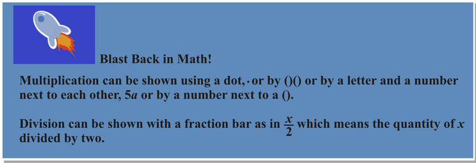

$10k - 44$ _if_ $k = 12$

**First, we substitute the 12 for the letter $k$.**

**10(12) – 44**

**Now we multiply 10 and 12 (following the order of operations), then we subtract 44.**

$$
120 - 44\!\\
76
$$

**Our answer is 76.**

**Sometimes, you will also have an expression to evaluate that uses division.**

**Example**

Evaluate the expression $\frac{x}{3}+ 2$ _if_ $x$ _is_ 24

**First, we substitute the 24 for $x$.**

$\frac{24}{3}+2$

**Next, we divide twenty-four by three.**

$24 \div 3 = 8$

**Now we add 2.**

$8 + 2 = 10$

**Our answer is 10.**

**1E. Lesson Exercises**

**Now it is your turn. Evaluate the following single-variable expressions.**

1.  $4x-9$ _if_ $x$ _is_ 20
2.  $5y+6$ _if_ $y$ _is_ 9
3.  $\frac{a}{4}-8$ _if_ $a$ _is_ 36

II. **Evaluate Multi-Variable Expressions with Given Values for the Variables**

Algebraic expressions can have more than one variable. Look at the following examples of multi-variable expressions.

$$
\begin{align*}
& xy + 4x\\
& mx + b\\
& 25r + (x - 7)\\
& x + y + z
\end{align*}
$$

When we know the value of the variables, we can evaluate multi-variable expressions the same way we evaluated single-variable expressions, by substituting the value for the variables in the expression and solving from left to right.

**Example**

Evaluate $xy + x$ _if_ $x = 2$ _and_ $y = 4.$

In this case we are only given one possible value for $x$ and $y$. We know that $x = 2$ and $y = 4$, we can evaluate the expression using the given values.

**First, we can rewrite the expression by substituting the given values into the expression.**

$$
\begin{align*}
& xy + x\\
& (2)(4) + 2
\end{align*}
$$

**We used the parentheses here to show multiplication. When two variables are next to each other it means multiplication. Here we used the parentheses because we needed to show multiplication between 2 and 4.**

**Now we can multiply first.**

$2 \times 4 = 8$

**Next, we add two.**

$8 + 2 = 10$

**Our answer is 10.**

Let’s look at another example where a given value is a fraction.

**Example 4**

Evaluate $mx + 3m$ _if_ $x = \frac{2}{3}$ _and_ $m = 9$.

**First, we substitute the given values into the expression.**

$9 \left(\frac{2}{3}\right)+3(9)$

**Do you remember how to multiply a whole number and a fraction?**

**9 becomes** $\frac{9}{1}$

**Now you multiply numerator $\times$ numerator and denominator $\times$ denominator.**

$\frac{9}{1} \cdot \frac{2}{3}$

**Next, we multiply the two fractions and simplify.**

$\frac{18}{3} = 6$

**Now we can substitute the 6 back into the expression.**

$6 + 3(9)$

**Next we multiply.**

$3(9) = 27$

**Finally, we add the numbers.**

$$
6 + 27\!\\
33
$$

**Our answer is 33.**

**1F. Lesson Exercises**

**Evaluate the following expressions using the given values.**

1.  $ab+7$ **_when_** $a$ **_is_** **9** **_and_** $b$ **_is_** **8**
2.  $xy+zx$ **_when_** $x$ **_is_** **2,** $y$ **_is_** **5** **_and_** $z$ **_is_** **7**
3.  $xy+x$ **_when_** $x$ **_is_** $\frac{1}{4}$, **_and_** $y$ **_is_** $\frac{4}{5}$

III. **Use Given Expressions to Analyze and Solve Real-World Problems**

When examining situations in the real world, we can use a variable to describe an unknown quantity. For example, let’s say that the bookstore sells boxes of pencils with 12 pencils in each box. Alicia bought several boxes of pencils. How many pencils did she buy all together?

In this situation, we know how many pencils are in each box, but we _don’t_ know how many boxes Alicia bought. Whenever we don’t know a quantity, we can give it a variable. In this case, we can give the number of boxes she bought a variable, such as $n$. Therefore, the expression $12n$ would represent the total number of pencils Alicia bought. When we find out the value of $n$ (_the number of boxes_), we will be able to evaluate the expression and find out the total number of pencils she bought. If we were to find out that $n = 6$, we would know that she bought 6 boxes of pencils and we would evaluate our expression by substituting the value of our variable into our expression.

$$
\begin{align*}
12n &= 12(6)\\
12n &= 72
\end{align*}
$$

Alicia bought 72 pencils.

Now let’s look at an example with two variables.

**Example**

The expression $8x + y$ can be used to describe how much money a waiter makes each day, if he earns $8.00 per hour, _if_ $x =$ _the number of hours worked and_ $y =$ _the amount made in tips._ On Monday, Mark worked 6 hours and made $12 in tips. How much did he make in all?

**In this problem, there are two variables representing unknown quantities.** $x$ is used to represent the number of hours a waiter works and $y$ is used to represent the amount of tips. We know the value of $x$ (6 hours), and we also know the value of $y$ ($12), so we can evaluate our expression to find out how much Mark made on Monday.

$$
\begin{align*}
8x + y &= 8(6) + 12 \\
8x + y &= 48 + 12 \\
8x + y &= 60
\end{align*}
$$

**The answer is $60.00**

**_Remember to add the dollar sign, because the answer is in dollars._**

**The example that you read in the introduction is an example of an expression for a real-life situation.**

IV. **Write Variable Expressions to Represent and Solve Real-World Problems**

Now that we know how to evaluate expressions, both alone and in relation to real-world problems, let’s use some familiar situations to write and evaluate our own variable expressions. The key to writing variable expressions is analyzing the information you have, identifying the information you need, and recognizing the terms that indicate which mathematical operation to use.

**Let’s imagine that Ralph is a baker who makes $l$ number of loaves of bread each day.**

* If he only sells half the loaves he makes, then he sells $\frac{l}{2}$.
* In 2 days, 3 days, 4 days, Ralph would make $2l, 3l$, and $4l$ loaves of bread.

**Now let’s go back to the introduction problem and apply all that we have learned about variable expressions to Kelly and her hiking.**

Real Life Example Completed
---------------------------

**_The Pre-Trip Meeting_**

After waiting for what seemed like an eternity, the day of Kelly’s pre-trip meeting finally arrived. She had been sent a list of recommended supplies that she needed to bring to the meeting, so that the leaders could check her gear. Kelly gathered her things and put everything in the family van. Then her Dad went with her to the pre-trip meeting. “I am so excited,” she said to her Dad on the way over.

The pre-trip meeting was great. Kelly met several other hikers. They would be organized into hiking groups later, so today they all sat together as one big crew. There were six leaders and thirty students with an even mix of boys and girls. While parents had coffee and tea, the leaders talked about trail safety, personal safety, and skills that they would learn. The leaders said that the students would be hiking about 6 hours per day with breaks.

“Wow,” thought Kelly “This is going to be something.” Each day the group would have a goal of where they would start and where they would stop.

“The distance traveled depends on the group,” said Scott one of the leaders. “If your group works well together, then you can cover about 1 – 2 miles per hour on flat terrain. If you are climbing higher ascents, then you may only cover $\frac{1}{2}$ mile to 2 miles per hour.”

On the way home, Kelly started thinking about those variables. It seemed to her like there could be a range of distances covered even if they were hiking 6 hours per day. Kelly took out a notebook and made some notes.

**_6 hours of hiking per day_**

$x$ **_number of miles hiked per hour_**

Kelly wants to figure out the number of miles possible when the rate of hiking is in the range of $\frac{1}{2}$ mile per hour and 2 miles per hour. She is sure that there is a way to do it using a variable and the six hours that the group will hike.

**First, let’s write an expression to show the number of hours hiking times the possible number of miles in an hour. Since the number of miles per hour can vary, we use the variable $x$ for this rate.**

$6x$

**The range of hiking rates can vary from $\frac{1}{2}$ mile per hour on the steepest terrain, to 2 miles per hour on flat terrain.**

**Kelly substitutes one-half for $x$ to figure out about how many miles they will cover if all six hours are spent hiking steep terrain.**

$6\left(\frac{1}{2}\right)= \frac{6}{2}=3 \ miles$

**Wow, on steep terrain the group will probably only cover about 3 miles in the entire day.** **Next, Kelly looks at medium terrain. She substitutes 1 mile per hour into the expression for $x$.**

$6(1)=6$ **_miles on medium terrain_**

**Finally, Kelly looks at flat terrain. She substitutes 2 miles per hour in for $x$.**

$6(2) = 12$ **_miles on flat terrain_**

**Kelly starts to think about this. It would be unlikely for the group to travel on all one type of terrain per day. So she writes this expression to show half the day on flat terrain and half the day on difficult terrain.**

$x=$ **_flat terrain_** $=2$ **_miles_**

$y=$ **_difficult terrain_** $=\frac{1}{2}$ **_mile_**

$$
\begin{align*}
& 3x+3y\\
& 3(2)+ 3\left(\frac{1}{2}\right)\\ 
& 6+1 \frac{1}{2} \ miles=7 \frac{1}{2} \ miles
\end{align*}
$$

**Kelly looks at this figure. While she is estimating travel time and distance per hour, she figures that the group may cover a little less than 7 and one-half miles per day, or a little more, but it is probably a good middle estimate for distance covered per day.**

Vocabulary
----------

Here are the vocabulary words that are found in this lesson.

__Algebraic Expression__

an expression that contains numbers, variables and operations.

__Variable__

a letter used to represent an unknown quantity.

__Variable Expression__

an algebraic expression that contains one or more variables.

Technology Integration
----------------------

!?[0](https://www.youtube.com/watch?v=UH0HuxtBhEM)

[Khan Academy Evaluating an Expression](http://www.youtube.com/watch?v=UH0HuxtBhEM)

!?[0](https://www.youtube.com/watch?v=vQT0e_p_Z8s)

[James Sousa, Evaluating Algebraic Expressions](http://www.youtube.com/watch?v=vQT0e_p_Z8s)

Time to Practice
----------------

Directions: Evaluate each expression if the given value of $r=9$.

1. $\frac{r}{3}$

2. $63-r$

3. $11r$

4. $2r+7$

5. $3r+r$

6. $4r-2r$

7. $r+5r$

8. $12r-1$

Directions: Evaluate each expression when $h=12$.

9. $70 - 3h$

10. $6h + 6$

11. $4h - 9$

12. $11 +  \frac{h}{4}$

13. $3h+h$

14. $2h+5h$

15. $6h-2h$

Directions: Evaluate each multi-variable expression.

16. Evaluate $xy + 9y$ _if_ $x = 3$ _and_ $y = 4$

17. Evaluate $2x+3y$ _if_ $x=10$ _and_ $y=5$

18. Evaluate $4y + 3y - 2z$ _if_ $y = 2$ _and_ $z = 4$

19. Evaluate $6z-2(z+x)$ _if_ $x$ _is_ 3 _and_ $z$ _is_ 4

20. Evaluate $8a + 3b - 2c$ _if_ $a$ _is_ 5, $b$ _is_ 4 _and_ $c$ _is_ 3

Directions: Use what you learned about variables and real-life situations for the next problems. Choose a variable to represent the number and write an algebraic expression for the following phrases.

21. 19 decreased by a number

22. 4 less than the product of 4 and a number

23. 30 more than a number

24. 12 more than 3 times a number

25. A number divided by seven

26. A librarian has 4 times as many mystery books as romances. She lends out 12 mysteries. How many mysteries does she have now if she started with 15 romances?

27. In Saturday’s basketball game, Roman scored a fourth of his team's points. If the team scored 48 points total, how many points did Roman score? Write an expression and solve.

28. At the garden show daffodil bulbs cost $3 and tulip bulbs cost $4. Latoya buys 7 tulip bulbs and twice as many daffodil bulbs as tulips bulbs. How much does she spend total? Write an expression and solve.

</article>

### 1.3 Using Exponents

<article>

Introduction
------------

**_Getting Ready_**

There was a lot to learn. As the leaders of Kelly’s group, Scott and Laurel began by having the hikers introduce themselves and share a little about their hiking experience. The hikers learned that the group would be taking it easy the first week while everyone got into shape and had a chance to get to know each other. The hiking would get more strenuous as the time went on.

After introductions, Scott and Laurel gave the campers two tents. Since there were five boys and five girls in each group, the team would need two tents. There would be times when they would be sleeping in cabins, but there also would be times where tents would be necessary.

Their first task was to set up the tent and figure out the square footage of the floor. The girls and boys were each given a Kelty Trail Dome 6.

Kelly and the other girls took one tent and began to take it out of its package. They were so excited that they did not pay attention and almost lost the directions. Luckily, Kara saw this and caught them before the wind did. Kelly read the directions. The tent was sized to sleep six so it would be perfect for the 5 girls and one of the leaders.

Dimensions of the floor $= 120^2$ square inches

Kelly and Jessica looked at the dimensions. Who would have thought that they would be solving math problems when hiking! Jessica took out a piece of paper and began working on the problem.

$120^2$ **square inches is a measurement that has an exponent. To figure out the dimensions of the floor of the tent Kelly and Jessica will need to know how to work with exponents. In this lesson you will learn all about exponents. By the end of this lesson, you will know how to help Kelly and Jessica figure out the area of the tent floor.**

**_What You Will Learn_**

In this lesson you will learn the following skills:

* Identify whole number powers, bases and exponents.
* Evaluate powers with variable bases.
* Write variable expressions involving exponents to represent and solve real-world problems.

**_Teaching Time_**

I. **Identify Whole Number Powers, Bases and Exponents**

Sometimes, we have to multiply the same number several times. We can say that we are multiplying the number by itself in this case.

$4 \times 4 \times 4$ is 4 multiplied by itself three times.

When we have a situation like this, it is helpful to use a little number to show how many times to multiply the number by itself. That little number is called an **_exponent._**

If we were going to write $4 \times 4 \times 4$ with an exponent, we would write $4^3$. This lesson is all about exponents. By the end of it, you will how and when to use them and how helpful this shortcut is for multiplication.

Using exponents has an even more technical term also. We can say that we use **_exponential notation_** when we express multiplication in terms of exponents.

We use **_exponential notation_** to write an expanded multiplication problem as a base number with an exponent, we write $4 \times 4 \times 4$ with an exponent $= 4^3$

We can work the other way around too. We can write a number with an exponent as a long multiplication problem and this is called **_expanded form._**

The **_base_** number is the number being multiplied by itself; in this case the base is 4.

The **_exponent_** tells how many times to multiply the base by itself; in this case it is 3.

Using an exponent can also be called “raising to a power.” The exponent represents the power.

**Here $4^3$ would be read as “Four to the third power.”**

Let’s look at an example.

Example

Write the following in exponential notation: $6 \times 6 \times 6 \times 6$

**Exponential Notation means to write this as a base with an exponent.**

**Six multiplied by itself four times** $= 6^4$

**This is our answer.**

Example

Write the following in expanded form: $5^3$

**Expanded form means to write this out as a multiplication problem.**

$5 \times 5 \times 5$

**This is our answer.**

**We can also evaluate expressions to find a single value.**

Example

$4^3$

**Our first step is to write it out into expanded form.**

$4 \times 4 \times 4$

**Now multiply.**

$4 \times 4 = 16 \times 4 = 64$

**Our answer is 64.**

Here is one more that is a little harder. It is an example that is an expression with two terms.

Example

$2^3+4^2$

**To evaluate this expression, write it out in expanded form.**

$(2)(2)(2) + (4)(4)$

**Now multiply each part of the expression and add the results.**

$$
8 + 16\!\\
24
$$

**Our answer is 24.**

**1G. Lesson Exercises**

1.  **Write the following in exponential notation:** $3 \times 3 \times 3 \times 3 \times 3$
2.  **Write in expanded form and then evaluate the expression:** $6^3$
3.  **Evaluate:** $4^3-5^2$

II. **Evaluate Powers with Variable Bases**

When we are dealing with numbers, it is often easier to just simplify. It makes more sense to deal with 16 than with $4^2$. Exponential notation really comes in handy when we’re dealing with variables. It is easier to write $y^{12}$ than it is to write $yyyyyyyyyyyy$.

.**")

Example

Write the following in expanded form: $x^5$

**To write this out, we simply write $x$ five times.**

$x^5=xxxxx$

We can work the other way too by taking an variable expression in expanded form using repeated multiplication and write it in exponential form.

Example

$aaaa$

**Our answer is** $a^4$.

**What about when we multiply two variable terms with exponents?**

To do this, we are going to need to follow a few rules. Let’s look at an example and then work through it.

Example

$(m^3)(m^2)$

**The first thing to notice is that these terms have the same base. Both bases are m’s. Because of this, we can simplify the expression quite easily.**

**Let’s write it out in expanded form.**

$mmm(mm)$

**Here we have five $m$’s being multiplied, so our answer is** $m^5$.

Here is the rule.

Example

$(x^6)(x^3)$

**The bases are the same, so we add the exponents.**

$x^{6+3}= x^9$

**This is the answer.**

**In these examples we multiplied two exponential terms. We can also have an exponential term raised to a power. When this happens, one exponent is outside the parentheses. This means something different.** Take a look at this example.

Example

$(x^2)^3$

**Let’s think about what this means. It means that we are multiplying $x$ squared by itself three times. We can write this out in expanded form as:**

$(x^2)(x^2)(x^2)$

**Now we are multiplying three bases that are the same, so we use Rule 1 and add the exponents.**

**Our answer is** $x^6$.

**We could have multiplied the two exponents in the beginning.**

$(x^2)^3= x^{2(3)} =x^6$

This is Rule 2.

")

\[Figure 6\]

**Example**

Simplify $x^0$

**Our answer is** $x^0 = 1$

**Anything to the power of 0 equals 1.**

**1H. Lesson Exercises**

1.  **Write the following in exponential form:** $aaaaaaa$
2.  **Simplify:** $(a^3)(a^8)$
3.  **Simplify:** $(x^4)^2$

III. **Write Variable Expressions Involving Exponents to Represent and Solve Real-World Problems**

The hikers in the beginning of the lesson were learning to use exponents in figuring out their tent dimensions. We can also look at a problem with swimmers to see how exponents are featured in real life examples.

Jessica swam four miles during the first week of swim camp. Every week thereafter, she increased the number of miles that she swam by four times. How many miles did Jessica swim during the fourth week?

**To work through this problem let’s create a list of mileage.**

Week $1 = 4 \ \text{miles}$

Week $2 = 4 \times 4$

Week $3 = 4 \times 4 \times 4$

Week $4 = 4 \times 4 \times 4 \times 4$

**We can use exponents to show Jessica’s mileage for week 4.**

$4 \times 4 \times 4 \times 4 =  4^4$

**Jessica swam 256 miles during the fourth week.**

Real Life Example Completed
---------------------------

**_Getting Ready_**

On the first day of Teen Adventure, Kelly thought they would be hiking, but when the group assembled at the Lafayette Place Campground she realized that there was a lot to do before they could begin hiking. First, the leaders organized each group into 10 hikers with 2 leaders each. Then the leaders split off with their groups to do some training.

There was a lot to learn. As the leaders of Kelly’s group, Scott and Laurel began by having the hikers introduce themselves and share a little about their hiking experience. The hikers learned that the group would be taking it easy the first week while everyone got into shape and had a chance to get to know each other. The hiking would get more strenuous as the time went on.

After introductions, Scott and Laurel gave the campers two tents. Since there were five boys and five girls in each group, the team would need two tents. There would be times when they would be sleeping in cabins, but there also would be times where tents would be necessary.

Their first task was to set up the tent and figure out the square footage of the floor. The girls and boys were each given a Kelty Trail Dome 6.

Kelly and the other girls took one tent and began to take it out of its package. They were so excited that they did not pay attention and almost lost the directions. Luckily, Kara saw this and caught them before the wind did. Kelly read the directions. The tent was sized to sleep six so it would be perfect for the 5 girls and one of the leaders.

Dimensions of the floor $= 120^2$ square inches

Kelly and Jessica looked at the dimensions. Who would have thought that they would be solving math problems when hiking! Jessica took out a piece of paper and began working on the problem.

**First, notice that the measurement is in square inches, not square feet. Our final answer needs to be in square footage, so while figuring out these dimensions, the girls will need to convert the measurement to feet.** **The area of a square is one place where we use exponents all the time. The length of one side of a square is called $s$, so we can write $s^2$ to find the area of a square. Since the tent floor is square, the dimensions have been written in square inches.**

**Since the girls need to find the floor area in square feet, instead of square inches, the decide to first convert each dimension from inches to feet. Since there are 12 inches in 1 foot, the girls divide each side by 12 and come up with:**

120 inches divided by 12 equals 10 feet

Now they use the new information to multiply the dimensions of each side and get:

10 feet times 10 feet (or 10 feet squared) = 100 square feet

**Exponents are very useful when working with area!**

Vocabulary
----------

Here are the vocabulary words that are found in this lesson.

__Exponent__

a little number that tells you how many times to multiply the base by itself.

__Base__

the big number in a variable expression with an exponent.

__Exponential Notation__

writing multiplication using a base and an exponent

__Expanded Form__

Removing the exponent from a base and writing out the expression using repeated multiplication.

Technology Integration
----------------------

!?[0](https://www.youtube.com/watch?v=kITJ6qH7jS0)

[Khan Academy Exponent Rules Part 1](http://www.youtube.com/watch?v=kITJ6qH7jS0)

!?[0](https://www.youtube.com/watch?v=Kr16rdBMX4o)

[Just Math Tutoring, Working with Exponents](http://www.youtube.com/watch?v=Kr16rdBMX4o)

!?[0](https://www.youtube.com/watch?v=j_Eb5FsgJLY)

[James Sousa, Exponential Notation](http://www.youtube.com/watch?v=j_Eb5FsgJLY)

!?[0](https://www.youtube.com/watch?v=tiCDXxk-Zbs)

[James Sousa, Example of Writing Repeated Multiplication Using Exponents](http://www.youtube.com/watch?v=tiCDXxk-Zbs)

!?[0](https://www.youtube.com/watch?v=KOnQpKSpVRo)

[James Sousa, Expanding and Evaluating Exponential Notation](http://www.youtube.com/watch?v=KOnQpKSpVRo)

!?[0](https://www.youtube.com/watch?v=ESll81x3CSE)

[James Sousa, Simplifying Exponential Expressions - Product and Power Rules](http://www.youtube.com/watch?v=ESll81x3CSE)

Time to Practice
----------------

Directions: Name the base and exponent in the following examples. Then write in expanded form and write how to “read” the exponential notation, for example: "four to the fifth power".

1. $4^5$

2. $3^2$

3. $5^8$

4. $4^3$

5. $6^3$

6. $2^5$

7. $1^{10}$

Directions: Evaluate each expression.

8. $2^3$

9. $4^2$

10. $5^2$

11. $9^0$

12. $5^3$

13. $2^6$

14. $3^3$

15. $3^2+4^2$

16. $5^3+2^2$

17. $6^2+2^3$

18. $6^2-5^2$

19. $2^4-2^2$

20. $7^2+3^3+2^2$

Directions: Simplify the following variable expressions.

21. $(m^2)(m^5)$

22. $(x^3)(x^4)$

23. $(y^5 )(y^3)$

24. $(b^7 )(b^2)$

25. $(a^5 )(a^2)$

26. $(x^9 )(x^3)$

27. $(y^4 )(y^5)$

Directions: Simplify.

28. $(x^2 )^4$

29. $(y^5 )^3$

30. $(a^5 )^4$

31. $(x^2 )^8$

32. $(b^3 )^4$

</article>

### 1.4 Order of Operations

<article>

Introduction
------------

**_Dividing up the Groups_**

The night before their first hike, the group leaders told them that they would be divided up into hiking groups. Each week they would meet altogether once again to talk about their adventures, but during the actual week each group would be on a different trail. There would be three groups out of the 30 students. The 6 leaders would be divided into the 3 groups. For the first few days, there would be a manager along and two first-aid persons. After the first few days, the manager and the two first aid persons would head back to the base office to be checked in with weekly or in case of emergency. So they would start with one number of people and after the first few days the number would change.

Kelly is curious about how many people will start and how many will be together after the first few days.

**This is where you come in. You can write an expression to figure this out-using grouping symbols and the order of operations you should be able to calculate two different group numbers. This lesson will teach you all that you need to know. Pay attention because you will see this problem once again.**

**_What You Will Learn_**

In this lesson you will learn to perform the following tasks.

* Evaluate variable expressions involving the four arithmetic operations.
* Evaluate variable expressions involving powers and grouping symbols.
* Write variable expressions to represent real-world problems using order of operations.

**_Teaching Time_**

I. **Evaluate Variable Expressions Involving the Four Arithmetic Operations**

To begin this lesson, you have to think back to last year in math. Think back to last year in math, do you remember using the order of operations to evaluate **_numerical expressions_**? Remember that a numerical expression is an expression that has numbers and operations in it. Let’s review with an example.

Example

$2 + 3 \times 5$

**We could evaluate this expression in two different ways.**

**The first way would be to simply perform the operations in order from left to right.**

$2 + 3 = 5 \times 5 = 25$

**Let’s use the order of operations as we evaluate this expression a second way.**

$2 + 3 \times 5$

")

\[Figure 4\]

**Good, now we can apply this information to our example.**

$2 + 3 \times 5$

**We multiply first.**

$$
3 \times 5 = 15\!\\
2 + 15 = 17
$$

**Our answer is 17.**

**We can apply this information to variable expressions. How can we do that?**

Remember that a **_variable expression_** has variables, numbers, operations and sometimes exponents in it. **We can start by thinking about evaluating variable expressions.** When we evaluate a variable expression, we are finding the value of that expression. If given a value for a variable, we substitute the numerical value of the variable into the expression. Then we can find the total value of the expression.

**Some variable expressions will have more than one variable in it. We can evaluate the expression if we have been given values for each of the variables.**

Example

Evaluate the expression: $4b+12 \div 4-8$ _if_ $b=6$

**First, we substitute the given value in for the variable.**

$4(6)+ 12 \div 4-8$

**Next, we perform multiplication and division in order from left to right.**

$24 + 3 - 8$

**Now we add and subtract in order from left to right.**

$27 - 8 = 19$

**Our answer is 19.**

That example had one variable in it. Here is an example that has two variables in it.

Example

Evaluate the expression: $\frac{21}{x}-7+8y$ _if_ $x=3$ _and_ $y=4$

**First, we substitute the given values for $x$ and $y$ into the expression.**

$\frac{21}{3}-7+8(4)$

**Next, we perform multiplication and division in order from left to right.** Notice that this problem has a fraction bar in it which means division.

$7-7+32$

**Now we add and subtract in order from left to right.**

$0 + 32 = 32$

**Our answer is 32.**

**1I. Lesson Exercises**

**Evaluate the following variable expressions by following the order of operations.**

1.  $5a+6 \div 2+9$ _if_ $a$ _is_ 5
2.  $7x+14 \div 7-3$ _if_ $x$ _is_ 4
3.  $\frac{48}{x}+ 5y-7$ _if_ $x$ _is_ 6 _and_ $y$ _is_ 9

II. **Evaluate Variable Expressions Involving Powers and Grouping Symbols**

Now that we know the basic order of operations, we can expand our rules to include evaluation of more complicated expressions. In intricate expressions, **_parentheses_** are used as grouping symbols. Parentheses indicate which operations should be done first. In the order of operations, operations within the parentheses are _always_ first.

Remember how to simplify and evaluate exponents? $x^3 = xxx$. Exponential notation is another factor we must account for in the order of operations. After completing the operations in parentheses, we then evaluate the exponents. Then we complete the multiplication and division from left to right; finally, we complete the addition and subtraction from left to right. The chart below shows the complete order of operations. If you keep the order of operations in the forefront of your mind and are careful to take each step one at a time and show your work, evaluating complex expressions using the order of operations will become second nature.

**Let’s look at the order of operation once again.**

Evaluate the expression: $2x^2-(x+7)$ _if_ $x=4$

**First, we substitute 4 in for $x$.**

$2(4^2)-(4+7)$

**Next, we add the terms in parentheses. Since parentheses is the first order of operations.**

$2(4^2)-(11)$

**Now we can evaluate the exponent.**

$2(16) - 11$

**Multiplication is next and there is no division.**

$32 - 11$

**Finally, we complete with subtraction since there is no addition.**

**21**

**Our answer is 21.**

**Sometimes you will also evaluate expressions with more than one variable. Just keep track and follow the order of operations and you will be set.**

**1J. Lesson Exercises**

1.  **Evaluate** $3x^2-2+(x+3)$ **_if_** $x$ **_is_** **2**
2.  **Evaluate** $\frac{24}{x}+ (9-x)+y^2$ **_if_** $x$ **_is_** **3** **_and_** $y$ **_is_** **4**

III. **Write Variable Expressions to Represent and Solve Real-World Problems Using Order of Operations**

When writing variable expressions to solve real-world problems, the most important part is translating the wording of the problem into a numeric expression. The first step is to read the problem in its entirety. Then we need to analyze the problem and decipher the mathematical relationships involved.

Lydia and Bart both work at a bookstore. Lydia makes $x$ amount each hour; Bart has more experience, so he makes 1.5 times more than Lydia makes each hour. If Lydia and Bart both work 4 hours a day, how much will they make together in seven days if Lydia makes $8 an hour. Write an expression; then solve.

In this problem, $x$ stands for the amount Lydia makes per hour. Because Bart makes 1.5 times the amount that Lydia makes per hour, then $1.5x$ describes how much Bart makes per hour. The total Lydia and Bart make in 1 hour is therefore $(x + 1.5x)$. Now the problem tells us that Lydia and Bart each work 4 hours per day. So, the amount they both make in 1 day is $4(x + 1.5x)$. We want to find out how much they make in 7 days, so our expression is $7 \times 4(x + 1.5x)$. The problem gives us the value of $x$. Lydia makes $8 an hour. We substitute 8 for the variable in our expression and solve using the order of operations. Remember: parenthesis, exponents, multiplication, division, addition, subtraction.

$$
\begin{align*}
7 \times 4(x + 1.5x) &= 7 \times 4(8 + 1.5 \times 8)\\
7 \times 4(x + 1.5x) &= 7 \times 4(8 + 12)\\
7 \times 4(x + 1.5x) &= 7 \times 4(20)\\
7 \times 4(x + 1.5x) &= 560
\end{align*}
$$

**The answer is $560.00.**

**_Remember to add the dollar sign, because the answer is in dollars._**

Now let’s look at the introductory problem with our hikers and use what we have learned to solve this problem.

Real Life Example Completed
---------------------------

**_Dividing up the Groups_**

The first few days of Teen Adventure were spent at the base of the White Mountains in the Lafayette Place Campground. There the teens worked on survival skills, map skills, and basic first aid. The students were kept all together and Kelly made some terrific new friends. Her favorite part was all of the team building and trust building exercises that they learned. She even surprised herself by being able to complete some tasks that she wasn’t sure that she could do. Kelly and the other students learned to rely on themselves and each other over those first few days.

The night before their first hike, the group leaders told them that they would be divided up into hiking groups. Each week they would meet altogether once again to talk about their adventures, but during the actual week each group would be on a different trail. There would be three groups out of the 30 students. The 6 leaders would be divided into the 3 groups. For the first few days, there would be a manager along and two first-aid persons. After the first few days, the manager and the two first aid-persons would head back to the base office to be checked in with weekly or in case of emergency. So they would start with one number of people and after the first few days the number would change.

Kelly is curious about how many people will start and how many will be together after the first few days.

**First, let’s work with the numbers involved.**

**30 students**

**6 group leaders**

**1 manager**

**2 first aid persons**

**Now we can write an expression to show how one group is created out of the whole.**

$30 \div 3+6 \div 3$

**Next, we solve it for the number of students and leaders per group. Remember to follow the order of operations.**

$10 + 2 = 12$ **persons**

**For the first few days, there will also be a manager and two first aid persons.**

$12 + 1 + 2$

**15 people in a group for the first few days.**

**Then the manager and two first aid persons leave.**

$15 - 3 = 12$

**The core group will consist of 12 people.**

Vocabulary
----------

Here are the vocabulary words that are found in this lesson.

__Numerical Expression__

an expression that uses numbers and operations.

__Variable Expression__

an expression that uses numbers, variables and operations.

__Parentheses__

grouping symbols, the first step of the order of operations.

__Exponent__

the little number that tells how many times to multiply the base times itself.

__Order of Operations__

the order in which you perform each operation when evaluating an expression.

Technology Integration
----------------------

!?[0](https://www.youtube.com/watch?v=ClYdw4d4OmA)

[Khan Academy, Order of Operations](http://www.youtube.com/watch?v=ClYdw4d4OmA)

!?[0](https://www.youtube.com/watch?v=_tHQgBt1KQ4)

[James Sousa, Order of Operations - The Basics](http://www.youtube.com/watch?v=_tHQgBt1KQ4)

Other Videos:

http://www.mathplayground.com/howto_pemdas.html – This is a video on order of operations known as PEMDAS.

Time to Practice
----------------

Directions: Use the order of operations to evaluate each numerical expression.

1. $5 + 3 \times 4$

2. $6 \times 2 + 5 \times 3$

3. $4 + 5 \times 2 - 9$

4. $4 + 6 \div 2 + 10 - 3$

5. $8 - 15 \div 3 + 4 \times 5$

Directions: Evaluate the following variable expressions if $x=4, y=2, z=3$

6. $x^2+ y$

7. $2y^2+ 5-2$

8. $x^2- y^2+ z$

9. $3x^2+ 2x^2$

10. $8+ x^2- 4y$

11. $14 \div 2+ z^2- y$

12. $20 + z^2-y$

13. $5x-2y+3z$

14. $5+(x-z)+ 5(6)$

15. $8 + x-y^2+z$

16. $(x+y)+ 5 \cdot 2 - 3$

17. $4x^2+3z^3+ 2$

Directions: Use what you have learned to answer the following questions as either true or false.

18. Parentheses are a grouping symbol.

19. Exponents can’t be evaluated unless the exponent is equal to 3.

20. If there is multiplication and division in a problem you always do the division first.

</article>

### 1.5 Using Equations

<article>

Introduction
------------

**_GORP_**

The leaders gave Travis and Henry, two of the boys in Kelly’s group, a scoop, a scale, some gallon plastic bags and 18 pounds of GORP. Travis and Henry have to split up the GORP into bags so that each member of the group has the same amount. They have to be sure, when they split it, to remember to prepare bags for the two leaders as well.

How much GORP should go into each bag?

Travis and Henry grab a piece of paper and a pencil and begin working this out. They think they have it!

**Wait a minute! An equation would be very helpful here. This lesson is all about writing and solving equations. You will learn all about equations and then revisit this problem at the end of the lesson.**

**_What You Will Learn_**

In this lesson you will complete the following tasks.

* Solve single-variable addition and subtraction equations using mental math.
* Solve single-variable multiplication and division equations using mental math.
* Model and solve real-world problems using simple whole number equations.

**_Teaching Time_**

I. **Solve Single-Variable Addition and Subtraction Equations Using Mental Math**

We have been working with **_algebraic expressions._** Remember that algebraic expressions combine numbers, variables and operations together. When given the value of a variable, we can evaluate any expression.

Take the following example: $10r + 11$.

If $r = 22$, we substitute the value of the variable into the expression and evaluate.

Be careful to follow the order of operations.

$$
\begin{align*}
&10r + 11 = 10(22) + 11\\
&220 + 11\\
&231
\end{align*}
$$

**The answer is 231.**

An **_equation_** is a mathematical statement that two expressions are equal. The key thing to notice in an equation is that there is an equals sign.

For example, we can say that

$15 + 7 = 24 - 2$

Since both sides of the equation equal 22, these equations are **_equivalent_**.

$15 + 7 = 22$ and $24 - 2 = 22$

A **_variable equation_** is an equation that includes an algebraic unknown, or a variable. If you think about this it makes perfect sense. We have an unknown in an equation so we use a variable to represent the unknown quantity. We call this a variable equation.

Take a look at some of these variable equations:

$$
\begin{align*}
15t &= 45 \\
12 &= x + 9\\
6^x &= 216\\
25 &= 3(x - 7) + 1
\end{align*}
$$

**In variable expressions, we used the value of the variable to evaluate.**

**Variable equations are different because with equations we already** **_know_** **the value of one side of the equation.**

**When we have a variable equation, we can solve the equation to figure out the value of the variable.**

Remember, an equation states that two expressions are equal.

When we **solve** a variable equation, we are finding the value of the variable that makes the equation true. Take a look at the following variable equation.

Example

$y + 10 = 15$

The equal sign tells us that $y + 10$ and 15 have the same value.

Therefore, the value of $y$ must be a number that, when added to 10, equals 15.

What could be the value of $y$?

We can ask ourselves, “What number plus ten is equal to fifteen?”

**You can use mental math to determine that $y = 5$ because $5 + 10 = 15$.**

**One advantage of working with equations is that you can always check your work.**

**Think of it like a balance.**

**When you think you know the value of a variable, plug it into the equation.**

**If your value for the variable is the correct one, both sides will be equal.**

**The two expressions will balance!**

**The first example had addition in it, what about subtraction?**

You can work on a subtraction equation in the same way. Let’s look at an example.

Example

$x-5=10$

This is an equation once again. We want to figure out what number, minus five, is equal to ten. That way both sides of the equations will be equal and be balanced. We ask ourselves the question, “What number take away five is equal to 10?”

**We can use mental math to figure out that $x$ is equal to 15.** When working with small numbers, mental math is the quickest way to figuring out the value of the variable.

**Now let’s check our answer.** To do this we substitute our answer for $x$ back into the equation and see if both sides are equal.

$$
\begin{align*}
15-5 &= 10. 
10 &= 10
\end{align*}
$$

**Solving equations is often called BALANCING EQUATIONS for this very reason!!**

**1K. Lesson Exercises**

**Practice using mental math to solve each equation.**

1.  $x+5=12$
2.  $x-3=18$
3.  $6 - y = 4$

II. **Solve Single-Variable Multiplication and Division Equations Using Mental Math**

We have just demonstrated how to solve single-variable addition and subtraction equations. To solve variable equations using multiplication and division we follow the same procedure. First, we examine the problem and use mental math.

Let’s look at an example.

Example

$9p=72$

**Here is a multiplication problem. Whenever you see a variable next to a number it means multiplication. Here we need to figure out, “What number times 9 is equal to 72?”**

**Using mental math and division, you can see that $p$ is equal to 8.**

**Now let’s check our answer.** We do this by substituting the value of the variable, 8, back into the original problem.

$$
\begin{align*}
9(8) &= 72. 
72 &= 72
\end{align*}
$$

**One side of the equation is equal to the other side, so our equation balances! Our work is complete and accurate.**

**We can apply mental math when solving division problems too. Remember that a fraction bar means division, so when you see one you know that you are going to be dividing.**

Example

$\frac{x}{3}=4$

**Remember that when the variable is on top of the fraction bar that we are dividing the bottom number into this number. So we ask ourselves, “What number divided by three is equal to four?”**

**We use mental math, and our knowledge of the times table, to figure this out. Our missing value is 12.**

**Next, we can check our work.** We substitute 12 back into the equation for the variable $x$.

$$
\begin{align*}
\frac{12}{3} &= 4. 
4 &= 4
\end{align*}
$$

**One side of the equation is equal to the other side, so our equation balances! Our work is complete and accurate.**

**1L. Lesson Exercises**

**Practice solving these equations.**

1.  $5y=20$
2.  $6g = 42$
3.  $\frac{x}{7}=49$

III. **Model and Solve Real – World Problems Using Simple Whole Number Equations**

We can use all of this information when working with real-life problems. The key is going to be in deciphering whether the equation is an addition equation, a subtraction equation, a multiplication equation or a division equation. Once you figure out the operation in the equation, you can work on naming the variable and solve the equation.

Let’s look at an example.

Example

There are 63 players in the symphony orchestra. 29 of these players are women. How many players in the orchestra are men? Write a variable equation and solve.

**In this problem, we are trying to find the number of men in the orchestra, so let’s give this value the variable $x$.** The problem tells us the number of women in the orchestra as well as the total number of players. We know that the number of men players **_plus_** the number of women players will equal the total number of players, so we can write the equation, $x + 29 = 63$. **Notice that plus is a key word that means addition.** Now we can solve for the value of $x$.

Using mental math, and what we know about "fact families", we can look at the problem and know that because a number (x) + 29 = 63, that if we subtract the number 29 from 63 we get 34. We check our answer by adding 34 + 29 to see if they equal 63. They do, so we know that we have found the correct answer.

**There are 34 players in the orchestra that are men.**

Here is another example.

Example

Alyssa sold $120 in raffle tickets. If each ticket costs $6, how many tickets did she sell? Write a variable equation and solve.

**This problem will involve multiplication because the number of tickets times the cost of each ticket will equal the amount of money Alyssa made.** Let’s let $y$ represent the number of tickets Alyssa sold. The equation is $6y = 120$.

Using mental math, you should see the relationship between 6 and 120 is similar to the relationship between 6 and 12.

$$
\begin{align*}
6 \times 2 &= 12\\
6 \times 20 &= 120\\
y &= 20
\end{align*}
$$

**Alyssa sold 20 raffle tickets. This is our answer.**

**Writing an equation can help you solve all kinds of real life problems. Remember the hikers? Let’s revisit the problem from the beginning of the lesson and see how we can use an equation to work it out.**

Real Life Example Completed
---------------------------

**_GORP_**

**First, let’s work on writing an equation.** **There are 10 kids per group + 2 leaders = 12 total members of the group.** **There are 18 lbs of GORP.**

$12x=18$

$x =$ **the number of pounds of GORP per person**

**We can use guess and check to solve this problem. One pound is too small-that would only be 12 pounds of GORP and we have 18 pounds.** **How about 1.5 pounds?** **To do this, we multiply** $12 \times 1.5$.

$$
\begin{align*}
& \quad \ 12\\
&\underline{\times \ 1.5\;}\\
&  \quad \ 18
\end{align*}
$$

**Each person will have 1.5 pounds of GORP in their bag.**

Vocabulary
----------

Here are the vocabulary words that are part of this lesson.

__Algebraic Expression__

an expression that contains a combination of numbers, variables and operations. It does not have an equals sign.

__Equation__

a number sentence with two expressions divided by an equal sign. One quantity on one side of the equation equals the quantity on the other side of the equation.

__Variable Equation__

an equation where a variable is used to represent an unknown quantity.

Technology Integration
----------------------

!?[0](https://www.youtube.com/watch?v=9Ek61w1LxSc)

[Khan Academy Simple Equations](http://www.youtube.com/watch?v=9Ek61w1LxSc)

!?[0](https://www.youtube.com/watch?v=XoEn1LfVoTo)

[Khan Academy Equations 2](http://www.youtube.com/watch?v=XoEn1LfVoTo)

http://www.mathplayground.com/mv_defining_variables.html – This is a video on defining and identifying variables.

**_Resources_**

You can read about teen hiking and GORP at a few websites.

http://walking.about.com/cs/snacks/a/recipetrailmix.htm – Here is a recipe for making your own GORP. For allergies, substitute something else in the mix.

http://www.outdoors.org/recreation/twa/index.cfm – Here is some information about some of the information necessary for teens when hiking in a teen adventure program.

Time to Practice
----------------

Directions: Use mental math to solve each addition or subtraction equation.

1. $x+2=7$

2. $y+5=10$

3. $a+7=20$

4. $b+8=13$

5. $z+10=32$

6. $s+14=26$

7. $4+y=8$

8. $6 + x = 21$

9. $17 + a = 23$

10. $18 + b = 30$

11. $12 + x = 24$

12. $13 + y = 18$

13. $15 + a = 22$

14. $x + 17 = 24$

15. $y + 3 = 45$

16. $x - 4 = 10$

17. $y - 8 = 20$

18. $5 - y = 2$

19. $22 - a = 15$

20. $18 - y = 2$

Directions: Use mental math to solve each multiplication or division equation.

21. $5x = 25$

22. $6x = 48$

23. $2y = 18$

24. $3y = 21$

25. $4a = 16$

26. $13b = 26$

27. $15a = 30$

28. $15x = 45$

29. $\frac{x}{2}=3$

30. $\frac{x}{4}=5$

31. $\frac{x}{3}=11$

32. $\frac{x}{5}=12$

33. $\frac{x}{7}=8$

34. $\frac{x}{8}=9$

35. $\frac{x}{3}=12$

</article>

### 1.6 Using Formulas

<article>

Introduction
------------

**_Shelter Repair at the Lonesome Lake Hut_**

Their group leaders, Scott and Laurel, told them that their first stop would be the Lonesome Lake Hut. The AMC has huts stationed all through the White Mountains. Some of them are even at the top of mountains. These huts have beds, some have full kitchens, some have self-service kitchens. Hikers of all different kinds stay at the huts. The Lonesome Lake Hut is located at 2,760 feet and the trail is 1.5 miles long. It would be one of the easier hikes they would go on.

Scott told the group that they would be helping to repair the floor of the main house. It seemed that there was some water damage. The roof had been repaired but the floor needed work.

The group hiked the beautiful, relatively easy trail in about an hour and a half. When they arrived, they were delighted to see everything. After unpacking in the bunkhouse and getting some lunch, the hikers went to work.

The crew leader at the hut told the students that the floor was damaged during the winter. The area of the floor was 90,720 square feet and one quarter of the floor needed to be fixed. That is an area of 22,680 square feet and a length of 90 ft.

If the length is 90 ft, and the area is 22,680 square feet, what is the width of the area that needs repair?

**To figure this out, you will need to learn about formulas and working backwards. Pay attention and you will learn how to solve this problem by the end of the lesson.**

**_What You Will Learn_**

By the end of this lesson you will be able to perform the following skills.

* Choose appropriate tools and units for given measurement situations involving squares and rectangles.
* Find perimeter and area of squares and rectangles using formulas.
* Solve for unknown dimensions using formulas, given perimeter or area.
* Solve real-world problems involving perimeter and area, including irregular figures made of rectangles and squares.

**_Teaching Time_**

I. **Choose Appropriate Tools and Units for Given Measurement Situations Involving Squares and Rectangles**

**_Measurement_** **is the system of comparing an object to a standard.** 1 pound, 1 yard, and 1 liter are just a few of the standards we use. Measuring the weight of a bunch of bananas against 1 pound, the length of a football field against 1 yard, or the amount of milk needed to make a cake against 1 liter helps us understand the quantities we encounter in all aspects of our lives.

**We can measure the size, the weight or the capacity of different items.**

**When we measure, we can use two different measurement systems.**

1.  **Customary System** – the **_Customary System_** is one that you are very familiar with. We use it all the time here in the United States. The customary system uses units such as inch, foot, yard, pint, ounce, quart, pound and ton.
2.  **Metric System** – the **_Metric System_** is a system used outside of the United States. Here in the US, we use often use metrics in science. Common units in the Metric System are millimeter, liter, gram and kilogram.

**In this lesson, we will look at measuring length and distance, which are really the same thing but have different names based on how and where they are used.**

**Customary units of length/distance are inch, foot, yard and mile.**

**Metric units of length are millimeter, centimeter, meter and kilometer.**

**Measuring length always involves tools. There are a variety of tools to choose from when measuring length.**

**The goal in choosing a measurement tool and unit is to find the standard that most closely matches the thing you are measuring. For example, you wouldn’t want to measure the length of a city block in inches because the number would be too large and difficult to manage.**

**This table can give you an idea of how the different units of measurement relate to each other. Clearly an inch is smaller than a foot, just like a centimeter is smaller than a kilometer. Using this table will help you to choose appropriate units when measuring.**

**Customary Units of Length**

$$
\begin{align*}
& \text{inch} \ (in)\\
& \text{foot} \ (ft) && 12 \ inches\\
& \text{yard} \ (yd) && 3 \ feet\\
& \text{mile} \ (mi) && 5,280 \ feet
\end{align*}
$$

**Metric Units of Length**

$$
\begin{align*}
& \text{millimeter} \ (mm) && \frac{1}{10} \ centimeter\\
& \text{centimeter} \ (cm) && \frac{1}{100} \ meter\\
& \text{meter} \ (m)\\
& \text{kilometer} \ (km) && 1,000 \ meters
\end{align*}
$$

Example

Here are some items and the best units to use in measuring the length or width of them.

a) Width of a sandbox - it would be best measured in feet, yards or meters.

b) Length of a book - it would be best measured in inches or centimeters.

c) Width of a swimming pool - it would be best measured in feet, yards or meters.

d) The length of a city street - it would be best measured in miles or kilometers.

**Once you have determined the appropriate unit of measurement, you have to move on to selecting an appropriate tool.**

When measuring a small item, it is best to use a ruler whether it is in metrics or customary units. Rulers are used to measure inches, centimeters or millimeters.

")

\[Figure 3\]

**What about squares or rectangles?**

**What size measurements should be used?** When we measure squares or rectangles (or any other shape), we will have to choose appropriate units of measure and appropriate tools. For example, look at this small square and determine which tool would be easiest to measure it with.

If we had a large item, such as a pool, measuring the length and width would be quite different.

It would make sense to measure the **_perimeter_** or edge of the pool in feet or meters.

**1M. Lesson Exercises**

**Name the appropriate unit to use in each measurement situation.**

1.  **The distance of a road race**
2.  **The length of a magazine**
3.  **The width of a football field**

II. **Find Perimeter and Area of Squares and Rectangles Using Formulas**

**Once we obtain measurements of the length and width of squares and rectangles, we are able to use formulas to find perimeter and area.** **_Perimeter_** is the distance around a figure. **_Area_** is the measurement of the square units _inside_ a figure.

Because **_perimeter_** is the distance around a figure, **we can find the perimeter of a rectangle or square by adding the lengths of all four sides.** A rectangle has two lengths that are equal and two widths that are equal, so the perimeter of a rectangle can be described by the formula $P = 2l + 2w$. Remember that a square has four equal sides. Therefore, it is possible to find the perimeter of a square by multiplying one of the sides by 4. The formula for finding the perimeter of a square is $P = 4s$ where $s$ is the measurement of one side.

**_Area_** is the space _inside_ a figure; it is measured in square units. To **find the area of rectangle, we multiply the length times the width.** $A = lw$.

A square has four equal sides, so when **finding the area of a square, all we need to do is multiply one of the sides by itself.** $A = s^2$.

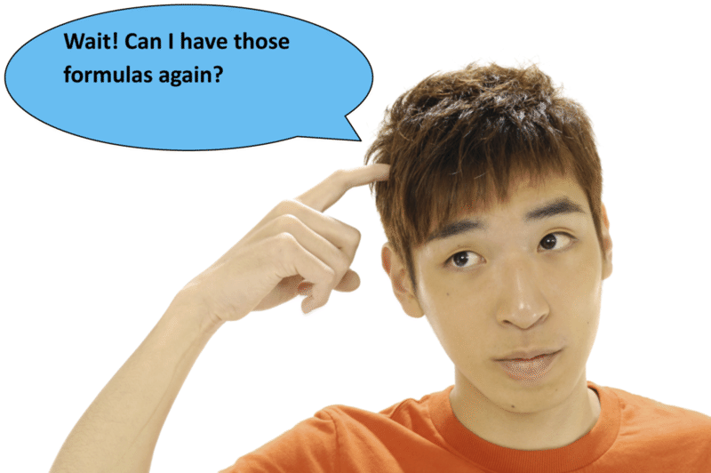

$$
\begin{align*}
&\text{Rectangle} && P = 2l + 2w\\
&&& A = lw\\
&\text{Square} && P = 4s\\ 
&&& A = s^2
\end{align*}
$$

Now let’s look at an example.

Example

Find the perimeter and area of the following rectangle.

$$
\begin{align*}
P &= 2l+2w\\
P &= 2(12)+ 2(7)\\
P &= 24+14\\
P &= 38 \ inches
\end{align*}
$$

**Now, we can find the area of the rectangle. To do this, we take the formula for area and substitute the given values in for length and width.**

$$
\begin{align*}
A &= lw\\ 
A &= (12)(7)\\
A &= 84 \ sq.in.
\end{align*}
$$

**First, let’s find the perimeter of the square.**

$$
\begin{align*}
P &= 4s\\ 
P &= 4(14)\\ 
P &= 56 \ feet
\end{align*}
$$

**Next, we can use the formula for area to find the area of the square.**

$$
\begin{align*}
P &= s^2. 
P &= 14^2=14(14)\\ 
P &= 196 \ square \ feet \ or \ ft^2
\end{align*}
$$

**1N. Lesson Exercises**

**Find the perimeter and area of a rectangle with a width of 10 inches and length of 12 inches.**

III. **Solve for Unknown Dimensions Using Formulas, Given Perimeter and Area**

**You just learned how to find the perimeter and area given side measurements, now you are going to work backwards.**

$ and the area $(A)$ were the variables. In some cases, if we already know the perimeter or the area, we can make the length or width our variable and solve for that value.")

Example

The width of a rectangle is 10 feet and the perimeter is 50 feet. What is the length of the rectangle?

**Here we are trying to find the length of the rectangle, so we’ll give that value the variable** $l$. We already know the perimeter and the width. All we have to do is substitute the values for the perimeter and the width into our formula and solve for $l$.

**_Remember to follow the order of operations: Parentheses, Exponents, Multiplication, Division, Addition, Subtraction._**

$$
\begin{align*}
P &= 2l + 2w\\
50 &= 2l + 2(10)\\
50 &= 2l + 20
\end{align*}
$$

Now we can use mental math, we need a number plus 20 that will give us 50. 30 is a likely choice. Now we have $2l$ so that means 2 times some number. We want this product to be 30, so $l=15$.

**Let’s check our work by substituting 15 in for length. If both sides of the equation are equal, then our equation balances and our work is done.**

$$
\begin{align*}
P &= 2l+2w\\
50 &= 2(15)+ 2(10)\\
50 &= 30+20\\
50 &= 50
\end{align*}
$$

**Our equation balances and our work is done.**

**What about finding the side length when you have the area of a square?**

Let’s look at an example.

Example

If the area of a square is 144 sq. miles, what is the length of one of the sides of the square?

**To do this, we work backwards and substitute the given area into the formula.**

$$
\begin{align*}
A &= s^2\\
144 &= s^2
\end{align*}
$$

Now we use mental math and ask ourselves the question "What number times itself is equal to 144?" The answer is 12.

**The side length is 12 miles.**

**We can check our work by substituting the given values into the formula.**

$$
\begin{align*}
144 &= 12^2. 
144 &= 144
\end{align*}
$$

**Our equation balances and our work is accurate.**

IV. **Solve Real-World Problems Involving Perimeter and Area, Including Irregular Figures Made of Rectangles and Squares**

Now you can apply all of these skills to real-world problems. Let’s look at an example.

The perimeter of a square playground is 200 yards. What is the length of one of the sides of the playground?

**This is one of those "working backwards" problems. Fill the given information into the formula and solve for the missing side length.**

$$
\begin{align*}
P &= 4s\\ 
200 &= 4s
\end{align*}
$$

**What number times four is equal to 200? 50 is the correct answer. $50 \times 4 = 200$**

**The side length of one side of the playground is 50 yards.**

**We can also use this information to find the area of a figure that might be made up of more than one square or rectangle. These figures are called “irregular shapes.”**

Look at the following diagram.

The Hegazzi family is designing a summer garden based on the model shown above. Plot $A$ is a square and plot $B$ is a rectangle. If the total area of both plots in the garden is 139 square feet, what is the length of one side of plot $A$?

**To solve this multi-step problem, we will have to find the area of plot $B$ and subtract it from the total area to find the area of plot $A$. Then, since we know plot $A$ is a square, we will have to determine what length** **_multiplied by itself_** **will give us the length of one side of plot $A$.**

Let’s get started. Plot $B$ is a rectangle. The formula for the area of a rectangle is $A = lw$.

$$
\begin{align*}
A &= lw\\
A &= 15(6)\\
A &= 90 \ ft^2
\end{align*}
$$

So the area of plot $B$ is $90 \ ft^2$. We know the total area of the garden is $139 \ ft^2$, but we need to find the area of plot $A$.

**We can use the following equation: Total area = area of plot $A$ + area of plot $B$. Let’s assign the value of the area of plot $A$ the variable $x$.**

Total area = area of plot $A$ + area of plot $B$.

$139 = x + 90$

“What number plus 90 is 139?” We can figure this out by subtracting 90 from 139. The answer is 49.

$x=49$

**Now we know the area of plot $A = 49 \ ft^2$, but we are looking for the length of one side.** Plot $A$ is a square and all the sides are equal. The formula for the area of a square is $A = s^2$. Let’s see how it looks:

$$
\begin{align*}
A &= s^2\\
49 &= s^2
\end{align*}
$$

We need to think of what number _times itself_ is equal to 49. $7 \times 7 = 49$, so the length of one side of plot $A$ is 7 ft.

Real Life Example Completed
---------------------------

**_Shelter Repair at the Lonesome Lake Hut_**

On the morning after the groups were divided and the food was packed up, the groups headed into the backcountry. Kelly’s group began hiking up the Lonesome Lake Trail which starts at the base of the mountains in Lafayette Place Campground. They were carrying heavy gear, but were very excited. Their group leaders, Scott and Laurel, told them that their first stop would be the Lonesome Lake Hut. The AMC has huts stationed all through the White Mountains. Some of them are even at the top of mountains. These huts have beds, some have full kitchens, some have self-service kitchens. Hikers of all different kinds stay at the huts. The Lonesome Lake Hut is located at 2,760 feet and the trail is 1.5 miles long. It would be one of the easier hikes they would go on. Scott told the group that they would be helping to repair the floor of the main house. It seemed that there was some water damage. The roof had been repaired but the floor needed work. The group hiked the beautiful and relatively easy trail in about an hour and a half. When they arrived, they were delighted to see everything. After unpacking in the bunkhouse and getting some lunch, the hikers went to work.

The crew leader at the hut told the students that the floor was damaged during the winter. The area of the floor was 90,720 square feet and one quarter of the floor needed to be fixed. That is an area of 22,680 square feet with a length of 90 ft.

If the length is 90 ft and the area is 22,680 square feet, what is the width of the area that needs repair?

**First, let’s write an equation to solve this problem. We can assume that the hut is a rectangle in shape because we were given a length and asked to find the width.**

$$
\begin{align*}
A &= lw\\
22680 &= 90w
\end{align*}
$$

**We need to find a number that, when multiplied by 90, is equal to 22,680. To do this, it makes sense to divide. Division is the opposite of multiplication. Since mental math won’t work for this one, division is the next best option.**

$22680 \div 90 = 63 \ ft$

**The width of the area of damaged floor is 63 feet wide.**

The students worked hard to repair the floor and it was a great two days working at Lonesome Lake Hut! Yet when their work was done they were excited to think about hiking to their next destination!!

Vocabulary
----------

Here are the vocabulary words that are found in this lesson.

__Measurement__

the system of comparing an object to a standard.

__Customary System__

the system of measurements that uses inches, feet and miles, to name a few.

__Metric System__

the system of measurement that uses centimeters, meters and kilometers, to name a few.

__Perimeter__

the distance around the edge of a figure

__Area__

the measurement of the space inside a figure

__Equation__

one expression equals another expression

__Variable Equation__

an equation where a variable is used to represent an unknown quantity.

**_Resources_**

You can learn more about Lonesome Lake and the other AMC huts at this website. http://www.outdoors.org/lodging/whitemountains/huts/huts-lonesome.cfm

Technology Integration
----------------------

!?[0](https://www.youtube.com/watch?v=CDvPPsB3nEM)

[Khan Academy, Perimeter with Metric Measurements](http://www.youtube.com/watch?v=CDvPPsB3nEM)

!?[0](https://www.youtube.com/watch?v=TN4tm_rONNc)

[James Sousa, Example of Determining Area of a Rectangle Involving Whole Numbers](http://www.youtube.com/watch?v=TN4tm_rONNc)

**_Resources_**

You can learn more about Lonesome Lake and the other AMC huts at this website. http://www.outdoors.org/lodging/whitemountains/huts/huts-lonesome.cfm

Time to Practice
----------------

Directions: Find the area and perimeter of each rectangle by using the given dimensions.

1. Length = 10 in, width = 5 in

2. Length = 12 ft, width = 8 feet

3. Length = 11 ft, width = 5 feet

4. Length = 17 miles, width = 18 miles

5. Length = 22 ft, width = 20 feet

6. Length = 8 cm, width = 6 cm

7. Length = 20 cm, width = 17 cm

8. Length = 3 feet, width = 2 feet

9. Length = 15 yards, width = 11 yards

10. Length = 10 yards, width = 6 yards

Directions: Find the area and perimeter of each square using the given dimensions.

11. $s = 6 \ ft$

12. $s = 8 \ ft$

13. $s = 9 \ in$

14. $s = 4 \ in$

15. $s = 12 \ in$

16. $s = 7 \ ft$

17. $s = 5 \ cm$

18. $s = 3 \ m$

19. $s = 10 \ m$

20. $s = 11 \ yards$

</article>

### 1.7 A Problem-Solving Plan

<article>

Introduction
------------

**_Galehead Hut_**

“That looks pretty simple on this map,” Yalisha said looking at the map above.

“Yes, but it’s not. Look at this one,” Kelly said, pulling out a more detailed map of the White Mountains.

The group would take the Old Bridle Path from Lonesome Lake to Greenleaf Hut. It is 4.5 miles and the estimated travel time is 3 hours and 30 minutes.

“We’ll be in the Presidential range,” John said happily.

The Presidential Range of Mountains, in the White Mountains, contains peaks named after several US Presidents. Mount Washington is one of the most famous. However, there are other exciting ones to see and climb.

The group set off at 7 am. It was a challenging hike and took longer than expected. Instead of 3 hours and 30 minutes, the group arrived after 5 hours. It took them an extra 1 hour and 30 minutes.

At the hut, they tried to decide whether they should go on, or stay at the hut for the rest of the day. The group was undecided and the leaders tried to let the students work it out amongst themselves. While all the arguing was going on, Raoul pulled out the map and made these notes on a piece of paper.

Greenleaf to Galehead by Garfield Ridge Trail is 7.7 miles estimated 5 hours and 20 minutes.

If the group decides to move on, what is their estimated arrival time at the next hut given today’s pace? If they want to be at the next hut by dinner time, will they make it?

**This lesson is about problem solving. Problem solving is what the group needs to work on together, in order to make some decisions.**

**_What You Will Learn_**

In this lesson you will learn the following skills:

* Read and understand a given problem situation.
* Make a plan to solve the problem.
* Solve the problem and check the results.
* Compare alternative approaches to solve the problem.
* Solve real-world problems using a plan.

**_Teaching Time_**

I. **Read and Understand a Given Problem Situation**

**One of the most important skills for any mathematics student is the ability to understand real-world problems, develop an approach to solving the problem, and carry out a problem solving plan.**

There are countless ways to solve problems.

Drawing pictures, making lists, working backwards, guessing and checking, looking for patterns, and writing equations are just a few of the approaches mathematicians take to solving problems.

In this lesson we will read and examine all kinds of problems. Then we will develop a plan and solve them.

**How do we start when faced with a difficult problem?**

**The key to developing an appropriate problem solving plan is taking the time to read and understand the problem or situation.**

You can’t expect to be able to grasp the important information in a problem if you just skim it for the important numbers.

When you come across a complicated problem, don’t panic!

Slow down and carefully read the problem until you understand what it’s really asking.

You have already been doing this work in each introduction problem. Now we can learn specific methods.

On Monday, Jake spent a total of 180 minutes on his math, history, and science homework.

He spent 45 minutes on his math homework and 1 hour on his science homework.

How many minutes did he spend on his history homework?

**Key questions can help you to understand a problem.**

Here are a few key questions.

1. What is the information that needs to be found?

**The amount of time Jake spent on his history homework.**

2. What do you need to know to answer this question?

**The total amount of time he spent and the time he spent on his other two subjects.**

3. What information have you been given?

**He spent 180 minutes total. Of that, he spent 45 minutes on science and 1 hour (60 minutes) on math.**

4. How do we solve this problem?

**Think about what skills you have already learned. We could write an equation to figure out this problem.**

$$
\begin{align*}
\text{Total time} &= \text{math time} + \text{history time} + \text{science time}\\
180 &= 60+x+45\\
180 &= 105+x
\end{align*}
$$

**Now use mental math, “What number plus 105 is equal to 180?”**

$75=x$

**He spent 75 minutes, or 1 hour and 15 minutes, on his history homework.**

A sandwich shop sold 36 tuna fish sandwiches and 45 roast beef sandwiches. The shop sold three times as many turkey sandwiches as tuna sandwiches. How many turkey sandwiches did the shop sell?

Use the following questions to help you understand the problem:

1. What is the question?

**How many turkey sandwiches did the shop sell?**

2. What do you need to know?

**How many tuna sandwiches the shop sold**

3. What do you know?

**The shop sold 36 tuna sandwiches and three times as many turkey sandwiches as tuna sandwiches. You** **_don’t_** **need to know how many roast beef sandwiches the shop sold.**

4. How can you solve the problem?

**By multiplying the number of tuna fish sandwiches by three. $36 \times 3 = 108$.**

**The shop sold 108 turkey sandwiches.**

**Reading a problem carefully and using these key questions will help you when working through a story problem.**

II. **Make a Plan to Solve the Problem**

**Many times a problem situation will require more than one step to find a solution. This is where having a plan becomes so important.** When confronted with this type of problem remember to carefully read to find out _what_ the problem is asking. With multi-step problems, it often helps to solve a simpler problem, then return to the main problem and apply what you found in the simpler problem to solve.

Example

William began a fitness schedule. He ran 2 miles the first week, 2.5 miles the second week, and 3 miles the third week. If the pattern continues, how many miles will William have run after five weeks?

**First, let’s think about what the problem is asking.**

The problem is asking for the number of miles that William will run in the fifth week.

**What information have we been given?**

We have been given his mileage for weeks one, two and three. We have also been told that there is a pattern.

**What is our plan?**

First, we need to figure out the mileage for weeks four and five. Then, we need to find the sum of all of the weeks.

$$
1 \qquad 2\\
2 \qquad 2.5\\
3 \qquad 3\\
4 \qquad 3.5\\
5 \qquad 4
$$

**During weeks four and five, here is the mileage. Notice that the pattern increased by one-half mile each week.**

**Now we can find the sum of the total miles.**

$2 + 2.5 + 3 + 3.5 + 4 = 15 \ miles$

**Our answer is 15 miles.**

III. **Solve the Problem and Check the Results**

**Particularly when a problem requires multiple steps to solve, it is important to examine your solution and ask, “Does my solution make sense?” A good habit in problem solving is to take your solution, return to the original problem, and check to see if your solution makes sense.**

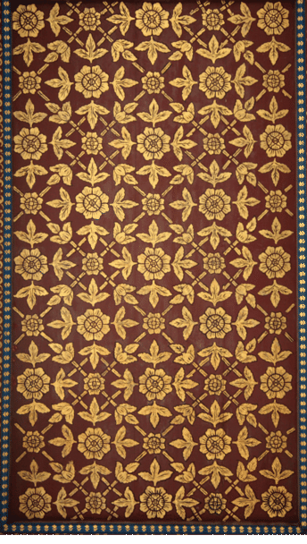

Ms. Hahn has three square rugs. The second rug has twice the area of the first rug. The third rug has three times the area of the second rug. If the third rug has an area of $24 \ ft^2$, what is the length of 1 side of the first rug?

**It is clear in this problem that we need to work backward, using the area of the third rug to find the area of the second rug and using the area of the second rug to find the area of the first rug. From the area of the first rug, we need to find the length of one of the sides.**

**Step 1: Find the length of one of the sides.**

The problem tells us that the third rug has an area of $24 \ ft^2$. We know that the third rug has 3 times the area of the second rug. If $x$ is the area of the second rug, $3x$ is the area of the third rug. Now we can solve for the area of the second rug.

$3x = 24$

**Ask yourself, “What number times 3 is 24?”**

$x = 8 \ ft^2$

Now we know the area of the second rug is $8 \ ft^2$. We can use this to find the area of the first rug because the problem tells us the area of the second rug is twice the area of the first rug. If the area of the first rug is $y$, the area of the second rug is $2y$. Now we can solve for the area of the first rug.

$2y = 8$

**Ask yourself, “What number times two is eight?”**

$y = 4 \ ft^2$

Now that we know the area of the first rug, we can find the length of one of its sides. Remember the formula for area of a square? $A = s^2$. Now we can solve for one of the sides.

$$
\begin{align*}
A &= s^2\\
4 &= s^2
\end{align*}
$$

What number _times itself_ is 4?

$2 \times 2 = 4$, so one of the sides of the first rug is 2 ft

**To check our answer, we can return to the problem, starting with the first rug and working up to the third rug.**

**If one of the sides of the first rug is 2 feet, the area of the first rug is $4 \ ft^2$.**

**The area of the second rug is twice the area of the first rug, or $8 \ ft^2$.**

**The area of the third rug is three times the area of the second rug, or $24 \ ft^2$.**

**Our solution is correct!**

IV. **Compare Alternative Approaches to Solving the Problem**

There usually isn’t _one_ right way to solve a problem. This means that logical reasoning is one of the most important skills you can bring to problem solving. Strategies and plans are in place because they make solving certain types of problems easier. As long as you take the time to understand what the problem is asking and develop a logical approach, you can find the solution, no matter what strategy you choose to use.

**For example, let’s look back at the question about William and the running.**

Example

**William began a fitness schedule. He ran 2 miles the first week, 2.5 miles the second week, and 3 miles the third week. If the pattern continues, how many miles will William have run after five weeks?**

When working on this problem, we created a table and then added up the number of miles ran per week.

We could have tackled this problem in another way. We could have written a list of the miles.

2, 2.5, 3

Then we would have seen the pattern of +.5.

We could have continued to add on .5 to each of the previous terms in the list.

2, 2.5, 3, 3.5, 4

That would have given us the correct mileage to then find the sum.

**Our answer would have been the same, but our way of getting there would have differed.**

V. **Solve Real World Problems Using a Plan**

Any time we encounter sets of real-world problems, we need to be flexible in our approach and willing to apply whatever strategy seems to best fit the situation. Remember these steps as you work through a problem.

**The best approach is a careful reading of the problem.**

Then ask yourself the following types of questions to help solve the problem: What is the problem asking?

What information do I have? What information do I need?

What is the best strategy to use?

After you solve, remember to ask: Does my solution make sense? Always go back to the original problem and double check!

**Now we can go back to the original problem and help our hikers to solve their dilemma.**

Real Life Example Completed
---------------------------

**_Galehead Hut_**

When their work at the Lonesome Lake Hut was finished, the group learned that their next destination was to be another hut. They were to hike from Lonesome Lake Hut, to Greenleaf Hut, then head to the Galehead Hut. They would stop at the Galehead hut.

“That looks pretty simple on this map,” Yalisha said looking at the map above.

“Yes, but it’s not. Look at this one,” Kelly said, pulling out a more detailed map of the White Mountains.

The group would take the Old Bridle Path from Lonesome Lake to Greenleaf Hut. It is 4.5 miles and the estimated travel time is 3 hours and 30 minutes.

“We’ll be in the Presidential range,” John said happily.

The Presidential Range of Mountains, in the White Mountains, contains peaks named after several US Presidents. Mount Washington is one of the most famous. However, there are other exciting ones to see and climb. The group set off at 7 am. It was a challenging hike and took longer than expected. Instead of 3 hours and 30 minutes, the group arrived after 5 hours. It took them an extra 1 hour and 30 minutes. At the hut, they tried to decide whether they should go on, or stay at the hut for the rest of the day. The group was undecided and the leaders tried to let the students work it out amongst themselves. While all the arguing was going on, Raoul pulled out the map and made these notes on a piece of paper. Greenleaf to Galehead by Garfield Ridge Trail is 7.7 miles estimated 5 hours and 20 minutes.

If the group decides to move on, what is their estimated arrival time at the next hut given today’s pace? If they want to be at the next hut by dinner time, will they make it?

**First, let’s make a note that it is noon when the group arrives at the first hut.** **Now let’s figure out the estimated hiking time from one hut to the next one. It was an estimated 5 hours and 20 minutes, but the group required 1 hour and 30 minutes longer.**

**5 hours and 20 minutes + 1 hour and 30 minutes = 6 hours and 50 minutes or an approximated 7 hours**

**If the group left right away, they wouldn’t arrive before 7 pm. That would definitely make them late for dinner.**

**Raul showed this math to his friends while they were still arguing. Given the time it would take, the group decided to stay at Greenleaf hut for the night.**

**_Resources_**

Here are some places you can learn more about the Presidential Range.

http://home.earthlink.net/~ellozy/greenleaf-hut.html#tocref5 – Routes to Greenleaf Hut and Galehead Hut with maps, times and mileage.

http://en.wikipedia.org/wiki/Presidential_Range – This website contains overall information about the mountains and has some pictures.

Time to Practice
----------------

Directions: Read each of the questions to develop a strategy and solve each problem. Be sure to check your answer and make sure that it makes sense.

1. Giovanni is working to improve the scores on his weekly science quizzes. The following were his scores for the first four weeks of school: 64, 70, 76, 82. If the pattern continues, in which week will Giovanni’s score be 100?

2. Lola’s Bakery uses 62 pounds of flour and 19 pounds of sugar each week. The bakery uses half as much butter as flour each week. How much butter will the bakery use in a month’s time?

3. A children’s pool holds 6 cubic meters of water. The length of the pool is three times the height and the width of the pool is twice the height. What is the height of the pool?

4. Martin went to the state fair with $30. He rode 17 rides and came home with $4.50. How much did each ride cost?

5. Lionel arranged 24 photos in an album. The number of photos in each row is 5 more than the number of rows. How many rows of photos are there?

6. An aquarium has four fish tanks it wants to arrange on a shelf. The shelf has an area of 196 square feet. The area of the second tank is twice the area of the first tank, and the area of the third tank is four times the area of the second tank. The area of the third tank is 56 square feet. If the aquarium puts all three tanks on the shelf, how much shelf area will be left over?

7. The Durands are driving 456 miles to their family reunion. If they split the drive equally over three days, how many miles will they drive each day?

8. At the end of a video game tournament, Raul and Martha had both scored twice as many points as Justice. If the total combined points of all three players is 285, how many points did each player score?

9. At the lunch counter, Ariana bought a sandwich and lemonade. The sandwich cost five times as much as the lemonade. She paid with $10 and got $2.50 in change. How much did the sandwich cost? How much did the lemonade cost?

10. The area of a playground is $40.5 \ m^2$. The width of the playground is half the length. What is the length of the playground?

Directions: Write five of your own problems. Be sure that one uses addition, one uses subtraction, one uses multiplication, one uses division and one uses a pattern that requires a table.

When finished, exchange papers with a friend and solve each other’s problems. Then discuss your solutions.

</article>

### 1.8 Problem Solving Strategies

<article>

Introduction
------------

**_The Four Thousand Footers_**

“Pretty interesting, huh?” she asked Kelly.

“Yes. I had no idea.”

“Well if you continue hiking maybe you’ll become part of the Four Thousand Footers Club,” Laurel said.

“What is that?” Kelly asked.

“That is a group that climbs all of the peaks above 4,000 feet. There are 48 of them.”

Wow! Kelly couldn’t believe it. If each peak was at least 4,000 feet, that would be quite a collection. Kelly looked in the book again and found a whole chapter on the Four Thousand Footers Club. She was fascinated. She wrote down the following mountains in her journal.

Washington 6,288 ft.

Adams 5,774 ft

Jefferson 5,712 ft.

Monroe 5,384 ft.

Madison 5,367 ft.

Lafayette 5,260 ft.

Lincoln 5,089 ft.

If she climbed each of these peaks, how many feet would that be in all? If each peak took two days average to climb, how many days would it take her to climb them all?

**Use your problem solving to help Kelly figure this out. You will solve this problem by the end of the lesson.**

**_What You Will Learn_**

In this lesson you will learn the following skills:

* Read and understand given problem situations.
* Develop and use a variety of strategies.
* Plan and compare alternative approaches to solving problems.
* Solve real-world problems using selected strategies as part of a plan.

**_Teaching Time_**

I. **Read and Understand Given Problem Situations**

Taking the time to read and understand a problem is the key to finding a solution. Unfortunately, it is the part that students often rush through and then end up making mistakes or becoming confused. You can avoid that problem yourself by using the questions that you learned in the last section. Remember those?

Also, keep in mind that sometimes there will be extra information in a problem deliberately put there to throw you off. Pay close attention as you read and don’t be fooled!!

Let’s look at an example that has extra information in it.

Example

Ron arranged his herb garden in rows, with the following number of plants in each row:

2 plants, 5 plants, 11 plants, 23 plants

The garden has an area of $25 \ yd^2$.

How many plants will be in the fifth row?

**Whenever you see a series of numbers, this should alert you to use the "find a pattern" strategy.**

This problem is asking us to identify a pattern rule and use that pattern rule to find how many plants will be in the fifth row.

The pattern rule is $2x + 1$ where "x" is the previous number, so there will be 47 plants in the fifth row.

The question has nothing to do with the area of the garden, so we can ignore that information.

Melissa has 72 cookies she wants to put as evenly as possible into 7 gift bags.

There are half as many chocolate chip cookies as peanut butter cookies.

How many cookies will be left over after she puts them in the bags?

**When we see the phrase “how many will be left over, we can guess the problem might be asking about remainders and that to solve this problem we will need to divide.**

**We don’t care about the numbers of different types of cookies, so we can ignore that information.**

$72 \div 7 = 10r2$

**There will be two cookies left over.**

II. **Develop and Use a Variety of Strategies**

There are a variety of strategies that you could select from when working on a problem, such as: find a pattern, guess and check, work backward, draw a picture, write an equation, and use a formula. The more you practice solving problems, the quicker you will become at identifying the most appropriate strategies to use when solving specific types of problems.

Here are some hints to aid in selecting the best strategy:

1.  **Find a Pattern** - best used when there is a series of numbers and/or when you are being asked for a later quantity. For example, find the number in the tenth step.
2.  **Guess and Check** - best used when you are looking for one or two numbers and you think one of them might work. You can take a guess, try out a number and then adjust your answer from there.
3.  **Work Backwards** - think about the problems that you had earlier in this chapter when you were given the area or perimeter and you needed to find a side length. Working backwards is very helpful for problems like these where an answer of some sort is given right away.
4.  **Draw a Picture** - look for examples that have some kind of visual in them; problems with geometric shapes work best with the drawing a picture strategy.
5.  **Write an Equation** - writing an equation is great when there is a missing quantity that needs to be figured out.
6.  **Use a Formula** - Formulas are helpful for area and perimeter problems. You will also encounter other formulas as you work through this book and those can be applied when problem solving as well.

IV. **Plan and Compare Alternative Approaches to Solving Problems**

There are many different ways to solve a problem and still get the correct answer. Strategies are designed to help make problem-solving faster. Working through lots of problems, you will find the approaches and strategies that work best for you. Look back at the notes you wrote in the last section. When selecting a strategy, those will be helpful. Also, remember that sometimes more than one can be used. For example, a problem with an unknown could be solved by an equation, but if it has a series of numbers, it could also be solved by looking for a pattern.

Let’s practice.

Example

Ms. Powell wants to hang a large tapestry lengthwise on her living room wall. The tapestry has a perimeter of 42 ft and a width of 9 ft. Ms. Powell’s wall is 10 ft high. Will the length of the tapestry fit the height of Ms. Powell’s wall without hitting the ceiling?

**This is a multi-step problem requiring a variety of different strategies to solve. To start off, it might help to draw a picture to get a feel for what the problem is asking.** The problem asks if the tapestry will fit. We are going to have to find the length of the tapestry and compare it to the height of Ms. Powell’s wall.

Because the question involves perimeter, we know we are going to have to use the formula for perimeter. $P = 2l + 2w$. We know the perimeter of the tapestry and we know the width, so we can write an equation to solve for the length.

$$
\begin{align*}
P &= 2l + 2w.\\
42 &= 2l + 2(9)\\
42 &= 2l + 18\\
24 &= 2l\\
l &= 12 \ feet
\end{align*}
$$

**Now we need to return to the problem and compare the length of the tapestry with the height of the wall. The tapestry is 12 feet long; the ceiling is only 10 feet high. The tapestry won’t fit!**

**An alternative approach to solving this problem would have been to only look at a drawing. We could have drawn each piece of the problem and then compared. Looking at the dimensions, you would have been able to see that the tapestry would not fit. Let's look at another example:**

The band leader has arranged 56 musicians that will be participating in a parade. The number of players he placed in each row was 10 more than the number of rows. How many rows were there?

**To approach this problem, we need to assume that the musicians are arranged in** **_equal_** **rows. Then we know we are going to have to look for factors of 56 which fit these qualifications. We can work to “guess and check” for numbers that work.**

The guessing and checking strategy uses $7 \times 8 = 56$, but that doesn’t work. $28 \times 2 = 56$, but that doesn’t work either. $14 \times 4 = 56$ and that works! If there are 14 musicians in each row, there will be 10 more than the number of rows.

Guessing and checking isn’t the only way to solve this problem. You might also choose to draw a picture or make an organized list.

Real Life Example Completed
---------------------------

**_The Four Thousand Footers_**

While at Galehead Hut, Kelly found a book on the different mountains in the Presidential Range. She was fascinated to learn that so many of them were above 4,000 feet in elevation. Laurel, one of the leaders, saw her reading it and came over to her.

“Pretty interesting, huh?” she asked Kelly.

“Yes. I had no idea.”

“Well if you continue hiking maybe you’ll become part of the Four Thousand Footers Club,” Laurel said.

“What is that?” Kelly asked.

“That is a group that climbs all of the peaks above 4,000 feet. There are 48 of them.”

Wow! Kelly couldn’t believe it. If each peak was at least 4,000 feet, that would be quite a collection. Kelly looked in the book again and found a whole chapter on the Four Thousand Footers Club. She was fascinated. She wrote down the following mountains in her journal.

Washington 6,288 ft.

Adams 5,774 ft

Jefferson 5,712 ft.

Monroe 5,384 ft.

Madison 5,367 ft.

Lafayette 5,260 ft.

Lincoln 5089 ft.

If she climbed each of these peaks, how many feet would that be in all? If each peak took two days average to climb, how many days would it take her to climb them all?

**First, let’s find the sum of all of the elevations in Kelly’s list.**

$6288 + 5774 + 5712 + 5384 + 5367 + 5260 + 5089 = 38874 \ feet$

Keep in mind that this is only one way. Kelly still has to hike back down. You will need to double your number to accurately represent the total feet hiked for these mountains.

**How many miles is that?**

**77,748 feet $\div$ 5280 feet (the distance in one mile) = 14.72 miles**

**Now if it were to take 2 days for each peak, how many days would it take Kelly to climb these mountains on her list?**

We can write an equation.

7 mountains

2 days

$7 \times 2 = 14 \ days$

**At Galehead Hut, Kelly looked out at the views of the mountains and was glad to be a part of the summer teen adventure program. While she was tired, she was also satisfied and proud of what she had accomplished so far. She was excited to think about what the next adventure would be!**

Time to Practice
----------------

Directions: Use what you have learned to solve the following problems.

1.  Mary went to the music store with her babysitting money. She bought two CDs for $12.50 each and two magazines for $4.25 each. She left the store with $10.25. How much money did she start with?
2.  Since he began his fitness routine, Mr. Trigg has measured his weight every week. His weights for the first six weeks are as follows: 236, 230, 232, 226, 228, 222. If the pattern continues, how much will he weigh in the tenth week?
3.  The area of City Park is $75 \ km^2$. The length of the park is 3 times the width. What is the perimeter of the park?
4.  A farmer planted corn, wheat, and cotton in a total of 88 fields. He planted twice as many fields in corn than in wheat and half as many in cotton than in corn. How many fields did he plant of each?
5.  Mrs. Whitaker is mailing a pair of shoes to her daughter. She wants to fit the rectangular shoebox _inside_ a larger square box. The area of the base of the shoebox is $84 \ in.^2$; the length of one side is 12 inches. One side of the larger square box measures 14 inches. Will the shoebox fit in the larger box? How do you know?
6.  After a pinball game, the score board showed that the combined points of Peter, Ella, and Ned is 728. Ella scored half the points of Ned, and Peter scored one-fourth the points of Ned. How many points did each player score?
7.  Tami made a total of $47 babysitting on New Year’s Eve. She made her hourly rate plus a $7 tip. If she worked 5 hours, what is her hourly rate?
8.  A weightlifter lifts weights in the following order: 0.5lb, 1.5lb, 4.5lb, 13.5lb. How many pounds will he lift next?
9.  Figure A is a square with a side that measures 9 cm. Figure B is a square with a side that measures 6 cm. Which figure has the greater area, Figure A or Figure B?
10. Mr. and Mrs. Rowe are driving 959 miles to have a vacation on the beach. They want to split the driving distance over 4 days, driving the exact same amount on the first three days and the remainder on the fourth day. If they drive 119 miles on the fourth day, how many miles will they drive on the first day?
11. Cedric spent $27.75 on pizza for his friends. Each cheese pizza cost $8 and each extra topping cost $0.75. If Cedric bought 3 cheese pizzas, how many extra toppings did he get?
12. At the trading fair, Chi Wong arranged 72 baseball cards in rows on the trading table. Each row had 14 more cards than the number of rows. How many cards were in each row?

**_Take a few minutes to check the strategies you used with a peer. Did you use the same strategies or different strategies in problem solving?_**

</article>

## 2.0 Using Decimals

<article>

</article>

### 2.1 Comparing and Ordering Decimals

<article>

Introduction
------------

**_The 100_**

Jeff is a friend of Connor’s who attends the middle school in the next town over. Jeff is also a runner and he also specializes in the 100. The boys are good friends but they definitely love to compete against each other. Sometimes Jeff is faster and sometimes Connor is faster. Jeff’s best race time in the 100 is 13.42. His slowest race time is 15.32. Jeff’s goal this year is to beat his fastest time and finish the 100 in less than 13.00.

One week before the big race, Connor and Jeff decided to try running practice intervals together. They both ran the 100 on the track; Connor’s time was 13.11 and Jeff’s time was 13.14.

Given these times, who was faster? How does Connor’s practice time compare with his best race time? How does Jeff’s practice time compare with his best race time? Given these numbers, who do you think is on track to accomplish his goal? Give some mathematical reasons why.

**Track and field times are calculated in decimals. To answer these questions, you will need to know how to compare and order decimals. Pay attention, you will see this problem again at the end of the lesson.**

**_What You Will Learn_**

In this lesson you will learn the following skills.

* Compare and order decimals without rounding.
* Round decimals to a given place.
* Compare and order decimals after rounding.
* Describe real world portion or measurement situations by comparing or ordering decimals with and without rounding.

**_Teaching Time_**

I. **Compare and Order Decimals Without Rounding**

**Before we move on to comparing and ordering decimals, let’s begin by working with whole numbers and decimals.**

**Whole numbers** are numbers such as 1, 8, 56, and 278—numbers that don’t contain fractional parts.

Not all numbers are whole.

The **_decimal system_** lets us represent numbers or parts of numbers that are less than 1. Money is one of the most common places that we see decimals in everyday life. You should be familiar with using decimals in your everyday dealings with money.

**Take the amount $41.35.**

**You know that 0.35 represents part of a dollar.**

**If you had 100 cents, you would have a dollar.**

**So 35 cents can be represented as 0.35, or $\frac{35}{100}$, 35** **_hundredths_** **of a dollar.**

**Decimals, however, are used to describe a lot more than money.**

In a decimal number, like 321.43, the **_decimal point_** divides the whole number from its fractional part.

**Numbers to the left of the decimal point are whole numbers.**

**Numbers to the right of the decimal point are the fractional part.**

**Now that we have reviewed a bit about whole numbers and decimals, we can look at comparing decimals without rounding.**

**First, let’s think about place value. The value of each number in a decimal, whether it is a whole number to the left of the decimal point, or a fractional part to the right of the decimal point, is defined based on the value of the number. The place that each digit is in has a specific name, and this helps us to figure out which numbers are larger and which are smaller.**

Here is a place value chart.

| **Place** | **Number** |
| --- | --- |
| Millions place | 1,000,000.0 |
| Hundred-thousands place | 100,000.0 |
| Ten-thousands place | 10,000.0 |
| Thousands place | 1,000.0 |
| Hundreds place | 100.0 |
| Tens place | 10.0 |
| Ones place | 1.0 |
| **Decimal point** | .   |
| Tenths place | 0.1 or $\frac{1}{10}$ |
| Hundredths place | 0.01 or $\frac{1}{100}$ |
| Thousandths place | 0.001 or $\frac{1}{1000}$ |
| Ten-thousandths place | 0.0001 or $\frac{1}{10,000}$ |
| Hundred-thousandths place | 0.00001 or $\frac{1}{100,000}$ |
| Millionths place | 0.000001 or $\frac{1}{1,000,000}$ |

**This chart shows us the value of each digit. Now let’s look at an example.**

| **10 Th** | **Thousand** | **Hundreds** | **Tens** | **Ones** |     | **Tenths** | **Hundredths** | **Thousandths** | **Ten-Thousandths** |
| --- | --- | --- | --- | --- | --- | --- | --- | --- | --- |
| **1** | **2** | **4** | **5** | **9** | .   | **3** | **4** | **7** | **8** |

**We read this number as: “Twelve thousand, four hundred fifty-nine AND three-thousand, four hundred and seventy-eight ten-thousandths.”**

To read a decimal number, we begin with the whole number.

The decimal point is read as “and” or as “point.”

Then the digits to the right of the decimal point are read by naming the place in the last digit of the number. For example, 23.451 is read as twenty-three **and** four hundred fifty-one thousandths.

**How can we use this information to compare decimals?**

First, to compare decimals, we can use our symbols for greater than > and less than <. To order decimals, we will be writing them from least to greatest or from greatest to least. First, let’s just focus on comparing.

**We compare and order decimal numbers, just like we compare and order whole numbers—by working from left to right.**

**Begin by lining up the decimal points. If there are missing places in the decimals, we can figure out which one is smaller or larger by adding zeros on the end of the number for the missing places.**

**_You want each decimal to have the same number of digits so that you can get a clear idea of which is larger and which is smaller._**

Example

Compare 8.507 and 8.570. Write >, <, or =.

**The first thing to do, is to notice is that each number has one whole number, 8. Because the whole number is the same in both numbers, we need to determine which is greater by looking at the decimal part of the number. These decimals both have three decimal places, so we don’t need to add any zeros.**

**The clearest way to see the decimal values is by lining up the decimal points in a place-value chart, such as the one below.**

| **Ones** | .   | **Tenths** | **Hundredths** | **Thousandths** |
| --- | --- | --- | --- | --- |
| 8   | .   | 5   | 0   | 7   |
| 8   | .   | 5   | 7   | 0   |

Use the chart to compare the value of each digit from left to right.

The numbers are identical in the ones place (8) and in the tenths place (5).

In the hundredths place they are different.

0 < 7

The number 8.507 has $\frac{0}{100}$ (0 hundredths), while the number 8.570 has $\frac{7}{100}$ (7 hundredths).

0 hundredths is less than 7 hundredths—we don’t even need to look at the thousandths place!

**Our answer is that 8.507 < 8.570.**

**We can use this skill to help us when writing decimals in order from least to greatest or greatest to least.**

**Example**

Order the following numbers from least to greatest: 94.0299, 94.2019, 94.129, 494.019.

**We are ordering four numbers from least to greatest.**

**Use a place-value chart to see the difference in values.**

**This time we’ll have to add extra zeros to describe our numbers.**

**Remember to work from left to right when comparing values.**

| **Hundreds** | **Tens** | **Ones** | .   | **Tenths** | **Hundredths** | **Thousandths** | **Ten-thousandths** |
| --- | --- | --- | --- | --- | --- | --- | --- |
|     | 9   | 4   | .   | 0   | 2   | 9   | 9   |
|     | 9   | 4   | .   | 2   | 0   | 1   | 9   |
|     | 9   | 4   | .   | 1   | 2   | 9   | 0   |
| 4   | 9   | 4   | .   | 0   | 1   | 9   | 0   |

With just a glance at the place-value chart, it is easy to see which number is the _greatest_ number.

494.019 is the only number that has a value in the hundreds place.

The question asks us to order the numbers from least to greatest, so put 494.019 at the _end_ of our list.

Now let’s look at the other three numbers.

All of them have the same value in the tens and ones places (94), so we need to look to the tenths place. Don’t be thrown off by the 9's in the thousandths and ten-thousandths place!

We don’t need to look further than the tenth place.

0 < 1 < 2, so 94.0299 < 94.129 < 94.2019

Now we can put our numbers in order from least to greatest.

**Our answer is 94.0299, 94.129, 94.2019, 494.019**

**2A. Lesson Exercises**

**Practice these skills by comparing and/or ordering these decimals.**

1.  **98.065 \_\_\_\_\_\_ 98.08**
2.  **5.237 \_\_\_\_\_\_ 5.231**
3.  **Write in order from least to greatest: .098, 2.45, 2.099, 2.67**

II. **Round Decimals to a Given Place**

Some decimals can extend to the millionths place or even farther and be difficult to handle in operations.

Rounding decimals is useful when estimating sums and differences or comparing measurements.

You have already learned how to round whole numbers to a given place value.

**Let’s take a minute to review rounding whole numbers.**

1,537 rounded to the thousands place is 2,000; rounded to the hundreds place is 1,500; rounded to the tens place is 1,540. We can round to any place that we choose to round the number to.

**We can use the same steps when rounding decimals. Here are the steps for rounding numbers.**

**The Steps for Rounding Numbers**

1.  Identify the place you want to round _to_, notice that number.
2.  Look at the digit to the right of that number.
3.  If the digit to the right is 5 or greater, round up. If the number is less than 5, round down.

Example

Round 406.091 to the nearest whole number

**First, underline the number you’re rounding** **_to_** **and bold or circle the number directly to the right.**

**In the case of our example problem, which asks us to round to the nearest whole number, underline the ones place.**

**Boldface, or circle, the number directly to the right of the number you underlined. The number in the tenths place is the one you’ll look at when deciding to round up or down.**

**Because that number is a zero, we don’t round up. The whole number stays the same.**

**Our answer is 406.**

Example

Round 206.9595 to the nearest whole number

**First, underline the number you’re rounding to and bold or circle the number directly to the right.**

**Rounding to the nearest whole number means you should have underlined the digit in the ones place.**

**The number in the tenths place is the one you look at when deciding to round up or down. This number is a nine, so we round up.**

**Our answer is 207.**

**Now let’s use these same steps when rounding decimal places.**

Example

Round .07285 to the nearest thousandths place

**First, identify that the two is in the thousandths place. We can underline that digit because that is the digit that we are going to be rounding.**

**Next, look to the number to the right of the two. That is the number we use to determine whether we round up or down.**

**That number is an 8, so we round up.**

**Our answer is .073.**

**_Notice that we don’t include the digits past the place where we have rounded. This is because we have rounded that digit._**

**2B. Lesson Exercises**

**Practice rounding the following numbers.**

1.  **Round 1.23439 to the nearest ten-thousandth.**
2.  **Round 3035.67 to the nearest whole number.**
3.  **Round 0.98734 to the nearest thousandth.**

III. **Compare and Order Decimals after Rounding**

**Now you know how to compare and order decimals as well as how to round decimals. Combining the two procedures is fairly straightforward. Once decimals are rounded to a specific place value, they can be compared just as they were compared when they weren’t rounded—from left to right.**

Example

Compare 77.0949 and 77.0961 after rounding to the nearest hundredth. Write >, <, or =.

**The first thing that we need to do is to round each to the nearest hundredth.**

77.0949: 9 is in the hundredths place. The number to the right of the 9 is a 4. So we do not round up.

**Our first number is 77.09**

77.0961: 9 is in the hundredths place here too. But the number to the right is a 6, so we round up.

**Our second number is 77.10**

**Now we can compare these numbers.**

**Our answer is 77.09 < 77.10.**

**We can use these same steps when ordering numbers from least to greatest or from greatest to least. First, you round the numbers to the desired place then you compare and order them.**

Let’s look at an example.

Example

Round the following numbers to the nearest tenth. Then order from greatest to least. 5.954, 5.599, 5.533, 6.062.

**First, we round each number to the nearest tenth.** Remember that the tenths place is the first place to the right of the decimal point. Here the digit being rounded is in bold print and the number that we use to determine whether we round up or down is in the hundredths place and is underlined.

5.**9**54 rounds up to 6.0

5.**5**99 rounds up to 5.6

5.**5**33 rounds down to 5.5

6.**0**62 rounds up to 6.1

**Next, we write them in order from greatest to least.**

**Our answer is 6.1, 6.0, 5.6, 5.5**

**2C. Lesson Exercises**

**Practice rounding and comparing.**

1.  **Compare each number after rounding to the nearest hundredth, 4.567 and 4.562**
2.  **Compare each number after rounding to the nearest tenth, .234 and .245**
3.  **Round each to the nearest tenth and write in order from least to greatest, .0567, .291, .1742**

IV. **Describe Real World Portion or Measurement Situations by Comparing and Ordering Decimals with and without Rounding**

There are many real world situations where we use decimals. Decimals are especially useful when working with money, measurement and with portions. Think back to the introductory problem, measuring time is what our two track runners were working on. We’ll go back to that problem in a minute, but first let’s look at some situations where decimals are used in the real world.

**You already know that money involves the decimal system to describe fractions of a dollar.** Where 100 cents is a dollar, 12 cents is written as .12, $\frac{12}{100}$, or 12 _hundredths_. Comparing the cents connected with a dollar amount lets us know how much money we have. Look at this example.

Compare $1.45 and $1.75

To compare, we see that the dollar amount is the same, so we look at the cents or the decimal part of the dollar. We can compare .45 and .75. 75 is greater than 45. Here is our answer.

**$1.45 < $1.75**

**This may seem obvious, but thinking of decimals in terms of money can often help make sense out of them.**

**The metric system of measurement is based on a system of 10, so it also uses decimals.** The metric system includes units of length (meters), weight (grams), and volume (liter). Look at the metric chart below to get an idea of the base-ten relationship among metric units.

**Metric Units of Length**

$$
\begin{align*}
& \text{millimeter} \ (mm) && .1 \ cm && .001 \ m && .000001 \ km\\
& \text{centimeter} \ (cm) && 10 \ mm && .01 \ m && .00001 \ km \\
& \text{meter} \ (m) && 1000 \ mm && 100 \ cm && .001 \ km\\
& \text{kilometer} \ (km) && 1,000,000 \ mm && 100,000 \ cm && 1000 \ m
\end{align*}
$$

**Metric Units of Mass**

$$
\begin{align*}
& \text{milligram} \ (mg) && .1 \ cg && .001 \ g && .000001 \ kg \\
& \text{centigram} \ (cg) && 10 \ mg && .01 \ g && .00001 \ kg\\
& \text{gram} \ (g) && 1000 \ mg && 100 \ cg && .001 \ kg\\
& \text{kilogram} \ (kg) && 1,000,000 \ mg && 100,000 \ cg && 1000 \ g
\end{align*}
$$

**Metric Units of Volume**

$$
\begin{align*}
& \text{milliliter} \ (ml) && .1 \ cl && .001 \ l && .000001 \ kl\\
& \text{centiliter} \ (cl) && 10 \ ml && .01 \ l && .00001 \ kl \\
& \text{liter} \ (l) && 1000 \ ml && 100 \ cl && .001 \ kl \\
& \text{kiloliter} \ (kl) && 1,000,000 \ ml && 100,000 \ cl  && 1000 \ l
\end{align*}
$$

Example

Mr. Wang is pricing batteries for his car. He finds the following prices: $100.01, $110.10, $101.10, $100.11. Order the battery prices from least to greatest.

**The problem asks us to order to prices from least to greatest. Don’t be confused by all the ones and zeros in the numbers. By now, you may not need to use a place-value chart, but it still helps to line up the decimal points and compare values from left to right.**

$100.01

$110.10

$101.11

$100.10

We can see that the values with $100 are going to be the least, so we look at the decimal places, .01 < .10, so $100.01 < $100.10. We can put these two numbers as our least and next to least values.

Now let’s compare the other two numbers. We don’t even need to look at the decimals because we can see that $101 < $110.

**Our answer is $100.01, $100.10, $101.11, $110.10**

**Sometimes, it helps to use rounding when problem solving. Let’s look at an example where rounding is very helpful.**

Example

Four families all live at different distances from downtown. The Murrays live 1.75 kilometers from downtown; the Smiths live 1.89 kilometers from downtown; the Giles live 1.67 kilometers from downtown; and the Hofflers live 1.51 kilometers from downtown. Round each distance to the nearest tenth, and then order the distances from greatest to least.

**The problem asks us to compare the numbers** **_after_** **we have rounded them to the nearest tenth.** The tenth place is directly to the right of the decimal point. We’ll need to look to the hundredth place (second to the right of the decimal place) to determine whether to round up or down. Let’s begin by rounding the four numbers separately. The tenth place is underlined; the hundredth place is bolded.

Murrays: 1.7**5** $\rightarrow$ rounded to the nearest tenth $\rightarrow$ 1.8 km

Smiths: 1.8**9** $\rightarrow$ rounded to the nearest tenth $\rightarrow$ 1.9 km

Giles: 1.6**7** $\rightarrow$ rounded to the nearest tenth $\rightarrow$ 1.7 km

Hofflers: 1.5**1** $\rightarrow$ rounded to the nearest tenth $\rightarrow$ 1.5 km

**Next, the problem asks us to order the numbers from** **_greatest to least._** Be sure to double-check which direction the problem asks for (greatest to least or least to greatest) before you order. Once we have the rounded numbers it is pretty simple to order them from greatest to least.

**Our answer is 1.9 km, 1.8 km, 1.7 km, 1.5 km.**

Real Life Example Completed
---------------------------

**_The 100_**

Connor loves running track for his middle school. In fact, he is one of the fastest runners and he specializes in short distances like the 100. Connor has set a goal this year to run a personal best in the 100. His fastest race time is 13.91 and his slowest race time is 15.16. Connor has set a goal of running the 100 in 12.51. While this is ambitious, he believes that with the right mind-set and perseverance that he will accomplish his goal.

Jeff is a friend of Connor’s who attends the middle school in the next town over. Jeff is also a runner and he also specializes in the 100. The boys are good friends but they definitely love to compete against each other. Sometimes Jeff is faster and sometimes Connor is faster. Jeff’s best race time in the 100 is 13.42. His slowest race time is 15.32. Jeff’s goal this year is to beat his fastest time and finish the 100 in less than 13.00.

One week before the big race, Connor and Jeff decided to try running practice intervals together. They both ran the 100 on the track: Connor’s time was 13.11 and Jeff’s time was 13.14.

Given these times, who was faster? How does Connor’s practice time compare with his best race time? How does Jeff’s practice time compare with his best race time? Given these numbers, who do you think is on track to accomplish his goal? Give some mathematical reasons why.

**To answer the first question, we have to compare the two times that the boys ran during their practice.**

**13.11 and 13.14**

**Notice that the thirteen is the same, so we need to look at the decimal. 11 is less than 14, so Connor ran the faster time.**

**Next, we compare Connor’s practice time and his best race time.**

**His practice time was 13.11**

**His fastest race time was 13.91**

**Connor is definitely getting faster, because his practice time was faster than his best race time.**

**Now we can compare Jeff’s times.**

**His practice time was 13.14.**

**His fastest race time was 13.42.**

**His practice time is faster than his race time. Jeff is also getting faster.**

**The last question involves your thinking. You need to decide whether or not you think both boys will meet their time goals for the race. Discuss this with a partner. Be sure to justify your thinking by using mathematical data.**

Vocabulary
----------

Here are the vocabulary words that are found in this lesson.

__Decimal System__

a system of measuring parts of a whole by using a decimal point.

__Decimal point__

the point that divides a whole number from its parts.

__Decimals__

a part of a whole located to the right of the decimal point.

__Whole Numbers__

counting numbers that do not include fractions or decimals. A whole number is found to the left of the decimal point.

Technology Integration
----------------------

!?[0](https://www.youtube.com/watch?v=cw9RCCx9Rs8)

[James Sousa, Example of Ordering Decimals from Least to Greatest](http://www.youtube.com/watch?v=cw9RCCx9Rs8)

!?[0](https://www.youtube.com/watch?v=AJ1nDFJVsGI)

[James Sousa, Another Example of Ordering Decimals from Least to Greatest](http://www.youtube.com/watch?v=AJ1nDFJVsGI)

!?[0](https://www.youtube.com/watch?v=qu4Y9DGqXlk)

[James Sousa, Rounding Decimals](http://www.youtube.com/watch?v=qu4Y9DGqXlk)

Other Videos:

http://www.schooltube.com/video/ef265b169dea4d4aa3c5/Reading-and-Writing-Decimals – This is a great basic video that goes through place value as a means for reading and writing decimals.

Time to Practice
----------------

Directions: Compare. Write &lt;, &gt;, or = for each \_\_\_.

1. 701.304 \_\_\_ 701.33

2. 2,012.201 \_\_\_ 2,012.021

3. 6.951 \_\_\_ 6.9313

4. 45.081 \_\_\_ 45.108

Directions: Order the following from least to greatest.

5. 373.291, 373.192, 373.129, 373.219

6. 0.4755, 0.4764, 0.4754, 0.4674

7. 7.16, 7.2, 7.06, 7.21

8. 25.417, 25.741, 25.074 25.407

Directions: Round the following to the nearest whole number.

9. 621.891

10. 1,318.0999

11. 17.275

12. 49.64

Directions: Round the following to the designated place.

13. 32.295 to the nearest hundredth

14. 0.1062461 to the nearest ten-thousandth

15. 2.4004728 to the nearest hundred-thousandth

16. 4,062.03 to the nearest tenth

Directions: Round each decimal to the nearest hundredth; then compare. Write &lt;, &gt;, or = for each \_\_\_.

17. 1.346 \_\_\_ 1.349

18. 0.0589 \_\_\_ 0.0559

19. 62.216 \_\_\_ 62.301

20. 5.011 \_\_\_ 5.001

Directions: Round each decimal to the nearest thousandth. Then order from greatest to least.

21. 2.03489, 2.03266, 2.0344, 2.03909

22. 16.0995, 16.0875, 16.0885, 16.089

23. 3.8281, 3.8208, 3.8288, 3.8218

24. .05672, .05972, .05612, .0575

25. A pet store assigns sleeping boxes based on the length of kittens. The longest kitten gets the largest sleeping box. Match the following kitten lengths with the area of the sleeping boxes.

| **Kittens:** | **Sleeping Boxes:** |
| --- | --- |
| Ursula—23.11 cm | A—$647.06 \ cm^2$ |
| Mittens—23.51 cm | B—$637.56 \ cm^2$ |
| Josh—25.01 cm | C—$647.46 \ cm^2$ |
| Boxer—20.31 cm | D—$647.9 \ cm^2$ |

26. Tamara’s famous holiday punch follows a precise recipe: 0.872 liters of orange juice; 0.659 liter of grapefruit juice; 1.95 liters of club soda; 0.981 liters of lemonade; and 0.824 liter of limeade. Round her ingredient list to the nearest tenth; then order from least to greatest.

27. Sean weighed his textbooks with these results: Math—3.652 kg; English—3.596 kg; History—3.526 kg; Science—3.628 kilograms. Order his textbooks from greatest to least weight.

28. Mrs. King is pricing cabins at the state park for a weekend getaway with the family. A 2-person cabin is $53.90 for the weekend; a 3-person cabin is $67.53 for the weekend; a 4-person cabin is $89.72 for the weekend. Round each price to the nearest whole number; then estimate the cheapest combination of cabins if there are 6 people in the King family.

</article>

### 2.2 Adding Decimals

<article>

Introduction
------------

**_The Relay_**

Jessica is the lead runner on the team. The second runner is Karin. The third runner is Tasha and the fourth, and fastest, runner is Uniqua. They didn’t know each other prior to making the team, so it took the girls most of the season to get to know each other’s strengths and weaknesses. Their coach, Ms. Sutter, worked hard to help the girls work through their differences while maintaining a good attitude. Ms. Sutter doesn’t put up with a lot of nonsense and all of the runners show respect to her and their team mates.

Because of their hard work, the relay team made it all the way to the Regional championship.

“Just be sure to run your best race,” Ms. Sutter told them prior to the start.

All four girls shook hands and prepared to run. Here are their individual times:

Jessica = 13.00

Karin = 14.10

Tasha = 14.23

Uniqua = 12.40

Did the girls accomplish their goal of running the relay faster than the previous team?

**This lesson is about adding decimals. To figure out the total time of the relay team, you will need to know how to add decimals. Finish this lesson and you will be ready!**

**_What You Will Learn_**

In this lesson you will the following skills.

* Add decimals with and without rounding.
* Estimate decimal sums using front-end estimation.
* Identify and apply the commutative and associative properties of addition in decimal operations, using numerical and variable expressions.
* Model and solve real-world problems using simple equations involving decimal addition.

**_Teaching Time_**

I. **Add Decimals With and Without Rounding**

**_Decimals_** are used in many aspects of life. Any time there is a part of a whole number—from money to measurement to percentages, you will see and work with decimals. Meghan finished 0.75 of her homework; Leo ran 1.34 kilometers; the class ate 5.6 pizzas.

**You already know how to compare, order, and round decimals.**

**In this lesson we will learn how to add them.** Once you know how to add decimals, you can apply your knowledge to a whole new dimension of real-world situations, some of which involve algebraic reasoning and equations.

**How do we get started when we want to add decimals?**

Well, first of all, it all comes back down to place value. To add decimals, we line up the digits according to place value. To keep the place values straight, we always align the decimal points of the numbers we are working with.

$4.5 + 2.137 = \underline{\;\;\;\;\;\;\;\;}$

To add this problem, let’s remember to line up the decimal points and each digit according to place value. Notice that there is one digit after the decimal point in the first number and three in the second number. You will need to add some zeros on the end of the first number to help with the addition. Now let’s line up the problem.

$$
\begin{align*}
& \quad 4.500\\
& \underline{+ \; 2.137}\\
& \quad 6.637
\end{align*}
$$

**Sometimes, particularly in real-world situations, decimal numbers are just too long to work with. In these cases, to find a quick and workable solution we might round the decimals** **_before_** **we add**. For instance, rather than getting bogged down in the ten-millionths place, we can round to the tenths or hundredths place and then add. Look for clues in the problem to tell you whether or not to round before adding. If you are asked to round, make sure you round to the right place!

Let’s look at an example of a problem where rounding would be helpful.

Example

Round each number to the nearest hundredths then find the sum of 9.199, 11.353, 10.648.

**This problem asks us to round** **_before_** **adding and it asks us to round to the hundredths place.** To make the rounding steps clear, it helps to underline the number you’re rounding _to_ and bolding or circling the number directly to the right of it. Because we’re rounding to the hundredth place, we’re going to round to the two places to the right of the decimal place. The bolded number, the thousandths place, is the one you’ll look at when deciding to round up or down.

9.19**9** $\rightarrow$ rounded to the hundredths place $\rightarrow$ 9.20

11.35**3** $\rightarrow$ rounded to the hundredths place $\rightarrow$ 11.35

10.64**8** $\rightarrow$ rounded to the hundredths place $\rightarrow$ 10.65

Now that the numbers are rounded, we add zeros where needed, line up the decimal places, and add.

$$
\begin{align*}
& \quad \ 09.20\\
& \quad \ 11.35\\
& \underline{+ \;\; 10.65}\\
& \quad \ 31.20
\end{align*}
$$

**Our answer is 31.2.**

**2D. Lesson Exercises**

1.  $4.56 + 1.2 + 37.89 = \underline{\;\;\;\;\;\;\;\;}$
2.  $14.2 + 56.78 + 123.4 = \underline{\;\;\;\;\;\;\;\;}$
3.  $189.34 + 123.5 + 7.2 = \underline{\;\;\;\;\;\;\;\;}$

II. **Estimate Decimal Sums Using Front-End Estimation**

**What is estimation?**

**_Estimation_** **is a method for finding an approximate solution to a problem.** For example, the sum of 22 and 51 is exactly 73. We can **_estimate_** the sum by rounding to the tens place and adding 20 + 50. Then we can say the sum of 22 and 51 is “about 70.” **Before we perform an operation, an estimate gives us a rough idea of what our answer will be.**

**Estimation is also useful when checking answers. If, after you solve a problem, you estimate to get a general idea of what an answer** **_should_** **be, you know if your answer is reasonable. You could say that an estimate is an “educated guess.”**

**_Front-end estimation_** **is another way**. Like rounding, front-end estimation uses place value; unlike rounding, it doesn’t involve any changing of values.

**There are three steps to front-end estimation.**

First, you add the front end—or leftmost—digits to get a general estimate of the sum. Next, to refine the first estimate, you add the digits directly to the right of the front-end digits.

Finally you add the two sums together.

**Front-End Estimation for Addition:**

1.  **Add the front (leftmost) digits.**
2.  **Add the digits directly to the right of the front-end.**
3.  **Add the estimates from steps 1 and 2.**

**Example**

Use front-end estimation to find the sum of 6.819 and 4.621.

Let’s begin by lining up the decimal points. Then we’ll follow the steps of front-end estimation.

6.819

4.621

1. Front-end estimation tells us to add the front or leftmost digits first, so we want to add the ones place.

$6 + 4 = 10$.

2. Next, to refine that estimate, we’ll add the digits directly to the right of the front-end digits, or the tenths place.

$.8 + .6 = 1.4$

3. Finally, we add our two estimates together.

$10 + 1.4 = 11.4$.

**_Note: The original numbers extended to the thousandth place, but we don’t need to show this by adding unnecessary zeros to our answer. Where decimals end, it is assumed that zeros extend on infinitely._**

**2E. Lesson Exercises**

**Practice using front-end estimation to find the following sums.**

1.  $3.5 + 2.34 = \underline{\;\;\;\;\;\;\;\;}$
2.  $12.671 + 8.123 = \underline{\;\;\;\;\;\;\;\;}$
3.  $15.67 + 9.345 = \underline{\;\;\;\;\;\;\;\;}$

III. **Identify and Apply the Commutative and Associative Properties of Addition in Decimal Operations, Using Numerical and Variable Expressions**

By now you know how to add decimals, round and add decimals, and estimate and add decimals. Now we need to examine decimal addition through the lens of the two mathematical properties which pertain to addition: the **_Commutative Property of Addition_** and the **_Associative Property of Addition_**.

In the examples that we worked with in the last section, we added three decimal addends in the order in which they appeared. What would happen if we added them in a different order? Would the sum change?

**The Commutative Property of Addition states that** **_the order of the addends does not change the sum_****.**

Let’s test the property using simple whole numbers.

$$
\begin{align*}
4 + 5 + 9 = 18 && 5 + 4 + 9 = 18 && 9 + 5 + 4 = 18\\
4 + 9 + 5 = 18 && 5 + 9 + 4 = 18 && 9 + 4 + 5 = 18
\end{align*}
$$

As you can see, we can add the three addends (4, 5, and 9) in any order. The Commutative Property of Addition also works for four, five, or a hundred addends, and it works for decimal addends, too.

**What about the Associative Property of Addition?**

**The Associative Property of Addition states that** **_the way in which addends are grouped does not change the sum_****.** The Associative Property uses parentheses to help us with the grouping. When parentheses are inserted into a problem, according to the order of operations, you perform that operation first. What happens if you move the parentheses? This is where the Associative Property comes in.

Once again, let’s test the property using simple whole numbers.

$$
\begin{align*}
(4 + 5) + 9 = 18 && 4 + (5 + 9) = 18 && (9 + 5 + 4) = 18
\end{align*}
$$

Clearly, the different way the addends are grouped has no effect on the sum. The Associate Property of Addition works for multiple addends as well as decimal addends.

**These two properties are extremely useful for solving equations.** An **_equation_** is a mathematical statement that two expressions are equal. For example, we can say that $15 + 7 = 24 - 2$ since both sides of the equation equal 22.

A **_variable equation_** is an equation such as $12 + x = 14$. It is called a variable equation because it includes an algebraic unknown, or a variable.

Example

Find the value for $x$ in the following equation, $71.321 + 42.29 = x + 71.321$

Here is where we can use the Commutative Property of Addition. We know that one side of the equation is equal to the other side of the equation, therefore we just substitute 42.29 in for $x$ since the 71.321 did not change.

**Our answer is $x$ is equal to 42.29.**

**We can use the Associative Property for both expressions and equations. Let’s start by looking at an expression.**

Example

Find the value when $x$ _is_ 2 _and_ $y$ _is_ 3. $(x+4)+ y$

This is a **_variable expression_**. Notice that there are two given values for $x$ and $y$, but that those values could be any numbers. The key here is that we could move the parentheses and the two variable expressions would have the same value. We can find the value of this expression by substituting 2 and 3 into the expression.

$(2+4)+ 3$

**The value of this variable expression is 3.**

**What happens if we move the parentheses?**

$x+(4+y)$

We substitute the given values in for $x$ and $y$.

$2+(4+3)$

**The value of this expression is 9.**

**Because of the Associative Property, both variable expressions have the same value regardless of the groupings.**

IV. **Model and Solve Real-World Problems Using Simple Equations Involving Decimal Addition**

**Let’s look at applying what you have learned about adding decimals and solving equations with an example.**

Hassan’s recipe for potato soup calls for 14.25 kilograms of potatoes. He already has 6.12 kilograms. How many more kilograms of potatoes does he need to buy?

**In this problem, we are trying to find the number of kilograms of potatoes Hassan needs to buy.** Let’s call that value $x$. We know how many kilograms he already has, and we know the total kilograms he needs, so we can write the equation

$6.12 + x = 14.25$.

Now we can solve for the value of $x$ using mental math. $x$ needs to be a value that, when added to 6.15, equals 14.25.

Let’s begin with the whole numbers.  $\ 6 + 8 = 14$; the whole number portion of $x$ is 8.

Now let’s look at the decimals. $.12 + ? = .25$. The decimal parts differ in both tenths and hundredths, but if we think of them as whole numbers it is easier to see their relationship $12 + 13 = 25$, so $.12 + .13 = .25$.

Combining the whole number portion of $x$ with its decimal portion gives $(8 + .13)$, we get $8.13$. Remember to put the units of measurement in your answer!

**The answer is 8.13 kilograms.**

**We can use this same strategy when working with our real-world example from the beginning of the lesson. Let’s take a look at this example once again.**

Real Life Example Completed
---------------------------

**_The Relay_**

Last year, the girl’s middle school relay team ran the $4 \times 100$ meters in 53.87 and won the regional championship. This year, there are four new girls on the team and they have set a goal of running the $4 \times 100$ faster than the girls did the year before.

Jessica is the lead runner on the team. The second runner is Karin. The third runner is Tasha and the fourth runner, and fastest, is Uniqua. They didn’t know each prior to making the team, so it took the girls most of the season to get to know each other’s strengths and weaknesses. Their coach, Ms. Sutter, worked hard to help the girls work through their differences while maintaining a good attitude. Ms. Sutter doesn’t put up with a lot of nonsense and all of the runners show respect to her and their team mates.

Because of their hard work, the relay team made it all the way to the Regional championship.

“Just be sure to run your best race,” Ms. Sutter told them prior to the start.

All four girls shook hands and prepared to run. Here are their individual times:

Jessica = 13.00

Karin = 14.10

Tasha = 14.23

Uniqua = 12.40

Did the girls accomplish their goal of running the relay faster than the previous team?

**First, we can write an equation to figure out the time of the race.**

$j+k+t+u<53.87$

**The girls want to have a time that is less than 53.87. In this way, we are going to be combining comparing decimals and adding decimals.**

**Next, we fill in each girl's time into the equation.**

$13.00 + 14.10 + 14.23 + 12.40 < 53.87$

**Now, we can line up the decimal point to add the values.**

$$
\begin{align*}
& \quad 13.00\\
& \quad 14.10\\
& \quad 14.23\\
& \underline{+ \; 12.40}\\
& \quad 53.73
\end{align*}
$$

**The time of the relay is 53.73.**

**Now we can compare this with the previous team’s time.**

**53.73 < 53.87**

**This is a true statement. The girls have beaten the previous relay team’s time. They also achieved a medal at the Regional Championship!!**

----------

Here are the vocabulary words that are found in this lesson.

__Decimal__

a part of a whole represented by digits to the right of a decimal point.

__Estimate__

to find an approximate solution to a problem.

__Rounding__

a method of estimating where you rewrite a decimal or whole number according to the place value that it is closest to.

__Front-End Estimation__

a method of estimating where you only add the fronts of the numbers. You add the whole numbers if there are any, and the tenths place of the decimal digits. Then you combine the sums for the final estimate.

__Commutative Property of Addition__

states that the order in which you add numbers does not impact the sum of those numbers.

__Associative Property of Addition__

states that the grouping of addends does not impact the sum of the addends. The groupings are identified by parentheses.

__Equation__

a number sentence where the value on one side of the equals sign is the same as the value on the other side of the equals sign.

__Variable Expression__

an expression where a variable is used to represent an unknown quantity. An expression does not have an equals sign.

__Variable Equation__

an equation where a variable is used to represent an unknown quantity.

Technology Integration
----------------------

!?[0](https://www.youtube.com/watch?v=SxZUFA2SGX8)

[Khan Academy Adding Decimals](http://www.youtube.com/watch?v=SxZUFA2SGX8)

!?[0](https://www.youtube.com/watch?v=weTZqwOisDU)

[James Sousa, Example of Addition of Decimals](http://www.youtube.com/watch?v=weTZqwOisDU)

!?[0](https://www.youtube.com/watch?v=SOgGrXHHXXA)

[James Sousa, Example of Addition of Three Decimals](http://www.youtube.com/watch?v=SOgGrXHHXXA)

Other Videos:

1.  http://www.schooltube.com/video/05733ec4ba5143739f6d/Adding-and-Subtracting-Decimals – This is a video on adding and subtracting decimals in vertical form.

Time to Practice
----------------

Directions: Find each sum.

1. 29.451 + 711.36

2. 0.956 + 0.9885

3. 13.69 + 42.23

4. 58.744 + 12.06 + 8.8

5. 67.90 + 1.2 + 3.456

Directions: Round to the nearest tenth, then find the sum.

6. 88.95 + 23.451

7. 690.026 + 831.163

8. 3.27 + 7.818

9. .99 + .909 + .048

10. 5.67 + 3.45 + 1.23

Directions: Round to the nearest hundredth, then find the sum.

11. 511.51109 + 99.0986

12. .744 + 7.005 + .7071

13. 32.368 + 303.409

14. 1.0262 + 1.0242

15. 1.309 + 3.4590

Directions: Use front-end estimation to find the following sums.

16. .48218 + .61927

17. 6.7765 + 6.421192

18. .5075412 + .859931 + .373462

19. 2.93474 + 9.72155

Directions: Find the value of $x$ in the following equations.

20. $.8603 + .292 = x + .8603$

21. $(2.65 + x) + 19.35 = 22 + 2.115$

22. $.306 + 1.076 = (.782 + x) + .294$

23. $6.174 + 76.41 = 76.41 + x$

Directions: Solve each problem.

24. Lamont measures the amount of water he drinks. His results for four consecutive days are as follows: 0.6 liters, 0.72 liters, 0.84 liters, 0.96 liters. If the pattern continues, how much water will Lamont drink on the fifth day?

25. Barbara is starting a jewelry making enterprise. At the supply store, she spent $19.19 on beads and $6.81 on wire and clasps. If she left the store with $24.50, how much did she start with?

26. A playground has a length of 18.36 yards and a width of 12.24 yards. What is the perimeter of the playground? (Remember: $P = l + l + w + w$.)

</article>

### 2.3 Subtracting Decimals

<article>

 

Introduction
------------

**_A Question of Times_**

“It was great, but I was nervous,” Uniqua said. “especially since I was the last runner.”

“Yes, I can see why you would be, but you did great,” Jessica complimented her.

“It was a close race,” Tasha said.

“Not that close,” Jessica said.

“Sure it was,” Karin chimed in. “It was close between all three winning teams and it was a close call for us to beat last year’s time too.”

“Are you sure?” Jessica questioned.

“Sure I am, look at these times,” Karin said, writing on a napkin.

53.87 Last year’s team

53.73 Our time

53.80 $2^{nd}$ place

53.91 $3^{rd}$ place

“You can figure this out girls, by doing the math,” Ms. Sutter said smiling.

**Ms. Sutter is correct. Subtracting decimals is a way to figure out the difference between winning and coming in second or third. What is the difference between last year’s time and this year’s? What is the difference between second and first? What is the difference between first and third?**

**The best way to figure out these problems is to subtract. This lesson is all about subtracting decimals. By the time you are finished, you will be able to figure out the differences as well.**

**_What You Will Learn_**

In this lesson you will learn the following skills.

* Subtract decimals with and without rounding
* Estimate decimal differences using front-end estimation
* Identify and apply the inverse property of addition in decimal operations, using numerical and variable expressions.
* Model and solve real-world problems using simple equations involving decimal addition and subtraction.

**_Teaching Time_**

I. **Subtract Decimals With and Without Rounding**

To compare two values, or find the **_difference_** in two values, or find out “how many more” we subtract. Anytime we want to find a “left over” value or a “less than” value we subtract. Anytime that you see these key words you can be sure that subtraction is necessary.

You know how to add decimals and estimate sums. Now it is time to learn how to subtract decimals and estimate differences.

**How do we subtract decimals?**

**We subtract decimals the same way we subtract whole numbers—with special care for place value.** For instance, when you subtract 571 from 2,462 you make sure to line up the different place values, so that the thousands are subtracted from thousands, hundreds are subtracted from hundreds, and so on.

Example

$$
\begin{align*}
& \ 2,462\\
& \underline{- \ \ 571}\\
& \quad 1891
\end{align*}
$$

**When you subtract two decimals, we do the same thing. We line up the numbers according to place value and use the decimal points as a starting point.** If there are missing digits, we can add in zeros to help us keep our work straight. Let’s look at an example.

Example

 

$$
\begin{align*}
& \ \ 18.98\\
& \underline{- \ 4.50}\\
& \ \ 14.48
\end{align*}
$$

Notice that the decimal points are lined up and then each digit is matched according to place value. You can see that the zero was added to help us keep each digit in the correct location.

!?[undefined](media/197812.mp4 "video")
[Click to view Interactive](/flx/show/interactive/http%3A//www.ck12.org/assessment/ui/basicmath/mathWidget.html%3Fqid%3D58805de2da2cfe49bda3406d%26hash%3D86e742fdf963198f29fc34ee1296cedb "View Interactive")

**When is it useful to round?**

**Rounding is useful when estimating or when you need an approximate answer not an exact one.**

A situation in which we may want to use rounding is if the numbers are too long for pencil calculations, and an approximate answer is sufficient. Also, if the problem itself tells us that we don’t need an exact answer, then we would be able to save time by rounding. The question might use words like "close to" or "approximate".

**In these cases, we round the decimals** **_before_** **we subtract. Look for clues in the problem to tell you whether or not to round before subtracting. If you are asked to round, make sure you round to the right place!**

Example

Round the numbers to the nearest tenth, then find the difference, 72.953 - 52.418

**This problem asks us to round each number to the tenths place before subtracting.**

Underline the number we’re rounding _to_ and bold or circle the number directly to the right of it.

We are rounding to the tenths place, so round to the place directly to the right of the decimal place.

**The bolded number in the hundredths place is the one to look at when deciding to round up or down.**

72.9**5**3 $\rightarrow$ rounded to the tenth place $\rightarrow$ 73.0

52.4**1**8 $\rightarrow$ rounded to the tenth place $\rightarrow$ 52.4

**Now that the numbers are rounded, we line up the decimal places, and subtract.**

$$
\begin{align*}
& \quad 73.0\\
& \underline{- \; 52.4}\\
& \quad 20.6
\end{align*}
$$

**While rounding doesn’t give us an exact answer, you can see that it simplifies the subtraction!**

**2F. Lesson Exercises**

1.  $5.674 - 2.5 = \underline{\;\;\;\;\;\;\;\;}$
2.  **Take 5.67 from 12.378**
3.  **Round to the nearest tenth and then subtract, 8.356 - 1.258**

II. **Estimate Decimal Differences Using Front-End Estimation**

You probably use **_estimation_**—the process of finding an approximate solution to a problem—without even thinking about it. When you figure out how much money you might need to bring to the movies, you use estimation. When you figure out how long you might wait for the bus, or how far it is to the corner store, you’re estimating values.

**There are many different techniques for estimating, some of which provide “better” estimates than others. Rounding numbers before performing an operation is one way to find an estimate.**

**_Front-end estimation_** is another way to estimate.

**The steps to front-end estimation when estimating decimal differences are a little different.**

**Because subtraction often requires regrouping, we need to subtract the two leftmost digits** **_at the same time_****. All you do is subtract the two front end—or leftmost—digits.**

Here are the steps:

Front-End Estimation for Subtraction:

\--Subtract the two (leftmost) digits at the same time

Example

Use front-end estimation to find the difference. 0.55373 - 0.27449

**We’re going to use front-end estimation to subtract 0.27449 from 0.55373**. Let’s line up our decimal points and take a closer look at the numbers. Then we’ll perform front-end estimation.

0.55373

0.27449

**Front-end estimation tells us to subtract the two "front" or leftmost digits at the same time, so we want to subtract the tenths and hundredths places.**

$$
\begin{align*}
& \quad 0.55\\
&\underline{- \; 0.27}\\
& \quad 0.28
\end{align*}
$$

Example

Use front-end estimation to find the difference, 4.032 - 0.82

**Let’s begin by lining up the decimal places—adding zeros as necessary—take a close look at the numbers. Then we’ll perform front-end estimation.**

4.038

0.820

**Front-end estimation tells us to subtract the two front or leftmost digits at the same time, so we want to subtract the ones and the tenths places.**

$$
\begin{align*}
& \quad 4.0\\
& \underline{- \; 0.8}\\
& \quad 3.2
\end{align*}
$$

One of the numbers extended to the thousandths place but because we are using front end estimation, the only numbers we care about for our answer are the two front end numbers.

**2G. Lesson Exercises**

**Use front-end estimation to find the following differences.**

1.  $4.6712 - 1.34 = \underline{\;\;\;\;\;\;\;\;}$
2.  $6.789 - 3.45 = \underline{\;\;\;\;\;\;\;\;}$
3.  $5.023 - .346 = \underline{\;\;\;\;\;\;\;\;}$

III. **Identify and Apply the Inverse Property of Addition in Decimal Operations, Using Numerical and Variable Expressions**

**The word “****_inverse_****” is one that is used frequently in mathematics.** In fact, as you get into higher levels of math, you will see the word “inverse” used more often.

**What do we mean when we use the word inverse?**

**The word inverse means opposite.** Sometimes numbers are opposites of each other, and sometimes operations are opposites of each other too. Subtraction is called the **_inverse_**, or opposite, of addition. If you’ve ever used addition to check subtraction calculations, you already have an idea of the relationship between addition and subtraction.

**The** **_inverse property of addition_** **states that for every number $x, x + (-x) = 0$.** In other words, when you add $x$ to its opposite, $-x$ (also known as the **_additive inverse_**), the result is zero.

**_Adding_** **a** **_negative_** **number is the same as subtracting that number.**

**Let’s put whole numbers in place of $x$ to make the property clear: $3 + (-3) = 0$.**

The inverse property of addition may seem obvious, but it has important implications for solving variable equations which aren’t easily solved using mental math—such as variable equations involving decimals.

**Remember back to our work with equations and expressions in the last section?** Think about an equation. An equation is a number sentence where one expression is equal to another expression. A powerful fact about equations is that if both sides start out equal, and you do the same thing to both sides, they will still be equal. The inverse property of addition says that a number added to its opposite integer will always equal zero. This property can be used to solve equations by eliminating numbers that are 'cluttering up' a variable. By eliminating all of the other numbers near the variable, the equation tells us what value of the variable should make the equation true. It is important to remember, however, that when using the inverse property on one side of an equation to cancel out an unwanted number, we must do the exact same operation on the other side to keep the equation balanced. The example below illustrates this:

Example

$$
\begin{align*}
x + 5 & = 15\\
x + 5 - 5 & = 15 - 5 \rightarrow \text{inverse operation suggests we subtract} \ 5 \ \text{from both sides}\\
x & = 10
\end{align*}
$$

Notice how, on the left side of the equation, $+ 5 - 5 = 0$, leaving the $x$ alone.

**Our answer is that $x$ is equal to 10.**

**Now let’s look at an example where the two expressions in the equation are decimals.**

Example

$x + 39.517 = 50.281$

**First, we need to isolate the variable. To do this, we can use the inverse operation. This is an addition problem, so we use subtraction to get the variable by itself. We subtract 39.517 from both sides of the equation.**

$$
\begin{align*}
x + 39.517 & = 50.281\\
x + 39.517 - 39.517 & = 50.281 - 39.517 \rightarrow \text{ subtract} \ 39.517 \ \text{from both sides}\\
x & = 10.764\\
\end{align*}
$$

**Notice how we subtracted 39.517 from both sides of the equation.** Remember, both expressions on either side of an equation must be equal _at all times_. Whatever operation you perform to one side of the equation, you must perform to the other side. **In this instance, on the left side of the equation, $+ 39.517 - 39.517 = 0$, leaving the $x$ alone on that side. On the right side of the equation, 50.281 - 39.517 gives us the value of $x$.**

**Our answer is that $x$ is equal to 10.764.**

Example

$x - 43.27 = 182.205$

**First, we need to isolate the variable. To do this, we can use the inverse operation. Notice that this is a subtraction problem. To isolate the variable we are going to use the inverse of subtraction which is addition.**

$$
\begin{align*}
x - 43.27 & = 182.205\\
x - 43.27 + 43.27 & = 182.205 + 43.27 \rightarrow \text{add} \ 43.27 \ \text{to both sides}\\
x & = 225.475
\end{align*}
$$

**Notice how we added 43.27 to both sides of the equation**. Remember, both expressions on either side of an equation must be equal _at all times_. **Whatever operation you perform to one side of the equation, you must perform to the other side.** In this instance on the left side of the equation $-43.27 + 43.27 = 0$, leaving the $x$ alone. On the right side of the equation, 182.205 + 43.27 gives us the value of $x$.

**Our answer is that $x$ is equal to 225.475.**

**2H. Lesson Exercises**

**Use the inverse property of addition to solve each equation.**

1.  $x+5.678=12.765$
2.  $x-4.32=19.87$
3.  $x+123.578=469.333$

#### Could you use a little practice with decimal addition?

!?[undefined](media/197813.mp4 "video")
[Click to view Interactive](/flx/show/interactive/http%3A//www.ck12.org/assessment/ui/basicmath/mathWidget.html%3Fqid%3D588059dc9616aa768ca8ea7c%26hash%3Dc3f354730c99e718cc91b653f58ea83d "View Interactive")

IV. **Model and Solve Real-World Problems Using Simple Equations Involving Decimal Addition and Subtraction**

Now we can take what we have learned about decimal addition and subtraction and apply it to some real world problems. After this section, we will return to the girls on the track team and help them to find differences in their times.

Let’s start by looking at how we can use equations to solve problems that involve decimals. **Equations help define relationships between different elements in a problem.** To successfully write equations, you need to begin by reading each problem carefully, defining the unknown, and assigning the unknown to a variable such as $x$. Then you write an equation which describes the mathematical relationship between that variable and the other information in the problem.

**An advantage in writing equations is the ability to translate the phrases in the problem into algebraic expressions.** It helps to recognize **“key words”** in problems that indicate which operation to perform. Look at some of the following phrases translated into algebraic expressions.

* the sum of a number and $3 \ \ \ x + 3$
* 3 greater than a number $x + 3$
* a number increased by $3 \ \ \ x + 3$
* 3 less than a number $x - 3$
* a number decreased by $3 \ \ \ x - 3$

**As you practice writing and solving equations, you will become more and more familiar with algebraic phrases and their corresponding mathematical expressions. Once you have an equation, you can use inverse operations to solve for the value of the variable.**

Milo’s Pizza uses a total of 283.349 grams of mozzarella every day. Milo uses 96.82 grams more mozzarella than parmesan. How many grams of parmesan does Milo use every day?

**Anytime you see the key words “more than,” you know you’re going to write an addition equation.** In this problem, we are trying to find out the number of grams of parmesan Milo uses every day. We’ll give that value the variable $x$. We know how many grams of mozzarella he uses, and we know the addition relationship between the parmesan and the mozzarella, so we can write the equation $x + 96.82 = 283.349$. Now we can solve for the value of $x$ using inverse operations.

$$
\begin{align*}
x + 96.82 & = 283.349\\
x + 96.82 - 96.82 & = 283.349 - 96.82 \rightarrow \text{subtract} \  96.82 \ \text{from both sides}\\
x & = 186.529
\end{align*}
$$

**_Remember to put the units of measurement in your answer!_**

**The answer is 186.529** **_grams_****.**

At Saturday’s track meet, Liz ran 1.96 kilometers less than Sonya. Liz ran 1.258 kilometers. How many kilometers did Sonya run?

**Anytime you see the key words “less than,” you know you’re going to write a subtraction equation.** In this problem, we are trying to find out the number of kilometers Sonya ran. We’ll give that value the variable $x$. We know how many kilometers Liz ran, and we know the subtraction relationship between the Liz’s distance and Sonya’s distance, so we can write the equation $x - 1.96 = 1.258$. Now we can solve for the value of $x$ using inverse operations.

$$
\begin{align*}
x - 1.96 & = 1.258\\
x - 1.96 + 1.96 & = 1.258 + 1.96 \rightarrow \text{add} \ 1.96 \ \text{to both sides}\\
x & = 3.218
\end{align*}
$$

**_Remember to put the units of measurement in your answer!_**

**The answer is 3.218 kilometers.**

**Now let’s go back to the original problem and help the girls figure out the differences in track times.**

Real Life Example Completed
---------------------------

**_A Question of Times_**

After winning the Regional Championship, Ms. Sutter took the girls out for an ice cream sundae. While they were sitting at the table, the four girls began rethinking all of their times and talking about how much fun they had running.

“It was great, but I was nervous,” Uniqua said. “especially since I was the last runner.”

“Yes, I can see why you would be, but you did great,” Jessica complimented her.

“It was a close race,” Tasha said.

“Not that close,” Jessica said.

“Sure it was,” Karin chimed in. “It was close between all three winning teams and it was a close call for us to beat last year’s time too.”

“Are you sure?” Jessica questioned.

“Sure I am, look at these times,” Karin said writing on a napkin.

53.87 Last year’s team

53.73 Our time

53.80 $2^{nd}$ place

53.91 $3^{rd}$ place

“You can figure this out girls, by doing the math,” Ms. Sutter said smiling.

Ms. Sutter is correct. Subtracting decimals is a way to figure out the difference between winning and coming in second or third. What is the difference between last year’s time and this year’s? What is the difference between second and first? What is the difference between first and third?

**First, we find the difference between last year’s time and this year’s time. We subtract one time from the other. We line up our decimal points and subtract.**

$$
\begin{align*}
& \quad 53.87\\
& \underline{- \; 53.73}\\
& \qquad .14
\end{align*}
$$

**The girls beat the previous year’s time by fourteen hundredths of a second. Wow! That is close!**

**Next, we look at the times between first and second place.**

$$
\begin{align*}
& \quad 53.80\\
& \underline{- \; 53.73}\\
& \qquad .07
\end{align*}
$$

**The difference between first and second place was very close! The girls only won by three hundredths of a second.**

**Finally, we can look at the difference between the first and third place finishes.**

$53.91 -53.73 = .18$

**Wow! The first three teams had very close finishes!!!**

Vocabulary
----------

Here are the vocabulary words that are found in this lesson.

__Difference__

a key word that means subtraction.

__Estimate__

to find an approximate answer to a problem.

__Rounding__

one method of estimating where a number is changed according to the place value that it is closest to.

__Front-end Estimation__

a method of estimating. With subtraction, you only subtract the first two places at the same time.

__Inverse__

means opposite

__Inverse Property of Addition__

means that when you add two opposite values together that the answer is 0.

__Inverse Operations__

using the opposite operation can help to solve for an unknown variable in an equation.

Technology Integration
----------------------

!?[0](https://www.youtube.com/watch?v=0mOH-qNGM7M)

[Khan Academy Subtracting Decimals](http://www.youtube.com/watch?v=0mOH-qNGM7M)

!?[0](https://www.youtube.com/watch?v=t8r-S9Zr41c)

[James Sousa, Subtraction of Decimals](http://www.youtube.com/watch?v=t8r-S9Zr41c)

!?[0](https://www.youtube.com/watch?v=yqdlj0lv7Cc)

[James Sousa, Solving One Step Equations by Adding and Subtracting Whole Numbers](http://www.youtube.com/watch?v=yqdlj0lv7Cc)

Other Videos:

http://www.schooltube.com/video/05733ec4ba5143739f6d/Adding-and-Subtracting-Decimals – This is a great video on adding and subtracting decimals.

Time to Practice
----------------

Directions: Find each difference.

1. 6.57 - 5.75

2. .0826 - .044

3. 19.315 - 6.8116

4. 2056.04 - 2044.1

5. 303.45 - 112.05

6. 16.576 - 8.43

7. 199.2 - 123.45

8. 1.0009 - .234

9. 789.12 - .876

10. 102.03 - .27

Directions: Find the difference after rounding each decimal to the nearest hundredth.

11. 63.385 - 50.508

12. .361 - .295

13. 747.005 - 47.035

14. .882 - .596

15. .9887 - .0245

Directions: Use front-end estimation to estimate the following differences.

16. .22281 - .1946

17. 4.033 - .8821

18. .6252 - .4406

19. 3.522 - 1.093

20. 5.678 - 2.93

Directions: Solve each equation for the missing variable using the inverse operation.

21. _Solve_ $x + 4.39 = 7.22$

22. _Solve_ $818.703 = 614.208 + x$

23. _Solve_ $x + 55.27 = 100.95$

Directions: Use equations to solve each word problem. Each answer should have an equation and a value for the variable.

24. Jamal’s leek and potato soup calls for 2.45 kg more potatoes than leeks. Jamal uses 4.05 kg of potatoes. How many kilograms of leeks does he use? Write an equation and solve.

25. He distance from Waterville to Longford is 118.816 kilometers less than the distance from Transtown to Longford. The distance from Waterville to Longford is 67.729 kilometers. What is the distance from Transtown to Longford? Write an equation and solve.

26. Sabrina spent $25.62 at the book fair. When she left the fair, she had $6.87. How much did money did she take to the fair? Write an equation and solve.

27. Mr. Bodin has 11.09 liters of a cleaning solution, which is a combination of soap and water. If there are 2.75 liters of soap in the solution, how many liters of water are in the solution? Write an equation and solve.

</article>

### 2.4 Multiplying Decimals

<article>

Introduction
------------

**_The Long Jump_**

Before the first big meet, Kevin went out to the field to check out the sand pit where he will land for the long jump. Mr. Rend, the groundskeeper, was outside working on raking the rectangular sand pit when Kevin arrived.

“Hello Kevin,” he said. “How are you?”

“I’m great,” Kevin said “But I am a little nervous. Is this pit the usual size?”

“As usual as it gets,” Mr. Rend said. “The dimensions are $4.5 \ m \times 4 \ m$.”

Kevin stopped to think for a minute. The sand pit at his old school had an area of 20 sq. m. He started to think about whether or not these two pits were the same size. While watching Mr. Rend rake, Kevin started to do the math in his head.

**How about you? Can you figure this out in your head? To do it, you will need to multiply decimals. This lesson will teach you all that you need to know to help Kevin. Pay attention because you will see this problem again at the end of the lesson.**

**_What You Will Learn_**

By the end of this lesson, you will learn the following skills.

* Multiply decimals with and without rounding.
* Estimate or confirm decimal products by multiplying leading digits.
* Identify and apply the Commutative and Associative Properties of Multiplication in decimal operations, using numerical and variable expressions.
* Solve real-world problems using formulas involving area of rectangles and decimal dimensions.

**_Teaching Time_**

I. **Multiply Decimals With and Without Rounding**

Using addition, subtraction, and multiplication gives us flexibility in solving real-world decimal problems. We have explored decimals: rounding, adding and subtracting, estimating sums and differences, writing equations and solving real-world problems. In this lesson, we will investigate decimals and the properties that govern multiplication. Let’s look at some statements that use multiplication.

Jeff made five times more per hour than Alex; Peter ran twice as many kilometers as Ellen;

Audrey collected three times as many grams of strawberries as Trey; the length is three times as long as the width.

**All these scenarios describe multiplication relationships between decimals.**

**How do we multiply decimals to find a** **_product_****?**

**Multiplying decimals is exactly like multiplying whole numbers—with one important difference.**

**There is a decimal point in your answer.**

**Follow these steps for decimal multiplication.**

1.  Line up the numbers on the right. Do not line up the decimal points, just the numbers.
2.  Multiply each digit just like usual
3.  Count the number of places after the decimal point in each original number.
4.  Then, in your answer, count the same number of places from right to left and place the decimal point in the product.

**Let’s walk through a simple multiplication problem.**

Example

$$
\begin{align*}
& 3.25 \times 1.2\\
& \quad \ 3.25 \ \rightarrow 2 \ \text{decimal places}\\
& \underline{\times \ \ \ 1.2 \ \ } \rightarrow 1 \ \text{decimal places}\\
& \quad \ \ 650\\
& \underline{+ \ 3250 \ }\\
& \ \ \; 3.900 \ \rightarrow 3 \ \text{decimal places} \ (2 \ \text{decimal places in} \ 3.25 \ \text{and} \ 1 \ \text{in} \ 1.2 = 3 \ \text{decimal places)}
\end{align*}
$$

In our final product or answer in a multiplication problem, we do not need to write zeros that appear at the end of the answer. **Our answer is $3.25 \times 1.2 = 3.9$.**

**Sometimes, it will make sense to round decimals to a certain place before multiplying. When you do this, you apply the same rules as you used when you were adding and subtracting. The key to rounding is to be sure that you aren’t looking for an exact answer. When you need an approximate answer, rounding is an excellent method of estimating.**

Example

Round the numbers to the nearest hundredth then find the product

$3.748 \times 8.095$

**This problem asks us to round each number to the hundredths place before multiplying.**

As we have done in the past, to make the rounding steps clear, we underline the number we’re rounding _to_ and bold or circle the number directly to the right of it. We’re rounding to the hundredths place, so we’ll round to the second place to the right of the decimal. The bolded number, the thousandths place, is the one to look at when deciding to round up or down.

3.74**8** $\rightarrow$ rounded to the hundredths place $\rightarrow$ 3.75

8.09**5** $\rightarrow$ rounded to the hundredths place $\rightarrow$ 8.1

**Now that the numbers are rounded, we ignore the decimal points, align the numbers to the right, and multiply.**

  

$$
\begin{align*}
& \quad \ \ \ 3.75\\
& \ \ \underline{\times \ \ \ 8.1\ }\\
& \qquad 375\\
& \underline{+ \ 30000 \ }\\
& \quad 30.375
\end{align*}
$$

**To place the decimal point in the answer after multiplying, count the decimal places in the original numbers and transfer that sum into the answer.** In this problem, 3.75 has two decimal places and 8.1 has one decimal place. So, once we have our answer, we count over three numbers _from the right_, and place our decimal point between the 0 and the 3.

**2I. Lesson Exercises**

**Find each product.**

1.  $1.23 \times 6.7$
2.  $4.56 \times 1.34$
3.  **Round to the nearest tenth then multiply, $5.67 \times 4.35$**

II. **Estimate or Confirm Decimal Products by Multiplying Leading Digits**

With addition and subtraction of decimals, you have seen how **_estimation_** works to approximate a solution. It is a good idea to get in the habit of estimating either before or after solving a problem. Estimation helps to confirm that your solution is in the right ballpark.

**With multiplication, rounding decimals before multiplying is one way to find an estimate. You can also simply multiply the leading digits.**

**Remember how we used front-end estimation to approximate decimal sums and differences? Multiplying leading digits works the same way.** The leading digits are the first two values in a decimal. To estimate a product, multiply the leading digits exactly as you have been - insert the decimal point into the solution based on the sum of places in the front end numbers used.

Example

Estimate the product, $6.42 \times 0.383$.

**First we need to identify the leading digits, being careful to preserve the placement of the decimal point in each number**. In 6.42, the leading digits are 6.4. In 0.383, the leading digits are .38. Note that 0 is not one of the leading digits in the second decimal. Because zero is the _only_ number on the left side of the decimal point, we can disregard it. Now that we have the leading digits, we multiply.

 

$$
\begin{align*}
& \quad \ \ 6.4\\
& \ \ \underline{\times \; .38\ }\\
& \quad \ \ 512\\
& \underline{+ \; 1920 \ }\\
& \quad 2.432
\end{align*}
$$

Find the product. Then estimate to confirm your solution. $22.17 \times 4.45$.

**This problem asks us to perform two operations—straight decimal multiplication followed by estimation.** Let’s start multiplying just as we’ve learned: aligning the numbers to the right and multiplying as if they were whole numbers.

  

$$
\begin{align*}
& \quad \ \ \ 22.17\\
& \quad \ \underline{\times \; 4.45 \ }\\
& \quad \ \ 11085\\
& \quad \ \ 88680\\
& \underline{+ \; 886800 \ }\\
& \ \ 98.6565
\end{align*}
$$

**Note the placement of the decimal point in the answer.** The original factors both have two decimal places, so once we have our answer, we count over four places from the right, and place the decimal point between the 8 and the 6.

**Now that we have multiplied to find the answer, we can use estimation to check our product to be sure that it is accurate. We can use the method multiplying leading digits.** First, we reduce the numbers to their leading digits, remaining vigilant as to the placement of the decimal point. The leading digits of 22.17 are 22. The leading digits of 4.45 are 4.4. Now we can multiply.

$$
\begin{align*}
& \quad \ 22\\
& \underline{\times \; 4.4 \ }\\
& \quad \ 88\\
& \underline{+ \; 880 \ }\\
& \ \ 96.8
\end{align*}
$$

**If you look at the two solutions, 98.6 and 96.8, you can see that they are actually very close. Our estimate is very close to the actual answer. We can trust that our answer is accurate.**

**Find each product. Use multiplying leading digits to check your answer.**

1.  $67.9 \times 1.2$
2.  $5.3 \times 2.3$
3.  $8.71 \times 9.12$

III. **Identify and Apply the Commutative and Associative Properties of Multiplication in Decimal Operations, Using Numerical and Variable Expressions**

Now that you are adept at multiplying decimals, we can apply two mathematical properties which govern multiplication. **Remember the Commutative and Associative properties of Addition?** Well, both properties also relate to multiplication.

**The Commutative Property of Multiplication states that** **_the order of the factors does not change the product_****.** The **_Commutative Property of Multiplication_** works regardless of the number of "numbers" we have, whether it be four, five, or six factors. It works for decimal factors, too. Let’s test the property using simple whole numbers.

$$
\begin{align*}
&2 \times 3 = 6 && 2 \times 3 \times 4 = 24 && 3 \times 2 \times 4 = 24 && 4 \times 3 \times 2 = 24\\
&3 \times 2 = 6 && 2 \times 4 \times 3 = 24 && 3 \times 4 \times 2 = 24 && 4 \times 2 \times 3 = 24
\end{align*}
$$

**As you see, when there are two factors (2 and 3) and when there are three factors (2, 3, and 4), the order of the factors does not change the solution.**

**What about the Associative Property of Multiplication?**

From the order of operations, we know that operations in parentheses must be completed before any other operation, but the **_Associative Property of Multiplication_** **states that** **_the way in which factors are grouped does not change the product._** The Associate Property of Multiplication works for multiple addends as well as decimal addends. Once again, let’s test the property using simple whole numbers.

$$
\begin{align*}
(2 \times 3) \times 4 = 24 && (2 \times 4) \times 3 = 24 && (3 \times 4) \times 2 = 24
\end{align*}
$$

**Recall that an** **_algebraic expression_** **is a mathematical phrase involving letters, numbers, and operation symbols. An** **_equation_** **is a mathematical statement that two expressions are equal.**

**Let’s apply these properties to a few examples to see how this works.**

Example

Simplify $29.3(12.4x)$

**When you** **_simplify_** **an expression, you perform all the operations you can—without knowing the value of the variable.** Remember, the Commutative Property of Multiplication states that it doesn’t matter what order we multiply the factors and the Associative Property of Multiplication states that the way in which the factors are grouped doesn’t change the product. **To simplify this expression then, we want to multiply all the decimals we can and put the variable beside the product.**

**If we simplify this expression, we multiply the number parts (29.3 x 12.4) and add the variable to the end.**

**Our answer is $363.32x$.**

**_Notice that we are simplifying here not solving!!_**

Example

Solve for the value of $x$ in the following equation, $(0.3x) \times 0.4 = 0.144$

**The first thing to notice in this problem, because of the equals sign, we are going to be solving this equation, not simplifying. Next, we apply the properties. The Associative Property of Multiplication tells us that the parentheses may be ignored, because it is a multiplication problem. The Commutative Property of Multiplication tells us that it doesn’t matter which order we multiply. So let’s start by multiplying $0.3 \times 0.4$. As usual, we align the numbers to the right and ignore the decimal points until we have our answer.**

  

$$
\begin{align*}
& \ \ \ 0.3\\
& \underline{\times \; 0.4\ }\\
& \ \ 0.12
\end{align*}
$$

**Because each of the factors has one decimal place, our answer has two decimal places. We add the zero in the ones place to make it more obvious that we are working with a decimal.**

Now that we know the product of the decimals on the left side of the equation, we can write a simpler equation.

$0.12x = 0.144$.

We know that the equal sign indicates that both sides of the equation have the same value. So $x$ must be a factor that, when multiplied by 0.12 equals 0.144.

**Let’s solve using mental math. What do you recognize about 0.12 and 0.144?** $12 \times 12 = 144$, so $x$ must be some version of 12. The product (0.144) has three decimal places, so $x$ must have one decimal place, because the other factor (0.12) has two decimal places.

$x$ must be 1.2. Let’s double-check.

  

$$
\begin{align*}
& \ \ \ 0.12\\
& \ \underline{\times \; 1.2 \ }\\
& \quad \ \ 24\\
& \underline{+ \; 120\ }\\
& \ 0.144
\end{align*}
$$

$x = 1.2$

**Our answer is 1.2.**

**2K. Lesson Exercises**

**Use the two properties as you simplify and solve.**

1.  **Solve $4.5x (3) = 27$**
2.  **Simplify $3.45y (2.3)$**

IV. **Solve Real-World Problems Using Formulas Involving Area of Rectangles and Decimal Dimensions**

**What is area?**

**_Area_** refers to the space inside a figure. Rectangles are one of the most common figures that we work with when it comes to area. Think about all of the things that are the shape of a rectangle, from a pool to a park to a garden plot. We use the following formula for determining the area of a rectangle.

$A=lw$

**This is where decimals come in. If the length or the width or both of a rectangle are decimal dimensions, then we will need to apply what we have learned about multiplying decimals to our work with area.**

Janet’s backyard patio has a length of 6.35 meters and a width of 4.4 meters. What is the area of Janet’s patio?

**The problem asks us to find the area of Janet’s patio given the length and width. We can substitute the patio’s dimensions into the formula for area and solve.**

$$
\begin{align*}
A & = lw\\
A &= 6.35(4.4)
\end{align*}
$$

Now we multiply the length and width.

$$
\begin{align*}
& \qquad 6.35\\
& \quad \ \underline{\times \; 4.4 \ }\\
& \quad \ \ \; 2540\\
& \underline{+ \ \; 25400 \ }\\
& \quad 27.940
\end{align*}
$$

$A = 27.94 \ m^2$

**_Notice that the unit of measurement is listed in square units. Area is always measured in square units, so you will need to add this in whether you are working in feet, inches, miles, etc._**

Real Life Example Completed
---------------------------

**_The Long Jump_**

Kevin is new at Franklin Marsh Middle School. In his old school, Kevin had worked very hard to become the best at the long jump event in Track and Field. In fact, Kevin held the state record in his previous state. Now Kevin has moved to a new state, and he is feeling nervous about starting over again.

Before the first big meet, Kevin went out to the field to check out the sand pit where he will land for the long jump. Mr. Rend, the groundskeeper, was outside working on raking the rectangular sand pit when Kevin arrived.

“Hello Kevin,” he said. “How are you?”

“I’m great,” Kevin said “But I am a little nervous. Is this pit the usual size?”

“As usual as it gets,” Mr. Rend said. “The dimensions are $4.5 \ m \times 4 \ m$.”

Kevin stopped to think for a minute. The sand pit at his old school had an area of 20 sq. m. He started to think about whether or not these two pits were the same size. While watching Mr. Rend rake, Kevin started to do the math in his head.

**To solve this problem, we need to figure out if the two sand pits are the same size. First, we can round the dimensions to make the multiplication easier. This will give us an estimate and not an exact answer.**

**4.5 rounds up to 5**

**4 stays the same**

$5 \times 4 = 20 \ sq. meters$

**If we rounded, the pits would be the same size. Since the dimension is 4.5 and not 5, we know that the pit is smaller than the one at Kevin’s old school. We can multiply $4.5 \times 5$ and get the exact dimension of the pit.**

 

$$
\begin{align*}
& \ \ 4.5\\
& \underline{\times \ \ 4 \ }\\
& \; 18.0
\end{align*}
$$

**The area of the sand pit is 18 sq. meters.**

**Kevin thought about this for a minute. The difference wouldn’t be that large. Kevin would be fine during the competition!**

Vocabulary
----------

Here are the vocabulary words that are found in this lesson.

__Product__

the answer in a multiplication problem.

__Estimation__

finding an approximate answer through rounding or multiplying leading digits

__Commutative Property of Multiplication__

states that the order in which you multiply the factors does not affect the product of those factors.

__Associative Property of Multiplication__

states that the groupings in which you multiply factors does not affect the product of those factors.

__Algebraic Expression__

a mathematical phrase made up of numbers, operations and variables

__Equation__

a mathematical statement where the value on one side of the equal sign is the same as the value on the other side of the equal sign.

__Simplify__

to make smaller

__Area__

the measurement inside a figure. Area is always measured in square units.

Technology Integration
----------------------

!?[0](https://www.youtube.com/watch?v=m5z6pOsxF_8)

[Khan Academy Multiplication 8](http://www.youtube.com/watch?v=m5z6pOsxF_8)

!?[0](https://www.youtube.com/watch?v=Zt_rFDQCi2I)

[James Sousa, Multiplying Decimals](http://www.youtube.com/watch?v=Zt_rFDQCi2I)

!?[0](https://www.youtube.com/watch?v=4LcYhKMbGzk)

[James Sousa, Example of Multiplication of Decimals](http://www.youtube.com/watch?v=4LcYhKMbGzk)

!?[0](https://www.youtube.com/watch?v=55OtS_Dil1Y)

[James Sousa, Another Example of Multiplication of Decimals](http://www.youtube.com/watch?v=55OtS_Dil1Y)

Other Videos:

http://www.mathplayground.com/howto_multiplydecimals.html – This is a video on multiplying decimals.

Time to Practice
----------------

Directions: Find the products.

1. $12.7 \times 0.8$

2. $0.552 \times 0.3$

3. $6.09 \times 3.34$

4. $25.6 \times 0.72$

5. $56.71 \times .34$

6. $.45 \times 4.3$

7. $1.234 \times 7.8$

Directions: Find the product after rounding each decimal to the nearest tenth.

8. $33.076 \times 5.228$

9. $9.29 \times 0.6521$

10. $4.5513 \times 4.874$

11. $12.48 \times 7.95$

12. $14.56 \times 4.52$

13. $8.76 \times 1.24$

14. $9.123 \times 6.789$

Directions: Estimate the products by multiplying the leading digits.

15. $7.502 \times 0.9281$

16. $46.14 \times 2.726$

17. $0.39828 \times 0.16701$

18. $83.243 \times 6.517$

19. $5.67 \times .987$

20. $7.342 \times 1.325$

Directions: Simplify the following expressions.

21. $(4.21 \times 8.8) \times p$

22. $16.14 \times q \times 6.2$

23. $3.6(91.7x)$

24. $5.3r(2.8y)$

Directions: Evaluate or solve each problem as required.

25. Evaluate $(2.2m)7.1$ if $m = 3.3$.

26. Evaluate $9.2 \times p \times 4.5$ if $p = 2.1$.

27. Use mental math to solve for the value of $x$ in the following equation: $3.2x = 0.64$.

28. What is the area of a sandbox with a length of 4.6 yards and a width of 3.21 yards?

29. What is the area of a placemat with a length of 27.2 inches and a width of 13.5 inches?

30. Mr. Duffourc’s flower bed has an area of $9.9 \ m^2$ and a width of 1.1 meters. What is the length of Mr. Duffourc’s flower bed?

</article>

### 2.5 Dividing Decimals

<article>

Introduction
------------

**_The Pole Vault Mat_**

The track and field team at Harrison Middle school had a special visitor after practice. Jody, a pole vaulter from the nearby college, visited to share his experiences with the students. He brought some pictures of himself in different events and after showing them to the students, spent the rest of the time answering student questions.

“Even the mat has specific dimensions,” Jody explained. “They measure the length, width and height of the mat to be sure that it has an accurate volume. The mat that we are using has a volume of 9009 cubic feet. The length of the mat is 16.5 feet and the width is 21 feet.”

Justin and Kara were listening intently to Jody’s explanation of the pole vault event. Justin, who loves numbers, began jotting down the dimensions of the mat on a piece of paper.

9009 cubic feet

16.5 feet in length

21 feet in width

Justin knows that he is missing the height of the mat.

“How high is the mat?” Justin asked Kara, showing her his notes.

“Who cares?” Kara whispered looking back at Jody.

“I do,” Justin said turning away.

Justin began to complete the math, but he couldn't remember how to work the equation and the division.

**This is where you come in. Pay attention to this lesson. By the end of it, you will help Justin with his dilemma.**

**_What You Will Learn_**

By the end of this lesson, you will be able to:

* Divide decimals with and without rounding.
* Estimate and confirm decimal quotients by dividing leading digits.
* Identify and apply the Inverse Property of Multiplication in decimal operations, using numerical and variable expressions.
* Solve real-world problems using formulas involving decimal quotients.

**_Teaching Time_**

I. **Divide Decimals With and Without Rounding**

Division is useful any time that you want to split up an object or a group of objects. We divide all the time. Division is very important. While you have been dividing whole numbers since elementary school, now it is time for you to learn how to divide decimals.

Dividing decimals is like dividing whole numbers. Dividing a **_divisor_** into a **_dividend_** gives a **_quotient_**.

$\overset{ \qquad \quad quotient}{divisor \overline{ ) {dividend \;}}}$

**Division of decimals has special rules for how to deal with the decimal point.**

Our place-value system is based on 10. Anytime we multiply by 10, we can move the decimal point to the right the number of places per multiple of 10.

$4.55 \times 10 = 45.5$

**Notice that we multiplied by 10 so we moved the decimal point one place to the right.**

$4.55 \times 100 = 455$.

**Notice that here we multiplied by 100, so we moved the decimal point two places to the right because $10 \times 10$ is 100. Two tens = two decimal places.**

**The first step to dividing decimals is to move the divisor’s decimal point all the way to the right.**

When we move the decimal point in the divisor to the right until it is a whole number, we also move a decimal point the _same number_ of places in the dividend.

Example

${2.3 \overline{ ) {4.6 \;}}}$

2.3 is our divisor and 4.6 is the dividend. **We need to make the divisor into a whole number. To do this, we only have to move the decimal point one place to the right. That is the same as multiplying by 10.**

$2.3 \times 10 = 23$

**If we do this to the divisor, we have to do it to the dividend too. We multiply the dividend by 10 to move the decimal one place to the right.**

$4.6 \times 10 = 46$

**Now we can divide.**

$\overset{ \quad 2}{23 \overline{ ) {46 \;}}}$

**Our answer is 2.**

**What if there aren’t enough places in the dividend to move the decimal point?**

If there aren’t enough places in the dividend, then we can add zeros. Here is an example of how that works.

Example

${2.25 \overline{ ) {9 \;}}}$

**First, we need to make the divisor into a whole number. There are two places after the decimal point, so we need to multiply by 100.**

$2.25 \times 100 = 225$

**We also have to do this with the dividend. To move the decimal point two places after the nine, we have to add two zero.**

$9 \times 100 = 900$

**Now we can divide.**

$\overset{ \quad \ \ 4}{225 \overline{ ) {900 \;}}}$

**Our answer is 4.**

**You have already seen how rounding can help us when estimating in addition, subtraction and multiplication problems. Rounding can also be useful when dividing. Sometimes, you will need to round before dividing and sometimes, you will need to round after dividing.**

Example

Round each number to the nearest tenth, then divide, $67.521 \div 2.243$

**This problem asks us to round each number to the tenths place before dividing.**

**The rounding steps:** underline the number we’re rounding _to_ and bold or circle the number directly to the right of it.

We’re rounding to the tenth place, so we’ll round to the place directly to the right of the decimal place.

The bolded number, the hundredths place, is the one to look at when deciding to round up or down.

67.5**2**1 $\rightarrow$ rounded to the tenth place $\rightarrow$ 67.5

2.2**4**3 $\rightarrow$ rounded to the tenth place $\rightarrow$ 2.2

${2.2 \overline{ ) {67.5 \;}}}$ Place our rounded numbers in the long division format.

${22 \overline{ ) {675.0 \;}}}$ Multiply both numbers by 10 (making the divisor a whole number).

To adjust the dividend, move the decimal to the right of 67.5 and add a zero.

**Next, we divide just as we do with whole numbers. Notice, that we move the decimal point from the dividend right up into the quotient. You can draw an arrow to show how it moves from the dividend to the quotient.**

$$
\begin{align*}
& \overset{ \ \ 30.68181}{22 \overline{ ) {675.00000 \;}}}\\
&  \underline{\; \;-66 \;}\\
& \qquad 150\\
& \quad \underline{- \; 132 \;\;}\\
& \qquad \ \ 180\\
& \quad \ \ \underline{- \; 176 \;}\\
& \qquad \quad \ \ 40\\
& \qquad \ \ \underline{- \; 22 \;\;\;}\\
& \qquad \quad \ \ \ 180\\
& \qquad \ \ \ \underline{- \; 176 \;\;}\\
& \qquad \qquad \ \ \ 40\\
& \qquad \quad \ \ \ \underline{- \; 22}\\
& \qquad \qquad \ \ \ 18
\end{align*}
$$

What we have here is called a **_repeating decimal_**, because the 8181 pattern will repeat over and over. The more zeros we add to the dividend, the longer the quotient will be. **In this case, you can either round the quotient to 30.682 or you can notate the repeating decimal by putting a line over the repeating part.**

$30.6\overline{81}$

This line means that the digits under the line will repeat. For this problem, let’s use a rounded answer.

**Our answer is 30.682.**

**2L. Lesson Exercises**

**Divide.**

1.  $3.96 \div 1.2$
2.  $24.288 \div 9.6$
3.  **Round to the nearest tenth, then divide, $4.7 \div 2.4$**

II. **Estimate and Confirm Decimal Quotients by Dividing Leading Digits**

**_Estimation_** **is a process by which we approximate solutions.** Estimating either before or after solving a problem helps to generalize or confirm a solution.

**Rounding decimals before division is one way to find an estimate. You can also simply divide the leading digits.**

**Remember how we estimated products by multiplying the leading digits? Estimating quotients works the same way. Leading digits are the first two values in a decimal.** To estimate a quotient, divide the leading digits exactly as you have been—move the decimal point in the divisor to make it a whole number, adjust the decimal point in the dividend accordingly, then divide, inserting the decimal point in the solution in line with its position in the dividend.

Example

Estimate the quotient. $7.882 \div .4563$

**To estimate, we are going to work with only the leading digits, or the first two.**

**Let’s examine the decimals and reduce them to their leading digits.** $7.882 \rightarrow 7.8$ and $.4563 \rightarrow .45$.

**Now let’s move the decimal point in the divisor and dividend.** In long-division form, we have ${.45 \overline{ ) {7.8 \;}}}$ so we’re going to multiply both numbers by 100 and move the decimal points two places to the right: ${45 \overline{ ) {780 \;}}}$. Notice how we added a zero to the end of the dividend to make the move of the decimal point possible.

**Now we can divide.**

$$
\begin{align*}
& \overset{ \quad 17.33}{45 \overline{ ) {780.00 \;}}}\\
& \quad \underline{- \; 45 \;\;}\\
& \qquad 330\\
& \quad \underline{- \; 315\;\;}\\
& \qquad \ \ 150\\
& \quad \ \ \underline{- \; 135\;\;}\\
& \qquad \quad \ 150\\
& \qquad \ \underline{- \; 135}\\
& \qquad \qquad 15
\end{align*}
$$

**Notice how we added 2 extra zeros to the dividend to facilitate our division? We could keep adding zeros and keep dividing and our quotient would get longer and longer.** Do you notice a pattern in the quotient? Each time we add a zero to the dividend, we come up with another 3 in the quotient. **This is another repeating decimal. We can either round our answer to 17.33 or notate the repeating decimal by putting a line over the repeating part $17.\overline{3}$.**

**Our answer is 17.33 or $17.\overline{3}$.**

**Let’s look at another example where we divide leading digits, but this time, we will use estimation to confirm our answer when we are finished.**

Example

$4.819 \div 1.245$

**First, let’s simplify these numbers to their leading digits.**

4.819 = 4.8

1.245 = 1.2

**Now we can set up the problem as a division problem.**

${1.2 \overline{ ) {4.8 \;}}}$

**Next, we make the divisor into a whole number by multiplying by 10. We do the same thing in the dividend. Next, we can divide to find the quotient.**

$\overset{ \quad 4}{12 \overline{ ) {48 \;}}}$

**Our answer is 4.**

**Now, let’s go back to the original problem to confirm our answer using estimation. If we were to round these two numbers to the nearest tenth, here is our answer.**

4.819 = 4.8

1.245 = 1.2

If we ignore the decimal points, we have twelve and forty-eight. Twelve times four is forty-eight. We see that our answer makes sense.

**2M. Lesson Exercises**

**Divide by using leading digits. You may round your answer if necessary.**

1.  $15.934 \div 2.57$
2.  $4.368 \div 3.12$
3.  $6.16 \div 1.12$

III. **Identify and Apply the Inverse Property of Multiplication in Decimal Operations, Using Numerical and Variable Expressions**

Sometimes division is called the **_inverse_**, or opposite, of multiplication. This means that division will “undo” multiplication.

$$
5 \times 6 = 30\!\\
30 \div 6 = 5
$$

See how that works? You can multiply two factors to get a product. Then when you divide the product by one factor, you get the other factor.

**_The Inverse Property of Multiplication_** **states that for every number $x, x\left (\frac{1}{x} \right )= 1$.**

In other words, when you multiply $x$ by its opposite, $\frac{1}{x}$ (also known as the **_multiplicative inverse_**), the result is one.

**Let’s put whole numbers in place of $x$ to make the property clear: $3 \times \left ( \frac{1}{3} \right ) = \frac{3}{3} = 1$.** The Inverse Property of Multiplication may seem obvious, but it has important implications for our ability to solve variable equations which aren’t easily solved using mental math—such as variable equations involving decimals.

**How does this apply to our work with equations?**

**With equations, the two expressions on either side of the equal sign** **_must_** **be equal at all times. The Inverse Property of Multiplication lets us multiply or divide the same number to both sides of the equation without changing the solution to the equation.** This technique is called an **_inverse operation_** and it lets us get the variable $x$ alone on one side of the equation so that we can find its value. Take a look at how it’s done.

Example

$$
\begin{align*}
5x & = 15\\
\frac{5x}{5} &= \frac{15}{5} \rightarrow \text{inverse operation } = \text{divide} \ 5 \ \text{from both sides}\\
x &= 3
\end{align*}
$$

Remember how we said that division can “undo” multiplication? Well, this is an example where that has happened.

Notice how, on the left side of the equation, $\frac{5}{5} = 1$, leaving the $x$ alone on the left side. You will see this often in Algebra when solving for unknowns in equations. When you divide a number by itself the answer is 1. 1 times any number is just that number. Knowing this rule helps us see why we would want to divide numbers around a variable by themselves. Our goal is to "isolate" the variable. That means we want to be left with just the variable by itself on one side of the equals sign. After a while, this will become so natural that you won't even think about why you are doing it.

Solve $2.7x = 3.78$

We need to find a value of $x$ that, when multiplied by 2.7, results in 3.78. **Let’s begin by using inverse operations to get $x$ alone on the left side of the equation.**

$$
\begin{align*}
2.7x & = 3.78\\
\frac{2.7}{2.7} x&= \frac{3.78}{2.7} \rightarrow \text{Inverse Operations} = \text{divide both sides by} \ 2.7
\end{align*}
$$

**Now, to find the value of $x$, we complete the decimal division.** First we multiply by ten and move the decimal places accordingly. $2.7 \rightarrow 27$ and $3.78 \rightarrow 37.8$

$$
\begin{align*}
& \overset{ \quad \ \ 1.4}{27 \overline{ ) {37.8 \;}}}\\
& \quad \ \underline{27\;\;}\\
& \qquad 108\\
& \quad \underline{- \; 108}\\
& \qquad \quad 0
\end{align*}
$$

**Our answer is 1.4.**

**2N. Lesson Exercises**

**Use the inverse operation to solve each equation.**

1.  $2.3x = 5.06$
2.  $1.6x= 5.76$
3.  $4.7x = 10.81$

IV. **Solve Real-World Problems Using Formulas Involving Decimal Quotients**

**Decimals are all around us. Anytime that you work with money you are working with decimals. We can use what we have learned about equations and division to help us with solving real-world problems.**

**_Equations_** **help define the relationships between different elements in a problem. To write an equation, you read the problem carefully, define the unknown as a variable, and write an equation that describes the mathematical relationship between that variable and the other information in the problem. The mathematical relationship may involve one or more operations. Once you have the equation, you can use one or more inverse operations to solve for the value of the variable.**

The Landry’s living room has an area of $97.92 \ m^2$ and a length of 13.6 meters. What is the width of the living room?

**Remember the formula for finding the area of a rectangle?** $A = lw$. In this problem, we are given the area and the length. **We need to substitute those values into the formula and solve for the width.**

$$
\begin{align*}
A & = lw\\
91.92 & = 13.6w\\
\frac{91.92}{13.6} & = \frac{13.6}{13.6} w \rightarrow \text{inverse operations:} \ \text{divide both sides by} \ 13.6\\
w & = \frac{91.92}{13.6}
\end{align*}
$$

**Multiply both the divisor and dividend by 10 to make the divisor a whole number; then divide.**

$$
\begin{align*}
& \overset{ \qquad \ \ 7.2}{136 \overline{ ) {979.2 \;}}}\\
& \ \ \underline{- \; 952\;\;}\\
& \qquad \ 272\\
& \quad \ \underline{- \; 272}\\
& \qquad \quad \ 0
\end{align*}
$$

$w = 7.2$

**_Don’t forget to put the units of measurement in your answer!_**

**The answer is width = 7.2 meters**

**Now let’s apply this information in solving our introductory problem!**

Real Life Example Completed
---------------------------

**_The Pole Vault Mat_**

The pole vault is a track and field event where a student uses a pole to launch themselves over a bar. Then the student lands on a large mat underneath the pole. Each part of the pole vault event is very specific. The height of the bar is specific. The length of the pole is specific, and the dimensions of the mat are specific as well.

The track and field team at Harrison Middle school had a special visitor after practice. Jody, a pole vaulter from the nearby college, visited to share his experiences with the students. He brought some pictures of himself in different events and after showing them to the students, spent the rest of the time answering student questions.

“Even the mat has specific dimensions,” Jody explained. “They measure the length, width and height of the mat to be sure that it has an accurate volume. The mat that we are using has a volume of 9009 cubic feet. The length of the mat is 16.5 feet and the width is 21 feet.”

Justin and Kara were listening intently to Jody’s explanation of the pole vault event. Justin, who loves numbers, began jotting down the dimensions of the mat on a piece of paper.

9009 cubic feet

16.5 feet in length

21 feet in width

Justin knows that he is missing the height of the mat.

“How high is the mat?” Justin asks Kara, showing her his notes.

“Who cares?” Kara whispered, looking back at Jody.

“I do, some things are worth figuring out,” Justin said turning away.

Justin began to complete the math. But he couldn't remember how to work the equation and the division.

**To solve this problem of height, we need to remember that the formula for volume is length times width times height. Justin has the measurements for the volume and for the length and the width. He is missing the height. Justin can write the following formula.**

$$
\begin{align*}
V &= lwh\\
9009 & = 16.5 \times 21 \times h
\end{align*}
$$

**Next, we multiply $16.5 \times 21$ to begin solving our math problem.**

$16.5 \times 21 = 346.5$

**Now can write this equation.**

$9009 = 346.5h$

**Next we divide 9009 by 346.5.**

$h = 26 \ feet$

**The height of the mat is equal to 26 feet.**

Vocabulary
----------

Here are the vocabulary words that are found in this lesson.

__Divisor__

the number outside the division box. This is the number that is doing the dividing.

__Dividend__

the number being divided. It is the number inside the division box.

__Quotient__

the answer in a division problem.

__Estimation__

using rounding or dividing leading digits to find an approximate answer.

__Inverse__

the opposite

__Inverse Property of Multiplication__

when you multiply a value by its opposite, the answer is one.

__Inverse Operation__

the opposite operation. The opposite operation of division is multiplication.

__Equation__

a statement where the value on one side of the equals sign must be the same as the value on the other side of the equals sign.

Technology Integration
----------------------

!?[0](https://www.youtube.com/watch?v=S0uuK7SQcA8)

[Khan Academy Dividing Decimals](http://www.youtube.com/watch?v=S0uuK7SQcA8)

!?[0](https://www.youtube.com/watch?v=2K_7L44RVD8)

[James Sousa, Dividing Decimals](http://www.youtube.com/watch?v=2K_7L44RVD8)

!?[0](https://www.youtube.com/watch?v=LkbSiL6uvtU)

[James Sousa, Example of Dividing a Decimal by a Whole Number](http://www.youtube.com/watch?v=LkbSiL6uvtU)

!?[0](https://www.youtube.com/watch?v=AwM8WvmbfGM)

[James Sousa, Example of Dividing a Decimal by a Decimal](http://www.youtube.com/watch?v=AwM8WvmbfGM)

!?[0](https://www.youtube.com/watch?v=8D3CVf3HOLY)

[James Sousa, Another Example of Dividing a Decimal by a Decimal](http://www.youtube.com/watch?v=8D3CVf3HOLY)

Other Videos:

http://www.mathplayground.com/howto_dividedecimals.html – This is a video on how to divide decimals.

http://www.mathplayground.com/howto_dividedecimalspower10.html – This is a video on how to divide decimals by powers of ten.

Time to Practice
----------------

Directions: Find the quotient.

1. $5.4 \div 4.5$

2. $8.71 \div 6.7$

3. $3.375 \div 2.25$

4. $11.2 \div 5.6$

5. $19.11 \div 1.3$

6. $28.992 \div 18.12$

7. $113.52 \div 12.9$

8. $31.93 \div 3.1$

9. $46.125 \div 6.15$

10. $84.28 \div 17.2$

Directions: Find the quotient after rounding each to the nearest tenth.

11. $113.409 \div 25.2157$

12. $81.862 \div 6.453$

13. $377.151 \div 11.54269$

14. $9.177 \div 4.5712$

Directions: Estimate the quotient by dividing the leading digits.

15. $4.992 \div .07123$

16. $1.8921 \div 6.0341$

17. $3,026.2129 \div 1.5612$

18. $1.00765 \div .33$

Directions: Solve the following problems using what you have learned about dividing decimals and equations. Write an equation when necessary.

19. Solve $13.7x = 63.02$

20. Solve $.55x = .31955$

21. Solve $9.8x = 114.66$

22. In a week of track practice, Rose ran 3.12 times more than Jamie. If Rose ran 17.16 kilometers, how many kilometers did Jamie run? Write an equation and solve.

23. Ling’s flower bed has an area of $23.12 \ m^2$ and a width of 3.4 meters. What is the length of Ling’s flower bed? Write an equation and solve.

24. A jet airplane travels 6.5 times faster than a car. If the jet travels at 627.51 kilometers per hour, how fast is the car? Write an equation and solve.

</article>

### 2.6 Scientific Notation

<article>

Introduction
------------

**_The Distances_**

1,500 m

2,000 m

3,000 m

5,000 m

10,000 m

20,000 m

25,000 m

30,000 m

She has also learned about scientific notation in math class. She has decided to write each distance in scientific notation. That way she can add a twist to her paper and surprise both her English and her math teacher.

**Think about how Jennifer can accomplish this goal. If you were to rewrite each distance in scientific notation, how would you do it? This lesson will teach you all that you need to know about scientific notation. Let’s get started.**

**_What You Will Learn_**

By the end of this lesson you will have an understanding of the following skills:

* Recognize equivalence of standard form, product form and scientific notation of very small and very large decimal numbers.
* Compare and order numbers in scientific notation.
* Find sums, differences, products and quotients of numbers in scientific notation.
* Solve real-world problems involving operations in scientific notation.

**_Teaching Time_**

I. **Recognize Equivalence of Standard Form, Product Form and Scientific Notation of Very Small and Very Large Decimal Numbers**

The distance between Earth and Jupiter, for instance, is about 595,000,000 kilometers.

**_Scientific notation_** **is a way to represent very large and very small numbers. Scientific notation makes it easier to read, write, and calculate these extreme numbers.**

**How do we work with scientific notation?**

**To understand scientific notation, we need to first back up a bit and think about some of the things that we have already learned.**

**Do you remember working with powers?** **_Exponential notation_** is a way to write multiplication as a power.

In a power like $2^3$, 2 is the base and 3 is the exponent. In expanded form, $2^3$ is written (2)(2)(2), we multiply 2 by 2, three times.

**Scientific notation relies on the exponential notation—powers of 10—to rewrite numbers in a simpler form.** Let’s look at powers of 10 once again.

Our place-value system is based on these powers of 10.

10(10) = 100 notice that $10^2$ is a "1" followed by two 0's

100(10) = 1,000 notice here that $10^3$ is a "1" followed by three 0's

1000(10) = 10,000 and so on.

The pattern continues, so that every time you raise 10 to a power, it equals 1 followed by the number of zeros equal to the number of the power.

**Now let’s think about that original distance that we introduced between Earth and Jupiter.**

The distance is 595,000,000 miles. This number is written in **_standard form_**.

Scientific notation converts a very large (or very small) number into an easier to read number. It does this by moving the decimal place either right or left, depending on the number. In the case of a very large number, scientific notation moves the decimal place left in that number, until all we are left with is a number in the ones place followed by the remaining non-zero numbers after the decimal. Based on what we learned above, we can then convert all the missing decimal places into a 10 with an exponent that represents the number of places we moved the decimal to the left.

Let's look at the number 595,000,000. Because this number does not have any decimal places, a decimal point is not shown. But we could insert a decimal, and it would be at the very end of the number. To convert this number using scientific notation, we would move that decimal place to the left until all we have is a number in the ones place. It would look like this: 5.95000000.

We know that when writing decimals we do not have to show the 0's, so if we remove the zeros we are left with 5.95. This is not our original number; we must remember scientific notation is a way of writing large numbers in a simplified manner. Therefore, we must maintain the true value of the number. We do this by identifying the number of decimal places we moved to the left. In this case it was 8 places. Based on the chart above, we know that we can write $10^8$ to represent the number 100,000,000. If we took this number and multiplied it by 5.95, we would have our original number of 595,000,000. So we can write the number 595,000,000 as $5.95 x 10^8$. That is scientific notation.

Example

Write 560,000 in scientific notation.

**To begin with, move the decimal left until we are left with a number in the ones place followed by the remaining numbers.**

**5.60000 becomes 5.6**

**Now we can think about how many decimal places to the left we moved. We moved 5 decimal places, so we would write those decimal places as powers of 10.**

**Our answer is $5.6 \times 10^5$**

")

\[Figure 5\]

**Well, it has to do with the way that the decimal point is moving. If it moves to the left, then the power is positive. If it moves to the right, then the power is negative. In the last example, our decimal moved to the left. Now let’s look at an example where it moves to the right.**'

Example

The diameter of the insect’s gland cell is .000000000017.

.000000000017 is the **_standard form_** of the number. Notice that that is a very tiny decimal. **To write this in scientific notation, we have to move the decimal point 11 places to the right.**

.000000000017 becomes 1.7

**We moved the decimal 11 places, so that is our exponent.**

**Now we write the whole thing as a product of the decimal and a power of ten.**

**Our answer is $1.7 \times 10^{-11}$.**

**We can also work the other way around. We can take a number in scientific notation and rewrite it in standard form. To do this, we have to work backwards. Pay close attention to whether the exponent is negative or positive, and this will tell you which way to move the decimal point.**

Example

Write $1.2 \times 10^4$ in standard form.

**First, notice that the exponent is positive. This means that we move the decimal four places to the right.**

$1.2 \times 10^4$ **becomes 12,000.**

**Our answer is 12,000.**

Example

Write $4.5 \times 10^{-6}$ in standard form.

**First, notice that the exponent is negative. This means that we move the decimal six places to the left.**

$4.5 \times 10^{-6}$ **becomes .0000045.**

**Our answer is .0000045**

**2O. Lesson Exercises**

1.  **Write 450,000,000 in scientific notation.**
2.  **Write $3.4 \times 10^5$ in standard form.**
3.  **Write $6.7 \times 10^{-9}$ in standard form**

II. **Compare and Order Numbers in Scientific Notation**

You already know how to compare and order whole numbers and decimals. **Numbers in scientific notation can be compared and ordered as well. In scientific notation, the number with the greater power of 10 is always the larger number.**

Take $9.6 \times 10^3$ compared to $2.2 \times 10^5$. Let’s look at the numbers in standard form to illustrate the point.

$9.6 \times 10^3 \rightarrow 9,600$ and $2.2 \times 10^5 \rightarrow 220,000$, therefore, $9.6 \times 10^3 < 2.2 \times 10^5$

**Remember to apply what you know about negative numbers to scientific notation with negative powers.** When comparing the same number to the powers of $10^{-7}$ and $10^{-11}$, for example, the number to the power of -7 is the greater value, because $-7 > -11$.

**If the powers of 10 are the same, then we look to the decimals to compare.**

**Finally, when comparing a number in standard form to a number in scientific notation, convert the number in standard form to scientific notation; then compare.**

**Let’s apply this information by looking at an example.**

Example

Compare $8.43 \times 10^6$ and $2.38 \times 10^8$

**First, notice that both of the exponents are positive and they are different, so we can simply compare the exponent. The larger the exponent is the larger the number. Here is our answer.**

$8.43 \times 10^6 < 2.38 \times 10^8$

Example

Compare $3.2 \times 10^{-10}$ and $1.2 \times 10^{-9}$

**First, notice that both of the exponents are negative. Therefore, we have to compare the greater exponent as the larger number. This is a little bit backwards, but remember that negative numbers are larger the closer that they are to zero. Therefore, negative 9 is greater than negative 10.**

$3.2 \times 10^{-10} < 1.2 \times 10^{-9}$

Example

Compare $5.65 \times 10^5$ and $5.56 \times 10^5$

**First, notice that the exponents are the same here. Therefore, we compare the decimals (.65 is greater than .56.).**

$5.65 \times 10^5 > 5.56 \times 10^5$

**When ordering numbers in scientific notation, we do the same work as with comparing. Break the numbers down by looking at the exponents and then write them in order according to the directions.**

**2P. Lesson Exercises**

**Compare.**

1.  $4.5 \times 10^7$ and $4.5 \times 10^9$
2.  $5.6 \times 10^{-3}$ and $7.8 \times 10^{-5}$
3.  $8.9 \times 10^2$ and $9.8 \times 10^2$

III. **Find Sums, Differences, Products and Quotients of Numbers in Scientific Notation**

**Scientific notation makes reading and writing very large and very small numbers easier; it makes computation with such numbers easier as well.**

**Let’s start with addition and subtraction.** Before performing addition or subtraction on scientific notation, the exponents must be the same. Matching the exponents involves a simple case of moving the decimal point—a process you’ve completed many times in making the divisor a whole number before dividing decimals. Let’s see how it’s done in the following addition problem. Note how we use parentheses to group the scientific notation on either side of the addition sign.

$(5.7 \times 10^4) + (4.87 \times 10^5)$

**We want to make both of these exponents the same. To make both exponents 5’s, we move the decimal point in 5.7 one place to the left by multiplying by 10.**

$(.57 \times 10^5) + (4.87 \times 10^5)$

**Now we can add the decimal parts of the problem. The power of 10 stays the same.**

$$
\begin{align*}
&(.57 \times 10^5) + (4.87 \times 10^5)\\
&(.57 + 4.87) \times 10^5\\
& 5.44 \times 10^5
\end{align*}
$$

**Our answer is $5.44 \times 10^5$.**

**Subtraction works the same way as addition: Before performing the subtraction operation, the exponents must be the same.**

**Multiplication and division in scientific notation is a little different.**

**Do you remember simplifying exponents?**

Example

$(x^3)x^4$

To multiply the exponents, we add the powers. $(x^3)x^4 = x^{3 + 4} = x^7$. **Multiplying scientific notation is similar: You multiply the decimals and add the exponents.**

Example

$$
\begin{align*}
&(3.4 \times 10^{-2}) \times (6.2 \times 10^6)\\
& (3.4 \times 6.2) \times (10^{-2 + 6})\\
& 21.08 \times 10^4
\end{align*}
$$

**Division of scientific notation is identical to multiplication—except you** **_divide_** **the decimals and** **_subtract_** **the exponents. Let’s try it out.**

Example

$$
\begin{align*}
&(8.4 \times 10^5) \div (1.4 \times 10^{-2})\\ 
& (8.4 \div 1.4) \times (10^{5 - (-2)}) \rightarrow \text{Remember subtracting a negative is the same as adding it.}\\
& 6 \times 10^7
\end{align*}
$$

**2Q. Lesson Exercises**

1.  **Add $(3.4 \times 10^3 + 5.6 \times 10^4)$**
2.  **Multiply $(1.2 \times 10^6)(3.4 \times 10^4)$**
3.  **Subtract $(5.6 \times 10^4 - 3.2 \times 10^4)$**

IV. **Solve Real-World Problems Involving Operations in Scientific Notation**

In our examples of the distance between Earth and Jupiter and the diameter of an insect’s cell, we’ve seen how scientific notation makes such very large and very small numbers more manageable. What other instances can you think of where scientists might get very large or very small measurements? Now that you know how to read, write, and calculate with scientific notation, you can apply your knowledge to real-world scenarios—just like a scientist!

Let’s look at an example before we apply what we have learned to our introductory problem.

At its closest, the planet Neptune is 4,300,000,000 kilometers away from Earth. A group of astronauts from Earth want to make it to Neptune is 20,000 days. If they travel the same amount of kilometers each day, how many kilometers will they travel each day? Convert both numbers to scientific notation before solving.

**Let’s begin by converting both numbers to scientific notation.**

The distance between Earth and Neptune, in scientific notation, is $4.3 \times 10^9$. The number of days the astronauts want to travel in scientific notation is $2.0 \times 10^4$.

**We want to divide the distance evenly among the days, so we know we need to divide.** **_Remember: To divide numbers in scientific notation, you divide the decimals and subtract the exponents._**

$$
\begin{align*}
&4.3 \times 10^9 \div 2.0 \times 10^4\\
& (4.3 \div 2.0) \times 10^{9 - 4}\\
& 2.15 \times 10^5
\end{align*}
$$

Remember to put the units of measurement in your answer!

**Our answer is $2.15 \times 10^5 \ km$ or 215,000 kilometers.**

Real Life Example Completed
---------------------------

**_The Distances_**

Jennifer is writing a paper for English class on different distances in track and field. She has decided to focus her paper on middle and long distances and has made a list of every distance longer than 1 mile. Here is her list.

1,500 m

2,000 m

3,000 m

5,000 m

10,000 m

20,000 m

25,000 m

30,000 m

She has also learned about scientific notation in math class. She has decided to write each distance in scientific notation. That way she can add a twist to her paper and surprise both her English and her math teacher.

**To write each distance in scientific notation, Jennifer will need to use powers of 10. Let’s look at the first distance.**

**1,500 m can be changed to $1.5 \times 10^3$ since we moved the decimal point three places to the left, the exponent is positive.**

**In fact, we will be moving all of the decimal points to the left in this problem. Here are the other distances written in scientific notation.**

$$
\begin{align*}
&2 \times 10^3\\
&3 \times 10^3\\
&5 \times 10^3\\
&1 \times 10^4 \ \text{or} \ 10 \times 10^3\\
&2 \times 10^4\\
&2.5 \times 10^4\\
&3 \times 10^4
\end{align*}
$$

**If we had a runner who was combining distances, we could also add or subtract these distances to get a new distance. Think back to the lesson and practice adding distances with a partner. Take a few minutes to try a few of these now.**

----------

Here are the vocabulary words that are found in this lesson.

__Standard Form__

the writing of a number with zeros not written using exponents and powers of 10.

__Exponential Form__

A number written with an exponent

__Scientific Notation__

Numbers that are written as decimal products with base ten powers

Technology Integration
----------------------

!?[0](https://www.youtube.com/watch?v=trdbaV4TaAo)

[Khan Academy Scientific Notation](http://www.youtube.com/watch?v=trdbaV4TaAo)

!?[0](https://www.youtube.com/watch?v=hY-ecKyZ244)

[James Sousa, Scientific Notation](http://www.youtube.com/watch?v=hY-ecKyZ244)

!?[0](https://www.youtube.com/watch?v=pX94l8G2D3w)

[James Sousa, Animation on Scientific Notation](http://www.youtube.com/watch?v=pX94l8G2D3w)

!?[0](https://www.youtube.com/watch?v=fsNu3AdIgdk)

[James Sousa, Write a Number in Scientific Notation](http://www.youtube.com/watch?v=fsNu3AdIgdk)

!?[0](https://www.youtube.com/watch?v=8BX0oKUMIjw)

[James Sousa, Write a Number in Decimal Notation when Given in Scientific Notation](http://www.youtube.com/watch?v=8BX0oKUMIjw)

!?[0](https://www.youtube.com/watch?v=5ZAY4OCkp7U)

[James Sousa, Example of Multiplying Numbers Written in Scientific Notation](http://www.youtube.com/watch?v=5ZAY4OCkp7U)

!?[0](https://www.youtube.com/watch?v=RlZck2W5pO4)

[James Sousa, Example of Dividing Numbers Written in Scientific Notation](http://www.youtube.com/watch?v=RlZck2W5pO4)

Time to Practice
----------------

Directions: Write each number in scientific notation.

1. 0.0000000056731

2. 24,010,000,000

3. 960,000,000,000,000,000

4. 0.0000001245

Directions: Write each number in standard form.

5. $3.808 \times 10^{11}$

6. $2.1 \times 10^{-6}$

7. $5.912 \times 10^8$

8. $1.001 \times 10^{-4}$

Directions: Compare the following. Write &lt;, &gt;, or = for each \_\_\_.

9. $2.1 \times 10^6 \ \underline{\;\;\;\;\;} \ 8.9 \times 10^5$

10. $0.00000212 \ \underline{\;\;\;\;\;} \ 2.12 \times 10^{-5}$

11. $4.26 \times 10^{10} \ \underline{\;\;\;\;\;} \ 4,260,000,000$

12. $7.2 \times 10^{-3} \ \underline{\;\;\;\;\;} \ 12.5 \times 10^{-1}$

Directions: Where necessary, convert to scientific notation. Order the following from greatest to least.

13. $9.2 \times 10^{10}, \ 6.4 \times 10^{15}, \ 2.1 \times 10^{20}, \ 1.7 \times 10^{15}$

14. $5.63 \times 10^{-5}, \ 4.16 \times 10^{-3}, \ 3.42 \times 10^{-6}, \ 8.71 \times 10^{-3}$

15. $2.12 \times 10^{-5}, \ 0.0000202, \ 2.02 \times 10^{-4}, \ 0.0000221$

16. $86,102,000, \ 8.61 \times 10^8, \ 86,120,000, \ 8.61 \times 10^7$

Directions: Add, subtract, multiply or divide

17. $266 \times 10^{-4} + 8.6 \times 10^{-6}$

18. $7.14 \times 10^4 - 5.5 \times 10^3$

19. $(2.56 \times 10^{-3}) \times (3.8 \times 10^6)$

20. $(4.97 \times 10^8) \div (7.9 \times 10^5)$

Directions: Solve each problem.

21. Mercury’s orbital velocity rounds to about $1.07 \times 10^5$ miles per hour. Pluto’s orbital velocity rounds to about $1.07 \times 10^4$ miles per hour. About how many times faster is Mercury than Pluto?

22. The human body uses red blood cells to deliver oxygen to the organs. An average adult has about $2 \times 10^{13}$ red blood cells. Each cell is $2 \times 10^{-5}$ meters long. If all the body’s red blood cells were lined up, how many meters would it be? Put your answer in scientific notation and standard form.

23. Jupiter has a mass of $1.898 \times 10^{27} \ kg$. Earth has a mass of $5.98 \times 10^{24} \ kg$. How much greater is Jupiter’s mass than Earth’s? Put your answer in scientific notation and standard form.

</article>

### 2.7 Measuring with Metric Units

<article>

Introduction
------------

**_The Javelin_**

“The first javelin was thrown in 708 BC by Hercules, the son of Zeus,” Ms. Harris said at the beginning of class.

“The javelin was originally 2.3 to 2.4 meters long and weighed about 400 grams. Then later, the weight and length of the javelin changed,” Ms. Harris stopped lecturing and began scanning through her notes.

“Hmmm.. I can’t seem to find the place where I wrote down the new dimensions of the javelin,” She said. “Alright, that will be your homework. Also, figure out the difference in length and weight between the javelin of the past and the present.”

Karina hurried out of the class and during study hall began scouring the library for information. She found a great book on track and field and began reading all of the information.

She discovered that the new length of the javelin is 2.6 meters and is 800 grams in weight. Now she needs to figure out the difference.

**Measuring metrics and performing operations with metric measurements is what this lesson is all about. It is perfect timing for Karina too. At the end of the lesson, you will be able to help her with her homework.**

**_What You Will Learn_**

In this lesson, you will learn the following skills:

* Identify equivalence among metric units of measure.
* Choose appropriate tools for given metric measurement situations.
* Choose appropriate metric units for given measurement situations.
* Solve real-world problems involving operations with metric units of measure.

**_Teaching Time_**

I. **Identify Equivalence Among Metric Units of Measure**

**Throughout this chapter, you have been working with powers of 10. Let’s review some of the places where you have seen powers of ten.** Our place-value system—on both the left and right sides of the decimal point—is based on powers of 10. This fact helps us manipulate numbers so they are easier to use in operations. When adding, we add tens to the left place-value, and when subtracting we borrow tens and regroup them to the right place-value.

In dividing decimals, we multiply the divisor and dividend by 10 until the divisor is a whole number. In scientific notation, we use powers of 10 to convert numbers to a simpler form.

**This brings us to measurement and the metric system. The metric system of measurement is also based on powers of 10.**

The metric system includes units of length (meters), weight (grams), and volume (liter).

Look at the metric chart below to get an idea of the base-ten relationship among metric units. There are many decimal places, but you will get an idea of which units of measure are larger and which are smaller. This will help you as you learn about **_equivalence_**, or about determining which values are equal.

**Notice that the metric system has units of length, weight and volume. Our customary system does too, but familiarizing yourself with the metric system is helpful especially when traveling or when working in the sciences.**

**Metric Units of Length**

$$
\begin{align*}
&\text{millimeter}\ (mm) && .1 \ cm && .001 \ m && .000001 \ km\\
&\text{centimeter}\ (cm) && 10 \ mm && .01 \ m  && .00001 \ km\\
&\text{meter}\ (m)  && 1000 \ mm  && 100 \ cm  && .001 \ km\\
&\text{kilometer}\ (km) && 1,000,000 \ mm  && 100,000 \ cm  && 1000 \ m
\end{align*}
$$

**Metric Units of Mass**

$$
\begin{align*}
&\text{milligram}\ (mg)  && .1 \ cg  && .001 \ g  && .000001 \ kg\\
&\text{centigram}\ (cg)  && 10 \ mg  && .01 \ g  && .00001 \ kg\\
&\text{gram}\ (g) && 1000 \ mg  && 100 \ cg  && .001 \ kg\\
&\text{kilogram}\ (kg)  &&1,000,000 \ mg  && 100,000 \ cg  && 1000 \ g
\end{align*}
$$

**Metric Units of Volume**

$$
\begin{align*}
&\text{milliliter}\ (ml) && .1 \ cl  && .001 \ l  && .000001 \ kl\\
&\text{centiliter}\ (cl) && 10 \ ml && .01 \ l && .00001 \ kl\\
&\text{liter}\ (l) && 1000 \ ml && 100 \ cl && .001 \ kl\\
&\text{kiloliter}\ (kl)  && 1,000,000 \ ml && 100,000 \ cl && 1000 \ l
\end{align*}
$$

**milli** - means one-_thousandth_;

**centi** - means one-_hundredth_,

**kilo** - means one _thousand_.

**Notice that the first two represent a decimal, you can tell because the “th” is used at the end of the definition. The prefix kilo means one thousand and this is not in decimal form.**

**Now let’s look at some equivalent measures.**

")

\[Figure 4\]

**_Write down these notes before continuing with the lesson._**

**How can we convert different units of measurement?**

You can move back and forth among the metric units by multiplying or dividing by powers of 10.

To get from kilometers to meters, multiply by 1,000.

To get from meters to centimeters, multiply by 100.

To get from meters to millimeters, multiply by 1,000.

Working backwards, to get from kilometers to meters, divide by 1,000.

To get from meters to centimeters, divide by 100.

To get from meters to millimeters, divide by 1,000.

To get from kilometers to millimeters, divide by $1,000,000 \ (1,000 \times 1,000)$

Example

Fill in the blanks with the equivalent measurement.

100 centiliter = \_\_\_ liter

10 centimeters = \_\_\_ meters

1 kilogram = \_\_\_ centigrams

1 milligram = \_\_\_ centigram

**To figure these out, look back at the conversion chart and at the operations needed to convert one unit to another. Whether you are multiplying or dividing, you will need the correct number to multiply or divide by.**

There are 100 centiliters in 1 liter.

There are 100 centimeters in a meter. We divide by 100. 10 divided by 100 = .1

10 centimeters = .1 meters

There are 1,000 kilograms in a gram. We multiply $1 \times 1,000 = 1,000 \ grams$; there are 100 centigrams in a gram; $1,000 \times 100 = 100,000$

1 kilogram = 100,000 centigrams

There are 10 milligrams in a centigram $1 \div 10 = .1$

1 milligram = .1 centigram

**Notice that when we go from a smaller unit to a larger unit, we divide. When we go from a larger unit to a smaller unit we multiply.**

Example

Convert 23 kilograms into grams.

**We start by noticing that we are going from a larger unit to a smaller unit. Therefore, we are going to multiply. There are 100 grams in 1 kilogram. There are 23 kilograms in this example.**

$$
\begin{align*}
23 \times 1000 & = 23,000\\
23 \ kilograms &= 23,000 \ grams.
\end{align*}
$$

Example

Convert 25,000 meters into kilometers.

**First, notice that we are going from a larger unit to a smaller unit, so we need to divide. There are 1000 meters in 1 kilometer.**

$$
\begin{align*}
25,000 \div 1000 &= 25\\
25,000 \ meters &= 25 \ kilometers
\end{align*}
$$

**2R. Lesson Exercises**

**Convert the following units to their equivalent.**

1.  **10 centigrams = \_\_\_\_\_ grams**
2.  **1 meter = \_\_\_\_\_ millimeters**
3.  **15 kilometers = \_\_\_\_\_ meters**

II. **Choose Appropriate Tools for Given Metric Measurement Situations**

**_Measurement_** **is the system of comparing an object to a standard. As we have seen, the metric system includes units of length (meters), weight or mass (grams), and volume (liter).** When we make a measurement of length, weight, or volume, we are comparing the object against a standard (1 meter, 1 gram, 1 volume).

**Tools for metric measurements provide these standards.**

The **_metric ruler_** is the tool for measuring length, and width. It looks like any other kind of ruler but includes units of millimeters, centimeters, and meters.

Example

Choose the appropriate tool for making the following measurements.

a) The weight of a golf ball

b) The height of a person

c) The volume of water in a chemical solution

d) The width of a table

**Now, let’s think about each item and which tool would be the best choice for measuring.**

a) The weight of a golf ball would be measured by a scale.

b) The height of a person would be length, so we would use a metric ruler or metric tape measure for this measurement.

c) The volume of water would be measured by a graduated cylinder.

d) The width of a table would be length, so that would be a metric ruler or metric tape.

**Thinking about what is being measured whether it is length, weight or volume can help you in selecting the correct/best tool.**

III. **Choose Appropriate Metric Units for Given Measurement Situations**

**To find an accurate measurement, it is important to choose the right tool, but it is equally important to choose the right unit of measurement. You wouldn’t want to measure the volume of a swimming pool in milliliters—the number would be too high! The goal in choosing a unit of measure is finding the standard that most closely matches the measure of the object.** This procedure is somewhat subjective. It helps to have some real-world measurement benchmarks to act as your own personal standard. Take a look at the following examples.

**Length:**

* **A grain of sand is about 1 millimeter long**
* **A paperclip is about 1 centimeter wide**
* **A table could be about 1 meter tall**
* **A road could be about 1 kilometer long**

**Weight:**

* **A speck of dust could weigh about 1 milligram**
* **A paperclip weighs about 1 gram**
* **A kitten could weigh about 1 kilogram**

**Volume:**

* **An eyedropper holds about 1 milliliter**
* **A juice box holds about 25 centiliters**
* **A soda bottle holds about 1 liter**
* **A kid’s pool could hold about 1 kiloliter**

**Now let’s practice. Choose the correct unit of measurement for the following objects:**

**2S. Lesson Exercises**

1.  **A bag of flour**
2.  **The length of a table**
3.  **The amount of water in a pitcher**

IV. **Solve Real-World Problems Involving Operations with Metric Units of Measure**

**We can combine problem solving and metric measurement with real-world problems.** When we have an item that has been measured in metrics, and we need to add, subtract, multiply or divide, then the operations are combined with measurement. Let’s look at an example.

Imogene is buying material for a costume. She buys 3.15 meters of purple material at $4.12 a meter, 2.25 meters of yellow material at $8.63 a meter; and .5 meters of gold ribbon at $1.30 a meter. How much does she spend on her costume? (Be sure to round your prices to the nearest hundredth.)

**This problem asks us to find the total Imogene spent on her costume. We know the measurements of the three materials and the cost of each type of material, so we need to multiply all three measurements by their cost and add them together.**

$$
\begin{align*}
&3.15(\$4.12) + 2.25(\$8.63) + 0.5(\$1.30)\\
&\$12.98 + \$19.42 + \$0.65
\end{align*}
$$

**Imogene spent $33.05 on her costume.**

**Next, we can look at an example that uses formulas, measurement and operations together.**

Example

Camilla’s brownie pan has a length of 32 centimeters, a width of 16 centimeters, and a volume of .004096 $meters^3$. What is the height of Camilla’s cake pan? \[Remember: the formula for volume is $V = lwh$.\]

**The problem asks us to find the height of Camilla’s brownie pan**. We know the length and width, as well as the area, so we can substitute those values into our equation and solve for the width.

**But first—what do you notice about the measurements? The length and width are in centimeters, but the volume is in meters. Let’s begin by converting the volume to centimeters.** One cubic meter represents the volume of a $1m \times 1m \times 1m$ cube. Since there are 100 centimeters in every meter, one cubic meter is equivalent to $100cm \times 100cm \times 100cm$ or $1,000,000 \ cm^3$. To find the volume of Camilla’s brownie pan we multiply $.004096 \ m^3$ by 1,000,000. $.004096 \times 1,000,000 = 4,096$. The volume in centimeters is $4,096 \ cm^3$. Now we can solve.

$$
\begin{align*}
V & = lwh\\
4,096 & = 32(16)h\\
4,096 & = 512h\\
\frac{4096}{512} & = \frac{512}{512} \rightarrow \text{Inverse operations divide both sides by} \ 512\\
8 & = h
\end{align*}
$$

Remember to put the units of measurement in your solution!

**The height is equal to 8 cm.**

**Now we can go back to our original problem!**

Real Life Example Completed
---------------------------

**_The Javelin_**

Karina’s seventh grade class is reading a book about Greek history. Karina is fascinated by the Greek Gods and with all of the mythology surrounding them. The class has decided to focus on the sporting events of the Greek Gods since often the stories of mythology are studied in fifth or sixth grade. Their teacher, Ms. Harris thinks this will be a good focus for the class.

“The first javelin was thrown in 708 BC by Hercules, the son of Zeus,” Ms. Harris said at the beginning of class.

“The javelin was originally 2.3 to 2.4 meters long and weighed about 400 grams. Then later, the weight and length of the javelin changed,” Ms. Harris stopped lecturing and began scanning through her notes.

“Hmmm.. I can’t seem to find the place where I wrote down the new dimensions of the javelin,” She said. “Alright, that will be your homework. Also, figure out the difference in length and weight between the javelin of the past and the present.”

Karina hurried out of the class and during study hall began scouring the library for information. She found a great book on track and field and began reading all of the information.

She discovered that the new length of the javelin is 2.6 meters and is 800 grams in weight. Now she needs to figure out the difference.

**To figure out the difference, Karina needs to subtract the old length from the new length. The old length was between 2.3 and 2.4. Karina decides to find the average of the range of numbers. To find the average, you add the values and divide by the number of terms in the series**

$2.3 + 2.4 = 4.7 \div 2 = 2.35$

**Next, she subtracts 2.35 from the present javelin length.**

$$
\begin{align*}
& \quad 2.6\\
& \underline{- 2.35}\\
& \quad \ .25
\end{align*}
$$

**There is a difference of $\frac{1}{4}$ of a meter or .25 of a meter.**

**Next, we can figure the weight difference.**

**400 grams was the old weight and 800 grams is the new weight. The new weight of the javelin is twice the weight of the old javelin.**

**Karina finishes her homework and makes a note of the fact that while the length of the javelin didn’t double that the weight of it did!**

Vocabulary
----------

Here are the vocabulary words that are found in this lesson.

__Equivalence__

means equal.

__Metric System__

a system of measuring length, weight and volume

__Milli__

means $\frac{1}{1000}$

__Centi__

means $\frac{1}{100}$

__Kilo__

means 1000

__Measurement__

comparing the quality of an object against a standard based on what you are measuring.

__Metric Ruler__

the tool for measuring length

__Balance__

the tool for measuring weight or mass.

__Graduated Cylinder__

the tool for measuring volume

Technology Integration
----------------------

!?[0](https://www.youtube.com/watch?v=w7--f3Jf-vo)

[Conversion with metric lengths](http://www.youtube.com/watch?v=w7--f3Jf-vo)

!?[0](https://www.youtube.com/watch?v=cMFwpxkIFMY)

[James Sousa, Metric Unit Conversion](http://www.youtube.com/watch?v=cMFwpxkIFMY)

!?[0](https://www.youtube.com/watch?v=6GeUba-Jy8s)

[James Sousa, Example of Metric Unit Conversion](http://www.youtube.com/watch?v=6GeUba-Jy8s)

Other Videos:

http://www.mathplayground.com/howto_Metric.html – This is a video on how to explain the Metric system.

Time to Practice
----------------

Directions: Fill in the blanks with the equivalent measurement.

1. 1,000 centimeters = \_\_\_ meters

2. 10 kiloliters = \_\_\_ centiliters

3. 1,000 milligrams = \_\_\_ centigrams

4. 100 milliliters = \_\_\_ centiliters

Directions: Fill in the blanks with the equivalent measurement.

5. 200 milligrams = \_\_\_ kilograms

6. 20 centimeters = \_\_\_ meters

7. 2 liters = \_\_\_ kiloliters

8. 2,000 centigrams = \_\_\_ kilograms

Directions: Fill in the blanks with the equivalent measurements for 180.76 centimeters.

9. \_\_\_ meters

10. \_\_\_ millimeters

11. \_\_\_ kilometers

Directions: Fill in the blanks with the equivalent measurements for 0.4909 kiloliters.

12. \_\_\_ liters

13. \_\_\_ centiliters

14. \_\_\_ milliliters

Directions: Choose the appropriate tool for the following measurements.

15. the volume of a water balloon

16. the length of a basketball court

17. the weight of an apple

18. the volume of a milk carton

Directions: Choose the appropriate unit for the following measurements:

19. the distance between two towns

20. the weight of a peanut

21. the length of a hand

22. the volume of a raindrop

Directions: Solve each problem.

23. The town square has a length of 39.2 meters and a width of 17.5 meters. What is the perimeter of the square? \[Remember: $P = 2l + 2w$\]

24. A pharmacist mixing cough syrup mixes 1,550 milliliters of syrup, 725 milliliters of cherry flavor, and 1.25 liters of water. Once mixed, what is the total volume of the cough syrup in liters?

25. A stable houses horses with the following weights. Arnaud: 331.6 kg; Josie: 331,061 g; Max: 331,612 g; Taboo: 331.61 kg. Order the horses from greatest to least weight.

26. At the farmer’s market, Josh bought 1.5 kilograms of oranges, 150 grams of grapes, and 15,000 centigrams of apples. How many grams of fruit did he buy in all?

</article>

### 2.8 Converting Metric Units

<article>

Introduction
------------

**_The Shot Put_**

While his knee healed, Marcus watched his teammates practice. One day after practice, Marcus picked up the shotput and threw it across the field. His coach was watching and Marcus found a new way to participate.

“Sometimes life is like that,” his coach, Mr. Samuels, said. “You think you are going to be doing one thing and something else crosses your path.

This year, Marcus is on the shotput team. His team is trying to figure out which field they should use to practice in. There are several different fields available, but the team is large, so they are looking for a field with a width of 45.65 meters.

Field A—0.004565 kilometers

Field B—45,650 millimeters

Field C—456.5 centimeters

Field D—456,500 millimeters

**Which field should his team choose? Marcus is puzzled and you may be too. This lesson will teach you all about converting units of measure and comparing them. By the end of it, you will be able to help Marcus figure out the best option for his shotput team.**

**_What You Will Learn_**

By the end of this lesson, you will be able to demonstrate the following:

* Convert metric units of measure using powers of ten.
* Compare and order given metric units of measure.
* Estimate equivalence between metric and customary units of measure
* Solve real-world problems involving conversions of metric units of measure.

**_Teaching Time_**

I. **Convert Metric Units of Measure Using Powers of Ten**

**As we have seen, the metric system of measurement is based on powers of 10. When you have a measurement in one unit, we convert it to another unit by either multiplying or dividing by some power of 10.**

For example, to get from kilometers to meters, multiply by 1,000. Working backwards, to get from kilometers to meters, _divide_ by 1,000. To get from kilometers to millimeters, we divide by $1,000,000 \ (1,000 \times 1,000)$. When converting among measurements, use prefixes as a guide in multiplying or dividing by powers of 10.

**You can ask yourself, “Am I moving from a smaller unit to a larger unit, or from a larger unit to a smaller unit?”**

**If the units you’re converting to are smaller,** **_multiply_****.**

**If the units you’re converting to are larger,** **_divide_****.**

**Now try to do some conversions without using the conversion chart. If you remember the rules of moving the decimal point, you should be able to do these quite easily. Keep in mind the relationship between the powers of 10 and moving the decimal point to the right or left. Think of it as the operation of dividing making the number smaller, while multiplying makes the number larger.**

**Dividing by 1,000, for instance, has the same effect as moving the decimal point three places to the left. Similarly, multiplying by 1,000 has the same effect as moving the decimal point three places to the right.**

Example

Convert the following measurements to centimeters, 525 meters

**There are 100 centimeters in a meter, so to go from meters to centimeters, we multiply by 100 or move the decimal point two places to the right.**

**The answer is 52,500 cm.**

Example

Convert the following measurements into kilograms, 95231 milligrams

**To move from milligrams to kilograms, we divide by 1,000,000 (1,000 milligrams in a gram $\times$ 1,000 grams in a kilogram), or move the decimal point six places to the left.**

**Our answer is .095231 kg.**

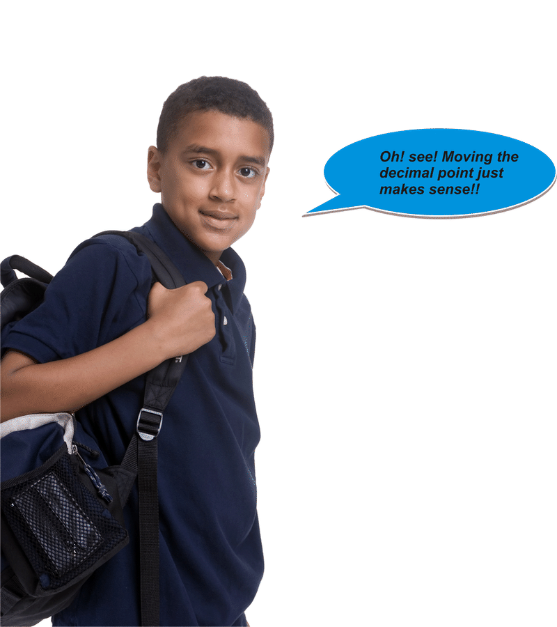

$$
\begin{align*}
&\text{KM to M} && \times 1000\\
&\text{M to CM} && \times 100\\
&\text{CM to MM} && \times 10\\
&\text{MM to CM} && \div 10\\
&\text{CM to M} && \div 100\\
&\text{M to KM} && \div 1000
\end{align*}
$$

**2T. Lesson Exercises**

**Practice converting the following units by moving the decimal point.**

1.  **500 m =\_\_\_\_\_ cm**
2.  **120 m = \_\_\_\_\_ km**
3.  **50 cm = \_\_\_\_\_m**

II. **Compare and Order Given Metric Units of Measure**

**Knowing how to convert between metric units of measure makes comparing and ordering measurements possible.**

**Do you remember how to compare decimals?** You line up the decimal points and compare the place values from left to right. Because units of measure often involve decimals, comparing measurements is similar. But to compare measurements, they have to have the same unit!

Example

Compare 4.56 g to 4.59 g.

**First, we have to be sure that these are the same unit of measure. Both are in grams, so we can look at the numbers to determine which is larger. 4.56 is less than 4.59, so we have our answer.**

**The answer is 4.56 g < 4.59 g.**

Example

Compare 743 km to 74,300,000 mm

**The first thing to notice is that these two units of measure are not the same. Therefore, we have to convert both of them to the same unit to compare them. We can convert both measurements to kilometers.** Multiply kilometers by 1,000,000 to get millimeters.

$743 \times 1,000,000 = 743,000,000$

So we can compare 743,000,000 to 74,300,000.

**Our answer is that 743 km > 74,300,000 mm.**

**Once you understand how to compare units, ordering them becomes quite simple. Just remember that you always have to convert the units so that they are the same!!**

**2U. Lesson Exercises**

**Practice comparing metric units of measure.**

1.  **45 cm \_\_\_\_\_\_\_ 5.5 mm**
2.  **2 km \_\_\_\_\_\_\_ 400 m**
3.  **6 l \_\_\_\_\_\_\_\_ 60,000 ml**

III. **Estimate Equivalence between Metric and Customary Units of Measure**

**We have been working inside the metric system of measurement.**

**Did you know there is another system of measurement?** The **_customary system of measurement_** is widely-used in the United States. You are probably already familiar with some of the customary units. Customary units of length include the inch, foot, yard, and mile; for weight, ounce and pound; for capacity, teaspoon, cup, pint, quart, and gallon.

**We encounter both metric units and customary units all the time—sometimes** **_at the same time_****.** One important aspect to understanding measurement is developing a general idea of the **_equivalence_** between the two systems.

**The chart below shows the** **_estimated_** **metric equivalent to common customary units.** Notice how all the customary units are in units of 1. 1 foot, for instance, is about 30.48 centimeters, so 2 feet is about 60.96 centimeters or $30.48 \times 2$. If you had a measurement in centimeters and wanted to estimate the number of inches, you would reverse the process, or divide by 30.48.

| **Customary Units** | **Metric Units** |
| --- | --- |
| 1 inch | 25.4 millimeters |
| 1 foot | 30.48 centimeters |
| 1 yard | 0.91 meters |
| 1 mile | 1.61 kilometers |
| 1 teaspoon | 4.93 milliliters |
| 1 cup | 0.24 liters |
| 1 pint | 0.47 liters |
| 1 quart | 0.95 liters |
| 1 gallon | 3.79 liters |
| 1 ounce | 28.35 grams |
| 1 pound | 0.45 kilograms |

**Completing these calculations exactly can be very tricky, so we use estimation to determine equivalence.**

Example

How many cups are equal to .48 liters?

**To answer this question, we can look at the chart. We can see that one cup is equal to .24 liters. Therefore, we can say that 2 cups is equal to .48 liters.**

**Our answer is 2 cups.**

Example

4 kilograms is equal to how many pounds?

**First, let’s look at the number of pounds to kilograms on our chart. 1 pound is equal to a little less than one-half of a kilogram. To find the number of pounds in a one kilogram, we can multiply the pounds by 2. 2 pounds are in 1 kilogram. Therefore, there are 8 pounds in four kilograms.**

**By estimating, we can find approximate equivalent measures for customary and metric units of measure!!**

IV. **Solve Real-World Problems Involving Conversions of Metric Units of Measure**

Metric units play key roles in measurements for athletes. Some examples of this include: track and field distances like the one in our introduction problem, in the size of an Olympic swimming pool, in the length and width of football fields and basketball courts. But metric units play important roles in many other aspects of everyday life; from the weight of vegetables at the farmer’s market, to the width of living room drapes.

**Now that you know how to convert and compare across metric units, you can use this knowledge to examine real-world situations. Before we go back to our introductory problem, let’s try one of these real-world problems.**

At the Harvest Festival, Jocelyn is trying to buy the largest pumpkin. Covert the mass of the following pumpkins into the same unit and order the pumpkins from greatest to least.

Pumpkin J—5.67 kg

Pumpkin K—5,510,000 mg

Pumpkin L—567,100 cg

Pumpkin M—5,800 g

**This problem asks us to order the pumpkins from greatest to least based on their mass. In order to do so, we need to make sure all the pumpkin weights are being represented by the same measurement unit. We’ll covert them to grams because grams are a good middle-point between the units represented.**

* Pumpkin J has a mass of 5.67 kg. To convert to grams, we need to multiply by 1,000 or move the decimal point three places to the right. 5.67 kg $\rightarrow$ 5,670 grams.
* Pumpkin K has a mass of 5,510,000 mg. To convert to grams, we need to divide by 1,000 or move the decimal point three places to the left. 5,510,000 mg $\rightarrow$ 5,510 grams.
* Pumpkin L has a mass of 567,100 cg. To convert to grams, we need to divide by 100 or move the decimal point two places to the left. 567,100 cg $\rightarrow$ 5,671 grams.
* Pumpkin M is already in grams $\rightarrow$ 5,800 grams.

**The answer (from greatest to least) is Pumpkin M, Pumpkin L, Pumpkin J, Pumpkin K.**

**Now let’s use all of this information to solve the original problem.**

Real Life Example Completed
---------------------------

**_The Shot Put_**

When Marcus was in sixth grade he thought that he was a runner. So, he tried out for the track team and his love of running and determination made him an easy choice for the team. All that first year, Marcus ran. Then, in the hurdles, Marcus fell and hurt his knee. Marcus was devastated. He thought his life of track and field was over. While his knee healed, Marcus watched his teammates practice. One day after practice, Marcus picked up the shotput and threw it across the field. His coach was watching and Marcus found a new way to participate. “Sometimes life is like that,” his coach, Mr. Samuels, said. “You think you are going to be doing one thing and something else crosses your path.

This year, Marcus is on the shot put team. His team is trying to figure out which field they should use to practice in. There are several different fields available, but the team is large, so they are looking for a field with a width of 45.65 meters.

Field A—0.004565 kilometers

Field B—45,650 millimeters

Field C—456.5 centimeters

Field D—456,500 millimeters

**Which field should his team choose?**

**First, we need to look at each unit of measurement to determine the best option for Marcus and his team. This problem asks us to compare the widths of these fields against 45.65 meters. Let’s begin by converting the widths of the each field into meters.**

* Field A has a width of 0.004565 kilometers. To convert to meters, we multiply by 1,000 or move the decimal point three places to the right. $0.004565 \ kilometers = 4.565 \ meters$.
* Field B has a width of 45,650 millimeters. To convert to meters, we divide by 1,000 or move the decimal point three places to the left. $45,650 \div 1,000 = 45.65 \ meters$.
* Field C has a width of 456.5 centimeters. To convert to meters, we divide by 100 or move the decimal point two places to the left. $456.5 \ centimeters \div 100 = 4.565 \ meters$.
* Field D has a width of 456,500 millimeters. To convert to meters, we divide by 1,000 or move the decimal point three places to the left. $456,500 \ millimeters = 456.5 \ meters$.

**Now we can compare the widths of the fields against 45.65 meters. Only Field B has the right width.**

**The solution is Field B.**

Vocabulary
----------

Here are the vocabulary words that are found in this lesson.

__Metric System__

a system of measurement developed by the French. Some units include meters, grams and liters.

__Customary System__

a system of measurement common in the United States. Some units include feet, pounds and gallons.

__Estimate__

to find an approximate measurement, useful in figuring out a reasonable number and not an exact one.

__Equivalence__

means equal.

Technology Integration
----------------------

!?[0](https://www.youtube.com/watch?v=w0nqd_HXHPQ)

[Khan Academy Unit Conversion](http://www.youtube.com/watch?v=w0nqd_HXHPQ)

!?[0](https://www.youtube.com/watch?v=cMFwpxkIFMY)

[James Sousa, Metric Unit Conversion](http://www.youtube.com/watch?v=cMFwpxkIFMY)

!?[0](https://www.youtube.com/watch?v=6GeUba-Jy8s)

[James Sousa, Example of Metric Unit Conversion](http://www.youtube.com/watch?v=6GeUba-Jy8s)

Other Videos:

http://www.mathplayground.com/howto_Metric.html – This is a video that helps explain the metric system.

http://www.teachertube.com/members/viewVideo.php?title=Metric_conversion&video_id=169320 - This video provides a presentation of metric conversion.

Time to Practice
----------------

Directions: Convert the following measurements into milliliters.

1. 65.57 liters

2. 28.203 centiliters

3. 0.009761 kiloliters

Directions: Convert the following measurements into centigrams.

4. 29.467 grams

5. 0.0562 milligrams

6. .0450584 kilograms

Directions: Convert the following measurements into kiloliters.

7. 89.96 liters

8. 45,217 milliliters

9. 3,120,700 centiliters

Directions: Compare or order the following measurements. Write &lt;, &gt;, or = for each \_\_\_.

10. 3.48 cl \_\_\_ 0.348 l

11. 57.21 kg \_\_\_ 572,100 cg

12. 91.17 mm \_\_\_ 0.09117 m

13. 4.4 cl \_\_\_ 0.44 ml

14. Order the following measurements from least to greatest: 79,282 kg, 7,838,200 cg, 7,938,200 mg, 79,382 g.

15. Order the following measurements from least to greatest: 2,261,000 cl, 21,061 l, 21.06 kl, 21,161,000 ml

Directions: Estimate a metric equivalent for the following customary measurements.

16. 28.5 ounces to grams

17. 11.75 inches to millimeters

18. 8 quarts to liters

19. 15 pounds to kilograms

Directions: Solve the following problems.

20. To join the swim team, Jessica swam every day. The distances she swam for the first four days were as follows: 1.65 km, 1,750 m, 185,000 cm, 1,950,000 mm. If the pattern continues, how many kilometers will she swim on the fifth day?

21. Mrs. Roth is moving to a new apartment. She can lift exactly 22.5 kg. Which of the following objects can she lift: box of books (23,500 g), statue (2,450,000 cg), computer (2,550,000 mg), potted plant (22.55 kg)?

</article>

## 3.0 Using Fractions

<article>

</article>

### 3.1 Comparing and Ordering Fractions

<article>

Introduction
------------

**_Cookies for the Bake Sale_**

“What are you doing?” asks her brother Kyle, coming into the kitchen.

“I’m making cookies for the bake sale,” Madison explains as she takes out the flour and the measuring cups.

“Can I help?” Kyle asks.

“Sure, now we need $2 \frac{1}{2}$ cups of flour. Here is the $\frac{1}{2}$ cup measuring cup, but I can’t find the 1 cup measuring cup. That’s okay though because I can measure five $\frac{1}{2}$ cups full of flour and that will be $2 \frac{1}{2}$ cups,” She explains to Kyle.

“You could also use the $\frac{1}{3}$ measuring cup and fill it up 8 times,” Kyle says picking up the $\frac{1}{3}$ measuring cup.

“I don’t think so,” Madison says. “I think that is too much flour.”

“No it isn’t,” Kyle argues.

**Who is correct? To figure out whether $2 \frac{1}{2}$ cups of flour is equal to eight $\frac{1}{3}$ cups of flour, you will need to understand how to compare and figure out equivalent fractions. Pay attention during this lesson and by the end of it, you will know who is correct and who needs to rethink their figuring.**

**_What You Will Learn_**

By the end of this lesson, you will be able to complete the following:

* Identify equivalent proper fractions, mixed numbers and improper fractions.
* Approximate fractions and mixed numbers using common benchmarks.
* Compare and order fractions and mixed numbers with and without approximation.
* Describe real-world portion or measurement situations by comparing and ordering fractions with and without approximation.

**_Teaching Time_**

I. **Identify Equivalent Proper Fractions, Mixed Numbers and Improper Fractions**

This lesson is all about fractions. To understand fractions, you will need to think about whole numbers too. Without whole numbers, it is impossible to understand fractions because a fraction is a part of a whole.

**_Whole numbers_** are numbers like 1, 8, 56, and 278—numbers that don’t contain fractional parts. Not all numbers are whole.

A **_Fraction_** describes a part of a whole number. You are certainly familiar with fractions in your everyday dealings with cooking. Consider a recipe that calls for $\frac{1}{2}$ cup of chocolate chips. You know that $\frac{1}{2}$ cup represents one-half of a whole cup.

**A fraction has certain parts. What are those parts?**

The number written below the bar in a fraction is the **_denominator_**, which tells how many parts the whole is divided into. The **_numerator_** is the number above the bar in a fraction, which tells how many parts of the whole you have. In the recipe that calls for $\frac{1}{2}$ cup, the denominator is 2, so we know that one whole cup is divided into 2 parts. The numerator is 1, so we know that we need 1 of the 2 parts of the whole cup. Notice that the fraction can be written up and down with one number on top of the other, or they may be written using a slash. With a slash, the first number is the top number or numerator and the bottom number is the second number.

**A whole can be divided into an infinite number of parts.** You can divide 1 cup of flour into thirds, sixths, tenths, and so on. **Fractions which describe the same part of a whole are called** **_equivalent fractions._** Remember that the word **_equivalent_** means equal. For instance, if you measure out $\frac{2}{4}$ cup of flour, $\frac{3}{6}$ cup of flour or $\frac{1}{2}$ cup of flour, you will have the same amount of flour.

When we have a fraction, we can create a new fraction that is equivalent to that fraction. We call this making equal fractions or making equivalent fractions.

**How do we do make equivalent fractions?**

**The first way is to work on** **_simplifying_** **a fraction to make it smaller.** To simplify a fraction, we can reduce the number in the numerator and denominator by dividing them by the same number. For example, $\frac{4}{8}$ can be rewritten as $\frac{1}{2}$ by dividing both the numerator and the denominator by 4. Note that not all fractions can be rewritten by dividing. If the only number that both the numerator and denominator are divisible by is 1, then the fraction is said to be in its simplest form.

Example

Simplify $\frac{6}{18}$

**To simplify this fraction, we look for a number that we can divide into both the numerator and the denominator. In this case, the number is 6.** We call 6 the **_Greatest Common Factor (GCF)_** of the numerator and the denominator. To simplify, we divide the numerator and the denominator by 6.

$\frac{6 \div 6}{18 \div 6}= \frac{1}{3}$

**The simplified answer is $\frac{1}{3}$.**

**The second way to create an equivalent fraction is by multiplying. We can create an equivalent fraction by multiplying the numerator and denominator by the same number. It doesn’t matter which number you choose, as long as the numbers are the same numbers.**

Example

Create an equivalent fraction for $\frac{7}{8}$.

**To do this, we need to multiply the numerator and the denominator by the same number. Let’s choose 2.**

$\frac{7 \times 2}{8 \times 2}= \frac{14}{16}$

**The answer is $\frac{14}{16}$.**

Example

Write four equivalent fractions for $\frac{8}{12}$.

**First, let’s see if we can reduce the numbers in the numerator and denominator. Are there any numbers that can be divided into both 8 and 12? 8 and 12 are both divisible by 2 and 4. So, the fraction $\frac{8}{12}$ is not in its simplest form.**

$$
\begin{align*}
\frac{8}{12} &= \frac{8 \div 2}{12 \div 2}=\frac{4}{6}\\
\frac{8}{12} &= \frac{8 \div 4}{12 \div 4}=\frac{2}{3}
\end{align*}
$$

**When we divide both the numerator and the denominator by 2, we get $\frac{4}{6}$ as an equivalent fraction. When we divide the numerator and the denominator by 4, we get $\frac{2}{3}$ as an equivalent fraction.**

**To find more equivalent fractions, we can multiply the numerator and denominator of $\frac{8}{12}$ by any number. Let’s multiply by 3. We get $\frac{24}{36}$ as an equivalent fraction to $\frac{8}{12}$. If we multiply the numerator and denominator by 5, we get $\frac{40}{60}$ as an equivalent fraction to $\frac{8}{12}$.**

$$
\begin{align*}
\frac{8}{12} &= \frac{8 \times 3}{12 \times 3}=\frac{24}{36}\\
\frac{8}{12} &= \frac{8 \times 5}{12 \times 5}=\frac{40}{60}
\end{align*}
$$

**The answers, $\frac{2}{3}, \frac{4}{6}, \frac{24}{36}, \frac{40}{60}$, are all equivalent fractions of $\frac{8}{12}$.**

**_Notice that creating equivalent fractions in this example involved both simplifying and multiplying!!_**

**There are other types of fractions too.**

**Sometimes when working with fractions, you use numbers which consist of a whole number and a fraction.** This is called a **_mixed number_**. For example, if a recipe calls for more than 1 cup of flour but less than 2 cups of flour, you need to use a mixed number to describe exactly how much flour you need. **A mixed number is written as a whole number with a fraction to the right of it.** Some common mixed numbers include: $1 \frac{1}{2}$ _or_ $2 \frac{2}{3}$.

**When the numerator of a fraction is greater than or equal to the denominator, you have an** **_improper fraction_****. Improper fractions are greater than or equal to 1.**

$\frac{2}{2}, \frac{3}{3}$, _and_ $\frac{10}{10}$ are all improper fractions that equal 1.

**Why is this?** Well, to understand this, you have to think about what the numerator and the denominator mean. The denominator is how many parts the whole is divided into. The numerator is how many of those parts you have. If you have two out of two parts, then you have the whole thing.

**$\frac{5}{2}, \frac{8}{3}$,** **_and_** **$\frac{11}{4}$ are all fractions that are greater than 1. These are called** **_improper fractions._**

**Mixed numbers and Improper Fractions can be equivalent or equal to each other.**

Improper fractions can be written as mixed numbers by dividing the numerator by the denominator and keeping the remainder as the numerator (while keeping the same denominator). Mixed numbers can be rewritten as improper fractions by multiplying the whole number in the mixed number by the denominator and adding the product to the numerator.

Example

$\frac{9}{2}=4 \frac{1}{2}$

These two quantities are equal. This improper fraction is equal to the mixed number.

Example

Write $3 \frac{2}{3}$ as an improper fraction.

**Remember, to write a mixed number as an improper fraction, we first multiply the whole number (3) by the denominator in the fraction, $3 \times 3 = 9$. Next, we add this number to the numerator of the fraction, $9 + 2 = 11$. We put this new number over the original denominator and we have our improper fraction.**

**Our answer is that $3 \frac{2}{3}$ can be written as the improper fraction $\frac{11}{3}$. It may help you to think about it this way: $\frac{3}{3} = 1$, so if we have a whole number of 3's, we also have $\frac{3}{3} + \frac{3}{3} + \frac{3}{3} + \frac{2}{3}$ or $\frac{11}{3}$**

Example

Write $\frac{7}{3}$ as a mixed number.

**To write an improper fraction as a mixed number, we divide the numerator by the denominator. $7 \div 3 = 2R1$. To finish, we write the remainder above the original denominator and write the whole number part of the quotient to the left of this new fraction.**

**Our answer is that $\frac{7}{3}$ can be written as the mixed number $2 \frac{1}{3}$.**

**2A. Lesson Exercises**

**Practice working with equivalent fractions.**

1.  **Simplify** $\frac{10}{12}$
2.  **Create an equivalent fraction for** $\frac{5}{6}$
3.  **Write** $\frac{15}{2}$ **as a mixed number**

II. **Approximate Fractions and Mixed Numbers Using Common Benchmarks**

Because a whole can be divided into an infinite number of parts, it is sometimes difficult to get a good sense of the value of a fraction or mixed number when the denominator of the fraction is large. **In order to get an approximate sense of the value of a fraction, we compare the complicated fraction with several simpler fractions, or benchmarks. The three basic fraction benchmarks are: 0, $\frac{1}{2}$ and 1.**

**When approximating the value of a fraction or mixed number, ask yourself which of these benchmarks is the number closest to?**

Let’s look at how to apply benchmarks to an example.

Example

What is the approximate size of $\frac{17}{18}$?

To begin with, we need to determine whether the fraction is closest to 0, one-half or 1 whole. The denominator is 18 and the numerator is 17. The numerator is close in value to the denominator. **The value of $\frac{17}{18}$ is closest to 1 because $\frac{18}{18}$ would be equal to one.**

**Our answer is 1.**

Example

What is the benchmark for $\frac{24}{49}$?

**First, we can look at the relationship between the numerator and the denominator. The numerator in this case is almost half the denominator. Therefore the correct benchmark is one-half.**

**What about mixed numbers?**

**We can identify benchmarks for mixed numbers too. The difference is that rather than zero, we look to the whole number of the mixed number, the half and the whole number next in consecutive order.**

Example

What is the benchmark for $7 \frac{1}{8}$?

**Here we have 7 and one-eighth. Is this closer to 7, $7 \frac{1}{2}$ or 8? If you think about it logically, one-eighth is a very small fraction. There is only one part out of eight. Therefore, it makes sense for our benchmark to be 7.**

**3B. Lesson Exercises**

**Choose the correct benchmark for each example.**

1.  $\frac{1}{12}$
2.  $\frac{5}{6}$
3.  $9 \frac{4}{9}$

III. **Compare and Order Fractions and Mixed Numbers with and without Approximation**

Now that you are able to look at a fraction and get a sense of its value by using approximation, you can easily compare and order fractions using this technique. By figuring out the benchmark, you can determine which fractions are larger or smaller than each other. This is the best way to approximate fractions as you compare and order them.

Sometimes, however, you can’t always rely on the approximation technique when comparing and ordering fractions. This is true when two fractions have the same benchmark, or when they have different denominators. In order to be exact when comparing and ordering fractions, you have to find a common denominator for all of the fractions. Then, compare or order the fractions by looking at the value of the numerator. This will give you an exact comparison.

Example

Use approximation to order $\frac{7}{8}$. $\frac{2}{5}, 3 \frac{5}{8}, \frac{1}{29}$ _and_ $\frac{29}{30}$ from greatest to least.

**We begin by getting an approximate sense of the value of each of the fractions in the group by comparing each fraction with the common benchmarks 0, $\frac{1}{2}$ and 1.**

Because the number 7, which is the numerator in the fraction $\frac{7}{8}$ is very close in value to the denominator (8), we say that $\frac{7}{8}$ is approximately 1.

In the fraction, $\frac{2}{5}$, the numerator is approximately $\frac{1}{2}$ of the denominator. So, we say that $\frac{2}{5}$ is about $\frac{1}{2}$.

The number $3 \frac{5}{8}$ is the only mixed number in the group, so we can see immediately that this number is larger than all of the other numbers in the group because it is greater than 1.

In the fraction, $\frac{1}{29}$, the denominator is much greater than the numerator, so $\frac{1}{29}$ is closest to the benchmark 0.

The numerator of 29 in the fraction $\frac{29}{30}$ is close in value to the denominator, 30, so $\frac{29}{30}$ is approximately 1.

**Now that we have the approximate values of each fraction in the group, we write the fractions in a preliminary greatest to least order with the benchmarks in parentheses:** $3 \frac{5}{8} \left(3 \frac{1}{2} \right), \frac{7}{8} (1), \frac{29}{30} (1), \frac{2}{5} \left(\frac{1}{2}\right), \frac{1}{29} (0)$.

**This approximation technique helps with most of the fractions in the group, but there are two fractions which are close to 1.** We know that both $\frac{7}{8}$ and $\frac{29}{30}$ are less than 1, but which of the two fractions is closest to 1? One helpful way to determine which fraction is closest to 1 is to draw two number lines between 0 and 1, arranged so that one number line is above the other. Divide the top number line into eight equal parts (eighths) and the bottom number line into thirty equal parts (thirtieths).

**The answer is** $3 \frac{5}{8}, \frac{29}{30}, \frac{7}{8}, \frac{2}{5}, \frac{1}{29}$.

Example

Compare $\frac{2}{3}$ _and_ $\frac{5}{7}$. Write >, <, or =.

**At first glance, it is hard to compare the two fractions because they have different denominators.** Remember the second mentioned method in comparing fractions is to find the common denominator. Look at the two denominators. Sometimes when comparing fractions we see fractions that have denominators that are multiples of the smaller denominator, and thus could be simplified so that both fractions have common denominators, or that could be multiplied to match a larger denominator.

For example, consider $\frac{3}{9}$ and $\frac{2}{3}$. We see that in the fraction $\frac{3}{9}$ the 9 is a multiple of 3 and could be simplified by dividing the top and the bottom by 3. When we do this we get $\frac{1}{3}$. Now we can compare the two fractions: $\frac{1}{3}$ and $\frac{2}{3}$, so $\frac{1}{3} < \frac{2}{3}$.

Also, we could have changed $\frac{2}{3}$ to $\frac{6}{9}$ and compare the fractions in this way also.

$\frac{3}{9}$ and $\frac{6}{9}$ - our comparison is the same, $\frac{3}{9} < \frac{6}{9}$

In this problem, 7 is not a multiple of 3. The **_lowest common denominator_** in this instance can only be the product of the two denominators $(3 \times 7 = 21)$. **In order to find an equivalent fraction for $\frac{2}{3}$ with a denominator of 21, we multiply both the numerator and denominator of $\frac{2}{3}$ by 7. We get an equivalent fraction of $\frac{14}{21}$. In order to find an equivalent fraction for $\frac{5}{7}$ with a denominator of 21, we multiply both the numerator and denominator of $\frac{5}{7}$ by 3. We get an equivalent fraction of $\frac{15}{21}$.**

$$
\frac{2}{3} \times \frac{7}{7}=\frac{14}{21}\\
\frac{5}{7} \times \frac{3}{3}=\frac{15}{21}
$$

**Now that we have a common denominator between the two fractions, we can simply compare the numerators.**

**The answer is that $\frac{2}{3} < \frac{5}{7}$.**

**3C. Lesson Exercises**

**Compare using &lt;, &gt;, or =**

1.  $\frac{1}{3}$ **_and_** $\frac{5}{6}$
2.  $\frac{2}{9}$ **_and_** $\frac{7}{11}$
3.  $\frac{8}{9}$ **_and_** $\frac{3}{4}$

IV. **Describe Real-World Portion or Measurement Situations by Comparing and Ordering Fractions with and without Approximation**

**With common measurement units, such as feet, cups, inches and ounces, we often use fractions to describe more precise measurements in relation to other measurements.** You saw an example like this in our introductory problem. For example, if a recipe calls for $\frac{2}{3}$ cups of sugar, in proportion to the other measurements, 1 whole cup of sugar will make it too sweet, $\frac{1}{2}$ cup of sugar won’t make it sweet enough.

In the long jump contest, Peter jumped $5 \frac{3}{8}$ feet, Sharon jumped $6 \frac{3}{5}$ feet and Juan jumped $6 \frac{2}{7}$ feet. Now order their jump distances from greatest to least.

**The problem asks us to order the jump distances from greatest to least. We have three mixed numbers, so we should look first at the whole number parts of the mixed numbers to see if we can compare the jump distances.**

Peter jumped more than 5 feet, but less than 6 feet. Sharon jumped more than 6 feet, but less than 7 feet. Juan also jumped more than 6 feet, but less than 7 feet.

Simply by comparing the whole numbers, we can see that Peter jumped the shortest distance because he jumped less than 6 feet. Because Sharon and Juan both jumped between 6 and 7 feet, we need to compare the fractional part of their jumps. Sharon jumped $\frac{3}{5}$ of a foot more than 6 feet and Juan jumped $\frac{2}{7}$ of a foot more than 6 feet. In order to compare these two fractions, we have to find a common denominator. The lowest common denominator for these two fractions is 35. We get an equivalent fraction of $\frac{21}{35}$ for $\frac{3}{5}$ when we multiply both the numerator and denominator by 7. We get an equivalent fraction of $\frac{10}{35}$ for $\frac{2}{7}$ when we multiply both the numerator and denominator by 5. Now we can order the distances.

**The answer is Sharon $6 \frac{3}{5} \ ft$., Juan $6 \frac{2}{7} \ ft$., Peter $5 \frac{3}{8} \ ft$.**

**Examples like this one use fractional measurements. You can compare them and figure out which are equal and which are greater or less than each other. Now let’s go back to our original problem and help Madison with her measurement dilemma.**

Real Life Example Completed
---------------------------

**_The Bake Sale Cookies_**

The Seventh grade class is having a bake sale to raise money for class projects and trips. Madison has decided to bake her favorite kind of cookie for the sale. She loves linzer cookies with jam inside.

“What are you doing?” asks her brother Kyle, coming into the kitchen.

“I’m making cookies for the bake sale,” Madison explains, taking out the flour and the measuring cups.

“Can I help?” Kyle asks.

“Sure, now we need $2 \frac{1}{2}$ cups of flour. Here is the $\frac{1}{2}$ measuring cup, but I can’t find the 1 cup measuring cup. That’s okay though because I can measure five $\frac{1}{2}$ cups full of flour and that will be $2 \frac{1}{2}$ cups,” She explains to Kyle.

“You could also use the $\frac{1}{3}$ measuring cup and fill it up 8 times,” Kyle says picking up the $\frac{1}{3}$ measuring cup.

“I don’t think so,” Madison says. “I think that is too much flour.”

“No it isn’t,” Kyle argues.

**To solve this problem, we need to compare Madison’s measurement with Kyle’s measurement.**

**Madison’s measurement is** $2 \frac{1}{2}$.

**Kyle’s measurement is 8 one-third cups which is** $\frac{8}{3}$.

**Next, we compare the two quantities. Kyle thinks that his measurement is equal to Madison’s. To see if he is correct, we convert the improper fraction to a mixed number. That will make our comparison much easier.**

$\frac{8}{3}=2 \frac{2}{3}$

**Now we compare** $2 \frac{1}{2} < 2 \frac{2}{3}$.

**Madison is correct. If she uses Kyle’s measurement technique, she will have too much flour! Kyle needs to remember that two-thirds is greater than one-half.**

**You can check this by taking the fraction part of each and rewriting them with a common denominator.**

$$
\begin{align*}
\frac{1}{2} &= \frac{3}{6}\\ 
\frac{2}{3} &= \frac{4}{6}
\end{align*}
$$

**You can see that two-thirds is greater than one-half.**

Vocabulary
----------

Here are the vocabulary words that are found in this lesson.

__Whole Number__

a number that is a counting number like 5, 7, 10, or 22.

__Fraction__

a part of a whole.

__Numerator__

the top number in a fraction.

__Denominator__

the bottom number in a fraction. It tells you how many parts the whole is divided into.

__Equivalent Fractions__

equal fractions

__Equivalent__

equal

__Simplifying__

making a fraction smaller

__Greatest Common Factor__

the largest number that will divide into two numbers.

__Mixed Number__

a whole number with a fraction

__Improper Fraction__

when the numerator is greater than the denominator in a fraction

Technology Integration
----------------------

!?[0](https://www.youtube.com/watch?v=1xuf6ZKF1_I)

[Khan Academy Mixed Numbers and Improper Fractions](http://www.youtube.com/watch?v=1xuf6ZKF1_I)

!?[0](https://www.youtube.com/watch?v=-rE-2wPdD30)

[James Sousa, Comparing Fractions with Different Denominators Using Inequality Symbols](http://www.youtube.com/watch?v=-rE-2wPdD30)

!?[0](https://www.youtube.com/watch?v=4CGEssgAIlA)

[James Sousa, Example of Ordering Fractions with Different Denominators from Least to Greatest](http://www.youtube.com/watch?v=4CGEssgAIlA)

!?[0](https://www.youtube.com/watch?v=snPPwBp6tSQ)

[James Sousa, Converting Between Improper Fractions and Mixed Numbers](http://www.youtube.com/watch?v=snPPwBp6tSQ)

!?[0](https://www.youtube.com/watch?v=p_YRBcZ4u4g)

[James Sousa, Example of Converting a Mixed Number to an Improper Fraction](http://www.youtube.com/watch?v=p_YRBcZ4u4g)

!?[0](https://www.youtube.com/watch?v=e6uoYVg5Q30)

[James Sousa, Example of Converting an Improper Fraction to a Mixed Number](http://www.youtube.com/watch?v=e6uoYVg5Q30)

Other Videos:

http://www.mathplayground.com/howto_comparefractions.html – This is a video on comparing and ordering fractions.

Time to Practice
----------------

1. Write four equivalent fractions for $\frac{6}{8}$.

Directions: Write the following mixed numbers as improper fractions

2. $2 \frac{5}{8}$

3. $3 \frac{2}{5}$

4. $1 \frac{1}{7}$

5. $5 \frac{4}{9}$

Directions: Write the following improper fractions as mixed numbers.

6. $\frac{29}{28}$

7. $\frac{12}{5}$

8. $\frac{9}{2}$

9. $\frac{17}{8}$

10. $\frac{22}{3}$

Directions: Approximate the value of the following fractions using the benchmarks 0, $\frac{1}{2}$ and 1.

11. $\frac{9}{10}$

12. $\frac{11}{20}$

13. $\frac{2}{32}$

14. $\frac{21}{22}$

Directions: Approximate the value of the following mixed numbers.

15. $2 \frac{79}{80}$

16. $6 \frac{1}{10}$

17. $43 \frac{7}{15}$

18. $8 \frac{7}{99}$

19. Use approximation to order $\frac{1}{9}, 2 \frac{7}{15}, 2 \frac{5}{8}, \frac{16}{17}$ and $\frac{5}{9}$ from greatest to least.

20. Compare $\frac{2}{5}$ and $\frac{3}{7}$. Write >, <, or =.

21. Compare $\frac{5}{6}$ and $\frac{7}{9}$. Write >, <, or =.

22. Brantley is making an asparagus souffle, which calls for $3 \frac{3}{7}$ cup of cheese, $3 \frac{2}{3}$ cup of asparagus and $2 \frac{2}{5}$ cup of parsley. Using approximation order the ingredients from the largest amount used to the least amount used

23. Geraldine is putting a pool table in her living room. She wants to put it against the longest wall of the room. Wall $A$ is $12 \frac{4}{9}$ feet and wall $B$ is $12 \frac{2}{5}$ feet. Against which wall will Geraldine put her pool table?

</article>

### 3.2 Adding Fractions

<article>

Introduction
------------

**_The Blueberries_**

Teri tells Ren that she needs $5 \frac{1}{2}$ cups of blueberries for the pie. Plus she will need an additional $\frac{1}{4}$ of a cup for decorating the top of the pie. Ren know that he will need $1 \frac{1}{3}$ cups of blueberries for his pie.

If blueberries come in pints and there are two cups in one pint, how many pints of blueberries will Ren need to buy at the store?

Ren takes out a piece of paper and a pencil. **You can figure this out too. In this lesson you will learn all that you need to know to help Ren figure out the blueberry dilemma.**

**_What You Will Learn_**

In this lesson, you will learn the following skills.

* Add fractions and mixed numbers.
* Estimate sums of fractions and mixed numbers.
* Identify and apply the commutative and associative properties of addition in fraction operations, using numerical and variable expressions.
* Model and solve real-world problems using simple equations involving sums of fractions or mixed numbers.

**_Teaching Time_**

I. **Add Fractions and Mixed Numbers**

**Adding** **_fractions_** **and mixed numbers is as easy as adding whole numbers. The only trick is to make sure that the fractions we are adding have the same denominator.**

**We have to divide the whole into a new number of parts, that is, find a common denominator in order to get a fraction which accurately describes the new amount of flour.**

When we use the common denominator of 6 and add the fractions $\frac{3}{6}$ (equivalent fraction of $\frac{1}{2}$) to $\frac{2}{6}$ (equivalent fraction of $\frac{1}{3}$), we simply add the numerators and keep the denominator the same. If we add $\frac{1}{2}$ cup of flour to $\frac{1}{3}$ cup of flour, we get $\frac{5}{6}$ of a cup of flour.

")

\[Figure 4\]

**How do we do this when we add mixed numbers and fractions?**

**Mixed numbers and fractions can be a little tricky because you are dealing parts and wholes. You can find the sum of them though by keeping in mind that you add parts with parts and wholes with wholes.** Here is an example.

Example

$\frac{3}{4}+ 2 \frac{1}{3}$

**Here we are going to add a fraction and a mixed number together. You can see that the fractions have different denominators. This is the first thing that we need to change. Both fractions must have the same denominator before we can add them.**

To do this, we find the common denominator of 3 and 4. That number is 12. Now we rename the fractions in terms of twelfths, and create equivalent fractions with denominators of 12.

$$
\begin{align*}
\frac{3}{4} &= \frac{9}{12}\\ 
\frac{1}{3} &= \frac{4}{12}
\end{align*}
$$

**Now we can add them. When the denominators are the same, we have to add the numerators only.**

$\frac{9}{12}+\frac{4}{12}=\frac{13}{12}$

**We can change $\frac{13}{12}$ into the mixed number $1 \frac{1}{12}$.**

**Now we had a 2 from the original mixed number. We add this to our sum.**

**The answer is** $3 \frac{1}{12}$.

**_Here our answer is in simplest form so we leave it alone. If you can simplify an answer you must do so or the answer is incorrect._**

**Here are the steps.**

**Adding Mixed Numbers**

1.  **Add the fractions.**
2.  **Add the whole numbers**
3.  **Add the sum of the fractions to the whole numbers**
4.  **Be sure that your answer is in simplest form.**

**3D. Lesson Exercises**

1.  $9 \frac{1}{2} + 22 \frac{1}{4}$
2.  $2 \frac{1}{3} + 8 \frac{2}{3}$
3.  $5 \frac{1}{3} + \frac{1}{7}$

II. **Estimate Sums of Fractions and Mixed Numbers**

**_Estimation_** **is a method for finding an approximate solution to a problem.** For example, the sum of 22 and 51 is exactly 73. We can estimate the sum by rounding to the tens place and adding $20 + 50$. Then we can say the sum of 22 and 51 is “about 70.”

**In the last lesson, we used three benchmarks (0, $\frac{1}{2}$ and 1) to get a sense of the approximate value of different fractions. We can use this same technique to estimate sums of two or more fractions and mixed numbers.**

**First, we approximate the value of each fraction or mixed number using the benchmarks 0, $\frac{1}{2}$ and 1.**

**Next, we find the sum of the approximate values.**

When you are approximating the value of mixed numbers, first figure out the approximate value of the fraction and then add it to the whole number. For example, the approximate value of $2 \frac{3}{4}$ is 3 because the approximate value of $\frac{3}{4}$ is $1 (2 +1 = 3)$.

**Even when you are asked to find an exact answer, estimation is a useful way to get an idea of a reasonable solution to a problem. Once you have finished solving for an exact answer to a problem, you can check your answer against the estimate. Refer back to the following steps if necessary.**

**Estimating sums of fractions and mixed numbers:**

1.  **Approximate the value of each of the fractions or mixed numbers by using the benchmarks 0, $\frac{1}{2}$ and 1**
2.  **Add these approximate values to get an estimated sum**

Example

Estimate the following sum, $\frac{5}{9} + \frac{1}{77}$

**First, we approximate the value of the individual fractions. $\frac{5}{9}$ is approximately $\frac{1}{2}$ and $\frac{1}{77}$ is approximately 0. Now, we rewrite the problem substituting the approximate values: $\frac{1}{2} + 0$ is about $\frac{1}{2}$.**

Example

Estimate the following sum, $3 \frac{6}{7} + 1 \frac{4}{9}$

**First, we approximate the value of each of the mixed numbers. The approximate value of $3 \frac{6}{7}$ is 4 because the approximate value of the fraction $\frac{6}{7}$ is $1 (3 + 1 = 4)$. The approximate value of $1 \frac{4}{9}$ is $1 \frac{1}{2}$ because the approximate value of $\frac{4}{9}$ is $\frac{1}{2}$. We rewrite the problem with the approximate values of the mixed numbers and it looks like this: $4 + 1 \frac{1}{2}$. We estimate that the sum of $3 \frac{6}{7}$ and $1 \frac{4}{9}$ is about $5 \frac{1}{2}$.**

**3E. Lesson Exercises**

**Estimate the following sums.**

1.  $\frac{6}{7}+\frac{1}{2}$
2.  $\frac{29}{30}+7 \frac{8}{10}$
3.  $1 \frac{1}{2}+ 3 \frac{5}{6}$

III. **Identify and Apply the Commutative and Associative Properties of Addition in Fraction Operations, using Numerical and Variable Expressions**

Now that we know the basics of adding fractions, we can use two mathematical properties of addition to help us solve more complicated problems.

**_The Commutative Property of Addition_** **states that the order of the addends does not change the sum.** Let’s test the property using simple whole numbers.

$$
\begin{align*}
& 4 + 5 + 9 = 18 && 5 + 4 + 9 = 18 && 9 + 5 + 4 = 18\\
& 4 + 9 + 5 = 18 && 5 + 9 + 4 = 18 && 9 + 4 + 5 = 18
\end{align*}
$$

As you can see, we can add the three addends (4, 5, and 9) in any orders. The Commutative Property of Addition works also works for four, five, even 100 addends.

**It works for fraction addends, too. This means that the order that you add fractions in does not change the sum of the fractions.**

Parentheses are grouping symbols used in math to let us know which operations to complete first. The order of operations tells us that operations in parentheses must be completed before any other operation. **_The Associative Property of Addition_** **states that the way in which addends are grouped does not change the sum.** Once again, let’s test the property using simple whole numbers.

$$
\begin{align*}
& (4 + 5) + 9 = 18 && (5 + 4) + 9 = 18 && (9 + 5) + 4 = 18
\end{align*}
$$

**Clearly, the different way the addends are grouped has no effect on the sum. The Associative Property of Addition also works for fraction addends.**

**How do we use these properties when adding fractions?**

These two properties are extremely useful when adding fractions. If you are adding three fractions and two of the fractions have like denominators, you can add those two fractions together and then find a common denominator with the third. This can be a big time saver.

**When you are working with variable expressions or with expressions which contain an algebraic unknown (like $x$) you can use the commutative and associative properties of addition to simplify the expression.** Let’s check out some examples.

Example

Simplify the following variable expressions using the associative and commutative properties of addition.

$3 \frac{2}{3} + x + \frac{1}{3}$

To simplify means to make smaller. We are going to simplify this expression. We use the Commutative Property of Addition to do this.

$3 \frac{2}{3}+\frac{1}{3}=4$

One-third plus two-thirds is three-thirds which is the same as one. We add one to the whole number three and get four.

**Our simplified expression is** $4 + x$.

Example

$\frac{3}{10} + \left(\frac{1}{4} + x\right)$

**To simplify this expression, we are going to use the Associative Property of Addition. The hint is that there are parentheses in this expression.**

$\left(\frac{3}{10} + \frac{1}{4}\right) + x$

Now we add three-tenths and one-fourth.

$$
\begin{align*}
\frac{3}{10} &= \frac{6}{20}\\ 
\frac{1}{4} &= \frac{5}{20}\\ 
\frac{6}{20}+\frac{5}{20} &= \frac{11}{20}
\end{align*}
$$

**Our answer is** $\frac{11}{20}+x$.

**3F. Lesson Exercises**

**Simplify each expression using the Commutative and Associative Properties of Addition. Be sure your answers are in simplest form.**

1.  $\frac{2}{3}+ y+ \frac{1}{5}$
2.  $\frac{1}{2}+ \left(\frac{1}{2}+ x\right)$
3.  $x+ \frac{4}{9}+\frac{2}{9}$

IV. **Model and Solve Real-World Problems Using Simple Equations Involving Sums of Fractions or Mixed Numbers**

Fractions describe parts of a whole. Because of their accuracy, they are useful in many real-world situations, but especially situations involving measurement. When you confront a situation that requires your math skills, it is helpful to think the problem out before you jump in and try to find an answer. Ask yourself: "What is the problem? What are we trying to find out? What information do we have that will help us solve this problem? What mathematical tools can you use to get the answer?" Let’s look at some real-world situations involving addition of fractions and learn more about problem solving.

Donte is making a costume with blue, red and black fabric. He has $6 \frac{1}{2}$ yards of blue fabric, $3 \frac{2}{3}$ yards of red fabric and $5 \frac{4}{5}$ yards of black fabric, how many yards of fabric does Donte have altogether?

Let’s look at the problem carefully and define the values that we know and the value or values that we want to know.

**We know that Donte has 3 types of fabric (blue, red and black) and we know also the lengths of each type of fabric. We want to find out how much fabric Donte has altogether. If we represent this problem in an equation, it would look like this:**

**Length of blue fabric + length of red fabric + length of black fabric = total length of fabric**

Since we know the lengths of the individual colors of fabric, we can rewrite the expression like this:

$6 \frac{1}{2} + 3 \frac{2}{3} + 5 \frac{4}{5} =$ total length of fabric.

If we add the mixed numbers together, we will learn what we want to find out. First, we will add the first two mixed numbers. We use the common denominator of 6 for the fractions and we find the sum of the two mixed numbers:

$6 \frac{3}{6} + 3 \frac{4}{6} = 9 \frac{7}{6}$

**Notice that seven-sixths is improper meaning that it is larger than one whole. We can convert this improper fraction to a mixed number.**

$9 \frac{7}{6}=10 \frac{1}{6}$

Now we can this new mixed number, $10 \frac{1}{6}$ to the length of the black fabric, $5 \frac{4}{5}$ yards.

We use the common denominator of 30 for the fractions and we find the sum of these mixed numbers. $10 \frac{5}{30} + 5 \frac{24}{30} = 15 \frac{29}{30}$

**We can use the exact sum or we can say that Donte has just about 16 yards of fabric.**

**Remember the dilemma with the blueberries? You now have all the skills that you need to help solve that problem. Let’s go back to the introductory problem and work it through.**

Real Life Example Completed
---------------------------

**_The Blueberries_**

Teri and Ren are both in the seventh grade. They are baking pies and muffins for the bake sale. Teri has decided to make a blueberry pie and Ren has decided to make blueberry muffins. While Teri works on making her pie crusts. Ren offers to go to the grocery store with his Mom to get the blueberries that they will need.

Teri tells Ren that she needs $5 \frac{1}{2}$ cups of blueberries for the pie. Plus she will need an additional $\frac{1}{4}$ of a cup for decorating the top of the pie. Ren know that he will need $1 \frac{1}{3}$ cups of blueberries for his pie.

If blueberries come in pints and there are two cups in one pint, how many pints of blueberries will Ren need to buy at the store?

Ren takes out a piece of paper and a pencil.

**First, we will need to find the sum of the blueberries. We will figure out how many cups of blueberries both Teri and Ren will need for their recipes.**

$5 \frac{1}{2}+\frac{1}{4}+1 \frac{1}{3}$

**Next, we need to rename each fraction with a common denominator. We can use 12 as our common denominator.**

$5 \frac{6}{12}+\frac{3}{12}+1 \frac{4}{12}$

**If we add the fraction parts, we get a sum of $\frac{13}{12}$. This improper fraction changes to $1 \frac{1}{12}$.**

**Next we add this to our whole numbers.**

**The sum of the blueberries is** $7 \frac{1}{12}$.

**Now we have to figure out how many pints Ren will need to purchase. There are two cups in a pint. To have enough blueberries, Ren will need to purchase 4 pints of blueberries. There will be some left over, but having some left over is better than not having enough!!**

Vocabulary
----------

Here are the vocabulary words that are found in this lesson.

__Fraction__

a part of a whole

__Mixed Number__

a whole number and a fraction

__Commutative Property of Addition__

states that the order in which you add values does not change the sum of the values.

__Associative Property of Addition__

the way that you group numbers does not change the sum of the numbers being added.

Technology Integration
----------------------

1.  http://www.mathplayground.com/howto_fractions_diffden.html – This video t!?[0](https://www.youtube.com/watch?v=52ZlXsFJULI)
    

[Khan Academy Adding and Subtracting Fractions](http://www.youtube.com/watch?v=52ZlXsFJULI)

!?[0](https://www.youtube.com/watch?v=d53wePmJZFY)

[James Sousa, Adding Fractions](http://www.youtube.com/watch?v=d53wePmJZFY)

!?[0](https://www.youtube.com/watch?v=LaSrytQ0pjw)

[James Sousa, Example of Adding Fractions with Different Denominators](http://www.youtube.com/watch?v=LaSrytQ0pjw)

!?[0](https://www.youtube.com/watch?v=tN3u-V3yseQ)

[James Sousa, Another Example of Adding Fractions with Different Denominators](http://www.youtube.com/watch?v=tN3u-V3yseQ)

!?[0](https://www.youtube.com/watch?v=f5a28iu-V6E)

[James Sousa, Adding Mixed Numbers](http://www.youtube.com/watch?v=f5a28iu-V6E)

Other Videos:

http://www.mathplayground.com/howto_fractions_diffden.html – This video teaches you how to add fractions with uncommon denominators.

Time to Practice
----------------

Directions: Add the following fractions and mixed numbers.

1. $\frac{3}{7} + \frac{1}{14}$

2. $\frac{3}{4} + \frac{1}{3}$

3. $\frac{2}{5}+ \frac{3}{10}$

4. $\frac{1}{9} + \frac{1}{6}$

5. $2 \frac{3}{5} + \frac{17}{20}$

6. $8 \frac{5}{12} + 2 \frac{1}{6}$

7. $1 \frac{2}{3} + 1 \frac{3}{4}$

8. $2 \frac{1}{5} + 4 \frac{14}{15}$

Directions: Estimate the sums.

9. $\frac{1}{29} + \frac{4}{5}$

10. $\frac{9}{11} + \frac{4}{10}$

11. $\frac{2}{5} + \frac{12}{13}$

12. $\frac{2}{71} + \frac{1}{29}$

Directions: Estimate the sums.

13. $3 \frac{6}{7}+ 2 \frac{10}{11}$

14. $8 \frac{1}{12} + 6 \frac{3}{7}$

15. $2 \frac{9}{10} + 3 \frac{1}{17}$

16. $1 \frac{2}{12} + \frac{44}{46}$

Directions: Add.

17. $\frac{1}{6}+\frac{2}{6}+\frac{3}{7}$

18. $\frac{1}{4}+ 3 \frac{5}{8} + 4 \frac{3}{4}$

19. $\frac{2}{9} + \left(\frac{1}{3} + \frac{5}{9}\right)$

20. $\left(2 \frac{7}{8} + \frac{2}{3}\right) + 1 \frac{1}{8}$

Directions: Simplify the expressions using the associative and commutative properties of addition.

21. $x + 3 \frac{2}{3} + 5 \frac{1}{6}$

22. $\frac{1}{4} + x + \frac{5}{8}$

23. $\left(\frac{1}{9} + x\right) + \frac{2}{9}$

24. $2 \frac{1}{14} + \left(x + 3 \frac{5}{7}\right)$

25. One-third of the CDs in Joseph’s CD collection are classical music CDs. Two-sevenths of the CDs are hip-hop CDs. What fraction of Joseph’s collection is classical and hip-hop.

26. Naira is making pinecone stew. First, she mixes $3 \frac{1}{5}$ cups of chopped pinecones with $1 \frac{1}{2}$ cups of mud. For the snail sauce on top, she uses another $1 \frac{3}{8}$ cups of chopped pinecones. How much chopped pinecone does Naira use for her recipe?

27. Jennifer is trying to determine if the cheerleading squad has enough ribbon for the pep rally on Friday. Kurt contributes $9 \frac{1}{6}$ feet of gold ribbon. Estelle contributes $\frac{3}{4}$ foot of red ribbon. Aaron brings in $5 \frac{2}{7}$ feet of gold ribbon at the last minute. How much ribbon does the cheerleading squad have?

28. Marcus and Anita are trying to complete a project. They finished $\frac{1}{4}$ of the project on Saturday. They got another four-sevenths of the project done on Tuesday. If the project needs to be finished by Thursday, write an algebraic expression that shows how much they have done on Saturday, how much they have done on Tuesday and how much they need to do on Wednesday.

</article>

### 3.3 Subtracting Fractions

<article>

Introduction
------------

**_Plenty of Peaches_**

Jesse is fascinated. So much so that he loses his focus and puts many, many peaches in his cloth bag. When the girl weighs it, Jesse watches her do the math in her head. She tells Jesse how much he owes and he pays her. Then she hands Jesse back the bag.

“How many pounds is this?” Jesse asks.

“You bought $6 \frac{1}{4}$ pounds of peaches,” She says focusing on another customer.

Jesse is surprised. He knows that he wasn’t paying very good attention, but he has a lot more peaches than he needs. How much more does he have? After Jesse makes his pie, how many pounds of peaches will be left over?

**To figure this out, you will need to understand how to subtract fractions and mixed numbers. Pay close attention because this lesson will cover all that you need to know. You will see this problem again at the end of the lesson and you will be ready to solve it!**

**_What You Will Learn_**

By the end of this lesson you will know how to complete the following:

* Subtract fractions and mixed numbers.
* Estimate differences of fractions and mixed numbers.
* Identify and apply the inverse property of addition in fraction operations, using numerical and variable expressions.
* Model and solve real-world problems using simple equations involving sums and differences of fractions or mixed numbers.

**_Teaching Time_**

I. **Subtract Fractions and Mixed Numbers**

**How do we subtract fractions and mixed numbers?**

If you know how to add fractions, then you already know how to subtract them. **The key is to make sure that the fractions that you are subtracting have the same denominator. If the fractions have the same denominator, then subtract the numerators just like you subtract whole numbers and keep the denominator the same in your answer.**

Example

$\frac{6}{9}-\frac{2}{9}$

Notice that the denominators are the same, so we can simply subtract the numerators.

$6 - 2 = 4$

**Our answer is** $\frac{4}{9}$.

If the denominators are not the same, make sure to find the **_lowest or least common denominator_** first and then do your subtracting. Think about the first example with sawing wood. If you want to subtract $\frac{1}{2}$ foot from a piece of wood that is $3 \frac{3}{4}$ feet long, you have to find a common denominator first.

We can choose 4 as the least common denominator and rename each fraction in terms of fourths. To do this, we create **_equivalent fractions_**. If you use the equivalent fraction $\frac{2}{4}$ for $\frac{1}{2}$, then you have the same denominator as the fraction in $3 \frac{3}{4}$.

$3 \frac{3}{4}-\frac{2}{4} = 3 \frac{1}{4}$

**This example actually uses a mixed number and a fraction. We can also subtract two mixed numbers. We do this in the same way. We subtract the fractions and then subtract the whole numbers.**

Example

$4 \frac{5}{6}-1 \frac{4}{6}$

**First, we subtract the fraction parts. These fractions have the same denominator, so we can simply subtract the numerators.**

$5 - 4 = 1$ the fraction here is $\frac{1}{6}$

**Next, we subtract the whole numbers.**

$4 - 1$

**Our final answer is $3 \frac{1}{6}$.**

**Sometimes, when you subtract mixed numbers, you will have to do an extra step. Think about this example.**

Imagine you are cutting, or subtracting, $1 \frac{3}{4}$ feet of wood from a piece of wood that is $3 \frac{1}{2}$ feet long. Your subtraction problem looks like this: $3 \frac{1}{2} - 1 \frac{3}{4}$.

After you find a common denominator, your subtraction problem now looks like this.

$3 \frac{2}{4} - 1 \frac{3}{4}$

$$
\begin{align*}
3 \frac{2}{4} &= \frac{(3 \times 4)+2}{4}=\frac{14}{4}\\
1 \frac{3}{4} &= \frac{(4 \times 1)+3}{4}=\frac{7}{4}
\end{align*}
$$

**Your new subtraction problem for the example looks like this.**

$\frac{14}{4} -\frac{7}{4}$

**Now you simply subtract the numerators and you get $\frac{7}{4}$. Now you convert this back into a mixed number. Do you remember how to do this?**

**Here are the steps for subtracting mixed numbers.**

**Subtracting Mixed Numbers:**

1.  **Make sure the fractions have a common denominator.**
2.  **If the fraction to the left of the minus sign is smaller than the fraction to the right of the minus sign – convert both mixed numbers into improper fractions**
3.  **Subtract the improper fractions**
4.  **Rewrite the difference as a mixed number.**

**3G. Lesson Exercises**

**Subtract the following fractions and mixed numbers. Be sure that your answer is in lowest terms.**

1.  $\frac{10}{12}-\frac{6}{12}$
2.  $\frac{6}{7}-\frac{3}{4}$
3.  $4 \frac{1}{4}-\frac{3}{4}$

II. **Estimate Differences of Fractions and Mixed Numbers**

**_Estimation_** is a method for finding an approximate solution to a problem. For example, $52 - 21$ is exactly 31. We can **_estimate_** the difference by rounding to the tens place and subtracting $50 - 20$. Then we can say that $52 - 21$ is “about 30.”

**To approximate the values of fractions, we compare the fractions in relation to three benchmarks, 0, $\frac{1}{2}$ and 1. Is the fraction closer to 0, $\frac{1}{2}$ or 1? If it’s closer to 1, we say that the value of the fraction is “about 1.”**

**We can use these approximate values of fractions to estimate the differences of fractions and mixed numbers.**

First, we approximate the value of each fraction or mixed number using the benchmarks 0, $\frac{1}{2}$ and 1.

Next, we find the difference between the approximate values.

**Even when you are asked to find an exact answer, estimation is a useful way to get an idea of a** **_reasonable_** **solution to a problem. Once you have finished solving for an exact answer of a problem, you can check your answer against the estimate. Refer back to the following steps if necessary.**

Example

Estimate the difference between $\frac{7}{8}-\frac{4}{9}$

First, we need to rewrite each fraction in terms of its benchmark. Seven-eighths is almost one, so we can say that the best benchmark is 1. Four - ninths is a little less than one-half, so we can use one-half as the benchmark.

Next, to find the best estimate, we subtract the benchmarks.

$1 - \frac{1}{2}=\frac{1}{2}$

**Our estimate is one-half.**

**We can also estimate differences of mixed numbers.**

Example

Estimate the difference between $5 \frac{14}{16}-5 \frac{1}{16}$

First, we need to rewrite each of these in terms of a benchmark. Now we use the whole numbers of 5 and 6 as our starting points. Five and fourteen-sixteenths is close to 6. We use 6 as our benchmark for the first mixed number.

Five and one-sixteenth is closest to five. We use 5 as our second benchmark.

Now we subtract the benchmarks to find an accurate estimate.

$6 - 5 = 1$

**Our estimate is 1.**

**3H. Lesson Exercises**

**Use benchmarks to estimate the differences.**

1.  $6 \frac{5}{6}-\frac{1}{10}$
2.  $\frac{8}{9}-\frac{3}{7}$
3.  $4 \frac{4}{5}-1 \frac{3}{5}$

III. **Identify and Apply the Inverse Property of Addition in Fraction Operations, using Numerical and Variable Expressions**

**Identify the information that you know and the information that you don’t know.** You know: the amount of blueberries required by the recipe $= 3 \frac{3}{4}$ cups; the amount of blueberries in your refrigerator $= 1 \frac{1}{2}$ cups. You don’t know the amount of blueberries you need to buy at the store. Let’s call that $x$, since it’s an unknown. If we write an equation to model the relationship between these amounts, it looks like this.

blueberries in refrigerator + blueberries you buy at the store = blueberries required for the pie recipe

When you insert the values (numerical and unknown) into the equation, it looks like this.

$1 \frac{1}{2} + x = 3 \frac{3}{4}$

This is how we can write an equation to solve a real-world problem.

**How do we solve this equation and figure out the value of the variable?**

We can use the **_Inverse Property of Addition_** to help us in solving equations.

**The Inverse Property of Addition** states that the sum of a number and its opposite are equal to 0. Let’s test it out.

$5 + (-5) = 0$

**_Even if you can’t remember how to work with negative numbers, you can still think this through and it will make sense. We have five and we take away five. Well, that answer is 0._**

**What does this have to do with solving equations?**

To solve an equation, we need to get the variable by itself on one side of the equals. In the example above, the $x$ is on one side with one and one-half. We need to move one and one-half to the other side of the equals. We can do this by using the Inverse Property of Addition. To get the $x$ alone, we need to have zero on the same side of the equation as the $x$. Here is how we use the Inverse Property of Addition.

$$
\begin{align*}
1 \ \frac{1}{2} + x &= 3 \ \frac{3}{4}\\ 
\left(-1 \ \frac{1}{2}\right)+1 \ \frac{1}{2} + x &= 3 \ \frac{3}{4}-1 \frac{1}{2}\\
0+x &= 3 \ \frac{3}{4}-1 \ \frac{1}{2}\\
x &= 3 \ \frac{3}{4}-1 \ \frac{1}{2}
\end{align*}
$$

Now we can simply subtract the mixed numbers. First, we need to rename each fraction in terms of fourths. Three and three-fourths is all set. We convert one and one-half to one and two-fourths and subtract.

**Our answer is $2 \frac{1}{4}$.**

**3I. Lesson Exercises**

**Solve each equation using the Inverse Property of Addition. Be sure that your answer is in simplest form.**

1.  $\frac{1}{6}+x=\frac{5}{6}$
2.  $\frac{4}{5}+ y=2 \frac{1}{2}$

IV. **Model and Solve Real-World Problems Using Simple Equations Involving Sums and Differences of Fractions or Mixed Numbers**

Have you begun to realize how useful fractions can be in everyday life? Jorge drinks $\frac{2}{3}$ of a glass of lemonade. Ursula and Andy will meet in $\frac{1}{4}$ of an hour.

**In this section, we’ll look at some real-world problems which involve adding and subtracting fractions. When solving real-world problems, it’s important to first** **_define terms._** **What information does the problem give us? What information does the problem ask us to find out? Once we know where we are and where we want to go, we can figure out how to get there.**

Benito works in a bakery and has baked the world’s longest loaf of cinnamon bread. His loaf measures $11 \frac{5}{8}$ feet. He cuts a piece that measures $1 \frac{1}{2}$ feet long, and gives it to his friend Pamela. He then cuts another piece $2 \frac{2}{3}$ feet long for his friend Serena. How much bread does he have left?

Let’s take careful inventory of the information that the problem gives us. We know that the whole loaf of bread is $11 \frac{5}{8}$ feet long. Pamela gets a piece $1 \frac{1}{2}$ feet long, that is her piece and Serena gets a piece $2 \frac{2}{3}$ feet long. **This is the given information.**

**What do we want to find out? We want to know the length of the bread after he cuts Pamela and Serena’s pieces (loaf after cutting $= x$). Let’s write an equation to show the relationship between the values:**

Whole loaf – Pamela’s piece – Serena’s piece = loaf after cutting

**When we substitute the given values, we have the following equation.**

$11 \frac{5}{8} - 1 \frac{1}{2}-2 \frac{2}{3} = x$

**Now, we simply solve from left to right.** First, find a common denominator between the fractions in $11 \frac{5}{8}$ and $1 \frac{1}{2}$. Let’s use 8, so we solve $11 \frac{5}{8}-1 \frac{4}{8} = 10 \frac{1}{8}$.

**Next, we can simplify the problem.**

$10 \frac{1}{8} - 2 \frac{2}{3} = x$

The lowest common denominator for the fractions is going to be 24. We simplify the problem further.

$10 \frac{3}{24} - 2 \frac{16}{24} = x$

**I can already see that I will have to convert the mixed numbers to improper fractions. Simplify again.**

$$
\begin{align*}
\frac{243}{24}-\frac{64}{24} &= x\\
x &= \frac{179}{24}
\end{align*}
$$

Next, we just convert the answer to a mixed number and write in simplest terms.

**Solution:** $7 \frac{11}{24}$ feet or about $7 \frac{1}{2}$ feet

**Now let’s go back to the introduction problem and help Jesse with his peach problem.**

Real Life Example Completed
---------------------------

**_Plenty of Peaches_**

Jesse has decided to make peach pie for the bake sale. His recipe calls for $2 \frac{1}{2}$ pounds of peaches. Jesse’s older brother Jeff drives him to the farmer’s market to pick up his peaches. When Jesse gets there, he is amazed at how fast paced the market is. There are several people working behind the counter and they seem to be adding up all of the figures in their heads. Jesse is amazed. He loves math but he can’t even imagine adding up so many numbers in his head at one time.

Jesse is fascinated. So much so that he loses his focus and puts many, many peaches in his cloth bag. When the girl weighs it, Jesse watches her do the math in her head. She tells Jesse how much he owes and he pays her. Then she hands Jesse back the bag.

“How many pounds is this?” Jesse asks.

“You bought $6 \frac{1}{4}$ pounds of peaches,” She says focusing on another customer.

Jesse is surprised. He knows that he wasn’t paying very good attention, but he has a lot more peaches than he needs. How much does he have? After Jesse makes his pie, how many pounds of peaches will be left over?

**To solve this problem, we will need to subtract the number of pounds that Jesse needs for his recipe from the number of pounds that he purchases.**

$6 \frac{1}{4}-2 \frac{1}{2}$

**These fractions have different denominators, so we need to rename them using a common denominator. The lowest common denominator here is 4.**

$6 \frac{1}{4}$ **is all set.**

$2 \frac{1}{2}=2 \frac{2}{4}$

**We can rewrite the problem.**

$6 \frac{1}{4}-2 \frac{2}{4}$

**Next, we have to convert these to improper fractions because we can’t subtract two-fourths from one-fourth.**

$\frac{25}{4}-\frac{10}{4}=\frac{15}{4}$

**To write it in simplest form, we convert this improper fraction to a mixed number.**

**Our answer is $3 \frac{3}{4}$ pounds of peaches left over.**

Vocabulary
----------

Here are the vocabulary words that are found in this lesson.

__Lowest Common Denominator__

when two fractions have different denominators, we use the lowest common denominator to rename each fraction in terms of that common number. The lowest common denominator is also a least common multiple of the denominators.

__Equivalent Fractions__

equal fractions

__Improper Fractions__

when the numerator of a fraction is larger than the denominator

__Estimation__

finding an approximate answer

__Inverse Property of Addition__

when you add the inverse of a number, the answer is zero.

Technology Integration
----------------------

!?[0](https://www.youtube.com/watch?v=52ZlXsFJULI)

[Khan Academy Adding and Subtracting Fractions](http://www.youtube.com/watch?v=52ZlXsFJULI)

!?[0](https://www.youtube.com/watch?v=Et84c52ipX0)

[James Sousa, Subtracting Mixed Numbers with Like Denominators](http://www.youtube.com/watch?v=Et84c52ipX0)

!?[0](https://www.youtube.com/watch?v=SdbmMLmhnVU)

[James Sousa, Subtract Mixed Numbers Using Improper Fractions](http://www.youtube.com/watch?v=SdbmMLmhnVU)

!?[0](https://www.youtube.com/watch?v=BInnWXsA4xA)

[James Sousa, Subtraction of Mixed Numbers](http://www.youtube.com/watch?v=BInnWXsA4xA)

Other Videos:

http://www.teachertube.com/viewVideo.php?video_id=141252 – This is a video on adding and subtracting fractions.

Time to Practice
----------------

Directions: Subtract.

1. $\frac{7}{10}-\frac{1}{4}$

2. $\frac{4}{8}-\frac{1}{2}$

3. $\frac{4}{7}-\frac{1}{21}$

4. $\frac{3}{4}-\frac{1}{8}$

5. $3 \frac{1}{10}-\frac{1}{5}$

6. $4 \frac{3}{8}-3 \frac{1}{4}$

7. $2 \frac{1}{6}-1 \frac{1}{3}$

8. $9 \frac{1}{2}- 7 \frac{1}{7}$

Directions: Estimate the difference

9. $\frac{14}{16}-\frac{1}{11}$

10. $\frac{28}{60}-\frac{6}{13}$

11. $\frac{6}{7}-\frac{2}{145}$

12. $\frac{32}{33}-\frac{5}{12}$

13. $14 \frac{20}{21}-3 \frac{18}{19}$

14. $2 \frac{1}{49}-1 \frac{13}{14}$

15. $3 \frac{2}{21}-2 \frac{6}{11}$

16. $4 \frac{8}{17}-\frac{71}{73}$

Directions: Solve for $x$.

17. $x + \frac{2}{3} = \frac{5}{6}$

18. $x - 1 \frac{1}{2} = 4$

19. $2 \frac{1}{4} + x = 3 \frac{3}{4}$

20. $x - \frac{7}{8} = 2 \frac{3}{4}$

21. Ludmilla, Brent and Rudy have $8 \frac{5}{6}$ feet of taffy that they have to sell to raise money for the school drama club. Brent has already sold $3 \frac{2}{3}$ feet of taffy and Rudy plans to sell exactly $2 \frac{3}{4}$ feet. How much taffy does Ludmilla have to sell, if they sell all of the taffy?

22. Ron, Jung-Ho and Sarah have a lawn mowing business. Today they are cutting an enormous lawn. Sarah agrees to start and will mow $\frac{3}{8}$ of the lawn. Ron will only mow $\frac{1}{7}$ of the lawn, but he’s willing to work during the hottest time of the day. How much of the lawn is Jung-Ho responsible for mowing in order to complete the job?

</article>

### 3.4 Multiplying Fractions

<article>

Introduction
------------

**_The Class Cookie Count_**

Of the three-fourths that baked, one-half of them made cookies. Michelle is trying to keep track of who did what for the bake sale. She has created a list and is writing down what each student’s participation was.

This is where she is puzzled. Michelle wants to figure out three different things. How many students baked for the bake sale, how many students baked cookies, and what fraction of the class baked cookies?

**To figure these things out, Michelle will need to know how to multiply fractions. In this lesson, you will learn all about multiplying fractions. Take notes on how this is done, because at the end of the lesson, you will see this problem again.**

**_What You Will Learn_**

In this lesson, you will learn how to do the following:

* Multiply fractions and mixed numbers
* Estimate products of fractions and mixed numbers
* Identify and apply the Commutative and Associative Properties of Multiplication in fraction operations, using numerical and variable expressions.
* Model and solve real-world problems using simple equations involving products of fractions or mixed numbers.

**_Teaching Time_**

I. **Multiply Fractions and Mixed Numbers**

You have already learned how to add and subtract fractions, but when you have a fraction and you want to figure out a part of that fraction, you need to multiply. Remember, that **a** **_fraction_** **is a part of a whole.** Sometimes it is tricky to figure out when to multiply fractions when you are faced with a real-world problem. First, let’s learn how to actually multiply fractions and then we can look at applying this to some real-world problems.

**Multiplying fractions is always at least a two-step process.**

First, you line up two fractions next two each other, and then you are ready to start multiplying.

$\frac{1}{2} \cdot \frac{4}{5}$

**_Notice that we used a dot to show that we were multiplying._**

**You will multiply twice. First, multiply the numerators and write the product of the numerators above a fraction bar. Next, multiply the denominators and write that product underneath the fraction bar.** You don’t have to find a common denominator. You do, however, have to reduce your answer to simplest terms. We usually think of multiplying as _increasing_, but don’t be surprised when you get a product that is smaller than one of the factors that you are multiplying.

Let’s try this out.

Example

$\frac{1}{2} \cdot \frac{4}{5}=\frac{1 \times 4}{2 \times 5}=\frac{4}{10}$

Now we have a fraction called $\frac{4}{10}$. What next?

$\frac{4}{10}=\frac{4 \div 2}{10 \div 2}=\frac{2}{5}$

**Our final answer is $\frac{2}{5}$.**

**What about a fraction and a whole number?**

When you multiply a fraction and a whole number, we have to make the whole number into a fraction. Then multiply across just as you would with two fractions and finally, simplify your answer if possible.

Example

$5 \cdot \frac{1}{2}= \frac{5}{1} \cdot \frac{1}{2}=\frac{5}{2}=2 \frac{1}{2}$

**How do we multiply mixed numbers?**

**Because** **_mixed numbers_** **involve wholes and parts, multiplying mixed numbers requires an extra step.** Remember improper fractions? It’s essential that you convert mixed numbers to improper fractions before you multiply. Once you have the mixed numbers in the improper fraction form, multiply the numerators and then multiply the denominators. If you have an improper fraction as your product, convert it back to a mixed number as your final answer.

Let’s look at an example.

Example

$3 \frac{1}{2} \cdot 2 \frac{1}{3}$

**First, we convert each to an improper fraction.**

$$
\begin{align*}
3 \frac{1}{2} &= \frac{7}{2}\\ 
2 \frac{1}{3} &= \frac{7}{3}
\end{align*}
$$

**Next, we multiply the two improper fractions.**

$\frac{7}{2} \cdot \frac{7}{3}=\frac{49}{6}$

**Now we can convert this improper fraction to a mixed number.**

$\frac{49}{6}=8 \frac{1}{6}$

**Our final answer is $8 \frac{1}{6}$.**

**Sometimes, when you multiply fractions or mixed numbers, you can end up with very large numbers. When this happens, you can simplify BEFORE multiplying. You simplify on the diagonals by using the greatest common factor of the numbers on the diagonals.**

Let’s look at an example.

Example

$\frac{2}{9} \cdot \frac{18}{30}$

**If we look at the numbers on the diagonals, we can see that there are common factors both ways. The greatest common factor of two and thirty is 2. We can divide both by two to simplify them. The greatest common factor of 9 and 18 is 9. We can divide both by 9. Let’s simplify on the diagonals now.**

$\xcancel{\frac{2}{9} \cdot \frac{18}{30}} = \frac{1}{1} \cdot \frac{2}{15}$

**Now we multiply across for our final answer.**

**The answer is $\frac{2}{15}$**

**3J. Lesson Exercises**

**Multiply. Be sure that your answer is in simplest form.**

1.  $\frac{1}{3} \cdot \frac{5}{6}$
2.  $\frac{18}{20} \cdot \frac{4}{9}$
3.  $2 \frac{1}{5} \cdot 3 \frac{1}{2}$

II. **Estimate Products of Fractions and Mixed Numbers**

**By now you are very familiar with** **_estimation_** **as a tool for getting an approximate sense of the value of numbers, sums of numbers and differences of numbers. Now, we are going to add our knowledge of estimation to get approximate answers for products of fractions.**

**Just like rounding whole numbers, we can find approximate values of fractions by comparing the fractions to three benchmarks, 0, $\frac{1}{2}$ and 1.** Is the fraction closer to 0, $\frac{1}{2}$ or 1? If it’s closest to one-half, we say that the value of the fraction is “about $\frac{1}{2}$.” We can use these approximate values of fractions to estimate the products of fractions and mixed numbers.

**Next, we find the product of the approximate values.** Even when you are asked to find an exact answer, estimation is a useful way to get an idea of a _reasonable_ solution to a problem. Once you have finished solving for the exact answer of a problem, you can check your answer against the estimate. Refer back to the following steps if necessary.

Example

$\frac{19}{20} \cdot \frac{6}{7}$

**First, we have to take each fraction and find its benchmark. Nineteen-twentieths is close to 1. Six-sevenths is also close to one.**

$1 \times 1 = 1$

**We can say that $\frac{19}{20} \cdot \frac{6}{7}$ is approximately 1.**

**What about mixed numbers?**

Mixed numbers work the same way except that your benchmarks will have whole numbers in them too. Let’s look at an example.

Example

$3 \frac{6}{8} \cdot 5 \frac{1}{10}$

**Three and six-eighths is closest to 4.**

**Five and one-tenths is closest to 5.**

$4 \times 5 = 20$

**We can say that $3 \frac{6}{8} \cdot 5 \frac{1}{10}$ is approximately 20.**

**3K. Lesson Exercises**

**Estimate each product using benchmarks.**

1.  $\frac{1}{12} \cdot \frac{2}{11}$
2.  $\frac{9}{10} \cdot \frac{3}{6}$
3.  $4 \frac{1}{8} \cdot 2 \frac{11}{13}$

III. **Identify and Apply the Commutative and Associative Property of Multiplication in Fraction Operations, using Numerical and Variable Expressions**

Do you remember the **_commutative and associative properties of addition_**? Knowing how the mechanism of addition works helped us solve more complicated addition problems involving fractions. The properties of multiplication are a lot like the properties of addition. In this lesson, we are going to discover how to use the **commutative property of multiplication** and the **associative property of multiplication**.

**The** **_Commutative Property of Multiplication_** **states that** **_the order that the factors are multiplied in does not change the product._** Let’s test the property using simple whole numbers.

$$
\begin{align*}
& 1 \cdot 2 \cdot 3 = 6 && 2 \cdot 1 \cdot 3 = 6 && 2 \cdot 3 \cdot 1 = 6\\
& 3 \cdot 2 \cdot 1 = 6 && 3 \cdot 1 \cdot 2 = 6 && 1 \cdot 3 \cdot 2 = 6
\end{align*}
$$

As you can see, we can multiply the three factors (1, 2, and 3) in any orders. The Commutative Property of multiplication works also works for four, five, or even 100 factors. It works for fraction addends, too.

**The** **_Associative Property of Multiplication_** **states that** **_the way in which factors are grouped does not change the product._** Notice that we use parentheses as the grouping symbol just as we did with addition. Once again, let’s test the property using simple whole numbers.

$$
\begin{align*}
& (1 \cdot 3) \cdot 2 = 6 && (2 \cdot 3) \cdot 1 = 6 && (2 \cdot 1) \cdot 3 = 6
\end{align*}
$$

Clearly, the different way the factors are grouped has no effect on the final product.

**These two properties are extremely useful when multiplying fractions. If you are multiplying three fractions and two of the fractions contain factors that you can cancel out, you can multiply those two fractions together and have a new fraction in simplest terms, then simply multiply your new simpler fraction with the third fraction.**

Example

$\frac{6}{8} \cdot \frac{1}{2} \cdot \frac{16}{18}$

Here the easiest thing to do is to simplify the first and the third fraction. We can rearrange the fractions thanks to the Commutative Property to make our work simpler.

$\frac{6}{8} \cdot \frac{16}{18} \cdot \frac{1}{2}$

Now we can simplify on the diagonals of the first two fractions.

6 and 18 have the greatest common factor of 6.

8 and 16 have the greatest common factor of 8.

$\frac{1}{1} \cdot \frac{2}{3} \cdot \frac{1}{2}$

Now we multiply across to find our answer.

$\frac{2}{6}$

Finally we simplify.

**Our final answer is $\frac{1}{3}$.**

**How do we apply this to variable expressions?**

**When you are working with** **_variable expressions_** **or expressions which contain an algebraic unknown (like $x$) you can use the commutative and associative properties of multiplication to simplify the expression. Let’s see how it works.**

Example

$\frac{2}{3} \cdot x \cdot \frac{7}{8}$

We can use the Commutative Property of Multiplication to move the fractions together. Then we can find the product of the two fractions and then we will have simplified the expression. Notice that we can’t solve the expression because we don’t know the value of $x$.

$\frac{2}{3} \cdot \frac{7}{8} \cdot x$

We can simplify the two and the eight on the diagonals before we multiply.

$\frac{1}{3} \cdot \frac{7}{4} \cdot x$

**Our simplified expressions is $\frac{7}{12} \cdot x$.**

**Here is an example where the Associative Property is very useful.**

Example

$\left(x \cdot \frac{1}{2}\right) \cdot \frac{3}{5}$

Here we can move the grouping symbol or the parentheses to include the two fractions. Then we can multiply the two fractions and that will give us our simplified expression. Notice that we can’t solve this because we don’t know the value of the variable.

$x \cdot \left(\frac{1}{2} \cdot \frac{3}{5}\right)$

**Our simplified expression is $x \cdot \frac{3}{10}$.**

**3L. Lesson Exercises**

**Use the Commutative Property and the Associative Property to simplify each expression.**

1.  $\left(x \cdot \frac{4}{5}\right) \cdot \frac{1}{2}$
2.  $\frac{6}{7} \cdot x \cdot \frac{1}{3}$

IV. **Model and Solve Real-World Problems Using Simple Equations Involving Products of Fractions or Mixed Numbers**

**_“Let me have about a fourth of that.”_**

This is an example that would involve multiplying fractions. One of the key words that you will see when working with multiplication and real-world examples is the word “of”. Of is a key word that means multiplication. If you want $\frac{1}{4}$ pound of turkey at the deli, you will ask the butcher to cut $\frac{1}{4}$ _times_ 1 pound $\left[\frac{1}{4} \cdot 1\right]$.

Let’s look at some other real-world situations involving products of fractions and mixed numbers.

Dierdre claims that it takes her only $6 \frac{3}{4}$ hours to complete her homework every night. Carlos thinks he can finish his homework in $\frac{2}{3}$ that time. How long does Carlos think it will take him to complete his homework?

We want to know the length of time Carlos thinks he needs to complete his homework.

What’s the relationship of this length of time to the length of time Dierdre requires to finish her homework? If we let $D =$ the amount of time it takes for Dierdre to complete her homework, then we would say that the length of time it takes Carlos to finish his homework is $\frac{2}{3} \cdot D$. That’s a simple multiplication problem. We solve $6 \frac{3}{4} \cdot \frac{2}{3}$.

We convert all mixed numbers to improper fractions, $6 \frac{3}{4} = \frac{27}{4}$ which leads to $\frac{27}{4} \cdot \frac{2}{3} = 4 \frac{1}{2}$.

**Carlos thinks that he can complete his homework in $4 \frac{1}{2}$ hours.**

**Let’s think about the seventh graders and the bake sale. Now we have enough information to help Michelle with her list.**

Real Life Example Completed
---------------------------

**_The Class Cookie Count_**

There are 24 students in Mrs. Carroll’s seventh grade homeroom. Of the 24 students, three-fourths of the students participated in making food for the bake sale. The other students helped with signs and with actually selling the products at the bake sale. A few of them also brought in juice boxes to sell.

Of the three-fourths that baked, one-half of them made cookies. Michelle is trying to keep track of who did what for the bake sale. She has created a list and is writing down what each student’s participation was.

This is where she is puzzled. Michelle wants to figure out three different things. How many students baked for the bake sale, how many students baked cookies, and what fraction of the class baked cookies?

**First, let’s figure out how many students baked for the bake sale. We need to figure out three-fourths of 24. Let’s write this as a multiplication problem.**

$\frac{3}{4} \cdot 24=\frac{3}{4} \cdot \frac{24}{1}$

**Next, we can simplify on the diagonals before multiplying. We can simplify four and twenty-four by dividing by four.**

$\frac{3}{1} \cdot \frac{6}{1}=18$

**18 students out of 24 students baked for the bake sale.**

**Next, we want to find out how many baked cookies out of the three-fourths. We need to find out how many is one-half of 18? We can set this up as a multiplication problem.**

$\frac{1}{2} \cdot \frac{18}{1}=\frac{18}{2}=9$

**Nine students made cookies.**

**Michelle’s final question is what fraction of the class made cookies. Here is our multiplication problem.**

$\frac{1}{2} \cdot \frac{3}{4}=\frac{3}{8}$

**Three-eighths of the students made cookies.**

Vocabulary
----------

Here are the vocabulary words that are found in this lesson.

__Fraction__

a part of a whole.

__Greatest Common Factor__

the largest number that will divide evenly into two numbers.

__Mixed Number__

a whole number and a fraction

__Improper Fraction__

a fraction where the numerator is larger than the denominator.

__Variable Expression__

an expression that uses numbers, operations and variables.

__Commutative Property of Multiplication__

the order that you multiply numbers does not affect the product.

__Associative Property of Multiplication__

the grouping of the numbers does not affect the product of those numbers.

Technology Integration
----------------------

!?[0](https://www.youtube.com/watch?v=Mnu16kCRW4U)

[Khan Academy Multiplying Fractions](http://www.youtube.com/watch?v=Mnu16kCRW4U)

!?[0](https://www.youtube.com/watch?v=tMGMm8bfelc)

[James Sousa, Multiplying Fractions](http://www.youtube.com/watch?v=tMGMm8bfelc)

!?[0](https://www.youtube.com/watch?v=_Lhw85H8i0Q)

[James Sousa, Example of Multiplying Fractions](http://www.youtube.com/watch?v=_Lhw85H8i0Q)

Other Videos:

http://www.mathplayground.com/howto_fractionofanumber.html – This is a video where we find the fraction of a number.

Time to Practice
----------------

Directions: Multiply.

1. $\frac{1}{4} \cdot \frac{3}{7}$

2. $\frac{5}{6} \cdot \frac{2}{3}$

3. $\frac{3}{10} \cdot \frac{10}{12}$

4. $\frac{4}{7} \cdot \frac{2}{3}$

5. $\frac{1}{3} \cdot 2 \frac{2}{3}$

6. $2 \frac{5}{7} \cdot 1 \frac{1}{5}$

7. $2 \frac{3}{10} \cdot 2 \frac{1}{4}$

8. $7 \frac{1}{5} \cdot \frac{1}{11}$

9. $4 \frac{5}{8} \cdot 2$

10. $\frac{1}{7} \cdot \frac{1}{6}$

11. $3 \frac{5}{6} \cdot 1 \frac{2}{3}$

12. $\frac{1}{5} \cdot \frac{7}{12}$

Directions: Estimate the product.

13. $\frac{1}{9} \cdot \frac{4}{5}$

14. $12 \cdot \frac{6}{7}$

15. $\frac{18}{37} \cdot \frac{10}{11}$

16. $\frac{13}{15} \cdot \frac{4}{9}$

17. $6 \frac{2}{3} \cdot 2 \frac{6}{11}$

18. $5 \frac{27}{29} \cdot 3 \frac{1}{18}$

19. $4 \frac{6}{7} \cdot 1 \frac{4}{7}$

20. $4 \frac{15}{16} \cdot 7 \frac{2}{21}$

Directions: Multiply.

21. $\frac{2}{3} \cdot \frac{9}{12} \cdot \frac{6}{7}$

22. $\frac{1}{3} \cdot 1 \frac{4}{5} \cdot \frac{3}{4}$

23. $\left(\frac{4}{9} \cdot \frac{5}{8}\right) \cdot \frac{3}{7}$

24. $\frac{10}{12} \cdot \left(3 \frac{1}{5} \cdot \frac{7}{10}\right)$

Directions: Simplify the following expressions using the commutative and associative properties of multiplication.

25. $\frac{7}{8} \cdot x \cdot \frac{4}{5}$

26. $x \cdot 2 \frac{2}{3} \cdot \frac{5}{6}$

27. $\frac{5}{8} \cdot \left(1 \frac{2}{3} \cdot x \right)$

28. Richard is baking $2 \frac{1}{2}$ casseroles for the archery club’s pot-luck dinner. Victoria does not think this will be enough food. She thinks he should bake at least $6 \frac{7}{8}$ times this amount. How many casseroles does Victoria think Richard needs to bake?

29. Crazy Sal’s is having a Delirious Discount Sale. He is selling everything in his store for $\frac{3}{8}$ of the marked price. Rowena finds a t-shirt that is marked at $36. How much will she pay for the shirt at the discounted price?

30. Dan is cutting plywood for his science fair project. He cuts a board that is $3 \frac{1}{4}$ feet long. After he cuts it, he realizes that he really needs a piece about $\frac{2}{3}$ of this length. How long will the new piece of wood that Dan cuts be?

</article>

### 3.5 Dividing Fractions

<article>

Introduction
------------

**_Bread Baking_**

On Saturday, Marcella, Juan, Julia and Christopher head to the bakery. Marcella’s Mom drives them over. The students plan on baking all morning. When they arrive and walk in the door, they are overcome with the smell of fresh bread baking.

“Come on in kids. Here is the extra dough that you can bake with,” He says handing a huge bowl of dough to Juan.

Uncle Aldo gives the students $8 \frac{1}{4}$ pounds of dough.

“Each loaf takes three-quarters of a pound. You can use that scale and get to work. I’ll be over here if you have any questions.”

The students look at the bowl and dough and the scale.

“How many loaves can we make from this?” Juan asks picking up a bread pan.

“I’m not sure,” Marcella answers. “I guess we need to do a little math.”

**They certainly do, and you will too. Pay attention throughout this lesson and you will know how to solve this problem. Dividing fractions and mixed numbers will be a very important part.**

**Good luck! You will see this problem again at the end of the lesson.**

**_What You Will Learn_**

In this lesson, you will learn how to complete the following:

* Divide fractions and mixed numbers.
* Estimate quotients of fractions and mixed numbers.
* Identify and apply the inverse property of multiplication in fraction operations, using numerical and variable expressions
* Model and solve real-world problems using simple equations involving products and quotients of fractions and mixed numbers.

**_Teaching Time_**

I. **Divide Fractions and Mixed Numbers**

By now you have a pretty solid understanding of fractions. You can add, subtract and multiply fractions. Of course, it will also be extremely helpful to learn to divide fractions. There are plenty of real-world situations in which you can use your expertise at dividing fractions.

Dividing fractions is a lot like multiplying fractions. In fact, it’s exactly like multiplying fractions! Remember that when you divide two numbers, one number is the dividend and the other number is the divisor. For example, in the division problem $a \div b, a$ is the dividend and $b$ is the divisor. To divide two fractions, you simply multiply the dividend by the _inverted_ divisor. **How do you** **_invert the divisor_****? Just flip the fraction over! $\frac{1}{2}$ inverted becomes $\frac{2}{1}, \frac{3}{4}$ inverted becomes $\frac{4}{3}$. This inverted fraction is also called a** **_reciprocal._**

Let’s divide.

Example

$\frac{6}{8} \div \frac{1}{2}$

In this example, one-half is the divisor. We need to flip the divisor so that we multiply by the reciprocal. Here is a rhyme to help you remember

**_When dividing fractions, never wonder why_**

**_You just flip the second one and then you multiply_**

Now we rewrite the problem as a multiplication problem.

$\frac{6}{8} \cdot \frac{2}{1}$

Next, we multiply across.

$\frac{12}{8}=1 \frac{4}{8}$

Our last step is to simplify the fraction part of the mixed number.

**Our answer is $1 \frac{1}{2}$.**

**How do we divide mixed numbers?**

Just like with multiplying fractions, if you are dividing mixed numbers, you have to first convert the mixed number to an improper fraction. Remember how multiplying by fractions usually gave us a product that was smaller than one of the factors? Well, with dividing you usually get an answer that is _larger_ than the divisor or the dividend. Let’s look at some examples.

Example

$4 \frac{1}{3} \div 2 \frac{1}{6}$

First, we convert both of these mixed numbers to improper fractions. Let’s rewrite the problem with these numbers.

$\frac{13}{3} \div \frac{13}{6}$

Now we change this to a multiplication problem by multiplying by the reciprocal.

$\frac{13}{3} \cdot \frac{6}{13}$

Next, we can simplify on the diagonals.

$\xcancel{\frac{13}{3} \cdot \frac{6}{13}} = \frac{1}{1} \cdot \frac{2}{1} = 2$

**Our answer is 2.**

**3M. Lesson Exercises**

1.  $\frac{5}{10} \div \frac{1}{2}$
2.  $\frac{6}{8} \div \frac{1}{4}$
3.  $6 \frac{1}{4} \div 1 \frac{1}{2}$

II. **Estimate Quotients of Fractions and Mixed Numbers**

In real-world situations, we use **_estimation_** every day. In every real-world problem that involves math, the solution is usually estimated before an exact answer is found. “I think we’ll need _about_ $3 \frac{1}{2}$ long pieces of wood.” “Stephen estimates that the project will take _about_ $36 \frac{1}{4}$ hours.” Observe your language as you engage in everyday activities. You are probably using estimation all of the time. Now that you already know how to estimate sums, differences and products of fractions, we are going to see how easy it is to use estimation with division of fractions, too.

Estimating quotients of fractions is pretty similar to estimating products of fractions, but there is one difference. **As you already know, when finding exact quotients in dividing fractions, the first step is to** **_invert_** **the divisor and rewrite the problem as a multiplication problem. You have to complete this same first step when you estimate quotients of fractions.** Once you invert the divisor and rewrite as a multiplication problem, you find approximate values for the fractions using the three benchmarks, 0, $\frac{1}{2}$ and 1. Is the fraction closer to 0, $\frac{1}{2}$ or 1? If it’s closest to $\frac{1}{2}$, we say that the value of the fraction is “about $\frac{1}{2}$.” Once we identify the approximate value of both fractions, we simply multiply and we will have the estimate of the quotient.

Example

Estimate $\frac{7}{8} \div \frac{1}{3}$

First, we have to rewrite this as a multiplication problem. Then we can use benchmarks to estimate the product.

$\frac{7}{8} \cdot \frac{3}{1}$

Now we can use benchmarks. Seven-eighths is close to 1. Three over one is close to three.

$1 \times 3 = 3$

$\frac{7}{8} \div \frac{1}{3}$ **is an estimate of 3.**

**What about estimating mixed numbers?**

Working with mixed numbers is a little bit different, but we are still simply answering the question, “what is a reasonable answer for this division problem?” **When estimating quotients where the dividend is a mixed number, we first estimate the value of the dividend and the divisor before we convert to an improper fraction or divide.** Consider a divisor that is $6 \frac{1}{29}$. $6 \frac{1}{29}$ is really just 6. It is a lot easier to divide by 6 than to convert to an improper fraction and invert. Making a lot of work defeats the purpose of estimating. If you do have a fraction in your estimated divisor, you will go ahead and convert to an improper fraction and multiply. Consider a divisor that is $6 \frac{15}{29}$. We approximate this at $6 \frac{1}{2}$. Now we can convert to an improper fraction of $\frac{13}{2}$ and multiply. We always approximate the value of mixed numbers before we convert to improper fractions or invert.

Example

$2 \frac{2}{3} \div 1 \frac{7}{8}$

**Since we are dividing with mixed numbers, let’s approximate the values of the mixed numbers before we divide.** $2 \frac{2}{3}$ is about 3 and $1 \frac{7}{8}$ is about 2. The problem rewritten with the approximate values looks like this: $3 \div 2$. We can simply invert the divisor and rewrite as a multiplication problem, $3 \cdot \frac{1}{2}$.

**Our answer is that $2 \frac{2}{3} \div 1 \frac{7}{8}$ is about $1 \frac{1}{2}$.**

**3N. Lesson Exercises**

1.  $\frac{9}{10} \div \frac{1}{13}$
2.  $4 \frac{5}{6} \div 2 \frac{3}{4}$
3.  $\frac{8}{9} \div \frac{1}{2}$

III. **Identify and Apply the Inverse Property of Multiplication in Fraction Operations, Using Numerical and Variable Expressions**

We have already explored the world of algebra in our discussions of addition, subtraction and multiplication of fractions. Now that we know how to divide fractions, we can go even further in dealing with equations and solve more sophisticated problems. Do you remember the **_inverse property of addition_**? Through this property, we learned how we could add any number to its negative to get 0 \[any number $a + -a = 0$\].

**Multiplication has its own inverse property too.** The **_inverse property of multiplication_** states that any number multiplied by its _inverse_ is equal to 1 \[any number $a \cdot \frac{1}{a} = 1$\]. Let’s test the property using simple numbers.

$$
\begin{align*}
& 2 \cdot \frac{1}{2} = 1 && 9 \cdot \frac{1}{9} = 1 && 23 \cdot \frac{1}{23} = 1 && \frac{7}{8} \cdot \frac{8}{7} = 1
\end{align*}
$$

**You may have realized that multiplying a number by its inverse, is essentially dividing the original number by itself. $2 \cdot \frac{1}{2} =\frac{2}{2} = 2 \div 2$.**

As we get into algebra, this property is useful for simplifying equations containing an **unknown** or **_variable_**. Remember that the word _equation_ means that the value of the left side of the equals sign is the same as the value of the right side of the equals sign. So, we can add, subtract, multiply or divide a number on one side of the equation as long as we do _the same thing_ to the other side of the equation. Consider this example.

$3 = 3$

Simple enough, right? The left side of the equation is the same as the right side of the equation. If I add 2 to one side of the equation, I have to add _the same thing_ to the other side of the equation, so that the equation is still equal.

$2 + 3 = 3 + 2$

Or, if I subtract $\frac{1}{2}$ from the left side of the equation, I subtract $\frac{1}{2}$ from the right side of the equation:

$3 - \frac{1}{2} = 3 - \frac{1}{2}$

If I multiply the right side of the equation by $\frac{1}{3}$, then I have to multiply the left side by $\frac{1}{3}$.

$\frac{1}{3} \cdot 3 = 3 \cdot \frac{1}{3}$

In all three of the examples we just showed, regardless of what we added or subtracted from the original problem, 3 = 3. We were able to keep the equation equal because we always performed the same operation on both sides of the equals sign.

Example

Solve for $x: 3x=12$

When we see a variable next to a number as in this example, $3x$, it is a faster and cleaner way of writing $3 \cdot x$. The operation in this equation is multiplication.

In order for us to find out the value of $x$, we have to work with the equation, so that we get $x$ by itself on one side of the equation. We want to get the equation to say, “$x =\ldots$” with a whole number on the other side of the equals sign. In this equation, we can get $x$ by itself by using the Inverse Property of Multiplication to cancel out the 3 on the left side of the equation. To do this, we multiply both sides of the equation by $\frac{1}{3}$.

$\frac{1}{3} \cdot 3x = 12 \cdot \frac{1}{3}$

Because of the inverse property of multiplication $\frac{1}{3} \cdot 3 = 1$, so we were able to simplify the equation to get $x$ by itself.

$1x = 12 \cdot \frac{1}{3}$

$1x$ or $1 \cdot x$ is the same as simply $x$, so now we only have to multiply 12 and $\frac{1}{3}$.

$12 \cdot \frac{1}{3} = 4$.

**Our answer is that $x$ is equal to 4.**

Example

_Solve for_ $x:  \frac{3}{5} x = 6$

Again, we want to get $x$ by itself on one side of the equation. Let’s try using the Inverse Property of Multiplication to cancel out the fraction $\frac{3}{5}$. In order to do this, we need to multiply both sides of the equation by the **_inverse_** of $\frac{3}{5}$ which is $\frac{5}{3}$.

$\left(\frac{5}{3}\right) \cdot \frac{3}{5}x = 6 \cdot \left(\frac{5}{3}\right)$

Now we just multiply the fractions: $1x = \frac{30}{3}$. Don’t forget to simplify!

**Our answer is that $x$ is equal to 10.**

IV. **Model and Solve Real-World Problems Using Simple Equations Involving Products and Quotients of Fractions and Mixed Numbers**

You know that fractions are all around us in the real world. The beauty of fractions is that they are often more precise than decimals. It is easier to write $\frac{1}{3}$ than .333333333.... Also, fractions are easy to visualize. We can imagine exactly what $\frac{1}{3}$ cup looks like, we just divide 1 cup into 3 equal parts.

Trina is building a sailboat. She needs 8 planks that are $\frac{3}{4}$ foot in length. She has a piece of wood that is $6 \frac{1}{2}$ feet long. How many planks can she cut from this board and does she have enough to make her sailboat?

Let’s assess the information that the problem has given us. We know that we need planks that are $\frac{3}{4}$ foot in length and we know that we need 8 of them. But, we are not really sure, if we have 8 planks because we are working with a piece of wood that is $6 \frac{1}{2}$ feet long. How many $\frac{3}{4}$ foot planks can be obtained from a $6 \frac{1}{2}$ foot long board? That’s a simple division problem. We set the problem up like this.

Total length of wood $\div$ length of plank needed = number of planks

Let’s plug in the values: $6 \frac{1}{2} \div \frac{3}{4} =$ number of planks.

We convert $6 \frac{1}{2}$ to an improper fraction and we set up the division problem as a multiplication problem with inverted divisor.

$\frac{13}{2} \cdot \frac{4}{3}$

We can cancel out the factors of 2 to get a new multiplication problem, which looks like this.

$\frac{13}{1} \cdot \frac{2}{3}$

We get $\frac{26}{3}$ or $8 \frac{2}{3}$.

**Trina can cut $8 \frac{2}{3}$ planks from the piece of wood that she has. She has enough to make her sailboat.**

**Now let’s go back and use what we have learned on the example from the introduction.**

Real-Life Example Completed
---------------------------

**_Bread Baking_**

Marcella is a student in Mr. Carroll’s seventh grade class. Her Uncle Aldo owns a bakery. Uncle Aldo has told the class that they can have some extra bread dough on his baking day. He said that he usually has some extra and if a few students wish to come into the bakery, that they can take the extra dough and make some bread to sell at the bake sale. Mr. Carroll thinks it is a great idea and assigns four students the task of baking bread on a Saturday morning.

On Saturday, Marcella, Juan, Julia and Christopher head to the bakery. Marcella’s Mom drives them over. The students plan on baking all morning. When they arrive and walk in the door, they are overcome with the smell of fresh bread baking.

“Come on in kids. Here is the extra dough that you can bake with,” He says handing a huge bowl of dough to Juan.

Uncle Aldo gives the students $8 \frac{1}{4}$ pounds of dough.

“Each loaf takes three-quarters of a pound. You can use that scale and get to work. I’ll be over here if you have any questions.”

The students look at the bowl and dough and the scale.

“How many loaves can we make from this?” Juan asks picking up a bread pan.

“I’m not sure,” Marcella answers. “I guess we need to do a little math.”

**The students want to figure out how many loaves they can make from the extra dough. To do this, we can write this equation.**

**Pounds of dough $\div$ # of pounds needed per loaf = number of loaves**

**Now we can fill in the given values.**

$8 \frac{1}{4} \div \frac{3}{4}=x$

**Next, we convert the mixed number to an improper fraction.**

$\frac{25}{4} \div \frac{3}{4}$

**Now we can rewrite this as a multiplication problem, simplify and solve it.**

$\frac{25}{4} \cdot \frac{4}{3}=\frac{25}{1} \cdot \frac{1}{3}=\frac{25}{3}=8 \frac{1}{3}$

**The students can make 8 loaves of bread and they will have $\frac{1}{3}$ of a pound of dough left over.**

Vocabulary
----------

Here are the vocabulary words that are found in this lesson.

__Reciprocal__

A flipped or inverted form of a fraction.

__Estimation__

Finding an approximate answer by using benchmarks.

__Inverse Property of Multiplication__

States that when you multiply a fraction by its reciprocal that the product is 1.

__Variable__

A letter used to represent an unknown quantity.

Technology Integration
----------------------

!?[0](https://www.youtube.com/watch?v=tnkPY4UqJ44)

[Khan Academy Dividing Fractions](http://www.youtube.com/watch?v=tnkPY4UqJ44)

!?[0](https://www.youtube.com/watch?v=3ahgPUBdanE)

[James Sousa Dividing Fractions](http://www.youtube.com/watch?v=3ahgPUBdanE)

!?[0](https://www.youtube.com/watch?v=IAp_EFhzJSs)

[James Sousa Example of Dividing Fractions](http://www.youtube.com/watch?v=IAp_EFhzJSs)

!?[0](https://www.youtube.com/watch?v=UInnvrU0hjI)

[James Sousa Another Example of Dividing Fractions](http://www.youtube.com/watch?v=UInnvrU0hjI)

Other Videos:

http://www.mathplayground.com/howto_divide_fractions.html

Time to Practice
----------------

Directions: Divide.

1. $\frac{1}{10} \div \frac{3}{4}$

2. $\frac{5}{9} \div \frac{1}{6}$

3. $\frac{1}{5} \div \frac{5}{8}$

4. $\frac{2}{3} \div \frac{1}{4}$

5. $2 \div \frac{1}{2}$

6. $1 \frac{1}{3} \div 3 \frac{1}{8}$

7. $5 \frac{4}{5} \div 1 \frac{1}{5}$

8. $2 \frac{1}{4} \div \frac{1}{7}$

9. $4 \frac{5}{8} \div 2$

10. $\frac{1}{7} \div \frac{1}{6}$

11. $3 \frac{5}{6} \div 1\frac{2}{3}$

12. $\frac{1}{5} \div \frac{7}{12}$

Directions: Estimate the quotient.

13. $\frac{5}{6} \div \frac{1}{36}$

14. $\frac{1}{12} \div \frac{6}{7}$

15. $\frac{18}{37} \div \frac{10}{11}$

16. $\frac{13}{15} \div \frac{4}{9}$

17. $6 \frac{2}{3} \div 2 \frac{6}{11}$

18. $5 \frac{27}{29} \div 3 \frac{1}{18}$

19. $12 \div \frac{6}{7}$

20. $1 \frac{1}{9} \div 2 \frac{4}{5}$

21. Solve for $x$.

$5x = 2$

22. Solve for $x$.

$\frac{2}{3x} = 42$

23. Solve for $x$.

$2 \frac{1}{2x} = 10$

24. Lesley is making pillowcases to sell in her father’s store. She has $11 \frac{1}{2}$ feet of fabric. If each pillowcase requires $\frac{2}{3}$ feet of fabric, how many pillowcases can she make out of the fabric that she has?

25. The area of Radu’s basketball court is $125 \frac{1}{4} \ feet^2$. The length of the court is $12 \frac{1}{4}$ feet. Remembering the formula for area is length $\cdot$ width, what is the width of Radu’s basketball court?

</article>

### 3.6 Fractions and Decimals

<article>

Introduction
------------

**_Keeping Track of Sales_**

Derek and Keisha have been assigned the task of keeping track of sales. They need to keep track of how much of each item is sold. For example, if there are twelve cupcakes and six of them sell, then they could write one-half as the statistic for cupcakes. The students think that if they keep track of each item sold, that they will have a good idea of which items are the big sellers.

The first day goes smoothly. Derek and Keisha each keep track of one table and they split the third table in half. At the end of the sale day, they sit down to compare notes.

Derek has written these amounts down.

Peach pie .10

Cupcakes .75

Brownies .50

Bread .25

Keisha has written these amounts down.

Blueberry pie $\frac{1}{2}$

Chocolate cookies $\frac{1}{4}$

Blueberry muffins $\frac{1}{3}$

Double Fudge Brownies $\frac{3}{4}$

Apple pie $\frac{5}{6}$

They are surprised to see that one of them has written all of the data in decimals while the other has written all of the data in fraction form. To figure out which items were the biggest sellers they will have to order and combine their data.

Derek needs to write his decimals in order from greatest to least and Keisha needs to write her fractions in order from greatest to least.

**This is your task as well. This lesson will teach you how to order fractions and decimals. By the end of the lesson, you will know which items were the top sellers and which ones weren’t.**

**_What You Will Learn_**

In this lesson, you will learn how to complete the following:

* Write fractions and mixed numbers as terminating decimals.
* Write fractions and mixed numbers as repeating decimals.
* Write decimals as fractions.
* Compare and order decimals and fractions.

**_Teaching Time_**

I. **Write Fractions and Mixed Numbers as Terminating Decimals**

Now that you have mastered **_fractions_** and their corresponding operations, it’s time to discover how they relate to **_decimals_**. You know that fractions and decimals are related because they are both ways of describing numbers that are part of a whole. **In essence, a fraction is simply another way of describing what a decimal describes. They both represent parts of a whole and both can show the same part using different formats.** The fraction shows us the part using the fraction bar comparing part to whole and the decimal shows us the part using place value. To start off, we’ll see how fractions can be converted into decimals and how decimals can be converted into fractions.

**How do we convert fractions to decimals and decimals to fractions?**

**First, remember that fractions and decimals are different ways of writing the same thing. Both show us how to represent a part of a whole. Think about how we talk about fractions and decimals because this will become useful as we convert them.**

**Say this value out loud 0.1. You can say “point one” or “one tenth.” Does the second version sound a little bit familiar? It sounds like the fraction $\frac{1}{10}$. It turns out that $0.1 = \frac{1}{10}$.**

**How do we convert fractions into decimals?**

**We can easily convert fractions into decimals. You’ve probably noticed by now that a fraction is really a short way of writing a division expression. Writing $\frac{3}{4}$ is really like writing $3 \div 4$.** The way that we find out how to write $\frac{3}{4}$ as a decimal is to go ahead and solve the division problem. Since 4 doesn’t go into 3, we have to expand the number over the decimal point.

$$
{4 \overline{) {3.0 \;}}}
$$

How many times does 4 go into 3.0? Four goes into 3.0 .7 times.

$$
\begin{align*}
& \overset{ \ \ \ \ .7}{4 \overline{ ) {3.0 \;}}}\\
& \underline{-2.8 \ }\\
& \quad \ .2
\end{align*}
$$

Be sure when you are writing your quotient above the dividend to keep the original place of the decimal point. Since 4 does not divide evenly into 3.0 and we have a remainder of .2, we can go further to the other side of the decimal point by adding a 0 next to the remainder of .2.

$$
\begin{align*}
& \overset{ \ \ \ \ .75}{4 \overline{ ) {3.00 \;}}}\\
& \ \underline{ \ -2.8 \ }\\
& \quad \ \ .20\\
& \ \underline{ \ \ -.20 \ }\\
& \quad \ \ \ \ \ 0
\end{align*}
$$

4 goes evenly into .20 five times, so we have our final answer.

$\frac{3}{4} = 0.75$

Example

Convert $\frac{1}{4}$ to a decimal.

**We start this by changing it into a division problem. We will be dividing 1 by 4. You already know that 1 can’t be divided by four, so you will need to use a decimal point and add zeros as needed.**

$$
\begin{align*}
& \overset{ \ \ \ \ .25}{4 \overline{ ) {1.00 \;}}}\\
& \underline{-8 \quad \ }\\
& \quad \ 20\\
& \ \ \underline{-20 \ }\\
& \qquad 0
\end{align*}
$$

**Our answer is .25.**

**How do we convert mixed numbers to decimals?**

When you are working with mixed numbers like $1 \frac{3}{4}$ for example, it is easiest to simply set the whole number to the side and solve the division problem with the fraction. When you have completed the division problem with the fraction, make sure that you put the whole number back on the left side of the decimal point.

$1 \frac{3}{4} = 1.75$

Example

Convert $3 \frac{1}{2}$ to a decimal.

First, set aside the 3. We will come back to that later.

Next, we divide 1 by 2. Use a decimal point and zeros as needed.

$$
\begin{align*}
& \overset{ \ \ \ \ .5}{2 \overline{ ) {1.0 \;}}}\\
& \underline{ \ -10}\\
& \quad \ 0
\end{align*}
$$

Now we add in the 3.

**Our final answer is 3.5.**

**3O. Lesson Exercises**

**Convert each fraction or mixed number to a decimal.**

1.  $\frac{1}{5}$
2.  $\frac{3}{6}$
3.  $4 \frac{4}{5}$

II. **Write Fractions and Mixed Numbers as Repeating Decimals**

By now you’ve gotten the hang of converting fractions to decimals. So far, we have been working with what are known as **_terminating decimals_**, or decimals that have an end like 0.75 or 0.5.

One reason that we sometimes use fractions instead of decimals is because some decimals are **_repeating decimals_**, or decimals that go on forever. If you try to find a decimal for $\frac{1}{3}$ by dividing, you can divide forever because $\frac{1}{3}$ written as a decimal $= 0.3333333333 ....$ It goes on and on. That’s why we usually just simply write a line above the number that repeats. For $\frac{1}{3}$, we write: $0.\overline{3}$. Let’s check out some examples involving repeating decimals.

Example

Write $\frac{5}{6}$ using decimals

First, we rewrite $\frac{5}{6}$ as the division problem $5 \div 6$. We already know that we will have to go on the right side of the decimal point, so we are going to begin by dividing 6 into 5.0.

$ and there will always be a remainder of 2, we can see that it will never evenly divide.")

**Our final answer is $0.8\overline{3}$.**

**What about mixed numbers?**

Well, there are some mixed numbers where the fraction part is a repeating decimal. Let’s look at an example.

Example

Write $2 \frac{2}{3}$ using decimals.

Just as we did with the terminating decimals, we are going to set the whole number, 2, to the side, and then come back to it when we are ready to add it to the final answer. So, we are simply solving for the decimal equivalent of $\frac{2}{3}$. We write the division problem $2.0 \div 3$. How many times does 3 go into 2.0? It goes into 2.0 0.6 times.

**For our final answer we write $2.\overline{6}$.**

**3P. Lesson Exercises**

**Convert each to a repeating decimal.**

1.  $\frac{1}{6}$
2.  $4 \frac{4}{6}$

III. **Write Decimals as Fractions**

**Now that we have mastered writing fractions as decimals, it will be good to know how to write decimals as fractions.**

Consider again the decimal 0.1. We already know that we can say that this number is “one-tenth.” It’s very easy to rewrite decimals as fractions because decimals are already expressed as fractions with a denominator that is a factor of ten.

$0.1 = \frac{1}{10}, 0.01 = \frac{1}{100}$

We can also say that $0.86 = \frac{86}{100}$.

**To convert decimals to fractions, we write the number to the right of the decimal place over a denominator equivalent to the last place value of the decimal number. So, if we have 0.877, we would write $\frac{877}{1000}$.**

**If we have simply 0.6, we can write $\frac{6}{10}$, or in simplest terms, $\frac{3}{5}$. Always make sure to write your fraction in simplest terms.**

Let’s look at an example.

Example

Convert 0.35 to a fraction.

Start by saying the decimal to yourself out loud. To say 0.35 out loud, we can say “35 hundredths,” so we can go ahead and write the fraction down.

$\frac{35}{100}$

That’s a big fraction. We want to make our lives a little bit easier, so we will reduce the fraction to simplest terms. This fraction expressed in simplest terms is $\frac{7}{20}$.

**Our final answer is $\frac{7}{20}$.**

Example

Convert 2.4 to a mixed number.

**Just as we set aside the whole number when converting mixed numbers to decimals, we will set aside the numbers to the left of the decimal point when converting decimals to fractions.** So, in this case, we just have to find out what 0.4 is when expressed as a fraction.

We write it directly as the fraction “four tenths” or $\frac{4}{10}$. Can we simplify it? You bet. $\frac{4}{10}=\frac{2}{5}$.

**2.4 expressed as a mixed number $= 2 \frac{2}{5}$.**

**3Q. Lesson Exercises**

**Convert each decimal to a fraction in simplest form. (Don't forget to return set-aside whole numbers to your final answer.)**

1.  **.5**
2.  **.67**
3.  **3.21**

IV. **Compare and Order Decimals and Fractions**

Eventually, you will be able to convert common fractions to decimals and common decimals to fractions in your head. You already know some of the more common ones like $0.5 = \frac{1}{2}$. Knowing this off the top of your head will make it easy for you to compare and order between fractions and decimals. For now, we will practice our newly acquired skills at converting to compare and order. It’s always helpful to check.

Example

Compare $\frac{1}{4}$ and 0.25 using &lt;, &gt;, or =

**To compare a fraction to a decimal or a decimal to a fraction, we will need to convert one of them, so that we can compare a fraction to a fraction or a decimal to a decimal.** For this one, we will convert $\frac{1}{4}$ to a decimal. we divide 1.0 by 4. 4 goes into 1.0 .2 times. There is also a remainder of 0.20 and 4 goes into 0.20 0.05 times. Now we know that $\frac{1}{4}$ written as a decimal is 0.25.

**We compare it as $\frac{1}{4} = 0.25$.**

Example

Compare $1 \frac{2}{20}$ and 1.30

**Our work in estimating the value of fractions and rounding decimals can be helpful when comparing fractions and decimals because you can look at a fraction or a decimal and quickly have a sense of what the approximate value is.** Take a look at the mixed number $1 \frac{2}{20}$. Don’t be intimidated by the large denominator, it looks like we can simplify it. Simplify it to $1 \frac{1}{10}$.

Now we can take 1.30 and make it a mixed number. 1.30 becomes $1 \frac{3}{10}$.

**Our final answer is that $1 \frac{2}{20} < 1.30$.**

**When ordering fractions and decimals be sure to use the strategies we just practiced. Make sure that they are in the same form and then order them from least to greatest or from greatest to least. Let’s go back to our original problem now and apply what we have learned.**

Real Life Example Completed
---------------------------

**_Keeping Track of Sales_**

At the bake sale, the seventh grade has set up three tables full of baked goods. There was so much donated that they also have extra baked goods on reserve. The students have decided to run the bake sale for three days so that they can try to sell their goods during all three lunch periods at school. They hope to raise a lot of money.

Derek and Keisha have been assigned the task of keeping track of sales. They need to keep track of how much of each item is sold. For example, if there are twelve cupcakes and six of them sell, then they could write one-half as the statistic for cupcakes. The students think that if they keep track of each item sold, that they will have a good idea of which items are the big sellers.

The first day goes smoothly. Derek and Keisha each keep track of one table and they split the third table in half. At the end of the sale day, they sit down to compare notes.

Derek has written these amounts down.

Peach pie .10

Cupcakes .75

Brownies .50

Bread .25

Keisha has written these amounts down.

Blueberry pie $\frac{1}{2}$

Chocolate cookies $\frac{1}{4}$

Blueberry muffins $\frac{1}{3}$

Double Fudge Brownies $\frac{3}{4}$

Apple pie $\frac{5}{6}$

They are surprised to see that one of them has written all of the data in decimals while the other has written all of the data in fraction form. To figure out which items were the biggest sellers they will have to order and combine their data.

Derek needs to write his decimals in order from greatest to least and Keisha needs to write her fractions in order from greatest to least.

**First, Derek needs to write his data in order from greatest to least.**

**Cupcakes .75**

**Brownies .50**

**Bread .25**

**Peach Pie .10**

**Next, Keisha needs to write her data in order from greatest to least.**

**Apple pie $\frac{5}{6}$**

**Double Fudge Brownies $\frac{3}{4}$**

**Blueberry Pie $\frac{1}{2}$**

**Chocolate Cookies $\frac{1}{4}$**

**Blueberry Muffins $\frac{1}{3}$**

**Given this information, the top sellers were the apple pies, the double fudge brownies, the cupcakes, the blueberry pie, and the brownies. Derek and Keisha report their sales to their teacher and they decide to put out more of those items for day two of the bake sale.**

Vocabulary
----------

Here is the vocabulary words that are found in this lesson.

__Fraction__

a part of a whole written using a numerator and a denominator and a fraction bar

__Decimal__

a part of a whole written using a decimal point and place value

__Mixed Number__

a number written with a whole number and a fraction.

__Terminating Decimal__

a decimal with an ending.

__Repeating Decimal__

a decimal that does not end but repeats infinitely

Technology Integration
----------------------

!?[0](https://www.youtube.com/watch?v=Gn2pdkvdbGQ)

[Khan Academy Converting Fractions to Decimals](http://www.youtube.com/watch?v=Gn2pdkvdbGQ)

!?[0](https://www.youtube.com/watch?v=L0DRrKG68fc)

[James Sousa, Converting Fractions to Decimals](http://www.youtube.com/watch?v=L0DRrKG68fc)

!?[0](https://www.youtube.com/watch?v=P0IB7LfeaU4)

[James Sousa, Example of Converting Fractions to a Terminating Decimal](http://www.youtube.com/watch?v=P0IB7LfeaU4)

!?[0](https://www.youtube.com/watch?v=_qcitDOWVoM)

[James Sousa, Another Example of Converting Fractions to a Terminating Decimal](http://www.youtube.com/watch?v=_qcitDOWVoM)

!?[0](https://www.youtube.com/watch?v=UHQrykNrlOM)

[James Sousa, Example of Converting Fractions to a Repeating Decimal](http://www.youtube.com/watch?v=UHQrykNrlOM)

Other Videos:

http://www.mathplayground.com/howto_fractions_decimals.html – This is a video on how to convert a fraction into a decimal.

Time to Practice
----------------

Directions: Write each fraction or mixed number as a decimal.

1. $\frac{3}{5}$

2. $\frac{1}{2}$

3. $\frac{4}{5}$

4. $\frac{3}{4}$

5. $\frac{3}{8}$

6. $\frac{7}{8}$

7. $2 \frac{1}{4}$

8. $5 \frac{2}{5}$

9. $6 \frac{4}{8}$

10. $11 \frac{5}{8}$

Directions: Write each fraction or mixed number as a repeating decimal.

11. $\frac{2}{3}$

12. $\frac{5}{6}$

13. $5 \frac{1}{3}$

Directions: Write each decimal as a fraction in simplest form.

14. .25

15. .23

16. .876

17. .5

18. 74

19. .88

20. .987

Directions: Compare the following decimals and fractions using &lt;, &gt;, or =

21. $\frac{1}{3}$ _and_ .5

22. $\frac{6}{10}$ _and_ .9

23. .25 _and_ $\frac{1}{10}$

24. .16 _and_ $\frac{33}{100}$

25. $\frac{2}{5}$ _and_ .4

</article>

### 3.7 Measuring with Customary Units

<article>

Introduction
------------

**_Table Lengths_**

“Hey kids, I think I have a bigger table for you,” he said.

“That would be great!” exclaimed Tyrone.

“I think it is larger than this one, but I’m not sure. Go to my supply closet and grab a tool to measure with, then come back and measure this table. After you're finished, meet me in the auditorium and I’ll show you the other one. Then you can decide which one is best,” suggested Mr. Potter.

“Okay,” Tyrone said.

Tyrone went to the supply closet and grabbed a ruler. He came back to the bake sale area to measure the table.

“What are you going to do with that?” Felix asked.

“Measure this table,” Tyrone said, as Felix laughed. “What are you laughing at?”

“Your choice of tools, you should choose a tape measure," Felix replied.

“Really? Why?” Tyrone asked looking up from the table.

**Do you know why it makes more sense to use a tape measure verses a ruler? Tyrone isn’t sure, but Felix seems to know why. This section is all about measurement and measuring with tools and units. Pay attention to this lesson and at the end, you will be ready to help Tyrone understand why one tool is better than another.**

**_What You Will Learn_**

By the end of this lesson, you will be able to demonstrate the following:

* Identify equivalence among customary units of measure.
* Choose appropriate tools for given customary measurement situations.
* Choose appropriate customary units for given measurement situations.
* Solve real-world problems involving operations with customary units of measure.

**_Teaching Time_**

I. **Identify Equivalence among Customary Units of Measure**

**Throughout our study of fractions, we continuously worked with units of measurement.** Whether it was $\frac{1}{4}$ of a pound, $3 \frac{1}{2}$ feet or $2 \frac{2}{3}$ cups, we use fractions all the time when we are measuring things.

**The** **_Customary System_** **of measurement is the system of measurement most widely used in the United States. This system includes measurements of length, mass, volume, and units of volume that are most often used in cooking.** Take a look at the chart below.

**Customary Units of Length**

$$
\begin{align*}
& \text{inch} \ (in)\\
& \text{foot} \ (ft) && 12 \ in.\\
& \text{yard} \ (yd) && 3 \ ft.\\
& \text{mile} \ (mi) && 5,280 \ ft.
\end{align*}
$$

**Customary Units of Mass**

$$
\begin{align*}
& \text{ounce} \ (oz)\\
& \text{pound} \ (lb) && 16 \ oz.
\end{align*}
$$

**Customary Units of Volume**

$$
\begin{align*}
& \text{ounce} \ (oz)\\
& \text{cup} \ (c) && 8 \ oz.\\
& \text{pint}  \ (pt) && 16 \ oz.\\
& \text{quart} \ (qt) && 32 \ oz.\\
& \text{gallon} \ (gal) && 4 \ qt.
\end{align*}
$$

**Customary Units of Volume Used in Cooking**

$$
\begin{align*}
& \text{teaspoon} \ (tsp)\\
& \text{tablespoon} \ (tbsp) && 3 \ tsp.\\
& \text{cup} \ (c) && 16 \ tbsp.
\end{align*}
$$

**Unlike the metric system, there is not a specific way of relating the customary units of measurement to each other.** If a foot is 12 inches, you might expect that the next largest measurement unit of length, a yard, to be 12 feet. However, this is not the case. A yard instead, is 3 feet.

Nevertheless, there are some identifiable relationships among the units of measurement. For now, refer to the above chart when working with customary units of measurement. As you get more and more familiar with the units and the various measurement tools, you will acquire an automatic sense of measurement and how the various units relate to each other. Let’s look at some examples that deal with **_equivalence_** or equal measures.

Example

6 feet = \_\_\_ yards

We are going to convert feet into yards. There are three feet in one yard. If we divide 6 feet by 3 feet, we will have the correct number of yards.

$6 \div 3 = 2$

**6 feet = 2 yards**

Example

2 tablespoons = \_\_\_ teaspoons

We are going to convert tablespoons to teaspoons. To do this, we multiply. There are three teaspoons in one tablespoon.

$2 \times 3 = 6$

**2 tablespoons = 6 teaspoons**

**_If we go from a larger unit to a smaller unit, we multiply. If we go from a larger unit to a smaller unit, we divide._**

**3R. Lesson Exercises**

1.  **12 pounds = \_\_\_\_\_\_ ounces**
2.  **6 yards = \_\_\_\_\_\_ feet**
3.  **48 inches = \_\_\_\_\_ feet**

II. **Choose Appropriate Tools for Given Customary Measurement Situations**

**_Measurement_** **is the system of comparing an object to a standard.** As we have seen, the customary system includes units of length (feet or inches), weight or mass (ounces and pounds), and volume (cups or gallons). When we make a measurement of length, weight, or volume, we are comparing the object against a standard (1 foot, 1 ounce, 1 teaspoon).

**Tools for customary measurements provide these standards.** The **ruler** is a tool for measuring length, and width. You can find short rulers that are 1 foot, or 12 inches in length, or you can find what are known as **yardsticks**, which measure 1 yard, 3 feet, or 36 inches. Another way to measure length is with a **measuring tape**, which can be uncurled to measure longer lengths. Measuring tapes usually show inches and feet.

Choose the appropriate tool for making the following measurements:

a) the weight of an apple

b) the length of a swimming pool

c) the length of a caterpillar

If you think about each item, it is easy to determine the best tool for each measurement.

**The answers are:**

a) Balance or scale

b) Yardstick or measuring tape

c) Ruler

**3S. Lesson Exercises**

**Choose the best tool for each measurement.**

1.  **Milk for a recipe**
2.  **A garden plot**
3.  **A bunch of bananas**

III. **Choose Appropriate Customary Units for Given Measurement Situations**

**We use measurement to help us complete essential tasks in everyday life.** If you are building a house, you will have to decide how long and how wide your house will be. If you are baking a key lime pie, you will need to know how many cups of lime juice to use.

**Using the correct units of measurement makes our lives easier. You can measure the distance from your house to Paris, France in inches, but that’s a lot of inches! That’s why we measure that distance in miles.**

**When you need to measure something, always consider the most reasonable unit to use before measuring. If you choose a unit that is too small, you will get a large number that is hard to keep track of. If you choose a unit that is too large, it will be more difficult to be precise in your measurement.**

Let’s look at an example.

What unit of measurement would you use to find the volume of a jar of jam?

Since a jar is small, we use ounces to measure it.

**Ounce is the answer.**

**Part of figuring out the best unit of measurement to use is using common sense. We have to think about what we are measuring and how we are measuring, then you will be able to figure out the correct tool and unit of measurement that we need to use in order to get the job done.**

**3T. Lesson Exercises**

**Choose the correct unit of measurement for each item.**

1.  **A sack of grain**
2.  **The distance from one city to another**
3.  **The length of a pencil**

IV. **Solve Real-World Problems Involving Operations with Customary Units of Measure**

When we shop for food, we use units of measurement and money together. This combines some of our early work with decimals and with this lesson’s work on measurement. Let’s look at an example.

Juan is making a quiche. He has to go to the grocery store to get cheese, milk and ham. He buys 12 oz. of cheese at 39 cents per ounce, $\frac{1}{2}$ gallon of milk, which is on sale for $2.79 per gallon and $\frac{3}{4}$ pound of ham at $6.99 per pound. How much does Juan spend at the grocery store?

First, we need to figure out how much Juan spent for each item. The cheese cost .39 per ounce and he bought 12 ounces, so the cost of the cheese is $0.39 \cdot 12$, which equals 4.68. Juan spent $4.68 for the cheese. He bought a $\frac{1}{2}$ gallon of milk at $2.79 per gallon, so the cost of the milk is $2.79 \cdot \frac{1}{2} = 1.40$. Juan spent $1.40 on milk. Last, he bought $\frac{3}{4}$ pound of ham at $6.99 per pound, so the cost of ham is $6.99 \cdot \frac{3}{4} = 5.24$. Juan spent $5.24 on ham. Now, we add up the three prices.

$\$4.68 + \$1.40 + \$5.24 = \$11.32.$

**The answer: Juan spent $11.32.**

**Now let’s go back to the original problem presented at the beginning of this lesson and use what we have learned to solve it.**

Real-Life Example Completed
---------------------------

**_Table Lengths_**

The next day while the seventh graders were setting up the tables for the bake sale, Mr. Potter the custodian came to them with an idea. “Hey kids, I think I have a bigger table for you,” he said.

“That would be great!” exclaimed Tyrone.

“I think it is larger than this one, but I’m not sure. Go to my supply closet and grab a tool to measure with, then come back and measure this table. After you're finished, meet me in the auditorium and I’ll show you the other one. Then you can decide which one is best," suggested Mr. Potter.

“Okay,” Tyrone said.

Tyrone went to the supply closet and grabbed a ruler. He came back to the bake sale area to measure the table.

“What are you going to do with that?” Felix asked.

“Measure this table,” Tyrone said, as Felix laughed. “What are you laughing at?”

“Your choice of tools, you should choose a tape measure,” Felix replied.

“Really? Why?” Tyrone asked looking up from the table.

**Think about what you have learned in this lesson. Now do you understand why Felix recommends that Tyrone use a tape measure?**

**Think about the size of a table. A table is an item that is larger than the length of a notebook or a textbook. When an item is larger than a notebook or a textbook, you should use a tape measure. While Tyrone could use a ruler, it is harder to measure it and keep track of each length of the ruler. With a tape measure, the measurement is clear and exact.**

**Tyrone decides to take Felix’s advice. In no time at all, he has measured the table and is off to meet with Mr. Potter.**

Vocabulary
----------

Here are the vocabulary words that are found in this lesson.

__Customary System__

the system of measurement used in the United States.

__Equivalence__

equal measures

__Measurement__

Comparing an object to a standard

Technology Integration
----------------------

!?[0](https://www.youtube.com/watch?v=y2RHWA7t0WM)

[Khan Academy U.S. Customary and Metric Units](http://www.youtube.com/watch?v=y2RHWA7t0WM)

!?[0](https://www.youtube.com/watch?v=ozSnWr4do5o)

[James Sousa, American Unit Conversions](http://www.youtube.com/watch?v=ozSnWr4do5o)

Other Videos:

http://www.youtube.com/watch?v=EaJc4UnjVzw&feature=related

Time to Practice
----------------

Directions: Fill in the blanks with the equivalent measurement.

1. 6 pints = \_\_\_ quarts

2. 2 cups = \_\_\_ tablespoons

3. $3 \frac{1}{2}$ pounds = \_\_\_ ounces

4. $\frac{1}{2}$ mile = \_\_\_ feet

5. 56 ounces = \_\_\_ pounds

6. 24 inches = \_\_\_ feet

7. $5 \frac{1}{2}$ feet = \_\_\_ inches

8. $\frac{1}{2}$ pound = \_\_\_ ounces

Directions: Fill in the blanks with the equivalent measurements for 3 yards.

9. \_\_\_ inches

10. \_\_\_ feet

Directions: Fill in the blanks with the equivalent measurements for 4 cups.

11. \_\_\_ tablespoons

12. \_\_\_ teaspoons

Directions: Choose the appropriate tool for making the following measurements:

13. the weight of a violin

14. the volume of a small amount of oregano

15. the volume of a glass of milk

16. the length of one side of your desk

Directions: Choose the appropriate unit of measurement for making the following measurements:

17. the length of a football field

18. the volume of a car’s gas tank

19. the length of an insect

20. the weight of a tennis shoe

21. Mrs. Withers bought a 3 gallon bag of garden soil. She is using the soil to fill flower pots, which hold 10 oz each. How many 10 oz. flower pots can she fill from the bag of garden soil?

22. At the shotput tournament, Roger throws the shot three times. The first time, he throws it 51.5 feet, the second throw is 54.25 feet and the third throw is 52 feet. Rounding to the nearest hundredth, what is the average distance that Roger throws the shot? \[Average = (throw 1 + throw 2 + throw 3) $\div$ (number of throws)\]

23. Felix’s mother makes Felix drink 4 tablespoons of orange juice everyday to keep Felix healthy. How many cups of orange juice does Felix drink per week?

24. Nelson built a motor scooter which runs on olive oil. If he uses 1 gallon of olive oil he can travel for exactly $\frac{1}{2}$ mile. The distance from his house to school is 2,700 feet. Can Nelson make it from his house to school using only 1 gallon of olive oil? Explain your answer.

</article>

### 3.8 Converting Customary Units

<article>

Introduction
------------

**_Comparing Tables_**

The first table is $8' \times 4'$.

When Tyrone arrives at the auditorium, Mr. Potter has another table all clean and set up for Tyrone to check out.

“I think this one is larger than the other one,” Mr. Potter says. “It measures $96'' \times 30''$.”

Tyrone looks at the table. He doesn’t think this one looks larger, but he can’t be sure.

On his paper he writes.

Table $2 = 96'' \times 30''$

To figure out which table is larger, Tyrone will need to convert between customary units of measurement. Then he will need to compare them.

**This lesson will teach you all that you need to know about how to do this. When finished, you will know which table is larger and so will Tyrone.**

**_What You Will Learn_**

By the end of this lesson, you will be able to demonstrate the following:

* Convert between customary units of measure using factors and multiples.
* Compare and order given customary units of measure.
* Estimate equivalence between customary and metric units of measure.
* Solve real-world problems involving conversion of customary units of measure.

**_Teaching Time_**

I. **Convert among Customary Units of Measure using Factors and Multiples**

Imagine that you are cooking with a recipe that calls for 13 tablespoons of whipping cream. Since you are cooking for a large banquet you need to make 4 times what the recipe makes. So you are multiplying all of the ingredient quantities by 4 and combining them in a very large bowl. You realize that this requires you to use 52 tablespoons of whipping cream. To measure out 1 tablespoon 52 times will take forever!

Don’t worry, though. **You can convert tablespoons to a larger unit of measurement like cups and be able to measure out the whipping cream in larger quantities.** Look at the chart of customary units again.

**Customary Units of Length**

$$
\begin{align*}
& \text{inch} \ (in)\\
& \text{foot} \ (ft) && 12 \ in.\\
& \text{yard} \ (yd) && 3 \ ft.\\
& \text{Mile} \ (mi) && 5,280 \ ft.
\end{align*}
$$

**Customary Units of Mass**

$$
\begin{align*}
& \text{ounce} \ (oz)\\
& \text{pound} \ (lb) && 16 \ oz.
\end{align*}
$$

**Customary Units of Volume**

$$
\begin{align*}
& \text{ounce} \ (oz)\\
& \text{cup} \ (c) && 8 \ oz.\\
& \text{pint} \ (pt) && 16 \ oz.\\
& \text{quart} \ (qt) && 32 \ oz.\\
& \text{gallon} \ (gal) && 4 \ qt.
\end{align*}
$$

**Customary Units of Volume Used in Cooking**

$$
\begin{align*}
& \text{teaspoon} \ (tsp)\\
& \text{tablespoon} \ (tbsp) && 3 \ tsp.\\
& \text{cup} \ (c) && 16 \ tbsp.
\end{align*}
$$

**Do you notice a relationship between the various units of volume?** If we have 8 ounces of a liquid, we have 1 cup of it. If we have 16 ounces of a liquid, we have 1 pint of it, or 2 cups of it. If we have 2 pints of a liquid, we have 1 quart, or 4 cups, or 32 ounces of it.

We just looked at volume relationships by going from ounces to quarts, let’s look at a larger quantity and break it down to smaller parts. If we have 1 cup, how many teaspoons do we have? 1 cup is 16 tablespoons and 1 tablespoon is 3 teaspoons, so 1 cup is $16 \cdot 3$ teaspoons. 1 cup is 48 teaspoons.

**Once we know how the different units of measurement relate to each other it is easy to convert between them**. As you work more with measurements, it will be helpful for you to commit many of these relationships to memory.

Example

Convert 374 inches into feet.

There are 12 inches in 1 foot, so to go from inches to feet we divide 374 by 12.

**Our answer is $31 \frac{1}{6}$ feet.**

**Remember;**

**_If we go from a smaller unit to a larger unit, divide. If we go from a larger unit to a smaller unit, multiply._**

**3U. Lesson Exercises**

**Convert these measurements into quarts.**

1.  **82 pints**
2.  **476 ounces**
3.  **$8 \frac{1}{2}$ gallons**

II. **Compare and Order Given Customary Units of Measure**

**To be accurate in comparing and ordering measurements, it is essential that you are comparing using the same unit of measurement. So, if you compare pounds and ounces, you should convert ounces to pounds and then compare pounds to pounds. Or, you can convert pounds to ounces and compare ounces to ounces.**

Let’s look at an example.

Example

Compare $4 \frac{1}{2}$ lbs \_\_\_ 74 oz.

First, notice that we have two different units of measurement. To accurately compare these two quantities, we need to make them both into the same unit. We can do this by multiplying. Multiply the pounds by 16 to get ounces.

$4 \frac{1}{2} \cdot 16 = 72 \ oz.$

Now we can find our answer, which is that $4 \frac{1}{2} \ lbs < 74 \ oz$.

Example

Compare 62 ft. \_\_\_ 744 in.

First, we need to convert the units so that they are both the same. We can do this by converting inches to feet. The inches measurement is so large, that it is difficult to get an idea the exact size. Divide inches by 12 to get feet.

$744 \div 12 = 62 \ feet$

**Our answer is 62 ft. = 744 inches.**

**You can also use this information when ordering units of measurement from least to greatest and from greatest to least.**

**Remember the key!!**

**Compare.**

1.  **11 qt. \_\_\_ 64 c**
2.  **12 tbsp \_\_\_ 35 tsp**

III. **Estimate Equivalence Between Customary and Metric Units of Measure**

While you encounter the **_Customary System_** of measurement all of the time in your everyday life, there is another system of measurement that is also widely used. This system is known as the **_Metric System_**. In other countries people use the metric system for the same things that we use the customary system for. We might weigh grapes using pounds, but in France they use grams to weigh grapes. You may measure the length of one side of your backyard in feet, but in Beijing they use meters. Even in the United States, the metric system is frequently used especially in science.

**You may find yourself in a situation where you need to convert between the metric system and the customary system. Take a look at the chart below. It shows the** **_estimated_** **customary equivalent to common metric units.**

| **Customary Units** | **Metric Units** |
| --- | --- |
| 1 centimeter | 0.39 inches |
| 1 meter | 3.28 feet |
| 1 kilometer | 0.62 miles |
| 1 milliliter | 0.2 teaspoons |
| 1 liter | 4.23 cups |
| 1 gram | 0.04 ounces |
| 1 kilogram | 2.2 pounds |

**Using this chart can help us to estimate the equivalence between metric units of measurement and customary units of measurement. Let’s look at an example.**

Example

Estimate the equivalent measurement, converting from 14 centimeters to inches.

**A centimeter is equal to about 0.39 inches, so we multiply $14 \cdot 0.39 = 5.46 \ inches$**

Example

Estimate the equivalent measurement, converting from 7.7 pounds to kilograms.

**There are 2.2 pounds in 1 kilogram, so we divide the number of pounds by the number of pounds in 1 kilogram. $7.7 \div 2.2 = 3.5$**

**The answer is 3.5 kilograms.**

**If you keep this chart in mind, you will always be able to estimate measurements between these two standards of measurement. If you do this enough, you will be able to convert some of them without the chart.**

IV. **Solve Real-World Problems Involving Conversion of Customary Units of Measure**

**There are many other real-world situations in which converting among customary units can be very useful. Let’s take a look at a few.**

Henrietta is having her 8 best friends over for a luncheon. She wants to prepare salads on which she uses exactly 7 tablespoons of Romano cheese. If she is preparing 8 salads, how many cups of Romano cheese does Henrietta require?

We know that each salad requires 7 tablespoons and that Henrietta is making 8 salads. To find out the total amount of Romano cheese she needs in tablespoons, we multiply 7 by 8 to get 56 tablespoons. Now we need to convert 56 tablespoons to cups. There are 16 tablespoons in a cup, so we need to divide 56 by 16.

$56 \div 16 = 3 \frac{1}{2}$

**Henrietta will need $3 \frac{1}{2}$ cups of Romano cheese.**

Real-Life Example Completed
---------------------------

**_Comparing Tables_**

Tyrone has his first measurement done when he meets Mr. Potter in the auditorium. He has written the measurement of the first table on paper.

The first table is $8' \times 4'$.

When Tyrone arrives at the auditorium, Mr. Potter has another table all clean and set up for Tyrone to check out.

“I think this one is larger than the other one,” Mr. Potter says. “It measures $96'' \times 30''$.”

Tyrone looks at the table. He doesn’t think this one looks larger, but he can’t be sure.

On his paper he writes.

Table $2 = 96'' \times 30''$

To figure out which table is larger, Tyrone will need to convert between customary units of measurement. Then he will need to compare them.

**To figure out which table is larger, Tyrone needs to convert both tables to the same unit of measurement. One has been measured in inches and one has been measured in feet. Tyrone will convert both tables to inches.**

**He takes his measurements from table one.**

$8' \times 4'$

**There are 12 inches in 1 foot, so if he multiplies each by 12 they will be converted to inches.**

$8 \times 12 = 96''$

**The length of both tables is the same. Let’s check out the width.**

$4 \times 12 = 48''$

**The first table is $96'' \times 48''$.**

**The second table is $96'' \times 30''$.**

**Tyrone shows his math to Mr. Potter. The table that the students already have is the larger of the two tables. Tyrone thanks Mr. Potter, but decides to stick with the first table.**

Vocabulary
----------

Here are the vocabulary words that are found in this lesson.

__Customary System__

a system of measurement common in the United States. It involves units of measurement such as inches, feet, miles.

__Metric System__

a system of measurement developed by the French and common in Europe. It involves meters, grams, liters.

Technology Integration
----------------------

!?[0](https://www.youtube.com/watch?v=ozSnWr4do5o)

[James Sousa, American Unit Conversions](http://www.youtube.com/watch?v=ozSnWr4do5o)

!?[0](https://www.youtube.com/watch?v=JqxW-xtAWIY)

[James Sousa, Example of Converting Between Units of Volume in the American System](http://www.youtube.com/watch?v=JqxW-xtAWIY)

!?[0](https://www.youtube.com/watch?v=_wxrSBEhLpI)

[James Sousa, Example of Converting Between Units of Weight in the American System](http://www.youtube.com/watch?v=_wxrSBEhLpI)

!?[0](https://www.youtube.com/watch?v=atN7JU1BaIY)

[James Sousa, Example of Converting Between Units of Length in the American System](http://www.youtube.com/watch?v=atN7JU1BaIY)

Other Videos:

1.  http://www.mathplayground.com/howto_Metric.html – This is a video to help you understand the metric system.
2.  http://www.gamequarium.org/cgi-bin/search/linfo.cgi?id=6911 – This is a video on metric and standard or customary systems of measurement.

Time to Practice
----------------

Directions: Convert the following measurements into yards.

1. 195 inches

2. 0.2 miles

3. 88 feet

Directions: Convert the following measurements into pounds.

4. 2,104 ounces

5. 96 ounces

Directions: Convert the following measurements into pints.

6. 102 quarts

7. 57 ounces

8. 9.5 gallons

Directions: Compare the following measurements. Write &lt;, &gt;, or = for each \_\_\_.

9. 41 ounces \_\_\_ 2.5 quarts

10. 89 feet \_\_\_ 31 yards

11. 79 inches \_\_\_ 6 feet

12. 47 tablespoons \_\_\_ 144 teaspoons

13. Order the following measurements from least to greatest: 0.25 mi., 1525 ft., 18,750 in., 492 yd.

14. Order the following measurements from least to greatest: 42 pts, 282 oz., 24 gal., 64 qt.

Directions: Estimate a customary equivalent for the following metric measurements, round to the nearest hundredth where necessary.

15. 4 kilograms to pounds

16. 7.5 meters to feet

17. 6 liters to cups

18. 13.25 kilometers to miles

Directions: Estimate a metric equivalent for the following customary measurements, round to the nearest hundredth where necessary.

19. 4 quarts to liters

20. 34 ounces to grams

21. 52 pounds to kilograms

22. 9 inches to centimeters

23. Hillary is ready to bottle her orange drink concoction, _Orange Whizzbang_. She orders the first shipment of 1250 pints from the bottling company. The bottling company charges by the gallon, how many gallons did Hillary order from the bottling company?

24. Toby the turtle walked 723 feet in 10 hours. How fast did Toby walk in inches per hour? \[Remember: rate = distance $\div$ time\].

</article>

## 4.0 Using Integers

<article>

</article>

### 4.1 Comparing and Ordering Integers

<article>

Introduction
------------

**_Dive Depths_**

One week before this year's big trip to the Caribbean, Cameron began looking through his dive book. A dive book is a book where divers keep track of their dives. They chart the depth that they went, the time they were underwater, and anything cool that they saw.

As a junior diver, Cameron is only allowed to travel to a maximum depth of 40 feet.

Here are Cameron’s dive depths from his last trip when he went diving in Jamaica.

15 feet deep

40 feet deep

25 feet deep

36 feet deep

30 feet deep

Integers can help a scuba divers in a real-world situation like this. Since Cameron traveled below the surface, we can use integers to write each of his depths. Then we can write them in order from least to greatest.

**To do this, you will need to know about integers. Pay attention to this lesson, and at the end of the lesson you will know how to help Cameron write out his diving depths from least to greatest.**

**_What You Will Learn_**

In this lesson, you will learn how to complete the following:

* Write integers representing situations of increase/decrease, profit/loss, above/below, etc.
* Identify absolute value and opposites of given integers, recognizing zero as neither positive nor negative.
* Compare and order integers on a number line.
* Compare and order integers using inequality symbols.

**_Teaching Time_**

I. **Write Integers Representing Situations of Increase/Decrease, Profit/Loss, Above/Below**

**Numbers can be classified in many different ways. For example, we can classify numbers as** **_whole numbers_****,** **_fractions_****, and** **_decimals_****.**

Some numbers can be classified as **_integers_**. **Integers include the positive whole numbers (1, 2, 3, 4, 5, ...), their** **_opposites_** **(-1, -2, -3, -4, -5, ...) and zero.**

This number line shows the integers from -5 to 5.

 are to the left of 0, so their values are less than 0. The positive integers (1, 2, 3, 4, and, 5) are to the right of 0, so their values are greater than 0.**")

We can use numbers to describe real world situations and using integers can assist us with this as well. Let's take a look at how integers can help us describe real-world situations.

We can use integers to represent many real-world situations, such as:

* Increases and decreases in temperature.
* Profit and loss of money
* Locations above and below sea level.

**First, let's take a look at how integers can help us represent temperatures.**

Example

The temperature outside a ski lodge was $3^\circ F$ below $0^\circ F$. Express that temperature with an integer.

To write this as an integer, we can think of a thermometer. A thermometer is just a vertical number line. Find the mark for $0^\circ F$ on this thermometer. With your finger, count $3^\circ F$ below that mark.

Example

A fisherman is sitting 2 feet above the surface of a lake on a boat. The hook on his fishing pole is floating 6 feet below the lake's surface. Use integers to represent the position of the fisherman and his hook.

Think of a vertical number line.

The surface of the lake can be represented by the integer, 0.

**The fisherman is sitting 2 feet above the surface. You can represent this as +2 or 2.**

**The hook is floating 6 feet below the surface. You can represent this as -6.**

Mr. Marsh invested in the stock market and had a loss of $45 yesterday. Mrs. Marsh also invested in the stock market. Her investment showed a gain of $20 yesterday. Represent these situations with integers.

**Think of a number line from -$50 to $50. The $0 mark represents neither a gain nor a loss on an investment.**

**Use a negative integer to represent a loss. Mr. Marsh lost $45 on his investment. This can be represented as -$45.**

**Use a positive integer to represent a gain. Mrs. Marsh's investment showed a gain of $20. This can be represented as +$20 or $20, because positive integers can be written with or without a positive (+) sign.**

**Write an integer for each example.**

1.  **An increase of $200.00**
2.  **Down 10%**
3.  **50 feet below sea level**

II. **Identify Absolute Value and Opposites of Given Integers, Recognizing Zero as Neither Positive nor Negative**

Sometimes, when we look at an integer, we aren’t concerned with whether it is positive or negative, but we are interested in how far that number is from zero. Think about water. You might not be concerned about whether the depth of a treasure chest is positive or negative simply how far it is from the surface.

**What is absolute value?**

**The** **_absolute value_** **of a number is its distance from zero on the number line.**

We use symbols to represent the absolute value of a number. For example, we write the absolute value of 3 as $|3|$.

Writing an absolute value is very simple you just leave off the positive or negative sign and simply count the number of units that an integer is from zero.

Example

Find the absolute value of 3. Then determine what other integer has an absolute value equal to $|3|$.

**Look at the positive integer, 3, on the number line. It is 3 units from zero on the number line, so it has an absolute value of 3.**

Here is how we find another integer that is exactly 3 units from 0 on the number line. The negative integer, -3, is also 3 units from zero on the number line, so it has an absolute value of 3 also.

**This example shows that the positive integer, 3, and its opposite, -3, have the same absolute value. On a number line, opposites are found on opposite sides of zero. They are each the same distance from zero on the number line. Because of this, any integer and its opposite will always have the same absolute value. To find the opposite of an integer, change the sign of the integer.**

")

\[Figure 13\]

**Just like we can find the absolute value of a number, we can also find the opposite of a number.**

Example

Find the opposite of each of these numbers: -16 and 900.

**\-16 is a negative integer. We can change the negative sign to a positive sign to find its opposite. The opposite of -16 is +16 or 16.**

**900 is the same thing as +900. We can change the positive sign to a negative sign to find its opposite. So, the opposite of 900 is -900.**

**4B. Lesson Exercises**

**Find the absolute value of each number.**

1.  $|22|$
2.  $|-222|$
3.  **Find the opposite of -18.**

III. **Compare and Order Integers on a Number Line**

**Now that you know about absolute value, opposites, zero and integers, we can work on learning how to compare and order integers. Often, the easiest way to do this is by using a number line.**

Remember, a number line shows numbers ordered from least to greatest. **So, on a number line, the further a number is to the right, the greater its value.**

This can be a little tricky because when you look at a number line -222, you might think that it is larger number, but it isn’t.

**How can this be?**

Consider an example. If you were thinking about how much money you had, a positive amount could be a bank account balance. However, if spent too much money, you would owe more than you had. This could be considered a negative number. Therefore, if your bank account balance was -$222 this means have even less money than if your bank account balance was -$22.**The best way to think about it is the farther that a negative number is on the left side of the number line, the smaller that number is.**

Example

Order these numbers on a number line. Then determine which one is the greatest and which is the least: -12, 5, -6, -9, 10, 7

**First, let’s draw a number line and plot the numbers on it.**

**You can see that the number furthest to the right is 10. That is the largest number. The number furthest to the left is -12. That is the smallest number.**

Example

Order these integers from least to greatest: -6, 0, 5, -1.

To help you order these integers, draw a number line from -6 to 6. Then plot points for -6, 0, 5 and -1.

**Once we have an idea about which numbers are smaller or larger, we can work on comparing them.**

**4C. Lesson Exercises**

**Use a number line and write these numbers in order from least to greatest.**

1.  **\-4, 2, 8, 9, -11, -5**
2.  **6, -16, 7, -22, 1, 4**
3.  **\-3, -2, -7, -12, -1**

IV. **Compare and Order Integers Using Inequality Symbols**

Once we understand how to determine which integers are greater, we can compare the integers using symbols. We can use these inequality symbols to compare and order integers.

\> means _is greater than_.

< means _is less than_.

\= means _is equal to_.

$\neq$ means _is not equal to_.

Example

Choose the inequality symbol that goes in the blank to make each statement true.

a. $-2 \ \underline{\;\;\;\;\;\;} \ -4$

b. $-4 \ \underline{\;\;\;\;\;\;} \ 4$

c. $|-4| \ \underline{\;\;\;\;\;\;} \ 4$

To help you compare these values, draw a number line from -5 to 5, like this.

\-2 is to the right of -4 on the number line. So, -2 is greater than -4.

The symbol > goes in the blank, because $-2 > -4$.

**Consider statement b.**

\-4 is to the left of 4 on the number line. So, -4 is less than 4.

The symbol < goes in the blank, because $-4 < 4$.

**Consider statement c.**

$|-4|$ is 4, because -4 is 4 units from zero on the number line.

Since $|-4| = 4$, the symbol = goes in the blank.

**Now we can return to the original problem and work on helping Cameron with his diving dilemma.**

Real-Life Example Completed
---------------------------

**_Diving Depths_**

Cameron and his parents are all scuba divers. Cameron learned to scuba dive two years ago when he was eleven. Kids between the ages of 11 and 14 can become certified junior divers through an organization called PADI. Since Cameron learned to dive, he has looked forward to his family’s diving vacation each year when they all take off to someplace warm to scuba dive.

One week before this year's big trip to the Caribbean, Cameron began looking through his dive book. A dive book is a book where divers keep track of their dives. They chart the depth that they went, the time they were underwater, and anything cool that they saw.

As a junior diver, Cameron is only allowed to travel to a maximum depth of 40 feet.

Here are Cameron’s dive depths from his last trip when he went diving in Jamaica.

15 feet deep

40 feet deep

25 feet deep

36 feet deep

30 feet deep

Integers can help scuba divers in a real-world situation like this. Since Cameron traveled below the surface, we can use integers to write each of his depths. Then we can write them in order from least to greatest.

**First, let’s write each of Cameron’s depths as an integer. Depth is a word that tells us that we are going below the surface of the water. If the surface is zero, then anything below the surface would be represented by a negative number. Cameron’s depths are all negative numbers.**

**\-25**

**\-30**

**\-15**

**\-36**

**\-40**

**We can order these integers from least to greatest by thinking of the deepest dive as the least and the dive closest to the surface, zero, as the greatest.**

**\-40, -36, -30, -25, -15**

Vocabulary
----------

Here are the vocabulary words that are found in this lesson.

__Whole Numbers__

the positive counting numbers including 0.

__Fractions__

parts of a whole written with a numerator and denominator.

__Decimal__

parts of a whole written with a decimal point using place value.

__Integers__

positive whole numbers and their opposites. Positive and negative numbers

__Opposites__

Negative numbers have a positive partner. Positive numbers have a negative partner.

__Absolute Value__

the distance that a number is from zero.

Technology Integration
----------------------

!?[0](https://www.youtube.com/watch?v=Hlal9ME2Aig)

[Khan Academy Negative Numbers Introduction](http://www.youtube.com/watch?v=Hlal9ME2Aig)

!?[0](https://www.youtube.com/watch?v=GKVWLODLuUs)

[Comparing and Ordering Integers](http://www.youtube.com/watch?v=GKVWLODLuUs)

!?[0](https://www.youtube.com/watch?v=04pURxo-iu0)

[James Sousa, Introduction to Integers](http://www.youtube.com/watch?v=04pURxo-iu0)

!?[0](https://www.youtube.com/watch?v=suk9KMzOKkU)

[James Sousa, Example of Determining the Opposite of Integers](http://www.youtube.com/watch?v=suk9KMzOKkU)

!?[0](https://www.youtube.com/watch?v=JY7ZsrBG8HA)

[James Sousa, Example of Simplifying the Opposites of Integers](http://www.youtube.com/watch?v=JY7ZsrBG8HA)

!?[0](https://www.youtube.com/watch?v=tO3am8fjwD0)

[James Sousa, Comparing Integers Using Inequalities](http://www.youtube.com/watch?v=tO3am8fjwD0)

!?[0](https://www.youtube.com/watch?v=apYX2TxW5vY)

[James Sousa, Example of Ordering Integers from Least to Greatest](http://www.youtube.com/watch?v=apYX2TxW5vY)

!?[0](https://www.youtube.com/watch?v=E6XvMWvu4D4)

[James Sousa, Example of Integer Application: Feet Below Sea Level](http://www.youtube.com/watch?v=E6XvMWvu4D4)

**_Resources_**

You can learn more about becoming a junior scuba diver at www.padi.com.

Time to Practice
----------------

Directions: Write each as an integer.

1. 10 degrees below zero

2. $50^\circ F$

3. A loss of $20.00

4. 35 feet below the surface

5. 120 feet below sea level

6. An altitude of 15,000 feet

Directions: Write the opposite of each integer.

7. 20

8. -7

9. 22

10. -34

11. 0

12. -9

13. 14

14. 25

Directions: Find the absolute value of each number.

15. $|13|$

16. $|-11|$

17. $|-5|$

18. $|17|$

19. $|-9|$

Directions: Compare the following integers using inequality symbols.

20. $-17 \ \underline{\;\;\;\;\;\;} \ -19$

21. $-9 \ \underline{\;\;\;\;\;\;} \ -11$

22. $4 \ \underline{\;\;\;\;\;\;} \ -3$

23. $5 \ \underline{\;\;\;\;\;\;} \ 7$

24. $9 \ \underline{\;\;\;\;\;\;} \ -9$

25. $-12 \ \underline{\;\;\;\;\;\;} \ -23$

26. $|-9| \ \underline{\;\;\;\;\;\;} \ |8|$

27. $|9| \ \underline{\;\;\;\;\;\;} \ |-9|$

28. $|-2| \ \underline{\;\;\;\;\;\;} \ |-7|$

</article>

### 4.2 Adding Integers

<article>

Introduction
------------

**_Calculating Dives_**

The second day, Cameron and his Dad went for their first two dives. On the first dive, Cameron traveled to a depth of 25 feet. Then he and his Dad saw a stingray and followed it for a while and traveled down another 10 feet. Cameron took a few pictures of the stingray.

They traveled back to the boat for some surface time to eat, and rest, before going on the second dive. On his second dive, Cameron did a shallow dive of only 15 feet. He loved seeing the beautiful coral and even spotted a sea cucumber.

When they returned to the boat, Cameron began calculating his total depth and his total time for the day.

**To calculate Cameron’s total depth for the day, you will need to know how to add integers. This lesson is all about this concept. It will give you all that you need to know to help Cameron calculate his total diving depths for the day.**

**_What You Will Learn_**

In this lesson, you will learn to complete the following:

* Find sums of integers on a number line.
* Add two or more integers using absolute value.
* Evaluate variable expressions involving integer addition.
* Model and solve real-world problems using simple equations involving integer addition.

**_Teaching Time_**

I. **Find Sums of Integers on a Number Line**

In this lesson, we will extend our understanding of **_integers_** by exploring different strategies for adding them.

**What is an integer?**

An **_integer_** is the set of whole numbers and their opposites. Said another way, integers are positive and negative whole numbers.

In the last lesson, you saw examples where integers were represented on number lines. For example, imagine a person standing at the zero mark and facing the positive numbers. If that person moved 4 units forward (in a positive direction), that person would end up at the point representing 4. That is because 4 is 4 units to the right of zero on a number line.

There are strategies to help us do this. The first strategy we will explore for adding integers involves using a number line. To model addition of integers on a number line, imagine a person standing at zero, facing the positive numbers. To represent a positive integer, the person moves forward. To represent a negative integer, the person moves backward.

Let’s look at an example that shows how we can use a number line to model the addition of two positive integers.

Example

Use a number line to find the sum of $4+6$.

You are adding two positive numbers. The positive numbers are to the right of zero on a number line.

So, to model $4+6$, imagine the person moving 4 units forward and then 6 more units forward. In other words, the person will move 4 units to the right of zero, and then moving 6 more units to the right.

**Now, let's examine how to find the sum of two negative integers on a number line.**

Example

Use a number line to find the sum of $-4+(-6)$.

**Imagine the person starting at zero on the number line. You are adding two negative numbers. The negative numbers are to the left of zero on a number line.**

So, to model $-4+(-6)$, imagine the person moving 4 units backward (in a negative direction), and then moving 6 more units backward.

=-10$.**")

Finally, let's explore how to use a number line to find the sum of two integers, each with a different sign. This may seem a little tricky, but if you think it through step by step you can come up with the correct **_sum_**.

Example

Use a number line to find the sum of $4+(-6)$.

**Imagine starting at zero on the number line. You are adding a positive number, 4, to a negative number, -6.**

To model $4+(-6)$, imagine the person moving 4 units forward and to the right of zero. To model adding -6 to that integer, imagine the person moving 6 units backward and to the left.

=-2$.")

Example

Use a number line to find the sum of $-4+6$.

**Imagine starting at zero on the number line. You are adding a negative number, -4, to a positive number, 6.**

So, to model $-4+6$, first represent the -4 by moving the person 4 units backward and to the left of zero. To model adding 6 to that integer, imagine the person then moving 6 units forward and to the right.

**4D. Lesson Exercises**

**Add by using a number line.**

1.  **$-5 + -8$**
2.  **$-9 + 3$**
3.  **$-9 + 12$**

II. **Add Two or More Integers Using Absolute Value**

**Using a number line is one strategy for adding integers now let’s look at another strategy.**

**Another strategy for adding integers involves using absolute values. An** **_absolute value_** **is the distance or the number of units that a number is from zero. Remember, with absolute value, the sign doesn’t matter. You will see the symbol $| \ |$ with an integer in the middle when absolute value is being represented.**

**Here are the steps to the absolute value strategy.**

* **To add two integers with the same sign, add their absolute values. Then give the answer the same sign as the two original integers.**
* **To add two integers with different signs, subtract the lesser absolute value from the greater absolute value. Then give the answer the same sign as the integer with the greater absolute value.**

**How do we apply these steps?**

Let’s look at an example and see what this looks like in action.

Example

Find the sum of $-13+(-12)$.

**Both integers being added have the same sign––a negative sign. So, add their absolute values.**

**Since $|-13|=13$ and $|-12|=12$, add those values.**

$13+12=25$.

**Give that answer, 25, the same sign as the original two integers––a negative sign.**

**So $-13+(-12)=-25$.**

Now you have seen this strategy with two negative numbers. Next, let’s see how it applies with a negative and a positive number.

Example

Find the sum of $13+(-12)$.

**The two integers being added have different signs. So, subtract their absolute values.**

$|13|=13$ and $|-12|=12$, subtract the lesser absolute value from the greater absolute value :

$13-12=1$.

**Give that answer, 1, the same sign as the integer with the greater absolute value. 13>12, so 13 has a greater absolute value than 12. Give the answer the sign of the number with the greater absolute value, in this case the 13, so the answer will have a positive sign.**

**So, $13+(-12)=1$.**

**What happens if we are finding the sum of more than two integers?**

**You can use this same strategy to add three or more integers. When adding three or more integers, remember that the associative property of addition states that the grouping of numbers being added does not matter.**

Example

Find the sum of $7+2+(-10)$.

According to the associative property of addition, the integers being added can be grouped in any way. Here is one way to group numbers. Notice that we used brackets because parentheses are helpful when separating a negative sign and an addition sign. Brackets can mean the same thing as parentheses in these examples.

$[7+2]+(-10)$

If you group the numbers this way, you will add $7+2$ first. Then you will add (-10) to that sum.

To add $7+2$, first notice that both integers have the same sign––a positive sign. So, add their absolute values.

$|7|+|2|=7+2=9$

Since the two original integers both had positive signs, give the sum a positive sign.

$[7+2]+(-10)=9+(-10)$

Now, add $9+(-10)$. Since both integers have different signs, find the absolute value of each integer.

$|9|=9$ and $|-10|=10$, so subtract the lesser absolute value from the greater absolute value.

$10-9=1$

Give that answer, 1, the same sign as the integer with the greater absolute value. $10>9$, so -10 has a greater absolute value than 9. Give the answer a negative sign.

**So, $7+2+(-10)=9+(-10)=-1$.**

**Could I use a number line too?**

Sure. A number line would have worked too. It just would have involved drawing a number line and then working through the math. Either way, you would still end up with the same answer.

Let’s practice using this method of adding integers.

**4E. Lesson Exercises**

1.  $-4 + 7 + -5$
2.  $-9 + -12 + 8$
3.  $-12 + 29 + -18$

III. **Evaluate Variable Expressions Involving Integer Addition**

An **_expression_** is a number sentence that contains numbers and operations. An expression is not solved it is evaluated because there isn’t an equals sign in an expression. Some expressions include **_variables_**. These expressions are called **_variable expressions_**. A **_variable_** is a symbol or letter that is used to represent one or more numbers.

**Variable expressions can be combined when there is a common term or a like term.**

Example

$5x+7x$

**We can simplify or combine this variable expression because it has two common variables. The $x$’s are common so we can find the sum of the variable expression.**

**The answer is $12x$.**

Example

$9y+8x$

**This variable expression can not be combined or simplified. It does not have like terms. The $x$ and the $y$ are different, so we can not do anything with this expression. It is in simplest form.**

**Sometimes, expressions will include both variables and integers. You can use what you know about how to add integers to help you find the value of expressions with variables.**

Example

Find the sum $-4a+(-a)$.

**Since $-4a$ and $-a$ both have the same variable, they are like terms. Use what you know about how to add integers to help you add the terms.**

Both terms have the same sign, a negative sign. So, find the absolute values of both integers. Then add those absolute values to combine the terms. Remember, $-a=-1a$.

$|-4|=4$ and $|-1|=1$, so add $4a+1a=5a$.

Since both terms had negative signs, give the answer a negative sign.

**The sum of $-4a+(-a)$ is $-5a$.**

Example

Find the sum $-3t+9t$.

**Since $-3t$ and $9t$ both have the same variable, they are like terms. Use what you know about how to add integers to help you add the terms.**

Both like terms have different signs. So, find the absolute values of both integers. Subtract the term whose integer has the lesser absolute value from the term that has the greater absolute value.

$|-3|=3$ and $|9|=9$, so subtract: $9t-3t=6t$.

Since $9>3$, and $9t$ has a positive sign, give the answer a positive sign.

**The answer is $-3t+9t=6t$.**

**Working with variable expressions may seem tricky, but if you first determine if you have like terms and then use the strategies you have learned for finding integer sums, you will be able to simplify each expression.**

**4F. Lesson Exercises**

**Simplify each variable expression.**

1.  $-8x+ -5x$
2.  $-19y+5y$
3.  $-6y+2y+ -3y$

IV. **Model and Solve Real-World Problems Using Simple Equations Involving Integer Addition**

Knowing how to add integers can also help you solve many problems in real life. To solve a real-world problem, write an expression or an equation that can be used to solve the problem, then solve.

Molly lives in Alaska. The temperature outside her home at 6:00 A.M. one day last February was $-2^\circ F$. Six hours later, the temperature had risen by $5^\circ F$. What was the temperature six hours later?

**The problem says that the temperature had** **_risen_** **six hours later. This means that the temperature had** **_increased_****, so you should add. To find the new temperature, you can** **_add_** **the amount of the increase to the previous temperature.**

You can find the temperature six hours later by using one of these equations.

$$
\begin{align*}
-2^\circ F + 5^\circ F & = ?\\
\text{or} \qquad -2+5&=?
\end{align*}
$$

**Both integers have different signs. So, find the absolute values of both integers. Then subtract the integer with the lesser absolute value from the absolute value of the integer with the greater absolute value.**

$|-2|=2$ and $|5|=5$, so subtract: $5-2=3$.

**Since $5>2$, and $5^\circ F$ has a positive sign, the temperature six hours later must be $3^\circ F$.**

**Temperature is just one example of a real world problem involving integers. Think back to the original problem with our diver Cameron. We can figure out the sum of his depth now that we have learned to add integers.**

Real-Life Example Completed
---------------------------

**_Calculating Dives_**

On his first day in the Caribbean, Cameron completed his dive test and passed with flying colors. A dive test is done in a pool prior to diving. It lets the dive master know that you understand what you are doing and can handle yourself under the water. Scuba diving is exciting, but you have to know what you are doing to do it well.

The second day, Cameron and his Dad went for their first two dives. On the first dive, Cameron traveled to a depth of 25 feet. Then he and his Dad saw a stingray and followed it for a while and traveled down another 10 feet. Cameron took a few pictures of the stingray.

They traveled back to the boat for some surface time to eat, and rest, before going on the second dive. On his second dive, Cameron did a shallow dive of only 15 feet. He loved seeing the beautiful coral and even spotted a sea cucumber.

When they returned to the boat, Cameron began calculating his total depth and his total time for the day.

**To help Cameron calculate his total depth, we can write the following equation.**

**Depth of dive 1 + depth of dive 2 = total depth**

**Remember that depth is below the surface, so we use negative numbers to represent these integers.**

**On dive 1, Cameron went -25 ft and then -10 ft more**

**On dive 2, Cameron went -15 ft.**

**Now we can substitute these values into the equation.**

$-25 + -10 + -15 = -50$

**Cameron’s total depth for the day was -50 feet.**

Vocabulary
----------

Here are the vocabulary words that are found in this lesson.

__Integer__

the set of whole numbers and their opposites.

__Sum__

the answer in an addition problem.

__Absolute Value__

the distance or number of units that an integer is from zero.

__Expression__

a number sentence that contains numbers, operations, and variables

__Variable__

a letter used to represent an unknown quantity.

__Variable Expression__

A phrase using numbers, operations and variables.

Technology Integration
----------------------

!?[0](https://www.youtube.com/watch?v=C38B33ZywWs)

[Khan Academy Adding/Subtracting Negative Numbers](http://www.youtube.com/watch?v=C38B33ZywWs)

!?[0](https://www.youtube.com/watch?v=H_qgDsKpK9o)

[James Sousa, Adding Integers Using Absolute Values](http://www.youtube.com/watch?v=H_qgDsKpK9o)

!?[0](https://www.youtube.com/watch?v=204uFu0DRWE)

[James Sousa, Adding Integers Using a Number Line](http://www.youtube.com/watch?v=204uFu0DRWE)

!?[0](https://www.youtube.com/watch?v=6jdp2Vl6pt8)

[James Sousa, Example of Adding Integers](http://www.youtube.com/watch?v=6jdp2Vl6pt8)

!?[0](https://www.youtube.com/watch?v=1A2rJ1_gW9U)

[James Sousa, Another Example of Adding Integers](http://www.youtube.com/watch?v=1A2rJ1_gW9U)

**_Resources_**

You can learn more about junior scuba diving at www.padi.com.

Time to Practice
----------------

Directions: Add using a number line.

1. $2+5$

+4$")

+(-3)$")

$")

5. $20+(-9)$

6. $-30+(-40)$

7. $-8+3+(-9)$

8. $6+1+(-9)$

9. $(-8)+-20$

10. $(-6)+8+(-4)$

11. $(2)+8+(-12)$

12. $5+7+(-15)$

Directions: Simplify each variable expression.

13. $7z+(-3z)$

14. $(-10d)+(-d)+2$

15. $8x+(-4x)-5$

16. $7y+(-3y)$

17. $16x+(-22x)$

18. $5a+(-a)+7a$

Directions: Solve each real-world problem.

19. A plane is flying at an altitude that is 2, 500 feet above sea level. If the plane increases its altitude by 500 feet, what will its new altitude be?

20. The temperature on a mountaintop, at midnight, was $-8^\circ F$. By 3:00 A.M., the temperature had risen by $3^\circ F$. What is the temperature at 3:00 A.M.?

</article>

### 4.3 Subtracting Integers

<article>

Introduction
------------

**_The Shark Dive_**

When Cameron’s Dad returned, he told Cameron the story of how he went down to a depth of 80 feet with hopes of seeing a shark. After ten minutes or so, he spotted a beautiful shark swimming above him. Cameron’s Dad went up about 20 feet to try to take a picture of the shark.

He did get a few good shots before the shark swam away.

“What depth did you see the shark at?” Cameron asked.

**Do you know? To figure this out, you will need to subtract integers. Subtracting integers is the focus of this lesson. By the end of it, you will know how to figure out at what depth Cameron's dad saw the shark.**

**_What You Will Learn_**

By the end of this lesson, you will be able to demonstrate the following:

* Find differences of integers on a number line
* Subtract integers using opposites
* Evaluate variable expressions involving integer subtraction
* Model and solve real-world problems using simple equations involving integer change.

**_Teaching Time_**

I. **Find Differences of Integers on a Number Line**

**We can subtract integers by using a strategy.** Using a strategy will allow us to find the **_difference_** between two integers. Remember that the word “difference” is a key word that means the answer in a subtraction problem.

**Do you remember what an integer is?**

An **_integer_** is the set of whole numbers and their opposites. Essentially, we can think of integers as positive and negative whole numbers.

You may recall that one way to add integers is to use a number line. A similar strategy can be used to subtract integers as well. Let’s look at how to do this.

In the first strategy, we will explore how to subtract integers using a number line. When using a number line to model subtraction, imagine a person standing at 0, facing the positive numbers on the line. The person will then move forward or backward to show the first quantity in the problem.

**To model subtracting a number from that quantity, imagine that person turning and facing the negative numbers. Imagining the person turning around distinguishing the operation of subtraction from the operation of addition. (In Lesson 4.2, the person never turned around and faced the opposite direction because you were adding.)**

**To subtract a positive number, the person moves forward. To subtract a negative number, the person moves backward.**

This first example shows how we can use a number line to model the subtraction of two positive integers.

Example

Use a number line to find the difference: $4-3$.

You are subtracting two positive integers.

So, to model $4-3$, imagine the person moving 4 units to the right of zero. This shows the quantity, 4.

Next, imagine the person turning around.

Since you are subtracting a positive integer, 3, the person moves forward. After turning around, imagine that person moving 3 units forward, or to the left.

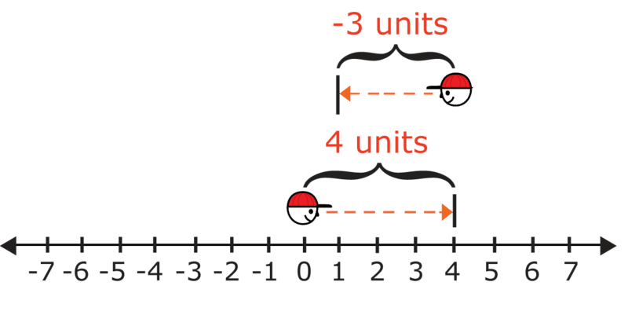

**Our answer is 1.**

**Now, let's imagine subtracting a negative integer from a positive integer.**

Example

Use a number line to find the difference of $4-(-3)$.

To model $4-(-3)$, imagine the person moving 4 units forward and to the right of zero. Then imagine the person turning around. Since a negative integer, -3, is being subtracted, imagine the person moving 3 units backward. That means the person will be moving to the left.

=7$.")

**Our answer is 7.**

Example

Use a number line to find the difference of $-4-3$.

To model $-4-3$, imagine the person moving 4 units backward and to the left. The person moves backward because the initial quantity, -4, is a negative integer.

Next, imagine the person turning around. Since a positive integer, 3, is being subtracted, imagine the person moving 3 units forward and to the left.

**Our answer is -7.**

**Now, let's imagine subtracting a negative integer from a negative integer.**

Example

Use a number line to find the difference of $-4-(-3)$.

To model $-4-(-3)$, imagine the person moving 4 units backward and to the left. Then imagine the person turning around. Since a negative integer, -3, is being subtracted, imagine the person moving 3 units backward and to the right.

=-1$.")

**Our answer is -1.**

**4G. Lesson Exercises**

**Subtract the following integers. Use a number line to help you.**

1.  $-5 - 2$
2.  $7 - (-2)$
3.  $-9 - (-5)$

II. **Subtract Integers Using Opposites**

Another strategy for subtracting integers involves using **_opposites_**. Remember, you can find the opposite of an integer by changing the sign of an integer. The opposite of any integer, $b$, would be $-b$.

**For any two integers, $a$ and $b$, the difference of $a-b$ can be found by adding $a+(-b)$ So, to subtract two integers, take the opposite of the integer being subtracted and then add that opposite to the first integer.**

**For any two integers, $a$ and $b$, the difference of $a-b$ can be found by adding $a+(-b)$ So, to subtract two integers, take the opposite of the integer being subtracted and then add that opposite to the first integer.**

Example

_Find the difference of $5-(-8)$._

The integer being subtracted is -8. The opposite of that integer is 8, so add 8 to 5.

$5-(-8)=5+8=13$.

So, the difference of $5-(-8)$ is 13.

**Our answer is 13.**

Example

Find the difference of $-12-(-2)$.

The integer being subtracted is -2. The opposite of that integer is 2, so add 2 to -12.

$-12-(-2)=-12+2$.

Add as you would add any integers with different signs.

$|-12|=12$ and $|2|=2$, so subtract the lesser absolute value from the greater absolute value.

$12-2=10$

Give that answer the same sign as the integer with the greater absolute value. $12>2$, so -12 has a greater absolute value than 2. Give the answer a negative sign.

So, the difference of $-12-(-2)$ is -10.

**Our answer is -10.**

Example

_Find the difference of $-20-3$._

The integer being subtracted is 3. The opposite of that integer is -3, so add -3 to -20.

$-20-3=-20+(-3)$.

Add as you would add any integers with the same sign. In this case, a negative sign.

$|-20|=20$ and $|-3|=3$, so add their absolute values:

$20+3=23$

Give that answer the same sign as the two original integers, a negative sign.

So, the difference of $-20-3$ is -23.

**Our answer is -23.**

**Now take a few minutes to practice what you have learned.**

**4H. Lesson Exercises**

**Find the differences using opposites.**

1.  **$-5 - 7$**
2.  **$8 - (-4)$**
3.  **$-12 - (-8)$**

III. **Evaluate Variable Expressions Involving Integer Subtraction**

Do you remember what a **_variable expression_** is? A variable expression is a number sentence that has numbers, variables and operations in it. In a variable expression we can have like and unlike terms. Like terms can be combined or simplified and unlike terms can not be combined or simplified.

Example

$6x+(-4x)$

These two terms are alike because they both have $x$’s with them. In the last lesson, you learned how to add like terms in a variable expression.

**The answer to this example is $2x$.**

You can use what you know about how to subtract integers to help you find the value of expressions with variables, too.

Remember, you can only subtract like terms in an expression that has variables.

Example

Find the difference $-10n-(-8n)$

**Since $-10n$ and $-8n$ both have the same variable, they are like terms. Use what you know about how to subtract integers to help you.**

The term being subtracted is $-8n$. The integer -8 is part of that term. The opposite of that integer is 8, so add $8n$ to $-10n$.

$-10n-(-8n)=-10n+8n$

Both like terms have different signs. So, find the absolute values of both integers. Then subtract the term whose integer has the lesser absolute value from the term with the larger absolute value.

$|-10|=10$ and $|8|=8$

Now subtract $10n-8n=2n$.

Since 10>8, and $-10n$ has a negative sign, give the answer a negative sign.

**The difference of $-10n-(-8n)$ is $-2n$.**

**_Remember you can only combine terms that are alike._**

**4I. Lesson Exercises**

**Use what you have learned to simplify each expression.**

1.  $-4y-6y$
2.  $18x-(-4x)$
3.  $-9a-(-3a)$

IV. **Model and Solve Real-World Problems Using Simple Equations Involving Integer Change**

Knowing how to subtract integers can also help you solve many problems in real life. To solve a real-world problem, write an expression or an equation that can be used to solve the problem, then solve. Let’s practice this a bit and then return to our introductory problem.

The temperature inside a laboratory freezer was $-10^\circ$ Celsius. A scientist at the lab then lowered the temperature inside the freezer by $5^\circ$ Celsius. What was the new temperature inside the freezer?

**The problem says that the temperature was** **_lowered_****. This means that the temperature** **_decreased_****, so you should subtract. To find the new temperature, you can** **_subtract_** **the amount by which the temperature was lowered from the original temperature, using one of these equations.**

$$
\begin{align*}
-10^\circ C-5^\circ C &= ?\\
\text{or} \qquad -10-5&=?
\end{align*}
$$

**The integer being subtracted is 5. The opposite of that integer is -5, so add -5 to -10.**

$-10-5=-10+(-5)$.

**Add as you would add any integers with the same sign––a negative sign.**

**$|-10|=10$ and $|-5|=5$, so add their absolute values.**

Give that answer the same sign as the two original integers, a negative sign.

$10+5=15$

So, the difference of $-10-5$ is -15.

**This means that the new temperature inside the freezer must be $-15^\circ$ Celsius.**

**Now, we can apply what we have learned to our introduction problem.**

Real-Life Example Completed
---------------------------

**_The Shark Dive_**

The next day, Cameron decided to take the day off from diving and play volleyball on the beach. His Dad decided to do a deep dive to hopefully see some sharks. Cameron would love to do a deep dive, but he isn’t old enough yet, so this gave his Dad a chance to dive on his own.

When Cameron’s Dad returned, he told Cameron the story of how he went down to a depth of 80 feet with hopes of seeing a shark. After ten minutes or so, he spotted a beautiful shark swimming above him. Cameron’s Dad went up about 20 feet to try to take a picture of the shark.

He did get a few good shots before the shark swam away.

“What depth did you see the shark at?” Cameron asked.

**To find the depth that Cameron’s Dad saw the shark, we need to write a subtraction problem and solve it. Remember that depth has to do with below the surface, so we use negative integers to represent different depths.**

**\-80 was his starting depth, then he went up -20 so we take away 20 feet.**

$-80 - (-20) = -60 \ feet$

**Cameron’s Dad saw the shark at 60 feet below the surface.**

Vocabulary
----------

Here are the vocabulary words that are found in this lesson.

__Difference__

the answer in a subtraction problem.

__Integer__

the set of whole numbers and their opposites.

__Variable Expression__

a number sentence that uses numbers, variables and operations, without an equal sign.

Technology Integration
----------------------

!?[0](https://www.youtube.com/watch?v=C38B33ZywWs)

[Khan Academy Adding/Subtracting Negative Numbers](http://www.youtube.com/watch?v=C38B33ZywWs)

!?[0](https://www.youtube.com/watch?v=CWynE4T4-5w)

[James Sousa, Subtracting Integers, The Basics](http://www.youtube.com/watch?v=CWynE4T4-5w)

!?[0](https://www.youtube.com/watch?v=-BzR1DwJznY)

[James Sousa, Subtracting Integers](http://www.youtube.com/watch?v=-BzR1DwJznY)

!?[0](https://www.youtube.com/watch?v=ViWY8hnbVgw)

[James Sousa, Example of Subtracting Integers](http://www.youtube.com/watch?v=ViWY8hnbVgw)

Time to Practice
----------------

Directions: Subtract the following integers using a number line.

1. $8-6$

$")

$")

$")

$")

$")

11. $15-7$

12. $-7-12$

13. $0-4$

14. $13-(-9)$

15. $-21-4$

16. $33-(-4)$

17. $-11-(-8)$

18. $18-8$

Directions: Simplify each variable expression.

19. $-8m-3m$

20. $(-7c)-(-c)$

21. $-19a-(-4a)$

22. $33b-(-18b)+7$

Directions: Solve this real-world problem.

23. Carl lives in Minneapolis, Minnesota. The low temperature in his hometown on February 1 was $-2^\circ F$. The next day, the low temperature in his hometown was $6^\circ F$ less than that. What was the temperature the next day?

</article>

### 4.4 Multiplying Integers

<article>

Introduction
------------

**_Temperature Change_**

“It is going to be a hot one!” Jesse, the boat driver, comments heading down to the dock.

Cameron gets his suit and his gear and climbs aboard the boat. The ride out to the dive site feels wonderful with the wind blowing in his hair. The water is clear and sparkling under the hot sun.

Cameron knows that the water temperature changes about $-2^\circ$ every 10 feet. He wears a light skin suit because of this. Not only can it feel a bit chilly after the warm surface temperature, but it can also protect him against a random jellyfish sting.

If Cameron dives to a depth of 40 feet, what will the temperature be at that depth?

**This lesson will teach you how to use multiplying integers to solve a problem like this one. You will need to multiply and then subtract to figure out what the temperature of the water will be, at the depth that Cameron plans to go on his dive.**

**_What You Will Learn_**

By the end of this lesson, you will be able to complete the following:

* Analyze patterns of products of integers with same and different signs recognizing multiplication by zero as zero.
* Multiply integers.
* Evaluate variable expressions involving integer multiplication.
* Model and solve real-world problems using simple equations involving integer multiplication.

**_Teaching Time_**

I. **Analyze Patterns of Products of Integers with Same and Different Signs Recognizing Multiplication by Zero as Zero**

Now that you have learned how to add and subtract integers, it is time to tackle multiplying them. Remember that an **_integer_** is the set of whole numbers and their opposites. There are a few vocabulary words that help us when multiplying. The first is a **_factor_**. The numbers that are multiplied are called factors. The second is product. We multiply two or more factors to get a **_product_**.

Below are some multiplication facts for 5. Notice that the products show a pattern. Suppose you did not know the product of $5 \times 0$. How could you use the pattern shown below to determine that product?

$$
\begin{align*}
5 \times 4 & =20\\
5 \times 3 & =15\\
5 \times 2 & =10\\
5 \times 1 & =5\\
5 \times 0 & = ?
\end{align*}
$$

Notice that each product shown is 5 less than the previous product. So, you can subtract 5 from the previous product, 5, to find the missing product. Since $5-5=0$, the product of $5 \times 0$ must be 0.

**There are patterns that we can see when we multiply integers. Analyzing patterns like these can help us multiply positive and negative integers.**

**How do analyze these patterns?**

First, we notice that the pattern for the multiplication facts of 5 could continue below zero. Up until this time in math, we have only looked at the positive products. But now, since we are learning about negative numbers, we can look at continuing the facts. Let's see how patterns can help us find the products of integers.

Example

Use a pattern to find the missing products below.

$$
\begin{align*}
5 \times 4 & = 20\\
5 \times 3 & = 15\\
5 \times 2 & = 10\\
5 \times 1 & = 5\\
5 \times 0 & = 0\\
5 \times (-1) & = ?\\
5 \times (-2) & = ?
\end{align*}
$$

**You already know the pattern for this sequence of products. You can subtract 5 from the previous product to find the next product. Remember, subtracting 5 is the same thing as adding its opposite -5. Try adding -5 to the previous products to find the next products.**

To find the product of $5 \times (-1)$, add $0+(-5)$

$|0|=0$ and $|-5|=5$, so subtract the lesser absolute value from the greater absolute value :

$5-0=5$.

The integer with the greater absolute value is -5, so give the answer a negative sign.

$0+(-5)=-5$, so $5 \times (-1)=-5$

To find the product of $5 \times (-2)$, add -5 to the previous product, which is also -5.

In other words, add: $-5+(-5)$

Both integers have the same sign, so add their absolute values.

$|-5|=5$, so add.

$5+5=10$.

Give that answer a negative sign.

$-5+(-5)=-10$, so $5 \times (-2) = -10$

**Now we have our completed multiplication facts**

$$
\begin{align*}
5 \times 4 & = 20\\
5 \times 3 & = 15\\
5 \times 2 & = 10\\
5 \times 1 & = 5\\
5 \times 0 & = 0\\
5 \times (-1) & = -5\\
5 \times (-2) & = -10
\end{align*}
$$

**Each product is 5 less than the previous product.**

**You may also notice that depending on what you are multiplying the sign changes.**

**Here are a few rules that we can conclude from the pattern.**

* **When 5, a positive integer, is multiplied by a positive integer, the product is positive.**
* **When 5, a positive integer, is multiplied by zero, the product is zero.**
* **When 5, a positive integer, is multiplied by a negative integer, the product is negative.**

**You may think that these rules apply only to the five's table but they actually apply to ANY table when you are multiplying positive and negative integers.**

**Let’s look at another example that can help us finish figuring out the rules for multiplying integers.**

Example

Use a pattern to find the missing products below. What do you notice? Do you notice that the answer increases by 3 every time?

$$
\begin{align*}
(-3) \times 3 & = -9\\
(-3) \times 2 & = -6\\
(-3) \times 1 & = -3\\
(-3) \times 0 & = 0\\
(-3) \times (-1) & = 3\\
(-3) \times (-2) & = ?\\
(-3) \times (-3) & = ?
\end{align*}
$$

To find the product of $(-3) \times (-2)$, add: $3+3=6$. So, $(-3) \times (-2)= 6$.

To find the product of $(-3) \times (-3)$, add: $6+3=9$. So, $(-3) \times (-3) = 9$.

**This shows the completed multiplication facts.**

$$
\begin{align*}
(-3) \times 3 & = -9\\
(-3) \times 2 & = -6\\
(-3) \times 1 & = -3\\
(-3) \times 0 & = 0\\
(-3) \times (-1) & = 3\\
(-3) \times (-2) & = 6\\
(-3) \times (-3) & = 9
\end{align*}
$$

**Here are some other rules that you may notice.**

* **When -3, a negative integer, is multiplied by a positive integer, the product is negative.**
* **When -3, a negative integer, is multiplied by zero, the product is zero.**
* **When -3, a negative integer, is multiplied by a negative integer, the product is positive.**

**We can conclude the following rules.**

")

\[Figure 3\]

**_Take a few minutes and write these rules down in your notebooks._**

II. **Multiply Integers**

**Now that you understand the rules, we can work on applying them when actually multiplying integers.**

Example

$(-4)(-3)$

Here we have negative four times a negative three. First, we multiply the terms, remember that a set of parentheses next to another set means multiplication.

$4 \times 3 = 12$

Next, we figure out the sign.

A negative times a negative is a positive.

**Our answer is 12.**

Example

$-5 \cdot 8$

Here we have a negative five times a positive eight. Remember that a dot can also mean multiplication.

$5 \times 8 = 40$

Next, we figure out the sign.

A negative times a positive is a negative.

**Our answer is -40.**

**What about multiplying more than one term?**

**We can do this easily. The key is to work from left to right and remember that the sign of each product can change with each factor.**

Example

$(-8)(-3)(-2)$

Here we have three negative terms being multiplied. First, let’s multiply the first two terms to get a product.

$-8 \times -3 = 24$ (A negative times a negative equals a positive.)

Now we multiply that product times the factor negative two.

$24 \times -2 = -48$ (A positive times a negative equals a negative.)

**Our answer is -48.**

**4J. Lesson Exercises**

1.  **$-9(-3)$**
2.  **$(-3)(12)$**
3.  **$(-4)(3)(-2)$**

III. **Evaluate Variable Expressions Involving Integer Multiplication**

**Do you remember what a variable expression is?**

**A** **_variable expression_** **is a number sentence using numbers, operations and variables.** A variable expression can contain like terms. A like term is a term that is common between one or more terms in the equation. When you have like terms, we can combine them using addition and subtraction.

Let’s look at an example so that it will make more sense.

Example

Find the value of this expression $3z \cdot (-2)$

**The** **_Commutative Property of Multiplication_** **states that the order in which factors are multiplied does not matter.**

$3z \cdot (-2) = -2 \cdot 3z$

**The** **_Associative Property of Multiplication_** **states that you can group the factors being multiplied in any order.**

$-2 \cdot 3z = -2 \cdot 3 \cdot z = (-2 \cdot 3) \cdot z$

**Now we can multiply the integers. Since -2 and $3z$ have different signs, the product will be negative.**

$2 \cdot 3=6$, so $(-2)\cdot 3=-6$ and $(-2 \cdot 3)\cdot z = -6z$

**The value of the expression is $-6z$.**

Example

Find the value of this expression $(-5)(-2m)(n)$

**The Associative Property of Multiplication states that you can group the factors being multiplied in any order.**

$(-5)(-2m)(n) = (-5)\cdot (-2) \cdot m \cdot n$

**Now we can multiply the integers. Since -5 and -2 are both negative, the product will be positive.**

$-5 \cdot -2=5 \cdot 2 = 10$, so $(-5) \cdot (-2) \cdot m \cdot n = 10 \cdot mn=10mn$

**The value of the expression is $10mn$.**

**4K. Lesson Exercises**

**Multiply the following variable expressions.**

1.  $3x(4y)$
2.  $-6a(-4b)$
3.  $-4z(10)$

IV. **Model and Solve Real-World Problems Using Simple Equations Involving Integer Multiplication**

Knowing how to multiply integers can also help us represent and solve problems in real life.

To solve a real-world problem, write an expression or an equation that can be used to solve the problem, then solve.

The number of students voting in a school election has been decreasing at a rate of 15 students per year. Represent the change in the number of students voting over the next 3 years as an integer.

First, represent the decrease in the number of students voting as an integer.

The problem states that the number of students voting has been _decreasing_ by 15 students each year. To show a _decrease_, use a negative integer -15.

To represent the decrease in the number of students voting over the next 3 years, multiply the number of years by the integer representing the decrease.

$3 \times (-15) = ?$

Find the product to solve the problem.

$3 \times 15 =45$, so $3 \times (-15)=-45$

The change in the number of students voting over the next 3 years can be represented as -45.

**Now let’s use this information to solve our real-world problem.**

Real-Life Example Completed
---------------------------

**_Temperature Change_**

As Cameron gets ready for his dive one morning, he notices that the temperature at the resort is already $\underline{87^\circ}$.

“It is going to be a hot one!” Jesse, the boat driver, comments heading down to the dock.

Cameron gets his suit and his gear and climbs aboard the boat. The ride out to the dive site feels wonderful with the wind blowing in his hair. The water is clear and sparkling under the hot sun.

Cameron knows that the water temperature changes about $-2^\circ$ every 10 feet. He wears a light skin suit because of this. Not only can it feel a bit chilly after the warm surface temperature, but it can also protect him against a random jellyfish sting.

If Cameron dives to a depth of 40 feet, what will the temperature be at that depth?

**To figure this out, we must first figure out the change in temperature between the surface and the depth of 40 feet. To figure this out, we multiply.**

**\-2 degrees per 10 feet**

**If we are going down 40 feet, then we can multiply $-2 \times 4$ because 40 is $4 \times 10$.**

$-2(4) = -8$

**Now we can add this to the surface temperature of $87^\circ$.**

$87 + (-8) = 79^\circ$

**The temperature of the water at 40 feet deep will be $79^\circ$.**

Vocabulary
----------

Here are the vocabulary words in this lesson.

__Integer__

the set of whole numbers and their opposites.

__Product__

the answer in a multiplication problem

__Factors__

the numbers being multiplied

__Variable Expression__

a number sentence using numbers, operations and variables.

__Commutative Property of Multiplication__

states that the order that we multiply terms does not change the product.

__Associative Property of Multiplication__

states that changing the grouping of factors does not change the product.

Technology Integration
----------------------

!?[0](https://www.youtube.com/watch?v=d8lP5tR2R3Q)

[Khan Academy Multiplying and Dividing Negative Numbers](http://www.youtube.com/watch?v=d8lP5tR2R3Q)

!?[0](https://www.youtube.com/watch?v=YR6BzEjLx6k)

[James Sousa Multiplying Integers, The Basics](http://www.youtube.com/watch?v=YR6BzEjLx6k)

!?[0](https://www.youtube.com/watch?v=QY-Za42DItw)

[James Sousa Example of Multiplying Integers](http://www.youtube.com/watch?v=QY-Za42DItw)

Time to Practice
----------------

Directions: Analyze the patterns below and find the missing products.

1. 

$$
6 \times 3 = 18\!\\
6 \times 2 = 12\!\\
6 \times 1 = 6\!\\
6 \times 0 = 0\!\\
6 \times (-1) = ?\!\\
6 \times (-2) = ?\!\\
6 \times (-3) = ?
$$

2. 

$$
(-9) \times 4 = -36\!\\
(-9) \times 3 = -27\!\\
(-9) \times 2 = -18\!\\
(-9) \times 1 = -9\!\\
(-9) \times 0 = ?\!\\
(-9) \times (-1) = ?\!\\
(-9) \times (-2) = ?
$$

Directions: Use integer rules to find each product.

3. $12 \times 8$

4. $(-4)(7)$

5. $(-2) \cdot (-11)$

6. $3 \cdot (-25)$

7. $5 \times (-6) \times (-1)$

8. $(-8)(-7)$

9. $(-2)(3)(-4)$

10. $(-9)(1)(-1)$

Directions: Multiply each variable expression.

11. $(-7k)(-6)$

12. $(-8)(3a)(b)$

13. $-6a(b)(c)$

14. $-8a(6b)$

15. $(12y)(-3x)(-1)$

16. $-8x(4)$

17. $-a(5)(-4b)$

18. $-2ab(12c)$

19. $-2ab(12c)$

Directions: Solve this real world problem.

20. The temperature outside Fred's house is dropping at a rate of $2^\circ F$ each hour. Represent the total change in the temperature over the next 5 hours as an integer.

</article>

### 4.5 Dividing Integers

<article>

Introduction
------------

**_The Scuba Descent_**

Cameron has decided to go down with Gina. He will descend freely next to her, while she descends holding onto the rope. He looks at his watch and sets the timer before they descend.

When they reach the bottom, Cameron looks at his watch. He sees that the descent took them 2 minutes. Not bad at all considering that Gina is a beginner. Cameron and Gina meet up with the group and check in with the Dive Master. Then they are off for a beautiful dive!!

How far did Cameron and Gina descend per minute?

**To answer this question, you will need to understand how to divide integers. Pay attention and you will be able to answer these questions at the end of the lesson.**

**_What You Will Learn_**

By the end of this lesson, you will be able to demonstrate the following:

* Analyze patterns of quotients of integers with same and different signs, recognizing division by zero as undefined.
* Divide integers.
* Evaluate variable expressions involving integer division.
* Model and solve real-world problems using simple equations involving integer division.

**_Teaching Time_**

I. **Analyze Patterns of Quotients of Integers with Same and Different Signs, Recognizing Division by Zero as Undefined**

Another important step in learning how to compute with integers is learning how to divide them. You can look for patterns in a sequence of quotients just as you looked for patterns in a sequence of products in an earlier lesson. These patterns will help you to understand the rules for dividing integers.

Let’s look at some integer patterns with division. We are looking at **_quotients_**. **A quotient is the answer in a division problem.**

Example

Use a pattern to find the missing quotients below.

$$
\begin{align*}
6 \div 2 & = 3\\
4 \div 2 & = 2\\
2 \div 2 & = 1\\
0 \div 2 & = 0\\
-2 \div 2 & = ?\\
-4 \div 2 & = ?\\
\end{align*}
$$

**Look for a pattern among the quotients.** Remember that a pattern has a rule that makes it repeat in a certain way. Look at the pattern below.

**Now look at the number pattern.**

**You will see that you can subtract 1 from the previous quotient to find the next quotient. Remember, subtracting 1 is the same thing as adding its opposite, -1. Try adding -1 to the previous quotients to find the next quotients.**

To find the quotient of $-2 \div 2$, add $0+(-1)$

$|0|=0$ and $|-1|=1$, so subtract the lesser absolute value from the greater absolute value.

$1-0=1$

The integer with the greater absolute value is -1, so give the answer a negative sign.

$0+(-1)=-1$, so $-2 \div 2=-1$

To find the quotient of $-4 \div 2$, add $-1+(-1)$

Both integers have the same sign, so add their absolute values.

$|-1|=1$, so add

$1+1=2$

Give that answer a negative sign.

$-1+(-1)=-2$, so $-4 \div 2 =-2$.

**This shows the completed division facts.**

$$
\begin{align*}
6 \div 2 & = 3\\
4 \div 2 & = 2\\
2 \div 2 & = 1\\
0 \div 2 & = 0\\
-2 \div 2 & = -1\\
-4 \div 2 & = -2\\
\end{align*}
$$

**Each quotient is still 1 less than the previous quotient.**

**What conclusions can we draw from this pattern?**

**You may notice the following.**

* **When a positive integer is divided by a positive integer, 2, the quotient is positive.**
* **When zero is divided by a positive integer, 2, the quotient is zero.**
* **When a negative integer is divided by a positive integer, 2, the quotient is negative.**

**These are the beginnings of our rules for dividing integers.**

**Let’s look at another pattern to complete these rules.**

Example

Look at the number facts below. Analyze the pattern of quotients shown.

$$
\begin{align*}
&9 \div (-3)  = -3\\
&6 \div (-2) = -3\\
&3 \div (-1) = -3\\
&0 \div 0 = undefined\\
&-3 \div (-1) = 3\\
&-6 \div (-2) = 3\\
&-9 \div (-3) = 3
\end{align*}
$$

**What do you notice about these facts?**

**You may notice the following rules.**

* **When a positive integer is divided by a negative integer, the quotient is negative.**
* **When zero is divided by zero, the quotient is** **_undefined_****, not zero. (Note: Any number divided by zero is considered undefined.)**
* **When a negative integer is divided by a negative integer, the quotient is positive.**

**Based on the patterns, here are the rules for dividing integers.**

")

\[Figure 4\]

**_Take a few minutes to write these rules into your notebook. Notice that the rules for dividing integers are the same as the rules for multiplying integers._**

II. **Divide Integers**

Now we can use these rules to divide integers. Just like with the rules for multiplying, becoming great at dividing integers will require that you memorize these rules.

Example

Find the quotient $(-33) \div (-3)$

**To find this quotient, we need to divide two negative integers.**

**Divide the integers without paying attention to their signs. The quotient will be positive.**

$(-33) \div (-3) = 33 \div 3 = 11$

**The quotient is 11.**

Example

Find the quotient $(-20) \div 5$.

**To find this quotient, we need to divide two integers with different signs.**

**Divide the integers without paying attention to their signs. Give the quotient a negative sign because the signs are different, indicating a negative answer.**

$20 \div 5 =4$, so $(-20) \div 5 = -4$.

**The quotient is -4.**

**These problems used a division sign, but remember we can also show division using a fraction bar where the numerator is divided by the denominator.**

Now, it’s time for you to practice applying these rules to figuring out quotients.

**4L. Lesson Exercises**

1.  $-12 \div -3$
2.  $\frac{18}{-3}$
3.  $-24 \div 8$

III. **Evaluate Variable Expressions Involving Integer Division**

You have used variable expressions with addition, subtraction and multiplication. Now we are going to apply division of integers with variable expressions. **Remember that a** **_variable expression_** **is a math sentence that uses numbers, variables and operations.**

Example

Find the value of this expression $-18x \div (-2)$

It may help you to rewrite the problem like this using a fraction bar to divide. Now you can see which values can be divided

$\frac{-18x}{-2}$

Then separate out the integers like this.

$\frac{-18x}{-2} = \frac{-18 \cdot x}{-2} = \frac{-18}{-2} \cdot x$

Notice that we can divide the integers. The $x$ remains alone because there isn’t another $x$. We separate it out. Then we divide the integer part and add the $x$ to the answer.

Since $-18 \div (-2) = 18 \div 2 = 9$ (remembering the rules to determine the sign of the answer), we know that $\frac{-18}{-2} \cdot x= 9 \cdot x = 9x$

**So, the value of the expression is $9x$.**

Let’s look at another example where there is a matching variable too.

Example

$-24y \div 2y$

Next, we rewrite the expression using a fraction bar.

$\frac{-24y}{2y}$

Now, we can separate the terms.

$$
\begin{align*}
&\frac{-24}{2} \cdot \frac{y}{y}\\
&-24 \div 2 = -12
\end{align*}
$$

$y \div y =1$ because the $y$’s cancel each other out

$-12(1) = -12$

**The value of the expression is -12.**

Example

$-18ab \div 9b$

First, rewrite the expression using a fraction bar.

$\frac{-18ab}{-9b}$

Next, separate out the terms.

$$
\begin{align*}
&\frac{-18}{-9} \cdot \frac{ab}{b}\\
&-18 \div -9 = 2
\end{align*}
$$

$ab \div b= a$ Notice that the $b$’s cancel, but the a doesn’t. It is left as part of the final expression.

**Our final answer is $2a$.**

**4M. Lesson Exercises**

1.  $-14a \div -7$
2.  $28ab \div -7b$
3.  $-6x \div -2$

IV. **Model and Solve Real-World Problems Using Simple Equations Involving Integer Division**

We can apply these rules for dividing integers to real-world problems.

On 3 consecutive plays, a football team lost a total of 30 yards. The team lost the same number of yards on each play. Represent the number of yards lost on each play as a negative integer.

**First, represent the total number of yards lost as an integer.**

**Since the integer shows a loss of 30 yards, use a negative integer -30.**

**To represent the loss for each of the 3 plays, divide the integer representing the total number of yards lost by 3.**

**We write this equation and then fill in the given values**

**Total yards lost $\div$ number of plays = yds lost on each play**

$-30 \div 3 =?$

**To find this quotient, we need to divide two integers with different signs.**

**Divide the integers without paying attention to their signs. Give the quotient a negative sign.**

$30 \div 3 = 10$, so $(-30) \div 3 = -10$.

**The integer -10 represents the number of yards lost on each play.**

**Now let’s apply what we have learned to the problem from the introduction.**

Real-Life Example Completed
---------------------------

**_The Diving Descent_**

Cameron and his new diving partner Gina are going to be buddies on a 40 foot dive. Gina is a new diver and is still learning to make a descent. Cameron can make a free descent quite easily. This means that he doesn’t hold onto anything as he descends to the appropriate depth. Gina will hold onto the anchor line as she descends. Then they will meet on the bottom.

Cameron has decided to go down with Gina. He will descend freely next to Gina, while she descends holding onto the rope. He looks at his watch and sets the timer before they descend.

When they reach the bottom, Cameron looks at his watch. He sees that the descent took them 2 minutes. Not bad at all considering that Gina is a beginner. Cameron and Gina meet up with the group and check in with the Dive Master. Then they are off for a beautiful dive!!

How far did Cameron and Gina descend per minute?

**First, we need to write integers to represent the depth and the time.**

**\-40 feet is the depth**

**2 minutes is the time**

**We divide the depth by the time to find out the number of feet per minute.**

$-40 \div 2 = -20$

**Cameron and Gina descended -20 feet per minute.**

Vocabulary
----------

Here are the vocabulary words that are found in this lesson.

__Quotient__

the answer in a division problem.

__Undefined__

when an integer is divided by 0, the answer is undefined.

__Variable Expression__

a math sentence with numbers, operations and variables

Technology Integration
----------------------

!?[0](https://www.youtube.com/watch?v=d8lP5tR2R3Q)

[Khan Academy Multiplying and Dividing Negative Numbers](http://www.youtube.com/watch?v=d8lP5tR2R3Q)

!?[0](https://www.youtube.com/watch?v=o6zh558w8R4)

[James Sousa, Division of Integers: The Basics](http://www.youtube.com/watch?v=o6zh558w8R4)

!?[0](https://www.youtube.com/watch?v=z5ZFiyLi5Y0)

[James Sousa, Example of Dividing Integers](http://www.youtube.com/watch?v=z5ZFiyLi5Y0)

!?[0](https://www.youtube.com/watch?v=fcVnwjBgDmk)

[James Sousa, Multiplying and Dividing Involving Zero](http://www.youtube.com/watch?v=fcVnwjBgDmk)

Time to Practice
----------------

Directions: Analyze the patterns and find the missing quotients.

1. 

$$
24 \div 8 = 3\!\\
16 \div 8 = 2\!\\
8 \div 8 = 1\!\\
0 \div 8 = 0\!\\
-8 \div 8 = ?\!\\
-16 \div 8 = ?
$$

2. 

$$
21 \div (-3) = -7\!\\
14 \div (-2) = -7\!\\
7 \div (-1) = ?\!\\
0 \div 0 = ?\!\\
-7 \div (-1) = ?\!\\
-14 \div (-2) = 7\!\\
-21 \div (-3) = 7
$$

Directions: Find each quotient.

3. $48 \div 8$

4. $64 \div (-8)$

5. $-28 \div (-4)$

6. $-35 \div 7$

7. $-80 \div (-4)$

8. $-50 \div 10$

9. $-18 \div -2$

10. $42 \div -6$

11. $-72 \div 9$

12. $-48 \div -12$

13. $-16 \div 4$

14. $-22 \div -11$

15. $72 \div -12$

Directions: Find each quotient with variable expressions.

16. $36t \div (-9)$

17. $-56n \div (-7)$

18. $-22n \div -11n$

19. $-28n \div 7$

20. $18xy \div 2x$

Directions: Solve the following real-world example.

21. Company X lost a total of $1,200 during its first 4 months in business. Suppose the company lost the same number of dollars each month. Represent the number of dollars lost each month as a negative integer.

</article>

### 4.6 Rational Numbers

<article>

Introduction
------------

**_Comparing Distances_**

After a little while, they spotted some dolphins swimming with the boat. This is something that often happens as dolphins love the rushing water generated by the motor on the back of the boat.

“Did you know that they can swim .83 miles in one minute?” Chet asked Cameron.

“Really, no I didn’t know that. I do know that a swordfish can swim almost one-half mile in a minute. I think the exact number is $\frac{9}{20}$ of a mile.”

“Wow, which one can swim the farthest in one minute?” Chet asked thinking carefully through the math.

By the time they reached the dive site, Cameron had figured out which one can swim the farthest in one minute.

**Have you? The numbers that the boys are using are called rational numbers. When you understand rational numbers, you will also understand how to figure out which one can swim the farthest in one minute. Pay attention, and this lesson on rational numbers will teach you all that you need to know.**

**_What You Will Learn_**

In this lesson, you will learn how to do the following:

* Identify a rational number as the ratio of two integers.
* Compare and order rational numbers on a number line.
* Identify commutative, associative, inverse and identity properties of addition and multiplication for rational numbers.
* Apply properties and use order of operations to evaluate numerical and variable expressions.

**_Teaching Time_**

I. **Identify a Rational Number as the Ratio of Two Integers**

Some numbers are considered **_rational numbers_**. **A rational number is a number that can be written as a ratio.**

**What is a ratio?**

**A** **_ratio_** **is a comparison of two numbers.** For example, you might discover that the ratio of boys to girls in your class is 12 to 13. That same ratio could be also be expressed using a colon, 12 : 13, or as a fraction, $\frac{12}{13}$.

**In fact, any number that can be written as a ratio of two integers is classified as a rational number. Let's take a closer look at how to identify rational numbers.**

**How can we determine if an integer is a rational number?**

That is a good question. Let’s look at an example and see if we can write it as a ratio.

Example

10

**This number can be written as a ratio. Every whole number can be written over 1. That means that it can be written in the form of a ratio. Notice that the fraction bar is a way to tell if the integer can be written as a ratio. In other words, if it can be written as a fraction, it is a rational number.**

**10 is a rational number.**

Example

$-\frac{2}{3}$

**This fraction is a rational number. Notice that it is written as a ratio already. We are comparing the numerator and the denominator. Yes, it is negative. That is okay, because we can have negative fractions and they are still considered rational numbers.**

**$-\frac{2}{3}$ is a rational number.**

Example

.687

**This decimal can be written as a rational number over 1000. This is a rational number too.**

**.687 is a rational number.**

**Are there any others?**

Yes. **_Terminating decimals_** **and** **_repeating decimals_** **are also rational numbers.**

* **Terminating decimals**, which are decimals with a set number of digits, are always rational. For example, 0.007 is a terminating decimal, so it is rational.
* **Repeating decimals**, which are decimals in which one or more digits repeat, are always rational. For example, $0.\bar{3}$ is a repeating decimal in which the digit 3 repeats forever, so it is rational.

**Are there any numbers that are not rational?**

**Yes. Some decimals don’t terminate and they don’t repeat. They just go on and on and on forever. These are a special group of numbers called** **_irrational numbers_****. They are not rational numbers. You will learn more about them in a later lesson.**

**4N. Lesson Exercises**

**Determine whether each is a rational number.**

1.  **\-4**
2.  $\frac{1}{3}$
3.  **.89765....**

II. **Compare and Order Rational Numbers on a Number Line**

Now that you know how to identify a rational number, you may need to compare or order them from time to time. For example, what if you have a loss of $\frac{1}{2}$ compared to a loss of .34. You would need to determine which loss is greater.

Placing the numbers on a number line can help you do this.

Let's review the inequality symbols which can help us compare and order rational numbers:

\> means _is greater than_.

< means _is less than_.

\= means _is equal to_.

Example

Choose the inequality symbol that goes in the blank to make this statement true.

$-2.5 \ \underline{\;\;\;\;\;\;\;} \ -5$

First, Draw a number line from -5 to 5.

Place the numbers -2.5 and -5 on that number line. Since $0.5=\frac{1}{2}, \ -2.5$ will be halfway between -2 and -3 on the number line.

**The symbol > goes in the blank because $-2.5 > -5$.**

Example

Order these rational numbers from least to greatest.

$$
\begin{align*}
&\frac{4}{5} \qquad 0.6 \qquad 1 \qquad 0.\bar{6}
\end{align*}
$$

It is often fairly easy to place decimals on a number line that is divided into tenths.

So, we can draw a number line from 0 to 1 and divide it into tenths. Then we can place all four numbers on the number line.

First, we should change $\frac{4}{5}$ to a fraction with a denominator of 10:

$\frac{4}{5} = \frac{4 \times 2}{5 \times 2} = \frac{8}{10}$

Since eight tenths is equivalent to $\frac{4}{5}$, we can find eight tenths on the number line and place $\frac{4}{5}$ there.

0.6 means six tenths. So, we can find six tenths on the number line and place 0.6 there.

1 is shown on the number line, so we can add a dashed line to show that number also.

$0.\bar{6}$ means 0.666... So, $0.\bar{6}$ is a little greater than six tenths, but less than seven tenths. We can place $0.\bar{6}$ roughly where it belongs on the number line.

The number line will look like this when we are finished.

**So, ordered from least to greatest, the numbers are $0.6, \ 0.\bar{6}, \ \frac{4}{5}, \ 1$.**

 will help you. That is how you can be sure that the numbers are in the correct order. Remember, they are all rational numbers!**")

**4O. Lesson Exercises**

**Compare the following rational numbers.**

1.  $-.7 \ \underline{\;\;\;\;\;\;\;} \ -\frac{7}{10}$
2.  $.34 \ \underline{\;\;\;\;\;\;\;} \ \frac{1}{2}$
3.  $67 \ \underline{\;\;\;\;\;\;\;} \ -10$

III. **Identifying and Applying Properties with Rational Numbers**

Next, let's review some properties of numbers. You may recall these properties from the work you have done with whole numbers. In this section, we will see how these properties can help us compute with rational numbers, too.

**Here are the properties that we will be using in this section.**

* **_The Commutative Property of Addition_** states that numbers being added can be added in any order. **_The Commutative Property of Multiplication_** states that numbers being multiplied can be multiplied in any order.

Examples

$$
\begin{align*}
0.3+ 7.5 & = 7.5+0.3\\
\frac{1}{2} \times (-3) & = -3 \times \frac{1}{2}
\end{align*}
$$

* **_The Associative Property of Addition_** states that the grouping of numbers that are being added does not matter. **_The Associative Property of Multiplication_** states that the grouping of numbers being multiplied does not matter.

Examples

$$
\begin{align*}
\left ( \frac{3}{10} + \frac{11}{5} \right ) + \frac{1}{5} & = \frac{3}{10} + \left ( \frac{11}{5} + \frac{1}{5} \right )\\
(-3 \times 4) \times 10 & = -3 \times (4 \times 10)
\end{align*}
$$

* **_The Inverse Property of Addition_** states that when a number is added to its opposite (or **_additive inverse_**), the sum is zero.

Example

$4+(-4)=0$

* **_The Inverse Property of Multiplication_** states that when a number is multiplied by its **_reciprocal_** (or **_multiplicative inverse_**), the product is 1. You can find the reciprocal of a fraction by flipping it. For example, the reciprocal of $\frac{7}{5}$ can be found by flipping the fraction to get its reciprocal, $\frac{5}{7}$.

Example

$\frac{7}{5} \cdot \frac{5}{7} = 1$

* **_The Identity Property of Addition_** states that when zero is added to any number, the sum is that number.

Example

$3 \frac{1}{25} + 0 = 3 \frac{1}{25}$

* **_The Identity Property of Multiplication_** states that when a number is multiplied by 1, the product is that number.

Example

$0.16 \times 1 = 0.16$

Examples

Identify the number property that each equation illustrates.

a. $-159 + 0 = -159$

b. $(0.3+1.2)+0.8=0.3+(1.2+0.8)$

c. $8 \times \frac{3}{4} = \frac{3}{4} \times 8$

d. $6 \cdot \frac{1}{6}=1$

Consider the equation in _a_.

In $-159+0=-159$, a negative integer is being added to zero and the sum is equal to the negative integer.

**This is an example of the Identity Property of Addition.**

Consider the equation in _b_.

In $(0.3+1.2)+0.8=0.3+(1.2+0.8)$, the parentheses show that the sums remain equal even when the numbers are grouped in different ways.

**This is an example of the Associative Property of Addition.**

Consider the equation in _c_.

In $8 \times \frac{3}{4} = \frac{3}{4} \times 8$, the order of the numbers being multiplied has been changed but they remain equal.

**This is an example of the Commutative Property of Multiplication.**

Consider the equation in _d_.

In $6 \cdot \frac{1}{6}=1$, the integer 6 is multiplied by its reciprocal, $\frac{1}{6}$. (Since $6=\frac{6}{1}$, its reciprocal is $\frac{1}{6}$.)

**This is an example of the Inverse Property of Multiplication.**

**It is not enough to be able to identify the different number properties. You also need to consider how those properties can be applied. The next section will show how these number properties can make some computations easier.**

IV. **Apply Properties and Use Order of Operations to Evaluate Numerical and Variable Expressions**

**Properties can help you to evaluate numerical expressions.** Do you remember what a numerical expression is? **A** **_numerical expression_** **is a phrase that contains numbers and operations.** Now that you know about rational numbers, you may see them in numerical expressions as well.

Let’s look at applying properties to an example that is a numerical expression.

Example

Use one or more number properties to help you find the value of this expression.

$(0.3892 \times 7) \times \frac{1}{7}$

We should consider which of these rational numbers can be multiplied easily.

Multiplying by a decimal with four digits, such as 0.3892, will be time-consuming.

So, use the **Associative Property** to group the numbers differently.

$(0.3892 \times 7) \times \frac{1}{7} = 0.3892 \times \left ( 7 \times \frac{1}{7} \right )$

You will multiply the expression inside the parentheses, $\left ( 7 \times \frac{1}{7} \right )$, first.

7 is the reciprocal of $\frac{1}{7}$. So, according to the **Inverse Property of Multiplication**, the product of those two numbers will be 1.

$0.3892 \times \left ( 7 \times \frac{1}{7} \right ) = 0.3892 \times 1$

Now, you need to multiply the decimal by 1. The **Identity Property of Multiplication** states that any number multiplied by 1 is equal to itself.

$0.3892 \times 1 = 0.3892$

**The value of the expression is 0.3892.**

You could have multiplied that decimal by 7 and then multiplied that product by $\frac{1}{7}$ to find that answer.

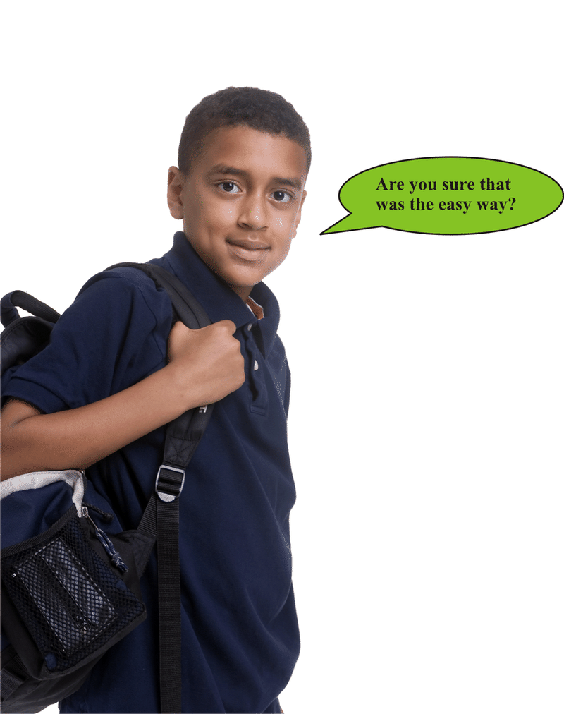

When evaluating expressions, it is also important to keep in mind the **_order of operations_**. Let's review this order below.

* First, complete computations that are inside grouping symbols, such as parentheses.
* Second, evaluate any exponents.
* Third, multiply and divide in order from left to right.
* Finally, add and subtract in order from left to right.

**We can also apply properties when we evaluate variable expressions. Remember that a variable expression is an expression with numbers, variables and operations.**

Example

Find the value of this expression. Be sure to use the correct order of operations.

$-12 \div (8-6) \times p$

According to the order of operations, you should do the computation inside parentheses first. So, subtract.

$-12 \div (8-6) \times p = -12 \div 2 \times p$

There are no exponents to evaluate. So, the next step is to multiply and divide in order from left to right.

$-12 \div 2 \times p=-6 \times p = -6p$

**The value of the expression is $-6p$.**

Real-Life Example Completed
---------------------------

**_Comparing Distances_**

On the dive boat one morning, Cameron began talking with another boy named Chet. Chet and his family were from Colorado and Chet was just two years older than Cameron. The boys struck up a great conversation about diving and fish and the things that they had seen on their dives.

After a little while, they spotted some dolphins swimming with the boat. This is something that often happens as dolphins love the rushing water generated by the motor on the back of the boat.

“Did you know that they can swim .83 miles in one minute?” Chet asked Cameron.

“Really, no I didn’t know that. I do know that a swordfish can swim almost one-half mile in a minute. I think the exact number is $\frac{9}{20}$ of a mile.”

“Wow, which one can swim the farthest in one minute?” Chet asked, thinking carefully through the math.

By the time they reached the dive site, Cameron had figured out which one can swim farthest in one minute.

**To figure out which one can swim the farthest in one minute, we will need to compare these two rational numbers.**

**A dolphin = .83 of a mile in one minute**

**A swordfish $= \frac{9}{20}$ of a mile in one minute**

**To figure this out, we first need to change the fraction into a decimal so that both numbers are in the same form.**

$\frac{9}{20}=\frac{45}{100}=.45$

**Next, we compare .83 to .45.**

**.83 > .45**

**A dolphin can swim farther than a swordfish in one minute.**

Vocabulary
----------

Here are the vocabulary words that are found in this lesson.

__Rational Number__

any number positive or negative that can be written as a ratio.

__Ratio__

a comparison between two quantities. Can be written using the word “to”, using a colon, or using a fraction bar

__Terminating Decimal__

a decimal that has a definite ending

__Repeating Decimal__

a decimal where some of the digits repeat themselves.

__Irrational Number__

a decimal that does not terminate or repeat but continues indefinitely.

__Commutative Property of Addition__

states that the order that you add numbers does not change its sum.

__Commutative Property of Multiplication__

states that the order that you multiply values does not change the product

__Associative Property of Addition__

the groupings of the numbers being added does not change the sum

__Associative Property of Multiplication__

the groupings of the numbers being multiplied does not change the product

__Inverse Property of Addition__

any number added with its opposite is zero.

__Inverse Property of Multiplication__

any number multiplied by its reciprocal is one.

__Reciprocal__

a flipped or inverted number

__Identity Property of Addition__

any number plus zero is that number

__Identity Property of Multiplication__

any number times one is that number

__Numerical Expression__

a phrase that contains numbers and operations

__Variable Expression__

a phrase that contains numbers, variables and operations

Technology Integration
----------------------

This video shows how to compare rational numbers on a number line.

!?[0](https://www.youtube.com/watch?v=VZOHWaw5dqM)

[Khan Academy, Comparing Rational Numbers](http://www.youtube.com/watch?v=VZOHWaw5dqM)

Time to Practice
----------------

Directions: Rewrite each number as the ratio of two integers (a fraction) to prove that each number is rational.

1. -11

2. $3 \frac{1}{6}$

3. 9

4. .08

5. -.34

6. .678

7. $\frac{4}{5}$

8. -19

9. 25

10. -7

Directions: Choose the inequality symbol (>, <, or =) that goes in the blank to make each statement true.

11. $1.1 \ \underline{\;\;\;\;\;\;} \ 1 \frac{1}{10}$

12. $-2 \ \underline{\;\;\;\;\;\;} \ 1 \frac{1}{3}$

13. $\frac{2}{5} \ \underline{\;\;\;\;\;\;} \ 0.3$

Directions: Place each rational number on the number line below. Then list these rational numbers in order from greatest to least.

14. $\frac{1}{2} \qquad 0.9 \qquad 0 \qquad 0.\bar{9}$

15. $\left ( -3\frac{1}{2} \right ) \times 1 = -3 \frac{1}{2}$

16. $\frac{8}{5} \times \frac{5}{8} = 1$

17. $(22+4)+6=22+(4+6)$

18. $9.5+5.5=5.5+9.5$

19. $17+(-17) = 0$

Directions: Simplify each expression. Consider how number properties and the order of operations help you with this task.

20. $-6a+(8-4)$

21. $-12a \div (3a+a)$

</article>

### 4.7 The Distributive Property

<article>

Introduction
------------

**_The Hot Dogs_**

When he gets to the stand, he checks the prices. Cameron needs to buy 9 hotdogs. The hotdogs are $1.50 for a plain dog plus 1.00 for cheese and sauce. Everyone wants cheese and sauce, so Cameron needs to buy nine hotdogs with cheese and sauce.

Given these numbers, how much will Cameron spend?

Cameron isn’t sure. He takes a napkin and asks for a pen so that he can figure it all out. He has $25.00. Does he have enough?

The Distributive Property will be very helpful to Cameron.

**What is the Distributive Property? Well, this is the lesson that will teach you all about it. Pay attention and at the end of this lesson you will help Cameron buy some lunch.**

**_What You Will Learn_**

In this lesson, you will learn the following skills.

* Identify the Distributive Property of Multiplication over Addition.
* Use the Distributive Property to write equivalent numerical and algebraic expressions.
* Use the Distributive Property to evaluate numerical and algebraic expressions.
* Model and solve real-world problems using simple equations involving rational numbers.

**_Teaching Time_**

I. **Identify the Distributive Property of Multiplication over Addition**

You have just finished working with several different properties and are probably beginning to develop a sense of how useful properties are when working with numbers. However, there is another property that you haven’t learned yet. This is a property that combines multiplication and addition. It is called the **_Distributive Property of Multiplication_**. Often, you will hear it referred to simply as “The Distributive Property.”

**The Distributive Property states** that when a factor is multiplied by the sum of two numbers, we can multiply each of the two numbers by that factor and then perform the operation indicated within the parentheses. When the Distributive Property is used, you will see a term outside of the parentheses and then you will know that we are dealing with the Distributive Property.

Example

$$
6(3+5)\!\\
5(x+3)
$$

Both of these are examples where we would utilize the Distributive Property. You can see that the operation outside the parentheses is multiplication and the operation inside the parentheses is addition. You can also see the Distributive Property of Multiplication being used when numbers within the parentheses are being subtracted.

Example

$$
5(7-4)\!\\
3(x-2)
$$

Both of these examples would require the use of the Distributive Property.

II. **Use the Distributive Property to Write Equivalent Numerical and Algebraic Expressions**

You can use the Distributive Property to write **_equivalent_** expressions. You know that equivalent means equal. Well, we can write equivalent numerical and algebraic expressions using the Distributive Property.

**How do we write an equivalent numerical expression?**

**You write an equivalent numerical expression by writing the expression without the parentheses. To do this, we multiply the term outside the parentheses with both terms inside the parentheses.**

Example

$5(2+3)$

Here we multiply five times 2 and five times 3. The addition sign stays between the two terms.

$5(2+3)=5(2)+5(3)$

**This is an equivalent numerical expression.**

**How do we write equivalent algebraic expressions?**

**Well, an algebraic expression is going to involve numbers, operations, variables and sometimes exponents too. We simply take the term outside the parentheses and multiply it with both of the terms inside the parentheses.**

Example

$4(x+3)$

Here we multiply four times $x$ and four times 3. The addition sign stays in the middle.

$4(x+3)=4(x)+4(3)$

**This is an equivalent algebraic expression.**

**4P. Lesson Exercises**

**Write an equivalent expression for each using the Distributive Property.**

1.  $6(5+2)$
2.  $3(x-5)$
3.  $8(9+y)$

III. **Use the Distributive Property to Evaluate Numerical and Algebraic Expressions**

**You can also use the Distributive Property to evaluate an expression. You might have caught yourself trying to do that in the last section. Well, the first step is to write an equivalent expression as we did in the last section and then we can simplify our work.**

**Let’s start with a numerical expression.** Because a numerical expression does not contain a variable, we will be able to figure out an answer for the expression.

Example

$7(2+3)$

**First, we write an equivalent expression.**

$7(2+3)=7(2)+ 7(3)$

**Next, we multiply each part and then we add the products.**

$14+21$

**Our answer is 35.**

This works the same way if there was subtraction involved.

Example

$3(3-2)$

**First, we write an equivalent expression.**

$3(3)-3(2)$

**Next, we evaluate the expression.**

$9-6$

**Our answer is 3.**

**How does this work with an algebraic expression?**

We can follow the same procedure, but keep in mind that an algebraic expression will have variables in it. Therefore, we can simplify the expression, but not necessarily solve it.

Example

$2(x+6)$

**First, we write an equivalent expression.**

$2(x)+2(6)$

**Next, we simplify each part of the expression.**

$2x+12$

**This is our answer.**

Example

$5(y-2)$

**First, we write an equivalent expression.**

$5(y)-5(2)$

**Next, we simplify each part of the expression.**

$5y-10$

**This is our answer.**

**Sometimes, we can use the Distributive Property to make it easier to evaluate an expression. It can sometimes even allow us to use mental math to quickly compute an answer.**

Example

Evaluate this expression $6 \times 209$.

This math can be done mentally if we think of 209 as a sum.

$6 \times 209 = 6 \times (200+9)$

Now, we can see how the Distributive Property would allow us to compute the answer mentally.

$6 \times (200+9) = (6 \times 200) + (6 \times 9) = 1,200+54= 1,254$

**So, the value of the expression is 1,254.**

**4Q. Lesson Exercises**

**Practice evaluating these expressions.**

1.  $4(2+7)$
2.  $6(x-2)$
3.  $12(y+4)$

IV. **Model and Solve Real-World Problems Using Simple Equations Involving Rational Numbers**

Next, we can take what we have learned and apply it to our work with some real-world problems.

Example

Liam has a rectangular backyard that is 20 yards long and 18 yards wide. He wants to use a part of his yard that is 20 yards by 8 yards for a vegetable garden. If he does this, what will be the area of the section of the yard that will not be used as a garden?

Let's start by drawing a diagram of Liam's backyard to help us understand this problem better.

Remember, to find the area of any rectangle, including a rectangular yard, multiply the length times the width.

(area of entire yard) – (area of garden) = (area of section not used as a garden)

$(20 \times 18) - (20 \times 8)=?$

We can make the computation easier by using the distributive property. Since the factor 20 is multiplied by both of the other numbers, we can rewrite the expression as the product of 20 and the difference of the other two numbers.

$(20 \times 18)-(20 \times 8)=20 \times (18-8) = 20 \times 10 = 200$

Sarah wants to buy 4 sandwiches. Each sandwich costs $3.12, including tax. When she pays for the sandwiches, she will use a coupon for $2.00 off the total cost. How much will she pay for all of those items, with the coupon?

First, write an equation that could be used to solve the problem.

(total cost of sandwiches) – (amount of coupon) = (amount Sarah pays)

$(4 \times \$3.12)-\$2.00 = ?$

Next, consider if any number properties can help you solve this problem.

Instead of multiplying by a decimal to find the total cost, consider if the distributive property would help. Each sandwich costs $3.12. That can be rewritten as the sum $\$3.00+\$0.12$. Use the distributive property and that sum to compute the total cost of the sandwiches.

$(4 \times \$3.12) = 4(\$3.00+\$12) = (4 \times \$3) + (4 \times \$0.12) = \$12+\$0.48=\$12.48$

Now, you can find the amount Sarah will pay.

$(4 \times \$3.12) - \$2.00=\$12.48-\$2.00=\$10.48$

**So, Sarah will pay $10.48 for the sandwiches if she uses the coupon.**

Real-Life Example Completed
---------------------------

**_The Hot Dogs_**

One day after diving, Cameron and some of the kids that he has met at the resort decide to eat some hotdogs on the beach. Cameron takes everyone’s order and heads to the hot dog stand. He figures that he will get a tray. Each of the kids has given him a few dollars and Cameron thinks that he has enough money to get everything.

When he gets to the stand, he checks the prices. Cameron needs to buy 9 hotdogs. The hotdogs are $1.50 for a plain dog plus 1.00 for cheese and sauce. Everyone wants cheese and sauce, so Cameron needs to buy nine hotdogs with cheese and sauce.

Given these numbers, how much will Cameron spend?

Cameron isn’t sure. He takes a napkin and asks for a pen so that he can figure it all out. He has $25.00. Does he have enough?

The Distributive Property will be very helpful to Cameron.

**Think about the Distributive Property. Let’s use it to write an expression to help Cameron.**

$9(1.50+1.00)$

**Next, we can distribute the 9.**

$$
\begin{align*}
& 9(1.50)+ 9(1.00)\\
& 9 \times 1.50 = 13.50\\
& 9 \times 1 = 9\\
& 13.50 + 9.00\\
& = \$ 22.50
\end{align*}
$$

**Cameron will spend $22.50 on the hotdogs. Out of $25.00, he will have $2.50 change.**

Vocabulary
----------

Here are the vocabulary words found in this lesson.

__The Distributive Property__

this property states that when a term is outside of the parentheses, that you multiply the term outside the parentheses with terms inside the parentheses. The property can be over addition or subtraction.

__Equivalent__

equal. Equivalent expressions are equal expressions.

Technology Integration
----------------------

The following videos present explanations of the Distributive Property.

!?[0](https://www.youtube.com/watch?v=gl_-E6iVAg4)

[Khan Academy The Distributive Property](http://www.youtube.com/watch?v=gl_-E6iVAg4)

!?[0](https://www.youtube.com/watch?v=F-9Nal4Ni6c)

[The Distributive Property](http://www.youtube.com/watch?v=F-9Nal4Ni6c)

!?[0](https://www.youtube.com/watch?v=6wj-H3SZQbQ)

[James Sousa, Introduction to The Distributive Property](http://www.youtube.com/watch?v=6wj-H3SZQbQ)

!?[0](https://www.youtube.com/watch?v=Nt8V5cEvAz8)

[James Sousa, Example of The Distributive Property](http://www.youtube.com/watch?v=Nt8V5cEvAz8)

!?[0](https://www.youtube.com/watch?v=37M21khLNk4)

[James Sousa, Another Example of The Distributive Property](http://www.youtube.com/watch?v=37M21khLNk4)

!?[0](https://www.youtube.com/watch?v=VyDN3wUjYZs)

[James Sousa, Using the Distributive Property to Multiply](http://www.youtube.com/watch?v=VyDN3wUjYZs)

Other Videos:

This is an advanced video on how to use the Distributive Property.

http://www.wonderhowto.com/how-to-apply-distributive-property-math-353044/

Time to Practice
----------------

Directions: Use the Distributive Property to write an equivalent expression for each numerical expression.

1. $6(3+4)$

2. $5(4+1)$

3. $12(3+5)$

4. $6(7+8)$

5. $2(4+5)$

6. $3(5-2)$

7. $6(7-3)$

8. $5(4-2)$

9. $7(5-1)$

10. $6(9-3)$

Directions: Use the Distributive Property to write an equivalent expression for each variable expression.

11. $5(x+3)$

12. $6(y-2)$

13. $5(x+9)$

14. $8(a+b)$

15. $7(x-y)$

Directions: Now take the problems in 1 - 15 and evaluate or simplify each expression.

</article>

### 4.8 The Coordinate Plane

<article>

Introduction
------------

**_The Sunken Ship_**

They have the following map to chart their course. Cameron wants to figure out exactly how far the boat will be from the sunken ship. Each square represents 160 cubic feet of water.

First, he makes a note of the coordinates. Then he can use the map to calculate the distance.

**We use coordinate grids like this one all the time. Use the information in this lesson to help Cameron figure out the coordinates of his boat and the sunken ship. Then you will be able to estimate the distance between them.**

**_What You Will Learn_**

By the end of this lesson, you will be able to demonstrate the following skills:

* Name ordered pairs of integer coordinates representing points in a coordinate plane.
* Graph ordered pairs of integer coordinates as points in a coordinate plane.
* Find lengths, widths and areas of rectangles on a coordinate plane.
* Make scatter plots of paired real-world data to recognize patterns and make predictions.

**_Teaching Time_**

I. **Name Ordered Pairs of Integer Coordinates Representing Points in a Coordinate Plane**

In working with integers in previous lessons, we used both horizontal (left-to-right) and vertical (up-and-down) number lines. Imagine putting a horizontal and a vertical number line together. In doing this, you would create a **_coordinate plane_**.

We can use coordinate planes to represent points, two-dimensional geometric figures, or even real-world locations. If you look at a map, you will realize that you often see a coordinate plane (or lines of longitude and latitude) on a map. You use the coordinates to find different locations. Let’s look at how we can use a coordinate plane.

**How do we name points on a coordinate plane?**

Each point on a coordinate plane can be named by an **_ordered pair_** of numbers, in the form $(x, y)$.

* The first number in an ordered pair identifies the **_$x-$coordinate_**. That coordinate describes the point's position in relation to the $x-$axis.
* The second number in an ordered pair identifies the **_$y-$coordinate_**. That coordinate describes the point's position in relation to the $y-$axis.

You can remember that the $x-$coordinate is listed before the $y-$coordinate in an ordered pair $(x, y)$, because $x$ comes before $y$ in the alphabet.

**Identifying the coordinates of a point is similar to locating a point on a number line. The main difference is that you need to find the point that corresponds to both of the given coordinates.**

Example

Name the ordered pair that represents the location of point $Z$ below.

* To start, place your finger at the origin.
* Then move your finger to the right along the $x-$axis until your finger is lined up under point $Z$. You will need to move 4 units _to the right_ to do that. Moving to the right along a number line means you are moving in a positive direction. So, the $x-$coordinate is a positive integer 4.
* Now, move your finger up from the $x-$axis until your finger reaches point $Z$. You will need to move 5 units _up_ to do that. Moving up along the $y-$axis means you are moving in a positive direction. So, the $y-$coordinate is a positive integer 5.

**The arrows below show how you should have moved your finger to determine the coordinates.**

.")

**So, the ordered pair (4, 5) names the location of point $Z$.**

Example

This coordinate grid shows locations in Jimmy's city. Name the ordered pair that represents the location of the city park.

* Place your finger at the origin.
* Next, move your finger to the left along the $x-$axis until your finger is lined up above the point representing the city park. You will need to move 2 units _to the left_ to do that. Moving to the left along the $x-$axis means that you are moving in a negative direction. Your finger will point to a negative integer, -2, so that is the $x-$coordinate.
* Now, move your finger down from the $x-$axis until your finger reaches the point for the city park. You will need to move 6 units _down_ to do that. Moving down parallel to the $y-$axis means that you are moving in a negative direction. Your finger will be aligned with the negative integer, -6, on the $y-$axis, so, that is the $y-$coordinate.

**The arrows below show how you should have moved your finger to find the coordinates.**

 names the location of the city park.**")

**Now that you know how to name points using an ordered pair, it is time learn how to graph them from an ordered pair.**

II. **Graph Ordered Pairs of Integer Coordinates as Points in a Coordinate Plane**

Graphing points on a coordinate plane is similar to naming them. Given an ordered pair, you can move your finger left or right along the $x-$axis and then up or down parallel to the $y-$axis until you find the location named by the ordered pair. Then you can plot a point at that location.

* If the $x-$coordinate is positive, move to the right of the origin. If the $x-$coordinate is negative, move to the left.
* If the $y-$coordinate is positive, move up parallel to the $y-$axis. If the $y-$coordinate is negative, move down.

Example

Plot the ordered pair (-5, 3) as a point on the coordinate plane.

**Here are the steps:**

* The $x-$coordinate is a negative integer, -5, so move your finger 5 units to the left along the $x-$axis. Your finger should be pointing to the integer -5 on the $x-$axis.
* The $y-$coordinate is a positive integer, 3, so move your finger 3 units up from the $x-$axis.

**Plot a point at that location. That point represents the ordered pair (-5, 3).**

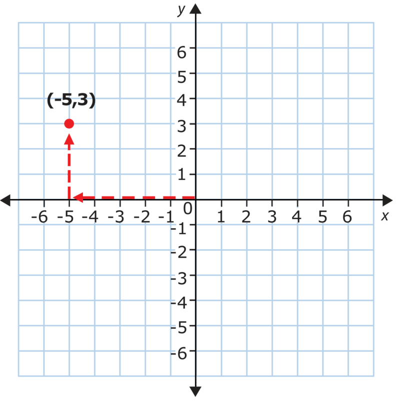

Example

Triangle $ABC$ has vertices $A (-2, -5), \ B(0, 3)$, and $C(6, -3)$. Graph triangle $ABC$ on a coordinate plane. Label the coordinates of its vertices.

**Here are the steps to graphing the triangle.**

* To plot vertex $A$ at (-2, -5), start at the origin. Move 2 units to the left and then 6 units down. Plot and label point $A$.
* To plot vertex $B$ at (0, 3), start at the origin. The $x-$coordinate is zero, so do not move to the left or right. From the origin, simply move 3 units up. Plot and label point $B$.
* To plot vertex $C$ at (6, -3), start at the origin. Move 6 units to the right and then 3 units down. Plot and label point $C$.

**Connect the vertices with line segments to show the sides of the triangle, as shown.**

III. **Find Lengths, Widths and Areas of Rectangles on a Coordinate Plane**

**_Rectangles_** and **_squares_** are four-sided polygons with four right angles. In a rectangle, opposite sides are equal in length. A square is a special type of rectangle that has all four sides equal in length.

**Sometimes, a rectangle will be graphed on the coordinate plane.** If two sides of the rectangle are horizontal and the other two sides are vertical, we can determine the length and width of the rectangle by counting units along the sides. Once we know the length and width of a rectangle, we can use those measures to find the rectangle's **area**, $A$, using this formula:

$A=lw$, **where** $l =$ **length and** $w =$ **width.**

**The area of a figure measures the number of square units that fit inside the figure.**

Example

Rectangle $WXYZ$. is graphed on this coordinate plane.

Find the length and width of the rectangle, and then find the area of the rectangle.

**Here are the steps:**

* Side $XY$ is one of the longer sides of the rectangle. Count the units from point $X$ to point $Y$. There are 7 units, so the length of the rectangle is 7 units.
* Side $XW$ is one of the shorter sides of the rectangle. Count the units from point $X$ to point $W$. There are 3 units, so the width of the rectangle is 3 units.

$A=lw = 7 \times 3 = 21$

**So, the area of the rectangle is 21 square units.**

Remember, the area of the rectangle measures the number of square units that fit inside the rectangle. So, to check this answer, we can count the squares inside rectangle $WXYZ$. There are 21 squares inside the rectangle, so its area is 21 square units. That is the same answer we found by using the formula, so that answer must be correct.

**We can also find the area of a square graphed on the coordinate plane using this formula.**

**$A=s^2$, where $s =$ side length.**

Example

Points $J, \ K,$ and $L$, shown below, are three vertices of a square.

a. Plot the fourth vertex of the square on the grid. Name it vertex $M$ and identify its coordinates.

b. Find the area of square $JKLM$.

There are 4 units between points $J$ and $K$, so all the sides of the square will be 4 units long.

That means that the distance between the fourth vertex, vertex $M$, and vertex $L$ will be 4 units also. From point $L$, we can count 4 units to the left to find that point $M$ should be plotted at. Plot that vertex and connect the sides. The completed square will look like this.

$A=s^2=4^2=4 \times 4 = 16$

**So, the area of the square is 16 square units.**

**To check this answer, we can count the squares inside square $JKLM$. There are 16 squares inside the square, so its area must be 16 square units. That is the same answer we found when we used the formula.**

**Next, we can look at how to use the coordinate grid to organize data.**

IV. **Make Scatter Plots of Paired Real-World Data to Recognize Patterns and Make Predictions**

A **_scatter plot_** is a way of representing real-world data in a visual way. A scatter plot is a graph showing many data points. It allows us to determine if there us a relationship between pairs of data. A scatter plot can show a positive relationship, a negative relationship, or no relationship, as shown below.

* If the points on the scatter plot seem to form a line that slants _up_ from left to right, it shows a positive relationship.
* If the points on the scatter plot seem to form a line that slants _down_ from left to right, it shows a negative relationship.
* If the points on the scatter plot are scattered randomly, it shows no relationship.

For the first two plots shown above, you could draw a straight line through the points called a **_line of best fit_**. That line would not go through every point, but it would show the general trend in the data.

Example

A teacher wants to know if there is a relationship between the amount of time her students spent working on a social studies report and the grade each student received. She surveyed 10 students and recorded the data below.

| **Student** | **Number of Hours Worked** | **Grade** |
| --- | --- | --- |
| Ahmad | 5   | 90  |
| Becky | 3   | 80  |
| Darrell | 3.5 | 80  |
| Emma | 1   | 60  |
| Guillermo | 4.5 | 90  |
| Helene | 1   | 70  |
| Kiet | 3   | 75  |
| Nykeisha | 4   | 85  |
| Ollie | 2   | 70  |
| Zivia | 2.5 | 75  |

**Make a scatter plot to show the data in the table.**

**First, make a scatter plot for the data.** The teacher wants to know if the number of hours worked is related to the grade a student earned, so use the **horizontal axis of the scatter plot to show the number of hours worked**. In the table, the numbers of hours worked range from 1 to 5, so give that axis a scale of 0 to 6, increasing by intervals of 1.

**Use the vertical axis to show the grades students received.** The grades in the table range from 60 to 90. Showing every grade from 0 to 100 would make the plot very large, so include a break in the axis between 0 and 60. Use intervals of 10 for the rest of scale.

**Plot a point for each pair of data in the table.** For example, Ahmad worked for 5 hours and earned a grade of 90. So, plot a point at (5, 90) on the scatter plot. Do this until you have plotted all 10 data points and the scatter plot looks like this.

**Now, let's interpret the scatter plot and use it to make a prediction.**

Example

Interpret and make a prediction based on the scatter plot you created in Example 7.

a. Determine if there is a relationship between the number of hours worked and the grade received. If so, describe the relationship.

b. Suppose an eleventh student spent 6 hours working on her report. Based on the scatter plot, predict the grade you would expect her to receive.

**Let's look back at the scatter plot in Example 7.**

**Draw a line of best fit for this scatter plot. Remember, a line of best fit will not go through every single point on the plot, however, it will fit the general trend of the data. Here is how a line of best fit might look for this scatter plot.**

**Now, let's predict what a student who spent 6 hours working on the project would probably receive as a grade.**

Find 6 hours on the horizontal axis. Move your finger up. You can see that the line of best fit predicts that if a student works for 6 hours, she will receive a grade of about 100.

**So, that would be a good prediction of the grade the eleventh student would receive.**

Real-Life Example Completed
---------------------------

**_The Sunken Ship_**

Gina and Cameron are very excited because they are going to go on a dive to see a sunken ship. The dive is quite shallow which is unusual because most sunken ship dives are found at depths that are too deep for two junior divers. However, this one is at 40 feet, so the two divers can go to see it.

They have the following map to chart their course. Cameron wants to figure out exactly how far the boat will be from the sunken ship. Each square represents 160 cubic feet of water.

First, he makes a note of the coordinates. Then he can use the map to calculate the distance.

**The sunken ship is marked at (4, 8).**

**The dive boat is marked at (-3, 7).**

**Notice the arrows. Once they get to the sunken ship, Gina and Cameron will swim up 1 unit and over 6 units.**

$1 + 6 = 7$

**If each unit = 160 sq. feet, then we can multiply $160 \times 7$**

**Gina and Cameron will swim through 1120 cubic feet of water from the boat to the sunken ship.**

Vocabulary
----------

__Coordinate Plane__

a plane with four quadrants where locations are marked according to coordinates.

__$x -$axis__

the horizontal line on the coordinate plane

__$y -$axis__

the vertical line on the coordinate plane

__Origin__

the point where the $x-$ axis and the $y-$ axis meet

__$x-$coordinate__

the first coordinate in an ordered pair.

__$y-$coordinate__

the second coordinate in an ordered pair.

__Rectangle__

a figure with four right angles and opposite sides parallel and congruent

__Square__

a figure with four right angles and four equal sides that are also parallel.

__Area__

the measure of the space inside a figure

__Scatter Plot__

a data chart that uses points to show the relationship between data and events.

Technology Integration
----------------------

[Khan Academy, The Coordinate Plane](http://www.youtube.com/watch?v=VhNkWdLGpmA)

!?[0](https://www.youtube.com/watch?v=s7NKLWXkEEE)

[James Sousa, Plotting Points on The Coordinate Plane](http://www.youtube.com/watch?v=s7NKLWXkEEE)

!?[0](https://www.youtube.com/watch?v=iTsJsPgcE4E)

[James Sousa, Identify a Quandrant of a Point on the Coordinate Plane](http://www.youtube.com/watch?v=iTsJsPgcE4E)

!?[0](https://www.youtube.com/watch?v=7JMXi_FxA2o)

[James Sousa, Example of Plotting Points on the Coordinate Plane](http://www.youtube.com/watch?v=7JMXi_FxA2o)

!?[0](https://www.youtube.com/watch?v=d-m2pA8rJZM)

[James Sousa, Example of Identifying the Coordinates of Points on the Coordinate Plane](http://www.youtube.com/watch?v=d-m2pA8rJZM)

Other Videos:

This is a Brightstorm video on plotting points and naming quadrants.

http://www.mathplayground.com/mv_plotting_points_naming_quadrants.html

Time to Practice
----------------

Directions: Name the ordered pairs.

1. Name the ordered pair that represents each of these points on the coordinate plane.

3. Ferris wheel

4. carousel

5. log flume

Directions: Name the ordered pairs that represent the vertices of triangle $FGH$.

7. $G$

8. $H$

Directions: Name the ordered pairs that represent the vertices of pentagon $ABCDE$.

10. $B$

11. $C$

12. $D$

13. $E$

14. On the grid below, plot point $V$ at (-6, 4).

, \ S (4, -4)$, and $T (-3, -4)$.")

17. Find the area of this square.

Directions: Points $K, \ L,$ and $M$, shown below, are three vertices of a rectangle.

19. Find the length and width of rectangle $KLMN$.

20. Find the area of rectangle $KLMN$.

Directions: This scatter plot shows the relationship between the last digit of ten students' phone numbers and their vocabulary quiz scores.

21. Does this scatter plot show a positive relationship, a negative relationship, or no relationship?

| **Person** | **Age** | **Number of DVDs Purchased** |
| --- | --- | --- |
| Person 1 | 18  | 14  |
| Person 2 | 19  | 13  |
| Person 3 | 20  | 13  |
| Person 4 | 20  | 12  |
| Person 5 | 21  | 11  |
| Person 6 | 22  | 12  |
| Person 7 | 22  | 11  |
| Person 8 | 23  | 10  |
| Person 9 | 24  | 9   |
| Person 10 | 25  | 9   |

a. Use the grid below to make a scatter plot for the data in the table. Draw a line of best fit for the scatter plot.

c. If the trend in the scatter plot continues, predict the number of DVDs you would expect a 27-year-old person to buy in one year.

</article>

## 5.0 Using Ratios, Rates and Proportions

<article>

</article>

### 5.1 Ratios

<article>

Introduction
------------

**_Rapid Reading_**

Kayla and Torrey have been participating in the challenge since day one. By October, eight weeks into school, Kayla had already finished 6 books.

“I have six read,” Kayla said biting into her sandwich at lunch.

“I think I am reading at the same pace,” Torrey said. “After four weeks, I had already finished 3 books.”

“Are you sure,” Kayla asked.

“Well, I need to count, but I am pretty sure that we have both finished reading the same number of books.”

Is Torrey correct? Have the girls each read the same number of books now that 8 weeks have passed?

**To figure this out, you will need to use equivalent ratios. Equivalent ratios are the topic of this first lesson, pay attention and you be able to figure out if Torey and Kayla have both read the same number of books at the end of the lesson.**

**_What You Will Learn_**

In this lesson, you will learn the following skills:

* Identify and write different forms of equivalent ratios among rational numbers.
* Write ratios in simplest form.
* Write and compare ratios in decimal form.
* Solve real-world problems involving ratios among rational numbers.

**_Teaching Time_**

I. **Identify and Write Different Forms of Equivalent Ratios among Rational Numbers**

In math and in real-life, we compare things all the time. We look at what we have and what someone else has or we look at the difference between values and we compare them. Comparing comes very naturally. Using **_ratios_** comes naturally too, because ratios are a way that we can compare numbers and values.

**What is a ratio?**

A **_ratio_** compares two numbers or quantities called **_terms._** For example, suppose there are 3 green (G) apples and 4 red (R) apples in this basket.

$\frac{green}{red} = \frac{3}{4}$

We can also express this ratio in words, 3 to 4, or using a colon, 3:4.

The ratio above compares one part of the apples in the basket to another part. The ratio above compares the apples that are green to the apples that are red.

A ratio may also express a part to a whole. For example, we can express the ratio of green apples to the total number of apples in the basket.

$\frac{green}{total} = \frac{green}{green + red} = \frac{3}{3 + 4} = \frac{3}{7}$

There are a total of 7 apples in the basket, so the ratio of green apples to total apples is 3 to 7 or 3:7.

**Here are the three ways that we can write a ratio:**

1.  **In fraction form using a fraction bar**
2.  **Using the word “to”**
3.  **Using a colon:**

**5A. Lesson Exercises**

**Look at the drawing and write each the ratio three different ways.**

**Compare stars to suns**

")

\[Figure 5\]

**_Take a few minutes to check your answers with a friend._**

**Now that you know how to write a ratio, let's look at equivalent ratios.**

A ratio shows the relationship between two quantities. **_Equivalent ratios_** can be used to show the same relationship between two quantities. **Remember that the word “equivalent” means equal.**

**Because we can write ratios in fraction form, we can use what we know about finding equivalent fractions to help us identify equivalent ratios. Here is where simplifying fractions is going to help us. We can simplify ratios to discover equivalence just as we can simplify fractions.**

Example

Determine if these two ratios are equivalent $\frac{2}{3}$ and $\frac{10}{15}$.

We can start by simplifying the larger of the two fractions. If it simplifies to the same number as the smaller fraction, then we know that the two ratios are equivalent.

$$
\begin{align*}
\frac{10 \div 5}{15 \div 5} &= \frac{2}{3}\\
\frac{2}{3} &= \frac{2}{3}
\end{align*}
$$

**These are equal ratios.**

**Simplifying is one way to check for equivalence. We can also create equivalent ratios by multiplying just as we would make equivalent fractions.**

Change $\frac{2}{3}$ to a ratio with 15 as the second term (the denominator).

Since $3 \times 5 = 15$, multiply both terms of the ratio $\frac{2}{3}$ by 5.

$\frac{2}{3} = \frac{2 \times 5}{3 \times 5} = \frac{10}{15}$

This shows that the ratio $\frac{2}{3}$ is equivalent to the ratio $\frac{10}{15}$.

**So, the two ratios listed above are equivalent.**

Example

Determine if these two ratios are equivalent 7:6 and 13:12.

Rewrite the ratios as fractions $\frac{7}{6}$ and $\frac{13}{12}$.

Change $\frac{7}{6}$ to a ratio with 12 as the second term.

Since $6 \times 2 = 12$, multiply both terms of the ratio $\frac{7}{6}$ by 2.

$\frac{7}{6} = \frac{7 \times 2}{6 \times 2} = \frac{14}{12}$

When the second term (the denominator) is 12, the equivalent ratio for $\frac{7}{6}$ is $\frac{14}{12}$, not $\frac{13}{12}$.

**So, 7:6 and 13:12 are** **_not_** **equivalent ratios.**

**Another way to determine if two ratios are equivalent is to cross multiply the terms in the ratio. If the cross products are equal, then the two ratios are equivalent. If the cross products are** **_not_** **equal, then the two ratios are** **_not_** **equivalent.**

Example

Determine if these two ratios are equivalent $\frac{4}{8}$ and $\frac{1}{2}$.

We use the $\overset{?}{=}$ symbol to show that the two ratios below may or may not be equal.

$\frac{4}{8} \overset{?}{=} \frac{1}{2}$

Now, we cross multiply. To cross multiply, multiply the circled pairs of numbers shown below. The product we get when we multiply each circled pair of numbers is called a cross product.

\begin{align*}
8 \times 1 &\overset{?}{=} 4 \times 2\\
8 &\overset{?}{=} 8\\
8 &= 8
\end{align*}
$$

**Since $8 = 8$, the cross products are equal. This means that $\frac{4}{8} = \frac{1}{2}$, and those two ratios are equivalent.**

**5B. Lesson Exercises**

**Determine whether or not each pair of ratios is equivalent. Write yes or no.**

1.  $\frac{3}{4}$ **_and_** $\frac{9}{12}$
2.  $\frac{5}{6}$ **_and_** $\frac{20}{30}$
3.  $\frac{4}{5}$ **_and_** $\frac{8}{10}$

II. **Write Ratios in Simplest Form**

In the last section, we touched briefly on how to simplify ratios that are in fraction form to see if they are equivalent or not. We will explore this further in this section.

**What does it mean to simplify?**

To **_simplify_** means to make smaller. When we simplify, we make a fraction smaller. It is still equivalent to the larger form of the fraction, but it is simpler.

**How do we simplify a ratio in fraction form?**

**To write a ratio in simplest form, find the** **_greatest common factor_** **of both terms in the ratio. The greatest common factor of two numbers is the greatest number that divides both numbers evenly. Then, divide both terms of the ratio by the greatest common factor.**

**This is basically the same procedure you use to rewrite a fraction in simplest form.** Let’s look at an example.

Example

Write this ratio in simplest form $\frac{20}{24}$.

**First, find the greatest common factor of the terms 20 and 24.**

The factors of 20 are 1, 2, 4, 5, 10, and 20.

The factors of 24 are 1, 2, 3, 4, 6, 8, 12, and 24.

The factors that both 20 and 24 have in common are 1, 2 and 4.

**The greatest of those common factors is 4, so divide both terms by 4 to write the ratio in simplest form.**

$\frac{20}{24} = \frac{20 \div 4}{24 \div 4} = \frac{5}{6}$

**So, the simplest form of the ratio $\frac{20}{24}$ is $\frac{5}{6}$.**

**How is this useful when working with ratios?**

It is useful because we can simplify ratios in fraction form to see if they are equivalent. We can also use a simplified ratio to find an equivalent ratio. To do this, you can multiply both terms of the original ratio by the same number to find an equivalent ratio.

Example

Write three equivalent ratios for this ratio 1:9.

The ratio 1:9 or $\frac{1}{9}$ is already in simplest form. Notice that we wrote the ratio into fraction form so that it is easier to work with.

It does not matter by which numbers we choose to multiply the terms. Let's multiply by 2, first.

$\frac{1}{9} = \frac{1 \times 2}{9 \times 2} = \frac{2}{18} \ \text{or} \ 2:18$

Let's multiply by 5, next.

$\frac{1}{9} = \frac{1 \times 5}{9 \times 5} = \frac{5}{45} \ \text{or} \ 5:45$

Let's multiply by 100, next.

$\frac{1}{9} = \frac{1 \times 100}{9 \times 100} = \frac{100}{900} \ \text{or} \ 100:900$

So, three ratios that are equivalent to 1:9 are 2:18, 5:45, and 100:900.

**5C. Lesson Exercises**

1.  **Simplify this ratio 4:16**
2.  **Simplify this ratio 3 to 18**
3.  **Write an equivalent ratio to 4:5**

III. **Write and Compare Ratios in Decimal Form**

Just as fractions can be written in decimal form, ratios can be written in fraction form, so they can also be written as decimals. Now we will look at how to write a ratio as a decimal.

**How do we write a ratio as a decimal?**

**To convert a ratio to decimal form, write the ratio as a fraction. Then divide the term above the fraction bar by the term below the fraction bar.**

Let’s look at how to do this.

Example

Rewrite the ratio 1 to 4 in decimal form.

**The ratio 1 to 4 can be expressed as the fraction $\frac{1}{4}$. This is our first step.**

**Next, divide the term above the fraction bar, 1, by the term below the fraction bar, 4.**

$\frac{1}{4} = {4 \overline{ ) 1 \;\;\;}}$

Since 1 cannot be evenly divided by 4, rewrite 1 as a decimal with a zero after the decimal point You can do this because $1 = 1.0 = 1.00 = 1.000$. Before you divide, write a decimal point in the quotient directly above the decimal point in the dividend. Then divide.

$$
\begin{align*}
& \overset{ \ \ 0.2}{4 \overline{ ) {1.0 \;}}}\\
& \quad \underline{-8}\\
& \quad \ \ 2
\end{align*}
$$

Continue adding zeroes after the decimal point and diving until the quotient has no remainder.

$$
\begin{align*}
& \overset{ \ \ 0.25}{4 \overline{ ) {1.00 \;}}}\\
& \quad \underline{-8 \;\;}\\
& \quad \ \ 20\\
& \ \ \ \underline{-20}\\
& \qquad \ 0
\end{align*}
$$

**The decimal form of the ratio $\frac{1}{4}$ is 0.25.**

Example

Rewrite the ratio 9:5 in decimal form.

**The ratio 9:5 can be expressed as the fraction $\frac{9}{5}$.**

**Next, divide the term above the fraction bar, 9, by the term below the fraction bar, 5.**

$$
\begin{align*}
& \overset{ \ \ \ 1}{5 \overline{ ) { \ 9 \;}}}\\
& \ \underline{-5\;}\\
& \ \ \ 4
\end{align*}
$$

There is a remainder. So, add zeroes after the decimal point in 9 to continue dividing.

$$
\begin{align*}
& \overset{ \ \ 1.8}{5 \overline{ ) {9.0 \;}}}\\
& \underline{-5\;}\\
& \quad 40\\
& \ \underline{-40}\\
& \quad \ \ 0
\end{align*}
$$

**The decimal form of 9:5 is 1.8.**

**What about comparing? Can we use decimals to compare ratios?**

**Sometimes, you may want to compare two ratios and determine if they are equivalent or not. Rewriting both ratios in decimal form is one way to do this.**

Example

Compare these two ratios and determine if they are equivalent $\frac{7}{14}$ and $\frac{11}{20}$.

**Rewrite $\frac{7}{14}$ in decimal form.**

$$
\begin{align*}
& \overset{ \ \ 0.5}{14 \overline{ ) {\ 7.0 \;}}}\\
&  \ \ \underline{-70\;}\\
& \qquad  0\\
& \quad \ \underline{-0}\\
& \qquad 0
\end{align*}
$$

**Rewrite $\frac{11}{20}$ in decimal form.**

$$
\begin{align*}
& \overset{ \ \ 0.55}{20 \overline{ ) { 11.00 \;}}}\\
&  \ \ \underline{-100\;}\\
& \qquad  100\\
& \quad \ \underline{-100}\\
& \qquad \quad 0
\end{align*}
$$

**To compare the ratios in decimal form, give each decimal the same number of decimal places. In other words, give 0.5 two decimal places:** 0.5 = 0.50.

**Now compare. Since both decimals have a 0 in the ones place and a 5 in the tenths place, compare the digits in the hundredths place.**

$$
\begin{align*}
&0.5\underline{0}\\
&0.5\underline{5}
\end{align*}
$$

Since $0 < 5, 0.50 < 0.55$. So, the ratios, $\frac{7}{14}$ _and_ $\frac{11}{20}$, are not equivalent.

**In fact,** $\frac{7}{14} < \frac{11}{20}$.

**5D. Lesson Exercises**

**Write each ratio as a decimal.**

1.  **5 to 10**
2.  **4 to 10**
3.  **Compare 6 to 10 and 1 to 4**

IV. **Solve Real-World Problems Involving Ratios Among Rational Numbers**

Being able to rewrite ratios in different forms can help us solve real-world problems. Let’s look at using ratios to solve some real-world problems.

Elena and Jake have a box with only two colors of marbles in it. There are 28 blue marbles and 16 gray marbles in the box. Elena says that the ratio of gray marbles to blue marbles is $\frac{16}{28}$. Jake says that the ratio of gray marbles to blue marbles is $\frac{4}{7}$. Who is correct, or are they both correct? They also want to find the ratio of gray marbles to the total number of marbles in the box.

Write the ratio of gray marbles to blue marbles as a fraction. Be careful that the ratio you write compares _gray_ marbles to _blue_ marbles, not _blue_ marbles to _gray_ marbles.

Since there are 16 gray marbles and 28 blue marbles, the ratio is:

$\frac{gray}{blue} = \frac{16}{28}$

So, Elena is correct that the ratio of gray marbles to blue marbles is $\frac{16}{28}$.

If that ratio is equivalent to $\frac{4}{7}$, then Jake is correct too. One way to determine if those two ratios are equivalent is to cross multiply.

$$
\begin{align*}
\frac{16}{28} & \overset{?}{=} \frac{4}{7}\\
28 \times 4 & \overset{?}{=} 16 \times 7\\
112 & \overset{?}{=} 112\\
112 & = 112
\end{align*}
$$

Since the cross products are equal, the two ratios are equivalent.

**So, the answer to the first question is that Elena and Jake are both correct.**

**Now let’s think about the second part of the question. To figure this out, we need to figure out the ratio of gray marbles to total marbles in the box.**

$\frac{gray}{total} = \frac{gray}{gray + blue} = \frac{16}{16 + 28} = \frac{16}{44}$

Write that ratio in simplest form.

The factors of 16 are: 1, 2, 4, 8, and 16.

The factors of 44 are: 1, 2, 4, 11, 22, and 44.

The greatest common factor of 16 and 24 is 4. So, divide both terms by 4.

$\frac{16}{44} = \frac{16 \div 4}{44 \div 4} = \frac{4}{11}$

**The ratio of gray marbles to the total number of marbles, written in simplest form, is** $\frac{4}{11}$.

**Now let’s look at how to apply all that we have learned to the introduction problem.**

Real Life Example Completed
---------------------------

**_Rapid Reading_**

Kayla and Torrey are both in Mrs. Henderson’s seventh grade Language Arts class. On the first day of school, Mrs. Henderson posed a reading challenge to the class. The challenge was to see how many books they can each read throughout the entire year. The books would be read in silent reading or outside of school and the honor system would be employed. Each student was to keep track of the title and author of each book as they read it. At the end of the year, they will celebrate their accomplishments with a pizza party and students can earn extra credit towards their final grade. While some students were hesitant to take on the challenge, all loved the promise of a pizza party and extra credit. Mrs. Henderson won them over.

Kayla and Torrey have been participating in the challenge since day one. By October, eight weeks into school, Kayla had already finished 6 books.

“I have six read,” Kayla said biting into her sandwich at lunch.

“I think I am reading at the same pace,” Torrey said. “After four weeks, I had already finished 3 books.”

“Are you sure,” Kayla asked.

“Well, I need to count, but I am pretty sure that we have both finished reading the same number of books.”

Is Torrey correct? Have the girls each read the same number of books now that 8 weeks have passed?

**To solve this problem, we need to figure out if the girls have been reading the same number of books in the same number of weeks. First, let’s write a ratio that compares Kayla’s books read to the number of weeks she read them in.**

**Kayla read 6 books in 8 weeks.**

$\frac{books}{weeks} = \frac{6}{8}$

**Torrey said that she believes that she is reading at the same pace as Kayla. She says that she read 3 books in four weeks.**

$\frac{books}{weeks} = \frac{3}{4}$

**We can compare these two ratios to see if they are equivalent and find out if Torrey is reading at the same pace as Kayla. If they are, then the girls have read the same number of books.**

To do this, we simplify Kayla’s ratio.

$\frac{6}{8} = \frac{3}{4}$

**Simplifying Kayla’s ratio shows that she also read 3 books in the first 4 weeks. If Torrey is still reading at this pace, then the girls have both read the same number of books, because both ratios are equivalent.**

Vocabulary
----------

__Ratio__

a comparison between two quantities. Ratios can be written as a fraction, with a colon or by using the word to.

__Terms__

the two quantities in a ratio.

__Equivalent Ratios__

when two ratios are equal.

__Simplify__

to write in a simpler form by using the greatest common factor to divide the numerator and the denominator of a fraction by the same number.

__Greatest Common Factor__

the largest common factor between two numbers.

Technology Integration
----------------------

!?[0](https://www.youtube.com/watch?v=JWmCiZwoyMs)

[Khan Academy Ratios as Fractions in Simplest Form](http://www.youtube.com/watch?v=JWmCiZwoyMs)

[James Sousa, Ratios](http://www.youtube.com/watch?v=-YLWlPVEpbQ)

!?[0](https://www.youtube.com/watch?v=zUGLLvymVag)

[James Sousa, Write a Ratio as a Simplified Fraction](http://www.youtube.com/watch?v=zUGLLvymVag)

!?[0](https://www.youtube.com/watch?v=xX-qtSw0hek)

[James Sousa, Example of How to Write a Ratio as a Simplified Fraction](http://www.youtube.com/watch?v=xX-qtSw0hek)

Other Videos:

1.  http://www.mathplayground.com/howto_ratios.html – This video is about understanding the basics of ratios.
2.  http://www.mathplayground.com/howto_equalratios.html – This video is about understanding equal ratios.
3.  http://www.mathplayground.com/howto_ratiowordproblems.html – This video is about solving ratio word problems.

Time to Practice
----------------

Directions: Determine whether each of the following ratio pairs is equal. Write yes if they are equal and no if they are not equal.

1. $\frac{1}{2}$ _and_ $\frac{6}{12}$

2. $\frac{3}{8}$ _and_ $\frac{1}{4}$

3. $\frac{6}{7}$ _and_ $\frac{2}{3}$

4. $\frac{6}{7}$ _and_ $\frac{12}{14}$

5. $\frac{2}{3}$ _and_ $\frac{10}{15}$

6. $\frac{17}{21}$ _and_ $\frac{6}{7}$

7. $\frac{24}{48}$ _and_ $\frac{12}{24}$

8. $\frac{16}{18}$ _and_ $\frac{32}{38}$

9. $\frac{9}{45}$ _and_ $\frac{1}{9}$

10. $\frac{4}{6}$ _and_ $\frac{44}{66}$

Directions: Simplify each ratio. Write the simplified version in the same form as the original ratio.

11. 3 to 6

12. 5:20

13. 18 to 22

14. $\frac{18}{20}$

15. $\frac{25}{55}$

16. 6 to 42

17. 18 to 10

18. 12 to 4

19. 16:8

20. 24 to 16

Directions: Write each ratio as a decimal.

21. 1 to 4

22. 3 to 6

23. 3:4

24. 8 to 5

25. 7 to 28

Directions: Compare the following ratios using &lt;, &gt;, or =.

26. .55 \_\_\_\_1 to 2

27. 3:8 \_\_\_\_\_ 4 to 9

28. 1 to 2 \_\_\_\_\_ 4:8

</article>

### 5.2 Rates

<article>

Introduction
------------

**_Keeping Track of Books_**

After the first 8 weeks of school, Manuel has finished 5 of the 12 books.

“How many have you finished?” his sister Sarina asked at breakfast.

“I have read 5 out of 12,” Manuel said. “I have seven more to go to finish the series.”

“How long is that going to take you?” Sarina asked.

Manuel had to think for a few minutes about this. Then he took out his notebook to do some figuring.

Think about this with Manuel. At this rate, how many books is he reading per week? How many weeks will it take him to read all 12?

**To figure out this problem, you will need to know about rates and unit rates. In this lesson, you will learn everything that you need to know to solve this problem. By the end, you will be able to help Manuel determine how many more weeks it will take him to complete the series.**

**_What You Will Learn_**

By the end of this lesson, you will be able to complete the following:

* Identify and write equivalent rates.
* Find unit rates.
* Compare unit rates.
* Model and solve real-world problems using simple equations involving rates.

**_Teaching Time_**

I. **Identify and Write Equivalent Rates**

**What is a rate?**

**A** **_rate_** **is a special kind of ratio. It compares two different types of units, such as dollars and pounds.**

**_Notice the word “per”. This word signals us that we are talking about a rate._**

We use rates all the time. We use them when shopping, for example, the term "per pound". We use them with gasoline, when we say "per mile". We use them with pricing when we say "$4.00 per yard of material".

**Sometimes, two rates are equivalent or equal.**

**How can we tell if two rates are equivalent?**

**Two rates are equivalent if they show the same relationship between two units of measure. We can use the same strategies to find equivalent rates that we used to find equivalent ratios.**

Example

Determine if these two rates are equivalent: 40 miles in 2 hours, and 80 miles in 4 hours.

**First, express each rate as a fraction. Be sure to keep the terms consistent. That is, if the first ratio compares miles to hours, the second ratio should also compare miles to hours.**

$$
\begin{align*}
40 \ miles \ \text{in}\ 2 \ hours &=  \frac{40 mi}{2h} = \frac{40}{2}\\
80 \ miles \ \text{in} \  4 \ hours &=  \frac{80 mi}{4h} = \frac{80}{4}
\end{align*}
$$

In order to compare them, the denominators need to match. We are going to change the ratio, $\frac{40}{2}$, to a ratio with 4 as the second term, or denominator.

Since $2 \times 2 = 4$, multiply both terms of the ratio $\frac{40}{2}$ by 2.

$\frac{40}{2} = \frac{40 \times 2}{2 \times 2} = \frac{80}{4}$

**This shows that the ratio $\frac{80}{4}$ is equivalent to the ratio $\frac{40}{2}$.**

**This means that the rate 80 miles in 4 hours is equivalent to the rate 40 miles in 2 hours.**

**The two cars traveled at the same rate.**

**You can also cross multiply to determine if two rates are equivalent. Let’s look at an example where this strategy is applied.**

Example

**The machine wound 5 meters of wire in three seconds. A second machine wound 20 meters of wire in 18 seconds. Did they wind the wire at the same rate?**

Determine if these two rates are equivalent: 5 meters every 3 seconds and 20 meters every 18 seconds.

**First, cross multiply to determine if the rates are equivalent or not.**

$$
\begin{align*}
\frac{5m}{3 \sec} &\overset{?}{=} \frac{20 m}{18 \sec}\\
\frac{5}{3} &\overset{?}{=} \frac{20}{18}\\
3 \times 20 &\overset{?}{=}  5 \times 18\\
60 &\overset{?}{=}90\\
60 &\neq 90
\end{align*}
$$

**Since the cross products are not equal, the rates are not equivalent.**

**5E. Lesson Exercises**

**Determine if each of the rates are equivalent to each other.**

1.  **3 feet in 9 seconds and 6 feet in 18 seconds**
2.  **5 miles in 30 minutes and 6 miles in 42 minutes**
3.  **5 pounds for $20.00 and 8 pounds for $32.00**

II. **Find Unit Rates**

There is a special kind of rate which is called a **_unit rate._** **A unit rate has a denominator of 1, meaning that it is the measure for one of whatever you are talking about: 1 mile, 1 pound, 1 foot, etc.** When we talk about unit rates, we are talking about singular measurement and single rates.

1 pound of apples is $1.79.

**This is a unit rate. It tells us that for 1 pound of apples, we will pay $1.79. Based on this number, we can figure out what we will pay for 2 pounds, 3 pounds, 5 pounds, etc.**

**This problem told us what the unit rate was, but sometimes you will need to figure out the unit rate. How do we figure out the unit rate?**

To figure out the unit rate, we have to write the ratio as a fraction with a denominator of one.

Example

Rochelle ran 15 miles in 2 hours. Express her speed as a unit rate.

To express this as a unit rate, we need to figure out Rochelle’s speed for one mile. Begin by setting up the rate as a fraction.

$15 \ miles \ \text{in}\ 2 \ hours = \frac{15mi}{2h} = \frac{15}{2}$

The second number in a unit rate is 1. Since $2 \div 2 = 1$, you can divide both terms by 2 to write this as a unit rate.

$\frac{15mi}{2h} = \frac{15}{2} = \frac{15 \div 2}{2 \div 2}$

Use long division to divide 15 by 2.

$$
\begin{align*}
& \overset{ \ \ 7.5}{2 \overline{ ) {\ 15.0 \;}}}\\
& \quad \underline{-14}\\
& \quad \ \ 10\\
& \ \ \ \underline{-10}\\
& \qquad \ 0
\end{align*}
$$

So, $\frac{15 mi}{2h} = \frac{15 \div 2}{2 \div 2} = \frac{7.5}{1} = \frac{7.5mi}{1h}$ or 7.5 miles per hour.

**The unit rate is 7.5 miles per hour.**

**A quicker strategy for finding a unit rate is to simply divide the first term by the second term.**

To find the unit rate for Example 3, you could have simply divided 15 miles by 2 hours to find the miles per hour. Actually, that that is exactly what we did. The method that we used showed _why_ we can simply divide the numerator by the denominator.

Try this out on this example.

Example

Kyle ran 4 miles in 28 minutes. How fast did he run per mile?

**“Per mile” let’s us know that we are looking for his rate for 1 mile. That is the unit rate.**

**We write a fraction ratio and divide.**

$$
\begin{align*}
& \frac{min}{miles} = \frac{28}{4}\\
& 28 \div 4 = 7\\
&\frac{7}{1}
\end{align*}
$$

**Kevin ran 1 mile in 7 minutes. That is the unit rate.**

**5F. Lesson Exercises**

**Find each unit rate.**

1.  **5 pounds of apples for $2.00**
2.  **45 miles for 3 gallons of gasoline**
3.  **18 inches in 2 minutes**

III. **Compare Unit Rates**

**Sometimes, we may need to compare unit rates. For example, you may want to compare two unit prices to determine which one is the better buy.**

Example

Felicia needs to buy sugar. She could buy a 16-ounce box of sugar for $1.12, or she could buy a 24-ounce box of sugar for $1.44. Which is the better buy? How many cents per ounce cheaper is that buy?

**Find the unit price, per ounce, for the 16-ounce box. Remember, you can find the unit price by dividing the first term by the second term.**

$$
\begin{align*}
\$1.12 \ \text{for}\ 16 \ oz = \frac{\$1.12}{16 oz} && & \overset{ \ \ \$0.07}{16 \overline{ ) {\$1.12 \;}}}\\
&&& \quad \underline{-1.12}\\
&&& \qquad \quad 0
\end{align*}
$$

**Find the unit price, per ounce, for the 24-ounce box.**

$$
\begin{align*}
\$1.44 \ \text{for} \ 24 \ oz = \frac{\$1.44}{24oz} && & \overset{ \ \ \$0.06}{24 \overline{ ) {\$1.44 \;}}}\\
&&& \quad \underline{-1.44}\\
&&& \qquad \quad 0
\end{align*}
$$

**Since $0.06 < $0.07, the 24-ounce box is cheaper, at $0.06 per ounce.**

Subtract to find how much cheaper per ounce the better buy is $0.07 - $0.06 = $0.01

The 24-ounce box of sugar is the better buy. Felicia will pay $0.01 less per ounce if she buys the 24-ounce box.

**Once you can figure out the unit rate, you can easily compare which unit rate is greater and which is less. Let’s continue looking at how to apply unit rates to real-life examples in the next section.**

IV. **Model and Solve Real-World Problems Using Simple Equations Involving Rates**

We can use this information to solve real-world problems. Remember that when you are working with a problem, we read the problem first and then write an equation that we can solve.

Maria ran 5 miles in 60 minutes. Her brother Mario ran the same distance in half the time. What is Mario’s rate?

**To figure this out, first notice that we are looking for Mario’s unit rate. To find this, we need to start with figuring out Maria’s. We know that Mario ran the same distance in half the time, so we can say that Mario’s unit rate is one-half of Maria’s. Mario runs 1 mile in one-half the time it takes Maria to run one mile.**

**$\frac{1}{2}$ (Maria’s unit rate) = Mario’s unit rate**

First, we need to figure out Maria’s unit rate.

$\frac{60 \ min}{5 \ miles} = \frac{12 \ min}{1 \ mile}$

**Maria runs 1 mile in 12 minutes.**

**Mario runs the same distance in half the time, so he runs one mile in 6 minutes.**

**Now let’s apply what we have learned about rates to our introduction problem.**

Real-Life Example Completed
---------------------------

**_Keeping Track of Books_**

Manuel loves to read. He found a series of mystery books that take place in the world of medieval knights, and he has been working his way through the series. There are twelve books in the series.

After the first 8 weeks of school, Manuel has finished 5 of the 12 books.

“How many have you finished?” his sister Sarina asked at breakfast.

“I have read 5 out of 12,” Manuel said. “I have seven more to go to finish the series.”

“How long is that going to take you?” Sarina asked.

Manuel had to think for a few minutes about this. Then he took out his notebook to do some figuring.

Think about this with Manuel. At this rate, how many books is he reading per week? How many weeks will it take him to read all 12?

**There are two questions here to figure out. Let’s tackle the first one. We need to figure out how many books Manuel is reading per week. The word “per” lets us know that we want to figure out the number of books for one week. Let’s write a ratio to compare books read to weeks.**

$\frac{5 \ books}{8 \ weeks}$

**Next, we need to figure out how many books he read per week. To do this, we divide 5 by 8.**

$\overset{ \ \ .625}{8 \overline{ ) {5.0 \;}}}$

**Manuel reads .625 books per week. We could also say that he reads a little more than $\frac{1}{2}$ book per week.**

**Given this rate, how long will it take him to read 12 books? We can set up a pair of ratios to figure this out.**

$\frac{.625 \ books}{1 \ week}=\frac{12 \ books}{x \ weeks}$

**If we divide 12 by 1.6, we will have the number of weeks.**

$\overset{ \ \qquad 19.2}{.625 \overline{ ) {12.0 \;}}}$

**Manuel will finish the series in 19.2 weeks. Since he has already been reading for 8 weeks, he can subtract this number from 19.2. 19.2 - 8 = 11.2. Manuel will finish the series in 11.2 more weeks.**

Vocabulary
----------

__Rate__

A special kind of ratio that compares two different quantities.

__Per__

a word that signals you that a rate is being used.

__Unit Rate__

a rate that is compared to 1. A rate can be for 1 pound, 1 mile, 1 second, 1 of any unit.

Technology Integration
----------------------

!?[0](https://www.youtube.com/watch?v=jlEJU-l5DWw)

[James Sousa, Rates and Unit Rates](http://www.youtube.com/watch?v=jlEJU-l5DWw)

!?[0](https://www.youtube.com/watch?v=9u3vmIKjwEg)

[James Sousa, Determine Unit Rate](http://www.youtube.com/watch?v=9u3vmIKjwEg)

!?[0](https://www.youtube.com/watch?v=HAHHzc4Yj9c)

[James Sousa, Determine a Unit Rate in Gallons per Minute](http://www.youtube.com/watch?v=HAHHzc4Yj9c)

!?[0](https://www.youtube.com/watch?v=ZI4WaviYNsk)

[James Sousa, Determine the Best Buy Using Unit Rate](http://www.youtube.com/watch?v=ZI4WaviYNsk)

Time to Practice
----------------

Directions: Write an equivalent rate for each rate.

1. 2 for $10.00

2. 3 for $15.00

3. 5 gallons for $12.50

4. 16 pounds for $40.00

5. 18 inches for $2.00

6. 5 pounds of blueberries for $20.00

7. 40 miles in 80 minutes

8. 20 miles in 4 hours

9. 10 feet in 2 minutes

10. 12 pounds in 6 weeks

Directions: Now take each of the rates in numbers 1–10 and find the unit rate for each.

11.

12.

13.

14.

15.

16.

17.

18.

19.

20.

Directions: Determine whether each is equivalent or not.

21. 60 units in 3 minutes and 80 units in 4 minutes

22. $16 for 8 pounds and $22 for 10 pounds

23. 50 kilometers in 2 hours and 75 kilometers in 3 hours

Directions: Solve each problem.

24. Max paid $45 for 15 gallons of gasoline. What was the cost per gallon of gasoline?

25. Mr. Brown paid $8.28 for 12 cans of green beans. Express this cost as a unit price.

26. A train travels 480 kilometers in 3 hours. Express this speed as a unit rate.

27. Mrs. Jenkins paid $50 for 40 square feet of carpeting. What was the cost per square foot of carpeting?

28. A copy machine can produce 310 copies in 5 minutes. How many copies can the machine produce per minute?

29. Nadia needs to buy some cheddar cheese. An 8-ounce package of cheddar cheese costs $2.40. A 12-ounce package of cheddar cheese costs $3.36.

a. Find the unit price for the 8-ounce package.

b. Find the unit price for the 12-ounce package.

c. Which is the better buy? How many cents per ounce cheaper is the better buy?

30. Joe drove 141 miles in 3 hours. His cousin Amy drove 102 miles in 2 hours. Assume both cousins were driving at constant speeds.

a. How fast was Joe driving, in miles per hour?

b. How fast was Amy driving, in miles per hour?

c. Who was driving at a faster rate of speed? How much faster?

</article>

### 5.3 Slope

<article>

Introduction
------------

**_Reading Rates_**

What is their rate? If you were to draw the rate of change on a graph comparing books to weeks, what would the graph look like?

**Rate of change is one of the things that will be addressed in this lesson. To understand it, you have to understand slope and graphs. All of this will be taught in this lesson. At the end, you will understand how to graph this information.**

**_What You Will Learn_**

In this lesson, you will learn how to complete the following:

* Recognize the slope of a line as the ratio of the vertical rise to the horizontal run and distinguish between types of slopes.
* Find the slope of a line
* Draw a line with a given slope.
* Model and solve real-world problems by interpreting slopes of simple linear equations as rates.

**_Teaching Time_**

I. **Recognize the Slope of a Line as the Ratio of Vertical Rise to Horizontal Run, and Distinguish Between Types of Slopes**

When someone first learns to ski, he or she usually starts on a slope that is not very steep. Sometimes that slope is called a beginners' slope. After mastering the basic skills of skiing, a person may begin to try slopes that are steeper and more challenging.

In mathematics, the term **_slope_** has a similar meaning. In mathematics, **the slope of a line describes the steepness of a line. Thinking of a ski slope can help you remember that the slope of a line tells how steep it is.**

In mathematical terms, the slope of the line is also referred to as "s", the “rise-over-run.” That is, the slope is the ratio of the vertical (up and down) rise of a line to its horizontal (left to right) run.

To help us understand this ratio, let's look at line $AB$ on the coordinate plane below.

So, $\text{slope} = \frac{rise}{run} = \frac{5}{6}$.

The slope of line $AB$ is $\frac{5}{6}$.

Line $AB$ has a slope of $\frac{5}{6}$, which is a positive slope.

**Knowing some basic information about the slope of a line can tell you about its slant.**

* A line that slants _down_ from left to right has a **_negative slope._**

**Let’s look at a few examples.**

Example

Determine if the slope of each line shown below is positive or negative.

a. ")

\[Figure 7\]

**Consider the line in $a$.**

**The line slants** **_down_** **from left to right, so its slope is negative.**

**Consider the line in $b$.**

**The line slants** **_up_** **from left to right, so its slope is positive.**

**You should also know about the slopes of horizontal and vertical lines.**

$\text{slope} = \frac{rise}{run} = \frac{0}{n} = 0.$

**So, the slope of a horizontal line is zero.**

* **A vertical line has a rise, but does not have a run.**

$\text{slope} = \frac{rise}{run} = \frac{n}{0} = undefined.$

**Any fraction with a zero in the denominator is undefined. So, the slope of a vertical line is undefined.**

Example

Identify the slope of each line shown below.

a. ")

\[Figure 10\]

**Consider the line in $a$.**

**The line is vertical, so its slope is undefined.**

**Consider the line in $b$.**

**The line is horizontal, so its slope is zero.**

**5G. Lesson Exercises**

**Answer the following questions about slope.**

1.  **What is the slope of a horizontal line?**
2.  **What is the slope of a vertical line?**
3.  **What is the slope of a line that goes up from left to right?**

II. **Find the Slope of a Line**

**Suppose you are given the graph of a line. You can find the slope of that line by choosing two points on the line. Then you can count the units to find the ratio of the rise to the run.**

**Be sure to consider if the line slants up or down from left to right. This will help you determine if the slope is positive or negative.**

Example

Find the slope of line $CD$ below.

**The slope of line $CD$ is 3.**

Example

Find the slope of line $FG$ below.

**The slope of line $FG$ is $- \frac{4}{3}$.**

**Remember, the slope represents a ratio, not an improper fraction. We cannot say that the slope of line $FG$ is $-1 \frac{1}{3}$.**

III. **Draw a Line with a Given Slope**

**We know that we can think of the slope of a line as the ratio $\frac{rise}{run}$. We can use this ratio to draw a line with a specific slope.**

Example

Draw a line that goes through a point at (–4, –1) and has a slope of $\frac{3}{7}$.

**Here are the steps to drawing a line with a given slope.**

On a coordinate plane, plot a point at (–4, –1). Place the tip of your pencil at that point.

The slope is $\frac{3}{7}$. So, $\text{slope} = \frac{rise}{run} = \frac{3}{7}$.

The slope is positive, so start at the given coordinates and move your pencil 3 units _up_ and then 7 units to the right to find another point on that same line. Your pencil will end up at (3, 2), so plot a point there. Then draw a line through the two points.

 and has a slope of $\frac{3}{7}$.**")

Example

Draw a line that goes passes through (–5, 4) and has a slope of $- \frac{2}{3}$.

On a coordinate plane, plot a point at (–5, 4). Place the tip of your pencil at that point. Because it is negative you will either go down two units and to the right three units, or up two units and to the left three units.

The slope is $-\frac{2}{3}$. So, $\text{slope} = \frac{rise}{run} = \frac{-2}{3}$.

The slope is negative, so move your pencil 2 units down and then 3 units to the right to find another point on that same line. Because it is negative you go down two units and to the right three units, or you could have gone up two units and to the left three units. In our case, your pencil will end up at (-2, 2), so plot a point there. Then draw a line through the two points.

 and has a slope of $-\frac{2}{3}$.**")

IV. **Model and Solve Real-World Problems by Interpreting Slopes of Simple Linear Equations as Rates**

**Sometimes, we can use the graph of a straight line to model and solve a real-world problem. In that case, the slope of the line represents a** **_rate of change_****. We can use what you know about rates and slope to help us work through these problems involving a rate of change.**

Becca sells necklaces to make extra money. This graph shows how the total amount she earns for her necklaces increases depending on the number of necklaces she sells.

b. Use the slope to determine how many dollars Becca charges for each necklace she sells.

c. Make a table to show how much Becca earns if she sells 1, 2, 3, or 4 necklaces.

**Consider part $a$.**

**Two points on the line are (1, 3) and (2, 6). Starting at the point at (1, 3), the line rises 3 units up and the runs 1 unit to the right.**

**Consider part $b$.**

**The slope of the line represents the rate of change. The vertical change (the rise) represents the number of dollars earned and the horizontal change (the run) represents the number of necklaces sold.**

**So, $\text{slope} = \frac{rise}{run}= \frac{3}{1} = \frac{\$3}{1 \ necklace} = \$3 \ \text{per necklace}$.**

**Consider part $c$.**

**The slope indicates that Becca earns $3 for each necklace she sells. This means that you can multiply the number of necklaces sold by $3 to find the total amount earned.**

| **Number Sold** | **Total Amount Earned (Dollars)** |     |
| --- | --- | --- |
| 1   | 3   | $\leftarrow \$3 \times 1 = \$3$ |
| 2   | 3   | $\leftarrow \$3 \times 2 = \$6$ |
| 3   | 9   | $\leftarrow \$3 \times 3 = \$9$ |
| 4   | 12  | $\leftarrow \$3 \times 4 = \$12$ |

Look back at the table you created for Example 5. It shows that the total amount earned, in dollars, is equal to $3 times the number of necklaces sold. We can use this information to write a **_linear equation_** for the problem situation in Example 5. A linear equation is an equation that represents a line.

(total amount earned) $= 3 \ \times$ (number sold)

$y = 3x$ where $y =$ the total amount earned in dollars and $x =$ the number sold.

In an equation that represents a line, the **_coefficient_** of $x$ represents the slope. The coefficient of a term is the numerical part of the term. For example, in the term $3x$, the coefficient is 3. So in the linear equation $y = 3x$, the coefficient of $x$, which is 3, represents the slope of the line.

**When we look at how something changes over time, we can use a linear equation to show a relationship between what is changing and how it is changing. Then a graph gives us a visual display of the change.**

**Let’s use this information to help us with our introduction problem.**

Real-Life Example Completed
---------------------------

**_Reading Rates_**

**Here is the original problem once again. Reread it and underline any important information.**

What is their rate? If you were to draw the rate of change on a graph comparing books to weeks, what would the graph look like?

**If you read the problem carefully you’ll see that the rate of the students is one book per week.**

**Let’s list the weeks and the books one student read in a table.**

| **week** | **books** |
| --- | --- |
| **1** | **1** |
| **2** | **1** |
| **3** | **1** |
| **4** | **1** |
| **5** | **1** |
| **6** | **1** |
| **7** | **1** |
| **8** | **1** |
| **9** | **1** |
| **10** | **1** |

**Now, let’s create a graph to show the results. We'll show one line for the rate of book reading, and another for the total number of books read.**

Vocabulary
----------

These are the vocabulary words used in this lesson.

__Slope__

the slant of a line or the steepness of a line. It is represented on a graph by a ratio of rise over run.

__Rise__

the vertical measurement of a line.

__Run__

the horizontal measurement of a line.

__Positive Slope__

a slope that goes up from left to right.

__Negative Slope__

a slope that goes down from left to right.

__Rate of Change__

the measure of how an event changes over time.

__Linear Equation__

an equation that represents a line.

__Coefficient__

the number found next to the variable.

Technology Integration
----------------------

[Khan Academy Slope and Rate of Change](http://www.youtube.com/watch?v=Iqws-qzyZwc)

!?[0](https://www.youtube.com/watch?v=izsiAR4p4jk)

[James Sousa, Rate and Slope](http://www.youtube.com/watch?v=izsiAR4p4jk)

!?[0](https://www.youtube.com/watch?v=zPognXmmaEo)

[James Sousa, Determine the Slope Given the Graph of a Line - Positive Slope](http://www.youtube.com/watch?v=zPognXmmaEo)

!?[0](https://www.youtube.com/watch?v=dmla9Lj4rqg)

[James Sousa, Determine the Slope Given the Graph of a Line - Negative Slope](http://www.youtube.com/watch?v=dmla9Lj4rqg)

!?[0](https://www.youtube.com/watch?v=dJuFWXn7zJM)

[James Sousa, Determine the Slope Given the Graph of a Horizontal and Vertical Line](http://www.youtube.com/watch?v=dJuFWXn7zJM)

!?[0](https://www.youtube.com/watch?v=ZW7rQa8SJSU)

[James Sousa, Example of How to Determine the Slope of a Line Given Two Points on a Line](http://www.youtube.com/watch?v=ZW7rQa8SJSU)

!?[0](https://www.youtube.com/watch?v=6qONExlVGgc)

[James Sousa, Another Example of How to Determine the Slope of a Line Given Two Points on a Line](http://www.youtube.com/watch?v=6qONExlVGgc)

!?[0](https://www.youtube.com/watch?v=zoLM3rxzndo)

[James Sousa, Determine the Slope of a Line Given Two Points on a Horizontal and Vertical Line](http://www.youtube.com/watch?v=zoLM3rxzndo)

Other Videos:

1.  http://www.mathplayground.com/mv_definition_slope.html – This is a Brightstorm video on defining slope.

Time to Practice
----------------

Directions: For problems 1-4, tell if the slope of the line shown is positive, negative, zero, or undefined.

1. ")

\[Figure 24\]

3. ")

\[Figure 26\]

Directions: For problems 5-7, find the slope of each line shown.

5. ")

\[Figure 28\]

7.  and has a slope of $\frac{1}{2}$.")

 and has a slope of -4.")

$y = 4x$ where $y =$ the total distance walked in miles, and $x =$ the number of hours walked.

a. Use the table below to model the total distance Octavius will walk if he walks for 0, 1, 2, 3, or 4 hours at that speed.

| **Number of Hours $(x)$** | **Total Distance in Miles $(y)$** |
| --- | --- |
| 0   |
| 1   |     |
| 2   |     |
| 3   |     |
| 4   |     |

b. Use the grid below to graph a line that models the problem situation. Label the coordinates of at least 4 points on the graph.

</article>

### 5.4 Writing Proportions

<article>

Introduction
------------

**_The Longest Books_**

After 12 weeks, Candice had finished reading two books. She was very proud of herself given that she had read over 1600 pages in all. She had finished the first and second books in about the same length of time.

Given this, how long did it take Candice to read 1 book?

**Because Candice read the two books in the same amount of time, you can use a proportion to solve this problem. Proportions are formed by equal ratios. Use this lesson to learn about proportions then you will be able figure out the time that it took Candice to read 1 book.**

**_What You Will Learn_**

By the end of this lesson, you will be able to demonstrate the following:

* Recognize Proportions as a statement of equivalent ratios.
* Solve proportions with the variable in the numerator using algebra.
* Recognize equivalent proportions representing the same situation with the variable in the numerator.
* Model and solve real-world problems using proportions.

**_Teaching Time_**

I. **Recognize Proportions as a Statement of Equivalent Ratios**

Think back to what you have already learned about ratios.

We also learned that **_equivalent ratios_** are two ratios that are equal. The numbers in the ratios may not be the same, but the comparison of quantities is the same.

Equivalent ratios are directly related to proportions.

**What is a proportion?**

**A** **_proportion_** **states that two ratios are equivalent. Here is an example of a proportion.**

$\frac{1}{2} = \frac{2}{4}$

**This proportion shows that the ratios $\frac{1}{2}$ and $\frac{2}{4}$ are equivalent. In other words, a proportion is made up of two equivalent ratios.**

In the example above, we knew all of the parts of the two ratios that made up the proportion. Sometimes, we will know three of the numbers, but not all four of them. In this instance a variable is in the place of the missing number.

Look at this proportion.

$\frac{1}{2} = \frac{n}{12}$

Notice that the first term of the second ratio––its numerator––is a variable. Suppose we wanted to find the value of this variable. We could do that by using **_proportional reasoning._**

**Proportional reasoning is figuring out a missing value in a proportion by thinking about the relationship between the numbers in the two ratios.**

Take a look at this example.

Example

Use proportional reasoning to solve for $n: \ \frac{1}{2} = \frac{n}{12}$.

**To figure this out, we need to figure out a relationship between either numerators or denominators.** The proportion does not show the relationship between the first terms in the ratios––the numerators of the fractions. However, we can determine the relationship between the second terms in the ratios––the denominators of the fractions.

**We can ask ourselves: “what number, when multiplied by 2, results in 12?”**

Since $2 \times 6 = 12$, we can multiply both the numerator and the denominator of $\frac{1}{2}$ by 6 to find the value of $n$.

$\frac{1}{2} = \frac{1 \times 6}{2 \times 6} = \frac{6}{12} = \frac{n}{12}$

This shows that in this ratio the second term (the denominator) of the ratio is 12, the first term (the numerator) is 6.

**The value of $n$ is 6.**

Let’s look at another example.

Example

Use proportional reasoning to solve for $x: \ \frac{15}{35} = \frac{x}{7}$.

**Which relationship can we use to figure out the variable?** This proportion does not show the relationship between the first terms in the ratios––the numerators of the fractions. **We need to find the relationship between the second terms in the ratios––the denominators of the fractions.**

**We can ask ourselves, “what number can we divide 35 by to get 7?”**

Since $35 \div 5 = 7$, we can divide both the numerator and the denominator of $\frac{15}{35}$ by 5 to find the value of $x$.

$\frac{15}{35} = \frac{15 \div 5}{35 \div 5} = \frac{3}{7} = \frac{x}{7}$

This shows that in this ratio the second term (the denominator) of the ratio is 7, the first term (the numerator) is 3.

**The value of $x$ is 3.**

Example

Use proportional reasoning to solve for $z: \ \frac{z}{9} = \frac{32}{36}$.

The proportion does not show the relationship between the first terms in the ratios––the numerators of the fractions. **We need to find the relationship between the second terms in the ratios––the denominators of the fractions.**

**We can ask ourselves “what number, when multiplied by 9, results in 36?” The answer is 4.**

$$
\begin{align*}
9 \times 4 &= 36\\
\frac{z}{9} &=  \frac{z \times 4}{9 \times 4} = \frac{32}{36}.
\end{align*}
$$

From this, we can see that $z \times 4 = 32$.

We must ask ourselves, “what number, when multiplied by 4, results in 32?”

$8 \times 4 = 32$**, so** $z = 8$.

**5H. Lesson Exercises**

**Use proportional reasoning to find each unknown.**

1.  $\frac{2}{3} = \frac{x}{6}$
2.  $\frac{12}{24} = \frac{24}{z}$
3.  $\frac{y}{5} = \frac{14}{20}$

II. **Solve Proportions with the Variable in the Numerator Using Algebra**

Sometimes, it is difficult to use proportional reasoning alone to figure out the missing variable in a proportion. When this happens, we can use algebra to figure out the missing variable.

Using algebra involves thinking of multiplication or division in relationship to the values in the proportion. Sometimes, you will be multiplying as we did in the last section and sometimes, you will be dividing. Either way, we will be using our algebraic thinking to figure out the variable.

Example

Find the value of $x: \ \frac{x}{10} = \frac{24}{30}$

**Here we can begin by looking at the relationship between the denominators. You can see that $10 \times 3 = 30$.**

**Now we aren’t looking for the multiple of the first numerator, but we have the second numerator. We have to do the inverse operation of multiplication to figure out the value of the variable.**

**We have been given the value 24 as a numerator. The inverse operation for multiplication is division.**

**We can divide 24 by 3 to find the other numerator.**

$24 \div 3 = 8$

**The value of $x$ is 8.**

**5I. Lesson Exercises**

**Use inverse operations to find the value of each unknown variable.**

1.  $\frac{2}{5} = \frac{6}{x}$
2.  $\frac{a}{9} = \frac{20}{36}$
3.  $\frac{4}{b} = \frac{24}{36}$

III. **Recognize Equivalent Proportions Representing the Same Situation with the Variable in the Numerator**

Sometimes, we will have equivalent proportions. This means that two proportions are equal to each other. When this happens, you will have a total of four ratios, but each of them will be equivalent. Let’s look at an example.

Example

$$
\begin{align*}
\frac{1}{2} &= \frac{2}{4}\\
\frac{3}{6} &= \frac{6}{12}
\end{align*}
$$

**Each of these ratios is the same quantity. Therefore, they are all equivalent.**

**They have been set up as two proportions, but they are all equivalent proportions.**

**Why would we have equivalent proportions?**

Well, you can think of real-life situations that would represent equivalent proportions. Real-life situations that might have equivalent proportions are found in situations like cooking.

Think about this example.

Tania and her mother are making cookies for a party. They aren’t sure if how many people are coming to the party. They aren’t sure if they should double, triple or quadruple the ingredients. The ratio of sugar to flour is $\frac{1}{3}$. How will this change if they double, triple or quadruple the recipe?

**Now think about this. We can figure out that the ratios will all be equivalent because we are starting with the same measurement. We are beginning with $\frac{1}{3}$. To double it we multiply each value by 2. To triple we multiply by 3, to quadruple by four.**

$$
\begin{align*}
\frac{1}{3} &= \frac{2}{6}\\ 
\frac{3}{9} &= \frac{4}{12}
\end{align*}
$$

**Notice that the relationships between the ratios in the second proportion are not multiples of each other or divisible by each other, but if viewed as a fraction reduce to the same number in simplest form.**

IV. **Model and Solve Real-World Problems Using Proportions**

**Sometimes, the best way to solve a real-world problem is to set up and solve a proportion. Remember that because a proportion uses ratios, they are helpful when comparing quantities.**

At the vet's office, the ratio of cats to dogs in the waiting room is 2 to 3. If there are 6 dogs in the waiting room, what is the number of cats in the waiting room?

**One way to set up a proportion for this problem would be to write two equivalent ratios, comparing cats to dogs. We will need to use a variable to represent the number of cats in the second ratio.**

The ratio of cats to dogs is 2 to 3. So, we can express this ratio as a fraction.

$\frac{cats}{dogs} = \frac{2}{3}$

**Let's write a second ratio comparing cats to dogs in the waiting room.** We know that there are a total of 6 dogs in the waiting room. We don't know the total number of cats. So, we can use the variable $c$, to represent the unknown number of cats and set up a second equivalent ratio.

$\frac{cats}{dogs} = \frac{c}{6}$

**Since these two ratios are equivalent, we can put them together to form a proportion.**

$\frac{2}{3} = \frac{c}{6}.$

**To find the total number of cats in the vet's office, solve this proportion for $c$.** The proportion does not show the relationship between the first terms in the ratios––the numerators of the fractions.

We need to find the relationship between the second terms in the ratios––the denominators of the fractions.

We can ask ourselves: what number, when multiplied by 3, results in 6?

Since $3 \times 2 = 6$, we can multiply by 2 to find the value of $c$.

$\frac{2}{3} = \frac{2 \times 2}{3 \times 2} = \frac{4}{6} = \frac{c}{6}$

**So, the value of $c$ is 4. That means that there are 4 cats in the waiting room.**

Real-Life Example Completed
---------------------------

**_The Longest Books_**

Candice loves to read really long books. The first one that she selected was over 800 pages. The next one was 825 pages. She is not a very fast reader, but she enjoys all of the details that are put in really long books. Often, she walks through the bookstore looking at books that have tons of pages, then when she finds one that seems to be the right size, she takes it off the shelf to see if she is interested in the topic.

After 12 weeks, Candice had finished reading two books. She was very proud of herself given that she had read over 1600 pages in all. She had finished the first and second books in about the same length of time.

Given this, how long did it take Candice to read 1 book?

**First, let’s write a proportion to show that it took Candice 12 weeks to read two books.**

$\frac{12 \ weeks}{2 \ books}$

**Next, she read the two books in the same amount of time, so we can set up a proportion to show that these ratios are equal.**

$\frac{12 \ weeks}{2 \ books} = \frac{x} {1 \ book}$

**Now we can look at the relationship between the denominators and determine the missing numerator.**

$2 \div 2 = 1$

**We can do that to the numerator.**

$12 \div 2 = 6$

**It took Candice 6 weeks to read 1 book.**

Vocabulary
----------

Here are the vocabulary words that are found in this lesson.

__Ratio__

a comparison between two quantities. Ratios can be written in fraction form, using a colon or with the word “to”.

__Equivalent Ratios__

two ratios that are equal

__Proportion__

When two ratios are equal, they form a proportion.

__Proportional Reasoning__

deducing the relationship between the numerators or the denominators of a proportion. Anytime you have a proportion, there is some kind of relationship between the values.

Technology Integration
----------------------

[Khan Academy Ratio and Proportion](http://www.youtube.com/watch?v=WfqgFBGet7s)

!?[0](https://www.youtube.com/watch?v=JeugfMGDSIc)

[James Sousa, Introduction to Proportions](http://www.youtube.com/watch?v=JeugfMGDSIc)

[James Sousa, Proportions](http://www.youtube.com/watch?v=j-va9qeYyOI)

Time to Practice
----------------

Directions: Look at each pair of ratios. Tell whether or not these ratios form a proportion.

1. $\frac{1}{2}$ _and_ $\frac{4}{8}$

2. $\frac{3}{7}$ _and_ $\frac{6}{14}$

3. $\frac{5}{2}$ _and_ $\frac{10}{6}$

4. $\frac{3}{1}$ _and_ $\frac{9}{3}$

5. $\frac{2}{9}$ _and_ $\frac{1.5}{4.5}$

6. $\frac{4}{9}$ _and_ $\frac{8}{10}$

7. $\frac{1}{4}$ _and_ $\frac{5}{20}$

8. $\frac{3}{4}$ _and_ $\frac{9}{10}$

Directions: Use proportional reasoning to find the value of the variable in each proportion.

9. $\frac{1}{4} = \frac{a}{20}$

10. $\frac{15}{30} = \frac{x}{2}$

11. $\frac{2}{9} = \frac{n}{63}$

12. $\frac{z}{7} = \frac{12}{21}$

13. $\frac{3}{5} = \frac{t}{60}$

14. $\frac{k}{72} = \frac{5}{12}$

Directions: Use proportional reasoning to solve each series of problems.

15. There are 12 quarts of water in a sink. Cliff wants to know how many gallons of water are in the sink. Using this unit conversion 1 gallon = 4 quarts, Cliff writes two ratios that compare gallons to quarts. Then he writes this proportion to represent $g$, the number of gallons of water in the sink.

$\frac{g}{12} = \frac{1}{4}$

His sister Nikki says he could also have used this proportion to represent g, the number of gallons of water in the sink.

$\frac{g}{1} = \frac{4}{12}$

Do the two proportions both have equal ratios? If not, which proportion could be used to find the actual number of gallons of water in the sink?

16. A machine that produces binder clips has been operating for 5 minutes. Mr. Wilson knows that the machine can produce 15 binder clips in 1 minute. So, Mr. Wilson writes two proportions that can be used to represent $n$, the number of binder clips that the machine produced in 5 minutes.

a) $\frac{n}{5} = \frac{15}{1}$ and b) $\frac{n}{15} = \frac{5}{1}$

Do the two proportions have equal ratios? If not, which proportion––a or b––could be used to find $n$, the number of binder clips produced in 5 minutes?

Directions: The ratio of green tiles to orange tiles in a bag is 3 to 8. There are 48 orange tiles in the bag.

17. Set up a proportion that could be used to find g, the number of green tiles in the bag.

18. How many green tiles are in the bag?

Directions: Marty bought 2 pounds of ham for $11 at a deli.

19. Set up a proportion that could be used to find p, the number of pounds of ham Marty could have bought if he had spent $33.

20. How many pounds of ham could he have bought if he had spent $33?

</article>

### 5.5 Solving Proportions Using Cross Products

<article>

Introduction
------------

**_Reading Friends_**

In five weeks, Rafael had already finished 8 of the 12 books. It took Manuel 7.5 weeks to read all 12 books. Will Rafael and Manuel finish the series in the same amount of time? Are they reading at the same rate? How can you figure this out?

**To figure this out, you will need to know how to determine if two ratios form a proportion. If the reading rate of the boys is the same, then the ratios will form a proportion.**

**In this lesson you will learn how to solve proportions using cross products. Then you will be able to determine if they are reading at the same rate.**

**_What You Will Learn_**

In this lesson, you will learn how to do the following:

* Recognize the cross products property of proportions.
* Solve proportions with a variable in the denominator using cross products.
* Recognize equivalent proportions representing the same situation with the variable in the denominator.
* Model and solve real-world problems using the cross products property of proportions.

**_Teaching Time_**

I. **Recognize the Cross Products Property of Proportions**

You already know that a **_proportion_** **states that two ratios are equivalent.** For example, here are two examples of proportions.

$\frac{a} {b} = \frac{c} {d} \qquad \text{or} \qquad a : b = c : d$

In a proportion, the **_means_** are the two terms that are closest together when the proportion is written with colons. So, in $a : b = c : d$, the means are $b$ and $c$.

The **_extremes_** are the terms in the proportion that are furthest apart when the proportion is written with colons. So, in $a : b = c : d$, the extremes are $a$ and $d$.

The diagram below shows how to identify the means and the extremes in a proportion.

**What is the Cross Products Property of Proportions?**

**The** **_Cross Products Property of Proportions_** **states that the product of the means is equal to the product of the extremes in a proportion. You can find these cross products by cross multiplying, as shown below.**

$$
\begin{align*}
\frac{a}{b} &= \frac{c}{d}\\
b \cdot c &= a \cdot d
\end{align*}
$$

**Now let’s look at an example where we use the Cross Products Property of Proportions.**

Example

$\frac{a}{4} = \frac{6}{8}$

**To solve this, we can multiply the means and the extremes.**

$$
\begin{align*}
a \cdot 8 &= 4 \cdot 6 \\
8a & = 24
\end{align*}
$$

**Next, we solve the equation for the missing variable.** To do this, we use the inverse operation. Multiplication is in the problem, so we use division to solve it. We divide both sides by 8.

$$
\begin{align*}
\frac{8a}{8} &= \frac{24}{8}\\ 
a &= 3
\end{align*}
$$

**Our answer is 3.**

**5J. Lesson Exercises**

**Solve for each variable in the numerator by using cross products.**

1.  $\frac{x}{5} = \frac{6}{10}$
2.  $\frac{a}{9} = \frac{15}{27}$
3.  $\frac{b}{4} = \frac{12}{16}$

II. **Solve Proportions with a Variable in the Denominator using Cross Products**

In our last section, you learned to use cross products to solve when the variable is in the numerator. What about when the variable is in the denominator?

You can use cross products to solve these proportions as well. Let’s look at an example.

Example

Use the cross products property of proportions to solve for r:  $\ \frac{2}{8} = \frac{7}{r}$.

**The cross product property of proportions states that the product of the means is equal to the product of the extremes.**

The means in this proportion are 8 and 7. The extremes are 2 and $r$. Find the cross products and solve for $r$.

$$
\begin{align*}
\frac{2}{8} &= \frac{7}{r}\\
8 \cdot 7 &= 2 \cdot r\\
56 &= 2r
\end{align*}
$$

In $2r$, the 2 and the $r$ are being multiplied. The opposite of multiplication is division. So, to find the value of $r$, divide both sides of the equation by 2.

$$
\begin{align*}
56 &= 2r\\
\frac{56}{2} &= \frac{2r}{2}\\
28 &= r
\end{align*}
$$

**The value of $r$ is 28.**

Example

Use the cross products property of proportions to solve for s: $\ \frac{4}{s} = \frac{10}{15}$.

**The means in this proportion are $s$ and 10. The extremes are 4 and 15. Find the cross products and solve for $s$.**

$$
\begin{align*}
\frac{4}{s} &= \frac{10}{15}\\
s \cdot 10 &= 4 \cdot 15\\
10s &= 60\\
\frac{10s}{10} &= \frac{60}{10}\\
s &= 6
\end{align*}
$$

**The value of $s$ is 6.**

**5K. Lesson Exercises**

1.  $\frac{4}{7} = \frac{16}{x}$
2.  $\frac{5}{9} = \frac{35}{y}$
3.  $\frac{9}{a} = \frac{18}{33}$

III. **Recognize Equivalent Proportions Representing the Same Situation with the Variable in the Denominator**

We can use proportions to help us solve for unknowns in real life. We can use our knowledge about proportions in these situations when working with equivalent values. We can set up a proportion to help us understand that two situations are equivalent. Let’s look at an example where it makes sense to use equivalent proportions.

Each pencil sold at the school store costs the same price. Caryn paid $1.12 for 14 pencils at the school store. Arnob also bought pencils, but he paid $0.48 for the pencils he buys. Write a proportion to represent $n$, the number of pencils that Arnob bought.

**When setting up a proportion, we must be sure to use consistent terms. For example, one way to set up a proportion would be to write two equivalent ratios, each comparing the total price to the number of pencils.**

We know that Caryn paid $1.12 for 14 pencils. So, one ratio could be this one.

$\frac{price}{pencils} = \frac{1.12}{14}$

We know that Arnob paid $0.48. The number of pencils he bought is unknown, so we can use $n$ to represent that number.

$\frac{price}{pencils} = \frac{0.48}{n}$

**Since these two ratios are equivalent, we can put them together to form a proportion.**

$\frac{1.12}{14} = \frac{0.48}{n}$

The proportion above could be used to find $n$, the number of pencils Arnob bought.

**If Jake joined the two in shopping for pencils and purchased some of the same pencils, he would also have a ratio that would be equivalent to these two ratios. The situation is the same. Everyone is purchasing pencils. The pencils cost the same amount. Therefore, we have equivalent proportions as we compare the number of pencils purchased with pencil price.**

Now we looked at writing a proportion to represent an equivalent situation. Next, let’s look at how to solve a proportion that describes a real-life situation.

IV. **Model and Solve Real-World Problems Using the Cross Products Property of Proportions**

Now we can apply cross products to solving proportions written about real-life situations.

The ratio of boys to girls in the school chorus is 4 to 5. There are a total of 20 boys in the chorus. How many total students are in the chorus?

**Be careful. The ratio given, 4 to 5, compares boys to girls. However, the question asks for the total number of students in the chorus.**

One way to set up a proportion for this problem would be to write two equivalent ratios, each comparing boys to total students.

The ratio of boys to girls is 4 to 5. We can use this ratio to find the ratio of boys to total students.

$\frac{boys}{total} = \frac{boys}{boys + girls} = \frac{4}{4 + 5} = \frac{4}{9}$

You know that there are 20 boys in the chorus. The total number of students is unknown, so represent that as $x$.

$\frac{boys}{total} = \frac{20}{x}$

Get those ratios equal to form a proportion. Then cross multiply to solve for $x$.

$$
\begin{align*}
\frac{4}{9} &= \frac{20}{x}\\
9 \cdot 20 &= 4 \cdot x\\
180 &= 4x\\
\frac{180}{4} &= \frac{4x}{4}\\
45 &= x
\end{align*}
$$

**So, there are a total of 45 students in the school chorus.**

**Sometimes, you will use proportional reasoning to solve a proportion and sometimes you will use cross products. When in doubt, cross products will never lead you astray. Now let’s use what we have learned to solve our real-world example.**

Real-Life Example Completed
---------------------------

**'Reading Friends**

Remember Manuel who was reading all of the medieval books on knights? Well after he finished reading the series, he loaned it to his friend Rafael. Rafael is enjoying the series as much as Manuel did.

In five weeks, Rafael had already finished 8 of the 12 books. It took Manuel 7.5 weeks to read all 12 books. Will Rafael and Manuel finish the series in the same amount of time? Are they reading at the same rate? How can you figure this out?

**Let’s write a proportion to solve this problem.**

$\frac{8 \ books}{5 \ weeks} = \frac{12 \ books}{7.5 \ weeks}$

**Next, we can use cross products to see if the two ratios form a proportion. If they do, then the two boys will finish the series in the same amount of time.**

$$
\begin{align*}
8 \times 7.5 &= 60\\
5 \times 12 & = 60
\end{align*}
$$

**The two cross products are equal so the two ratios form a proportion. The two boys will finish the series of books in the same amount of time.**

Vocabulary
----------

Here are the vocabulary words that are found in this lesson.

__Proportion__

two equal ratios form a proportion.

__Means__

the values of a proportion that are close to each other when written in ratio form using a colon.

__Extremes__

the values of a proportion that are farthest apart from each other when written in ratio form using a colon.

__Cross Product Property of Proportions__

states that the product of the means is equal to the product of the extremes.

Technology Integration
----------------------

[Khan Academy Ratio and Proportion](http://www.youtube.com/watch?v=WfqgFBGet7s)

!?[0](https://www.youtube.com/watch?v=wJZmSn7A-eA)

[James Sousa, Solving Basic Proportions](http://www.youtube.com/watch?v=wJZmSn7A-eA)

!?[0](https://www.youtube.com/watch?v=vnB1mh5X5cA)

[James Sousa, Example of Applications Using Proportions](http://www.youtube.com/watch?v=vnB1mh5X5cA)

Other Videos:

1.  http://www.mathplayground.com/mv_proportions.html – This is a Brightstorm video on the basics of proportions.

Time to Practice
----------------

Directions: Use cross products to find the value of the variable in each proportion.

1. $\frac{6}{10} = \frac{x} {5}$

2. $\frac{2}{3} = \frac{x} {9}$

3. $\frac{4}{9} = \frac{a} {45}$

4. $\frac{7}{8} = \frac{a} {4}$

5. $\frac{b}{8} = \frac{5} {16}$

6. $\frac{6}{3} = \frac{x} {9}$

7. $\frac{4}{x} = \frac{8} {10}$

8. $\frac{1.5}{y} = \frac{3} {9}$

9. $\frac{4}{11} = \frac{c} {33}$

10. $\frac{2}{6} = \frac{5} {y}$

11. $\frac{2}{10} = \frac{5} {x}$

12. $\frac{4}{12} = \frac{6} {n}$

13. $\frac{5}{r} = \frac{70} {126}$

14. $\frac{4}{14} = \frac{14} {k}$

15. $\frac{8}{w} = \frac{6} {3}$

16. $\frac{2}{5} = \frac{17} {a}$

17. If Ethan bakes 2 batches of cookies, he will have a total of 28 cookies. He wants to bake 5 batches of cookies for a bake sale. He writes two proportions that he thinks could be used to find $c$, the total number of cookies he will bake.

a. $\frac{2}{28} = \frac{5}{c}$ and b. $\frac{2}{5} = \frac{28}{c}$

Are the two ratios above equivalent? If not, which proportion––a or b––could be used to find the actual number of cookies he will bake?

18. Each notebook sold at the school store costs the same price. Marco pays $2.40 for 2 notebooks at the school store. Keecia also buys notebooks, but she pays $8.40 for the notebooks she buys. Marco wants to determine how many notebooks Keecia bought. He writes two proportions that he thinks could be used to find $n$, the number of notebooks Keecia bought.

a. $\frac{2.40}{2} = \frac{8.40}{n}$ and b. $\frac{8.40}{2.40} = \frac{2}{n}$

Are the two ratios above equivalent? If not, which proportion––a or b––could be used to find the actual number of notebooks Keecia bought?

19. Sheri can make 2 bracelets in 16 minutes. She needs to make 7 bracelets.

a. Set up a proportion that could be used to find $m$, the number of minutes it would take Sheri to make 7 bracelets.

b. How many minutes will it take Sheri to make 7 bracelets?

20. A bag contains only two colors of marbles––silver and gold. The ratio of silver marbles to gold marbles in the bag is 5 : 3. There are a total of 30 silver marbles in the bag.

a. Set up a proportion that could be used to find $t$, the total number of marbles in the bag

</article>

### 5.6 Unit Scale

<article>

Introduction
------------

**_The Bookcase_**

There is one wall in Jeremy’s room that is the perfect size for a bookcase. He and his Grandpa have decided that a bookcase that is 36” long by 12” wide by 48” high is the best size for the bookcase. Jeremy decides to draw a design of the bookcase first.

He chooses a unit scale of $\frac{1 \ inch}{1 \ foot}$.

Jeremy begins to figure out how to draw the bookcase design given the unit scale. Do you know how to do it? Using this unit scale and the actual measurements of the bookcase, how big will each dimension of the drawing be?

**To figure this out, you will need to understand unit scale and scale dimensions. Pay close attention during this lesson and at the end you will understand how to figure out the drawing’s dimensions.**

**_What You Will Learn_**

By the end of this lesson, you will learn to demonstrate the following skills:

* Recognize unit scale as the ratio between units of measure of scale dimensions to actual dimensions.
* Use unit scale to find dimensions of scale models, drawings or maps given actual dimensions.
* Use unit scale to find actual dimensions from scale models, drawings or maps.
* Solve real-world problems involving scale models, drawings and maps using unit scale.

**_Teaching Time_**

I. **Recognize Unit Scale as the Ratio between Units of Measure of Scale Dimensions to Actual Dimensions**

In our last few lessons, we have been learning about **_ratios_** and **_proportions_**. Remember that a **ratio compares two quantities. Ratios can be written as fractions, with a colon or with the word “to”. A proportion is created when two ratios are equivalent or equal.**

**There are many real-life applications that use ratios and proportions. Some examples are when we use maps, drawings, or models of real-life things.**

If you think about this it makes perfect sense. We can’t really draw 500 miles on a map so we use a scale to help us to represent 500 miles in a sensible way. We can’t really draw a building that is 20 stories high, so we use a scale to help us to draw it in a practical way. We can’t really build a life-size model of a home or a car, so we use a scale to help us to build a model of that real thing.

**Ratios make all of this possible.** Let’s think about maps to begin.

Suppose you wanted to find your way to a place you've never been before? What would you do?

You might decide to look at a map to help you determine how to get there. A map is an example of a **_scale drawing._**

Scale drawings and scale models allow us to represent objects accurately that are too large or too small to represent at the correct size.

**_Unit scale_** is what allows us to represent these objects. **A unit scale is a ratio. It compares the dimensions of an actual object to the dimensions of a scale drawing or model.** For example, 1 inch on a map of your town might actually represent a distance of 100 feet.

We could write this ratio like this $\frac{1 \ inch} {100 \ ft}$.

Then if you wanted to represent 500 feet, you could use this unit scale and draw 5 inches.

If you drew a line that was 8 inches, you would know that you are representing 800 feet.

**All that you have learned about ratios and proportions, applied to what you now know about scales, leads to our next section.**

II. **Use Unit Scale to Find Dimensions of Scale Models, Drawings or Maps Given Actual Dimensions**

Once you decide on a unit scale for a scale drawing, map or model, you can use it and the actual dimensions to figure out what the measurements will be on the drawing. For example, suppose you wanted to make a scale model or a scale drawing. You would need to know the dimensions, such as the length or width, of the object you wanted to represent. Then, you would need to decide on a unit scale for your model or drawing. You would then use that unit scale to create the drawing to scale.

Example

Kim has a rectangular backyard. Its actual dimensions are 50 feet by 30 feet. Kim wants to make a scale drawing of her backyard. The scale of her drawing will be $\frac{1}{2} \ in. = 5 \ ft$.

Find the dimensions of the backyard in her scale drawing.

**First, write the unit scale, $\frac{1}{2} \ in. = 5 \ ft$, as a ratio. When writing a ratio, it will be easier to convert $\frac{1}{2}$ in. to a decimal, 0.5 in.**

$\frac{inches}{feet} = \frac{0.5}{5}$

**The backyard has a length and a width, so the next thing is to write ratios for the length and the width.** The actual length of the backyard is 50 feet. Use $l$ to represent the length of the backyard in the scale drawing.

$\frac{inches}{feet} = \frac{l}{50}$

The actual width of the backyard is 30 feet. Use $w$ to represent the length of the backyard in the scale drawing.

$\frac{inches}{feet} = \frac{w}{30}$

**Set up and solve proportions to find the scale length, $l$, and the scale width, $w$. This will give us the number of inches that we will draw for the scale drawing.**

$$
\begin{align*}
\frac{0.5}{5} &= \frac{l}{50} &&  \ \frac{0.5}{5} = \frac{w}{30}\\
5 \cdot l &= 0.5 \cdot 50 && 5 \cdot w = 0.5 \cdot 30\\
5l &= 25 &&  \ \ 5w = 15\\
\frac{5l}{5} &= \frac{25}{5} &&  \ \frac{5w}{5} = \frac{15}{5}\\
l &= 5 &&  \ \ \ w = 3
\end{align*}
$$

In the scale drawing, Kim's rectangular backyard should be 5 inches long and 3 inches wide. Her drawing might look like this example.

**Use the scale $\frac{1}{2} \ in = 5 \ ft$ to figure out the dimensions of the scale drawing given the actual dimensions.**

1.  **If the yard is 10 feet by 20 feet.**
2.  **If the yard is 25 feet by 45 feet.**
3.  **If the yard is 60 feet by 100 feet.**

III. **Use Unit Scale to Find Actual Dimensions from Scale Models, Drawings or Maps**

**Sometimes, you will have a scale drawing, map or model to work with first. You won’t be given the actual dimensions. Instead, you will have to use the unit scale that accompanies the scale model, drawing or map to figure out the actual dimensions.**

This often happens with maps. You look at a map and try to figure out how far it is from one city to another. The scale in the bottom of the map can help you with this. If the scale says that 1” = 100 miles and the map indicates that there is 4 inches between one city and the next, then you can say that the actual distance between the two cities is 400 miles.

Example

Hector made this scale model of the Statue of Liberty. The scale height of his model, from the base to the torch, is 4.65 centimeters. Find the actual height of the Statue of Liberty if 1 cm = 10 m.

$\frac{centimeters}{meters} = \frac{1}{10}$

The scale height of the model is 4.65 centimeters. Use $h$ to represent the actual height of the Statue of Liberty.

$\frac{centimeters}{meters} = \frac{4.65}{h}$

Set up and solve proportions to find the actual height, $h$.

$$
\begin{align*}
\frac{1}{10} &= \frac{4.65}{h}\\
10 \cdot 4.65 &= 1 \cdot h\\
46.5 &= h
\end{align*}
$$

**The actual height of the Statue of Liberty, from the base to the torch, is 46.5 meters.**

**So far, we have considered scale drawings and models that are used to represent very large objects. Scale drawings or models can also help us represent very small objects.**

Example

A beetle that Amelia observed was too small to draw at its actual size. So, she made this scale drawing.

Write the unit scale, 0.4 cm = 1 mm, as a ratio.

$\frac{centimeters}{millimeters} = \frac{0.4}{1}$

In the scale drawing, the beetle has a length of 4.8 centimeters. Use $m$ to represent the actual length, in millimeters, of the beetle.

$\frac{centimeters}{millimeters} = \frac{4.8}{m}$

Set up and solve a proportion to find the actual length, $m$.

$$
\begin{align*}
\frac{0.4}{1} &= \frac{4.8}{m}\\
1 \cdot 4.8 &= 0.4 \cdot m\\
4.8 &= 0.4m\\
\frac{4.8}{0.4} &= \frac{0.4m}{0.4}\\
12 &= m
\end{align*}
$$

**The actual length of the beetle Amelia observed was 12 millimeters.**

IV. **Solve Real-World Problems Involving Scale Models, Drawings and Maps Using Unit Scale**

**How does this all apply to real-world problems?**

Well we can take the unit scale or the actual dimensions or the scale dimensions and figure out the missing pieces using proportions. Let’s look at how we can apply what we have learned to solve some real-world problems. Here is a complex problem for us to solve.

Example

The map below shows the distances between three towns.

a. On the map, the distance between Smithville and Frankton is $2 \frac{1}{4}$ inches. Find the actual straight-line distance between Smithville and Frankton.

b. On the map, the distance between Frankton and Blair is $1 \frac{1}{2}$ inches. Find the actual straight-line distance between Frankton and Blair.

c. How many miles closer is Frankton to Blair than to Smithville?

The unit scale is $\frac{1}{4} \ in. = 2 \ mi$. Express that ratio as a fraction. Since $\frac{1}{4} = 0.25$, use 0.25 mile as the first term of the ratio.

$\frac{inches}{miles} = \frac{0.25}{2}$

**Now, consider part $a$.**

You know that the scale distance between Smithville and Frankton is $2 \frac{1}{4}$ inches. The actual distance between those two towns is unknown, so use $x$ to represent that distance. Write a ratio to represent this. Since $2 \frac{1}{4} = 2.25$, use 2.25 as the first term.

$\frac{inches}{miles} = \frac{2.25}{x}$

Set up a proportion using the unit scale and the ratio above and solve for $x$.

$$
\begin{align*}
\frac{0.25}{2} &= \frac{2.25}{x}\\
2 \cdot 2.25 &= 0.25 \cdot x\\
4.5 &= 0.25x\\
\frac{4.5}{0.25} &= \frac{0.25x}{0.25}\\
18 &= x
\end{align*}
$$

**The actual distance between Smithville and Frankton is 18 miles.**

**Next, consider part $b$.**

You know that the scale distance between Frankton and Blair is $1 \frac{1}{2}$ inches. The actual distance between those two towns is unknown, so use $x$ to represent that distance. Write a ratio to represent this. Since $1 \frac{1}{2} = 1.5$, use 1.5 as the first term.

$\frac{inches}{miles} = \frac{1.5}{x}$

Set up a proportion using the unit scale and the ratio above and solve for $x$.

$$
\begin{align*}
\frac{0.25}{2} &= \frac{1.5}{x}\\
2 \cdot 1.5 &= 0.25 \cdot x\\
3 &= 0.25x\\
\frac{3}{0.25} &= \frac{0.25x}{0.25}\\
12 &= x
\end{align*}
$$

**The actual distance between Frankton and Blair is 12 miles.**

**Finally, consider part $c$.**

We know that Smithville is 18 miles from Frankton, and that Blair is 12 miles from Frankton. So, we can subtract to find out how much closer Frankton is to Blair than to Smithville.

$18 - 12 = 6$

**Frankton is 6 miles closer to Blair than to Smithville.**

Real Life Example Completed
---------------------------

**_The Bookcase_**

Jeremy and his Grandpa are going to build him a new bookcase. Given all of the reading that Jeremy has been doing in Mrs. Henderson’s class, he is definitely in need of a new bookcase.

There is one wall in Jeremy’s room that is the perfect size for bookcase. He and his Grandpa have decided that a bookcase that is 36” long by 36” wide by 48” high is the best size for the bookcase. Jeremy decides to draw a design of the bookcase first.

He chooses a unit scale of $\frac{1  \ inch}{1 \ foot}$.

Jeremy begins to figure out how to draw the bookcase design given the unit scale. Do you know how to do it? Using this unit scale and the actual measurements of the bookcase, how big will each dimension of the drawing be?

**With a unit scale of 1” : 1 foot, the first thing to notice is that the actual measurements of the bookcase are in inches. To figure out how many inches we need to draw, we first need to convert the number of inches of the bookcase’s actual dimensions into feet.**

We can do this by dividing by 12.

Length $= 36'' \div 12 = 3 \ feet$

Width $= 12'' \div 12 = 1 \ foot$

Height $48'' \div 12 = 4 \ feet$

**Now we know that Jeremy is going to draw 1” for every foot. That means that the length of the bookcase in the drawing will be 1 inch, the width of the bookcase will be 3 inches and the height of the bookcase will be 4 inches.**

**Jeremy completes his drawing and decides that it is too small. He decides to change his unit scale. Here is the new unit scale.**

$\frac{2 \ inches}{1 \ foot}$

**This means that the new dimensions will be double the old ones. The drawing will have the following dimensions now.**

**6” length $\times$ 2” width $\times$ 8 inches height**

**Jeremy is pleased with the adjustment and heads off to show his Grandpa his design for the bookcase.**

Vocabulary
----------

Here are the vocabulary words that are found in this lesson.

__Ratio__

a comparison between two quantities. Ratios can be written in fraction form, with a colon or by using the word “to”.

__Proportion__

when two ratios are equal or equivalent, they form a proportion.

__Scale Drawing__

a smaller drawing that is used to represent a larger, life-size building or model.

__Unit Scale__

a measurement meant to represent the actual measurements of a larger, life-size building, map or other item. For example 1” = 2 feet would be a unit scale.

Technology Integration
----------------------

!?[0](https://www.youtube.com/watch?v=gHqF4zHBGkU)

[James Sousa, Unit Scale](http://www.youtube.com/watch?v=gHqF4zHBGkU)

Time to Practice
----------------

Directions: Solve each problem. Pay attention because some problems have more than one part.

1. Haley made a scale model of her new school building. The scale she used for her model was 1 inch = 6 feet. The actual height of her school building is 30 feet. What was the height of the school building in her scale model?

2. If the width of Haley’s school is 120 feet, what would be the width in the scale model?

3. If the length of Haley’s school is 180 feet, what would be the length in the scale model?

4. Eddie drew a map of Main Street in his hometown. The scale he used for his map was 1 centimeter = 8 meters. The actual distance between the post office and City Hall, both of which are on Main Street, is 56 meters. What is the distance between those two places on Eddie's map?

5. If the distance from the post office to the library is twice the distance from the post office to the City Hall, what is the distance on Eddie’s map?

6. If the distance from the library to the school is three times the distance as from the post office to the City Hall, what is the distance on Eddie’s map?

7. Asharah built a model of a car. The actual length of the car is 12 feet. The scale of her model is $\frac{1}{4} \ inch = 1 \ foot$. What is the length of her model car?

8. Kenya built a model of the same car. His scale of the model is $\frac{1}{2}'' = 1 \ foot$. What is the length of his model?

9. Jonah observed a spider that was too small to draw at its actual size. So he made a scale drawing, using the scale 0.5 centimeter = 4 millimeters. The actual length of the spider's body, not including its legs, was 16 millimeters. What is the length of the spider's body, not including its legs, in Jonah's drawing?

10. If Jonah made a drawing that is half the size of this one, what would length of the spider’s body be in the new drawing?

11. Alyssa made a scale drawing of her rectangular classroom. She used the scale $\frac{1}{2} \ inch = 4 \ feet$. Her actual classroom has dimensions of 32 feet by 28 feet. What are the dimensions of her classroom in the scale drawing?

12. Below is a scale drawing of a circular fountain. In the scale drawing, the diameter of the fountain measures 3 centimeters. What is the actual diameter of the fountain?

14. A butterfly that Adriana observed was too small to draw at its actual size. So, she made this scale drawing.

15. Jeremy made this scale model of Taipei 101, one of the tallest buildings in the world. The scale height of his model is $2\frac{1}{2}$ inches. Find the actual height of Taipei 101.

b. After breakfast, Mia walked directly from the dining hall to the arts and crafts center. How many meters did she walk from the dining hall to the arts and crafts center?

c. What is the total distance that Mia walked from her bunk to the dining hall and then to the arts and crafts center this morning?

</article>

### 5.7 Scale Factor

<article>

Introduction
------------

**_The Reading Corner_**

“Wow! This is awesome!” they exclaimed as they took turns trying out the furniture.

“Next, we need a small rug,” Mrs. Henderson said.

On the board she drew a rectangle.

“This rug has a scale factor of $\frac{1}{10}$. If the length of the rug is 6” in this drawing and the width is 3”, then what is the area of the rug?”

“Mrs. Henderson, this isn’t math,” Jessica said smiling.

“A little math never hurt anyone, let’s get started.”

**While the students work on this problem, it is your turn to learn about scale factor.**

**_What You Will Learn_**

In this lesson, you will learn how to demonstrate the following skills:

* Recognize scale factor as the ratio of scale dimensions to actual dimensions, without regard to units.
* Use scale factor to find dimensions of scale models, drawings or maps given actual dimensions.
* Use scale factor to find actual dimensions from scale models, drawings or maps.
* Solve real-world problems involving scale models, drawings and maps using scale factors and unit conversion.

**_Teaching Time_**

I. **Recognize Scale Factor as the Ratio of Scale Dimensions to Actual Dimensions, Without Regard to Units**

You already know that scale drawings and scale models allow us to represent objects accurately that would otherwise be too large or too small to represent at the correct size.

**The relationship between the dimensions on a scale drawing or model and the actual dimensions of the object being represented is described by a ratio. One type of ratio that could be used is called a** **_unit scale_****, in which units of measure are used to relate scale dimensions to actual dimensions.** For example, a unit scale for a scale drawing might be: 1 centimeter = 2 meters.

**Another ratio that could be used is called a** **_scale factor._** **Like a unit scale, a scale factor relates the scale dimensions to actual dimensions however it does so without regard to specific units.**

For example, a scale factor for a scale drawing might be $\frac{1}{200}$.

**If you think about the unit scale that we just introduced, 1 centimeter to 2 meters, the scale factor would be 1 to 2.**

II. **Use Scale Factor to Find Dimensions of Scale Models, Drawings or Maps Given Actual Dimensions**

**Let’s look at how we can work with scale factors when given actual dimensions.**

Suppose you wanted to make a scale model or a scale drawing. You would need to know the dimensions of the object you wanted to represent. Then, you could choose a scale factor for your model or drawing. You would then use that scale factor to create the drawing.

Since a scale factor disregards units of measure, you will need to convert units of length to solve problems involving scale drawings and models. Knowing the unit conversions in this table can help you convert units of length.

| **Customary Units of Length** | **Metric Units of Length** |
| --- | --- |
| 1 foot (ft) = 12 inches (in.) | 1 meter (m) = 100 centimeters (cm) = 100 millimeters (mm) |
| 1 yard (yd) = 3 feet (ft) |     |
| 1 mile (mi) = 1760 yards (yd) = 5280 feet (ft) | 1 kilometer (km) = 1000 meters (m) |

A small airplane has a wingspan of 16 feet. Finn wants to make a scale model of the airplane. The scale factor for his model will be $\frac{1}{48}$. Find the wingspan of his model airplane in inches.

**The scale factor compares the dimensions of the scale model to the dimensions of the actual airplane.**

$\frac{scale}{actual} = \frac{1}{48}$

**The actual wingspan of the airplane is 16 feet. Use $w$ to represent the unknown wingspan of the model airplane.**

$\frac{scale}{actual} = \frac{w}{16}$

**Set up and solve a proportion to find $w$, the wingspan of the scale model.**

$$
\begin{align*}
\frac{1}{48} &= \frac{w}{16}\\
48 \cdot w &= 1 \cdot 16\\
48w &= 16\\
\frac{48w}{48} &= \frac{16}{48}\\
w &= \frac{16}{48} = \frac{16 \div 16}{48 \div 16} = \frac{1}{3}
\end{align*}
$$

**The wingspan of the model airplane will be $\frac{1}{3}$ foot.**

**The question asks for the wingspan in inches. So, convert $\frac{1}{3}$ foot to inches.**

We know that 1 foot = 12 inches. One way to find the number of inches in $\frac{1}{3}$ foot is to multiply $\frac{1}{3}$ by 12.

$$
\frac{1}{3} \ foot = \frac{1}{3} \times 12 = \frac{1}{3} \times \frac{12}{1} = \frac{12}{3} = 4 \ inches
$$

**The wingspan of the model airplane will be 4 inches, or $\frac{1}{3}$ foot.**

Example

The longest side of a triangular flower bed is 5.5 meters long. Leah wants to make a scale drawing of the flower bed. The scale factor for her drawing will be $\frac{1}{200}$. What will be the length of the longest side of the flower bed in her drawing?

**The scale factor compares the dimensions of the scale drawing to the dimensions of the actual flower bed.**

$\frac{scale}{actual} = \frac{1}{200}$

**The actual length of the flower bed is 5.5 meters. Use $l$ to represent the unknown length of the flower bed in the scale drawing.**

$\frac{scale}{actual} = \frac{l}{5.5}$

**Set up and solve a proportion to find the scale length, $l$.**

$$
\begin{align*}
\frac{1}{200} &= \frac{l}{5.5}\\
200 \cdot l &= 1 \cdot 5.5\\
200 l &= 5.5\\
\frac{200 l}{200} &= \frac{5.5}{200}\\
l &= 0.0275
\end{align*}
$$

If you were unsure of how to divide 5.5 by 200, here is how you could have done it:

$$
\begin{align*}
&5.5 = 5.5000, \ \text{so} && \overset{ \quad \ 0.0275}{200 \overline{ ) { \ 5.5000 \;}}}\\
&&& \quad \ \ \ \underline{-400\;\;}\\
&&& \qquad \ 1500\\
&&& \qquad \ \underline{-1400\;\;}\\
&&& \qquad \quad 1000\\
&&& \qquad \  \underline{-1000\;\;}\\
&&& \qquad \qquad \ \ 0
\end{align*}
$$

**Since the actual length was 5.5** **_meters_****, the length of the flower bed in the scale drawing is 0.0275** **_meters_****.**

Convert that scale length to centimeters. Write a ratio for the unit conversion: 1 meter = 100 centimeters. Then write a second ratio to compare $x$, the unknown scale length, in centimeters, to the known scale length in meters.

$$
\begin{align*}
\frac{meters}{centimeters} = \frac{1}{100} && \frac{meters}{centimeters} = \frac{0.0275}{x}
\end{align*}
$$

Now, set up and solve a proportion to find the scale length in centimeters.

$$
\begin{align*}
\frac{1}{100}& = \frac{0.0275}{x}\\
100 \cdot 0.0275 &= 1 \cdot x\\
2.75 &= x
\end{align*}
$$

The length of the longest side of the flower bed in the scale drawing will be 0.0275 meter or 2.75 centimeters.

**5M. Lesson Exercises**

**Using a scale factor of $\frac{1}{6}$, find the scale dimensions given the actual dimensions.**

1.  **18 feet**
2.  **24 inches**
3.  **30 feet**

III. **Use Scale Factor to Find Actual Dimensions from Scale Models, Drawings or Maps**

You can also use scale factor to find the actual dimensions of an object that is represented in a scale drawing or scale model.

Example

An ant that Alison observed was too small to draw at its actual size. So, Alison made the scale drawing shown below. The scale factor for the drawing is 5. Find the actual length of the ant Alison observed.

$\frac{scale}{actual} = \frac{5}{1}$

**The scale length of the ant in the drawing is 2.75 centimeters. Use $l$ to represent the unknown length of the actual ant.**

$\frac{scale}{actual} = \frac{2.75}{l}$

**Set up and solve a proportion to find the actual length, $l$.**

$$
\begin{align*}
\frac{5}{1} &= \frac{2.75}{l}\\
1 \cdot 2.75 &= 5 \cdot l\\
2.75 &= 5l\\
\frac{2.75}{5} &= \frac{5l}{5}\\
0.55 &= l
\end{align*}
$$

**Since the scale length you used was 2.75** **_centimeters_****, the length of the actual ant was 0.55** **_centimeter_****.**

**Convert that scale length to millimeters. Use the unit conversion, 1 centimeter = 10 millimeters, to write a ratio.**

$\frac{centimeters}{millimeters} = \frac{1}{10}$

Then write a second ratio to compare $x$, the unknown scale length, in millimeters, to the known scale length in centimeters.

$\frac{centimeters}{millimeters} = \frac{0.55}{x}$

Now, set up and solve a proportion to find the scale length in centimeters.

$$
\begin{align*}
\frac{1}{10} &= \frac{0.55}{x}\\
10 \cdot 0.55 &= 1 \cdot x\\
5.5 &= x
\end{align*}
$$

**The actual length of the ant was 0.55 centimeter or 5.5 millimeters.**

**5N. Lesson Exercises**

**Use the scale 3 to 1 to figure out the actual dimensions given the following scale dimensions.**

1.  **9 inches**
2.  **12 mm**
3.  **15 inches**

IV. **Solve Real-World Problems Involving Scale Models, Drawings and Maps Using Scale Factors and Unit Conversion**

We can use all of this information to solve more complex problems. These are the types of problems that you will often see in real-life.

Example

The scale drawing below shows a rectangular carpet. The scale factor for the drawing is $\frac{1}{24}$. What is the area, in square feet, of the actual carpet?

**Before you can find the actual carpet's area, you must first find the length and width of the actual carpet.**

**The scale factor compares the dimensions of the scale drawing to the dimensions of the actual carpet.**

$\frac{scale}{actual} = \frac{1}{24}$

**The scale length in the drawing is 4 inches and the scale width is 2 inches. Use $l$ to represent the unknown actual length and use $w$ to represent the unknown actual width.**

$\frac{scale}{actual} = \frac{4}{l} \qquad \quad \frac{scale}{actual} = \frac{2}{w}$

**Set up and solve proportions to find the actual length, $l$, and the actual width, $w$.**

$$
\begin{align*}
&\frac{1}{24} = \frac{4}{l} && \frac{1}{24} = \frac{2}{w}\\
&24 \cdot 4 = 1 \cdot l && 24 \cdot 2 = 1 \cdot w\\
&96 =l && 48 = w
\end{align*}
$$

**Since the scale dimensions you used were given in** **_inches_****, the actual length is 96 inches and the actual width is 48 inches.**

**You need to find the area in** **_square feet_****.** So, convert each scale length to feet before you find the area. Use the unit conversion, 1 foot = 12 inches.

$\frac{feet}{inches} = \frac{1}{12}$

Then write two more ratios. One should compare $x$, the actual length, in feet, to the known scale length in inches. The other should compare $y$, the actual width, in feet, to the known scale width in inches,

$$
\begin{align*}
\text{ratio for length} = \frac{feet}{inches} = \frac{x}{96} && \text{ratio for width:}\  \frac{feet}{inches} = \frac{y}{48}
\end{align*}
$$

**Now, set up and solve proportions to convert the dimensions to feet.**

$$
\begin{align*}
\frac{1}{12} &= \frac{x}{96} && \quad \frac{1}{12} = \frac{y}{48}\\
12 \cdot x &= 1 \cdot 96 && 12 \cdot y = 1 \cdot 48\\
12x &= 96 && \ \ 12y = 48\\
\frac{12x}{12} &= \frac{96}{12} && \ \ \frac{12y}{12} = \frac{48}{12}\\
x &= 8 && \quad \ \ x = 4
\end{align*}
$$

Now, calculate the area in square feet.

$A = lw = 8 \ ft \cdot 4 \ ft = 32 \ ft^2$

**The area of the carpet is 32 square feet.**

You may wonder why we converted the dimensions from inches to feet before finding the area. You might wonder if we could have simply found the area, in square inches, and then converted the area to square feet. We could have, but if we did, we would have needed to be careful to convert from _square inches_ to _square feet._

The area in square inches is:

$A = lw = 96 \ in. \cdot 48 \ in. = 4608 \ in.^2$

How do we convert from square inches to square feet?

We know that 1 foot = 12 inches and $1 \ ft^2 = 1 \ ft \cdot 1 \ ft$. We can use that information to find out how many square inches are in 1 square foot:

$1 \ ft^2 = 1 \ ft \times 1 \ ft = 12 \ in. \times 12 \ in. = 144 \ in.^2$

So, we could set up and solve a proportion to convert 4,608 square inches to square feet, using the ratio: 1 square foot = 144 square inches.

$$
\begin{align*}
\frac{1}{144} & = \frac{a}{4608}\\
144 \cdot a &= 1 \cdot 4608\\
144a &= 4608\\
\frac{144a}{144} &= \frac{4608}{144}\\
a &= 32
\end{align*}
$$

We would get the same answer, 32 square feet, for the area of the carpet using this method. If you choose to solve problems this way, just be sure to remember that even though 1 foot = 12 inches, 1 square foot = 144 square inches, _not_ 12 square inches.

**Now let’s go back and apply what we have learned to our introductory problem.**

Real Life Example Completed
---------------------------

**_The Reading Corner_**

Mrs. Henderson is thrilled with the progress that her students are making in the reading challenge. As a reward, she has decided to make a small reading corner in the back of her room. She has gotten a few bean bag chairs donated and one small couch. When the students arrived on Monday morning, they were thrilled.

“Wow! This is awesome!” they exclaimed as they took turns trying out the furniture.

“Next, we need a small rug,” Mrs. Henderson said.

On the board she drew a rectangle.

“This rug has a scale factor of $\frac{1}{10}$. If the length of the rug is 6” in this drawing and the width is 3”, then what is the area of the rug?”

“Mrs. Henderson, this isn’t math,” Jessica said smiling.

“A little math never hurt anyone, let’s get started.”

**First, we need to figure out the actual length of the rug and the actual width of the rug given the drawing and the scale factor. Here is our proportion for the length.**

$\frac{1}{10} = \frac{6}{l}$

**Notice that we use “$l$” for the missing length. We use cross products and find that the length is 60 inches.**

**Next, we find the width.**

$\frac{1}{10} = \frac{3}{w}$

**We use cross products to find that the width is 30 inches.**

**Next, we want to find the area of the rug. We want to find it in square feet. First, we need to convert the length and width to feet from inches.**

$$
\begin{align*}
60 \div 12 &= 5 \ feet\\
30 \div 12 &= 2.5 \ feet
\end{align*}
$$

**The area is found by multiplying length times width.**

$5 \times 2.5 = 12.5$ **square feet**

**This is the area of the rug.**

Vocabulary
----------

Here are the vocabulary words that are found in this lesson.

__Unit Scale__

this ratio compares the scale dimensions of something to the actual dimensions. Unit scale includes units in the ratio.

__Scale Factor__

this ratio compares scale and actual dimensions without the units. Usually the answer to a problem with scale factor will include some kind of unit conversion.

Technology Integration
----------------------

[Khan Academy Scale and Indirect Measurement](http://www.youtube.com/watch?v=GfNB14D55gQ)

!?[0](https://www.youtube.com/watch?v=GC4aTrXNFJQ)

[James Sousa, Scale Factor](http://www.youtube.com/watch?v=GC4aTrXNFJQ)

Time to Practice
----------------

Directions: Solve each problem. Keep in mind that several problems may have more than one part.

1. Calvin drew a map of his neighborhood. The scale factor he used for his map was $\frac{1}{800}$. The actual distance between Calvin's house and his best friend Frank's house is 80 meters. What should be the distance, in centimeters, between those two places on his scale drawing?

2. If the distance from Calvin’s house to the park is 40 meters, what would be the distance in centimeters?

3. If the distance from Calvin’s house to the corner store is double the distance from his house to Frank’s, what would be the distance on the map in centimeters?

4. If the distance from Calvin’s house to his Grandmother’s was halfway between his and Frank’s, what would be the distance on the map in centimeters?

5. Madeline built a model of a boat. The actual length of the boat is 24 feet. The scale factor she used for the model was $\frac{1}{36}$. What should be the length, in inches, of the model boat?

6. If the scale factor was $\frac{1}{72}$, what would the length be in inches of the model boat?

7. A metal pipe is 2.5 meters long. Josh wants to make a scale drawing of the pipe. The scale factor for his drawing will be $\frac{1}{100}$. What will be the length, in centimeters, of the metal pipe in his drawing?

8. Sydra observed a housefly that was too small to draw at its actual size. So she made a scale drawing, using 10 as a scale factor. The actual length of the housefly was 8 millimeters. What is the length of the housefly in Sydra's drawing in millimeters?

9. What is the length of the housefly in Sydra's drawing in centimeters?

10. Luis made a scale model of the doghouse he is going to build. The scale factor he used for this model was $\frac{1}{24}$. He wants the actual height of the doghouse to be 6 feet. What should be the height of the doghouse in his scale model?

11. Jean-Marc used a scale factor of 5 to make this scale drawing of a moth.

12. Below is a scale drawing of a swimming pool. In the scale drawing, the diameter of the pool measures $1 \frac{1}{2}$ inches. The scale factor for the drawing is $\frac{1}{72}$. What is the actual diameter of the pool in feet?

14. Below is a map of a city park. This map was created using a scale factor of $\frac{1}{300}$.

b. On the map, the distance between the sandbox and the jungle gym is 1.7 centimeters. What is the actual distance between the sandbox and the jungle gym in meters?

15. The scale drawing below shows the floor of Julian's bedroom.

a. What are the dimensions, in meters, of the actual floor?

b. What is the area, in square meters, of the actual floor?

</article>

### 5.8 Problem-Solving Strategy: Use a Proportion; Use Unit Analysis

<article>

Introduction
------------

**_The Book Tally_**

History 12 books

Adventure 250 books

Romance 100 books

Mystery 120 books

Nature/Science 62 books

Then the students began comparing the number of books in each category. They compared the three largest categories with each other. They compared romance to adventure, mystery to romance, and mystery to adventure.

**Given what you have learned about ratios and proportions answer each of the following questions.**

**What is the ratio of romance books to adventure books? Write your answer in simplest form too.**

**What is the ratio of mystery to romance books? Write your answer in simplest form.**

**What is the ratio of mystery to adventure? Write your answer in simplest form.**

**Do any of these ratios form a proportion? Why or why not?**

**_Take a few minutes to write down your answers. Now go through the lesson and check your answers at the end._**

**_What You Will Learn_**

By the end of this lesson, you will be able to demonstrate the following skills:

* Read and understand given problem situations.
* Develop and use the strategy: Write a Proportion.
* Develop and use the strategy: Use Unit Analysis.
* Plan and compare alternative approaches to solving problems.
* Solve real-world problems involving rates, proportions and scale using selected strategies as part of a plan.

**_Teaching Time_**

I. **Read and Understand Given Problem Situations**

As you already know, proportions and proportional reasoning can help us solve many different kinds of problems. For example, they can help us solve problems involving ratios, rates, measurement conversions, scale drawings, and scale models.

However, there are a number of different strategies that we can use to solve these types of problems. Sometimes, it makes the most sense to set up a proportion and solve it by cross multiplying. Other times, it may be easier for us to use proportional reasoning or to find a unit rate.

In this lesson, we will explore several different strategies that can be used to solve some of these types of problems.

**The first thing that you should do when tackling a new problem is to read the problem carefully. As you read the problem, you can look for key words to help you to select a strategy.**

For rates, ratios and proportions, you want to look for words that compare one quantity to another. Whenever you have a comparison problem, ratios and proportions will be a possible way to solve the problem.

Another example that would use proportions for problem solving is when you see a map, scale model or a drawing.

Now let’s look at how we can use the strategy of writing a proportion.

II. **Develop and Use the Strategy: Write a Proportion**

As you already know, some types of problems can be solved by writing and solving a proportion. However, how you choose to solve the proportion may vary. Sometimes, it may be easier to use proportional reasoning. Other times, cross multiplying may be easier.

Let’s look at two different examples.

On a map, Sonia measured the straight-line distance between Baltimore, Maryland and Washington D.C. to be 2 centimeters. The scale on the map shows that 1 centimeter = 28 kilometers. What is the actual straight-line distance between Baltimore and Washington D.C.?

**This problem involves a map, which is a type of scale drawing. It makes sense to use proportions to solve it.** The unit scale, 1 centimeter = 28 kilometers, can be represented as a ratio. We can also write a ratio that compares the scale distance, 2 centimeters, to the unknown actual distance, $d$.

$\frac{centimeters}{kilometers} = \frac{1}{28} \qquad \quad \frac{centimeters}{kilometers} = \frac{2}{d}$

These are equivalent ratios, so we can use them to write a proportion.

$\frac{1}{28} = \frac{2}{d}$

**Consider which strategy to use. Should we solve for $d$ by using proportional reasoning? Or should we cross multiply?**

Either strategy will work, but look at the terms in the numerators. The relationship between those two terms is easy to see––we can multiply 1 by 2 to get 2. So, the computation will probably be simpler if we use proportional reasoning and multiply both terms of the first ratio by 2.

$\frac{1}{28} = \frac{1 \times 2}{28 \times 2} = \frac{2}{56} = \frac{2}{d}$

From the work above, we can see that when the first term is 2, the second term is 56. So, $d = 56$.

**The actual distance between Baltimore and Washington D.C. is 56 kilometers.**

**Sometimes, it is easier to use the cross product property of proportions than to use proportional reasoning. This is especially true when the relationship between a pair of terms in a proportion is not immediately obvious.**

A baker uses 22 cups of flour to make 4 loaves of bread. How many cups of flour will he need to use to make 31 loaves of bread?

**We can write a proportion to help us solve this problem.** The first ratio can use the fact that it takes 21 cups of flour to make 4 loaves of bread. The second ratio can compare the unknown number of cups of flour needed, $c$, to the 31 loaves of bread the baker wants to make.

$\frac{cups}{loaves} = \frac{22}{4} \qquad \quad \frac{cups}{loaves} = \frac{c}{31}$

These are equivalent ratios, so we can use them to write a proportion.

$\frac{22}{4} = \frac{c} {31}$

**Consider which strategy to use. Should we solve for $c$ by using proportional reasoning? Or should we cross multiply?**

The relationship between the terms in the denominators, 4 and 31, is not immediately obvious because 31 is not a multiple of 4. So, cross multiplying is probably easier.

$$
\begin{align*}
\frac{22}{4} &= \frac{c} {31}\\
4 \cdot c &= 22 \cdot 31\\
4c &= 682\\
\frac{4c}{4} &= \frac{682}{4}\\
c &= 170.5
\end{align*}
$$

**The baker will need 170.5, or $170 \frac{1}{2}$, cups of flour to bake 31 loaves of bread.**

Sometimes, we may need to convert from one unit of measurement to another. The next section will review how we can write proportions to help us. It will also show us a second strategy which can help us convert units.

III. **Develop and Use the Strategy: Use Unit Analysis**

Proportions can help us convert from one unit of measure to another. For example, suppose you needed to convert from liters to milliliters.

A pitcher holds 4 liters of water. Determine how many milliliters of water the pitcher holds. Use the unit conversion: 1 liter = 1000 milliliters

**First, let's set up a proportion to solve this problem.**

**The first ratio can use the unit conversion and compare liters to milliliters. The second ratio can compare 4 liters to the unknown number of milliliters, $n$.**

$\frac{liters}{milliliters} = \frac{1}{1000} \qquad \quad \frac{liters}{milliliters} = \frac{4}{n}$

**These are equivalent ratios, so we can use them to write a proportion.**

$\frac{1}{1000} = \frac{4}{n}$

**Consider which strategy to use. Should we solve for $d$ by using proportional reasoning? Or should we cross multiply?**

The relationship between the terms in the numerators is easy to see––we can multiply 1 by 4 to get 4. So, the computation will probably be simpler if we use proportional reasoning and multiply both terms of the first ratio by 4.

$\frac{1}{1000} = \frac{1 \times 4}{1000 \times 4} = \frac{4}{4000} = \frac{4}{n}$

From the work above, we can see that when the first term is 4, the second term is 4000. So, $n = 4000$.

**The pitcher holds 4000 milliliters of water.**

Another strategy for solving a problem like the one with the pitcher is to use **_unit analysis_**. **In unit analysis, we write ratios as fractions, just as we do when we write a proportion. However, in unit analysis, we do not want the terms in the fractions to be consistent. Instead, the units in the fractions are written so that certain units cancel one another out.**

Example

The problem requires us to convert 4 liters to milliliters. Our answer should be in milliliters, so the number of milliliters is unknown.

The measure we are given is 4 liters.

We know that 1 liter (L) = 1000 milliliters (mL). This can be expressed as either $\frac{1L}{1000mL}$ or $\frac{1000mL}{1L}$. Each of these is a possible **conversion factor** by which we might multiply 4 liters.

We should start by writing 4 liters as a fraction over 1. We can do this because $4L = \frac{4L}{1}$.

$\frac{4L}{1}$

We want our answer to be in milliliters, not in liters. So, we want the liters to cancel each other out. Since liters is in the numerator of the fraction above, we should make sure that liters is in the denominator of the conversion factor we use, like this:

$\frac{4L}{1} \times \frac{1000 mL}{1L}$

Since liters appears in the numerator of one factor and in the denominator of another factor, we can cancel them out, like this:

$\frac{4 \bcancel{L}}{1} \times \frac{1000mL}{1 \bcancel{L}}$

Now we can multiply what is left as we would multiply any fractions.

$\frac{4}{1} \times \frac{1000mL}{1} = \frac{4 \times 1000 mL}{1 \times 1} = \frac{4000mL}{1} = 4000 mL$

The pitcher holds 4000 milliliters of water.

IV. **Plan and Compare Alternative Approaches to Solving Problems**

We can also use other approaches to solving problems. Combining strategies can help us with some real-world problems. For example, you may asked to compare two ratios to determine which of two purchases is the better buy. One way to solve this type of problem is to find the unit rate for each purchase and then compare them. Let's review how to do that.

Arnaldo needs to buy olive oil. He could buy a 15-ounce bottle of Brand A olive oil for $3, or he could buy a 20-ounce bottle of Brand B olive oil for $5. Which is the better buy?

**One way to solve this problem is to find the unit price for each bottle.**

Find the unit price for the 15-ounce bottle. Remember, you can find the unit price by dividing the first term by the second term.

$$
\begin{align*}
&\$ 3 \ \text{for} \ 15 \ oz = \frac{\$3}{15oz} && \overset{ \ \ \$0.20}{15 \overline{ ) {\$3.00 \;}}}\\
&&& \quad \underline{-30\;\;\;\;}\\
&&& \qquad \ \ \ \ 0\\
&&& \qquad  \ \ \underline{-0\;\;}\\
&&& \qquad \quad \ \  0
\end{align*}
$$

Find the unit price for the 20-ounce bottle.

$$
\begin{align*}
&\$ 5 \ \text{for} \ 20 \ oz = \frac{\$5}{20oz} && \overset{ \ \ \$0.25}{20 \overline{ ) {\$5.00 \;}}}\\
&&& \quad \ \underline{-40\;\;\;\;}\\
&&& \qquad \ 100\\
&&& \quad  \ \ \underline{-100\;\;}\\
&&& \qquad \quad \ 0
\end{align*}
$$

**Since $0.20 < $0.25, the 15-ounce bottle of Brand A olive oil has the cheaper unit price and is the better buy.**

**Finding the unit rate is not the only strategy we could have used to solve a problem like the one in the last example. Instead of determining the unit rate, we could have imagined buying several bottles of each brand until we had the same number of ounces of Brand A oil as Brand B oil. Then we could have compared those costs. This strategy is known as the** **_scaling strategy_****.** Take a look at the next problem.

Example

Find a common number of ounces for both brands.

The first few multiples of 15 are: 15, 30, 45, 60, and 75.

The first few multiples of 20 are: 20, 40, 60, 80, and 100.

The least common multiple of 15 and 20 is 60. So, we can find the cost of buying 60 ounces of each brand of oil.

A 15-ounce bottle of Brand A oil costs $3.

$15 \times 4 = 60$, so $\frac{ounces}{price} = \frac{15}{3} = \frac{15 \times 4}{3 \times 4} = \frac{60}{12}$.

The cost of 60 ounces of Brand A oil (four 15-ounce bottles of oil) is $12.

A 20-ounce bottle of Brand B oil costs $5.

$20 \times 3 = 60$, so $\frac{ounces}{price} = \frac{20}{5} = \frac{20 \times 3}{5 \times 3} = \frac{60}{15}$.

The cost of 60 ounces of Brand B oil (three 20-ounce bottles of oil) is $15.

**Since $12 < $15, it would cost less to buy 60 ounces of Brand A olive oil than to buy 60 ounces of Brand B olive oil. So, the 15-ounce bottle of Brand A olive oil is the better buy.**

**Now let’s return to our introductory problem and apply all that we have learned to solve it.**

Real Life Example Completed
---------------------------

**_The Book Tally_**

After a whole year of reading, the students in Mrs. Henderson’s class are ready to tally up the number of books that were read. The students read a total of 544 books. There were many different types of books that were read. A few of the students took everyone’s lists and organized them into categories. Then they tallied the number of books in each category and composed a list.

History 12 books

Adventure 250 books

Romance 100 books

Mystery 120 books

Nature/Science 62 books

Then the students began comparing the number of books in each category. They compared the three largest categories with each other. They compared romance to adventure, mystery to romance, and mystery to adventure.

**Given what you have learned about ratios and proportions answer each of the following questions.**

**What is the ratio of romance books to adventure books? Write your answer in simplest form too.**

$\frac{100}{250} = \frac{2}{5}$

**What is the ratio of mystery to romance books? Write your answer in simplest form.**

$\frac{120}{100} = \frac{6}{5}$

**What is the ratio of mystery to adventure? Write your answer in simplest form.**

$\frac{120}{250} = \frac{12}{25}$

**Do any of these ratios form a proportion? Why or why not?**

**None of these ratios form a proportion because none of them are equal.**

**_Take a few minutes to go over your answers with a friend._**

Vocabulary
----------

Here are the vocabulary words that are found in this lesson.

__Unit Analysis__

comparing the number of units by using fractions and canceling out common values.

__Scaling Strategy__

looking at a common number of units to figure out a best buy. You may compare the amount in two different objects to a common unit and then figure out the best value based on the comparison.

Technology Integration
----------------------

!?[0](https://www.youtube.com/watch?v=vnB1mh5X5cA)

[James Sousa, Example of Applications Using Proportions](http://www.youtube.com/watch?v=vnB1mh5X5cA)

Time to Practice
----------------

Directions: Use what you have learned to solve each problem. Consider more than one strategy for solving each problem. Then choose the strategy you think will work best and use it to solve the problem.

1. A jar contains only pennies and nickels. The ratio of pennies to nickels in the jar is 2 to 7. If there are 14 nickels in the jar, how many pennies are in the jar?

2. Anya charges $40 for 5 hours of babysitting. Lionel charges $14 for 2 hours of babysitting. Which babysitter charges the cheapest rate?

3. On a map, Derek measured the straight-line distance between Toronto, Canada and Niagara Falls, New York to be 2 inches. The scale on the map shows that $\frac{1}{2} \ inch = 11 \ miles$. What is the actual straight-line distance between Toronto and Niagara Falls?

4. A desk is 120 centimeters long. What is the length of the desk in meters? Use this unit conversion: 1 meter = 100 centimeters.

5. On a field trip, the ratio of teachers to students is 1 : 25. If there are 5 teachers on the field trip, how many students are on the trip?

6. Kara bought 5 pounds of Brand X roast beef for $43. Cameron bought 3 pounds of Brand Y roast beef for $27. Which brand of roast beef is the better buy?

7. Fred needs to buy vanilla extract to bake a cake. He could buy a 4-ounce bottle of vanilla extract for $8, or a 6-ounce bottle of vanilla extra for $15. Which bottle is the better buy?

8. A rope is 3 yards long. How many inches long is the rope? Use these unit conversions: 1 yard = 3 feet and 1 foot = 12 inches.

9. At the farmer's market, Maureen can buy 6 ears of corn for $3. At that price, how much would it cost to buy 9 ears of corn?

10. James bought a 128-ounce bottle of apple juice. How many pints of apple juice did James buy? Use these unit conversions: 1 cup = 8 fluid ounces and 1 pint = 2 cups.

</article>

## 6.0 Using Percents

<article>

</article>

### 6.1 Percents and Fractions

<article>

Introduction
------------

**_The Candy Store_**

The first day that Taylor worked in the store, a family with three small children came in. The little children each wanted gummy bears to eat. Since there weren’t enough gummy bears in the jar, Taylor had to open a new bag of them. The bag said 400 on it.

Taylor took out the bag and began to open it.

“Please give us 25% of the bag,” the mom said, smiling.

Taylor looked at the bag and then back up at the mom. She took out a piece of paper and a pencil.

“You can estimate,” the mom said, still smiling.

Taylor estimated 25% or $\frac{1}{4}$ of the bag. The family paid and then left, very happy with their purchase.

After they had left, Taylor began thinking about how many gummy bears 25% of 400 would be. She picked up the pencil and began to do some figuring.

**This lesson is all about percents. To work with percents you have to understand how they relate to parts and fractions. Pay attention and by the end of the lesson, you will be able to do some gummy bear arithmetic.**

**_What You Will Learn_**

In this lesson, you will learn the how to:

* Recognize percent as a ratio whose denominator is 100.
* Write percents as fractions in simplest form.
* Write fractions as percents.
* Find the percent of a number using fraction multiplication.

**_Teaching Time_**

I. **Recognize Percent as a Ratio whose Denominator is 100**

In Chapter 5, you learned that a **_ratio_** **is a comparison of two numbers and that a ratio can be written in three ways**. For example, if there are 13 red jelly beans and 15 yellow jelly beans in a jar, the ratio of red jelly beans to yellow jelly beans can be written as 13 to 15, 13:15, or $\frac{13}{15}$. Each of these ratios is read as “thirteen to fifteen.”

**What is a percent?**

**A** **_percent_** **is a ratio that compares a number to 100. Percent means “per hundred” and the symbol for percent is %**. 100% represents the ratio 100 to 100 or $\frac{100}{100}$. Therefore, the value of 100% is 1.

If there are 100 jelly beans in a jar and 19 are black, we can say that $\frac{19}{100}$ or 19% of the jelly beans in the jar are black. Look at the following examples to better understand percents.

Example

Write a ratio and a percent that describes the shaded part.

We can write the ratio as 37 to 100, 37:100, or $\frac{37}{100}$.

When the denominator of a ratio in fraction form is 100, you can express the ratio as a percent.

$\frac{37}{100}=37\%$

**The ratio that describes the shaded part is 37 to 100, 37:100, or $\frac{37}{100}$, and the percent is 37%.**

**This is a visual way of showing a percent as a ratio. We can use the picture to write the ratio and the percent.**

Let’s look at another example that uses a real-life item.

Example

There were 100 questions on a test and Amanda answered 92 of them correctly. What percent did she answer correctly? What percent did she answer incorrectly?

Amanda answered 92 out of 100 questions correctly. We can write this as the ratio $\frac{92}{100}$. Since the denominator is 100, we can write this in percent form as 92%.

Since there were 100 questions on the test and Amanda answered 92 correctly, she answered 100 – 92, or 8 out of 100 incorrectly. We can write this as the ratio $\frac{8}{100}$ and as the percent 8%.

**Amanda answered 92% of the questions correctly and 8% incorrectly.**

**6A. Lesson Exercises**

**Practice what you have learned by writing a ratio and a percent for each example.**

1.  **Karen ate 12 out of 100 blueberries.**
2.  **Joey answered 92 questions correctly out of 100 questions on his test.**
3.  **Sarah gathered 25 roses out of 100 flowers.**

II. **Write Percents as Fractions in Simplest Form**

In the last section you saw how you can write a percent as a ratio. Well, remember that one of the ways of writing a ratio is to write it in fraction form. Fractions can be simplified. **Therefore, we can write percents as fractions and reduce them to simplest form.**

**To write a percent as a fraction, we write the percent as a ratio with a denominator of 100. We can then write the fraction in simplest form, if possible.**

Example

Write 80% as a fraction in simplest form.

**First, write the percent as a fraction with a denominator of 100.**

$\frac{80}{100}$

**Next, we can simplify this fraction**. You can start by canceling a zero in the numerator and one in the denominator.

$\frac{8\bcancel{0}}{10\bcancel{0}}$

**Now we have eight-tenths to simplify.**

$\frac{8}{10}=\frac{4}{5}$

**Our final answer is that 80% can be written as the fraction $\frac{4}{5}$.**

Let’s look at another example.

Example

Write 12% as a fraction in simplest form.

**First, write the percent as a fraction out of 100.**

$\frac{12}{100}$

**Next, we simplify this fraction. The greatest common factor is 4, so we divide the numerator and the denominator by 4.**

$\frac{12\div 4}{100 \div 4}=\frac{3}{25}$

**12% can be written as the fraction $\frac{3}{25}$.**

**6B. Lesson Exercises**

**Write each percent as a fraction in simplest form.**

1.  **18%**
2.  **20%**
3.  **4%**

III. **Write Fractions as Percents**

**A fraction can be written as a percent if it has a denominator of 100**. Sometimes, you will be given a fraction with a denominator of 100 and sometimes you will have to rewrite the fraction to have denominator of 100 before you write it as a percent. Let’s look at an example.

Example

$\frac{9}{100}$

**This fraction is already written with a denominator of 100, so we can just change it to a percent.**

$\frac{9}{100}=9\%$

**What do we do if a fraction does not have a denominator of 100?**

This is where your work with **_proportions_** and equal ratios comes in. **Remember that a proportion is two equal ratios. We can write a proportion for a fraction by creating a second fraction equal to the first that has a denominator of 100. Then we solve the proportion.** It sounds trickier than it is. Let’s look at an example.

Example

Write $\frac{3}{5}$ as a percent.

**To start with, notice that the denominator is not 100. Therefore, we need to create a new fraction equivalent to this one with a denominator of 100.**

$\frac{3}{5}=\frac{x}{100}$

**Wow! Here is a proportion. Next, think back to solving proportions. We can cross multiply to find the value of $x$**.

$$
\begin{align*}
5x& =300\\
x& =60\\
\frac{3}{5}& =\frac{60}{100}
\end{align*}
$$

**Now we have a fraction with a denominator of 100. We can write it as a percent.**

**Our answer is that $\frac{3}{5}$ is equal to 60%.**

**What about if we had an improper fraction?**

**To work with an improper fraction, you have to think about what that means. An improper fraction is greater than 1, so the percent would be greater than 100%**. Sometimes in life we can have numbers that are greater than 100%. Most often they aren’t, but it is important to understand how to work with a percent that is greater than 100.

Example

Write $\frac{9}{4}$ as a percent.

**First, we write a proportion with a denominator of 100.**

$\frac{9}{4}=\frac{x}{100}$

**Next, we cross multiply to find the value of $x$.**

$$
\begin{align*}
4x& =900\\
x& =225\\
\frac{225}{100}& =225\%
\end{align*}
$$

**Our answer is 225%.**

**Did you know that you already know some common fraction equivalents for percents?** Think of 25 cents, 50 cents, and 75 cents.

50 cents means 50 cents out of a dollar, or 50% of a dollar. Since a half dollar is 50 cents, $\frac{1}{2} = 50\%$.

75 cents means 75 cents out of a dollar, or 75% of a dollar. Since three quarters is 75 cents, $\frac{3}{4} = 75\%$.

**Sometimes, you have fractions that don’t convert easily.**

Example

Write $\frac{2}{3}$ as a percent.

**First, set up the proportion.**

$\frac{2}{3}=\frac{x}{100}$

**Next, cross multiply to solve for the value of $x$.**

$$
\begin{align*}
3x& =200\\
x& =66.6
\end{align*}
$$

**Notice that we end up with a repeating decimal. If we keep dividing, we will keep ending up with 6’s. Therefore, we can leave this percent with one decimal place represented. We just need to round to the tenths place. 66.66 rounds to 66.7.**

**Our answer is 66.6%.**

**Sometimes, you will see fractions like this, but you will get used to them and often you can learn the percent equivalent of these fractions by heart.**

**6C. Lesson Exercises**

**Write each fraction as a percent.**

1.  $\frac{1}{4}$
2.  $\frac{2}{5}$
3.  $\frac{4}{40}$

IV. **Find the Percent of a Number Using Fraction Multiplication**

**The table below shows the fraction equivalents for common percents.**

$$
\begin{align*}
& 5. && 10. && 20. && 25. && 30. && 40. && 50. && 60. && 70. && 75. && 80. && 90\%\\
& \frac{1}{20} && \frac{1}{10} && \frac{1}{5} && \frac{1}{4} && \frac{3}{10} && \frac{2}{5} && \frac{1}{2} && \frac{3}{5} && \frac{7}{10} && \frac{3}{4} && \frac{4}{5} && \frac{9}{10}
\end{align*}
$$

**The word “of” in a percent problem means to multiply. If you know the fraction equivalents for common percents, you can use this information to find the percent of a number by multiplying the fraction by the number. If you want to find a part of a whole using a percent, you use multiplication.**

Look at the following examples.

Example

Find 40% of 45.

40% of 45 means $40. \times 45$.

Look at the chart. The fraction $\frac{2}{5}$ is equivalent to 40%.

$40. \times 45 = \frac{2}{5} \times 45 = \frac{2}{\underset{1}{\cancel{5}}} \times \frac{\overset{9}{\cancel{45}}}{1}=\frac{18}{1}=18$

**Our answer is that 40% of 45 = 18**

**What about if the percent is not on the chart?**

**For a percent that is not on the chart, change the percent to a fraction in simplest form.**

Example

Find 85% of 20.

85% of 20 means $85. \times 20$.

$$
\begin{align*}
85. & = \frac{85}{100} = \frac{85 \div 5}{100 \div 5} = \frac{17}{10}\\
85. \times 20 & = \frac{17}{20}\times 20 = \frac{17}{\underset{1}{\cancel{20}}}\times \frac{\overset{1}{\cancel{20}}}{1}=\frac{17}{1}=17
\end{align*}
$$

**The answer is that 85% of 20 is 17.**

**We can use this in real-life problems all the time. Let’s think about the introduction problem. Now we can use what we have learned to solve it.**

Real Life Example Completed
---------------------------

**_The Candy Store_**

Taylor’s family owns a candy store. During her winter vacation, Taylor has the opportunity to work in the candy store and earn some extra money. Since candy is one of her favorite things, she never turns down an opportunity to help out in the store.

The first day that Taylor worked in the store, a family with three small children came in. The little children each wanted gummy bears to eat. Since there weren’t enough gummy bears in the jar, Taylor had to open a new bag of them. The bag said 400 on it.

Taylor took out the bag and began to open it.

“Please give us 25% of the bag,” the mom said, smiling.

Taylor looked at the bag and then back up at the mom. She took out a piece of paper and a pencil.

“You can estimate,” the mom said, still smiling.

Taylor estimated 25% or $\frac{1}{4}$ of the bag. The family paid and then, very happy with their purchase.

After they had left, Taylor began thinking about how many gummy bears 25% of 400 would be. She picked up the pencil and began to do some figuring.

**Taylor wants to figure out how many gummy bears 25% is out of 400.**

To do this, she needs to multiply. 25% of 400 means 25% times 400.

We can change 25% to the fraction $\frac{1}{4}$.

Here is our new problem.

$\frac{1}{\cancel{4}}\times \frac{\cancel{400}}{1}=\frac{1}{1}\times \frac{100}{1}=100$

**Our answer is that 25% of 400 is 100. The exact number would have been 100 gummy bears.**

**“Wow!” thought Taylor, “That is a lot of candy. I hope they remember to brush their teeth.”**

Vocabulary
----------

Here are the vocabulary words in this lesson.

__Ratio__

the comparison of two quantities. Ratios can be written in fraction form, using a colon or with the word “to”.

__Percent__

a part of a whole out of 100. It is written using a % sign.

__Proportion__

two equal ratios form a proportion.

__Improper Fraction__

a fraction greater than one where the numerator is larger than the denominator.

Technology Integration
----------------------

!?[0](https://www.youtube.com/watch?v=z1p9o6ymteI)

[James Sousa, Introduction to Percent](http://www.youtube.com/watch?v=z1p9o6ymteI)

!?[0](https://www.youtube.com/watch?v=aUJ-4oD9Oe8)

[James Sousa, Example 1: Relating Fractions, Decimals, and Percents](http://www.youtube.com/watch?v=aUJ-4oD9Oe8)

!?[0](https://www.youtube.com/watch?v=SphqHJVVMak)

[James Sousa, Example 2: Relating Fractions, Decimals, and Percents](http://www.youtube.com/watch?v=SphqHJVVMak)

Other Videos:

1.  http://www.mathplayground.com/mv_percents.html – This is a basic video by Brightstorm about percents and about finding percents using a proportion.

Time to Practice
----------------

Directions: Write each percent as a ratio with a denominator of 100.

1. 10%

2. 6%

3. 22%

4. 41%

5. 33%

6. 70%

7. 77%

8. 19%

Directions: Write each percent as a fraction in simplest form.

9. 12%

10. 10%

11. 5%

12. 25%

13. 40%

14. 60%

15. 90%

Directions: Write each fraction as a percent.

16. $\frac{1}{2}$

17. $\frac{1}{4}$

18. $\frac{3}{4}$

19. $\frac{11}{100}$

20. $\frac{1}{5}$

21. $\frac{4}{8}$

22. $\frac{17}{100}$

23. $\frac{125}{100}$

24. $\frac{250}{100}$

25. $\frac{233}{100}$

Directions: Use fraction multiplication to find each percent of a number.

26. 10% of 25

27. 20% of 30

28. 25% of 80

29. 30% of 90

30. 75% of 200

</article>

### 6.2 Percents and Proportions

<article>

Introduction
------------

**_The Mystery Bag of Candy_**

Taylor gave Max a small bag to put some candy in. She figured he would take a few pieces, but ended up with a whole bunch of candy.

“How many did you take?” Taylor asked him, looking in the bag.

“I took 40 pieces,” Max said, grinning. “I won’t eat it all now. I will save some for later.”

Taylor looked into the bag. There were 10 candy canes, 16 peanut butter cups and a whole bunch of jelly beans.

She gave Max the bag and watched him walk away chewing.

“I hope I don’t get into trouble for this,” Taylor murmured to herself.

Think about the candy in Max’s bag. It makes for some great math problems. If there are 40 pieces of candy, what percent of Max’s bag is made up of candy canes? What percent of his bag is made up of peanut butter cups?

Once you know this, you will know what percent of the bag is made up of jelly beans. Given that percent, how many jelly beans are in the bag?

**All of these questions and ones like them can be answered when you know how to figure out percents using proportions. In this lesson you will learn how to figure out each percent and finally figure out how many jelly beans Max put into his bag.**

**_What You Will Learn_**

In this lesson, you will execute the following skills.

* Use the proportion $\frac{a}{b}=\frac{p}{100}$ to find the percent, $p$.
* Use the proportion to find part $a$.
* Use the cross products property of proportions to find the base $b$.
* Solve real-world problems involving percent using proportions.

**_Teaching Time_**

I. **Use the Proportion** $\frac{a}{b}=\frac{p}{100}$ **to Find the Percent** $p$

**First, let’s review what a percent is. A** **_percent_** **is a part of a whole out of 100**. We can write a percent as a fraction with a denominator of 100.

We can use a proportion to figure out a percent.

**Look at this proportion,** $\frac{a}{b}=\frac{p}{100}$.

**We can say that “$a$ is the amount to the base, $b$, and $p$ is the percent out of 100.”**

That may sound a little tricky, but if you get used to thinking in this way, you will find that this is very helpful when solving for one of the missing parts of the proportion. Since percent statements always involve three numbers which may change (the 100 is always the same), given any two of these numbers, we can find the third number using the proportion.

Example

What percent of 40 is 6?

**First, thing to notice is that we are looking for the percent. So the $p$ over 100 is going to stay the same in the proportion.**

$\frac{a}{b}=\frac{p}{100}$

**We need to fill in the $a$ and the $b$ so we can solve for $p$, the percent. The words “of 40” lets us know that 40 is the base and 6 is the amount.**

**Here is our proportion to solve.**

$\frac{6}{40}=\frac{p}{100}$

**Now we can use cross products and solve.**

$$
\begin{align*}
40p & = 600\\
p & = 15
\end{align*}
$$

**Our answer is 15%.**

Let’s look at another example.

Example

Jeremy has 25 marbles and 12 of them are cat’s eye marbles. What percent of his marbles are cat’s eye marbles?

12 is the amount $(a)$ and 25 is the base $(b)$. We need to find the percent $(p)$.

$$
\begin{align*}
\frac{a}{b}& =\frac{p}{100}\\
\frac{12}{25}& =\frac{p}{100}\\
25p& =1,200\\
\frac{25p}{25}& =\frac{1,200}{25}\\
p& =48
\end{align*}
$$

Since $p = 48, our answer is \frac{48}{100}$, which is 48%.

**The answer is that 48% of Jeremy’s marbles are cat’s eye marbles.**

**6D. Lesson Exercises**

**Use the proportion to find each percent.**

1.  **What percent of 20 is 2?**
2.  **What percent of 30 is 6?**
3.  **What percent of 45 is 15?**

II. **Use the Proportion to Find Part $a$**

**In the last section we were given the amount and the base. The key words “of” let us know that we had a base and the other number naturally became the amount since we were looking for the percent.**

Sometimes, you will be given the base and the percent and you will need to find the amount. You can use the same proportion to figure this out. You just need to fill in the numbers in the correct places and solve.

Let’s look at an example.

Example

What is 25% of 75?

**To figure this out, let’s look at what we have been given for information. First, we know the percent so we can fill in that half of the proportion.**

$\frac{25}{100}$

**We have been given the base. “Of 75” lets us know that this is the base. The amount is missing. That is our unknown.**

$\frac{a}{75}$

**Now let’s put it together as a proportion and use cross products to solve for $a$.**

$$
\begin{align*}
\frac{a}{75}& =\frac{25}{100}\\
100a & = 25(75)\\
100a & = 1875\\
a & = 18.75
\end{align*}
$$

**Notice that we moved the decimal point two places to the left when we divided by 100.**

**Our answer is 18.75 or $18\frac{3}{4}$.**

Example

Mr. Green bought both vegetable and flowering plants for his garden. He bought 40 plants and 35% were flowering plants. How many flowering plants did he buy?

**We can think of this problem as “What is 35% of 40?”**

**40 is the base $(b)$ and 35 is the percent $(p)$. We need to find the amount $(a)$.**

$\frac{a}{40}=\frac{35}{100}$

**Now we can use cross products to solve for the amount.**

$$
\begin{align*}
100a & = 35(40)\\
100a & = 1400\\
a & = 14
\end{align*}
$$

**Mr. Green bought 14 flowering plants.**

**6E. Lesson Exercises**

1.  **What is 20% of 30?**
2.  **What is 16% of 50?**
3.  **What is 22% of 80?**

III. **Use the Cross Products Property of Proportions to Find Part $b$**

You have solved problems where you needed to find the percent. You have solved problems where you needed to find the amount. Now we are going to use cross products to solve for the base.

**When you see the words “OF WHAT NUMBER?” you know that you are going to be solving for $b$, the base.**

Let’s look at an example.

Example

33 is 15% of what number?

**Remember that the number following the word “of” is the base. Since there is no number there, we need to find the base $(b)$. 33 is the amount $(a)$ and 15 is the percent $(p)$.**

$$
\begin{align*}
\frac{a}{b}& =\frac{p}{100}\\
\frac{33}{b}& =\frac{15}{100}\\
15b& =3,300\\
\frac{15b}{15}& =\frac{3,300}{15}\\
b& =220
\end{align*}
$$

**Our answer is 220.**

Six students in Miss Lang’s third period math class got A’s on their math test. This was 24% of the class. How many students are in Miss Lang’s third period math class?

**We can think of this problem as “6 is 24% of what number?” First, let’s set up the proportion.**

$\frac{6}{b}=\frac{24}{100}$

**Next, we use cross products to solve for $b$.**

$$
\begin{align*}
24b& =600\\
b& =600 \div 24\\
b & = 25
\end{align*}
$$

**There are 25 students in the third period math class.**

**6F. Lesson Exercises**

**Practice finding the base in the following problems.**

1.  **6 is 25% of what number?**
2.  **12 is 8% of what number?**
3.  **22 is 11% of what number?**

IV. **Solve Real-World Problems Involving Percents Using Proportions**

When solving percent problems, you must determine whether you want to find the amount, the base, or the percent. Think about the following key words.

")

\[Figure 10\]

**_Write these key words in your notebook and then continue with the first example._**

Example

There are 25 students attending the field trip to the science museum. 15 of the students are girls. What percent of the attendees are girls?

**First, notice that the word “percent” is there without a number. We are looking for the percent. Therefore, we have been given the amount, 15 and the base 25. 15 out of 25 helps us to identify this part of the proportion.**

$\frac{15}{25}=\frac{p}{100}$

**Next, use cross products to solve.**

$$
\begin{align*}
25p & = 1500\\
p & = 1500 \div 25\\
p & = 60\%
\end{align*}
$$

**60% of the class is girls.**

**Now let’s go back and apply what we have learned to our introductory problem.**

Real Life Example Completed
---------------------------

**_The Mystery Bag of Candy_**

Taylor’s younger brother Max decided to visit her at the candy store. Max is only seven and can be a handful sometimes, so while Taylor loves to see him, she was a little hesitant to have him in the shop. Plus, what seven year old doesn’t love candy?

Taylor gave Max a small bag to put some candy in. She figured he would take a few pieces, but ended up with a whole bunch of candy.

“How many did you take?” Taylor asked him, looking in the bag.

“I took 40 pieces,” Max said, grinning. “I won’t eat it all now. I will save some for later.”

Taylor looked into the bag. There were 10 candy canes, 16 peanut butter cups and a whole bunch of jelly beans.

She gave Max the bag and watched him walk away chewing.

“I hope I don’t get into trouble for this,” Taylor murmured to herself.

Think about the candy in Max’s bag. It makes for some great math problems. If there are 40 pieces of candy, what percent of Max’s bag is made up of candy canes? What percent of his bag is made up of peanut butter cups?

Once you know this, you will know what percent of the bag is made up of jelly beans. Given that percent, how many jelly beans are in the bag?

**First, let’s figure out the percents.**

**We start with candy canes. There are 10 out of 40. There is our first ratio, and now we need to find the percent.**

$$
\begin{align*}
\frac{10}{40}& =\frac{p}{100}\\
p & = 25\%
\end{align*}
$$

**25% of the bag is candy canes.**

**Next, let’s look at the peanut butter cups. 16 out of 40 are peanut butter cups.**

$$
\begin{align*}
\frac{16}{40}& =\frac{p}{100}\\
40p & = 1600\\
p & = 40\%
\end{align*}
$$

**40% of the bag is peanut butter cups.**

**Finally, we come to the jelly beans. Now we want to find out how many jelly beans are in the bag out of 40. What is the percent?**

Well, we can find it if we think about the two other percents of candy in the bag. 25% is candy canes + 40% is peanut butter cups, so 65% of the bag is filled, leaving 35% for the jelly beans.

Now we can figure out the proportion and solve for the amount, $a$.

$$
\begin{align*}
\frac{a}{40} & = \frac{35}{100}\\
100a & = 35(40)\\
100a & = 1400\\
a & = 14
\end{align*}
$$

**There are 14 jelly beans in the bag.**

Vocabulary
----------

Here are the vocabulary words that are found in this lesson.

__Percent__

a part of a whole out of 100

__Proportion__

formed by two equal ratios or two equivalent fractions

Technology Integration
----------------------

!?[0](https://www.youtube.com/watch?v=yl0Rb6T09VM)

[James Sousa, Solving Percent Problems Using the Percent Proportion](http://www.youtube.com/watch?v=yl0Rb6T09VM)

!?[0](https://www.youtube.com/watch?v=cApv0GeF2XM)

[James Sousa, Example of Solving a Percent Problem Using a Percent Proportion](http://www.youtube.com/watch?v=cApv0GeF2XM)

!?[0](https://www.youtube.com/watch?v=wsBhmrmumJo)

[James Sousa, Another Example of Solving a Percent Problem Using a Percent Proportion](http://www.youtube.com/watch?v=wsBhmrmumJo)

!?[0](https://www.youtube.com/watch?v=1GTPRROi1tE)

[James Sousa, Another Example of Solving a Percent Problem Using a Percent Proportion](http://www.youtube.com/watch?v=1GTPRROi1tE)

Other Videos:

1.  http://www.mathvids.com/lesson/mathhelp/986-applications-of-percent – This is a video that shows some applications of percents. It does not use proportions, but is still useful.
2.  http://teachertube.com/viewVideo.php?video_id=31925&title=percents_and_proportions – This is a video in a power point presentation style that uses proportions and percents. It also includes a brief review of percent concepts.

Time to Practice
----------------

Directions: Find each percent using a proportion.

1. What percent of 18 is 9?

2. What percent of 20 is 4?

3. What percent of 28 is 7?

4. What percent of 30 is 6?

5. What percent of 9 is 3?

6. What percent of 36 is 18?

7. What percent of 40 is 8?

8. What percent of 48 is 12?

9. What percent of 50 is 30?

10. What percent of 80 is 60?

Directions: Find each missing amount.

11. What number is 25% of 18?

12. What number is 10% of 20?

13. What number is 45% of 16?

14. What number is 20% of 44?

15. What number is 30% of 100?

16. What number is 25% of 60?

17. What number is 40% of 80?

18. What number is 40% of 60?

19. What number is 50% of 120?

20. What number is 5% of 12?

Directions: Find each missing base.

21. 5 is 10% of what number?

22. 7 is 10% of what number?

23. 10 is 20% of what number?

24. 16 is 40% of what number?

25. 8 is 25% of what number?

26. 14 is 50% of what number?

27. 25 is 5% of what number?

28. 4 is 80% of what number?

29. 18 is 25% of what number?

30. 9 is 3% of what number?

</article>

### 6.3 Percents and Decimals

<article>

Introduction
------------

**_Selling Lollipops_**

Last month, lollipops were the big hit. Taylor’s Dad put out 500 lollipops on the first of the month and they sold all 500 during the course of the month.

“Last month we sold 100% of the lollipops, I put out 750 this month,” he told her.

As the month went on, Taylor noticed that the lollipops were selling just as well as they had the month before. At the end of the month her Dad wrote down the statistics in his ledger.

“We sold all 750 plus another 25%,” Taylor’s Dad told her.

Taylor thought about this. Wow! That is a lot of lollipops.

Taylor began thinking about the sales in terms of percents.

100% of the lollipops were sold.

Plus they sold an additional 25%

What is the total percentage sold? How can a percent be greater than 100? What would this be as a decimal?

**As Taylor grapples with these questions, you can too. You will be able to figure this out at the end of the lesson.**

**_What You Will Learn_**

By the end of this lesson, you will be able to complete the following tasks:

* Write percents as decimals.
* Write decimals as percents.
* Rewrite percents less than one or greater than 100 as decimals.
* Solve real-world problems involving percents less than one or greater than 100.

**_Teaching Time_**

I. **Write Percents as Decimals**

In the last lesson, you were able to see the connection between fractions and percents. Well, decimals also represent a part of a whole just like fractions and percents. Therefore, you can convert a decimal to a percent and a percent back to a decimal again.

**A** **_decimal_** **organizes numbers according to place value**. When you write a decimal as a percent, you will also keep track of the place value.

**A** **_percent_** **is a part of a whole out of 100**.

**How?**

Let’s look at the following example and see if we can make better sense of the connection between a decimal and a percent.

Example

.52

**This decimal states that we have 52 hundredths, Wow! There is the connection right there. The percent sign means “out of 100” so we have 52 hundredths or we have 52 parts out of 100.**

**Once you see the connection, it is easy to write this as a percent.**

$.52 = 52\%$

**Both mean that we have 52 parts out of 100.**

**Now that you see the connection, let’s look at how we do this.**

**How do we write a percent as a decimal?**

**Here are the steps:**

**Step 1:** Drop the % symbol.

**Step 2:** Move the decimal point two places to the left. Add zeros to the right of the decimal point as placeholders, if necessary.

Now let’s look at an example.

Example

Write 25% as a decimal.

**First, we drop the % sign.**

25

**Next, we move the decimal point two places to the left. This is the hundredths place (remember that two places is hundredths). We just dropped the percent sign which means "out of 100" so we have to put that into our answer.**

**.25**

**Our answer is .25**

Example

Write 9% as a decimal.

**First, we drop the % sign.**

9

**Next, we move the decimal point two places to the left. Because nine is only one digit we have add a place holder zero to show the two decimal places.**

.09

**Our answer is .09**

**Sometimes you will have a fraction that is a percent. In an example like this, you will have a decimal with a percent sign. We can use the same steps to change those percents to decimals.**

Example

Write 35.5% as a decimal.

**First, we drop the % sign.**

35.5

**Next, we move the decimal point two places to the left.**

.355

**Our answer is .355**

**6G. Lesson Exercises**

**Write each percent as a decimal.**

1.  **35%**
2.  **2%**
3.  **18.7%**

II. **Write Decimals as Percents**

Just like we can write percents as decimals, we can also write decimals as percents. You saw an example like this in the first section. In a way, you reverse the steps from turning a percent to a decimal to turn a decimal to a percent.

**Follow these steps to write a percent as a decimal**

**Step 1: Move the decimal point two places to the right. Add zeros to the right of the decimal point as placeholders, if necessary.**

**Step 2: Write a % symbol after the resulting number**

Let’s look at how to apply these steps in the following examples.

Example

Write .78 as a percent.

**This decimal is written in hundredths, so all we have to do is move the decimal two places to the right and add a percent sign.**

$.78 = 78\%$

Example

Write .6 as a percent.

**This decimal is written in tenths. When we move the decimal two places to the right, we will need to add a zero place holder.**

$.6 = 60\%$

Example

Write .345 as a percent.

**This decimal is written in thousandths. We only need to move the decimal two places to the right to make it a percent, so we will move it two places and add a percent sign.**

$.345 = 34.5\%$

Example

Write 3.5 as a percent.

**This decimal is written with a whole number and five tenths. We still move the decimal to the right two places. Notice that because we have a whole number that the percent will be greater than 100.**

$3.5 = 350\%$

**_Notice that sometimes we can have a decimal in a percent. It means that we have 34 and one-half percent in this case. Don’t let that throw you off-not all percents are whole percents!_**

**6H. Lesson Exercises**

**Write each decimal as a percent.**

1.  **.45**
2.  **2.5**
3.  **.875**

III. **Rewrite Percents Less than One or Greater than One Hundred as a Decimal**

Sometimes, we will have a percent that is part of one whole. These percents are a decimal that is a tiny percent.

Example

.5%

**This is another way of saying $\frac{1}{2}$ of a percent. It is smaller than one.**

We can also have a percent that is greater than one hundred. This is a very large percent-so large that it is larger than one whole.

Example

300%

**This percent is 300% or three times 100 percent. Wow! That is a large percentage!**

Let’s look at changing these percents to decimals.

1.  **Drop the % sign.**
2.  **Move the decimal point two places to the right. Use zero placeholders as needed.**

Example

Write .5% as a decimal.

**First, drop the percent sign.**

**.5**

**Next, move the decimal point two places to the left.**

**.005**

**The answer is .005.**

Example

Write 350% as a decimal.

**First, drop the percent sign.**

**350**

**Next, move the decimal point two places to the left.**

**3.5**

**The answer is 3.5**

**6I. Lesson Exercises**

**Write each percent as a decimal.**

1.  **.25%**
2.  **450%**
3.  **675%**

IV. **Solve Real-World Problems Involving Percents Less than One or Greater than One Hundred**

Now let’s apply what we have learned in problem solving. Read each problem carefully and then work on finding each solution.

A company which produces light bulbs is very proud of the fact that only 0.02% of each shipment is defective. Write this percent as a decimal.

**To write this as a decimal we simply follow the steps. First, drop the percent sign.**

**.02**

**Next, move the decimal point two places to the left.**

**.0002**

**The answer is .0002.**

For a science report, Lucas looked up the average rainfall for his town and compared it to the amount of rainfall for the past year. He found that the rainfall last year was 145% of what it is in an average year. Write this percent as a decimal.

**First, we write the percentage.**

**145%**

**Next, we drop the percent sign.**

**145**

**Now move the decimal point two places to the left.**

**1.45**

**Our answer is 1.45.**

**Remember Taylor and the candy store? Let’s think about that problem and use what we have learned to solve it.**

Real Life Example Completed
---------------------------

**_Selling Lollipops_**

Taylor is learning a lot about money from working in the candy store. Her Dad took out a ledger one day to show Taylor how he keeps track of which candies are selling and which ones aren’t. He also keeps track of the sales of candy each month to figure out how much to reorder.

Last month, lollipops were the big hit. Taylor’s Dad put out 500 lollipops on the first of the month and they sold all 500 during the course of the month.

“Last month we sold 100% of the lollipops, I put out 750 this month,” he told her.

As the month went on, Taylor noticed that the lollipops were selling just as well as they had the month before. At the end of the month her Dad wrote down the statistics in his ledger.

“We sold all 750 plus another 25%,” Taylor’s Dad told her.

Taylor thought about this. Wow! That is a lot of lollipops.

Taylor began thinking about the sales in terms of percents.

100% of the lollipops were sold.

Plus they sold an additional 25%

What is the total percentage sold? How can a percent be greater than 100? What would this be as a decimal?

**First, let’s figure out the total percentage of lollipops sold.**

**100% + 25% = 125% of the lollipops were sold.**

**It may seem strange that numbers can be over 100%, but in the case of the lollipops you can understand how this happens. They sold all that they had put out and then put out even more lollipops. This happens in sales all the time. Sales are often increased over 100%. This is a very good thing for business.**

**How is this written as a decimal?**

**125% = \_\_\_\_\_\_\_**

**First, drop the percent sign.**

**125**

**Next, move the decimal point two places to the left.**

**1.25**

**This is the answer.**

Vocabulary
----------

Here are the vocabulary words in this lesson.

__Decimal__

a number written according to place value. Numbers to the right of the decimal point represent parts of a whole. Numbers to the left of the decimal point represent whole numbers.

__Percent__

a part of a whole out of 100. Percents can be smaller than one, represented by a decimal percent. They can also be greater than one hundred by having a decimal with a whole number and a part of a whole.

Technology Integration
----------------------

!?[0](https://www.youtube.com/watch?v=RvtdJnYFNhc)

[Khan Academy Percents and Decimals](http://www.youtube.com/watch?v=RvtdJnYFNhc)

!?[0](https://www.youtube.com/watch?v=aUJ-4oD9Oe8)

[James Sousa, Example of Relating Fractions, Decimals, and Percents](http://www.youtube.com/watch?v=aUJ-4oD9Oe8)

!?[0](https://www.youtube.com/watch?v=SphqHJVVMak)

[James Sousa, Another Example of Relating Fractions, Decimals, and Percents](http://www.youtube.com/watch?v=SphqHJVVMak)

Other Videos:

1.  http://www.mathplayground.com/howto_perfracdec.html – This is a video on how to convert fractions/decimals to percents.

Time to Practice
----------------

Directions: Write the following percents as decimals.

1. 12%

2. 15%

3. 3%

4. 67%

5. 18%

6. 78%

7. 34%

8. 7%

9. 3%

10. 34%

Directions: Write the following decimals as percents.

11. .45

12. .3

13. .675

14. .9

15. .08

16. .785

17. .22

18. .095

19. .54

20. .275

Directions: Write each percent as a decimal.

21. .45%

22. .32%

23. .56%

24. .09%

25. .123%

26. 4.5%

27. 300%

28. 125%

29. 250%

30. 350%

</article>

### 6.4 The Percent Equation

<article>

Introduction
------------

**_A Shopping Sale_**

Taylor sat on a stool at the front of the store and counted people as they came in. She was pleasant and enjoyed seeing all of the different shoppers. She only counted adults or teenagers, not little kids with their parents, since most parents would be doing the buying for the little children. Most people bought something, but a few just came in to look around.

At lunch, she compared her data with her brother Henry, who was helping with the sales at the cash register.

“How many people did you count?” Henry asked.

“I counted 30 adults. How many sales were there?”

“There were 24 sales.”

“That’s not bad. Most people bought something. What percent ended up buying something?” Taylor asked Henry.

Just as Henry was about to answer her, he got called back into the store. Taylor sat there eating her sandwich, thinking about the percentages.

What percent of the people who came into the store made a purchase?

What percent did not purchase anything?

**In this lesson, you will learn how to use an equation to solve problems like this one. Pay attention and at the end you will be able to help Taylor with the problem.**

**_What You Will Learn_**

By the end of this lesson you will be able to demonstrate the following skills.

* Use the Percent Equation $a = p\%$ $(b)$ to find part $a$.
* Use the Percent Equation to find the percent $p$.
* Use the Percent Equation to find the base $b$.
* Solve real-world problems involving percents using equations.

**_Teaching Time_**

I. **Use the Percent Equation $a = p\% \ (b)$ to find part $a$**

Think about the proportion that you just learned to find the percent of a number.

$\frac{a}{b}=\frac{p}{100}$

When we used this proportion in problem solving, we multiplied $b$ and $p$ and $a$ by 100. Then we divided the product of $b$ and $p$ by 100. Look at this example.

Example

What is 35% of 6?

**First, we fill in the proportion.**

$\frac{a}{6}=\frac{35}{100}$

**Next, we multiply and solve for $a$.**

$$
\begin{align*}
100a & = 35(6)\\
100a & = 210\\
a & = 2.1
\end{align*}
$$

**Notice that by dividing by 100, we moved the decimal place two places.**

**Hmmmm. This is the same two places that the percent is represented by. This means that if we changed the percent to a decimal FIRST, we could skip a step and use an equation to find the missing value.**

Take a look at the same problem.

Example

What is 35% of 6?

**First, change 35% to a decimal.**

$35. = .35$

**Now we multiply it times 6 (the base), and find $a$ (the amount). Look at this equation.**

$$
\begin{align*}
a & = p\%(b)\\
a & = .35(6) \\
a & = 2.1
\end{align*}
$$

**Notice that we got the same answer as when we used the proportion. It just simplifies the process.**

Let’s look at another example.

Example

What is 25% of 50?

**First, change 25% to a decimal.**

$25. = .25$

**Now use the equation.**

$$
\begin{align*}
a & = p\%(b)\\
a & =.25(50)\\
a & =12.5
\end{align*}
$$

**The answer is 12.5.**

**6J. Lesson Exercises**

**Use the equation to find each amount. Include decimals in your answer.**

1.  **What is 20% of 16?**
2.  **What is 5% of 40?**
3.  **What is 15% of 65?**

II. **Use the Percent Equation to Find the Percent $p$**

We can use the same equation to find the percent of a number. When you look at this problem, you will be given the amount and the base, but the percent will be a mystery. Let’s think about how to do this.

**Here is the equation once again.**

$a=p\% b$

Now let’s look at how to apply this with an example.

Example

What percent of 70 is 14?

**First, we have the $a$ and the $b$ and we are missing the percent. We can fill the given information into the formula.**

$$
\begin{align*}
a& =pb \\
14& =p70
\end{align*}
$$

**Now we can figure out what number times seventy is 14. Since the operation is multiplication, we can do the opposite and divide. This is using the** **_inverse operation._**

$$
\begin{align*}
\frac{14}{70}& =p \\
.2 & = p
\end{align*}
$$

**Now we change the decimal to a percent.**

**Our answer is 20%.**

**6K. Lesson Exercises**

**Use the equation to find the missing percent.**

1.  **What percent of 50 is 15?**
2.  **What percent of 80 is 25?**
3.  **What percent of 100 is 12?**

III. **Use the Percent Equation to Find the Base $b$**

When you know the percent and the amount, you can use the equation to find the base, $b$. Let’s look at an example.

Example

3 is 50% of what number?

**Remember, that the words “of what number” let you know that you are looking for the base.**

**Let’s fill the other given information into our equation. First, let’s change the percent to a decimal.**

$50 = .50$

**Now let’s work on the equation.**

$3 =.50b$

**Next, we can use the inverse operation and solve for $b$.**

$$
\begin{align*}
\frac{3}{.50}& =b\\
6 & = b
\end{align*}
$$

**The answer is 6.**

Let’s look at another example.

Example

9 is 75% of what number?

**First, let’s change 75% to a decimal.**

75% = .75

**Next, let’s fill the given values into the equation.**

$9=.75b$

**Now we can solve for $b$ using the inverse operation.**

$$
\begin{align*}
\frac{9}{.75}& =b\\
12 & = b
\end{align*}
$$

**Our answer is 12.**

**6L. Lesson Exercises**

**Find the base for each problem.**

1.  **8 is 20% of what number?**
2.  **15 is 30% of what number?**
3.  **22 is 40% of what number?**

IV. **Solve Real-World Problems Involving Percents Using Equations**

When solving percent problems, you must determine whether you want to find the amount, the base, or the percent.

The Cougars basketball team won 21 games. If that number is 70% of the games that the team played, how many games did they play?

**Think: 70% is the percent. 21 is the amount of games that they won. You want to find the base.**

**First, we can take 70% and write it as a decimal.**

$70. = .70$

**Next, we can write the given information into an equation and solve it using the inverse operation.**

$$
\begin{align*}
21 & = .70b\\
\frac{21}{.70}& =b\\
30 & = b
\end{align*}
$$

**The team played 30 games in all.**

In a hockey game, the Falcons attempted 40 shots on goal and 15% of shots were goals. How many goals did the team make?

**Think: 40 shots on goal is the base. 15% is the percent. You want to find the amount of goals made.**

**First, write the percent as a decimal.**

$15. = .15$

**Now write the given information into the equation and solve.**

$$
\begin{align*}
a & = .15(40)\\
a & = 6
\end{align*}
$$

**The team made 6 goals.**

**Now let’s go back to the candy store and help Taylor figure out the percentage of shoppers.**

Real Life Example Completed
---------------------------

**_A Shopping Sale_**

On Saturday, Taylor’s parents decided to have a big sale at the candy store. They advertised in the local newspapers and on Saturday morning they were ready for a big crowd. Taylor was responsible for counting all of the people who came into the store between 10 am when they opened and Noon.

Taylor sat on a stool at the front of the store and counted people as they came in. She was pleasant and enjoyed seeing all of the different shoppers. She only counted adults or teenagers, not little kids with their parents, since most parents would be doing the buying for the little children. Most people bought something, but a few just came in to look around.

At lunch, she compared her data with her brother Henry, who was helping with the sales at the cash register.

“How many people did you count?” Henry asked.

“I counted 30 adults. How many sales were there?”

“There were 24 sales.”

“That’s not bad. Most people bought something. What percent ended up buying something?” Taylor asked Henry.

Just as Henry was about to answer her, he got called back into the store. Taylor sat there eating her sandwich, thinking about the percentages.

What percent of the people who came into the store made a purchase?

What percent did not purchase anything?

**First, notice that we are looking for a percent.**

30 is the base and 24 is the amount. Let’s fill in the given information and solve for the percent that did purchase at the store.

$$
\begin{align*}
24& =30p\\
\frac{24}{30}& =p\\
.8 & = p\\
80. & = p
\end{align*}
$$

**80% purchased something at the store.**

**What percent did not purchase something?**

100% - 80% = 20%

**20% did not purchase anything at the store.**

Vocabulary
----------

__Inverse Operation__

the opposite operation.

__Percent__

a part of a whole calculated out of 100.

__Amount__

the part of the whole that “is” out of a base. “Is” is a key word showing amount.

__Base__

the part of the whole that the amount is out of. The phrase “Of what number” let you know that you are looking for the base.

Technology Integration
----------------------

!?[0](https://www.youtube.com/watch?v=_SpE4hQ8D_o)

[Khan Academy Taking Percentages](http://www.youtube.com/watch?v=_SpE4hQ8D_o)

!?[0](https://www.youtube.com/watch?v=LkTYkHbUiU4)

[James Sousa, Solving Percent Problems Using the Percent Equation](http://www.youtube.com/watch?v=LkTYkHbUiU4)

!?[0](https://www.youtube.com/watch?v=A_IHTwXWXl0)

[James Sousa, Example 1: Solve a Percent Problem Using the Percent Equation](http://www.youtube.com/watch?v=A_IHTwXWXl0)

!?[0](https://www.youtube.com/watch?v=ke4ZTaI1wt8)

[James Sousa, Example 2: Solve a Percent Problem Using the Percent Equation](http://www.youtube.com/watch?v=ke4ZTaI1wt8)

!?[0](https://www.youtube.com/watch?v=3x4K9zggNt8)

[James Sousa, Example 3: Solve a Percent Problem Using the Percent Equation](http://www.youtube.com/watch?v=3x4K9zggNt8)

Other Videos:

1.  http://www.wonderhowto.com/how-to-solve-percent-equations-315657/ – This is a video on the percent equation and how to solve problems using the percent equation.

Time to Practice
----------------

Directions: Use the percent equation to find each amount.

1. What is 20% of 18?

2. What is 10% of 30?

3. What is 5% of 90?

4. What is 12% of 27?

5. What is 18% of 30?

6. What is 50% of 88?

7. What is 75% of 12?

8. What is 75% of 90?

9. What is 22% of 40?

10. What is 25% of 60?

Directions: Use the percent equation to find each percent. You may round your answer to the nearest whole percent if necessary.

11. What percent of 18 is 9?

12. What percent of 20 is 10?

13. What percent of 60 is 15?

14. What percent of 80 is 20?

15. What percent of 25 is 10?

16. What percent of 70 is 35?

17. What percent of 36 is 18?

18. What percent of 100 is 25?

19. What percent of 10 is 5?

20. What percent of 98 is 90?

Directions: Use the percent equation to find each base.

21. 5 is 10% of what number?

22. 15 is 30% of what number?

23. 18 is 20% of what number?

24. 12 is 50% of what number?

25. 15 is 40% of what number?

26. 14 is 20% of what number?

27. 80 is 25% of what number?

28. 60 is 30% of what number?

29. 45 is 40% of what number?

30. 16 is 25% of what number?

</article>

### 6.5 Percent of Change

<article>

Introduction
------------

**_The Trouble with Sales_**

“I just don’t understand it,” her Mom said at breakfast. “Last month, we had a terrific month with $15,000 in sales. This month it was only $12,500.”

“We can’t keep losing business,” her Dad said, drinking his coffee.

“I wonder how much of a loss it actually is,” thought Taylor. “Maybe if we can figure out why the sales decreased, then we can increase them again.

Taylor began figuring out the percent of the decrease. She started by subtracting, but then got stuck.

**Taylor needs some help and this lesson will do the trick. You will learn all about calculating the percent of increase and the percent of decrease in this lesson. Pay attention and you can help Taylor with her arithmetic at the end of the lesson.**

**_What You Will Learn_**

In this lesson, you will learn how to execute the following skills:

* Find a percent of increase given the original amount and the amount of increase.
* Find a percent of decrease given the original amount and the amount of decrease.
* Use percent of change to find a new amount.
* Solve real-world problems involving percent of change.

**_Teaching Time_**

I. **Find a Percent of Increase Given the Original Amount and the Amount of Increase**

Sometimes, we have a price that has been increased a specific amount, or we can observe that over time a price has increased. We think of past pricing in this way.

**How do we calculate the percent of increase?**

**The percent of increase from one amount to another is the ratio of the amount of increase to the original amount.**

**To find the percent of increase, follow these steps**

**Step 1:** Find the amount of increase by subtracting the original price from the new price.

**Step 2:** Write a fraction in which the numerator is the amount of increase and the denominator is the original amount.

$$
\text{Percent of increase} = \frac{\text{Amount of increase}} {\text{Original amount}}
$$

**Step 3:** Write the fraction as a percent.

Let’s look at an example.

Example

Find the percent of increase from 20 to 35.

**Step 1:** Subtract 20 from 35. $35 - 20 = 15$

**Step 2:** $\text{Percent of increase} = \frac{\text{Amount of increase}}{\text{Original amount}} = \frac{15}{20}$

**Step 3:**

| **One Way** | **Another Way** |
| --- | --- |
| $\frac{15}{20} = \frac{x}{100}$ | $\frac{15}{20} = \frac{15 \div 5}{20 \div 5} = \frac{3}{4}$ |
| $20 x = 1,500$ | $\overset{ \ \ 0.75}{4 \overline{ ) {3.00 \;}}} \leftarrow \ \text{Divide to 2 decimal places.}$ |
| $\frac{\cancel{20} x} {\cancel{20}} = \frac{1,500}{20}$ | $0.75 = 75 \%$ |
| $x = 75$ |     |
| $\frac{75}{100} = 75 \%$ |     |

**The percent of increase from 20 to 35 is 75%.**

**_Notice that we could solve for the percent in two different ways. One was to use a proportion and the other was to simply divide. Either way, you will get the same answer._**

Example

Find the percent of increase from 24 to 72.

**Step 1:** Subtract 24 from 72. $72 - 24 = 48$

**Step 2:** $\text{Percent of increase} = \frac{\text{Amount of increase}}{\text{Original amount}} = \frac{48}{24}$

**Step 3:**

| **One Way** | **Another Way** |
| --- | --- |
| $\frac{48}{24} = \frac{x}{100}$ | $\frac{48}{24} = 2$ |
| $24 x = 4,800$ | $2 = 200 \%$ |
| $\frac{\cancel{24} x}{\cancel{24}} = \frac{4,800}{24}$ |     |
| $x = 200$ |     |
| $\frac{200}{100} = 200 \%$ |     |

**The percent of increase from 24 to 72 is 200%.**

**6M. Lesson Exercises**

**Find the percent of increase. You may round to the nearest whole percent when needed.**

1.  **From 45 to 50**
2.  **From $1.00 to $1.75**
3.  **From 34 to 60**

II. **Find a Percent of Decrease Given the Original Amount and the Amount of Decrease**

Prices can increase. Costs can increase. Numbers can increase. We can find the percent of increase when dealing with an increase. All of these things can also decrease. When there has been a decrease from an original amount to a new amount, we can find the percent of decrease.

**How do we find the percent of decrease?**

**The percent of decrease from one amount to another is the ratio of the amount of decrease to the original amount.**

**To find the percent of decrease, follow these steps**

**Step 1:** Find the amount of decrease by subtracting the two numbers.

**Step 2:** Write a fraction in which the numerator is the amount of decrease and the denominator is the original amount.

$$
\text{Percent of decrease} = \frac{ \text{Amount of decrease}}{\text {Original amount}}
$$

**Step 3:** Write the fraction as a percent.

Now let’s look at how to apply these steps in an example.

Example

Find the percent of decrease from 50 to 40.

**Step 1:** Subtract 40 from 50. $50 - 40 = 10$

**Step 2:** $\text{Percent of decrease} = \frac{\text{Amount of decrease}}{\text{Original amount}} = \frac{10}{50}$

**Step 3:**

| **One Way** | **Another Way** |
| --- | --- |
| $\frac{10}{50} = \frac{x}{100}$ | $\frac{10}{50} = \frac{10 \div 10}{50 \div 10} = \frac{1}{5}$ |
| $50 x = 1,000$ | $\overset{ \ \ 0.20}{5 \overline{ ) {1.00 \;}}} \leftarrow \ \text{Divide to 2 decimal places.}$ |
| $\frac{\cancel{50} x} {\cancel{50}} = \frac{1,000}{50}$ | $0.20 = 20 \%$ |
| $x = 20$ |     |
| $\frac{20}{100} = 20 \%$ |     |

**The percent of decrease from 50 to 40 is 20%.**

Example

Find the percent of decrease from 200 to 170.

**Step 1:** Subtract 170 from 200. $200 - 170 = 30$

**Step 2:** $\text{Percent of decrease} = \frac{\text{Amount of decrease}}{\text{Original amount}} = \frac{30}{200}$

**Step 3:**

| **One Way** | **Another Way** |
| --- | --- |
| $\frac{30}{200} = \frac{x}{100}$ | $\frac{30}{200} = \frac{30 \div 10}{200 \div 10} = \frac{3}{20}$ |
| $200 x = 1,800$ | $\overset{ \ \ 0.15}{20 \overline{ ) {3.00 \;}}}$ |
| $\frac{\cancel{200} x} {\cancel{200}} = \frac{3,000}{200}$ | $0.15 = 15 \%$ |
| $x = 15$ |     |
| $\frac{15}{100} = 15 \%$ |     |

**The percent of decrease from 200 to 170 is 15%.**

**6N. Lesson Exercises**

**Find the percent of each decrease.**

1.  **From 10 to 5**
2.  **From 25 to 15**
3.  **From 125 to 70**

III. **Use Percent of Change to Find a New Amount**

**If we are given the percent of increase or the percent of decrease and the original amount, we can find the new amount by using the following formula.**

**Amount of change = percent of change** $\times$ **original amount**

Let’s look at an example.

Example

Find the new number when 75 is decreased by 40%.

**First find the amount of change.**

$$
\begin{align*}
\text{Amount of change} & = \text{percent of change} \times \text{original amount}\\
& = 40 \%  \times 75\\
& = 0.40  \times 75\\
& =  30
\end{align*}
$$

**Since the original number is being decreased, we subtract the amount of change from the original number to find the new number.** $75 - 30 = 45$

**When 75 is decreased by 40%, the new number is 45.**

Example

Find the new number when 28 is increased by 125%.

**First find the amount of change.**

$$
\begin{align*}
\text{Amount of change} & = \text{percent of change} \times \text{original amount}\\
& =  125 \% \times 28\\
& =  1.25 \times 28\\
& =  35
\end{align*}
$$

**Since the original number is being increased, we add the amount of change to the original number to find the new number.** $28 + 35 = 63$

**When 28 is increased by 125%, the new number is 63.**

**6O. Lesson Exercises**

**Find each new amount.**

1.  **Find the new number when 45 is increased by 10%.**
2.  **Find the new number when 80 is decreased by 15%.**
3.  **Find the new number when 50 is increased by 25%.**

IV. **Solve Real-World Problems Involving Percents of Change**

Remember the postage stamp? The increase in price is an example of a percent of change that can be calculated. We can apply all of the things that we have learned when solving real-world problems involving increases and decreases.

The population of Westville grew from 25,000 to 27,000 in two years. What was the percent of increase for this period of time?

**First, find the amount of the change by subtracting.**

The amount of change is $27,000 - 25,000 = 2,000$

**Next, find the percent of the increase.**

$$
\begin{align*}
\text{Percent of increase or decrease} & = \frac{\text{Amount of change}}{\text{Original amount}}\\
& =  \frac{2,000}{25,000} = \frac{2}{25} = 0.08 = 8 \%
\end{align*}
$$

**The population increased 8% over this period of time.**

Example

At noon the temperature was $40^\circ F$. At 6:00 P.M. the temperature dropped to $32^\circ F$. What was the percent of change in the temperature?

**First, figure out the amount of the change.**

The amount of change is $40 - 32 = 8.$

$$
\begin{align*}
\text{Percent of increase or decrease} & = \frac{\text{Amount of change}}{\text{Original amount}}\\
& =  \frac{8}{40} = \frac{1}{5} = 0.20 = 20 \%
\end{align*}
$$

**The temperature decreased by 20%.**

**Remember the problem with sales at the candy store? Well let’s go back and see if we can help figure out the percent of the decrease.**

Real Life Example Completed
---------------------------

**_The Trouble with Sales_**

Taylor’s Mom is confused about their sales. In one month, the sales have decreased instead of increased in the store. This decrease has happened despite the fact that they have added many new products to their inventory.

“I just don’t understand it,” her Mom said at breakfast. “Last month, we had a terrific month with $15,000 in sales. This month it was only $12,500.”

“We can’t keep losing business,” her Dad said, drinking his coffee.

“I wonder how much of a loss it actually is,” thought Taylor. “Maybe if we can figure out why the sales decreased, then we can increase them again.

Taylor began figuring out the percent of the decrease. She started by subtracting, but then got stuck.

**First, we have to figure out the amount of the decrease.**

$15,000 - 12,500 = 2,500$

**Next, we need to figure out the percent of the decrease by dividing the amount of the change by the original amount.**

$\frac{2,500}{15,000} = .166$

**The sales in the candy store decreased by 16.6 or 17%**

As Taylor began thinking about this she remembered something. She ran in to tell her Mom and Dad.

“I just remembered something that could have affected sales. Remember, we started closing an hour earlier,” Taylor said.

“Maybe, that could be it,” her Dad said, smiling. “Good thinking.”

The family readjusted the closing time and within a month the sales were back to normal.

Vocabulary
----------

Here are the vocabulary words that are found in this lesson.

__Percent of Increase__

the percent that a price or cost or number has increased.

__Percent of Decrease__

the percent that a price or cost or number has decreased.

Technology Integration
----------------------

!?[0](https://www.youtube.com/watch?v=X2jVap1YgwI)

[Khan Academy Growing By a Percentage](http://www.youtube.com/watch?v=X2jVap1YgwI)

!?[0](https://www.youtube.com/watch?v=vB0Zo8Kxgtk)

[James Sousa, Percent of Change](http://www.youtube.com/watch?v=vB0Zo8Kxgtk)

!?[0](https://www.youtube.com/watch?v=gH7XJFdMsRc)

[James Sousa, Example of Determining a Percent of Change](http://www.youtube.com/watch?v=gH7XJFdMsRc)

!?[0](https://www.youtube.com/watch?v=Bhqb1XOWcQQ)

[James Sousa, Another Example of Determining a Percent of Change](http://www.youtube.com/watch?v=Bhqb1XOWcQQ)

Other Videos:

1.  http://www.mathplayground.com/mv_percent_change.html – This is a Brightstorm video on calculating a percent change.
2.  http://www.wonderhowto.com/how-to-find-percent-change-using-proportions-319019 – This video shows how to calculate the percent change using a proportion.

Time to Practice
----------------

Directions: Find the percent of increase given the original amount. You may round to the nearest whole percent when necessary.

1. From 25 to 40

2. From 15 to 30

3. From 18 to 50

4. From 22 to 80

5. From 16 to 18

6. From 3 to 10

7. From 85 to 100

8. From 75 to 90

9. From 26 to 36

10. From 100 to 125

Directions: Find the percent of decrease given the original amount. You may round to the nearest whole percent when necessary or leave your answer as a decimal.

11. From 25 to 10

12. From 30 to 11

13. From 18 to 8

14. From 30 to 28

15. From 12 to 8

16. From 90 to 85

17. From 200 to 150

18. From 97 to 90

19. From 56 to 45

20. From 15 to 2

Directions: Solve each problem.

21. Zak earns $960 per week in a brokerage firm and he just received a 5% increase in salary. What will Zak’s new salary be?

22. The price of a share of stock went from $40 to $37. What was the percent of decrease?

23. Alicia had 150 shares of XYZ stock. She just bought more shares of the same stock and now has a total of 225 shares. What is the percent of increase in the number of shares?

</article>

### 6.6 Applications Using Percents

<article>

Introduction
------------

**_Adding it up_**

“That is a good choice,” Taylor said. “That box is also on sale for 15% off.”

“Terrific,” said the man.

Taylor took the chocolates and went to the cash register. As she went to put in the pricing, she noticed that there wasn’t anything happening on the screen. She walked to the kitchen in the back where her Mom was working.

“Mom, the register won’t work,” Taylor said.

“Well I am in the middle of making taffy. You’ll have to do the math in your head,” her Mom responded.

Taylor walked back in and picked up a piece of paper and a pencil.

The original price of the chocolates was $26.50.

There is a 15% discount.

Also, there is a sales tax of 4% on all candy purchases.

Taylor began figuring out the math while the couple waited patiently.

**This lesson is all about using percents. Pay close attention and at the end of the lesson you will be able to help Taylor with her sticky situation.**

**_What You Will Learn_**

By the end of this lesson, you will be able to demonstrate the following skills:

* Find prices involving markups and discounts.
* Estimate appropriate tips.
* Find total bills involving tips and taxes.
* Solve real-world problems involving discounts, markups, sales tax and tips.

**_Teaching Time_**

I. **Find Prices Involving Markups and Discounts**

**In this lesson, you will learn how to use percents in everyday life.** A storeowner buys an item at a wholesale cost and marks it up by adding a percent of the price to the price he paid for it. If we buy that item when it is on sale, we can find the amount of the discount if we know the rate of discount that the store is offering. On some items that we buy, we pay a sales tax that is a percent of the price. When we eat out in a restaurant, we leave a tip that is a percent of the amount of the meal.

**Let’s begin by thinking about markups and discounts.**

**A** **_markup_** **is an increase in the price of an item. A** **_discount_** **is a decrease in the price of an item.** Both of these can be expressed as an amount of money or as a percent of the original price of the item.

**Why would someone use a markup?**

A markup is often how a store or a business makes a profit. They buy merchandise at one price and sell it for another price. The difference in the price they bought it at and the price they sell it at is the profit margin.

**Why would someone use a discount?**

Stores discount items all the time. Often they are still making a profit, but they discount an item by a specific percentage to try to sell more of that item.

**To figure out a discount or a markup, we need to know the percent of change. What is a percent of change?**

**The** **_percent of change_** **is the percent that the price is changing by.** If the markup is 10%, then that is the percent of change. If the discount is 10%, then that is the percent of change.

**We can use the following formula:**

**Percent of change** $\times$ **original amount = amount of the change**

A camera store buys a camera for $149 and marks up the price by 35%. What price does the camera sell for?

**First, find the amount of the markup.**

$$
\begin{align*}
\text{Amount of change} & = \text{percent of change} \times \text{original amount}\\
& = 35 \% \times \$ 149\\
& = 0.35 \times \$ 149\\
& = \$ 52.15
\end{align*}
$$

**The markup is $52.15.**

**Now find the selling price by adding the markup to the wholesale price.**

$\$ 149 + \$ 52.15 = \$ 201.15$

**The selling price is $201.15**

Example

A camera that normally sells for $189 is on sale at a 20% discount. What is the sale price?

$$
\begin{align*}
\text{Amount of change} & = \text{percent of change} \times \text{original amount}\\
& = 20 \% \times \$ 189.        
& = 0.20 \times \$ 189\\
& = \$ 37.80
\end{align*}
$$

**The discount is $37.80.**

**Now find the sale price by subtracting the discount from the original price.**

$\$ 189 - \$ 37.80 = \$ 151.20$

**The sale price is $151.20.**

**6P. Lesson Exercises**

**Find the markup or discount of each price.**

1.  **A camera store buys a camera for $159.00 and marks it up 10%. What is the new price of the camera?**
2.  **A chair that costs $199.00 is on sale for 15% off. What is the price of the chair?**

II. **Estimate Appropriate Tips**

When you go to a restaurant, it is customary to tip the server. If you have help at the airport, it is customary to tip the baggage assistant. If you have someone carry your bags at a hotel, it is customary to tip the bellhop.

**What is a tip?**

**A** **_tip_** **is an amount of money that is given to a worker such as a waiter or waitress who performs a service for you.** A common tip amount is 15% of the cost of the meal or other service. Since you don’t usually calculate a tip exactly, we can **_estimate_** the amount of a tip.

**Follow these steps to estimate a 15% tip**

**Step 1: Round the total bill to the nearest whole dollar amount.**

**Step 2: Find 10% of this amount by moving the decimal point one place to the left.**

**Step 3: Find half of the amount you found in Step 2. This will give you 5% of the total cost.**

**Step 4: Add the 10% amount and the 5% amount together.**

Now let’s apply them to a few examples.

Example

Estimate a 15% tip on a meal whose cost is $29.75.

**Step 2: 10% of $\$ 30 = \$ 3$**

**Step 3: Half of** $\$ 3 = \$ 1.50$

**Step 4:** $\$ 3 + \$ 1.50 = \$ 4.50$

**A 15% tip on a meal whose cost is $29.75 is about $4.50.**

Example

Estimate a 20% tip on a meal whose cost is $54.15.

**Since the tip is about 20%, you can find 10% and then double it.**

**Step 1: Round $54.15 to $54.**

**Step 2: 10% of** $\$ 54 = \$ 5.40$

**Step 3: 20% of** $\$ 5.40 = 2 \times \$ 5.40 = \$ 10.80$

**A 20% tip on a meal whose cost is $54.15 is about $10.80.**

**6Q. Lesson Exercises**

**Find the amount of a 15% tip for each bill.**

1.  **$29.00**
2.  **$16.00**
3.  **$55.00**

III. **Find Total Bills Involving Tips and Taxes**

**You just finished figuring out a tip. When you calculate the tip, then you add this amount back to the total of the bill for the final cost of the meal.** Sometimes, the tip is left in cash on the table. When this happens, you don’t have to add it to the price of the meal. However, when using a credit card, you have to add the tip to the total to be sure that the server receives his/her tip.

**What about taxes?**

**_Taxes_** **are monies that are collected by the government to help pay for services such as schools, libraries, roads, and police and fire protection. A sales tax is a tax on something bought in a store. The rate of sales tax is given as a percent. You can find the amount of sales tax by using the following formula:**

**Amount of sales tax = price** $\times$ **rate of sales tax**

**After you calculate the amount of a tax using the percentage and the formula, you have to add it to an original amount. With sales tax, this is especially important. Let’s look at a few examples.**

Emily bought a jacket for $85. If the sales tax is 7.5%, find the total cost of the jacket.

**First find the amount of sales tax.**

7.5% of $\$ 85 = 0.075 \times \$ 85 = \$ 6.375$

You need to round $6.375 to the nearest penny, which is $6.38.

**Add the price of the jacket and the sales tax.**

$\$ 85 + \$ 6.38 = \$ 91.38$

**The total cost of the jacket is $91.38.**

Example

Mr. and Mrs. Green and their four children went out to dinner. The cost of the meal was $72. The restaurant added a tip of 18% to the bill. What was the total cost of the dinner?

**First find the amount of the tip.**

18% of $\$ 72 = 0.18 \times \$ 72 = \$ 12.96$

**Add the cost of the meal and the tip.**

$\$ 72 + \$ 12.96 = \$ 84.96$

**The total cost of the dinner was $84.96.**

**6R. Lesson Exercises**

**Find the total amount of each bill.**

1.  **5% sales tax on a $65.00 item.**
2.  **20% tip on a bill of $30.00**
3.  **10% sales tax on a $150.00 item.**

IV. **Solve Real-World Problems Involving Discounts, Markups, Sales Tax and Tips**

Now that you have learned about discounts, markups, sales tax, and tips, let's practice what you have learned to solve more real-world problems.

Example

Brandon bought a T-shirt for $8.99 and a pair of shorts for $11.99. If the rate of sales tax is 7%, how much did he spend?

**First find the total cost of the items purchased.**

$\$ 8.99 + \$ 11.99 = \$ 20.98$

**Next find the amount of sales tax.**

7% of $\$ 20.98 = 0.07 \times \$ 20.98 = \$ 1.4686$

You need to round $1.4686 to the nearest penny, which is $1.47.

**Add the total cost of the items and the sales tax.**

$\$ 20.98 + \$ 1.47 = \$ 22.45$

**Brandon paid $22.45.**

Example

A pair of shoes with a wholesale price of $40 was marked up 50%. During a sale, the shoes were discounted 33%. What was the sale price?

**First find the amount of markup.**

$$
\begin{align*}
\text{Amount of change} & = \text{percent of change} \times \text{original amount}\\
& = 50 \% \times \$ 40\\
& = 0.50 \times \$ 40\\
& = \$ 20
\end{align*}
$$

The markup is $20.

**Now find the selling price by adding the markup to the wholesale price.**

The selling price is $\$ 40 + \$ 20 = \$ 60.$

**Now find the amount of discount.**

$$
\begin{align*}
\text{Amount of change} & = \text{percent of change} \times \text{original amount}\\
& = 33 \% \times \$ 60\\
& = 0.33 \times \$ 60\\
& = \$ 19.80
\end{align*}
$$

The discount is $19.80.

**Now find the sale price by subtracting the discount from the selling price.**

$\$ 60 - \$ 19.80 = \$ 40.20$

**The sale price is $40.20.**

**Remember the problem in the introduction about the candy store? Well, now that you know all about tips, markups, discounts and sales tax, let’s go back and figure out that problem.**

Real Life Example Completed
---------------------------

**_Adding it up_**

One afternoon while Taylor is working in the candy store, a couple decided to purchase some chocolates. They spent a lot of time looking through all of the boxes, but finally decided on a large assorted box of some very lovely dark chocolates.

“That is a good choice,” Taylor said. “That box is also on sale for 15% off.”

“Terrific,” said the man.

Taylor took the chocolates and went to the cash register. As she went to put in the pricing, she noticed that there wasn’t anything happening on the screen. She walked to the kitchen in the back where her Mom was working.

“Mom, the register won’t work,” Taylor said.

“Well I am in the middle of making taffy. You’ll have to do the math in your head,” her Mom responded.

Taylor walked back in and picked up a piece of paper and a pencil.

The original price of the chocolates was $26.50.

There is a 15% discount.

Also, there is a sales tax of 4% on all candy purchases.

Taylor began figuring out the math while the couple waited patiently.

**First, figure out the discount.**

$26.50 \times .15 = 3.975$

Round up to 3.98

**Next, subtract this discount from the original price.**

$26.50 - 3.98 = \$ 22.52$

**Now figure out the sales tax.**

$22.52 \times .04 = .90$

**Finally, add the sales tax to the discounted price.**

$22.52 + .90 = \$ 23.42$

**The couple will pay $23.42 for the box of chocolates.**

Vocabulary
----------

Here are the vocabulary words that are found in this lesson.

__Markup__

the amount that a store marks up an item that has been purchased at a wholesale cost.It is how stores make money on the items that they sell. It is a percent added to the wholesale cost.

__Discount__

a percentage off of a selling price. It is an amount that is subtracted from the original price.

__Percent of Change__

the percentage amount that a price is being reduced or increased by.

__Tip__

a percent that is added to a price or given for a service.

__Estimate__

an approximate calculation. It is not exact.

__Taxes__

a percent added to a bill as in a sales tax. It is an amount of money collected by the government.

Technology Integration
----------------------

!?[0](https://www.youtube.com/watch?v=mRekG7LsUys)

[James Sousa, Example of a Percent Application Problem](http://www.youtube.com/watch?v=mRekG7LsUys)

!?[0](https://www.youtube.com/watch?v=AMsdeQvJXDE)

[James Sousa, Another Example of a Percent Application Problem](http://www.youtube.com/watch?v=AMsdeQvJXDE)

!?[0](https://www.youtube.com/watch?v=bYVV06S5uEk)

[James Sousa, Another Example of a Percent Application Problem](http://www.youtube.com/watch?v=bYVV06S5uEk)

!?[0](https://www.youtube.com/watch?v=gRw2VF2No4U)

[James Sousa, Another Example of a Percent Application Problem](http://www.youtube.com/watch?v=gRw2VF2No4U)

Other Videos:

1.  http://www.mathplayground.com/howto_findsaleprice.html – This is a video on calculating a sales price.
2.  http://www.mathplayground.com/howto_percentwp.html – This is a video on how to calculate a tip.

Time to Practice
----------------

Directions: Here is a list of wholesale prices. Figure out each sale price if the markup is 20%.

1. $19.00

2. $12.00

3. $18.00

4. $25.00

5. $13.50

6. $9.95

7. $45.00

8. $90.00

9. $85.00

10. $17.00

Directions: Each item is discounted 15%. Figure out each new sale price; the original prices are listed below.

11. $55.00

12. $35.50

13. $18.00

14. $8.75

15. $25.00

16. $40.00

17. $35.00

18. $12.50

19. $38.90

20. $16.75

Directions: Solve each word problem.

21. At an end of summer sale, an air conditioner that originally sold for $350 was on sale at a discount of 25%. What was the sale price?

22. Leah is buying a comforter at a department store. The regular price is $89 and it is on sale at a 20% discount. In addition, Leah has a coupon that will give her an additional 10% off the discounted price. How much will Leah pay for the comforter?

23. Mr. Smith owns a hardware store. He marks up merchandise by 32% over the wholesale cost. How much would he charge for a ladder that costs him $62.50?

24. Estimate a 15% tip on a restaurant bill of $16.60.

25. Estimate a 20% tip on a restaurant bill of $38.95.

26. Alex bought a CD for $13.99 and a book for $6.99. The sales tax rate is 5.5% in the state where Alex lives. He gave the clerk $25. How much change did he receive?

27. Find the total cost of a meal including 7% sales tax and a 15% tip on a meal whose cost is $25.75.

28. This year the base price of a new car is marked up 4% over the same model from last year. The base price last year was $14,500. The sales tax rate is 8%. How much will it cost to buy the base model this year?

</article>

### 6.7 Simple Interest

<article>

Introduction
------------

**_The Loan_**

Taylor wouldn’t mind waiting, except for the fact that several of her friends are going to go on a big bike ride on the weekend and she wants to go with them. She has decided to ask her brother if she can borrow the money.

The one catch is that he wants to charge her interest. Her brother will loan her the $100.00, but he wants to charge her 15% interest per month.

“I don’t think that is very fair,” Taylor tells him when he presents the deal.

“It isn’t that much more that you have to pay back.”

Taylor disagrees. How much is 15% interest on $100.00?

**This lesson will teach you all about simple interest and about how to calculate simple interest. By the end of the lesson you will understand how to figure out the interest on Taylor's loan.**

**_What You Will Learn_**

In this lesson, you will learn how to use the following skills.

* Use the simple interest equation $I = Prt$ to find an interest rate.
* Use the equation to find the time required to earn a given amount.
* Use the equation to find the new balance after a given time.
* Solve real-world problems involving simple interest.

**_Teaching Time_**

I. **Use the Simple Interest Equation $I=Prt$ to find an Interest Rate**

This lesson is all about borrowing money, paying money back and the fees associated with borrowing money. This is where you will learn all about interest.

**What is interest?**

**_Interest_** **is a charge for money that is borrowed.** When you borrow money, you pay the lender interest for borrowing the money. When you deposit money into a saving account at a bank, the bank pays you interest since the bank is borrowing money from you. So interest can be something that you have to pay or that is paid to you.

**The amount of money that is invested or borrowed is called the** **_principal._** If you borrow $500.00 this is the principal. It is the initial amount before any interest is added on.

**The** **_rate of interest_** **is the percent charged or earned. We also have to consider the time in years that the money is borrowed or deposited when computing interest.**

**How do we calculate interest?**

We can calculate interest by using an equation. Here is the equation.

$$
\begin{align*}
\text{Interest} & = \text{Principal} \times \text{rate} \times \text{time}\\
I & = Prt
\end{align*}
$$

**If you know the amount of interest, the principal, and the time, you can find the interest rate.**

If you deposit $2,000 at USA Savings Bank, at the end of 2 years you will have received $240 in simple interest. What is the interest rate at USA Savings Bank?

$$
\begin{align*}
& I = Prt\\
&\$ 240 = \$ 2,000 \times r \times 2 \qquad \ \leftarrow \text{Substitute values.}\\
&\$ 240 = \$ 4,000 \times r \qquad \qquad \leftarrow \text{Simplify.}\\
&0.06  = r \qquad \qquad \qquad \qquad \ \leftarrow \text{Solve for}\ r.
\end{align*}
$$

Change 0.06 to the percent 6%.

**The interest rate is 6% per year.**

Example

If you borrow $3,600 from USA Savings Bank for 18 months, at the end of the 18 months you will repay $4,059 to the bank. What is the interest rate for this loan?

**The amount to be repaid includes the principal plus the interest. Subtract the principal from the amount to be repaid to find the amount of the interest.**

$\$ 4,059 - \$ 3,600 = \$ 459$

Since there are 12 months in a year, 18 months is $\frac{18}{12}$ or $1 \frac{1}{2}$ years.

$$
\begin{align*}
& I = Prt\\
&\$ 459 = \$ 3,600 \times r \times 1 \frac{1}{2} \qquad \ \leftarrow \text{Substitute values.}\\
&\$ 459 = \$ 5,400 \times r \qquad \qquad \ \ \leftarrow \text{Simplify.}\\
&0.085  = r \qquad \qquad \qquad \qquad \ \ \leftarrow \text{Solve for}\ r.
\end{align*}
$$

Change 0.085 to the percent 8.5%.

**The interest rate is 8.5% per year.**

**6S. Lesson Exercises**

**Find the interest rate for each problem.**

1.  **Jesse borrowed $500.00. At the end of the year he paid back $50.00 in interest. What was the interest rate?**
2.  **Karen earned $200.00 in two years of simple interest on her initial investment of $400.00. What was the annual (yearly) interest rate?**

II. **Use the Equation to Find the Time Required to Earn a Given Amount**

Now that you know how to find the interest rate, we can use the equation to calculate the amount of time it takes to earn a specific amount of interest.

Example

Ben deposited $1,200 in a certificate of deposit (CD) at a yearly interest rate of 5.5%. He earned $198 in simple interest. How long was the CD for?

$$
\begin{align*}
& I = Prt\\
& \$ 198 = \$ 1,200 \times 5.5 \% \times t \qquad \leftarrow \text{Substitute values.}\\
& \$ 198 = \$ 1,200 \times 0.055 \times t \qquad \leftarrow \text{Write the percent as a decimal.}\\
& \$ 198 = 66 \times t \qquad \quad \qquad \qquad \ \leftarrow \text{Simplify.}\\
& 3 = t \qquad \qquad \qquad \qquad \qquad \quad \leftarrow \text{Solve for}\ t.
\end{align*}
$$

**The CD was for 3 years.**

Example

Joanna borrowed $500 at an annual interest rate of 8%. At the end of the loan period, she had to pay back $530. How long was the loan for?

**The amount to be repaid includes the principal plus the interest. Subtract the principal from the amount to be repaid to find the amount of the interest.**

$\$ 530 - \$ 500 = \$ 30$

$$
\begin{align*}
& I = Prt\\
& \$ 30 = \$ 500 \times 8 \% \times t \qquad \ \ \leftarrow \text{Substitute values.}\\
& \$ 30 = \$ 500 \times 0.08 \times t \ \quad \quad \leftarrow \text{Write the percent as a decimal.}\\
& \$ 30 = \$ 40 \times t \qquad \qquad \qquad  \leftarrow \text{Simplify.}\\
& \frac{3}{4} = t \qquad \qquad \qquad \qquad \quad \ \ \leftarrow \text{Solve for}\ t.
\end{align*}
$$

$\frac{3}{4}$ of a year is $\frac{3}{4}$ of 12 months, or 9 months.

**The loan was for 9 months.**

**6T. Lesson Exercises**

**Find the amount of time for each problem.**

1.  **John earned $124.00 on a $1200 deposit at 2% annual interest rate.**
2.  **Karen paid $25.00 on $600.00 at a 4% annual interest rate.**

III. **Use the Equation to Find the New Balance After a Given Time**

**We can also use the equation to figure out the amount of the interest. Let’s look at a few examples.**

Example

Troy deposited $400 into his savings account. How much interest will he receive at the end of one year if the interest rate is 3% per year?

**First we write the equation. Then we substitute the given values and solve.**

$$
\begin{align*}
I & = Prt\\
& = \$ 400 \times 3 \% \times 1 \qquad \leftarrow \text{Substitute values.}\\
& = \$ 400 \times 0.03 \times 1 \ \quad \leftarrow \text{Write the percent as a decimal.}\\
& = \$ 12 \ \qquad \qquad \qquad \ \leftarrow \text{Solve for}\ I.
\end{align*}
$$

**Troy will receive $12 in interest at the end of one year.**

Example

Courtney borrowed $7,500 for 4 years at an annual interest rate of 8%. How much interest will she pay on the loan?

$$
\begin{align*}
& I = Prt\\
& = \$ 7,500 \times 8 \% \times 4 \qquad \leftarrow \text{Substitute values.}\\
& = \$ 7,500 \times 0.08 \times 4 \ \quad \leftarrow \text{Write the percent as a decimal.}\\
& = \$ 2,400 \qquad \qquad \qquad  \ \leftarrow \text{Solve for}\ I.
\end{align*}
$$

**Courtney will pay $2,400 interest on the loan.**

**Once you know the interest, you can go back and add it to the Principal.**

Look at the first example.

Example

Troy deposited $400 into his savings account. We know that at the end of the year he received $12.00 in interest. We can add the amounts together to find the new balance.

$400 + 12 = \$ 412.00$

**The new balance is $412.00.**

In the second example, Courtney borrowed $7,500 and will pay $2400 interest on the loan. Here is the total she will pay to pay back the loan. We add the interest and the Principal.

$7500 + 2400 = \$ 9,900$

**The new balance is $9,900.**

IV. **Solve Real-World Problems Involving Simple Interest**

Using simple interest is something that we do in real life all the time. This equation that you have learned is very important. Notice in Courtney’s example that she will pay back a lot of money in interest on the loan. This is always something that you have to consider when you borrow money. There is a lot of extra money that you end up paying because of the interest. That is why it is such a big deal when you hear people talk about a low interest rate.

A car loan in the amount of $9,000 at an annual rate of 7% for 3 years is to be repaid in 36 monthly installments, including principal and interest. How much is each payment?

**The amount to be repaid includes the principal plus the interest. First find the amount of interest.**

$$
\begin{align*}
I & = Prt\\
& = \$ 9,000 \times 7 \% \times 3 \qquad \leftarrow \text{Substitute values.}\\
& = \$ 9,000 \times 0.07 \times 3 \ \ \quad \leftarrow \text{Write the percent as a decimal.}\\
& = \$ 1,890 \qquad \qquad \qquad \ \leftarrow \text{Solve for}\ I.
\end{align*}
$$

**Since the interest is $1,890, the amount to be repaid is $\$9,000 + \$1,890$, or $10,890.**

**Divide $10,890 by 36 to find the amount of each monthly payment.** $\$ 10,890 \div 36 = \$ 302.50$

**Each payment is $302.50.**

Real Life Example Completed
---------------------------

**_The Loan_**

Since Taylor has been working at the candy store, she has had her eye on a new bike. She has saved $56.00, but the bike is being sold for $156.00.

Taylor wouldn’t mind waiting, except for the fact that several of her friends are going to go on a big bike ride on the weekend and she wants to go with them. She has decided to ask her brother if she can borrow the money.

The one catch is that he wants to charge her interest. Her brother will loan her the $100.00, but he wants to charge her 15% interest per month.

“I don’t think that is very fair,” Taylor tells him when he presents the deal.

“It isn’t that much more that you have to pay back.”

Taylor disagrees. How much is 15% interest on $100.00?

**To figure this out we multiply the 15% times $100.00.**

$.15 \times 100 = \$ 15.00$ **per month.**

**If it takes her 3 months to pay him back, she will have to pay $45.00 in interest.**

“No thanks,” Taylor says to her brother. “That isn’t a very good deal. I am going to ask Dad for a loan. I am sure that he won’t charge me interest.”

Taylor grinned at her brother and went off to find her Dad.

Vocabulary
----------

__Interest__

the amount of money added to a loan or to a deposit based on the amount of principal, an interest rate, and the amount of time for which the interest is paid.

__Principal__

the original amount of money borrowed or invested

__Interest Rate__

the percent that is being given for an investment or for a loan.

Technology Integration
----------------------

!?[0](https://www.youtube.com/watch?v=GtaoP0skPWc)

[Khan Academy Introduction to Interest](http://www.youtube.com/watch?v=GtaoP0skPWc)

!?[0](https://www.youtube.com/watch?v=r3-lyBGlJ98)

[James Sousa, The Simple Interest Formula](http://www.youtube.com/watch?v=r3-lyBGlJ98)

Time to Practice
----------------

Directions: Find the simple interest on each amount (all interest rates are per year).

1. $500.00 at 4% for 2 years

2. $200.00 at 5% for 3 years

3. $5000.00 at 2% for 2 years

4. $600.00 at 10% for 1 year

5. $1200.00 at 4% for 2 years

6. $1500.00 at 3% for 1 year

7. $2300.00 at 2% for 2 years

8. $500.00 at 4% for 2 years

9. $2500.00 at 5% for 5 years

10. $1500.00 at 11% for 2 years

Directions: Find the interest rate for each loan.

11. principal: $2,500; time: 2 years; simple interest: $450

12. principal: $5,600; time: 9 months; simple interest: $357

Directions: Find the length of time for each loan.

13. principal: $1,250; interest rate: 6%; simple interest: $300

14. principal: $4,800; interest rate: 7.5%; simple interest: $900

Directions: Solve each problem.

15. Juan invested $5,000 in an account that pays 5% interest per year. If interest is split into four payments per year, how much is each interest payment?

16. Sophie put $330 in a savings account at a simple interest rate of 4% per year. Avi put $290 in a savings account at a simple interest rate of 5% per year. Who will have earned more interest after 2 years? How much more?

17. Madison invested in a certificate of deposit for 4 years at a 6% interest rate. At the end of the 4 years, the value of the certificate of deposit was $3,100. How much did Madison deposit originally?

</article>

### 6.8 Circle Graphs

<article>

Introduction
------------

**_Candy Data_**

“What’s this mean?” she asked, looking at the chart.

“That is a chart that shows our best sellers. Every other candy sells less than 10%, so I don’t usually include them. These are the top sellers. I keep track of our inventory each month and determine which candies were the top sellers. Then I create a graph of the data,” he explained.

“Where is the graph?”

“I haven’t made it yet.”

“I could do that,” Taylor said smiling.

“Terrific! Go right ahead.”

Taylor was so excited. She could finally put all of her math to work. She knew that a circle graph would be the best way to show the percentages. Here is the chart.

**Lollipops - 55%**

**Licorice - 10%**

**Chocolates - 20%**

**Gummy Bears - 15%**

Taylor started to work on the circle graph and she thought that she knew what she was doing, but then she got stuck. She couldn’t remember how to change each percentage into a number of degrees.

**This is where you come in. It is your turn to help Taylor. Pay attention to this lesson and you will know how to create the circle graph in the end.**

**_What You Will Learn_**

By the end of the lesson, you will be able to utilize the following skills:

* Interpret circle graphs given actual data or data expressed as fractions or percents of the whole.
* Make circle graphs given actual data.
* Make circle graphs given data as percents.
* Display and interpret real-world survey data using circle graphs.

**_Teaching Time_**

I. **Interpret Circle Graphs Given Actual Data or Data Expressed as Fractions or Percents of the Whole**

In a **_circle graph_**, the circle represents the whole. **A circle graph can be used to compare the parts with the whole. It is a useful way to visually display data.** Each of the parts is called a **_sector._**

Let’s look at how data is expressed in a circle graph.

Example

The circle graph shows how the students at Grandville Middle School voted for a school mascot. Which mascot got the least number of votes?

**The Panther got the least number of votes for mascot.**

Example

The circle graph shows the method of transportation used by students to get to Grandville Middle School. What percent of the students use the school bus to get to school?

$$
15 \% + 20 \% + 25 \% = 60 \%\!\\
100 \% - 60 \% = 40 \%
$$

**40% of the students use the school bus to get to school.**

Example

The circle graph shows the results of a music survey. What fraction of the people surveyed said country was their favorite type of music?

$$
\begin{align*}
\frac{1}{4} + \frac{1}{2} + \frac{1}{10} & = \frac{5}{20} + \frac{10}{20} + \frac{2}{20} = \frac{17}{20}\\
1 - \frac{17}{20} & = \frac{20}{20} - \frac{17}{20} = \frac{3}{20}
\end{align*}
$$

$\frac{3}{20}$ **of the people surveyed said country was their favorite type of music.**

**We can show the same circle graph with its percents or with the measures of its central angles. The sum of the measures of the central angles in a circle graph is** $360^ \circ$.

**Use the two graphs above to answer the following questions.**

1.  **Which number of degrees is equal to 40%?**
2.  **True or false. 25% is the same as a $90^\circ$ angle?**
3.  **How many degrees is equal to 15%?**

II. **Make Circle Graphs Given Actual Data**

Creating a circle graph may seem tricky, but if you think about the last examples it can become easier to figure out. First, notice that in the graphs at the end of the last section, each percentage was converted to a specific number of degrees. **When you know the number of degrees that a percentage is equal to, you can use a protractor and a circle to draw it in exactly.**

**To figure this out, we have to figure out each percentage in terms of degrees. How do we do this?**

**First, we do this by creating a proportion. A percent is out of 100, so we can make a ratio out of any percent.**

25% becomes $\frac{25}{100}$

15% becomes $\frac{15}{100}$

**A circle is** $360^ \circ$. **Since we are trying to figure out the number of degrees in a particular portion of the circle, we use a variable over 360 for the second ratio.**

**Here is a proportion for converting 25% to degrees.**

$\frac{25}{100} = \frac{x}{360}$

**Now we cross multiply and solve for the variable $x$. That will be the number of degrees.**

$$
\begin{align*}
100x & = 25(360)\\
100x & = 9000\\
x & =90\\
25 \% &= 90^\circ
\end{align*}
$$

**Now, if you were going to draw this on a circle graph, you could take a circle and your protractor and measure in a $90^\circ$ angle. That would equal 25% of the graph.**

Example

Convert 30% into degrees.

**First, we write a proportion.**

$\frac{30}{100} = \frac{x}{360}$

**Next, we cross multiply and solve for the variable.**

$$
\begin{align*}
10x &= 30(360)\\
100x &= 10800\\
x &= 108\\
30 \% &= 108^\circ
\end{align*}
$$

**6W. Lesson Exercises**

**Convert each percent into degrees.**

1.  **20%**
2.  **40%**
3.  **75%**

III. **Make Circle Graphs Given Data as Percents**

Now let’s look at taking this one step further. If we know the percents for a circle graph, we can find the measures of the central angles of the circle. Then we can use a compass, a protractor, and a straight edge to make the circle graph.

Example

The table shows the results of the favorite school lunch of students in the seventh grade at Grandville Middle School. Make a circle graph for the results of the survey.

| **Favorite Food** | **% of Students Surveyed** |
| --- | --- |
| Pizza | 30% |
| Grilled Cheese | 35% |
| Hamburger | 10% |
| Chicken fingers | 25% |

**Step 1: Find the measure of the central angle by multiplying $360^\circ$ by the percent.**

| **Favorite Food** | **% of Students Surveyed** | **Degrees in Central Angle** |
| --- | --- | --- |
| Pizza | 30% | 30% of $360^\circ = 0.30 \times 360^\circ = 108^\circ$ |
| Grilled Cheese | 35% | 35% of $360^\circ = 0.35 \times 360^\circ = 126^\circ$ |
| Hamburger | 10% | 10% of $360^\circ = 0.10 \times 360^\circ = 36^\circ$ |
| Chicken fingers | 25% | 25% of $360^\circ = 0.25 \times 360^\circ = 90^\circ$ |

Step 2: Draw a circle with a compass. Draw one radius. Use that radius as a side of one central angle. Measure and draw the other central angles using a protractor.

If we have actual data, we first need to find the percent for each sector of the circle graph. Then we can find the measures of the central angles of the circle and make the circle graph.

Example

The table shows the number of students in the seventh grade who are studying each foreign language. Make a circle graph that shows the data.

| **Foreign Language** | **Number of Students Studying Language** |
| --- | --- |
| Spanish | 88  |
| French | 48  |
| Italian | 16  |
| German | 8   |

**Step 1: Find the total number of seventh grade students studying a foreign language. Then find the percent of students studying each language.**

$88 + 48 + 16 + 8 = 160$

| **Foreign Language** | **Number of Students Studying Language** | **Percent of Students Studying Language** |
| --- | --- | --- |
| Spanish | 88  | $\frac{88}{160} = \frac{11}{20} = 55 \%$ |
| French | 48  | $\frac{48}{160} = \frac{3}{10} = 30 \%$ |
| Italian | 16  | $\frac{16}{160} = \frac{1}{10} = 10 \%$ |
| German | 8   | $\frac{8}{160} = \frac{1}{20} = 5 \%$ |

**Step 2: Find the measure of the central angle by multiplying $360^\circ$ by the percent.**

| **Foreign Language** | **Number of Students Studying Language** | **Percent of Students Studying Language** | **Degrees in Central Angle** |
| --- | --- | --- | --- |
| Spanish | 88  | 55% | 55% of $360^\circ = 0.55 \times 360^\circ = 198^\circ$ |
| French | 48  | 30% | 30% of $360^\circ = 0.30 \times 360^\circ = 108^\circ$ |
| Italian | 16  | 10% | 10% of $360^\circ = 0.10 \times 360^\circ = 36^\circ$ |
| German | 8   | 5%  | 5% of $360^\circ = 0.05 \times 360^\circ = 18^\circ$ |

**Step 3: Draw a circle with a compass. Draw one radius. Use that radius as a side of one central angle. Measure and draw the other central angles using a protractor.**

Here is the final graph.

Now you can make and interpret circle graphs for real-world data.

Example

The chart shows the Patrick family’s monthly budget. Make a circle graph to display their budget. Then find how much the family budgets for in each category if their monthly income is $2,500.

Rent and utilities - 35%

Food - 25%

Savings - 10%

Transportation - 15%

Clothing - 10%

Other - 5%

**First find the number of degrees in the central angle for each category.**

Rent and utilities - 35% - $0.35 \times 360^\circ = 126^\circ$

Food - 25% - $0.25 \times 360^\circ = 90^\circ$

Savings - 10% - $0.10 \times 360^\circ = 36^\circ$

Transportation - 15% - $0.15 \times 360^\circ = 54^\circ$

Clothing - 10% - $0.10 \times 360^\circ = 36^\circ$

Other - 5% - $0.05 \times 360^\circ = 18^\circ$

**Next make a circle graph.**

Rent and utilities - 35% - $0.35 \times \$ 2,500 = \$ 875$

Food - 25% - $0.25 \times \$ 2,500 = \$ 625$

Savings - 10% - $0.10 \times \$ 2,500 = \$ 250$

Transportation - 15% - $0.15 \times \$ 2,500 = \$ 375$

Clothing - 10% - $0.10 \times \$ 2,500 = \$ 250$

Other - 5% - $0.05 \times \$ 2,500 = \$ 125$

**The Patrick family budgets $875 for rent and utilities, $625 for food, $250 for saving, $375 for transportation, $250 for clothing, and $125 for other.**

Real Life Example Completed
---------------------------

**_Candy Data_**

**Here is the original problem once again. Use what you have learned to help Taylor make the circle graph.**

“What’s this mean?” she asked, looking at the chart.

“That is a chart that shows our best sellers. Every other candy sells less than 10%, so I don’t usually include it. These are the top sellers. I keep track of our inventory each month and determine which candies were the top sellers. Then I create a graph of the data,” he explained.

“Where is the graph?”

“I haven’t made it yet.”

“I could do that,” Taylor said smiling.

“Terrific! Go right ahead.”

Taylor was so excited. She could finally put all of her math to work. She knew that a circle graph would be the best way to show the percentages. Here is the chart.

**Lollipops - 55%**

**Licorice - 10%**

**Chocolates - 20%**

**Gummy Bears - 15%**

Taylor started to work on the circle graph and she thought that she knew what she was doing, but then she got stuck. She couldn’t remember how to change each percentage into a number of degrees.

**First, we need to convert each percentage to a number of degrees. We can do this by multiplying each decimal by 360.**

Lollipops $.55 \times 360 = 198^\circ$

Licorice $.10 \times 360 = 36^\circ$

Chocolates $.20 \times 360 = 72^\circ$

Gummy Bears $.15 \times 360 = 54^\circ$

**Next, Taylor can use a protractor and a circle to create the circle graph. Here is her final work.**

----------

Here are the vocabulary words that are found in this lesson.

__Circle Graph__

a visual display of data in a circle. A circle graph is created from percentages with the entire circle representing the whole. The sectors of the circle graph are divided according to the number of degrees they represent out of $360^\circ$.

__Sector__

a section of a circle graph. Each section is known as a sector. Each sector can be measured in degrees and given a percentage.

Technology Integration
----------------------

!?[0](https://www.youtube.com/watch?v=4JqH55rLGKY)

[Khan Academy Reading Pie Graphs](http://www.youtube.com/watch?v=4JqH55rLGKY)

!?[0](https://www.youtube.com/watch?v=ZlDkk_fpW3Q)

[James Sousa, Constructing a Circle Graph or Pie Chart, Part 1](http://www.youtube.com/watch?v=ZlDkk_fpW3Q)

!?[0](https://www.youtube.com/watch?v=qsJGj-6gnpM)

[James Sousa, Constructing a Circle Graph or Pie Chart, Part 2](http://www.youtube.com/watch?v=qsJGj-6gnpM)

Other Videos:

1.  http://www.schooltube.com/video/3569a4aea02846e18614/Circle-Graph-with-Protractor – This is a school tube video on how to make a circle graph using a protractor.

Time to Practice
----------------

Directions: Use the survey to answer each question.

A survey of 300 people asked them to name their favorite spectator sport. The results are shown in the circle graph below.

2. What was the least favorite spectator sport of the people surveyed?

3. What percent of the people surveyed said that football was their favorite spectator sport?

4. How many people said that basketball was their favorite spectator sport?

5. How many more people said that soccer was their favorite sport than ice hockey?

6. The table shows the how much money the students in the seventh grade have raised so far for a class trip. Make a circle graph that shows the data.

| **Fundraiser** | **Amount** |
| --- | --- |
| Car wash | $150 |
| Book sale | $175 |
| Bake sale | $100 |
| Plant sale | $75 |

7. Make a list of 5 popular ice cream flavors. Then survey your classmates, asking them which of the 5 flavors is their favorite ice cream flavor. Use the data to make a circle graph.

8. Use a newspaper to locate a circle graph of some data. Then write five questions about the data.

Directions: Look at each percentage and then use a proportion to find the equivalent number of degrees. You may round your answer when necessary.

9. 12%

10. 25%

11. 28%

12. 42%

13. 19%

14. 80%

15. 90%

16. 34%

17. 15%

18. 5%

19. 10%

20. 78%

</article>

## 7.0 Equations, Inequalities and Functions

<article>

</article>

### 7.1 Writing Expressions and Equations

<article>

Introduction
------------

**_Riding the T_**

Kara is very excited about visiting the museums, but Marc, who is a huge baseball, fan is hoping for a trip to Fenway Park before the month is up. Seeing the Red Sox play would be a huge bonus!

On the first day, the twins’ Grandpa tells them that they are going to spend the day learning how to ride the subway. Given that the twins are 14 and that they will be traveling together, Grandpa feels comfortable that they will be fine. After a quick discussion on safety, they are ready to go.

Grandpa says that each ride on the subway will cost .85 for a teenager. They will be riding to the Boston Common and back, and they may take another ride too.

Kara goes upstairs to get her money and tries to figure out how much they will need in all. She is having a tough time because she doesn’t know how many train rides they will take in all. She tells Marc what she is trying to figure out.

“Well until we know the number of rides, you can’t figure out the total,” he says. “But you can write an expression.”

An expression? How can Kara do this? What does an expression mean? Why would you want one?

**This lesson is all about expressions and equations. Learning how to write expressions can be very helpful when you have a variable that can change, such as the number of train rides. Pay attention and at the end of the lesson you will be able to help Kara write an expression to show the amount of money needed for multiple train rides.**

**_What You Will Learn_**

In this lesson, you will learn how to do the following:

* Write addition and subtraction phrases as single-variable expressions.
* Write multiplication and division phrases as single-variable expressions.
* Write single variable equations from verbal models.
* Model real-world situations with simple equations.

**_Teaching Time_**

I. **Write Addition and Subtraction Phrases as Single-Variable Expressions**

**An** **_expression_** **shows how numbers and/or** **_variables_** **are connected by operations, such as addition, subtraction, multiplication, and division.** Notice in the examples that an expression does not have an equal sign. This is because the value of the variable in each expression can change, or you could say that we can evaluate an expression using different given values for the variable.

$$
\begin{align*}
& 50-2 && 4-a && 12z && \frac{4x}{3}
\end{align*}
$$

Three of the expressions above include variables, such as $a, z$, and $x$.

**An expression that includes one or more variables is called an** **_algebraic expression._** Each variable in an algebraic expression can have a different value. Once again, you will not see an equal sign with an algebraic expression. We can use algebraic expressions to represent words or phrases.

Often in word problems or in other situations in math, you will be given a set of words or a phrase that you will need to rewrite as an expression. When you do this, you will be looking for words that mean different operations or things in math. This way you can write an expression that correctly represents the words or phrase.

**We are going to start with addition and subtraction phrases.** Take a look at this chart.

| **Addition Expressions** |     | **Subtraction Expressions** |     |
| --- | --- | --- | --- |
| 1 **plus** $a$ | $1+a$ | 4 **less** $d$ | $4-d$ |
| 2 **and** $b$ | $2+b$ | 6 **less than** $g$ | $g-6$ |
| 3 **more than** $c$ | $3+c$ | $h$ **fewer than** 7 | $7-h$ |

**The bolded key words in the phrases above provide clues about whether or not you should write an addition or a subtraction expression. While key words can be a helpful guide, it is important not to rely on them totally. It is always most important to think about which operation makes the most sense for a particular situation.**

Example

Abdul has $5 more than Xavier has. Let $x$ stand for the number of dollars Xavier has. Write an algebraic expression to show the number of dollars Abdul has.

**The phrase is “$5 more than Xavier.”** Use a number, an operation sign, or a variable to represent each part of that phrase.

$$
\begin{align*}
& \$ \underline{5} \ \underline{more \ than} \ \underline{Xavier}\\
& \downarrow \qquad \quad \downarrow \qquad \quad \ \downarrow\\
& \ 5 \qquad \ \ + \qquad \quad x
\end{align*}
$$

**Notice that in this phrase, the key words “more than” means you should write an addition expression.**

So, the expression $5+x$ represents the number of dollars Abdul has. We also could have written this as. $x+5$ because addition is commutative. That means, the order in which numbers are added does not matter.

**Our answer is $x+5$.**

Example

6 less than a number

**Notice the key phrase “less than” which means subtraction.**

"A number" means a variable.

Because it says “6 less than a number,” the 6 will follow the variable.

$x-6$

**Our answer is $x-6$.**

**Remember, sometimes writing an expression is not as simple as relying on key words.**

Example

Lian is $x$ inches shorter than Hannah. Hannah is 65 inches tall. Write an algebraic expression to show Lian's height in inches.

**The phrase is “$x$ inches shorter than Hannah.”** You also know that Hannah's height is 65 inches.

**There are no key words, so you need to think about what makes sense. If Lian is shorter than Hannah, her height will be** **_less than_** **65 inches.** So, write a subtraction expression. Use 65 to represent Hannah's height. Since Lian's height is less than Hannah's height, you will need to subtract $x$ inches from Hannah's height to represent Lian's height.

$$
\begin{align*}
& \underline{x} \ inches \ \underline{shorter \ than} \ \underline{Hannah}.\\
& \Box \qquad \qquad \quad \downarrow \qquad \qquad \ \Box\\
& \Box \qquad \qquad \quad \downarrow \qquad \qquad \ \Box\\
& \Box \qquad \qquad \quad \downarrow \qquad \qquad \ \Box\\
& 65 \qquad \qquad \quad - \qquad \qquad x
\end{align*}
$$

**The answer is $65-x$.**

**7A. Lesson Exercises**

**Write an expression for each phrase.**

1.  **A number plus five**
2.  **Six more than a number**
3.  **Fifteen less than a number**

II. **Write Multiplication and Division Phrases as Single-Variable Expressions**

Just as you can write addition and subtraction expressions from words or phrases, you can also write multiplication and division expressions. Once again, you can use key words to help you with this. The more familiar you become with the key words that identify a multiplication or division expression, the better you will become at writing expressions.

Here are some examples of how words or phrases can be translated into multiplication or division expressions.

| **Multiplication Expressions** |     | **Division Expressions** |     |
| --- | --- | --- | --- |
| 9 **times** $k$ | $9 \times k \ \ \text{or} \ \ 9k$ | 8 **divided into** $n$ groups | $8 \div n \ \ \text{or} \ \ \frac{8}{n}$ |
| **twice** as much as $m$ | $2 \times m \ \ \text{or} \ \ 2m$ | $q$ **shared equally** by 3 people | $q \div 3 \ \ \text{or} \ \ \frac{q}{3}$ |
|     |     | **half of** $r$ | $r \div 2 \ \ \text{or} \ \ \frac{r}{2}$ |
|     |     | **one-third of** $p$ | $p \div 3 \ \ \text{or} \ \ \frac{p}{3}$ |

**The bolded key words in the phrases above provide clues about whether you should write a multiplication or a division expression. Remember, key words can be a helpful guide, but you should always think about which operation makes sense for a particular situation.**

Example

Write an algebraic expression to represent this phrase: 3 times a number, $t$.

The phrase is “3 times a number, $t$.” Use a number, an operation sign, or a variable to represent each part of that phrase.

$$
\begin{align*}
& \underline{3} \ \underline{times} \ a \ \underline{number, \ t}\\
& \downarrow \quad \ \downarrow \qquad \quad \downarrow\\
& \ 3 \quad \times \qquad \ \ t
\end{align*}
$$

**Notice that in this phrase, the key word “times” means you should write a multiplication expression.**

So, the expression $3 \times t$ or $3t$ represents the phrase. We also could have written this as $t \times 3$ because multiplication is commutative. That means that the order in which numbers are multiplied does not matter.

Mr. Warren separated 30 students into $n$ equal groups. Write an algebraic expression to represent the number of students in each group.

**The phrase is “****_separated 30 students into $n$ equal groups.”_**

**Think about what makes sense. Separating 30 students into $n$ equal groups means** **_dividing_** **30 students into $n$ equal groups. So, write a division expression.**

$$
\begin{align*}
& separated \ \underline{30 \ students} \ \underline{into} \ \underline{n \ equal \ groups}\\
& \qquad \qquad \qquad \downarrow \qquad \qquad \downarrow \qquad \qquad \downarrow\\
& \qquad \qquad \qquad 30 \qquad \quad \ \div \qquad \quad \ \ n
\end{align*}
$$

Division is not commutative. The order in which we divide numbers matters. So, while $30 \div n$ represents the number of students in each group, $n \div 30$ does not.

**The answer is $30 \div n$.**

**7B. Lesson Exercises**

**Write a multiplication or division expression for each phrase.**

1.  **Four times a number**
2.  **Sixteen divided into a number of groups**
3.  **The product of five and a number**

III. **Write Single Variable Equations from Verbal Models**

**What is the difference between an equation and an expression?** Well, **an expression is a phrase without an equal sign.** This means that the variable in an expression can be changed and the expression can be evaluated differently. **An** **_equation_** **has an equal sign. Therefore one side of an equation is equal to a value on the other side.**

Now, let's examine how to write equations.

The same key words that helped you write expressions may also help you write equations. Here are some additional key words that you may find helpful.

| **Key Words for Addition or Multiplication Equations** | **Key Words for Subtraction Equations** | **Key Words for Division Equations** |
| --- | --- | --- |
| how many **all together**  how many **in all**  how many **total** | how many **more**  how many **fewer**  how many **left**  how much **change** | how many **in each** |

Example

4 times a number is twelve.

**First, notice that we have the word “times” which means to multiply. We also have the word “is” which is a key word for equals.**

$4 \ times \ x=12$

**The equation is $4x=12$.**

Example

Seven less than a number is fourteen.

**First, notice we have the words “less than” which means subtraction. Then we have the word “is” which is a key word for equals.**

$x-7=14$

**The answer is $x-7=14$.**

**7C. Lesson Exercises**

**Write an equation for each verbal phrase.**

1.  **Six and a number is twenty.**
2.  **Eighteen divided by a number is three.**
3.  **Five times a number is twenty-five.**

IV. **Model Real-World Situations with Simple Equations**

We can also apply this to word problems that represent real life situations.

Kelvin has twice as many stamps in his collection as Murray has in his. If Kelvin has 60 stamps in his collection, write an equation to represent $m$, the number of stamps in Murray's collection.

**Use a number, an operation sign, a variable, or an equal sign to represent each part of the problem. Since Kelvin has 60 stamps in his collection, represent the number of stamps in Kelvin's collection as 60.**

$$
\begin{align*}
& \underline{Kelvin} \ \underline{has} \ \underline{twice \ as \ many \ stamps ... as \ Murray}.\\
& \downarrow \qquad \quad \downarrow \qquad \qquad \qquad \downarrow\\
& 60 \qquad \ = \qquad \qquad \quad \ 2m
\end{align*}
$$

**This equation $60=2m$, represents $m$, the number of stamps in Murray's collection.**

Carrie made 3 liters of lemonade for a party. After the party, she had 0.5 liter of lemonade left. Write an equation to represent $n$, the number of liters of lemonade that her guests drank.

**Use a number, an operation sign, a variable, or an equal sign to represent each part of that problem. Since the question tells us how many liters of lemonade were** **_left_** **after the party, write a subtraction equation.**

**Since she had 0.5 liter of lemonade left, $n$ is the number of liters that were drunk at the party. For this problem, it may help to write an equation in words and then translate those words into an algebraic equation.**

$$
\begin{align*}
& (\text{number of liters made}) \ - \ (\text{number of liters guests drank}) \ = \ (\text{number of liters left})\\
& \qquad \downarrow \qquad \qquad \qquad \qquad \ \downarrow \qquad \qquad \qquad \downarrow \qquad \qquad \qquad \qquad \ \downarrow \qquad \qquad \quad \downarrow\\
& \qquad \ 3 \qquad \qquad \qquad \qquad  - \qquad \qquad \ \ \ \ \ n \qquad \qquad \qquad \quad \ \ = \qquad \qquad \ 0.5
\end{align*}
$$

**This equation, $3-n=0.5$, represents $n$, the number of liters of lemonade that Carrie's guests drank during the party.**

Real Life Example Completed
---------------------------

**_Riding the T_**

Kara and her twin brother Marc are going to be spending one month in Boston with their grandparents. They are very excited! Not only is it summer in Boston and the weather will be terrific, but Boston has a fantastic subway system called the T and they will be able to ride it to get all around.

Kara is very excited about visiting the museums, but Marc, who is a huge baseball fan, is hoping for a trip to Fenway Park before the month is up. Seeing the Red Sox play would be a huge bonus!

On the first day, the twins’ Grandpa tells them that they are going to spend the day learning how to ride the subway. Given that the twins are 14 and that they will be traveling together, Grandpa feels comfortable that they will be fine. After a quick discussion on safety, they are ready to go.

Grandpa says that each ride on the subway will cost .85 for a teenager. They will be riding to the Boston Common and back, and they may take another ride too.

Kara goes upstairs to get her money and tries to figure out how much they will need in all. She is having a tough time because she doesn’t know how many train rides they will take in all. She tells Marc what she is trying to figure out.

“Well until we know the number of rides, you can’t figure out the total,” he says. “But you can write an expression.”

An expression? How can Kara do this? What does an expression mean? Why would you want one?

**Now that you know what an expression is, you can write one to help Kara figure out the amount of money based on the number of train rides.**

**The amount of money per ride does not vary. It costs .85 per ride for a teenager.**

**The number of train rides does vary. This is where a variable is very useful. It can change according to the number of train rides. Let’s use $x$.**

**The expression is $.85x$.**

**If Kara changes the variable $x$ according to the number of train rides that she and Marc take, then she can figure out the cost per day of riding the train.**

**If they go on four train rides for example, here is the expression.**

**.85(4)**

**Evaluating this expression, the cost would be $3.40.**

**Expressions are very helpful for figuring out different problems with changeable parts like this one.**

Vocabulary
----------

Here are the vocabulary words that are found in this lesson.

__Expression__

a number sentence with variables, numbers and operations.

__Variable__

a letter used to represent an unknown quantity.

__Algebraic Expression__

a combination of multiple variables, numbers and operations.

__Equation__

a number sentence with an equal sign where the quantity on one side of the equals is the same as the quantity on the other side.

Technology Integration
----------------------

!?[0](https://www.youtube.com/watch?v=fdzrf_EZrM8)

[James Sousa, Introduction to Variables and Variable Expressions](http://www.youtube.com/watch?v=fdzrf_EZrM8)

Time to Practice
----------------

Directions: Write an expression for each phrase.

1. 5 more than a number

2. A number plus six

3. 8 and a number

4. Seven less than a number

5. Eight take a way four

6. Nine more than a number

7. The product of four and a number

8. Six times a number

9. Twelve times a number

10. Fourteen divided by a number

Directions: Write a simple equation for each phrase.

11. Four and a number is twelve

12. Sixteen divided by a number is two.

13. The product of five and a number is thirty.

14. Eight times a number is sixty-four.

15. Nine times a number is ninety.

16. Five less than a number is ten.

17. Eight take away four is a number.

18. Twenty divided by a number is four.

19. Eighty divided by a number is four.

20. Seventeen less than a number is thirty.

Directions: Write an algebraic expression for each situation below.

21. Arturo has 8 fewer stickers in his collection than Julissa has in hers. Let $j$ represent the number of stickers in Julissa's collection. Write an expression to represent the number of stickers in Arturo's collection.

22. Let $c$ represent the number of cookies on a plate. Three friends share all the cookies on the plate equally. Write an expression to represent the number of cookies each friend receives.

23. Carly is twice as old as her sister. Let $s$ represent her sister's age in years. Write an expression to represent Carly's age in years.

24. The length of a rectangle is 3 inches more than its width. Let $w$ stand for the width in inches. Write an expression to represent the length in inches.

Directions: Write an algebraic equation for each word problem below.

25. The chorus teacher divides all the students in the chorus into 3 equal groups. Each of the groups has 6 students in it. Write an equation that could be used to represent $n$, the total number of students in the chorus.

26. Matt's dog weighs 30 pounds. His dog weighs 20 pounds more than his cat. Write an equation that could be used to represent $c$, the weight, in pounds, of Matt's cat.

</article>

### 7.2 Simplifying Expressions

<article>

Introduction
------------

**_Fares for Seniors and Teens_**

$.85x$

“See Grandpa? If I put the number of rides in for $x$, then we can figure out the total cost,” Kara explains.

“That is great work Kara, but what about me? That will work great when it is just you and Marc, but I am riding with you today. Seniors ride for .60 per ride.”

Wow! Kara hadn’t even thought of that. Now she has a whole new dilemma.

“I’ve got it,” she says, writing some notes on a piece of paper.

Kara begins to write an expression and then she wonders if she could combine the terms of the expression.

**Do you have an idea what Kara is writing? Think back to the last lesson. Think about the expression that she wrote for teen fares and train rides. Now we are going to add to that and simplify. This lesson will teach you all about how this works. Focus on the information in the lesson and you will see this problem again at the end of it.**

**_What You Will Learn_**

In this lesson you will learn how to do the following:

* Simplify sums or differences of single-variable expressions.
* Simplify products or quotients of single-variable expressions.
* Simplify variable expressions involving multiple operations.
* Write and simplify variable expressions describing real-world situations.

**_Teaching Time_**

I. **Simplify Sums or Differences of Single-Variable Expressions**

You already know that an **_expression_** **shows how numbers and/or variables are connected by operations,** such as addition, subtraction, multiplication, and division.

**If an expression has only numbers, you can find its numerical value.** However, **if an expression includes variables and you do not know the values of those variables, you can simplify the expression.** To simplify means to make smaller or simpler. Let's take a look at how to **_simplify_** expressions now.

Example

$6a+3a$

When adding expressions with variables, it is important to remember that only like terms can be combined. For example, $6a$ **and** $3a$ **are like terms because both terms describe a specific number of "a's". In other words, 6 "a's" plus 3 more "a's" is 9 "a's". So we can combine them.**

$$
\begin{align*}
& 6a+3a\\
& 9a
\end{align*}
$$

Example

$6a+3$

**However, $6a$ and 3 are** **_not_** **like terms because only one term includes the variable $a$. In other words, 6 "a's" plus 3 is just 6 "a's" plus 3, the 6 and 3 describe numbers of different things, and so cannot be combined. The expression $6a+3$ cannot be simplified any further.**

You can use what you know about like terms and what you know about addition and subtraction to help you simplify expressions with variables.

Example

Find the difference between $15d and 2d$.

**Since $15d$** **_and_** **$2d$ both have the same variable, they are like terms. To find the difference, subtract the numerical parts of the terms the same way you would subtract any whole numbers. 15 "d's" minus 2 "d's" equals 13 "d's".**

$15d-2d=13d$

**The difference is $13d$.**

We can also see examples that have decimals or even fractions in them. Remember back to your work with rational numbers.

Example

Find the sum: $0.4x+1.3x$.

**Since $0.4x$ and $1.3x$ both have the same variable, they are like terms. To find the sum, add the numerical parts of the terms the same way you would add any decimals.**

$0.4x+1.3x=1.7x$

**The sum is $1.7x$.**

**7D. Lesson Exercises**

**Simplify each sum or difference when possible.**

1.  $3a+12a$
2.  $16x-2x$
3.  $7y+2x$

II. **Simplify Products or Quotients of Single-Variable Expressions**

Recall that when you add and subtract terms in an expression, you can only combine like terms.

**However, you can multiply or divide terms whether they are like terms or not.**

For example, $6a$ and $3a$ are like terms because both terms include the variable $a$. We can multiply them to simplify an expression like this.

$6a \times 3a= 18 \times a \times a=18a^2$.

However, even though $6a$ and 3 are _not_ like terms, we can still multiply them, like this.

$6a \times 3=18a$.

The Commutative and Associative Properties of Multiplication may help you understand how to multiply expressions with variables. Remember, the **_Commutative property_** **states that factors can be multiplied in any order.** The **_Associative property_** **states that the grouping of factors does not matter.**

$6a(3a)$

We can take these two terms and multiply them together.

**First, we multiply the number parts.**

$6 \times 3 = 18$

**Next, we multiply the variables.**

$a \cdot a= a^2$

**Our answer is $18a^2$.**

Example

$5x(8y)$

Even though these two terms are different, we can still multiply them together.

**First, we multiply the number parts.**

$5 \times 8 = 40$

**Next, we multiply the variables.**

$x \cdot y=xy$

**Our answer is $40xy$.**

Example

Find the product: $4z \times \frac{1}{2}$.

**$4z$ and $\frac{1}{2}$ are not like terms, however, you can multiply terms even if they are not like terms.**

Use the commutative and associative properties to rearrange the factors to make it easier to see how they can be multiplied.

According to the commutative property, the order of the factors does not matter.

So, $4z \times \frac{1}{2}=\frac{1}{2}\times 4z$.

According to the associative property, the grouping of the factors does not matter. Group the factors so that the numbers are multiplied first.

So, $\frac{1}{2} \times 4z=\frac{1}{2} \times 4 \times z=\left(\frac{1}{2} \times 4\right) \times z$.

**Now, multiply.**

$\left(\frac{1}{2} \times 4\right) \times z=\left(\frac{1}{2} \times \frac{4}{1}\right) \times z=\frac{4}{2}\times z=2 \times z=2z.$

**The product is $2z$.**

Example

Find the quotient: $42c \div 7$.

**It may help you to rewrite the problem like this $\frac{42c}{7}$. Then separate out the numbers and variables like this.**

$\frac{42c}{7}=\frac{42 \cdot c}{7}=\frac{42}{7} \cdot c$

**Now, divide 42 by 7 to find the quotient.**

$\frac{42}{7} \cdot c=6 \cdot c=6c$

**The quotient is $6c$.**

Example

Find the quotient $50 g \div 10 g$.

**It may help you to rewrite the problem like this $\frac{50g}{10g}$. Then separate out the numbers and variables like this.**

$\frac{50 g}{10 g}=\frac{50 \cdot g}{10 \cdot g}=\frac{50}{10} \cdot \frac{g}{g}$

**Now, divide 50 by 10 and divide $g$ by $g$ to find the quotient. Since any number over itself is equal to 1, you know that $\frac{g}{g}=1$.**

$\frac{50}{10} \cdot \frac{g}{g}=5x1=5$

**The quotient is 5.**

**7E. Lesson Exercises**

**Find each product or quotient.**

1.  $6a(9a)$
2.  $\frac{15b}{5b}$
3.  $\frac{20c}{4}$

III. **Simplify Variable Expressions Involving Multiple Operations**

**Sometimes, you may need to simplify algebraic expressions that involve more than one operation.** Use what you know about simplifying sums, differences, products, or quotients of algebraic expressions to help you do this.

When evaluating expressions, it is also important to keep in mind the **_order of operations_**. Let's review this order below.

* First, do the computation inside grouping symbols, such as parentheses.
* Second, evaluate any exponents.
* Third, multiply and divide in order from left to right.
* Finally, add and subtract in order from left to right.

Example

Simplify this expression $7n+8n \cdot 3$

According to the order of operations, you should multiply before you add.

$7n+8n \cdot 3=7n+(8n \cdot 3)$.

Separate out the factors and use the commutative property to help you multiply.

$7n+(8n \cdot 3)=7n+(8 \cdot n \cdot 3)=7n+(8 \cdot 3 \cdot n)=7n+(24 \cdot n)=7n+24n$

Since $7n$ and $24n$ are like terms, add them.

$7n+24n=31n$.

**The answer is $31n$.**

Example

Simplify this expression $10 p-7p+8p \div 2p$.

According to the order of operations, you should divide before you subtract or add.

$10p-7p+8p \div 2p=10p-7p+(8p \div 2p)$.

It may help you to rewrite the division as $\frac{8p}{2p}$ and then separate out the numbers and variables like this.

$10p-7p+ \left(\frac{8p}{2p}\right)=10p-7p+\left(\frac{8 \cdot p}{2 \cdot p}\right)=10p-7p+\left(\frac{8}{2} \cdot \frac{p}{p}\right)=10p-7p+(4 \cdot 1)=10p-7p+4$

The order of operations says to add and subtract in order from left to right. So, subtract the like terms $10p$ and $7p$ next.

$10p-7p+4=3p+4$.

Since $3p$ and 4 are not like terms, those terms cannot be combined. So, the expression cannot be simplified further.

**The expression, when simplified, is $3p+4$. This is our final answer.**

**7F. Lesson Exercises**

**Simplify each expression.**

1.  $4a+9a \cdot 7$
2.  $14x \div 2+9x$
3.  $6b-2b+5b-8$

IV. **Write and Simplify Variable Expressions Describing Real-World Situations**

A real-world situation can sometimes be represented with an algebraic expression. Key words can help you translate a situation into an algebraic expression.

Samera has twice as many pets as Amit has. Kyra has 4 times as many pets as Amit has. Let "a" represent the number of pets Amit has.

a. Write an expression to represent the number of pets Samera has.

b. Write an expression to represent the number of pets Kyra has.

c. Write an expression to represent the number of pets Samera and Kyra have all together.

**Consider part $a$ first.**

The phrase “twice as many pets as Amit” shows how many pets Samera has. Use a number, an operation sign, or a variable to represent each part of that phrase.

$$
\begin{align*}
& \underline{twice} \ as \ many \ pets \ as \ \underline{Amit}\\
& \downarrow \qquad \qquad \qquad \qquad \qquad \downarrow\\
& 2 \times \qquad \qquad \qquad \quad \qquad a
\end{align*}
$$

So, the expression $2 \times a$ or $2a$ represents the number of pets Samera has.

**Consider part $b$ next.**

The phrase “4 times as many pets as Amit” shows how many pets Kyra has. Use a number, an operation sign, or a variable to represent each part of that phrase.

$$
\begin{align*}
& \underline{4} \ \underline{times} \ as \ many \ pets \ as \ Amit\\
& \downarrow \quad \downarrow \qquad \qquad \qquad \qquad \downarrow\\
& 4 \quad \times \qquad \qquad \qquad \quad \ \ a
\end{align*}
$$

So, the expression $4 \times a$ or $4a$ represents the number of pets Kyra has.

**Finally, consider part $c$.**

To find the number of pets Samera and Kyra have “all together,” write an addition expression.

$$
\begin{align*}
& (\text{number of pets Samera has}) \ + \ (\text{number of pets Kyra has})\\
& \qquad \qquad \downarrow \qquad \qquad \qquad \qquad \ \ \downarrow \qquad \qquad \quad \quad \ \downarrow\\
& \qquad \qquad 2a \qquad \qquad \qquad \quad  \ \ + \qquad \qquad  \quad \quad 4a
\end{align*}
$$

**Simplify the expression.**

$2a+4a=6a$

**The number of pets Samera and Kyra have all together can be represented by the expression $6a$.**

**Now let’s go back to the problem in the introduction and work on figuring it out.**

Real Life Example Completed
---------------------------

**_Fares for Seniors and Teens_**

Kara is very excited that she has figured out an expression to calculate the total train fare. She heads downstairs and shares her findings with her Grandpa.

$\underline{.85x}$

“See Grandpa? If I put the number of rides in for $x$, then we can figure out the total cost,” Kara explains.

“That is great work Kara, but what about me? That will work great when it is just you and Marc, but I am riding with you today. Seniors ride for .60 per ride.”

Wow! Kara hadn’t even thought of that. Now she has a whole new dilemma.

“I’ve got it,” she says, writing some notes on a piece of paper.

Kara begins to write an expression and then she wonders if she could combine the terms of the expression.

**To write an expression that includes Grandpa, Kara can begin with the first expression that she wrote.**

**$.85x$ accounts for the teen fare and the unknown number of rides, $x$.**

**Next, we have to include Grandpa. Seniors ride for .60 per ride. The number of rides is still unknown, but will be the same as the number the kids take, so we can use $x$ for that too.**

$.60x$

**Because both expressions use the same variable, we can add the two terms.**

$.85x+.60x$

**Next, we can simplify the expression.**

**Since both are riding the train together, the number of rides will stay the same. We can add the money amounts and keep the $x$ the same in the simplified expression.**

$.85 + .60 = 1.45$

**Our answer is $1.45x$.**

**If Kara multiplies the number of train rides that the three of them take by $1.45, then she will have the total amount of money needed to ride the train.**

Vocabulary
----------

Here are the vocabulary words that are found in this lesson.

__Expression__

a number sentence without an equal sign that combines numbers, variables and operations.

__Simplify__

to make smaller by combining like terms

__Sum__

the answer to an addition problem.

__Difference__

the answer to a subtraction problem.

__Product__

the answer to a multiplication problem.

__Quotient__

the answer to a division problem.

__Commutative Property of Multiplication__

states that the product is not affected by the order in which you multiply factors.

__Associative Property of Multiplication__

states that the product is not affected by the groupings of the numbers when multiplying.

Technology Integration
----------------------

[Khan Academy Variable Expressions](http://www.youtube.com/watch?v=aoXUWSwiDzE)

!?[0](https://www.youtube.com/watch?v=C72lpuGQYo4)

[James Sousa, Combining Like Terms](http://www.youtube.com/watch?v=C72lpuGQYo4)

!?[0](https://www.youtube.com/watch?v=JIleqbO8Tf0)

[James Sousa, Example of Combining Like Terms](http://www.youtube.com/watch?v=JIleqbO8Tf0)

!?[0](https://www.youtube.com/watch?v=b9-7eu29pNM)

[James Sousa, Another Example of Combining Like Terms](http://www.youtube.com/watch?v=b9-7eu29pNM)

!?[0](https://www.youtube.com/watch?v=IboDb_0YRxk)

[James Sousa, Simplifying a Basic Variable Expression by Multiplying](http://www.youtube.com/watch?v=IboDb_0YRxk)

Other Videos:

1.  http://www.mathplayground.com/mv_simplifying_combining_like_terms.html – This is a Brightstorm video on simplifying and combining like terms.

Time to Practice
----------------

Directions: Simplify each sum or difference by combining like terms.

1. $6a+7a$

2. $7x-2x$

3. $6y+12y$

4. $8a+12a$

5. $12y-7y$

6. $8a+15a$

7. $13b-9b$

8. $22x+19x$

9. $45y-12y$

10. $6a+18a$

Directions: Simplify each product or quotient.

11. $6a(4a)$

12. $9x(2)$

13. $14y(2y)$

14. $16a(a)$

15. $22x(2x)$

16. $18b(2)$

17. $\frac{21a}{7}$

18. $\frac{22b}{2b}$

19. $\frac{25x}{x}$

20. $\frac{45a}{9a}$

Directions: Simplify each variable expression involving multiple operations.

21. $6a+4a-2b$

22. $16b-4b \cdot 2$

23. $22a \div 2+14a$

24. $19x-5x \cdot 2$

25. $16y-12y \div 2$

</article>

### 7.3 Solving Addition and Subtraction Equations

<article>

Introduction
------------

**_The Lunch Dilemma_**

After walking around for a while, they stopped for lunch and each ate a sandwich. On the way back home later, Marc reached into his pocket and found that he only had $0.35 left from the original $15.50. He began calculating in his head.

That meant that he had spent $15.15 between the day pass and the sandwich. If the day pass was $9.00, how much did Marc spend on lunch?

**The best way to figure this problem out is with an equation. This lesson will teach you all about solving addition and subtraction equations so that by the end of the lesson you will understand how to help Marc figure out the price of his lunch.**

**_What You Will Learn_**

By the end of this lesson, you will be able to demonstrate the following skills:

* Solve single-variable addition equations.
* Solve single-variable subtraction equations.
* Recognize and apply the addition and subtraction properties of equality and the inverse relationship of addition and subtraction.
* Model and solve real-world problems using addition and subtraction equations.

**_Teaching Time_**

I. **Solve Single-Variable Addition Equations**

A **_variable_** may be used to represent a particular number. For example, in the algebraic equation below, the variable $x$ represents only one possible number.

$x+3=5$

**What number does $x$ represent?** We can find out by asking ourselves a question. “What number, when added to 3, equals 5?”

**We can solve this one using mental math. Mental math is one strategy for figuring out an unknown variable.**

If $x+3=5, x$ must be equal to 2.

**When we determine the value for a variable in an equation, we are solving that equation.** If the equation involves a simple number fact, such as $2+3=5$, then we can solve the equation as we did above.

**However, to solve a more complex equation, such as $x+34=72$, we may need to use a different strategy besides mental math. Let's take a look at one strategy for solving an equation now.**

When mental math is not an option, one strategy for solving an equation is to **_isolate the variable_** in the equation. Isolating the variable means getting the variable by itself on one side of the equal (=) sign.

One way to isolate the variable is to use **_inverse operations_**. Inverse operations undo one another. For example, addition is the inverse of subtraction, and vice versa. Multiplication is the inverse of division, and vice versa.

**How do we do that?**

To solve an equation in which a variable is _added_ to a number, we can use the inverse operation–– subtraction. We can subtract the number that is being added to the variable from _both_ sides of the equation.

We must subtract the number from _both_ sides of the equation because of the **_Subtraction Property of Equality_**, which states which states that if two things are the same and you take the same amount from each thing, they will still be the same afterward. In math terms, this looks like:

if $a=b$, then $a-c=b-c$.

**If you subtract a number, $c$, from one side of an equation, you must subtract that same number, $c$, from the other side, too, to keep the values on both sides equal.**

Example

_Solve for x:_  $\ x+34=72$.

**In the equation, 34 is** **_added_** **to $x$. So, we can** **_subtract_** **34 from both sides of the equation to solve for $x$.**

$$
\begin{align*}
x+34 &= 72\\
x+34-34 &= 72-34\\
x+0 &= 38\\
x &= 38
\end{align*}
$$

**The value of $x$ is 38.**

Example

_Solve for b:_  $\ 1.5+b=3.5$

**In the equation, 1.5 is** **_added_** **to $b$. So, we can** **_subtract_** **1.5 from both sides of the equation to solve for $b$.**

$$
\begin{align*}
1.5+b &= 3.5\\
1.5-1.5+b &= 3.5-1.5\\
0+b &= 2.0\\
b &= 2
\end{align*}
$$

**The value of $b$ is 2.**

**7G. Lesson Exercises**

**Solve each addition equation for the missing variable.**

1.  $x+36=90$
2.  $x+27=35$
3.  $y+1.7=6.5$

II. **Solve Single-Variable Subtraction Equations**

**To solve an equation in which a number is** **_subtracted_** **from a variable, we can use the inverse of subtraction––addition. We can add that number to** **_both_** **sides of the equation to solve it.**

**You can think about this as working backwards from the operation. If we have a problem with addition, we subtract. If we have a problem with subtraction, we add.**

We must add the number to _both_ sides of the equation because of the **_Addition Property of Equality_**, which is very much like the Subtraction Property of Equality, and states:

if $a=b$, then $a+c=b+c$.

So, if you add a number, $c$, to one side of an equation, you must add that same number, $c$, to the other side, too, to keep the values on both sides equal.

Example

Solve for $a \ a-15=18$.

**In the equation, 15 is** **_subtracted_** **from $a$. So, we can** **_add_** **15 to both sides of the equation to solve for $a$.**

$$
\begin{align*}
a-15 &= 18\\
a-15+15 &= 18+15\\
a+(-15+15) &= 33\\
a+0 &= 33\\
a &= 33
\end{align*}
$$

**_Notice how we rewrote the subtraction as adding a negative integer._**

**The value of $a$ is 33.**

Example

Solve for k:  $\ k-\frac{1}{3}=\frac{2}{3}$.

**In the equation, $\frac{1}{3}$ is** **_subtracted_** **from $k$. So, we can** **_add_** **$\frac{1}{3}$ to both sides of the equation to solve for $k$.**

$$
\begin{align*}
k-\frac{1}{3} &= \frac{2}{3}\\
k-\frac{1}{3}+\frac{1}{3} &= \frac{2}{3}+\frac{1}{3}\\
k+\left(-\frac{1}{3}+\frac{1}{3}\right) &= \frac{3}{3}\\
k+0 &= \frac{3}{3}\\
k &= \frac{3}{3}=1
\end{align*}
$$

**The value of $k$ is 1.**

**Solve each equation.**

1.  $x-44=22$
2.  $x-1.3=5.6$
3.  $y-\frac{1}{4}=\frac{2}{4}$

III. **Using Properties**

In the last two sections, you learned how to solve single-variable addition and subtraction equations. When solving those equations, you utilized two properties that have already been mentioned. Let’s just review them here.

**The Addition Property of Equality states that as long as you add the same quantity from both sides of an equation, the equation will remain equal.**

**The Subtraction Property of Equality states that as long as you subtract the same quantity to both sides of an equation, the equation will remain equal.**

Each of these properties makes use of an inverse operation. If the operation in the equation is addition, then you use the Subtraction Property of Equality. If the operation in the equation is subtraction, then you use the Addition Property of Equality.

You can look back at the previous examples to review how we did this.

IV. **Model and Solve Real-World Problems Using Addition and Subtraction Equations**

We can use equations to solve real-world problems. In fact, sometimes an equation can help us to organize the given information so that we can solve it. Writing and solving equations is often the best way to work through a real-world problem.

Example

The number of gray tiles in a bag is 4 more than the number of blue tiles in the bag. There are 11 gray tiles in the bag.

a. Write an equation to represent $b$, the number of blue tiles in the bag.

b. Determine how many blue tiles are in the bag.

**Consider part $a$ first.**

Use a number, an operation sign, a variable, or an equal sign to represent each part of the problem. Since there are 11 gray tiles in the bag, represent the number of gray tiles as 11.

$$
\begin{align*}
& The \ \underline{number \ of \ gray \ tiles} \ldots \underline{is} \ \underline{4} \ \underline{more \ than} \ the \ \underline{number \ of \ blue \ tiles} \ldots\\
& \qquad \qquad \downarrow \qquad \qquad \qquad \qquad \ \downarrow \ \ \downarrow \qquad \ \ \downarrow \qquad \qquad \qquad \qquad \ \downarrow\\
& \qquad \qquad 11 \qquad \qquad \qquad \quad \ \ = \ 4 \qquad \ + \qquad \qquad \qquad \qquad b
\end{align*}
$$

This equation, $11=4+b$, represents $b$, the number of blue tiles in the bag.

**Next, consider part $b$.**

Solve the equation to find the number of blue tiles in the bag.

$$
\begin{align*}
11 &= 4+b\\
11-4 &= 4-4+b\\
7 &= 0+b\\
7 &= b
\end{align*}
$$

**There are 7 blue tiles in the bag.**

Harry earned $19.50 this week. That is $6.50 less than he earned last week.

a. Write an equation to represent $m$, the amount of money, in dollars, that he earned last week.

b. Determine how much money Harry earned last week.

**Consider part $a$ first.**

Use a number, an operation sign, a variable, or an equal sign to represent each part of the problem.

$$
\begin{align*}
& \text{Harry earned} \ \underline{\$19.50 \ \text{this week}}. \ \text{That} \ \underline{\text{is}} \ \underline{\$6.50} \ \underline{\text{less than}} \ldots \underline{\text{last week}.}\\
& \qquad \qquad \qquad \qquad \quad \downarrow \qquad \qquad \qquad \ \ \downarrow \quad \Box \quad \quad \downarrow \qquad \qquad \qquad \Box\\
& \qquad \qquad \qquad \qquad \quad \downarrow \qquad \qquad \qquad \ \ \downarrow \quad \Box \quad \quad \downarrow \qquad \qquad \qquad \Box\\
& \qquad \qquad \qquad \qquad \quad \downarrow \qquad \qquad \qquad \ \ \downarrow \quad \Box \quad \quad \downarrow \qquad \qquad \qquad \Box\\
& \qquad \qquad \qquad \qquad \ 19.50 \qquad \qquad \quad \ \ = \quad m \quad \quad - \qquad \qquad \quad 6.50
\end{align*}
$$

This equation, $19.50=m-6.50$, represents $m$, the number of dollars earned last week.

**Next, consider part $b$.**

Solve the equation to find the number of blue tiles in the bag.

$$
\begin{align*}
19.50 &= m-6.50\\
19.50+6.50 &= m-6.50+6.50\\
26.00 &= m+(-6.50+6.50)\\
26 &= m+0\\
26 &= m
\end{align*}
$$

**Harry earned $26.00 last week.**

Real Life Example Completed
---------------------------

**_The Lunch Dilemma_**

Marc went to lunch with his friend Tony. He bought a day pass for the train and met Tony in Harvard Square for lunch. When he left the house, Marc counted his money and found that he had $15.50 in his pocket. He met Tony in Harvard Square. They had a terrific time walking around and they both loved looking around in the skateboard shop.

After walking around for a while, they stopped for lunch and each ate a sandwich. On the way back home later Marc reached into his pocket and found that he only had $0.35 left from the original $15.50. He began calculating in his head.

That meant that he had spent $15.15 between the day pass and the sandwich. If the day pass was $9.00, how much did Marc spend on lunch?

**To figure out the price of lunch, we need to write an equation.**

**Lunch is our unknown quantity. We can use $l$ for the price of lunch.**

**We know that Marc spent $9.00 on a day pass.**

**We also know that the total spent was $15.15.**

**Now we can write an equation to solve for the price of lunch.**

$l+9=15.15$

**We can solve this by subtracting 9 from both sides of the equation.**

$l+9-9=15.15-9$

$l=\$6.15$

**The cost of Marc’s lunch was $6.15.**

Vocabulary
----------

Here are the vocabulary words that are found in this lesson.

__Isolate the variable__

an explanation used to describe the action of getting the variable alone on one side of the equal sign.

__Inverse Operation__

the opposite operation

__Subtraction Property of Equality__

states that you can subtract the same quantity from both sides of an equation and have the equation still "balance".

__Addition Property of Equality__

states that you can add the same quantity to both sides of an equation and have the equation still "balance".

Technology Integration
----------------------

!?[0](https://www.youtube.com/watch?v=yqdlj0lv7Cc)

[James Sousa, Solve One Step Equations by Adding and Subtracting Whole Numbers, Variables on the Left](http://www.youtube.com/watch?v=yqdlj0lv7Cc)

!?[0](https://www.youtube.com/watch?v=pa3FrW7HAhc)

[James Sousa, Solve One Step Equations by Adding and Subtracting Whole Numbers, Variables on the Right](http://www.youtube.com/watch?v=pa3FrW7HAhc)

Other Videos:

1.  http://www.mathplayground.com/howto_solvevariable.html – This is a video on how to solve a variable equation.
2.  http://www.mathplayground.com/mv_solving_single_step_equations.html – This is a Brightstorm video on solving single step equations.

Time to Practice
----------------

Directions: Solve each single-variable addition equation.

1. $x+7=14$

2. $y+17=34$

3. $a+27=34$

4. $x+30=47$

5. $x+45=53$

6. $x+18=24$

7. $a+38=74$

8. $b+45=80$

9. $c+54=75$

10. $y+97=123$

Directions: Solve each single-variable subtraction equation.

11. $x-8=9$

12. $x-18=29$

13. $a-9=29$

14. $a-4=30$

15. $b-14=27$

16. $b-13=50$

17. $y-23=57$

18. $y-15=27$

19. $x-9=32$

20. $c-19=32$

Directions: Solve each equation.

21. $x+\frac{3}{7}=\frac{5}{7}$

22. $h-2=\frac{1}{2}$

23. $m-3.4=7.1$

24. $s+1.4=3.6$

Directions: Write an equation for each problem and then solve it.

25. Christina has 40 coins in her collection. She has 21 fewer coins in her collection than Shaya has in hers.

a. Write an equation to represent $s$, the number of coins in Shaya's collection.

b. Determine how many coins are in Shaya's collection.

26. At a book store, each hardcover book costs $19.99. Each hardcover book costs $12.50 more than each paperback book.

a. Write an equation to represent $p$, the cost, in dollars, of a paperback book.

b. Determine the cost, in dollars, of a paperback book.

</article>

### 7.4 Solving Multiplication and Division Equations

<article>

Introduction
------------

**_Figuring Fares_**

“How much money do we have set aside for the subway?” Marc asked Kara the day after he saw the sign.

“We have $45.00 each allotted for the subway,” she said.

“Well, a day pass is $9.00, but a month long pass is $20.00. I think that is a better deal,” he told her.

“Let’s figure out how many days we can ride for $9.00 per day.”

Kara wrote the following equation on a piece of paper.

$9x=45$

Solving equations is essential for Kara and Marc at this point in time. Then they will know whether day passes or a month long pass is the way to go.

**You can figure this out too. Solving equations is what you will learn in this lesson. Take what you learn and then apply it back to this problem. At the end of the lesson, you will know which train option makes the most sense.**

**_What You Will Learn_**

In this lesson you will learn the following skills:

* Solve single-variable multiplication equations.
* Solve single-variable division equations.
* Recognize and apply the multiplication and division properties of equality and the inverse relationship of multiplication and division.
* Model and solve real-world problems using multiplication and division equations.

**_Teaching Time_**

I. **Solve Single-Variable Multiplication Equations**

As you saw in the last lesson, we can have equations with addition and subtraction in them. We can also have equations with multiplication and division in them. These single-variable equations can be solved for the value of the variable. We want to solve the equation and figure out what the variable is equal to.

**How does this work?**

In the algebraic equation below, the variable $z$ represents only one possible number.

$z \times 2=8$

What number does $z$ represent? We can find out by asking ourselves: what number, when multiplied by 2, equals 8?

Since $4 \times 2=8, z$ must be equal to 4. **We solved this equation using mental math.**

**When we determine the value for a variable in an equation, we are solving that equation**. If the equation involves a simple number fact, such as $4 \times 2=8$, then we can solve the problem as we did above using mental math.

**What happens when we have a more challenging equation to solve?**

Some equations are more complex and mental math might not get the job done. To solve a more complex equation, such as $z \times 7=105$, we might need to use a different strategy. Let's take a look at one strategy for solving an equation now.

**One strategy for solving an equation is to use inverse operations to** **_isolate the variable._** Remember, isolating the variable means getting the variable by itself on one side of the equal (=) sign.

**To solve an equation in which a variable is** **_multiplied_** **by a number, we can use the** **_inverse operation_** **of multiplication: division.** We can divide _both_ sides of the equation by that number to find the value of the variable.

We must divide _both_ sides of the equation by that number because of the **_Division Property of Equality_**, which states:

if $a=b$ and $c \neq 0$, then $\frac{a}{c}=\frac{b}{c}$.

Example

$z \times 7=105$.

In the equation, $z$ is _multiplied_ by 7. So, we can _divide_ both sides of the equation by 7 to solve for $z$.

$$
\begin{align*}
z \times 7 &= 105\\
\frac{z \times 7}{7} &= \frac{105}{7}\\
z \times \frac{7}{7} &= 15\\
z \times 1 &= 15\\
z &= 15
\end{align*}
$$

It may help to separate out the factors like we did above.

**Having divided both sides by 7, we can see that the value of $z$ is 15.**

Example

$-8r=128$

In the equation, -8 is _multiplied_ by $r$. So, we can _divide_ both sides of the equation by -8 to solve for $r$.

$$
\begin{align*}
-8r &= 128\\
\frac{-8r}{-8} &= \frac{128}{-8}
\end{align*}
$$

We need to use what we know about dividing integers to help us solve this problem.

$$
\begin{align*}
\frac{-8r}{-8} &= \frac{128}{-8}\\
1r &= -16\\
r &= -16
\end{align*}
$$

**The value of $r$ is -16 .**

**Remember the integer rules for dividing positive and negative numbers? Let’s review.**

**7I. Lesson Exercises**

**Solve each problem for the missing variable.**

1.  $-4x=12$
2.  $8a=64$
3.  $9b=81$

II. **Solve Single-Variable Division Equations**

Sometimes, you will see equations that have division in them. Remember, that we can use a fraction bar to show division.

**To solve an equation in which a variable is divided by a number, we can use the inverse of division––multiplication.** We can multiply _both_ sides of the equation by that number to solve it.

We must multiply _both_ sides of the equation by that number because of the **_Multiplication Property of Equality_**, which states:

if $a=b$, then $a \times c=b \times c$.

So, if you multiply one side of an equation by a number, $c$, you must multiply the other side of the equation by that same number, $c$, to keep the values on both sides equal.

Example

$k \div (-4)=12$.

In the equation, $k$ is _divided_ by -4. So, we can _multiply_ both sides of the equation by -4 to solve for $k$. You will need to use what you know about multiplying integers to help you solve this problem. It may help to rewrite $k \div (-4)$ as $\frac{k}{-4}$.

$$
\begin{align*}
k \div (-4) &= 12\\
\frac{k}{-4} &= 12\\
\frac{k}{-4} \times (-4) &= 12 \times (-4)\\
\frac{k}{-4} \times \frac{-4}{1} &= -48\\
\frac{k}{\cancel{-4}} \times \frac{\cancel{-4}}{1} &= -48\\
\frac{k}{1} &= -48\\
k &= -48
\end{align*}
$$

The –4's will cancel each other out when they are divided. Then we multiply.

**The value of $k$ is –48.**

**_Remember the rules for multiplying integers will apply when working with these equations!! Think back and use them as you work._**

Example

$\frac{n}{1.5}=10$

In the equation, $n$ is _divided_ by 1.5. So, we can _multiply_ both sides of the equation by 1.5 to solve for $n$.

$$
\begin{align*}
\frac{n}{1.5} &= 10\\
\frac{n}{1.5} \times 1.5 &= 10 \times 1.5\\
\frac{n}{1.5} \times \frac{1.5}{1} &= 15\\
\frac{n}{\cancel{1.5}} \times \frac{\cancel{1.5}}{1} &= 15\\
\frac{n}{1} &= 15\\
n &= 15
\end{align*}
$$

**The value of $n$ is 15.**

Now it is time for you to practice solving a few of these equations.

**7J. Lesson Exercises**

**Solve each equation for the missing variable.**

1.  $\frac{x}{-2}=5$
2.  $\frac{y}{5}=6$
3.  $\frac{b}{-4}=-3$

III. **Using and Understanding Properties**

In the last two sections, we have been using properties to help us in solving equations.

Remember that a property is a rule for performing operations in mathematics that makes our lives simpler. These properties are no exception. If you can look at an equation, see that it is a multiplication equation and know that division is the way to solve it, then the property of the **_Division Property of Equality_** is being utilized.

In the same way if you use the **_Multiplication Property of Equality_** to solve a division problem, then the property has been useful. Always remember to think about the **_inverse operations_** and associate them with the different properties. This will help you to keep it all straight and not get mixed up.

**The Multiplication and Division Properties of Equality in combination with inverse operations are the best ways to solve equations correctly.**

IV. **Model and Solve Real-World Problems Using Multiplication and Division Equations**

Equations are very useful when working with real-world problems. In fact, an equation is often the best way to sift through the information in a problem, select the correct information and work to solve an equation to find an answer.

Let’s apply what we have learned to some real-life dilemmas.

Three friends evenly split the total cost of the bill for their lunch. The amount each friend paid for his share was $4.25.

a. Write an equation to represent $c$, the total cost, in dollars, of the bill for lunch.

b. Determine the total cost of the bill.

**Consider part $a$ first.**

Use a number, an operation sign, a variable, or an equal sign to represent each part of the problem. Because the total cost was evenly split by 3 friends, write a division equation to represent the problem.

$$
\begin{align*}
& \underline{Three \ friends} \ \underline{evenly \ split} \ the \ \underline{total \ cost} \ldots amount \ each \ friend \ paid \ \underline{was} \ \underline{\$4.25} \ldots\\
& \qquad \ \Box \qquad \qquad \qquad \downarrow \qquad \qquad \quad \Box \qquad \qquad \qquad \qquad \qquad \qquad \qquad \quad \ \ \downarrow \qquad \downarrow\\
& \qquad \ \Box \qquad \qquad \qquad \downarrow \qquad \qquad \quad \Box \qquad \qquad \qquad \qquad \qquad \qquad \qquad \quad \ \ \downarrow \qquad \downarrow\\
& \qquad \ \Box \qquad \qquad \qquad \downarrow \qquad \qquad \quad \Box \qquad \qquad \qquad \qquad \qquad \qquad \qquad \quad \ \ \downarrow \qquad \downarrow\\
& \qquad \ c \qquad \qquad \qquad \ \div \qquad \qquad \quad 3 \qquad \qquad \qquad \qquad \qquad \qquad \qquad \quad  \ \ = \quad 4.25
\end{align*}
$$

This equation, $c \div 3=4.25$, represents $c$, the total cost of the lunch bill.

**Next, consider part $b$.**

Solve the equation to find the total cost, in dollars, of the lunch bill.

$$
\begin{align*}
c \div 3 &= 4.25\\
\frac{c}{3} &= 4.25\\
\frac{c}{3} \times 3 &= 4.25 \times 3\\
\frac{c}{\cancel{3}} \times \frac{\cancel{3}}{1} &= 12.75\\
c &= 12.75
\end{align*}
$$

**The total cost of the lunch bill was $12.75.**

Example

Sarvenaz earns $8 for each hour she works. She earned a total of $168 last week.

a. Write an equation to represent $h$, the number of hours she worked last week.

b. Determine how many hours Sarvenaz worked last week.

**Consider part $a$ first.**

Use a number, an operation sign, a variable, or an equal sign to represent each part of that problem. She earns $8 for each hour she works, so you could multiply the number of hours she worked by $8 to find the total amount she earned. Write a multiplication equation.

$$
\begin{align*}
& \underline{\$8 \ for \ each \ hour}\ldots She \ \underline{earned} \ a \ \underline{total \ of \ \$168} \ last \ week.\\
& \qquad \downarrow \qquad \qquad \qquad \qquad \qquad \downarrow \qquad \qquad \ \downarrow\\
& \qquad 8h \qquad \qquad \qquad \qquad \quad \ = \qquad \quad \ 168
\end{align*}
$$

So, this equation, $8h=168$, represents $h$, the number of hours she worked last week.

**Next, consider part $b$.**

Solve the equation to find $h$, the number of hours she worked last week.

$$
\begin{align*}
8h &= 168\\
\frac{8h}{8} &= \frac{168}{8}\\
1h &= 21\\
h &= 21
\end{align*}
$$

**Sarvenaz worked 21 hours last week.**

**Now let’s go back and apply what we have learned to the introduction problem.**

Real Life Example Completed
---------------------------

**_Figuring Fares_**

While visiting their grandparents, Kara has been handling the money for their rides on the subway. For the past two days, Marc has been watching her calculating and handing out money. Then when they were coming back from the mall, Marc noticed something on a sign about a day pass and a month long pass.

“How much money do we have set aside for the subway?” Marc asked Kara the day after he saw the sign.

“We have $45.00 each allotted for the subway,” she said.

“Well, a day pass is $9.00, but a month long pass is $20.00. I think that is a better deal,” he told her.

“Let’s figure out how many days we can ride for $9.00 per day.”

Kara wrote the following equation on a piece of paper.

$\underline{9x=45}$

Solving equations is essential for Kara and Marc at this point in time. Then they will know whether day passes or a month long pass is the way to go.

**First, let’s solve the equation and figure out how many day passes Kara and Marc can purchase day passes given their budget.**

$$
\begin{align*}
9x &= 45\\
\frac{9x}{9} &= \frac{45}{9}\\
x &= 5
\end{align*}
$$

**According to this, they can purchase day passes for only five days.**

**A month long pass is $20.00 each. This is a much better deal for them.**

$20(2) = \$40.00$

**The total subway fares will cost them $40.00 together instead of $45.00 each.**

**Kara and Marc purchase month long T passes the very next morning.**

Vocabulary
----------

Here are the vocabulary words that are found in this lesson.

__Isolate the Variable__

get the variable alone on one side of the equals sign.

__Inverse Operation__

Opposite operation

__Division Property of Equality__

states that if both sides of an equation are divided by the same number, they will stay equal.

__Multiplication Property of Equality__

states that if both sides of an equation are multiplied by the same number, they will stay equal.

Technology Integration
----------------------

!?[0](https://www.youtube.com/watch?v=zBqIH-E3ero)

[James Sousa, Solving One Step Equations by Multiplication and Division of Whole Numbers, Variable on the Left](http://www.youtube.com/watch?v=zBqIH-E3ero)

!?[0](https://www.youtube.com/watch?v=VhjrfR3YNkU)

[James Sousa, Solving One Step Equations by Multiplication and Division of Whole Numbers, Variable on the Left](http://www.youtube.com/watch?v=VhjrfR3YNkU)

Other Videos:

1.  http://www.mathplayground.com/mv_solving_single_step_equations.html – This is a Brightstorm video about solving single step equations.

Time to Practice
----------------

Directions: Solve each single-variable multiplication equation for the missing value.

1. $4x=16$

2. $6x=72$

3. $-6x=72$

4. $-3y=24$

5. $-3y=-24$

6. $-5x=-45$

7. $-1.4x=2.8$

8. $3.5a=7$

9. $7a=-49$

10. $14b=-42$

Directions: Solve each single-variable division equation for the missing value.

11. $\frac{x}{5}=2$

12. $\frac{y}{7}=3$

13. $\frac{b}{9}=-4$

14. $\frac{b}{8}=-10$

15. $\frac{x}{3}=-3$

16. $\frac{x}{5}=-8$

17. $\frac{x}{1.3}=3$

18. $\frac{x}{2.4}=4$

19. $\frac{x}{6}=1.2$

20. $\frac{y}{1.5}=3$

Directions: Solve each problem.

21. Mrs. Kowalski divided the students in the seventh grade into 7 equal-sized groups. There were 25 students in each group.

a. Write an equation to represent $s$, the total number of students in the seventh grade.

b. Determine the total number of students in the seventh grade.

22. Evan needs to buy a total of 180 hot dogs for a school event. Hot dogs are sold in packages of 12 each.

a. Write an equation to represent $p$, the number of packages Evan must buy.

b. Determine the number of hot dog packages Evan must buy.

</article>

### 7.5 Solving Two-Step Equations

<article>

Introduction
------------

**_A Trip to Fenway Park_**

“I hope that it is as good as I think it will be,” Marc said.

“Well for $535.00 I hope we don’t get rained out.”

“Five hundred thirty-five dollars!! Wow, that is a lot of money!” Marc exclaimed.

“Yes, but that does include a $15.00 service fee. I was able to secure four tickets and that is all that matters. Don’t worry Marc; having your dream come true is worth the money.”

“Thanks Grandpa,” Marc said, smiling.

Afterwards, Marc began to wonder what the price of each ticket really was. He knew that they got field box seats and that they had to be pretty expensive given the final bill. How could he figure out the ticket price?

**This is where a two step equation will help Marc. This lesson will teach you all about writing and solving two-step equations. When finished, you will know how to figure out the ticket price for Marc.**

**_What You Will Learn_**

In this lesson you will learn how to complete the following:

* Write two-step single variable equations from verbal models.
* Solve two-step single variable equations.
* Identify properties used to solve multi-step equations.
* Model and solve real-world problems using two-step equations.

**_Teaching Time_**

I. **Write Two-Step Single Variable Equations from Verbal Models**

In the last two lessons you worked on solving one-step single variable equations. Here is an example:

Example

$3x=15$

Now if you think about this equation, you only had to perform one operation to solve it. We used an **_inverse or opposite operation_** to solve it. Because this is a multiplication equation, we used division to solve for the unknown variable. **We could say that we performed one step to solve this equation. The one step was to divide. We call an equation where one operation is needed to solve for the unknown variable a** **_one-step equation._**

**What happens when there is more than one operation needed to solve an equation?**

When this happens, we have **_two-step equation_**. A two-step equation has two operations in it. Let’s look at a few examples of two-step equations.

$$
\begin{align*}
3x+5 &= 20\\
\frac{x}{3}-2 &= 5
\end{align*}
$$

If you look at both of these equations, you will see that there are two operations present in each. **The first equation has multiplication and addition. The second equation has division and subtraction.** You will see other variations of two-step equations too, but this gives you an idea.

**Before we begin solving equations, let’s look at how we can write a two-step equation from a verbal model.**

**First, let’s think about some of the words that mean addition, subtraction, multiplication and division. Identifying these key words is going to assist us when writing equations from verbal models. Remember that a verbal model uses words.**

| **Addition** | **Subtraction** | **Multiplication** | **Division** |
| --- | --- | --- | --- |
| **Sum**  **Added**  **Altogether**  **In all**  **Plus**  **and** | **Difference**  **Less than**  **More than**  **Take away**  **subtract** | **Product**  **Times**  **Groups of** | **Quotient**  **Split Up**  **Divided** |

Now let’s look at an example.

Example

Six times a number, plus five, is forty-one.

**First, identify any key words that identify operations.**

Six times a number, plus five, is forty-one.

**Next, begin to translate the words into an equation.**

Six = 6

Times $= "."$

A number = x

Plus = +

Five = 5

Is means =

Forty-one is 41

**Next, we put it altogether.**

$6.x+5=41$

Example

Four less than two times a number is equal to eight.

**First, identify any key words that identify operations.**

Four less than two times a number is eight.

**Now we can translate each part.**

**Four becomes 4**

**Less than means subtraction**

**Two becomes 2**

**Times $= "."$**

**A number = x**

**Is equal to means =**

**Eight = 8**

**_Notice that the one tricky part is in the words “less than” because it is less than two times a number, the two times a number needs to come first in the equation. Then we can subtract._**

**Put it altogether.**

$2.x-4=8$

Example

A number divided by two, plus six, is equal to fourteen.

**First, look for key words that identify operations.**

A number divided by two, plus six, is equal to fourteen.

**Next, translate each word into an equation.**

A number means variable (x)

Divided means $\div$

By two means 2 is our divisor

Plus means addition

Six means 6

Is means =

Fourteen means 14

**Put it all together.**

$\frac{x}{2}+6=14$

**7K. Lesson Exercises**

**Write an equation for each.**

1.  **The product of five and a number, plus three, is twenty-three.**
2.  **Six times a number, minus four, is thirty-two.**
3.  **A number, $y$, divided by 3, plus seven, is ten.**

II. **Solve Two-Step Single Variable Equations**

Now that you know how to write a two-step single variable equation it is time to learn how to solve them. When we solve the equation, we will be looking for the value of the variable in the equation.

Example

$3x+3=9$

**Here the numbers are small. You can probably look at this one and say to yourself, “What number times three plus three is nine?” The logical answer is 2.**

You can check your work by substituting 2 in for $x$ to see if both sides of the equation are the same. If they are, then we can say that the equation balances and your work is accurate.

$$
\begin{align*}
3(2)+3 &= 9. 
6+3 &= 9. 
9 &= 9
\end{align*}
$$

**The answer checks out. The value of $x$ is 2.**

**When you have a two-step equation that you can’t figure out in your head, you can use the strategy** **_isolate the variable._**

Example

$2+3n=11$.

**Notice that there are two terms on the left side of the equation, 2 and $3n$. Our first step should be to use inverse operations to get the term that includes a variable, $3n$, by itself on one side of the equal (=) sign.**

**In the equation, 2 is** **_added_** **to $3n$. So we can use the inverse of addition, which is subtraction, and subtract 2 from both sides of the equation.** We need to subtract 2 from _both_ sides of the equation because of the **_Subtraction Property of Equality._** You probably remember that property states that in order to keep the values on both sides of the equation equal, whatever we subtract from one side of the equation must also be subtracted from the other side.

Let's see what happens when we subtract 2 from both sides of the equation.

$$
\begin{align*}
2 + 3n &= 11\\
2 - 2+3n &= 11-2\\
0+3n &= 9\\
3n &= 9
\end{align*}
$$

**Now, the term that includes a variable, $3n$, is by itself on one side of the equation.**

**We can now use inverse operations to get the $n$ by itself. Since $3n$ means $3 \times n$, we can use the inverse of multiplication––division. We can divide both sides of the equation by 3.** We need to divide _both_ sides of the equation by 3 because of the **_Division Property of Equality._** That property states that if we divide one side of the equation by a number, we must divide the other side of the equation by the same number in order to keep the values on both sides of the equation equal.

**Let's see what happens when we divide both sides of the equation by 3.**

$$
\begin{align*}
3n &= 9\\
\frac{3n}{3} &= \frac{9}{3}\\
1n &= 3\\
n &= 3
\end{align*}
$$

**The value of $n$ is 3.**

Example

$2x-5=11$

**First, notice that there are two terms on the left side of the equal sign. To solve this equation, we want to isolate the variable and get $x$ alone.** Let’s start with the term that is not connected to the $x$, "-5".

We use the **_Addition Property of Equality_** to cancel out the -5. **We do this by using the inverse operation and adding 5 to both sides of the equation.** Remember because of the properties of equality what we do to one side of the equals must match on the other side.

$$
\begin{align*}
2x-5+5 &= 11+5\\
2x+0 &= 16\\
2x &= 16
\end{align*}
$$

**Now we have a problem that is a multiplication problem. We can use the Division Property of Equality to solve for $x$ by dividing both sides of the equation by 2.** Think about this and it makes perfect sense. Since we want to figure out what number times two is sixteen we can divide sixteen by two to figure it out.

$$
\begin{align*}
\frac{2x}{2} &= \frac{16}{2}\\
x &= 8
\end{align*}
$$

**The value of $x$ is 8.**

Example

$\frac{x}{5}-8=17$.

**Notice that there are two terms on the left side of the equation, $\frac{x}{5}$ and 8. Our first step should be to use inverse operations to get the term that includes a variable, $\frac{x}{5}$, by itself on one side of the equal (=) sign.**

In the equation, 8 is _subtracted_ from $\frac{x}{5}$. So, we can use the inverse of subtraction, which is addition, and add 8 to both sides of the equation. We need to add 8 to _both_ sides of the equation in order to keep the values on both sides of the equation equal. Remember the Addition Property of Equality? Whatever we add to one side of the equation must also be added to the other side.

Let's see what happens when we add 8 to both sides of the equation.

$$
\begin{align*}
\frac{x}{5}-8 &= 17\\
\frac{x}{5}-8+8 &= 17+8\\
\frac{x}{5}+(-8+8) &= 25\\
\frac{x}{5}+0 &= 25\\
\frac{x}{5} &= 25
\end{align*}
$$

**Now, the term that includes a variable, $\frac{x}{5}$, is by itself on one side of the equation.**

**We can now use inverse operations to get the $x$ by itself. Since $\frac{x}{5}$ means $x \div 5$, we can use the inverse of division: multiplication. We can multiply both sides of the equation by 5.** We need to multiply _both_ sides of the equation by 5 because of the **_Multiplication Property of Equality._**; multiply both sides of the equation by the same number in order to keep the values on both sides of the equation equal.

Let's see what happens when we multiply both sides of the equation by 5.

$$
\begin{align*}
\frac{x}{5} &= 25\\
\frac{x}{5} \times 5 &= 25 \times 5\\
\frac{x}{\cancel{5}} \times \frac{\cancel{5}}{1} &= 125\\
\frac{x}{1} &= 125\\
x &= 125
\end{align*}
$$

**The value of $x$ is 125.**

**7L. Lesson Exercises**

1.  $5x+7=32$
2.  $3a+9=39$
3.  $\frac{y}{4}-8=4$

III. **Using Properties**

While solving two-step equations we have been utilizing the different properties of equality. These properties are valuable because they allow us to keep things in balance and with equations that is what it's all about. The quantities on each side of the equation must be kept equal.

Let’s review those properties and when you use them.

**Subtraction Property of Equality** is used when you have an equation with addition in it. It states that you can subtract the same quantity from both sides of an equation and it will still balance.

**Addition Property of Equality** is used when you have an equation with subtraction in it. It states that you can add the same quantity to both sides of an equation and it will still balance.

**Division Property of Equality** is used when you have an equation with multiplication in it. It states that you can divide the quantities on both sides of an equation by the same value and the equation will still balance.

**Multiplication Property of Equality** is used when you have an equation with division in it. It states that you can multiply the quantities on both sides of an equation by the same value and the equation will still balance.

As you continue to work on equations be sure to keep these properties in mind. They will be useful to help you remember which operations solve equations.

IV. **Model and Solve Real-World Problems Using Two-Step Equations**

Now let’s apply what we have learned to solving real-world equations.

A landscaper charges $35 for each landscaping job plus $20 for each hour worked. She charged $95 for one landscaping job.

a. Write an algebraic equation to represent $h$, the number of hours that the landscaper worked on that $95 job.

b. How many hours did that job take?

**Consider part $a$ first.**

Use a number, an operation sign, a variable, or an equal sign to represent each part of the problem. The landscaper earned $20 for each hour worked on that job, so you could multiply $20 by $h$, the number of hours worked, to find how the landscaper charged for her worktime.

$$
\begin{align*}
& \underline{\$35} \ for \ each \ landscaping \ job \ \underline{plus} \ \underline{\$20 \ for \ each \ hour} \ worked \ldots \underline{charged} \ \underline{\$95} \ for \ one \ldots job.\\
& \ \downarrow \qquad \qquad \qquad \qquad \qquad \qquad \quad \downarrow \qquad \qquad \ \downarrow \qquad \qquad \qquad \qquad \qquad \quad \ \downarrow \qquad \downarrow\\
& \ 35 \qquad \qquad \qquad \qquad \qquad \quad \quad \ + \qquad \quad \ \ 20 h \qquad \qquad \qquad \qquad \qquad \ = \quad \ 95
\end{align*}
$$

So, this equation, $35+20h=95$, represents $h$, the number of hours the landscaper worked on the $95 job.

**Next, consider part $b$.**

Solve the equation to find the number of hours the landscaper worked on that job.

First, subtract 35 from each side.

$$
\begin{align*}
35+20h &= 95\\
35-35+20h &= 95-35\\
0+20h &= 60\\
20h &= 60
\end{align*}
$$

Next, divide both sides by 20.

$$
\begin{align*}
20h &= 60\\
\frac{20h}{20} &= \frac{60}{20}\\
1h &= 3\\
h &= 3
\end{align*}
$$

**The landscaper worked for 3 hours on the $95 job.**

**Now let’s apply what we have learned to solving the problem in the introduction.**

Real Life Example Completed
---------------------------

**_A Trip to Fenway Park_**

Marc is going to get his wish. After much ado, his Grandpa managed to pull a few strings and get tickets for the Red Sox game. Marc can hardly wait for Saturday’s game.

“I hope that it is as good as I think it will be,” Marc said.

“Well for $535.00 I hope we don’t get rained out.”

“Five hundred thirty-five dollars!! Wow, that is a lot of money!” Marc exclaimed.

“Yes, but that does include a $15.00 service fee. I was able to secure four tickets and that is all that matters. Don’t worry Marc; having your dream come true is worth the money.”

“Thanks Grandpa,” Marc said, smiling.

Afterwards, Marc began to wonder what the price of each ticket really was. He knew that they got field box seats and that they had to be pretty expensive given the final bill. How could he figure out the ticket price?

**To figure out the ticket price we need to write and solve a two-step equation. Let’s look at what we know.**

**4 tickets at $x$ cost**

**+$15.00 service fee**

**\= $535.00**

**Now let’s write the equation.**

$4x+15=535$

**We start by subtracting 15 from both sides.**

$$
\begin{align*}
4x+15-15 &= 535-15\\
4x &= 520\\
\frac{4x}{4} &= \frac{520}{4}\\
x &= \$130.00
\end{align*}
$$

**Each ticket costs $130.00.**

Vocabulary
----------

Here are the vocabulary words that are found in this lesson.

__Inverse Operation__

the opposite operation

__One-Step Equation__

an equation with one operation in it

__Two-Step Equation__

an equation with two operations in it

__Isolate the Variable__

a process to get the variable alone on one side of the equals.

__Subtraction Property of Equality__

is used when you have an equation with addition in it. It states that you can subtract the same quantity from both sides of an equation and it will still balance.

__Addition Property of Equality__

is used when you have an equation with subtraction in it. It states that you can add the same quantity to both sides of an equation and it will still balance.

__Division Property of Equality__

is used when you have an equation with multiplication in it. It states that you can divide the quantities on both sides of an equation by the same value and the equation will still balance.

__Multiplication Property of Equality__

is used when you have an equation with division in it. It states that you can multiply the quantities on both sides of an equation by the same value and the equation will still balance.

Technology Integration
----------------------

!?[0](https://www.youtube.com/watch?v=fnuIT7EhAvs)

[Khan Academy Solving for a Variable](http://www.youtube.com/watch?v=fnuIT7EhAvs)

!?[0](https://www.youtube.com/watch?v=9ITsXICV2u0)

[James Sousa, Solving Two Step Equations, The Basics](http://www.youtube.com/watch?v=9ITsXICV2u0)

Other Videos:

1.  http://www.mathplayground.com/mv_solving_two_step_equations.html – This is a Brightstorm video on solving two-step equations.

Time to Practice
----------------

Directions: Write the following two-step equations from verbal models.

1. Two times a number, plus seven, is nineteen.

2. Three times a number, plus five, is twenty.

3. Six times a number, added to ten, is forty-six.

4. Seven less than two times a number is twenty-one.

5. Eight less than three times a number is sixteen.

6. A number divided by two, plus seven, is ten.

7. A number divided by three and then combined with six is eleven.

8. Two less than a number divided by four is ten.

Directions: Solve each two-step equation for the unknown variable.

9. $3x+2=14$

10. $6y+5=29$

11. $7x+3=24$

12. $5x+7=42$

13. $6y+1=43$

14. $9a+7=88$

15. $11b+12=56$

16. $12x-3=21$

17. $4y-5=19$

18. $3a-9=21$

19. $5b-8=37$

20. $7x-10=39$

Directions: Write an expression and/or solve each problem.

21. Augusta sells t-shirts at the school store. On Tuesday, Augusta sold 7 less than twice the number of t-shirts she sold on Monday. She sold 3 t-shirts on Tuesday. Write an algebraic equation to represent $m$, the number of t-shirts August sold on Monday.

22. There are 19 green marbles in a box. The number of green marbles in the box is 6 more than half the number of red marbles in the box. Write an algebraic equation to represent $r$, the number of red marbles in the box.

23. For each babysitting job he takes on, Manuel charges $2 for bus fare plus an additional $6 for each hour he works at the job. On Saturday, Manuel earned $26 for one babysitting job.

a. Write an equation to represent $h$, the total number of hours that Manuel babysat during his $26 job.

b. Determine the total number of hours that Manuel babysat during that job.

24. Sophia has 29 trading cards in her collection. The number of cards in Sophia's collection is equal to 1 less than one-third of the number of trading cards in her brother Eli's collection.

a. Write an equation to represent $e$, the number of trading cards in Eli's collection.

b. Determine the number of trading cards in Eli's collection.

</article>

### 7.6 Solving Inequalities

<article>

Introduction
------------

**_The Movie Tickets_**

“How many of you are going?” she asks Kara.

“Well, there are eight of us altogether,” Kara said.

“Alright, let me see,” Grandma says while reaching into her wallet. “I have forty-eight dollars to contribute. Here it is.”

“Thank you Grandma,” the twins say, smiling.

Later at the movie theater, Kara takes out the money. They have $48.00 to spend on tickets. Last minute, one of the friends has brought her brother along. Kara isn’t sure that they have enough money for the brother too. If each ticket is $6.00, how many tickets can she buy without going over the $48.00?

**This problem requires an inequality. The total must be less than or equal to $48.00 without going over. The movie is going to start soon. Pay attention to the work in this lesson and you will know how to help Kara purchase the tickets when you complete it.**

**_What You Will Learn_**

By the end of this lesson, you will have learned how to complete following:

* Graph inequalities on a number line.
* Recognize equivalent inequalities.
* Solve inequalities and graph solutions.
* Model and solve real-world problems involving inequalities.

**_Teaching Time_**

I. **Graph Inequalities on a Number Line**

In the last few lessons you have been learning about equations and about balancing an equation. Let’s review a short summary of solving equations. **An** **_equation_** **is a number statement with an equal sign.** The equal sign tells us that the quantity on one side of the equation is equal the quantity on the other side of the equation. We can solve an equation by figuring out the quantity that will make the equation a true statement.

Example

$x+5=12$

If we think about this equation, we can use mental math and calculate that the unknown quantity is equal to 7. If we substitute 7 in for $x$, we will have a true statement.

$$
\begin{align*}
7 + 5 &= 12. 
12 &= 12
\end{align*}
$$

**Our equation is balanced because one side is equal to the other side. Notice that there is only one answer for** $x$ **that makes this a true statement.**

**What is an inequality?**

**An** **_inequality_** **is a mathematical statement that can be unequal.**

We use the following symbols to show that we are working with an inequality.

\> means greater than

< means less than

$\ge$ means greater than or equal to

$\le$ means less than or equal to

**How do we apply these symbols?**

Well, if you think about it, we use the symbols the same way we used the equals sign before: to make a true statement. Let’s look at an example.

Example

$x + 3 > 5$

**There are many possible answers that will make this a true statement.** We need the quantity on the left side of the inequality to create a sum that is greater than five. Notice that the sign does not have a line under it. We want a quantity that is greater than five, not greater than or equal to five, on the left side of the inequality.

**To make this true, we can choose a set of numbers that has a 3 or greater in it.**

$x = \{3, 4, 5 \ldots .\}$

**We don’t need to worry about solving inequalities yet, the key thing to notice is that there are many possible answers that will make an inequality a true statement. In fact, it is kind of cool to realize that there are an infinite number of possible answers that work.**

**We can use graphs to help us understand inequalities in a visual way.**

Graphing inequalities on a number line can help us understand which numbers are solutions for the inequality and which numbers are not solutions.

**Here are a couple of rules for graphing inequalities on a number line.**

* **Use an open circle to show that a value is not a solution for the inequality. You will use open circles to graph inequalities that include the symbols > or < .**
* **Use a closed circle to show that a value is a solution for the inequality. You will use closed circles to graph inequalities that include the symbols $\ge$ or $\le$.**

Example

Graph the inequality $x > 3$

To complete this task, first draw a number line from –5 to 5.

The inequality $x > 3$ is read as “$x$ is greater than 3.” So, the solutions of this inequality include all numbers greater than 3. It does not include 3, so draw an open circle at 3 to show that 3 is not a solution for this inequality. Then draw an arrow showing all numbers greater than 3. The arrow should face to the right because the greater numbers are to the right on a number line.

The graph above can help you see which numbers are solutions for $x > 3$ and which are not. For example, the arrow includes the numbers 3.5, 4, and 5. If you continued the number line, the arrow would also include the numbers 10 and 100. So, all those numbers: 3.5, 4, 5, 10, and 100––are possible values for $x$.

Example

Graph the inequality $x<-1$.

First, draw a number line from –5 to 5.

The inequality $x<-1$ is read as “$x$ is less than -1.” So, the solutions of this inequality include all numbers less than -1. It does not include -1, so draw an open circle at -1 to show that -1 is not a solution for this inequality. Then draw an arrow showing all numbers less than -1. The arrow should face left because the lesser numbers are to the left on a number line.

Example

Graph the inequality $x \ge 0$.

First, draw a number line from –5 to 5.

The inequality $x \ge 0$ is read as “$x$ is greater than or equal to 0.” So the solutions of this inequality include zero and all numbers that are greater than 0. Draw a closed circle at 0 to show that 0 is a solution for this inequality. Then draw an arrow showing all numbers greater than 0.

**7M. Lesson Exercises**

**Answer the following true/false questions.**

1.  **An open circle on a graph means that the number is not included in the solution set.**
2.  **An inequality can never be equal.**
3.  **A closed circle on a graph means that the number is included in the solution set.**

II. **Recognize Equivalent Inequalities**

Sometimes, you may need to rewrite an inequality as an **_equivalent inequality_** in order to better understand it. This means that an inequality can be written in two different ways so that we can understand it. Look at the example below.

Example

Graph the inequality $4 \ge x$.

Draw a number line including several numbers larger and smaller than the 'starting value', 4. A good choice might be from –5 to 5.

The inequality $4 \ge x$ is read as “4 is greater than or equal to $x$.” This inequality will be easier to understand if we rewrite it so that the variable is listed first. If we list the $x$ first, we will be describing the relationship in reverse, so we must reverse the inequality symbol. That means changing the “greater than or equal to” symbol $(\ge)$ to a “less than or equal to symbol” $\le$.

$4 \ge x$ is equivalent to $x \le 4$.

**Logically, if 4 is greater than or equal to $x$, then $x$ must be less than or equal to 4.**

The inequality $x \le 4$ is read as “$x$ is less than or equal to 4.” So the solutions of this inequality include 4 and all numbers that are less than 4. Draw a closed circle at 4 to show that 4 is a solution for this inequality. Then draw an arrow showing all numbers less than 4.

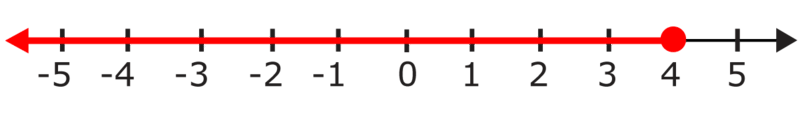

Example

Write an equivalent inequality for $x \ge 5$.

To write an equivalent inequality, we reverse the terms. If $x$ is greater than or equal to five, then five is less than or equal to $x$. Let’s rewrite this.

**The equivalent inequalities are $x \ge 5$** **_and_** **$5 \le x$.**

**7N. Lesson Exercises**

**Write an equivalent inequality for each example.**

1.  $12 \le y$
2.  $x>7$
3.  $a<4$

III. **Solve Inequalities and Graph Solutions**

Now that you have developed an understanding of inequalities, we can solve them and graph the solution sets.

We can solve an inequality using all of the skills we would use to solve an equation with only one exception: if we multiply or divide by a negative number, we need to switch the direction of the > or < symbol. Once we solve the inequality, we can graph the solution. Let’s look at an example.

Example

Solve this inequality and graph the solution: $n-4 \le 3$.

**Solve the inequality just as you would solve an equation, by using inverse operations. Since the 4 is subtracted from $n$, add 4 to both sides of the inequality to solve it.** You do not need to multiply or divide both sides by a negative number, so you do not need to reverse the inequality symbol. The symbol should stay the same.

$$
\begin{align*}
n-4 & \le 3\\
n-4 +4 & \le 3+4\\
n+(-4+4) & \le 7\\
n+0 & \le 7\\
n & \le 7
\end{align*}
$$

**Now, graph the solution.** The inequality $n \le 7$ is read as “$n$ is less than or equal to 7.” So, the solutions of this inequality include 7 and all numbers that are less than 7.

Draw a number line from 0 to 10. Add a closed circle at 7 to show that 7 is a solution for this inequality. Then draw an arrow showing all numbers less than 7.

Example

Solve this inequality and graph its solution: $-2n<14$.

**Solve this inequality as you would solve an equation, by using inverse operations. Since the -2 is multiplied by the $n$, divide both sides of the inequality by -2 to solve it.** Since this involves multiplying both sides of the inequality by a negative number, the sense of the inequality will change and you will need to reverse the inequality symbol. This means changing the inequality symbol from a “less than” symbol (&lt;) to a “greater than” symbol (&gt;).

$$
\begin{align*}
-2n & < 14\\
\frac{-2n}{-2} & > \frac{14}{-2}\\
1n & > -7\\
n & > -7
\end{align*}
$$

**Now, graph the solution.** The inequality $n>-7$ is read as “$n$ is greater than -7.” So, the solutions of this inequality include all numbers that are greater than -7.

Draw a number line from –10 to 0. Add an open circle at -7 to show that -7 is not a solution for this inequality. Then draw an arrow showing all numbers greater than -7.

Sometimes, you will need to take more than one step to solve an inequality. You can think of these problems in the same way that you thought about two-step equations.

Example

$\frac{n}{3}+9 \ge -9$.

**Solve this inequality as you would solve an equation, by using inverse operations. First, try to get the term with the variable, $\frac{n}{3}$, by itself on one side of the inequality. Since the 9 is being added to $\frac{n}{3}$, subtract 9 from both sides of the inequality.** You do not need to multiply or divide both sides by a negative number, so you do not need to reverse the inequality symbol during this step.

$$
\begin{align*}
\frac{n}{3}+9 & \ge -9\\
\frac{n}{3}+9-9 & \ge -9-9\\
\frac{n}{3}+0 & \ge (-9+-9)\\
\frac{n}{3} & \ge -18
\end{align*}
$$

**There is a second step you must take to find the solution. Since $n$ is divided by 3, you must multiply both sides of the inequality by 3 to find its solution.** This involves multiplying by a positive number, 3, so you do not need to reverse the inequality symbol. Be careful! It is true that you will need to multiply 3 by –18 to find the solution. However, since you are not multiplying both sides of the inequality by a negative number, you do not reverse the inequality symbol.

$$
\begin{align*}
\frac{n}{3} & \ge -18\\
\frac{n}{3} \times 3 & \ge -18 \times 3\\
\frac{n}{3} \times \frac{3}{1} & \ge -54\\
\frac{n}{\cancel{3}} \times \frac{\cancel{3}}{1} & \ge -54\\
\frac{n}{1} & \ge -54\\
n & \ge -54
\end{align*}
$$

**The solution for this inequality is $n \ge -54$.**

**7O. Lesson Exercises**

**Solve each inequality.**

1.  $x-4<10$
2.  $2y+4 \ge 12$
3.  $-4x \le 16$

IV. **Model and Solve Real-World Problems Involving Inequalities**

Now that you know how to graph and solve inequalities, let's take a look at some ways we can use inequalities to solve problems. We can use inequalities to represent some real-world problem situations, too.

Let's take a look at some key words that can help us write inequalities to represent real-world problems.

| **\>** | **<** | $\ge$ | $\le$ |
| --- | --- | --- | --- |
| greater than more than | less than fewer than | greater than or equal to at least | less than or equal to at most |

The key words above provide clues about which inequality symbol you should use to represent a problem situation. While key words can be a helpful guide, it is important not to rely on them totally. It is always most important to think about what translation of the problem makes the most sense. This is especially important because the same key words may mean different things. For example, the key words “more than” may mean you should use a > symbol or they may mean you should write an addition expression.

Antonio is buying milk for a breakfast event. Each container of milk costs $3. At most, he can spend $12 on milk for the event.

a. Write an inequality to represent, $c$, the number of containers of milk he can buy.

b. Could Antonio buy 4 containers of milk for the event? Explain.

**Consider part a first.**

Use a number, an operation sign, a variable, or an inequality symbol to represent each part of the problem. Since each container of milk costs $3, you can find the total cost, in dollars, of the milk he buys by multiplying 3 by the number of containers. The key words “at most” indicate that you should use a $\le$ symbol.

$$
\begin{align*}
& \underline{\text{Each container}\ldots \text{costs} \ \$3}. \ \underline{\text{At most}}, \ \text{he can spend} \ \underline{\$12}\ldots\\ 
& \qquad \qquad \qquad \quad \downarrow \qquad \qquad \qquad \downarrow \qquad \qquad \qquad \quad \quad \ \ \downarrow\\
& \qquad \qquad \quad \quad \ c \times 3 \qquad \qquad \quad \le \qquad \qquad \qquad \qquad  12
\end{align*}
$$

You may also want to consider that the value of $c$ must be an integer greater than or equal to 0. Think about why that is for a moment.

The reason that the value of $c$ must be an integer greater than or equal to zero is because Antonio cannot buy a negative number of containers nor can he buy a fraction of a container. Neither of those situations makes sense in real life. When using inequalities to represent real-life situations, you should always think about which values would make sense for the variable and which values would not make sense.

Next, consider part $b$.

Solve the inequality to help you.

$$
\begin{align*}
c \times 3 & \le 12\\
\frac{c \times 3}{3} & \le \frac{12}{3}\\
c \times \frac{3}{3} & \le 4\\
c \times 1 & \le 4\\
c & \le 4
\end{align*}
$$

According to the inequality above, the number of containers, $c$, that he can buy must be less than or equal to 4.

**Since 4 is a solution for this inequality, and since 4 is an integer that is greater than 0, he could buy 4 containers of milk.**

At the Stereo Store, Erika bought a $9 set of headphones and a DVD that was on sale for half its regular price. Erika spent more than $15 on these two purchases.

a. Write an inequality to represent $d$, the regular price of a DVD at the store.

b. List three possible values of $d$.

**Consider part a first.**

Use a number, an operation sign, a variable, or an inequality symbol to represent each part of the problem. The key words “more than”, in this case, indicate that you should use a > symbol.

$$
\begin{align*}
& \underline{\$9} \ \text{set of headphones} \ \underline{\text{and}} \ a \ DVD \ldots \text{for} \ \underline{\text{half the regular price}}\ldots \text{spent} \ \underline{\text{more than}} \ \underline{\$15} \ldots\\
& \ 9 \qquad \qquad \qquad \qquad \ \ + \qquad \qquad \qquad \qquad \qquad \quad \frac{d}{2} \qquad \qquad \qquad \qquad \quad \quad \ > \qquad 15
\end{align*}
$$

**Next, consider part $b$.**

Solve the inequality to help you.

$$
\begin{align*}
9+\frac{d}{2} & > 15\\
9-9+\frac{d}{2} & > 15-9\\
0+\frac{d}{2} & > 6\\
\frac{d}{2} & > 6\\
\frac{d}{2} \times 2 & > 6 \times 2\\
\frac{d}{\cancel{2}} \times \frac{\cancel{2}}{1} & > 12\\
\frac{d}{1} & > 12\\
d & > 12
\end{align*}
$$

According to the inequality above, the regular price of a DVD, $d$, is more than 12 dollars.

So, three possible values of $d$ are $12.50, $13, and $20. These are only 3 possible answers. **You could choose any amount that is greater than 12 dollars.**

**Now let’s go back to our introduction problem and help Tony with his dilemma on the train.**

Real Life Example Completed
---------------------------

**_The Movie Tickets_**

Marc and Kara have made several friends while swimming at the town pool. One rainy day, they decide to invite the group to go to a movie. Everyone is very excited. Grandma is so pleased that Kara and Marc have been making friends that she offers to treat.

“How many of you are going?” she asks Kara.

“Well, there are eight of us altogether,” Kara replies.

“Alright, let me see,” Grandma says, reaching into her wallet. “I have forty-eight dollars to contribute. Here it is.”

“Thank you Grandma,” the twins say, smiling.

Later at the movie theater, Kara takes out the money. They have $48.00 to spend on tickets. Last minute, one of the friends has brought her brother along. Kara isn’t sure that they have enough money for the brother too. If each ticket is $6.00, how many tickets can she buy without going over the $48.00?

**To figure this out, we need to write an inequality. The original group consisted of 8 kids without the extra brother. Each ticket is $6.00. We can use this in our inequality. If we have money left over, then we will know whether or not we can pay for the brother too.**

**We need the total to be less than or equal to $48.00.**

**Here is the inequality.**

$6x \le 48$

**Now we can solve the inequality. The $x$ represents the number of tickets that we can purchase if they are $6.00 each.**

$$
\begin{align*}
6x & \le 48\\
\frac{6x}{6} & \le 48\\
x & \le 8
\end{align*}
$$

**This shows that the kids can purchase less than or equal to 8 tickets with the $48.00. They don’t have enough to pay for the brother too.**

**Kara tells the group this information and they all chip in with their own money. All of the kids are able to attend the movie thanks to the generosity of the group.**

Vocabulary
----------

Here are the vocabulary words that are found in this lesson.

__Equation__

a number sentence with an equal sign where the quantity on one side of the equals is the same as the quantity on the other side of the equals.

__Inequality__

a number sentence where one side is not necessarily equal to the other side. There are several possible answers that will make an inequality a true statement.

__Equivalent Inequalities__

Two inequalities that are written differently, but still express the same number relationships.

Technology Integration
----------------------

!?[0](https://www.youtube.com/watch?v=dTwZ5N126gw)

[Khan Academy Inequalities on a Number Line](http://www.youtube.com/watch?v=dTwZ5N126gw)

!?[0](https://www.youtube.com/watch?v=y7QLay8wrW8)

[Khan Academy Solving Inequalities](http://www.youtube.com/watch?v=y7QLay8wrW8)

!?[0](https://www.youtube.com/watch?v=U4Soj7MhSfk)

[James Sousa, Solving One-Step Linear Inequalities in One Variable](http://www.youtube.com/watch?v=U4Soj7MhSfk)

!?[0](https://www.youtube.com/watch?v=X0xrHKgbDT0)

[James Sousa, Graph Basic Inequalities and Express Using Interval Notation](http://www.youtube.com/watch?v=X0xrHKgbDT0)

!?[0](https://www.youtube.com/watch?v=1Z22Xh66VFM)

[James Sousa, Example of Solving One Step Inequalities by Adding and Subtracting](http://www.youtube.com/watch?v=1Z22Xh66VFM)

!?[0](https://www.youtube.com/watch?v=IajiD3R7U-0)

[James Sousa, Example of Solving One Step Inequalities by Division](http://www.youtube.com/watch?v=IajiD3R7U-0)

!?[0](https://www.youtube.com/watch?v=mBHQB5XlSks)

[James Sousa, Example of Solving One Step Inequalities by Multiplication](http://www.youtube.com/watch?v=mBHQB5XlSks)

Other Videos:

1.  http://www.mathplayground.com/howto_InequalitiesA.html – This is a video that explains how you can solve an inequality.

Time to Practice
----------------

Directions: For problems 1-4, graph each inequality on the given number line.

1. $x < -3$

5. $x + 3 > 9$

 \ge 2$")

7. $x+4<10$

8. $x-3 \ge 7$

9. $b+5 \le 15$

10. $a-7 \ge 14$

11. $4y>20$

12. $6x \le 18$

13. $-4y< -12$

14. $-5x< -20$

15. $\frac{x}{2}=10$

16. $\frac{x}{5} \le 6$

17. $2x+5 \ge 7$

18. $3y-2 \le 4$

19. $3a-7>11$

20. $2b+9<39$

Directions: Solve each problem.

21. Emma bought a fruit smoothie at a juice shop for $t$ dollars, including tax. Emma paid with a $10 bill. She received less than $5 in change.

a. Write an inequality to represent $t$, the number of dollars, including tax, that Emma paid for the fruit smoothie.

b. List three possible values of $t$.

22. Kiet has 16 juice boxes for a family picnic and needs to buy more. Juice boxes are sold in packages of 8.

a. Write an inequality to represent $p$, the number of packages of juice boxes Kiet needs to buy in order to have at least 40 juice boxes total for the picnic.

b. If Kiet buys 4 packages of juice boxes, will that be enough?

</article>

### 7.7 Functions

<article>

Introduction
------------

**_A Day at the Amusement Park_**

At the amusement park, different rides take a different number of tickets. Kara and Marc figure out that there are 9 rides that they would like to ride. These are their favorites and any others are just a bonus. Most often the teens will need three tickets for each ride. Each ride is a function of the number of tickets needed. Marc and Kara go up to the ticket booth and come back with 21 tickets each. If they each have 21 tickets, how many rides can they go on for those tickets?

**Because each ride is a function of the number of tickets, you will need to know about functions to figure out this problem. Pay attention to this lesson and at the end you will be able to help with the day at the amusement park.**

**_What You Will Learn_**

In this lesson, you will learn to demonstrate the following skills:

* Identify the domain and range of a simple linear function.
* Evaluate a given function rule using an input-output table.
* Write a function rule from an input-output table.
* Model and solve real-world problems involving patterns of change.

**_Teaching Time_**

I. **Identify the Domain and Rangle of a Simple Linear Function**

We use the word “function” all the time in everyday speech. We say things like “It’s a function of time” or “It’s a function of price.” This is a real life application of a mathematical concept called a function. You will learn how to apply functions to real-world examples, but first let’s look at what a function is and how we can understand it better.

**What is a function?**

**A** **_function_** **is a set of ordered pairs in which the first element in any pair corresponds to exactly one second element.**

For example, look at this set of ordered pairs. Notice that braces, {}, are used to surround the set of ordered pairs.

$$
\begin{align*}
& \{ (0, 5), (\underline{1}, \underline{6}), (2, 7), (3, 8)\}\\
& \quad \ \ \qquad \uparrow \uparrow
\end{align*}
$$

In (1, 6), 1 is the first element and

6 is the second element.

**Each of the first elements––0, 1, 2, and 3––corresponds to exactly one second element. So, this set of ordered pairs represents a function.**

Let's take a look at another set of ordered pairs.

$$
\begin{align*}
& \{ (\underline{2}, 4), (5, 3), (6, 7), (\underline{2}, 8)\}\\
& \ \ \Box \qquad \qquad \qquad \quad \ \Box
\end{align*}
$$

The first element, 2, corresponds

to two different second elements––4 and 8.

**Since one of the first elements corresponds to two different second elements, the set of ordered pairs above does not represent a function.**

**We can use these criteria to determine whether or not a series of ordered pairs forms a function.**

**Now that you know how to identify a function, let’s look at some of the key words associated with functions.**

1.  **Domain**
2.  **Range**

The **_domain_** of a function is the set of all the first elements in a function. The **_range_** is the set of all the second elements in a function.

Let’s look at an example and identify the domain and range of the series of ordered pairs.

Example

The ordered pairs below represent a function

{(0, -10), (2, -8), (4, -6), (6, -4)}

a. Identify the domain of the function.

b. Identify the range of the function.

**Consider part $a$ first.**

The domain is the set of all the first elements in the function. These first elements are underlined below.

$\{ (\underline{0}, -10), (\underline{2}, -8), (\underline{4}, -6), (\underline{6}, -4)\}$

**The domain of this function is {0, 2, 4, 6}.**

**Next, consider part $b$.**

The range is the set of all the second elements in the function. These second elements are underlined below.

$\{ (0, \underline{-10}), (2, \underline{-8}), (4, \underline{-6}), (6, \underline{-4})\}$

**The range of this function is {-10, -8, -6, -4}.**

**7P. Lesson Exercises**

**Identify the domain and range of each function.**

1.  **(1, 3) (2, 4) (5, 7) (9, 11)**
2.  **(8, 12) (9, 22) (4, 7) (2, 5)**

There are different ways to show a function. Ordered pairs are one way to illustrate a function. Let’s look at another way.

II. **Evaluate a Given Function Rule Using an Input-Output Table**

An **_input-output table_**, like the one shown below, can also be used to represent a function. Because of that, we can also call this kind of a table a _function table._

| **Input number $(x)$** | **Output number $(y)$** |
| --- | --- |
| 0   | 0   |
| 1   | 3   |
| 2   | 6   |
| 3   | 9   |

Each pair of numbers in the table is related by the same **_function rule_**. That rule is: multiply each input number ($x-$value) by 3 to find each output number ($y-$value). You can use a rule like this to find other values for this function, too.

Now let’s look at how we can use a function rule to complete a table.

Example

The rule for the input-output table below is: add 1.5 to each input number to find its corresponding output number. Use this rule to find the corresponding output numbers for the given input numbers in the table.

| **Input number $(x)$** | **Output number $(y)$** |
| --- | --- |
| 0   |     |
| 1   |     |
| 2.5 |     |
| 5   |     |
| 10  |     |

To find each missing output number, add 1.5 to each input number. Then write that output number in the table.

| **Input number $(x)$** | **Output number $(y)$** |     |
| --- | --- | --- |
| 0   | 1.5 | $\leftarrow 0+1.5=1.5$ |
| 1   | 2.5 | $\leftarrow 1.0+1.5=2.5$ |
| 2.5 | 4   | $\leftarrow 2.5+1.5=4.0$ |
| 5   | 6.5 | $\leftarrow 5.0+1.5=6.5$ |
| 10  | 11.5 | $\leftarrow 10.0+1.5=11.5$ |

The table above shows five ordered pairs that match the given function rule. Let’s write the answer in ordered pairs.

**The answer is (0, 1.5) (1, 2.5) (2.5, 4) (5, 6.5) (10, 11.5).**

**Now let’s look at how to create a function table given a rule.**

Example

The rule for a function is: multiply each $x-$value by 4 and then subtract 2 to find each $y-$value. Make a function table that shows three ordered pairs of values for a function that follows this rule.

**First, choose three $x-$values for the table. You may choose any numbers, but let's select some small numbers that will be easy to work with, such as 1, 2, and 3. Then, to find the $y-$values, multiply each of those values by 4 and subtract 2 from that product.**

| $x$ | $y$ |     |
| --- | --- | --- |
| 1   | 2   | $\leftarrow 1 \times 4=4$  $4-2=2$ |
| 2   | 6   | $\leftarrow 2 \times 4=8$  $8-2=6$ |
| 3   | 10  | $\leftarrow 3 \times 4=12$  $12-2=10$ |

The table above shows five ordered pairs that match the given function rule.

**The answer is (1, 2) (2, 6) (3, 10).**

**We can also write a function rule in the form of an equation. Just like an equation shows the relationship between values, the function table does too. Let’s look at an example.**

Example

_The equation $y=\frac{x}{3}+1$ describes a function. Use this rule to find the missing values in the table below._

| $x$ | $y$ |
| --- | --- |
| 0   | 1   |
| 3   | 2   |
| 9   |     |
|     | 8   |

**The table requires you to find the value of $y$ when $x = 9$. To find the missing $y-$value, substitute the given $x-$value, 9, for $x$ into the equation. Then solve for $y$.**

$$
\begin{align*}
y &= \frac{x}{3}+1\\
y &= \frac{9}{3}+1\\
y &= 3+1\\
y &= 4
\end{align*}
$$

**So, when $x = 9, y = 4$. This means that (9, 4) is an ordered pair for this function.**

**The table also requires you to find the value of $x$ when $y = 8$. To find the missing $x-$value, substitute the given $y-$value, 8, into the equation. Then solve for $x$ as you would solve any two-step equation.**

$$
\begin{align*}
y &= \frac{x}{3}+1\\
8 &= \frac{x}{3}+1\\
8-1 &= \frac{x}{3}+1-1\\
7 &= \frac{x}{3}+0\\
7 &= \frac{x}{3}\\
\\
7 \times 3 &= \frac{x}{3} \times 3\\
21 &= \frac{x}{\cancel{3}} \times \frac{\cancel{3}}{1}\\
21 &= \frac{x}{1}=x
\end{align*}
$$

**So, when $y = 8, x = 21$. This means that (21, 8) is an ordered pair for this function.**

The completed table will look like this.

| $x$ | $y$ |
| --- | --- |
| 0   | 1   |
| 3   | 2   |
| 9   | 4   |
| 21  | 8   |

**You could say that an equation is another way of writing a function rule.**

**7Q. Lesson Exercises**

**1. Complete the table given the rule "add 2". Write the answer in ordered pairs.**

| **Input $(x)$** | **Output $(y)$** |
| --- | --- |
| **3** |     |
| **5** |     |
| **6** |     |

**2. Create a function table given the rule $x \ 2 + 3$ (input times two, plus three). Use three values.**

III. **Write a Function Rule From an Input-Output Table**

Up until now, you have been given a function rule or an equation. Now it is time to use those detective skills and figure out the rule from a given table.

**One strategy that might be helpful in this task is to use guess and check to figure out the relationship between the values in the domain and the values in the range. Remember the $x$ values are the domain and the $y$ values are the range.**

Example

_Identify the rule for this input-output table. Describe the rule in words._

| **Input number $(x)$** | **Output number $(y)$** |
| --- | --- |
| 10  | 1   |
| 20  | 2   |
| 30  | 3   |
| 40  | 4   |

Use guess and check to determine how to each pair of values is related.

**First, notice that each output number ($y-$value) is less than its corresponding input number ($x-$value). There are two operations that help numbers become smaller. So, the rule will involve either subtraction or division.**

Look for a subtraction rule first.

Consider the ordered pair (10, 1).

$10-1=9$, so the rule could be to subtract 9 from each input number to find the corresponding output number. Check to see if that rule works for the other pairs of values in the table.

Consider the ordered pair (20, 2).

$20-1=19$, not 2, so that rule does not work all the pairs of values in the table.

Look for a division rule next.

Consider the ordered pair (10, 1) again.

$10 \div 10=1$, so the rule could be to divide each input number by 10 to find the corresponding output number. Check to see if that rule works for the other pairs of values in the table.

Consider the ordered pair (20, 2).

$20 \div 10=2$, so the rule works for that ordered pair.

Consider the ordered pair (30, 3).

$30 \div 10=3$, so the rule works for that ordered pair.

Consider the ordered pair (40, 4).

$40 \div 10=4$, so the rule works for that ordered pair.

**The rule for this function table is to divide each input number ($x-$value) by 10 to find its corresponding output number ($y-$value).**

In this example, we wrote the function rule in words. We can also use an equation to express a function rule. Think about this past example.

The rule was “Divide each $x$ value by 10 and that will give you the $y$ value.”

We could write $\frac{x}{10}=y$.

**This would have been the same rule expressed as an equation.**

Let’s look at another example where we will write an equation to represent a function rule.

Example

Identify the rule for this function table. Describe the rule in words. Then write an equation to represent the relationship between the pairs of values in the table.

| $x$ | $y$ |
| --- | --- |
| 1   | 5   |
| 2   | 10  |
| 3   | 15  |
| 4   | 20  |

Use guess and check to determine how each pair of values is related.

**For example, notice that each $y-$value is greater than its corresponding $x-$value. So, the rule will involve either addition or multiplication.**

Look for an addition rule first.

Consider the ordered pair (1, 5).

$1+4=5$, so the rule could be to add 4 to each $x-$value to find the corresponding y-value. Check to see if that rule works for the other pairs of values in the table.

Consider the ordered pair (2, 10).

$2+5=7$, not 10, so that rule does not work all the pairs of values in the table.

Look for a multiplication rule next. Each $y-$value in the table is 5 more than the previous $y-$value, so the rule may involve multiplying by 5.

Consider the ordered pair (1, 5).

$1 \times 5=5$, so the rule could be to multiply each $x-$value by 5 to find the corresponding $y-$value. Check to see if that rule works for the other pairs of values in the table.

Consider the ordered pair (2, 10).

$2 \times 5=10$, so the rule works for that ordered pair.

Consider the ordered pair (3, 15).

$3 \times 5=15$, so the rule works for that ordered pair.

Consider the ordered pair (4, 20).

$4 \times 5=20$, so the rule works for that ordered pair.

**The rule for this function table is "multiply each $x-$value by 5 to find its corresponding $y-$value".**

**Now that we have a rule in words, let's write an equation to show the same relationship. Remember, to find each $y-$value, you must multiply each $x-$value by 5. So, the equation would be:**

$y=x \cdot 5$ **or** $y=5x$.

One thing to consider is that sometimes, a function rule will involve more than one step. In other words, it will have two operations in it, not just one.

Example

Identify the rule for this function table. Describe the rule in words. Then write an equation to represent that rule.

| $x$ | $y$ |
| --- | --- |
| 1   | 6   |
| 2   | 11  |
| 3   | 16  |
| 4   | 21  |

Use guess and check to determine how to each pair of values is related.

**For example, notice that each $y-$value is greater than its corresponding $x-$value. So, the rule will involve either addition or multiplication.**

**Since each $y-$value in the table is 5 more than the previous $y-$value, the rule may involve multiplying by 5.**

**Look for a two-step rule that involves multiplying by 5.**

Consider the ordered pair (1, 6).

$1 \times 5=5$ and $5+1=6$, so the rule could be to multiply each input number by 5 and then to add 1 to find each $y-$value. Check to see if that rule works for the other pairs of values in the table.

Consider the ordered pair (2, 11).

$2 \times 5=10$ and $10+1=11$, so the rule works for that ordered pair.

Consider the ordered pair (3, 16).

$3 \times 5=15$ and $15+1=16$, so the rule works for that ordered pair.

Consider the ordered pair (4, 21).

$4 \times 5=20$ and $20+1=21$, so the rule works for that ordered pair.

**The rule for this function table is to multiply each $x-$value by 5 and then add 1 to find its corresponding $y-$value.**

**Now that we have a rule in words, let's write an equation to show the same relationship.** Remember, to find each $y-$value, we must multiply each $x-$value by 5 and then add 1. So, the equation would be

$y=5x+1$

**7R. Lesson Exercises**

**Look at each function table and write each rule as an equation.**

1.

| $x$ | $y$ |
| --- | --- |
| **5** | **10** |
| **7** | **14** |
| **9** | **18** |

2.

| $x$ | $y$ |
| --- | --- |
| **3** | **5** |
| **4** | **7** |
| **6** | **11** |

3.

| $x$ | $y$ |
| --- | --- |
| **2** | **1** |
| **4** | **3** |
| **6** | **5** |

IV. **Model and Solve Real-World Problems Involving Patterns of Change**

Functions can also help us describe real-world situations and solve real-world problems.

The number of quarters needed to wash clothes in a washing machine at a laundromat is a function of the number of loads of laundry that need to be washed. This table shows the number of quarters needed to wash 1, 2, and 3 loads of laundry.

| **Number of Loads $(x)$** | **Number of Quarters $(y)$** |
| --- | --- |
| 1   | 4   |
| 2   | 8   |
| 3   | 12  |
| 4   | ?   |
| 5   | ?   |

a. Write an equation to describe the relationship between the pairs of values in the table above.

b. How many quarters are needed to wash 5 loads of laundry?

**Consider part $a$ first.**

Use guess and check to determine how to each pair of values is related.

**For example, notice that each $y-$value is greater than its corresponding $x-$value. So, the rule will involve either addition or multiplication.**

Since each $y-$value in the table is 4 more than its corresponding $y-$value, the rule may involve multiplying by 4.

Look for a rule that involves multiplying by 4.

Consider the ordered pair (1, 4).

$1 \times 4=4$, so the rule could be to multiply each $x-$value (or number of loads) by 4 to find each $y-$value (or number of quarters). Check to see if that rule works for the other pairs of values in the table.

Consider the ordered pair (2, 8).

$2 \times 4=8$, so the rule works for that ordered pair.

Consider the ordered pair (3, 12).

$3 \times 4=12$, so the rule works for that ordered pair.

**So, the rule for this function table could be to multiply each $x-$value by 4 to find its corresponding $y-$value. We could also say that the rule is to multiply the number of loads of laundry by 4 to find the number of quarters needed.**

Now that we have our rule written out in words, let’s write an equation that expresses the same thing.

**Remember, to find each $y-$value, you must multiply each $x-$value by 4. So, the equation would be**

$y=4x$

**Next, use the equation you wrote for part $a$ to solve part $b$.**

Part $b$ asks how many quarters are needed to wash 5 loads of laundry. Substitute 5 for $x$ in the equation.

$$
\begin{align*}
y &= 4x\\
y &= 4 \cdot 5\\
y &= 20
\end{align*}
$$

**20 quarters would be needed to wash 5 loads of laundry.**

**Now we can go back to the problem in the introduction and help with the amusement park tickets.**

Real Life Example Completed
---------------------------

**_A Day at the Amusement Park_**

The month has flown by and in two days Marc and Kara will head home. They have had a terrific time in Boston and while they are happy to be heading home, they are also sad to leave. For a final trip, Grandma and Grandpa decide to go to the amusement park. Everyone is excited.

At the amusement park, different rides take a different number of tickets. Kara and Marc figure out that there are 9 rides that they would like to ride. These are their favorites and any others are just a bonus. Most often the teens will need three tickets for each ride. Each ride is a function of the number of tickets needed. Marc and Kara go up to the ticket booth and come back with 21 tickets each. If they each have 21 tickets, how many rides can they go on for those tickets?

**The first thing to note is that each ride is a function of the number of tickets needed. We can call the ride $x$ and the ticket number $y$.**

**You know from this lesson that one of the best ways to work with a function is through a function table. Let’s build one now.**

| **_$x$ Rides_** | **_$y$ Tickets_** |
| --- | --- |

**We can say that 1 ride is equal to 3 tickets. Let’s choose some other ride numbers and work our way up to 21 tickets.**

| **_$x$ Rides_** | **_$y$ Tickets_** |
| --- | --- |
| **1** | **3** |
| **2** | **6** |
| **3** | **9** |
|     | **21** |

**Look at the pattern. We can write an equation to show this pattern.**

$y=3x$

**We want to figure out how many rides the teens can go on for 21 tickets. 21 is the $y$ in the equation. We can use what we have learned about solving equations to solve for $x$. This will give us the number of rides they can go on for 21 tickets.**

$$
\begin{align*}
21 &= 3x\\ 
7 &= x
\end{align*}
$$

| **_$x$ Rides_** | **_$y$ Tickets_** |
| --- | --- |
| **1** | **3** |
| **2** | **6** |
| **3** | **9** |
| **7** | **21** |

**The teens can go on 7 rides each for the 21 tickets. To ride all nine rides, they will need six more tickets each.**

Vocabulary
----------

Here are the vocabulary words that are found in this lesson.

__Function__

A set of ordered pairs in which one element corresponds to exactly one other element. Functions might be expressed as a set of ordered pairs or in a table.

__Domain__

the $x$ value of an ordered pair or the $x$ values in a set of ordered pairs.

__Range__

the $y$ value of an ordered pair or the $y$ values in a set of ordered pairs.

__Input-Output Table__

a way of showing a function using a table where the $x$ value is shown to cause the $y$ value through a function rule.

__Function Table__

another name for an input-output table.

__Function Rule__

a written equation that shows how the domain and range of a function are related through operations.

Technology Integration
----------------------

!?[0](https://www.youtube.com/watch?v=VhokQhjl5t0)

[Khan Academy Functions](http://www.youtube.com/watch?v=VhokQhjl5t0)

!?[0](https://www.youtube.com/watch?v=vO5qqfsWzhc)

[James Sousa, Introduction to Functions, Part 1](http://www.youtube.com/watch?v=vO5qqfsWzhc)

!?[0](https://www.youtube.com/watch?v=sW9-zBeQpCU)

[James Sousa, Introduction to Functions, Part 2](http://www.youtube.com/watch?v=sW9-zBeQpCU)

!?[0](https://www.youtube.com/watch?v=kdqSy31-Fqw)

[James Sousa, Write a Cost Function and Complete a Table of Values](http://www.youtube.com/watch?v=kdqSy31-Fqw)

!?[0](https://www.youtube.com/watch?v=DVEbAla0AlU)

[James Sousa, Complete a Table of Values Given a Function Rule](http://www.youtube.com/watch?v=DVEbAla0AlU)

!?[0](https://www.youtube.com/watch?v=ykNdYdulX3Q)

[James Sousa, Write a Function Rule Given a Table of Values](http://www.youtube.com/watch?v=ykNdYdulX3Q)

!?[0](https://www.youtube.com/watch?v=4SF98TzUDEg)

[James Sousa, Another Example of How to Write a Function Rule Given a Table of Values](http://www.youtube.com/watch?v=4SF98TzUDEg)

!?[0](https://www.youtube.com/watch?v=SjR_yUAYCmY)

[James Sousa, A Third Example of How to Write a Function Rule Given a Table of Values](http://www.youtube.com/watch?v=SjR_yUAYCmY)

Time to Practice
----------------

Directions: Identify whether or not each series of ordered pairs forms a function.

1. (1, 3)(2, 6)(2, 5) (3, 7)

2. (2, 5) (3, 6) (4, 7) (5, 8)

3. (6, 1) (7, 2) (8, 3)

4. (5, 2) (5, 3) (5, 4) (5, 5)

5. (81, 19)(75, 18) (76, 18) (77, 19)

Directions: Identify the domain in numbers 1 – 5.

6.

7.

8.

9.

10.

Directions: Identify the range in numbers 1 – 5.

11.

12.

13.

14.

15.

Directions: Use the given rule or equation to complete the table.

16. The rule for the input-output below table is: multiply each input number by 7 and then add 2 to find each output number. Use this rule to find the corresponding output numbers for the given input numbers in the table. Fill in the table with those numbers.

| **Input number $(x)$** | **Output number $(y)$** |
| --- | --- |
| 0   |     |
| 1   |     |
| 2   |     |
| 3   |     |
| 4   |     |

17. The rule for this function table is: subtract 6 from each $x-$value to find each $y-$value. Use this rule to find the missing numbers in the table. Fill in the table with those numbers.

| $x$ | $y$ |
| --- | --- |
| 0   |     |
| 6   |     |
|     | 7   |
|     | 16  |

18. The equation $y=\frac{x}{2}-1$ describes a function. Use this rule to find the missing values in the table below.

| $x$ | $y$ |
| --- | --- |
| 2   | 0   |
| 4   | 1   |
| 8   |     |
|     | 6   |

Directions: Determine the rule for each table. Use that rule to answer the questions.

19. Identify the rule for this input-output table. Describe the rule in words.

| **Input number $(x)$** | **Output number $(y)$** |
| --- | --- |
| 1   | 3   |
| 2   | 4   |
| 3   | 5   |
| 4   | 6   |

20. Identify the rule for this function table.

| $x$ | $y$ |
| --- | --- |
| 1   | 2   |
| 2   | 4   |
| 3   | 6   |
| 4   | 8   |

a. Describe the rule in words.

b. Write an equation to represent the rule.

21. Identify the rule for this function table.

| $x$ | $y$ |
| --- | --- |
| 1   | 3   |
| 2   | 5   |
| 3   | 7   |
| 4   | 9   |

a. Describe the rule in words.

b. Write an equation to represent the rule.

Directions: Solve each problem.

22. The total number of cupcakes Shakir can bake, $y$, is a function of the number of batches of cupcake batter he makes, $x$. This table shows the total number of cupcakes Shakir will bake if he makes 1, 2 or 3 batches of cupcake batter.

| **Number of Batches of Batter $(x)$** | **Total Number of Cupcakes Baked $(y)$** |
| --- | --- |
| 1   | 12  |
| 2   | 24  |
| 3   | 36  |
| 4   | ?   |
| 5   | ?   |

a. Write a rule in words to describe the relationship between the pairs of values in the table above.

b. Write an equation to describe the relationship between the pairs of values in the table above.

c. What is the total number of cupcakes that Shakir will bake if he makes 5 batches of batter?

23. For a concert in the auditorium, Ms. Walsh set up 10 chairs on the stage for the performers and 20 chairs in each row for the audience. This equation shows the relationship between $r$, the number of rows of chairs Ms. Walsh set up and $t$, the total number of chairs set up in the auditorium:

$t=10+20r$.

a. Create a table to show the total number of chairs that would be set up in the auditorium if Ms. Walsh set up 0, 1, 2, 3, or 4 rows of chairs.

b. Identify the domain for the ordered pairs in the table.

c. Explain why the domain shown in the table is a reasonable domain for this function and why including a number less than 0 would not be reasonable.

</article>

### 7.8 Graphing Functions

<article>

Introduction
------------

**_Picturing Tickets and Rides_**

Think about the table from the last section. We can use this data to create a visual display of the information. This information is not necessary for Marc and Kara to have a great time at the amusement park, but let’s say that you were someone who worked at the amusement park and you were trying to figure out how to organize packs of tickets for people to purchase. If you wanted to create a group of tickets to sell, then you could figure out how many rides someone could go on for the number of tickets in the booklet.

If the person decided to go on two rides, they would need 6 tickets. If the person decided to go on 4 rides, they would need 12 tickets. You can see how the number of tickets needed is a function of the number of rides desired. Using this chart can help the managers and the amusement park design new booklets of tickets.

| **_$x$ Rides_** | **_$y$ Tickets_** |
| --- | --- |
| **1** | **3** |
| **2** | **6** |
| **3** | **9** |
| **4** | **12** |
| **7** | **21** |

We can create a visual display of this data. How do we do this?

**This is where graphing functions is important. A graph of a function can show the relationship between the $x$ value and the $y$ value. In this lesson you will learn about graphs. We will come back to this problem at the end of the lesson.**

What You Will Learn

By the end of this lesson you will be able to complete the following:

* Graph linear functions in the coordinate plane.
* Write and graph linear functions given a verbal model.
* Distinguish between linear and nonlinear functions.
* Model and solve real-world problems involving patterns of change with multiple representations of functions.

**_Teaching Time_**

I. **Graph Linear Functions in the Coordinate Plane**

**Remember what a function is?**

**A** **_function_** **is a set of ordered pairs where one element in the domain is paired with exactly one element in the range.** There is a relationship identified with a **_function rule_** between the values in the domain and the values in the range.

In this lesson, we will begin by focusing on a specific type of function called a **_linear function_**. You may notice that the word “line” is part of the word “linear”. That fact can help you remember that **when a linear function is graphed on a coordinate plane, its graph will be a straight line.**

You have already learned how to represent functions through a set of ordered pairs and through a table. We can also take information given as a set of ordered pairs or in a table and represent that data as a function in a graph.

**How do we graph a linear function?**

Let’s look at a table of values and see how we can represent the function on a coordinate grid.

Example

On a coordinate plane, graph the linear function that is represented by the ordered pairs in the table below.

| $x$ | $y$ |
| --- | --- |
| \-4 | 5   |
| \-2 | 3   |
| 0   | 1   |
| 2   | \-1 |
| 4   | \-3 |

The ordered pairs shown in the table are (–4, 5), (–2, 3), (0, 1), (2, –1) and (4, –3).

Plot those five points on the coordinate plane. Then connect them as shown below.

You can also graph a linear function if you are given an equation that represents the function. This will involve a few more steps. When you have an equation, you can use the equation to create a function table. Then plot several of the ordered pairs in the table and connect them with a line.

Example

The equation $y=2x-1$ represents a linear function. Graph that function on a coordinate plane.

**First, use the equation to create a function table and find several ordered pairs for the function.** It is a good idea to use some negative $x-$values, some positive $x-$values and 0. For example, you can create a table to find the values of $y$ when $x$ is equal to –2, –1, 0, 1, and 2. You may need to use what you know about computing with integers to help you find those $y-$values.

| $x$ | $y$ |     |
| --- | --- | --- |
| \-2 | \-5 | $\leftarrow 2x-1=2(-2)-1=-4-1=-4+(-1)=-5$ |
| \-1 | \-3 | $\leftarrow 2x-1=2(-1)-1=-2-1=-2+(-1)=-3$ |
| 0   | \-1 | $\leftarrow 2x-1=2(0)-1=0-1=0+(-1)=-1$ |
| 1   | 1   | $\leftarrow 2x-1=2(1)-1=2-1=1$ |
| 2   | 3   | $\leftarrow 2x-1=2(2)-1=4-1=3$ |

The ordered pairs shown in the table are (–2, –5), (–1, –3), (0, –1), (1, 1) and (2, 3). This is the first way to show a function by using a table.

**Plot those five points on the coordinate plane. Then connect them as shown below.**

II. **Write and Graph Linear Functions Given a Verbal Model**

We can write an equation or create a graph to represent a function if we know its rule. We can say that the writing of a rule is a verbal model. It is a function expressed in words. The values of the function might change, but the pattern of the function does not because it is represented in words.

Let's see how knowing the rule for a function can help us represent that function in two different ways––as an equation and as a graph.

Example

The rule for a linear function is: subtract 3 from each $x-$value to find each $y-$value.

a. Write an equation to represent this linear function.

b. Graph the function.

**Consider part $a$ first.**

According to the rule, to find each $y-$value, you must subtract 3 from each $x-$value. So, the equation would be:

$y=x-3$.

**Next, consider how to graph the function for part $b$.**

Now that you have an equation for the function, use that equation to create a table of values.

| $x$ | $y$ |     |
| --- | --- | --- |
| \-2 | \-5 | $x-3=-2-3=-2+(-3)=-5$ |
| \-1 | \-4 | $x-3=-1-3=-1+(-3)=-4$ |
| 0   | \-3 | $x-3=0-3=0+(-3)=-3$ |
| 1   | \-2 | $x-3=1-3=1+(-3)=-2$ |
| 2   | \-1 | $x-3=2-3=2+(-3)=-1$ |

The ordered pairs shown in the table are (–2, –5), (–1, –4), (0, –3), (1, –2), and (2, –1).

Plot those five points on the coordinate plane. Then connect them with a straight line as shown below.

III. **Distinguish Between Linear and Non-Linear Functions**

Up until this point, you have only been working with linear functions. Remember that a **_linear function_** will form a straight line when the values of the domain and the range are graphed on a coordinate grid. We can also have **_non-linear functions_**. The values of a non-linear function do not form a straight line when they are graphed on a coordinate grid.

**How do we distinguish between a linear and a non-linear function?**

One of the easiest ways is to look at the graphs of the functions. Look at the two graphs below and you will see the difference between the two functions.

A nonlinear function does not have to look exactly like the function graphed above. Any function whose graph is not a straight line is a nonlinear function.

Example

The equation $y=x^2$ represents a function.

a. Graph that function on a coordinate plane.

b. Is the function linear or nonlinear?

**First, consider part $a$.**

**Then use the equation to create a function table and find several ordered pairs for the function. Then you will be able to use the ordered pairs to graph the function.**

You will need to use what you know about computing with integers and what you know about evaluating exponents to create the table.

| $x$ | $y$ |     |
| --- | --- | --- |
| \-2 | 4   | $\leftarrow y=x^2=(-2)^2=(-2) \cdot (-2)=4$ |
| \-1 | 1   | $\leftarrow y=x^2=(-1)^2=(-1) \cdot (-1)=1$ |
| 0   | 0   | $\lnot \ y=x^2=(0)^2=0 \times 0=0$ |
| 1   | 1   | $\lnot \ y=x^2=(1)^2=1 \times 1=1$ |
| 2   | 4   | $\lnot \ y=x^2=(2)^2=2 \times 2=4$ |

The ordered pairs shown in the table are (–2, 4), (–1, 1), (0, 0), (1, 1) and (2, 4).

Plot those five points on the coordinate plane. Then connect them. Notice that you cannot connect these points with a straight line. You will need to draw a curved line to connect them.

**Look at the function you graphed. The graph is curved. Since the graph is not a straight line, the equation $y=x^2$ represents a nonlinear function.**

Now, let's turn our attention back to linear functions. Specifically, let's explore how we can use a linear function to represent a function whose rule is described in words.

IV. **Model and Solve Real-World Problems Involving Patterns of Change with Multiple Representations of Functions**

Linear functions can also allow us to represent real-world situations. Specifically, linear functions can help us understand situations in which two pairs of values are related by a rule.

Remember, we can represent the problem with a function table, an equation, or a graph. Representing a problem in more than one way can sometimes help us understand how to solve it.

This table shows how the total cost of buying tomatoes at the farmer's market changes depending on the number of pounds of tomatoes purchased.

| **Number of Pounds Purchased $(x)$** | **Total Cost in Dollars $(y)$** |
| --- | --- |
| 1   | 2   |
| 2   | 4   |
| 3   | 6   |
| 4   | ?   |
| 5   | ?   |

a. Write an equation to describe the relationship between the pairs of values in the table above.

b. Create a graph to represent the relationship between the number of pounds of tomatoes purchased, $x$, and the total cost, $y$.

c. Determine the cost of buying 5 pounds of tomatoes at the farmer's market.

**Consider part $a$ first.**

Use guess and check to determine how to each pair of values is related.

**For example, notice that each $y-$value is greater than its corresponding $x-$value. So, the rule will involve either addition or multiplication.**

Since each $y-$value in the table is 2 more than its previous $y-$value, the rule may involve multiplying by 2.

Look for a rule that involves multiplying by 2.

Consider the ordered pair (1, 2).

$1 \times 2=2$, so the rule could be to multiply each $x-$value by 2 to find its corresponding $y-$value. Check to see if that rule works for the other pairs of values in the table.

Consider the ordered pair (2, 4).

$2 \times 2=4$, so the rule works for that ordered pair.

Consider the ordered pair (3, 6).

$3 \times 2=6$, so the rule works for that ordered pair.

So, the rule for this function table is: multiply each $x-$value by 2 to find its corresponding $y-$value.

**Now that we have a rule in words, let's write an equation to show the same relationship.** Remember, to find each $y-$value, you must multiply each $x-$value by 2. **So, the equation would be $y=2x$**

**Next, consider part $b$.**

First, let's consider how the graph for this function should look. We should use the horizontal axis to show the number of pounds, $x$.

We should use the vertical axis to show the total cost, $y$, in dollars.

Consider how to number the axes. The $x-$values represent the number of pounds of tomatoes purchased. Since no one can buy a negative number of pounds of tomatoes, the graph should only show $x-$values that are greater than or equal to 0. So, we can number each axis starting from 0. The greatest $x-$value we must show is 3. The greatest $y-$value we must show is 6. So, the numbers on the vertical axis must go up to at least 6. Let's allow some room for the graph to be extended and number each axis from 0 to 10.

, (2, 4) and (3, 6) and draw a line through them to create our graph. We can plot these values because they are the known values from the table.**")

**Finally, consider part $c$.**

One strategy for determining the total cost, $y$, of buying 5 pounds of tomatoes is to use the equation. We can substitute 5 for $x$ and then solve to find the value of $y$.

$$
\begin{align*}
y &= 2x\\
y &= 2 \times 5\\
y &= 10
\end{align*}
$$

**When $x = 5, y = 10$. So, it would cost 10 dollars to buy 5 pounds of tomatoes.**

**Now let’s go back to the problem in the introduction and use what we have learned to solve this problem.**

Real Life Example Completed
---------------------------

**_Picturing Tickets and Rides_**

Marc and Kara have been having a terrific time at the amusement park. For them it has been a wonderful way to end their month with their Grandparents.

Think about the table from the last section. We can use this data to create a visual display of the information. This information is not necessary for Marc and Kara to have a great time at the amusement park, but let’s say that you were someone who worked at the amusement park and you were trying to figure out how to organize packs of tickets for people to purchase. If you wanted to create a group of tickets to sell, then you could figure out how many rides someone could go on for the number of tickets in the booklet.

If the person decided to go on two rides, they would need 6 tickets. If the person decided to go on 4 rides, they would need 12 tickets. You can see how the number of tickets needed is a function of the number of rides desired. Using this chart can help the managers and the amusement park design new booklets of tickets.

| **_$x$ Rides_** | **_$y$ Tickets_** |
| --- | --- |
| **1** | **3** |
| **2** | **6** |
| **3** | **9** |
| **4** | **12** |
| **7** | **21** |

We can create a visual display of this data. How do we do this?

**Here is a graph representing the data from the table.**

Vocabulary
----------

Here are the vocabulary words that are found in this lesson.

__Function__

A pattern where one element of the domain is paired with exactly one element of the range.

__Function Rule__

the pattern rule for a function.

__Linear Function__

a function that forms a straight line when graphed

__Non-Linear Function__

a function that does not form a straight line when graphed

Technology Integration
----------------------

[Khan Academy Functions as Graphs](http://www.youtube.com/watch?v=jQ-fS2lsslU)

!?[0](https://www.youtube.com/watch?v=8KLDGlrjzaw)

[James Sousa, Graph a Linear Function Using a Table of Values](http://www.youtube.com/watch?v=8KLDGlrjzaw)

Time to Practice
----------------

Directions: State if each graph shows a linear function or a nonlinear function.

1. ")

\[Figure 13\]

3. 

| **_$x$_** | **_$y$_** |
| --- | --- |
| **\-3** | **2** |
| **\-1** | **0** |
| **1** | **\-2** |
| **3** | **\-4** |
| **5** | **\-6** |

a. Plot those points on the coordinate plane below. Then connect those points to create the graph for this function.

5. The equation $y=\frac{x}{2}+4$ represents a function.

a. Complete the function table below to identify five ordered pairs for this function.

| $x$ | $y$ |
| --- | --- |
| \-4 |     |
| \-2 |     |
| 0   |     |
| 2   |     |
| 4   |     |

b. Plot those points on the coordinate plane below. Then connect those points to create the graph for this function.

6. The equation $y=x^2+2$ represents a function.

a. Complete the function table below to identify five ordered pairs for this function.

| $x$ | $y$ |
| --- | --- |
| \-2 |     |
| \-1 |     |
| 0   |     |
| 1   |     |
| 2   |     |

b. Plot those points on the coordinate plane below. Then connect those points to create the graph for this function.

7. The rule for a linear function is: add 1 to each $x-$value to find each $y-$value.

a. Write an equation to represent this linear function.

b. Graph the function on this coordinate plane.

a. Write an equation to represent this linear function.

b. Graph the function on this coordinate plane.

| **Number of Gallons Purchased $(x)$** | **Total Cost in Dollars $(y)$** |
| --- | --- |
| 0   | 0   |
| 1   | 3   |
| 2   | 6   |
| 3   | ?   |

a. Write an equation to describe the relationship between the pairs of values in the table above.

b. Create a graph to represent the relationship between the number of gallons purchased, $x$, and the total cost, $y$. Use the blank axes below to create your graph.

10. Franklin has a $10 bus card. Each time he rides the bus, $2 is deducted from his card. This equation shows the relationship between $x$, the number of times he uses his card to ride the bus, and $y$, the number of dollars that are left on his card:

$y=10-2x$.

a. Create a table to show how many dollars will be left on Franklin's bus card after he has used it for a total of 0, 1, 2, or 3 bus rides.

b. Create a graph to represent the relationship between the total number of bus rides Franklin uses the card to take, $x$, and the number of dollars left on the card, $y$. Use the blank axes below to create your graph.

</article>

## 8.0 Geometry

<article>

</article>

### 8.1 Angles

<article>

Introduction
------------

**_A Trip to the Art Museum_**

“Does anyone know why we are going to an art museum for math class?” She asked.

Matt, who tended to like to make jokes, was the first one to speak up.

“So we can count the paintings?” he joked.

Mrs. Gilson smiled as if she was expecting just such an answer. She looked around and waited for any other responses. Kyle was the next one to speak.

“I think it has to do with geometry. Isn’t most art based on some kind of geometry?” he asked.

“Very nice, and yes you are correct. We can find geometry in many different paintings forms and figures. Some of the first painters, sculptures, actually all kinds of artists used geometry to design their work. Here is a slide that we can look at together,” Mrs. Gilson said, putting an image up on the board from the computer.

“This is to help you practice before we go,” Mrs. Gilson explained. “This is a piece of a stained glass window. You can see the flowers in the painting, but can you see the geometry? Take out your notebooks and make a note of any place that you see angles. We're starting with angles since they are building blocks of geometry.”

The students all took out their notebooks and began to work.

**While the students make their notes, you make some notes too. What do you already know about angles?**

**This lesson is all about angles, the different types and what they look like. Pay attention throughout this lesson and at the end you will be able to find the geometry in the stained glass.**

**_What You Will Learn_**

By the end of this lesson, you will be able to demonstrate the following skills:

* Classify angles as acute, obtuse, right or straight.
* Identify angle pairs as complementary, supplementary or neither.
* Given an angle, find the measures of its complement and supplement.
* Use logical reasoning to find angle measures in variable relationships given sufficient classification.

**_Teaching Time_**

I. **Classify Angles as Acute, Obtuse, Right or Straight**

The word “**_angle_**” is one of those words that we hear all the time. You might hear someone say “What is the angle of that corner?” or a photographer could use the term “wide angle lens.” Have you ever tried to angle a sofa through a doorway? The way that you turn the sofa makes a big difference in whether the sofa fits through the doorway or not. Notice that the same word “angle” is being used in each of these examples, but each example uses it differently.

**In geometry, we use the word angle too. Understanding angles in geometry can help you when you use the angles in real life.**

**What is an angle?**

**An** **_angle_** **is a when two lines, line segments or rays connect at a common point.** The angle is created by the space between the two lines. We can say that this space “forms the angle.”

We measure an angle in **_degrees._** What we are actually measuring is the distance between the two lines. The space between them near the point where they connect forms the angle. This may sound confusing, but it will make more sense as we continue.

**Why are degrees important?**

Degrees are important because we classify angles by their size. Knowing the degrees of an angle can help us to be sure that we are using the correct words to classify or identify it. **The** $^\circ$ **symbol means “degrees.” The number of degrees tells how open or closed the angle is.** The smaller the number of degrees, the smaller or more closed the angle is. Angle sizes can range from 0 to $360^\circ$, a complete circle.

Here is a diagram that shows some angle measurements.

**We classify angles by their size, or number of degrees.**

**We classify angles as** **_acute, right, obtuse, or straight._**

Let’s find out what these names mean.

**An** **_acute angle_** **measures less than** $90^\circ$. **If its measure is** $1^\circ$ **or** $89^\circ$ **or anywhere in between, we call it an acute angle.**

**_Obtuse angles_** measure more than $90^\circ$. Angles greater than $90^\circ$ and less than $180^\circ$ are obtuse angles.

**There are many places in the real world where you can see acute, obtuse and right angles. Here are a few examples. Can you identify the angles?**

")

\[Figure 6\]

The other special angle is called a **_straight angle._** **A** **_straight angle_** **measures exactly** $180^\circ$. We have already seen that a straight angle forms a line.

Example

Classify each angle below.

Remember, right angles always measure $90^\circ$, and we use $90^\circ$ to tell whether an angle is acute or obtuse.

**Is Figure 1 larger or smaller than a right angle? A right angle looks like a perfect corner, often with one arm pointing straight up. This angle is wider than that, so it is an obtuse angle.**

**The angle in Figure 2 looks like a straight line... you know what that means! It must be a straight angle.**

**Is Figure 3 larger or smaller than a right angle? It is smaller than** $90^\circ$, **so it is an acute angle.**

**The angle in Figure 4 does resemble a perfect corner, so it could be a right angle. Now take a closer look. The small box tells you that it definitely is a right angle.**

**We can also identify an angle by using a symbol. Here is the symbol for angle.**

$\angle A$

**This means “Angle** $A$”. **You will see this symbol used when we work with angles.**

**8A. Lesson Exercises**

**Identify each type of angle described.**

1.  **An angle greater than** $90^\circ$
2.  **An angle that measures** $15^\circ$
3.  **An angle that measures exactly** $90^\circ$

Once you memorize the different definitions for each angle, identifying them will become easier and easier. Now you know the four kinds of angles: acute, obtuse, right, and straight. We can classify any angle into one of these four categories. Next, let’s look at combining angles to make special pairs

II. **Identify Angle Pairs as Complementary, Supplementary or Neither**

When we have two angles together, we can say that we have **_angle pairs._** Sometimes, **the measures of these angles add up to form a special relationship.** Sometimes they don’t. There are two special angle pair relationships for you to learn about. The first one is called **_complementary angles_** and the second one is called **_supplementary angles._**

**_Complementary angles_** **are two angles whose measurements add up to exactly** $90^\circ$. In other words, **when we put them together they make a right angle.** Below are some pairs of complementary angles.

Example

Classify the following pairs of angles as either complementary or supplementary.

**The sum of the angles in Figure 2 is $90^\circ$. Therefore these angles are complementary angles.**

Remember, complementary angles add up to $90^\circ$ and supplementary angles add up to $180^\circ$. In order to classify the pairs as complementary or supplementary, we need to add the measures of the angles in each pair together to find out the total.

Example

Are angles $X$ and $Y$ complementary or supplementary?

**We can. We know that complementary angles add up to** $90^\circ$ **and supplementary angles add up to** $180^\circ$. **We also know that** $90^\circ$ **is a right angle and that** $180^\circ$ **is a straight angle. Now take a good look at angles** $X$ **and** $Y$. **If we put them together as a whole, do they form a right angle or a straight angle? They form a straight angle, so they must be supplementary.**

**8B. Lesson Exercises**

**Identify the following angle pairs as complementary, supplementary or neither.**

1.  **Angle $A = 23^\circ$, Angle $B = 45^\circ$**
2.  **Angle $A = 45^\circ$, Angle $B = 45^\circ$**
3.  **Angle $A = 103^\circ$, Angle $B = 77^\circ$**

III. **Given an Angle, Find the Measure of its Complement and Supplement**

**As we have seen, we identify complementary and supplementary angles by their sum. This means that we can also find the measure of one angle in a pair if we know the measure of the other angle.** For instance, because we know that complementary angles always add up to $90^\circ$, we can calculate the measurement of one angle in a pair of complementary angles. Let’s see how this works.

To find the measurement of angle $D$, we simply subtract the measure of angle $C$ from 90.

$$
\begin{align*}
\angle{C}+ \angle{D} & = 90^\circ\\
44^\circ + \angle{D} & = 90^\circ\\
\angle {D} & = 90-44\\
\angle {D} & = 46^\circ
\end{align*}
$$

In order for these two angles to be complementary, as the problem states, they must add up to $90^\circ$. Angle $D$ therefore measures $46^\circ$. We can check our calculation by adding angles $C$ and $D$. Their sum must be equal to $90^\circ$.

$44^\circ  +  46^\circ  =  90^\circ$

**We can follow the same process to find the unknown angle in a pair of supplementary angles. As with complementary angles, if we know the measure of one angle in the pair, we can find the measure of the other.**

Example

Angles $P$ and $Q$ are supplementary angles. If angle $P$ measures $112^\circ$, what is the measure of angle $Q$?

**We know that supplementary angles have a total of $180^\circ$ Therefore we can subtract the measurement of the angle we know, angle $P$, from $180^\circ$ to find the measure of angle $Q$.**

$$
\begin{align*}
\angle{P} + \angle{Q} & = 180^\circ\\
112^\circ + \angle {Q} & = 180^\circ\\
\angle{Q} & = 180-112\\
\angle{Q} & = 68^\circ
\end{align*}
$$

Angle $Q$ is $68^\circ$. We can check our calculation by adding angles $P$ and $Q$. Remember, in order to be supplementary angles, their sum must be equal to $180^\circ$.

$68^\circ + 112^\circ = 180^\circ$

**We can call this finding the complement or the supplement.**

**8C. Lesson Exercises**

**Find the complement or supplement in each example.**

1.  **Angles $A$ and $B$ are complementary. Angle $A$ is $33^\circ$. Find the measure of angle $B$.**
2.  **Angles $C$ and $D$ are supplementary. Angle $C$ is $59^\circ$. Find the measure of angle $D$.**

IV. **Use Logical Reasoning to Find Angle Measures in Variable Relationships Given Sufficient Classification**

**Armed with our knowledge of complementary and supplementary angles, we can often find the measure of unknown angles. We can use logical reasoning to interpret the information we have been given in order to find the unknown measure.** Take a look at the diagram below.

$80  +  X  =  180$

The equation shows what we already know: the sum of supplementary angles is $180^\circ$. We can find the measure of the unknown angle by solving for $X$.

$$
\begin{align*}
80  +  X  & =  180\\
X  & =  180  -  80\\
X  & =  100^\circ
\end{align*}
$$

**The measure of the unknown angle in this supplementary pair is $100^\circ$.**

We can check our work by putting this value in for $X$ in the equation.

$80  +  100  =  180$

**We can set up a similar equation to solve for an unknown angle in a complementary pair, too. We’ll see how in the next example.**

Example

What is the measure of angle $R$?

$R  +  22  =  90$

This equation represents what we know, that the sum of these two complementary angles is $90^\circ$. Now we solve for $R$.

$$
\begin{align*}
R  +  22  & =  90\\
R  & =  90  -  22\\
R  & =  68^\circ
\end{align*}
$$

The measure of the unknown angle is $68^\circ$. We can check our answer by putting this value in for $R$ in the equation.

$68  +  22  =  90^\circ$

**Whenever we can deduce that two angles have either a complementary or supplementary relationship, we can find the measure of one angle if given the measure of the other.**

**Now let’s go back to the problem in the introduction and use what we have learned to solve this problem.**

Real Life Example Completed
---------------------------

**_A Trip to the Art Museum_**

Mrs. Gilson is taking her math class to the art museum on a field trip. Before leaving for the museum, Mrs. Gilson posed some questions to her class.

“Does anyone know why we are going to an art museum for math class?” She asked.

Matt, who tended to like to make jokes, was the first one to speak up.

“So we can count the paintings?” he joked.

Mrs. Gilson smiled as if she was expecting just such an answer. She looked around and waited for any other responses. Kyle was the next one to speak.

“I think it has to do with geometry. Isn’t most art based on some kind of geometry?” he asked.

“Very nice, and yes you are correct. We can find geometry in many different paintings forms and figures. Some of the first painters, sculptures, actually all kinds of artists used geometry to design their work. Here is a slide that we can look at together,” Mrs. Gilson said putting an image up on the board from the computer.

“This is to help you practice before we go,” Mrs. Gilson explained. “This is a piece of a stained glass window. You can see the flowers in the painting, but can you see the geometry? Take out your notebooks and make a note of any place that you see angles. We're starting with angles since they are the building blocks of geometry.”

The students all took out their notebooks and began to work.

**Can you find an example of each of the different types of angles in this stained glass? Make a few notes in your notebook. It may be helpful to draw them too.**

While the students worked, Mrs. Gilson walked around the room. When most seemed finished, Mrs. Gilson gave the students this instruction.

“Now find a partner and share the angles that you found in the painting.”

**You do this too. Find a partner and share the angles that you found. This is the best way to check your work for accuracy. If you and your partner both selected the same angle, then choose a new one together.**

Vocabulary
----------

Here are the vocabulary words that are found in this lesson.

__Acute Angle__

an angle whose measure is less than $90^\circ$

__Obtuse Angle__

an angle whose measure is greater than $90^\circ$

__Right Angle__

an angle whose measure is equal to $90^\circ$

__Straight Angle__

an angle whose measure is equal to $180^\circ$

__Degrees__

how an angle is measured

__Angle Pairs__

when the measures of two angles are added together to form a special relationship

__Supplementary Angles__

angle pairs whose sum is $180^\circ$

__Complementary Angles__

angle pairs whose sum is $90^\circ$

Technology Integration
----------------------

[James Sousa, Angles](http://www.youtube.com/watch?v=7iBc5bJdanI)

[James Sousa, Types of Angles](http://www.youtube.com/watch?v=50eVno0s1DI)

!?[0](https://www.youtube.com/watch?v=rjOjwcV79HM)

[James Sousa, Complementary, Supplementary, and Vertical Angles](http://www.youtube.com/watch?v=rjOjwcV79HM)

More Videos:

1.  http://www.onlinemathlearning.com/complementary-angles.html – This is a webpage with two videos imbedded in it. There is data on angles at the beginning and then there are two short videos. One video is on complementary angles and one is on supplementary angles.

Time to Practice
----------------

Directions: Label each angle as acute, obtuse, right, or straight.

10. $102^\circ$

11. $90^\circ$

12. $180^\circ$

13. $10^\circ$

14. $87^\circ$

15. $134^\circ$

Directions: Identify whether the pairs below are complementary or supplementary or neither.

16. ")

\[Figure 25\]

18. 

20. Angle $A = 90^\circ$ Angle $B$ is $45^\circ$

21. Angle $C = 125^\circ$ Angle $B = 55^\circ$

Directions: Find the measure of missing angle $M$ for each pair of complementary or supplementary angles.

\[Figure 27\]

</article>

### 8.2 Special Pairs of Angles

<article>

Introduction
------------

**_At the Museum_**

“This is really cool,” Tania commented. “I love the way the lines intersect. I think that this is a painting all about lines.”

“Me too,” Yalisha agreed. “However, there are angles here too. If you look, you can see that when the lines intersect they form different angles. For example, look at the small dark purple triangle and the light purple quadrilateral. The angles formed by those lines are exactly the same. Did you know that?”

“How can that be? One shape is so much larger than the other?” Tania asked puzzled.

**How can it be? What it is about the relationship between lines that makes the angles the same or not the same? This lesson is all about angles and special pairs of angles. Keep Tania’s question in mind as you work through this lesson. At the end, see if you can figure out why Yalisha says that the angles are the same.**

**_What You Will Learn_**

In this lesson you will learn to work with the following skills and concepts:

* Identify adjacent and vertical angles formed by two intersecting lines.
* Find measures of angles formed by two intersecting lines using known relationships and sufficient given information.
* Identify intersecting, parallel and perpendicular lines in a plane.
* Identify corresponding angles formed when a line intersects two other lines.
* Find measures of angles formed when a line intersects two other lines using known relationships and sufficient given information.

**_Teaching Time_**

I. **Identify Adjacent and Vertical Angles Formed by Two Intersecting Lines**

**In this lesson we will look at the relationships among angles formed by intersecting lines.** Some lines never intersect. Others do, and when they do, they form angles. Take a look at the intersecting lines below.

**Let’s look at the relationships formed between the angles created when two lines intersect.**

**_Adjacent angles_** **are angles that share the same vertex and one common side.** If they combine to make a straight line, adjacent angles must add up to $180^\circ$. Below, angles 1 and 2 are adjacent. Angles 3 and 4 are also adjacent. Adjacent angles can also be thought of as “next to” each other.

This pattern of adjacent angles forms whenever two lines intersect. Notice that the two angles measuring $110^\circ$ are diagonal from each other, and the two angles measuring $70^\circ$ are diagonal from each other. This is the other special relationship among pairs of angles formed by intersecting lines.

**What are angles on the diagonal called?**

These angle pairs are called **_vertical angles._** **Vertical angles are always equal.** Angles 1 and 3 above are vertical angles, and angles 2 and 4 are vertical angles.

These relationships always exist whenever any two lines intersect. Look carefully at the figures below. Understanding the four angles formed by intersecting lines is a very important concept in geometry.

**Now let’s practice recognizing adjacent and vertical angle pairs.**

Example

Identify all of the pairs of adjacent angles and the two pairs of vertical angles in the figure below.

**With this in mind, let’s look for the adjacent angles. Adjacent angles share a side and, in the case of intersecting lines, will together form a straight line.** Which adjacent angles form line $n$? Angles $Q$ and $R$ are next to each other and together make a straight angle along line $n$. What about $T$ and $S$? They also sit together along line $n$. Both are adjacent pairs. Now let’s look at line $m$. Which pairs of angles together make a straight angle along line $m$? Angles $Q$ and $T$ do, and so do angles $S$ and $R$. All four of these pairs are adjacent.

**Now let’s look for the vertical angles. Remember, vertical angles are equal and opposite each other.** Which angles are across from each other? Angles $Q$ and $S$ are, and we know that these have the same measure, whatever the measure is. Angles $T$ and $R$, the small angles, are also opposite each other. Therefore they are the other pair of vertical angles.

")

\[Figure 8\]

**Now that we can identify angle relationships, let’s look at figuring out angle measures.**

II. **Find Measures of Angles Formed by Two Intersecting Lines Using Known Relationships and Given Information**

We can use what we have learned about adjacent and vertical angles to find the measure of an unknown angle formed by intersecting lines. We know that adjacent angles add up to $180^\circ$ and that vertical angles are equal. Therefore if we are given the measure of one angle, we can use its relationship to another angle to find the measure of the second angle. Let’s see how this works in a few examples.

Example

Find the measure of angle $B$ below.

**First we need to determine how these two angles are related.** Is angle $B$ adjacent or vertical to the known angle? It is opposite, so **these two angles are vertical angles,** and we already know that vertical angles are always equal, so **angle** $B$ **must also be** $50^\circ$.

Example

Find the measure of $\angle Q$ below.

$$
\begin{align*}
138^\circ + \angle Q &= 180\\
\angle Q &= 180 - 138\\
\angle Q &= 42^\circ
\end{align*}
$$

**Angle** $Q$ **must be** $42^\circ$.

**8D. Lesson Exercises**

**Find the missing angle measure by using the given information.**

1.  **Angle** $A$ **and Angle** $B$ **are adjacent angles. Angle** $A$ **is** $85^\circ$. **What is the measure of Angle** $B$?
2.  **Angle** $C$ **and Angle** $D$ **are vertical angles. If Angle** $C$ **is** $55^\circ$, **what is the measure of Angle** $D$?
3.  **Angle** $E$ **and Angle** $F$ **are adjacent angles. If Angle** $E$ **is** $125^\circ$, **what is the measure of Angle** $F$?

III. **Identify Intersecting, Parallel and Perpendicular Lines in a Plane**

What about the relationship between different types of lines? We have been working with intersecting lines and with the angle relationships that are formed by them, but there are other types of line relationships. Let’s look at them now.

**What do we know about lines?**

Lines exist in space. **Two lines** **_intersect_** **when they cross each other.** Because all lines are straight, intersecting lines can only cross each other once. Look at the examples below. Imagine the lines extend beyond the picture, on forever. Can you see how they will never cross more than once?

Example

Identify whether the pairs of lines are parallel, perpendicular, or just intersecting.

**The lines in Figure 1 do not intersect. Let’s double check. Do they look like railroad tracks or the l’s in parallel? They do. The lines are always the same distance apart. No matter how far we extend them, they will never intersect. Figure 1 therefore shows parallel lines.**

The rest of the pairs show intersecting lines. But which pairs are perpendicular? Remember, perpendicular lines form right angles when they intersect. If the two lines are too slanted, as in Figure 2, they cannot form right angles. Also, look for the little box that tells when an angle is a right angle. Let’s look at each of the pairs.

**As we’ve said, the lines in Figure 2 are very slanted. They do not form perfect corners, or right angles, when they cross. They are intersecting lines, but not perpendicular lines.**

**The lines in Figure 3 do form right angles. The small box tells us that the lines definitely form right angles, so these are perpendicular lines.**

Now let’s look at the lines in Figure 4. They do not intersect! But remember, lines continue in both directions forever. What would happen if we extend each line? Trace each with your finger. Will they cross if you extend them? They sure will. Now imagine what they will look like when they intersect, or draw a picture to help you. Would they meet at a slanted angle, or would they form right angles?

Now let’s look at how lines affect corresponding angles.

IV. **Identify Corresponding Angles Formed When a Line Intersects Two Other Lines**

We have seen how intersecting lines form four angles that share certain relationships with each other. Now let’s take this idea one step further. When a line intersects with two lines that are parallel, it forms the same angles of intersection with the first parallel line and the second. Let’s see what this looks like.

**When line** $y$ **intersects with line** $a$, **it forms** $100^\circ$ **angles and** $80^\circ$ **angles. When it intersects with line** $b$, **it also forms** $100^\circ$ **and** $80^\circ$ **angles! This is because lines $a$ and $b$ are parallel. Any line will intersect with them the same way.**

In this situation, we have another angle relationship that will help us find the measure of the angles formed at either point of intersection. Every angle at the first intersection (between lines $y$ and $a$) corresponds to an angle at the second intersection (between lines $y$ and $b$). It occurs in the same place and has the same measure. Take a look at the figure below.

Example

What angle corresponds to angle $Z$? To angle $L$?

We need to find the angle that corresponds to angle $Z$. Angle $Z$ is the bottom right angle formed at the second intersection. Its corresponding angle will be the bottom right angle formed at the first intersection. Which angle is this?

**Angle** $O$ **occurs at the same place in the first intersection, so it is the corresponding angle to angle** $Z$.

**Angle** $L$ **is the top left angle formed at the first intersection. Its corresponding angle will be the top left angle formed at the second intersection. This is angle** $W$, **so angles** $L$ **and** $W$ **are corresponding angles.**

V. **Find Measures of Angles Using Known Relationships and Given Information**

Now that we understand corresponding relationships, we can use the angles at one intersection to help us find the measure of angles in the other intersection.

As we have said, **corresponding angles are exactly the same, so they have the same measure.**

Therefore **if we know the measure of an angle at one intersection, we also know the measure of its corresponding angle at the second intersection.**

Let’s look at the next example.

Example

Fill in the figure below with the angle measure for all of the angles shown.

Let’s put in its adjacent angles first. If the known angle is 60, then the adjacent angles are $180 - 60 = 120^\circ$. Angle 1 is adjacent to the $60^\circ$ angle along one line, and angle 3 is adjacent to it along the other line.

Now let’s find the measure of angle 2. It is vertical to the known angle, so we know that these two angles have the same measure. Therefore angle 2 is also $60^\circ$. Now we know all of the angles at the first intersection!

Because these lines are parallel, all of the angles at the second intersection correspond to angles at the first intersection. Which angle corresponds to the given $60^\circ$ angle? Angle 5 does, so it is also $60^\circ$. From here, we can either use angle 5 to find the remaining angles (which are either adjacent or vertical to it), or we can use the angles in the first intersection to fill in the corresponding angles. Either way, we can find that angle 4 is $120^\circ$, angle 6 is $60^\circ$, and angle 7 is $120^\circ$. We found all of the angles!

Take a look at your completed drawing. Four angles are $60^\circ$ and four are $120^\circ$. We can change the angle measure to two different numbers, and those numbers will appear exactly the same way.

---------------------------

**_At the Art Museum_**

When the students arrived at the art museum, Mrs. Gilson pointed out some of the art work in the courtyard of the museum. One of the paintings was considered “street art” and was immediately noticed by Tania and her friend Yalisha. The two girls walked all around the painting which was about five feet by five feet and stretched across an entire wall.

“This is really cool,” Tania commented. “I love the way the lines intersect. I think that this is a painting all about lines.”

“Me too,” Yalisha agreed. “However, there are angles here too. If you look, you can see that when the lines intersect they form different angles. For example, look at the small dark purple triangle and the light purple quadrilateral. The angles formed by those lines are exactly the same. Did you know that?”

“How can that be? One shape is so much larger than the other?” Tania asked puzzled.

**Let’s think about Tania’s question. The size of the angles isn’t a function of whether or not the shapes are large or not. It has to do with the intersection of the lines. Remember how Tania commented that she thought that the painting was all about lines, well, here is where her point is valid.**

**First, think about what type of angles are formed by the two intersecting lines. We have vertical angles. Any time two lines intersect, the opposing angles formed by the intersection of those two lines is considered vertical angles. Vertical angles are congruent. Therefore, Yalisha’s comment is accurate.**

**Now look at the painting again. Can you find a pair of adjacent angles? Can you find another pair of vertical angles? Make a few notes in your notebook.**

Vocabulary
----------

__Adjacent Angles__

angles formed by intersecting lines that are supplementary and are next to each other. The sum of their angles is $180^\circ$.

__Vertical Angles__

angles formed by intersecting lines that are on the diagonals. They have the same measure.

__Supplementary__

having a sum of $180^\circ$.

__Intersecting Lines__

lines that cross at one point.

__Parallel Lines__

lines that will never cross.

__Perpendicular Lines__

lines that intersect at a right angle.

__Corresponding Angles__

Angles that are in the same place in each intersection when a line crosses two parallel lines.

Technology Integration
----------------------

!?[0](https://www.youtube.com/watch?v=Mnu16kCRW4U)

[Khan Academy Angles Formed Between Transversals and Parallel Lines](http://www.youtube.com/watch?v=Mnu16kCRW4U)

[James Sousa, Angle Relationships and Triangles](http://www.youtube.com/watch?v=z_O2Knid2XA)

Other Videos:

1.  http://www.teachertube.com/members/viewVideo.php?video_id=173907&title=VERTICAL_ANGLES – This is a video on vertical angles. It does not have sound and requires students to read the screen as the topic is demonstrated.
2.  http://www.teachertube.com/members/viewVideo.php?video_id=174136&title=Angles – This video shows how angles show up in sports such as soccer.

Time to Practice
----------------

Directions: Identify whether the lines below are parallel, perpendicular, or just intersecting.

1. ")

\[Figure 28\]

3. ")

\[Figure 30\]

5. Lines that will never intersect.

6. Lines that intersect at a $90^\circ$ angle.

7. Lines that cross at one point.

Directions: Tell whether the pairs of angles are adjacent or vertical. Then find the measure of the unknown angle. There will be two answers for each.

8. ")

\[Figure 32\]

10. ")

\[Figure 34\]

Directions: Find the measure of the unknown angle.

12. ")

\[Figure 36\]

14. ")

\[Figure 38\]

16. 

17. Adjacent angles are also supplementary angles.

18. Vertical angles are complementary angles.

19. If one adjacent angle is $100^\circ$, then its angle pair is also $100^\circ$.

20. Vertical angles have the same measure.

21. Vertical angles and corresponding angles are located in the same position.

22. You can have corresponding angles when you only have two intersecting lines.

23. Corresponding angles are in the same place given the intersection.

24. Parallel lines will never intersect.

25. Perpendicular lines intersect at a 90 degree angle.

</article>

### 8.3 Triangles

<article>

Introduction
------------

**_The Triangle Sculpture_**

“Think of a bridge,” Kevin said to Jake. “A bridge has many triangles within it. That is how the whole thing stays together. If it did not have the triangles, the structure could collapse.”

“What about here? Do you think it matters what kind of triangle is used?” Jake asked.

“I don’t know. Let’s look at what they used here.”

The two boys walked around the sculpture and looked at it from all sides. There was a lot to notice. After a little while, Jake was the first one to speak.

“I don’t think it matters which triangle you use,” he said.

“Oh, I do. The isosceles makes the most sense because it is balanced,” Kevin said smiling.

Jake is confused. He can’t remember why an isosceles triangle “is balanced” in Kevin’s words. Jake stops to think about this as Kevin looks at the next sculpture.

**Do you know what Kevin means? What is an isosceles triangle and how does it “balance?” This lesson will teach you all about triangles and how to classify them. When you finish with this lesson, you will have a chance to revisit this problem. Then you may understand a little better what Kevin means by his words.**

**_What You Will Learn_**

In this lesson you will learn how to demonstrate the following skills:

* Recognize the sum of the interior angles of a triangle as $180^\circ$, and the supplementary relationship between an interior angle and its adjacent exterior angle.
* Classify triangles by angle measures.
* Classify triangles by side lengths.
* Describe and analyze triangles and associated angle measures using known classifications and sufficient given information.

**_Teaching Time_**

I. **Recognize the Sum of the Interior Angles of a Triangle as $180^\circ$, and the Supplementary Relationship between an Interior Angle and its Adjacent Exterior Angle**

**This lesson is all about** **_triangles._** You have been learning about triangles for a long time. It is one of the first shapes that small children learn to recognize. Mathematically speaking, we know that the prefix “tri” means three and the rest of the word is “angles.” Therefore, a triangle is a figure with **three sides and three angles.**

**In a triangle there is a relationship between the** **_interior angles_** **of the triangle. What are interior angles?**

**_Interior angles_** **are the angles inside the triangle.** There are three of them and we can learn about the relationship between the interior angles of a triangle by looking at a few examples.

")

\[Figure 4\]

**_Write this down in your notebooks._**

**Now let’s look at triangles a little differently. In geometry, a triangle can be formed by the intersection of three lines.**

**Next notice that if we extend any side of the triangle, then it stretches beyond the triangle. Now we have a pair of angles, an interior angle and an** **_exterior angle._**

**An** **_exterior angle_** **is the angle formed outside of the edge of the triangle.**

Here is a clearer example of an exterior angle.

The adjacent angle to the interior angle is $120^\circ$. If the exterior and the interior angle form a straight line, then their sum is $180^\circ$. We can set up an equation and solve for the measure of $x$.

$$
\begin{align*}
120 + x &= 180\\
x &= 180 - 120\\
x &= 60^\circ
\end{align*}
$$

**The missing measure of the interior angle is** $60^\circ$.

We could also figure this out another way. Take a look at the other given interior angles of the triangle. They are $50^\circ$ and $70^\circ$. Their sum is also $120^\circ$!

**_In fact, the sum of any two interior angles in a triangle is always equal to the exterior angle of the third angle._**

But, we can use this information to figure out the missing third interior angle. If the sum of the two interior angles is 120, we can use the same equation to solve for the third missing angle.

$$
\begin{align*}
120 + x &= 180\\
x &= 180 -120\\
x &= 60^\circ
\end{align*}
$$

**Notice that both methods will help you to find the correct measure of a missing interior angle.**

Now let’s apply this to an example.

Example

What is the measure of angle $S$ in the figure below?

$$
\begin{align*}
S &= 30 + 35\\
S &= 65^\circ
\end{align*}
$$

Incidentally, we can also find the measure of the third angle in the triangle by using the exterior angle. We know that the sum of this angle and angle $S$ must be $180^\circ$. If $S$ is $65^\circ$, then the angle must be $180 - 65 = 115^\circ$.

**We also know that the sum of the three interior angles of a triangle is** $180^\circ$, **so we could also find the missing angle by adding the two known angles and then subtracting from** $180^\circ$.

$$
\begin{align*}
\angle 1 + \angle 2 + \angle 3 &= 180^\circ\\
30 + 35 + \angle 3 &= 180^\circ\\
65 + \angle 3 &= 180^\circ\\
\angle 3 &= 180 - 65\\
\angle 3 &= 115^\circ
\end{align*}
$$

**8E. Lesson Exercises**

**Use what you have learned to answer each question.**

1.  **If the sum of two angles of a triangle is** $150^\circ$, **then what is the value of the third angle?**
2.  **If the sum of two of the angles is** $75^\circ$, **then what is the measure of the third angle’s exterior angle?**
3.  **Angle** $A = 33^\circ$, **Angle** $B = 65^\circ$, **what is the measure of Angle** $C$?

II. **Classify Triangles by Angle Measures**

Now that you understand the angles of triangles, let’s look at classifying them according to angles.

As we have seen, the angles in a triangle can vary a lot in size and shape, but they always total $180^\circ$. **We can identify kinds of triangles by the sizes of their angles. A triangle can either be acute, obtuse, or right.** Let’s look more closely.

**_Acute triangles_** **have three acute angles.** In other words, all of their angles measure less than $90^\circ$. Below are some examples of acute triangles.

**We classify triangles that have an obtuse angle as an** **_obtuse triangle._** This means that one angle in the triangle measures more than $90^\circ$. Here are some obtuse triangles.

The third kind of triangle is a **_right triangle._** As their name implies, **right triangles have one right angle that measures exactly** $90^\circ$. Often, a small box in the corner tells you when an angle is a right angle. Let’s examine a few right triangles.

Now let’s practice identifying each kind of triangle.

Example

Label each triangle as acute, obtuse, or right.

One short cut we can use is to compare the angles to $90^\circ$. If an angle is exactly $90^\circ$, we know the triangle must be a right triangle. If any angle is more than $90^\circ$, the triangle must be an obtuse triangle. If there are no right or obtuse angles, the triangle must be an acute triangle. Check to make sure each angle is less than $90^\circ$.

There are no right angles in Figure 1. There are no angles measuring more than $90^\circ$. This is probably an acute triangle. Let’s check each angle to be sure: $30^\circ, 70^\circ,$ and $80^\circ$ are all less than $90^\circ,$ so this is definitely an acute triangle. **Figure 1 is an acute triangle.**

Is there any right or obtuse angles in the second triangle? The small box in the corner tells us that the angle is a right angle. Therefore this is a right triangle. **Figure 2 is a right triangle.**

What about Figure 3? It does not have any right angles. It does, however, have an extremely wide angle. Wide angles usually are obtuse. Let’s check the measure to make sure it is more than $90^\circ$. It is $140^\circ$, so it is definitely an obtuse angle. Therefore this is an obtuse triangle. **Figure 3 is an obtuse triangle.**

Figure 4 doesn’t have any right angles. It doesn’t have any wide angles either. Obtuse angles are not always wide, however. Check the angle measures to be sure. The angle measuring $95^\circ$ is greater than $90^\circ,$ so it is obtuse. That makes this an obtuse triangle. **Figure 4 is an obtuse triangle.**

**8F. Lesson Exercises**

**Determine the type of triangles described in each example.**

1.  **One angle is** $103^\circ$ **and the other two angles are acute angles.**
2.  **Two out of three angles measure** $45^\circ$.

III. **Classify Triangles by Side Lengths**

**You have seen that we can classify triangles by their angles. We can also classify triangles by the lengths of their sides.** As you know, every triangle has three sides. Sometimes all three sides are the same length, or **_congruent._** In some triangles, only two sides are congruent. And still other triangles have sides that are all different lengths. **By comparing the lengths of the sides, we can determine the kind of triangle it is.**

Let’s see how this works.

**A triangle with three equal sides is an** **_equilateral triangle._** It doesn’t matter how long the sides are, as long as they are all congruent, or equal. Here are some equilateral triangles.

**An** **_isosceles triangle_** **has two congruent sides.** It doesn’t matter which two sides, any two will do. Let’s look at some isosceles triangles.

Example

Classify each triangle as equilateral, isosceles, or scalene.

Now let’s look at the second triangle. All three sides are the same length, so this must be an equilateral triangle. **The second triangle is an equilateral triangle.**

The last triangle has sides of 5 cm, 4 cm, and 8 cm. None of the sides are congruent, so this is a scalene triangle. **The last triangle is a scalene triangle.**

**8G. Lesson Exercises**

**Classify each triangle by its description.**

1.  **Two side lengths are 6 in, one side length is 8 in.**
2.  **All three side lengths are 10 mm.**
3.  **All three side lengths have different measures.**

**We have seen that we can classify triangles either by their angles or by their sides. Now let’s make things a bit trickier...we can do both at the same time!** For example, an isosceles triangle that has one right angle is a right isosceles triangle. A scalene triangle with angles that are all less than $90^\circ$ is an acute scalene triangle. Let’s look below at some other examples.

There is one more thing to know about classifying triangles by their angles and sides. We can also tell whether a triangle is isosceles, scalene, or equilateral by its angles. Every angle is related to the side opposite it. Imagine a book opening. The wider you open it, the greater the distance between the two flaps. In other words the wider an angle is, the longer the opposite side.

**Therefore we can say that if a triangle has two congruent angles, it must have two congruent sides, and must be isosceles. If it has three angles of different measures, then its sides are also all of different lengths, so it is scalene. Finally, an equilateral triangle, as we have seen, always has angles of** $60^\circ,$ **and these angles are opposite congruent sides.**

IV. **Describe and Analyze Triangles and Associated Angle Measures using Known Classifications and Sufficient Given Information**

When lines intersect in the geometric plane, they often form triangles. We can apply what we know to these triangles in order to classify them, find side lengths, or solve for unknown angle measures. Take a look at the diagram below.

**Can we classify this triangle?** We can, but we’ll need to do some analysis first. Let’s use what we know about triangles to interpret the information we have been given. So far, we know the measure of only one angle in the triangle, angle $A$. The only other angle we know is adjacent to angle $B$. How can we use this information?

**We need to keep in mind one of the essential rules of plane geometry: a line is really a straight angle, with a measure of** $180^\circ$. That means that the $120^\circ$ angle and angle $B$ are supplements. In other words, they must add up to $180^\circ$ because together they form a line. So now we can set up an equation to solve for angle $B$.

$$
\begin{align*}
\angle B + 120 &= 180^\circ\\
\angle B &= 180 - 120\\
\angle B &= 60^\circ
\end{align*}
$$

Fill this information into the diagram. Now we know two of the angles in triangle $ABC$. That means we can solve for the third. Remember, the three angles in a triangle always have a sum of $180^\circ$. Let’s set up another equation to solve for angle $C$.

$$
\begin{align*}
\angle A + \angle B + \angle C &= 180^\circ\\
60 + 60 + \angle C &= 180^\circ\\
120 + \angle C &= 180^\circ\\
\angle C &= 60^\circ
\end{align*}
$$

**Now we know that each angle in triangle** $ABC$ **measures** $60^\circ$. **Now we can identify this triangle. What kind is it? Any triangle with three equal angles (which are always** $60^\circ$) **is an equilateral triangle.**

Real Life Example Completed
---------------------------

**_The Triangle Sculpture_**

Kevin and Jake began examining a sculpture while the girls were examining the painting with the lines. This sculpture is full of triangles. The boys remember how Mrs. Gilson explained that a triangle is one of the strongest figures that there is and that is why we see triangles in construction.

“Think of a bridge,” Kevin said to Jake. “A bridge has many triangles within it. That is how the whole thing stays together. If it did not have the triangles, the structure could collapse.”

“What about here? Do you think it matters what kind of triangle is used?” Jake asked.

“I don’t know. Let’s look at what they used here.”

The two boys walked around the sculpture and looked at it from all sides. There was a lot to notice. After a little while, Jake was the first one to speak.

“I don’t think it matters which triangle you use,” he said.

“Oh, I do. The isosceles makes the most sense because it is balanced,” Kevin said smiling.

Jake is confused. He can’t remember why an isosceles triangle “is balanced” in Kevin’s words. Jake stops to think about this as Kevin looks at the next sculpture.

**Kevin’s comment is a little tricky. You can think of an isosceles triangle as being balanced because it has two equal sides. Therefore, if you look at an isosceles triangle, it will be even whereas a scalene triangle would not be. In Kevin’s thinking, this type of triangle makes sense because it would be firm, solid and “balanced.”**

**If you think about Kevin’s statement, you can grasp the math by thinking about the properties of an isosceles triangle. Look at the sculpture again. How are triangles being used in the sculpture? Can you see any other types of triangles in this sculpture? Make a few notes in your notebook.**

Vocabulary
----------

Here are the vocabulary words that are found in this lesson.

__Triangle__

a figure with three sides and three angles.

__Interior angles__

the three inside angles of a triangle.

__Exterior angles__

the angles outside of a triangle formed by intersecting lines

__Acute Triangles__

triangles with three angles less than $90^\circ$

__Obtuse Triangles__

triangle with one angle greater than $90^\circ$

__Right Triangle__

a triangle with one $90^\circ$ angle.

__Congruent__

exactly the same

__Equilateral Triangle__

all three side lengths are the same

__Isosceles Triangle__

two side lengths are the same and one is different.

__Scalene Triangle__

all three side lengths of a triangle are different lengths.

Technology Integration
----------------------

!?[0](https://www.youtube.com/watch?v=ALhv3Rlydig)

[Khan Academy Acute, Right, and Obtuse Angles](http://www.youtube.com/watch?v=ALhv3Rlydig)

[James Sousa, Angle Relationships and Types of Triangles](http://www.youtube.com/watch?v=z_O2Knid2XA)

Other Videos:

1.  http://www.mathplayground.com/mv_triangle_angle_sum.html – This is a Brightstorm video that demonstrates how the sum of the interior angles is always 180 degrees.

Time to Practice
----------------

Directions: Find the measure of angle $H$ in each figure below.

13. True or false. An acute triangle has three sides that are all different lengths.

14. True or false. A scalene triangle can be an acute triangle as well.

15. True or false. An isosceles triangle can also be a right triangle.

16. True or false. An equilateral triangle has three equal sides.

17. True or false. An obtuse triangle can have multiple obtuse angles.

18. True or false. A scalene triangle has three angles less than 90 degrees.

19. True or false. A triangle with a $100^\circ$ angle must be an obtuse triangle.

20. True or false. The angles of an equilateral triangle are also equal in measure.

</article>

### 8.4 Polygons

<article>

Introduction
------------

**_The Hexagon_**

Samantha came over to see what Juanita was so excited about.

“What’s going on?” Samantha asked.

“Look at all of the figures in this sculpture,” Juanita commented. “There are so many different ones. I can see squares, trapezoids and triangles.”

“Oh, yeah, I can see those too,” Samantha agreed. “Look, I can also see a hexagon, and it is made up of 6 equilateral triangles. That means that the sum of all of the angles of the hexagon is $720^\circ$.”

“How do you figure that?” Juanita asked shaking her head.

“Just look at it. You see those triangles, well if you add up the contributions from the two base angles of each triangle you get a sum of $1080^\circ$. Oh, I can’t explain it,” Samantha said seeing Juanita’s confused look.

**Can you explain it? To explain Samantha’s theory, you have to understand polygons and their angles. This lesson will teach you everything that you need to know to work through this problem. Take a few notes as you go through this lesson. At the end of it, you will need what you have learned to solve this problem.**

**_What You Will Learn_**

By the end of this lesson you will be able to complete the following tasks:

* Recognize and classify quadrilaterals.
* Recognize and classify polygons.
* Recognize regular polygons as having all sides and angles congruent.
* Describe and analyze polygons and associated angle measures using known classification and sufficient given information.

**_Teaching Time_**

I. **Recognize and Classify Quadrilaterals**

In this lesson we will examine figures called polygons. **_Polygons_** **are closed shapes with sides made up of lines.** Any shape with straight edges, such as a triangle or rectangle, is a polygon. We will learn to identify each kind of polygon. Let’s take a look at some polygons.

**What is a quadrilateral?**

The prefix of this word “quad” means four. **Therefore, a quadrilateral is a polygon that has four sides. They also have four angles, and these four angles always have a sum of** $360^\circ$. **This is true no matter what shape or size the quadrilateral is.** Take a look at the quadrilaterals below.

**Another important feature of quadrilaterals is that many have one or even two pairs of parallel sides.** Look at these quadrilaterals again.

**Can you find the pairs of parallel sides?**

**Let’s look at the different types of quadrilaterals in detail.**

**A** **_parallelogram_** **is a quadrilateral with opposite sides parallel.** The first figure above is a parallelogram. There are a few special features of parallelograms. One is that each pair of parallel sides is congruent. In the first figure above, the two short sides are the same length and the two long sides are the same length. This special relationship between the pairs of sides affects the angles of a parallelogram. This gives parallelograms their other distinguishing feature: the angles opposite each other are also congruent. The $70^\circ$ angles are opposite each other, and the $110^\circ$ angles are opposite each other. This relationship exists in any parallelogram, no matter the length of the sides or the sizes of the angle pairs.

**There are three special kinds of parallelograms:** **_rectangles, squares, and a rhombus._**

A **_rectangle_** is a quadrilateral because it has four sides, and it is a parallelogram because it has two pairs of parallel, congruent sides. Now take a look at its angles. All four angles are right angles! Therefore a rectangle is any shape with two pairs of parallel sides and four right angles (bear in mind that the pairs of angles opposite each other are still equal!).

A **_square_** also has two pairs of parallel sides and four right angles. It is special, though, because all four of its sides are congruent.

The third special parallelogram is called a **_rhombus._** Like a square, a rhombus has four congruent sides. It does not have right angles, but it does still have pairs of congruent angles opposite each other. So a rhombus can be a square, but a square isn’t necessarily a rhombus because of the right angles necessary in a square.

Example

Identify the shapes below as a rectangle, square, rhombus, or parallelogram.

The first figure does not have right angles, so it cannot be a rectangle or square. Now compare the sides. One pair is 5 centimeters and the other pair is also 5 centimeters. **Four congruent sides without right angles make this a rhombus.**

Figure 2 does have right angles, so it must be either a rectangle or a square. Compare the pairs of sides to find out. One pair is 2 inches, but the other pair is only 1 inch. **This figure does not have four congruent sides, so it is a rectangle.**

Now let’s look at Figure 3. No right angles here. What about the sides? The pairs are not the same length, so it cannot be a rhombus. **This is a parallelogram; it does not have any other special features.**

**The next figure does. It has four right angles and four congruent sides, so it is a square.**

**Now let’s look at one other special quadrilateral. A** **_trapezoid_** **is a quadrilateral that has only one pair of parallel sides.**

Here is a chart with all that you need to identify the different quadrilaterals.

**8H. Lesson Exercises**

**Identify each type of quadrilateral based on its description.**

1.  **A four sided figure with opposite sides parallel.**
2.  **A four sided figure with opposite sides parallel and congruent with four right angles.**
3.  **A four sided figure with one pair of parallel sides. Opposite sides are congruent.**

II. **Recognize and Classify Polygons**

In the beginning of this lesson we mentioned the word “polygon.” **A** **_polygon_** **is a closed figure made up of lines and angles.** Now we are going to look at polygons in more detail.

**We classify polygons by the number of sides and the number of angles in them.**

Here is a table with information on some of the different types of polygons.

| **Polygon Name** | **Polygon** | **Number of Angles and Sides** | **Sum of Interior Angles** |
| --- | --- | --- | --- |
| triangle | \[Figure 10. | 3   | $180^\circ$ |
| rectangle/square | \[Figure 11. | 4   | $360^\circ$ |
| pentagon | \[Figure 12. | 5   | $540^\circ$ |
| hexagon | \[Figure 13. | 6   | $720^\circ$ |
| heptagon | \[Figure 14. | 7   | $900^\circ$ |
| octagon | \[Figure 15. | 8   | $1,080^\circ$ |
| nonagon | \[Figure 16. | 9   | $1,260^\circ$ |
| decagon | \[Figure 17. | 10  | $1,440^\circ$ |

**Look at the table.**

You can see that polygons have similar names. In the word polygon, poly-means “many” and -gon means “angle.” So polygon means “having many angles.” Now look at the name for the shape that has eight angles and sides. It is called an octagon. In octagon, oct-means “eight.” An octopus, for example, has eight arms. In pentagon, pent-means “five,” so this is a shape with five angles and sides.

Now take a look at the column on the right. Each kind of polygon has a different sum of its interior angles. For instance, the three angles in a triangle always add up to $180^\circ$, and the four angles in a quadrilateral always add up to $360^\circ$. No matter how long or short the sides of a triangle are, the angles must total $180^\circ$. We can also identify polygons by the total number of degrees of their interior angles.

**Let’s practice classifying some polygons.**

Example

Identify each polygon below.

You may already recognize the next figure. **A triangle is a polygon that has three angles and sides.**

Figure 3 is more unusual. **It has nine angles and sides. This means it is a nonagon.** Non-means “nine.”

The next figure has five angles and sides. Look at the table. **A polygon having five angles and sides is called a pentagon.**

You may recognize this shape too. **It has the same number of sides as a rectangle, but it isn't quite one because all rectangles have opposite sides that are parallel.** All rectangles are four-sided polygons. And, as we have learned, they are also called quadrilaterals. Quad means “four.”

Count the number of angles or sides in the last figure. **It has seven angles and sides. This makes it a heptagon.** Hept-means “seven.”

**Sometimes, we can use polygons when problem solving. Let’s look at this example.**

Example

Morgan stitched a geometric figure into part of a quilt she is sewing. She measured the angles to help her know where to stitch. The sum of the angle measures was $1,080^\circ$. What kind of polygon did she stitch?

In this example, we have no easy way of knowing how many angles or sides the figure has. What do we know? We know that the sum of the interior angles, however many there are, is $1,080^\circ$. Only one polygon has angles that always add up to this amount. Check the table above.

Morgan must have stitched an octagon. Now we know that the distinguishing properties of an octagon are not only that it has eight sides and angles, but that its eight angles must have a sum of $1,080^\circ$.

**8I. Lesson Exercises**

**Use what you have learned to identify each polygon described:**

1.  **The sum of the interior angles is** $180^\circ$.
2.  **It has seven sides.**
3.  **It has five sides and five angles.**

III. **Recognize Regular Polygons as Having All Sides and Angles Congruent**

**A polygon can have a certain number of sides, but the sides do not necessarily have to be the same length.** Both of the polygons below are pentagons because they both have five angles and sides. Look how different they are, though!

**What makes them look so different?**

**Look at the lengths of the sides. In the first pentagon, all of the angles are congruent and all of the sides are congruent. In the second pentagon, the angles have different measures and the sides have different lengths.**

**We call a polygon whose angles and sides are all congruent a** **_regular polygon._** Any polygon can be a regular polygon.

Look at the regular polygons below.

**A regular octagon has eight congruent angles and sides.** It doesn’t matter how long the sides are, as long as they are congruent. Every regular octagon has the same angles. Can you find the measure of a regular octagon’s eight angles?

Well, we know that the sum of the interior angles in an octagon is $1,080^\circ$. Because the angles are congruent, we divide by 8 to find the measure of each:

$1,080  \div  8  =  135^\circ$

**Every regular octagon has angles of** $135^\circ$.

We don’t usually say “regular rectangle,” because a rectangle with congruent sides is actually a square. As we know, the four angles in a square are always $90^\circ$, and their sum is always $360^\circ$. We also have a special name for a “regular triangle.” A triangle with three congruent sides is called an equilateral triangle. Its three angles are always $60^\circ$, and their sum is always $180^\circ$.

**Any polygon that does not have all congruent sides is an** **_irregular polygon._** Irregular polygons can still be pentagons, hexagons, and nonagons, but they do not have congruent angles or equal sides. Here are some examples of irregular polygons.

Let’s practice identifying irregular and regular polygons.

Example

Identify each polygon below and tell whether it is regular or irregular.

Figure 1 has six angles and sides, so it is a hexagon. Do all the sides appear to be the same length? If you’re not sure, use a ruler to check. They are all equal, so this is a regular hexagon.

Figure 2 has seven angles and sides, so it is a heptagon. Notice how short the top side is compared to the bottom side. These sides are definitely not the same length, so this cannot be a regular polygon. Therefore it is an irregular heptagon.

The next figure has five angles and sides, so it is a pentagon. The angles are all $108^\circ$, so this is a regular pentagon because it has congruent angles.

How many sides does this polygon have? It has eight, which makes it an octagon. It looks a bit lopsided, so it’s likely that the sides are not all congruent. Let’s take a look at the angles. Some of them are the same measure, but not all of them. It cannot be a regular polygon because all of its angles are not congruent; it is an irregular octagon.

**We can identify a polygon by the number of sides and angles it has, or by the sum of its interior angles. Then we can tell whether it is regular or irregular depending on whether all the angles or sides are congruent.**

IV. **Describe and Analyze Polygons and Associated Angle Measures using Classification and Given Information**

**Now that you know about polygons, we can use this information to analyze polygons and their relationships.**

**When lines intersect in the geometric plane, they form polygons. We can apply what we know to these polygons in order to classify them, find side lengths, or solve for unknown angle measures. Take a look at the diagram below.**

The largest is $AMDE$. Within this figure there are two figures. What are they?

One is figure $ABCDE$. What can we tell about figure $ABCDE$? First, we can determine what kind of polygon it is. It has five angles and five sides, so it is a pentagon. Two of its angles measure $90^\circ$, and one measures $120^\circ$. Can we find the measures of the two remaining angles? We can, but to do so, we need to take a look at the third figure.

The third figure is triangle $MBC$. It has two $60^\circ$ angles. We can use these angles to help us find the measures of the unknown angles in the pentagon $ABCDE$. Angles $ABC$ and $MBC$ are supplementary. In other words, together they form a straight line. A straight line measures $180^\circ$. Therefore the sum of these two angles is $180^\circ$. We simply subtract to find the measure of $ABC$.

$180  -  60  =  120^\circ$

Angle $ABC$ is $120^\circ$. Draw a copy of the diagram and fill this information in. Now let’s see if we can find the measure of angle $BCD$. We now know four of the five angles in figure $ABCDE$. Because this is a pentagon, we also know that its interior angles must have a sum of $540^\circ$. We can set up an equation to find the measure of the unknown angle.

$$
\begin{align*}
90 + 90 + 120 + 120 + \angle BCD &= 540^\circ\\
420 + \angle BCD &= 540^\circ\\
\angle BCD &= 540 - 420\\
\angle BCD &= 120^\circ
\end{align*}
$$

**The fifth and final angle must measure** $120^\circ$. **Let’s add up all of the angles in the pentagon to be sure they total** $540^\circ$.

$90  +  90  +  120  +  120  +  120  =  540^\circ$

We still have one unknown angle, angle $AMD$. Can we find its measure? In fact, we have two different ways! It is the third angle in triangle $BMD$, and we know that the three angles in a triangle have a sum of $180^\circ$. It is also the fourth angle in quadrilateral $AMDE$, and we know that the four angles in a quadrilateral have a sum of $360^\circ$. We can set up an equation to find $AMD$.

$$
\begin{align*}
60 + 60 + \angle AMD &= 180^\circ\\
120 + \angle AMD &= 180^\circ\\
\angle AMD &= 180 - 120\\
\angle AMD &= 60^\circ
\end{align*}
$$

**We have used the properties of polygons to find all of the unknown angles in the diagram. Now that we know all of the angles, let’s classify each polygon as regular or irregular.**

**What about quadrilateral** $AMDE$?

It has two right angles, but the other two are $120^\circ$ and $60^\circ$. Therefore it is irregular.

Pentagon $ABCDE$ also appears to have sides of different lengths; let’s check the angle measures to be sure. Two angles measure $90^\circ$ and three measure $120^\circ$. The angles are not all congruent, so this cannot be regular either.

**What about triangle** $BMD$? Each of the three angles measures $60^\circ$. This is an equilateral triangle, so it is definitely a regular polygon.

**Great work! Now let’s apply what we have learned to the problem from the introduction!**

Real-Life Example Completed
---------------------------

**_The Hexagon_**

“Wow!” Juanita exclaimed, looking at a glass structure outside the art museum. “Come look at this,” she called to her friend Samantha.

Samantha came over to see what Juanita was so excited about.

“What’s going on?” Samantha asked.

“Look at all of the figures in this sculpture,” Juanita commented. “There are so many different ones. I can see squares, trapezoids and triangles.”

“Oh, yeah, I can see those too,” Samantha agreed. “Look, I can also see a hexagon, and it is made up of 6 equilateral triangles. That means that the sum of all of the angles of the hexagon is $720^\circ$.”

“How do you figure that?” Juanita asked shaking her head.

“Just look at it. You see those triangles, well if you add up the contributions from the two base angles of each triangle you get a sum of $1080^\circ$. Oh, I can’t explain it,” Samantha said seeing Juanita’s confused look.

**You have explored the content of this Concept, and you are now able to write a short explanation or equation that shows how someone might figure out that the sum of the angles of a hexagon is equal to** $720^\circ$. **Take a few minutes to do that now.**

**Next, let’s look at a possible way of understanding the sum of these angles.**

**We know that the sum of the angles of a triangle is equal to** $180^\circ$. **If there are six equilateral triangles in a hexagon, and each triangle is** $180^\circ$, **then we can write this equation.**

$$
\begin{align*}
The \ number \ of \ degrees \ in \ a \ hexagon &= 6 (180)\\
We \ only \ count \ the \ angles \ on \ the \ border \\
of \ the \ figure \ so \ each \ corner \ contributes \ 120^\circ \\
The \ number \ of \ degrees \ in \ a \ hexagon &= 720^\circ
\end{align*}
$$

**Take this one step further by examining the other polygons in the figure. Make a note of the places where you see squares, trapezoids and triangles.**\===Vocabulary===

Here are the vocabulary words that are found in this lesson.

__Polygon__

simple closed figure made up of straight lines and angles. Polygons are identified by the number of sides and angles in them.

__Quadrilateral__

a four sided figure

__Parallelogram__

a quadrilateral with opposite sides parallel.

__Rectangle__

a parallelogram with opposite sides congruent, parallel and with four right angles.

__Square__

a rectangle with four congruent sides.

__Rhombus__

a parallelogram with four congruent sides.

__Regular Polygon__

Side lengths and angle measures are congruent.

__Irregular Polygon__

Side lengths and angle measures are not congruent.

Technology Integration
----------------------

!?[0](https://www.youtube.com/watch?v=qG3HnRccrQU)

[Khan Academy Sum of Interior Angles of a Polygon](http://www.youtube.com/watch?v=qG3HnRccrQU)

[James Sousa, Introduction to Polygons](http://www.youtube.com/watch?v=dO7zilXORMg)

!?[0](https://www.youtube.com/watch?v=NQp31wZ69fQ)

[James Sousa, Classifying Polygons](http://www.youtube.com/watch?v=NQp31wZ69fQ)

[James Sousa, Angles of Convex Polygons](http://www.youtube.com/watch?v=Y0q7IKfoABo)

Other Videos:

1.  http://www.mathplayground.com/mv_polygon_angle_sum.html – This is a Brightstorm video on polygons, their sides and the sum of their angles.
2.  http://www.math-videos-online.com/polygon-names.html – This is a very cute animated video on classifying polygons.

Time to Practice
----------------

Directions: Identify each quadrilateral as a parallelogram, rectangle, square, rhombus, or trapezoid.

1. ")

\[Figure 28\]

3. ")

\[Figure 30\]

Directions: Identify each polygon and tell whether it is regular or irregular.

13. A quadrilateral with one pair of parallel sides.

14. A quadrilateral with opposites sides congruent and parallel, with four right angles.

15. A quadrilateral with four congruent parallel sides and four right angles.

16. A rectangle with four congruent parallel sides.

Directions: Identify the polygons in the diagram. Then find the measures of the unknown angles.

17. 

18. A rhombus is always a square.

19. A parallelogram has opposite sides that are parallel.

20. A rectangle is a type of parallelogram.

21. Squares, rectangles and rhombi are parallelograms with four right angles.

22. A trapezoid has four right angles.

23. A trapezoid has one pair of parallel sides.

24. A regular polygon has congruent sides and angles.

25. A pentagon can not be an irregular polygon.

</article>

### 8.5 Similar and Congruent Figures

<article>

Introduction
------------

**_The Mathematical Floor_**

“You see, there is even math in the floor,” she said, smiling. Mrs. Gilman is one of those teachers who loves to point out every place where math can be found.

“Okay, I get it,” Jesse started. “I see the squares.”

“There is a lot more math than just squares,” Mrs. Gilman said, walking away with a huge smile on her face.

“She frustrates me sometimes,” Kara whispered, staring at the floor. “Where is the math besides the squares?”

“I think she is talking about the size of the squares,” Hannah chimed in. “See? There are two different sizes.”

“Actually there are three different sizes, and there could be more that I haven’t found yet,” Jesse said.

“Remember when we learned about comparing shapes that are alike and aren’t alike? It has to do with proportions or something like that,” Hannah chimed in again.

All three students stopped talking and began looking at the floor again.

“Oh yeah, congruent and similar figures, but which are which?”Kara asked.

**What is the difference between congruent and similar figures? This lesson will teach you all about congruent and similar figures. When you are all finished with this lesson, you will have a chance to study the floor again and see if you can find the congruent and the similar figures.**

**_What You Will Learn_**

By the end of this lesson you will be able to demonstrate the following skills:

* Recognize congruence.
* Find unknown measures of congruent figures.
* Recognize similarity.
* Check for similarity between given figures

**_Teaching Time_**

I. **Recognize Congruence**

In the last lesson we began using the word “congruent.” We talked about congruent lines and congruent angles. **The word** **_congruent_** **means exactly the same.** Sometimes, you will see this symbol $\cong$.

**In this lesson, we are going to use the word congruent to compare figures.**

**Congruent figures have exactly the same size and shape.** They have congruent sides and congruent angles. Here are some pairs of congruent figures.

**How can we recognize congruence?**

**We test for congruency by comparing each side and angle of two figures to see if all aspects of both are the same. If the sides are the same length and the angles are equal, the figures are congruent.** Each side and angle of one figure corresponds to a side or angle in the other. We call these corresponding parts. For instance, the top point of one triangle corresponds to the top point of the other triangle in a congruent pair.

It is not always easy to see the corresponding parts of two figures. One figure may be rotated differently so that the corresponding parts appear to be in different places. If you’re not sure, trace one figure and place it on top of the other to see if you can make them match. Let’s see if we can recognize some congruent figures.

Example

Which pair of figures below is congruent?

The figures in the first pair appear to be the same shape, if we rotate one $180^\circ$ so they both point up. Now we can see all of the corresponding parts, such as the angle at the top and the two long sides on the left and right. This is not enough to go on, however. We need to compare the measures of the angles and the lengths of the sides. If any one set of corresponding parts doesn’t match, the figures cannot be congruent.

We only know the measure of one angle in the first two figures. We can compare these angles if they are corresponding parts. They are, because if we rotate one figure these angles are in the same place at the top of each figure. Now compare their measures. The angle in the first figure is $45^\circ$. The corresponding angle in the second figure is $55^\circ$. **Because the angles are different, these two figures are not congruent.** Let’s look at the next pair.

The two triangles in the second pair seem to have corresponding parts: a long base and a wide angle at the top. We need to know whether any of these corresponding parts are congruent, however. We know the measure of the top angle in each figure: it is $110^\circ$ in both. These figures might be congruent, but we need to see if the sides are congruent to be sure (as we said, similar figures also have congruent angles, but their sides are different lengths). We know the measure of each triangle’s base: one is 2 inches and the other is 4 inches. **These sides are not congruent, so the triangles are not congruent. Remember, every side and every angle must be the same in order for figures to be congruent.**

That leaves the last pair. Can you find the corresponding parts? If we rotate the second figure $180^\circ$, we have two shapes that look like the letter $L$. Now compare the corresponding sides. The bottom side of each is 8 cm, the long left side of each is 8 cm, two sides are 6 cm, and two sides are 2 cm. All of the angles in both figures are $90^\circ$. **Because every side and angle in one figure corresponds to a congruent side and angle in the second, these two figures are congruent.**

**8J. Lesson Exercises**

**Answer true or false for each question**

1.  **Congruent figures have the same number of sides and angles.**
2.  **Congruent figures can have one pair of angles with the same measure, but not all angles have the same measure.**
3.  **Congruent figures can be different sizes as long as the angle measures are the same.**

II. **Find Unknown Measures of Congruent Figures**

We know that congruent figures have exactly the same angles and sides. That means we can use the information we have about one figure in a pair of congruent figures to find the measure of a corresponding angle or side in the other figure. Let’s see how this works. Take a look at the congruent figures below.

**Can you find the corresponding parts?**

If not, trace one parallelogram and place it on top of the other. Rotate it until the parts correspond.

**Which sides and angles correspond?**

We can see that side $AB$ corresponds to side $PQ$. Because they are congruent, we write.

$AB \cong PQ.$

**What other sides are congruent?** Let’s write them out.

$$
\begin{align*}
AB &\cong PQ\\
BC &\cong QR\\
AD &\cong PS\\
DC &\cong SR
\end{align*}
$$

**We can also write down the corresponding angles, which we know must be congruent because the figures are congruent.**

$$
\begin{align*}
\angle A &\cong \angle P && \angle D \cong \angle S\\
\angle B &\cong \angle Q && \angle C \cong \angle R
\end{align*}
$$

**Now that we understand all of the corresponding relationships in the two figures, we can use what we know about one figure to find the measure of a side or angle in the second figure.**

**Can we find the length of side** $AB$?

We do not know the length of $AB$. However, we do know that it is congruent to $PQ$, so if we can find the length of $PQ$ then it will be the same for $AB.$ Since $PQ$ is 7 centimeters, $AB$ must also be 7 centimeters long.

**Now let’s look at the angles. Can we find the measure of** $\angle C$?

It corresponds to $\angle R$, but we do not know the measure of $\angle R$ either. Well, we do know the measures of two of the angles in the first parallelogram: $70^\circ$ and $110^\circ$. If we had three, we could subtract from $360^\circ$ to find the fourth, because all quadrilaterals have angles that add up to $360^\circ$. We do not know the measure of $\angle B$, but this time we do know the measure of its corresponding angle, $\angle Q$. These two angles are congruent, so we know that $\angle B$ must measure $70^\circ$. Now we know three of the angles in the first figure, so we can subtract to find the measure of $\angle C$.

$$
\begin{align*}
360 - (70 + 110 + 70) &= \angle C\\
360 - 250 &= \angle C\\
110^\circ &= \angle C
\end{align*}
$$

**We were able to combine the given information from both figures because we knew that they were congruent.**

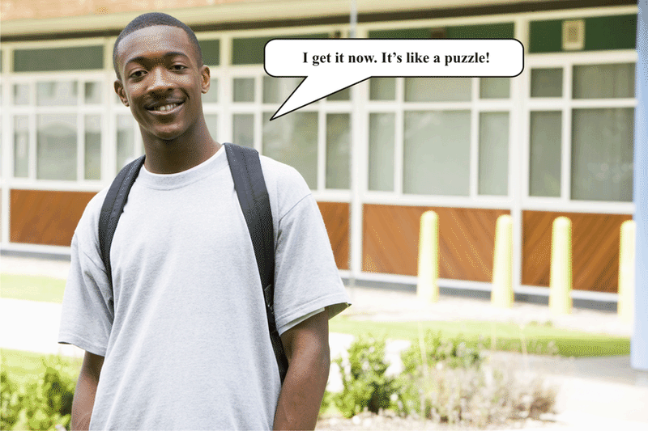

**8K. Lesson Exercises**

**Answer this question.**

1. What is the measure of $\angle M$? (The two triangles are congruent.)

")

\[Figure 8\]

**_Take a few minutes to check your answer with a friend. Correct any errors and then continue with the next section._**

III. **Recognize Similarity**

Some figures look identical except they are different sizes. The angles even look the same. When we have figures that are proportional to each other, we call these figures **_similar_** figures. **Similar figures have the same angle measures but different side lengths.**

**What is an example of similar figures?**

Squares are similar shapes because they always have four $90^\circ$ angles and four equal sides, even if the lengths of their sides differ. Other shapes can be similar too, if their angles are equal.

Let’s look at some pairs of similar shapes.

IV. **Check for Similarity between Given Figures**

Unlike congruent figures, similar figures are not exactly the same. They do have corresponding features, but only their corresponding angles are congruent; the corresponding sides are not. **Thus when we are dealing with pairs of similar figures, we should look at the angles rather than the sides. In similar figures, the angles are congruent, even if the sides are not.**

**Let’s find the corresponding angles in similar figures.**

Example

List the corresponding angles in the figures below.

**How do the angles line up?**

Angles $H$ and $X$ correspond to each other. So do angles $I$ and $Y$ and angles $J$ and $Z$. Now we can name these two quadrilaterals: $GHIJ$ is similar to $WXYZ$.

As we’ve said, the sides in similar figures are not congruent. They are proportional, however. Proportions have the same ratio. Look at $GHIJ$ and $WXYZ$ again. We can write each pair of sides as a proportion.

$\frac{GH}{WX},\frac{HI}{XY},\frac{IJ}{YZ},\frac{GJ}{WZ}$

The sides from one figure are on the top, and the proportional sides of the other figure are on the bottom.

Example

List all of the pairs of corresponding sides in the figures below as proportions.

**Which sides are proportional?**

$OP$ and $RS$ are the shortest sides in each figure. They are proportional, so we write

$\frac{OP}{RS}$

Now that we’ve got one pair, let’s do the same for the rest.

$\frac{NO}{QR}, \frac{MP}{TS}, \frac{MN}{TQ}$

**Now let’s use what we have learned to check for similarity between figures.**

Example

Which pair of figures below is similar?

We only know some of the angles in each triangle in the first pair. They both have a $50^{\circ}$ angle, so that’s a good start. All three angles must be congruent, however, so let’s solve for the missing angle in each angle. Remember, the sum of the three angles is always $180^{\circ}$ for a triangle.

$$
\begin{align*}
&\text{Triangle 1} && \text{Triangle 2}\\
&50  +  60  +  \text{angle} \ 3  =  180 && 50  +  80  + \text{angle} \ 3  =  180\\
&110  +  \text{angle} \ 3  =  180 && 130  + \text{angle} \ 3  =  180\\
&\text{angle} \ 3  =  180  -  110 && \text{angle} \ 3  =  180  -  130 \\
&\text{angle} \ 3  =  70^{\circ} && \text{angle} \ 3  =  50^{\circ}
\end{align*}
$$

**The angles in the first triangle are $50^{\circ}$, $60^{\circ}$, and $70^{\circ}$. The angles in the second triangle are $50^{\circ}$, $50^{\circ}$, and $80^{\circ}$. These triangles are not similar because their angle measures are different.**

Let’s move on to the next pair.

This time we know side lengths, not angles. We need to check whether each set of corresponding sides is proportional. First, let’s write out the pairs of proportional corresponding sides

$\frac{6}{3}, \frac{6}{3}, \frac{4}{1}$

The proportions show side lengths from the large triangle on the top and its corresponding side in the small triangle on the bottom. The pairs of sides must have the same proportion in order for the triangles to be similar. We can test whether the three proportions above are the same by dividing each. If the quotient is the same, the pairs of sides must exist in the same proportion to each other.

$$
\frac{6}{3} = 2\\
\frac{6}{3} = 2\\
\frac{4}{1} = 4
$$

**When we divide, only two pairs of sides have the same proportion (2). The third pair of sides does not exist in the same proportion as the other two, so these triangles cannot be similar.**

That leaves the last pair. We have been given the measures of some of the angles. If all of the corresponding angles are congruent, then these two figures are similar. We know the measure of three angles in each figure. In fact, they are all corresponding angles. Therefore the one unknown angle in the first figure corresponds to the unknown angle in the second figure.

As we know, the four angles in a quadrilateral must have a sum of $360^{\circ}$. Therefore the unknown angle in each figure must combine with the other three to have this sum. Because the three known angles are the same for both figures, we don’t even need to solve for the fourth to know that it will be the same in both figures. **These two figures are similar because their angle measures are all congruent.**

**Now let’s use what we have learned to solve the problem in the introduction.**

Real Life Example Completed
---------------------------

**_The Mathematical Floor_**

Mrs. Gilman brought a small group of students over to look at this tile floor in the hallway of the art museum.

“You see, there is even math in the floor,” she said, smiling. Mrs. Gilman is one of those teachers who loves to point out every place where math can be found.

“Okay, I get it,” Jesse started. “I see the squares.”

“There is a lot more math than just squares,” Mrs. Gilman said, walking away with a huge smile on her face.

“She frustrates me sometimes,” Kara whispered, staring at the floor. “Where is the math besides the squares?”

“I think she is talking about the size of the squares,” Hannah chimed in. “See? There are two different sizes.”

“Actually there are three different sizes, and there could be more that I haven’t found yet,” Jesse said.

“Remember when we learned about comparing shapes that are alike and aren’t alike? It has to do with proportions or something like that,” Hannah chimed in again.

All three students stopped talking and began looking at the floor again.

“Oh yeah, congruent and similar figures, but which are which?” Kara asked.

**The students are working on which figures in the floor pattern are congruent and which ones are similar.**

**The congruent figures are exactly the same. We can say that the small dark brown squares are congruent because they are just like each other. They have the same side lengths. What is one other pair of congruent squares?**

**The similar figures compare squares of different sizes. You can see that the figures are squares, so they all have 90 degree angles. The side lengths are different, but because the angles are congruent, we can say that they have the same shape, but not the same size. This makes them similar figures.**

**The small dark brown square is similar to the large dark brown square. The small dark brown square is also similar to the square created by the ivory colored tile. There is a relationship between the different squares. Are there any more comparisons? Make a few notes in your notebook.**

Vocabulary
----------

__Congruent__

having exactly the same shape and size. All side lengths and angle measures are the same.

__Similar__

having the same shape but not the same size. All angle measures are the same, but side lengths are not.

Technology Integration
----------------------

!?[0](https://www.youtube.com/watch?v=0mKmYxuMirE)

[Khan Academy Congruent and Similar Triangles](http://www.youtube.com/watch?v=0mKmYxuMirE)

[James Sousa, Congruent and Similar Triangles](http://www.youtube.com/watch?v=OEp7YK6WEXE)

Time to Practice
----------------

Directions: Tell whether the pairs of figures below are congruent, similar, or neither.

8. $MN$

9. $\angle O$

Directions: Use the relationships between congruent figures to find the measure of $g$. Show your work.

10. 

11. 

12. Triangles $ABC$ and $DEF$ are congruent. If the measure of angle $A$ is $58^{\circ}$, what is the measure of angle $D$ if it corresponds to angle $A$?

13. True or false. If triangles $DEF$ and $GHI$ are similar, then the side lengths may be different but the angle measures are the same.

14. True or false. Similar figures have exactly the same size and shape.

15. True or false. Congruent figures are exactly the same in every way.

16. Triangles $LMN$ and $HIJ$ are similar. If this is true, then the side lengths are the same, true or false.

17. What is a proportion?

18. True or false. To figure out if two figures are similar, see if their side lengths form a proportion.

19. Define similar figures

20. Define congruent figures.

</article>

### 8.6 Indirect Measurement

<article>

Introduction
------------

**_The Angel Sculpture_**

“It is huge,” Carmen said to Henry.

“Yup, I wonder how tall it is?” he whispered.

“You can figure that out quite easily with math,” Mrs. Gilson said, overhearing the conversation.

“How can I do that?” Henry asked.

“How tall are you?”

“Five feet,” Henry answered.

“Good, and it looks like your shadow is about half as long as your height. Can you figure it out now?”

Henry looked at Carmen and then back at Mrs. Gilson.

“I have an idea,” he said smiling.

**Do you have an idea what Henry is thinking about? If you pay attention to this lesson, you will know how to figure out how tall the statue is. We will come back to Henry, Carmen and the sculpture at the end of the lesson.**

**_What You Will Learn_**

In this lesson you will learn the following skills:

* Recognize the ratio of corresponding side lengths of similar figures as the scale factor.
* Use proportions to find unknown measures of corresponding parts of similar figures.
* Use diagrams of similar figures to find unknown lengths without directly measuring.
* Solve real-world problems involving indirect measurement.

**_Teaching Time_**

I. **Recognize the Ratio of Corresponding Side Lengths of Similar Figures as the Scale Factor**

**_Similar figures_** **are shapes that exist in proportion to each other. They have congruent angles, but their sides are different lengths.** Squares, for example, are similar to each other because they always have four $90^{\circ}$ angles and four equal sides, even if the lengths of their sides differ. Other figures can be similar too, if their angles are equal. Let’s look at some pairs of similar figures.

**Even though similar figures have sides of different lengths, corresponding sides still have a relationship with each other. Each pair of corresponding sides has the same relationship as every other pair of corresponding sides, so that, altogether, the pairs of sides exist in proportion to each other.** For instance, if a side in one figure is twice as long as its corresponding side in a similar figure, all of the other sides will be twice as long too.

Let’s take a step back to similar figures to understand how indirect measurement works.

**First, let’s make sure we can recognize corresponding parts of similar figures. Similar figures have exactly the same angles. Therefore each angle in one figure corresponds to an angle in the other.**

**Similar figures also have corresponding sides, even though the sides are not congruent.** Corresponding sides are not always easy to spot. We can think of corresponding sides as those which are in the same place in relation to corresponding angles. For instance, side $AB$, between angles $A$ and $B$, must correspond to side $PQ$, because $A$ corresponds to $P$ and $B$ corresponds to $Q$.

**Corresponding sides also have lengths that are related, even though they are not congruent. Specifically, the side lengths are proportional. In other words, each pair of corresponding sides has the same ratio as every other pair of corresponding sides.** Take a look at the rectangles below.

$$
\begin{align*}
\frac{LM}{WX} &= \frac{8}{4}\\
\frac{MN}{XY} &= \frac{6}{3}\\
\frac{ON}{ZY} &= \frac{8}{4}\\
\frac{LO}{WZ} &= \frac{6}{3}
\end{align*}
$$

**Now you can clearly see each relationship. To figure out if the pairs do indeed form a proportion, we have to divide the numerator by the denominator. If the quotient is the same, then the ratios each form the same proportion and the figures are similar.**

$$
\begin{align*}
\frac{LM}{WX} &= \frac{8}{4} = 2\\
\frac{MN}{XY} &= \frac{6}{3} = 2\\
\frac{ON}{ZY} &= \frac{8}{4} = 2\\
\frac{LO}{WZ} &= \frac{6}{3} = 2
\end{align*}
$$

**Each quotient is the same so these ratios are proportional. The side lengths are proportional and the figures are similar.**

We call this the **_scale factor._** **The scale factor is the ratio that determines the proportional relationship between the sides of similar figures. For the pairs of sides to be proportional to each other, they must have the same scale factor.** In other words, similar figures have congruent angles and sides with the same scale factor. **A scale factor of 2 means that each side of the larger figure is twice as long as its corresponding side is in the smaller figure.**

Example

What is the scale factor of the figures below?

$$
\begin{align*}
\frac{QR}{HI} &= \frac{15}{5}\\
\frac{TS}{KJ} &= \frac{21}{7}\\
\frac{RS}{IJ} &= \frac{6}{3}\\
\frac{QT}{HK} &= \frac{15}{5}
\end{align*}
$$

**Now all we have to do is divide to find the scale factor.**

$$
\begin{align*}
\frac{QR}{HI} &= \frac{15}{5} = 3\\
\frac{TS}{KJ} &= \frac{21}{7} = 3\\
\frac{RS}{IJ} &= \frac{6}{3} = 3\\
\frac{QT}{HK} &= \frac{15}{5} = 3
\end{align*}
$$

**The scale factor for these similar figures is 3. This means that the sides of the first quadrilateral are exactly three times bigger than the second.**

**What happens if we had written the numbers the other way around?**

If we had put the measurements of the smaller figure on top and the larger figure on the bottom, we would have found a scale factor of $\frac{1}{3}$. You can write them the other way too as long as you understand how to read the scale factor. This is another way of saying the scale factor is three. **When we say that the larger figure is three times as big as the small one, it’s the same as saying that the small figure is one-third the size of the larger one.**

**8L. Lesson Exercises**

**Look at each ratios and determine the scale factor.**

1.  $\frac{18}{6}$ and $\frac{24}{8}$
2.  $\frac{12}{6}$ and $\frac{8}{4}$
3.  $\frac{25}{5}, \frac{45}{9}, \frac{15}{3}$

II. **Use Proportions to Find Unknown Measures of Corresponding Parts of Similar Figures**

We can use a scale factor to help us to determine unknown measures. We don’t use the scale factor alone we apply it to the proportion. If we know the length of a side in one figure, we can use the scale factor to find the measure of the corresponding side in a similar figure. Let’s see how this works.

Example

Side a in triangle $ABC$ corresponds to side $x$ in the smaller triangle $XYZ$. Side $x$ is 4 meters long and the scale factor is 6. What is the measure of side $a$?

We have been told that two sides, $a$ and $x$, correspond in a small triangle and a large one. If we know the length of one and the scale factor, we can find the length of the other. Side $x$ is 4 meters long, and the scale factor tells us that side $a$ will be six times as long. Let’s write this out and solve.

$$
\begin{align*}
\text{side} \ x  \times  \text{scale factor}  &=  \text{side} \ a\\
4  \times  6  &=  \text{side} \ a\\
24 \ m  &=  \text{side} \ a
\end{align*}
$$

**Side a must have a length of 24 meters.**

We can check by setting up the ratio that compares the lengths of the two sides. If the scale factor is 6, then our work is accurate.

$\frac{a}{x} = \frac{24}{4} = 6$

**Now we know that our work is accurate.**

Example

Use the scale factor of the similar figures below to find the measure of $KJ$.

**Here is our proportion.**

$\frac{KJ}{5} = \frac{6}{4}$

**Our proportion is written so that the corresponding sides form the two ratios of the proportion. We can say that $KJ$ is our unknown in this proportion.**

**Do you remember how to solve proportions?**

We can see a clear relationship between five and four, so we need to use cross products.

$$
\begin{align*}
KJ \times 4 &= 4KJ\\
5 \times 6 &= 30\\
4KJ &= 30
\end{align*}
$$

**Now we can solve the equation for $KJ$ by dividing both sides of the equation by 4.**

$$
\begin{align*}
30 \div 4 &= 7.5\\
KJ &= 7.5
\end{align*}
$$

**The side length of $KJ$ is 7.5.**

III. **Use Diagrams of Similar Figures to Find Unknown Lengths without Directly Measuring**

Sometimes, you can figure out missing side lengths just by looking at the given measures. In the last example it was too tricky because we couldn’t see the relationship between 6 and 4. However this isn’t always the case. Always look at the diagram of the figures and see if you can determine the missing length without measuring.

Let’s look at an example where this is the case.

We need to figure out the measurement of side $GH$ in the second rectangle.

You can see that the measurements in the second rectangle are half as big as the measurements in the first. Also, you know that the opposite sides of a rectangle are congruent. Therefore, the missing side length is 4.

**Working in this way can often save you some time!**

IV. **Solve Real-World Problems Involving Indirect Measurement**

You may be surprised how often we use similar figures that are related by a scale factor. Maps, architectural blueprints, and diagrams are just some examples. In most of these cases, the scale factor is given so that we know how to enlarge the items in the drawing to their real sizes. Take a look at the floor plan below. It shows where the furniture is located in a living room.

It tells us that **one inch in the drawing is equal to two feet in actual size.** Therefore, if we know the size in inches of any object in the floor plan, we can find its actual size in feet. Let’s give it a try.

**How many feet long is the sofa?**

Let’s find the sofa on the floor plan. Then we can use a ruler to find its length in inches. How many inches long is the drawing of the sofa? The sofa in the floor plan is 2 inches long. Imagine this is like knowing the length of one side in a similar figure. Now we need to use the scale factor as we would to find the length of the corresponding side in a similar figure (in this case the “corresponding side” is the actual sofa). We simply multiply the length we know by the scale factor:

$$
\begin{align*}
\text{sofa drawing} \times \text{scale factor}  &=  \text{actual sofa size}\\
2 \ inches  \times  2  &=  4 \ feet
\end{align*}
$$

**The sofa is four feet long.**

**How long is the fireplace?**

Use a ruler to measure the fireplace in the drawing. It is 2.5 inches long. We multiply this by the scale factor to find the length in feet.

$$
\begin{align*}
\text{fireplace drawing} \times \text{scale factor} &= \text{actual fireplace length}\\
2.5 \ inches \times 2 &= 5 \ feet
\end{align*}
$$

**The real length of the fireplace is 5 feet.**

**We can also reverse the process to take an actual size and reduce it.**

Chris is making a drawing of his school and the grounds around it. The basketball court is 75 feet long and 40 feet wide. If Chris uses a scale factor in which 1 inch equals 10 feet, what should the dimensions of the basketball court be in his drawing?

**First of all, what do we need to find?**

**We need to know the dimensions (length and width) that the small version of the basketball court should be.**

**What information have we been given?**

**We know the actual size of the basketball court, and we know the scale factor Chris is using for his drawing.** We can set up an equation to find the drawn dimensions. We’ll have to find the length first and then the width.

$$
\begin{align*}
\text{drawing length} \times \text{scale factor}  &=  \text{actual basketball court length}\\
\text{drawing length} \times 10  &=  75 \ feet\\	
\text{drawing length}  &=  75  \div  10\\
\text{drawing length}  &=  7.5 \ inches
\end{align*}
$$

**The length of the basketball court in Chris’s drawing should be 7.5 inches.**

Now let’s use the same process to find the width Chris should draw.

$$
\begin{align*}
\text{drawing width} \times \text{scale factor}  &=  \text{actual basketball court width}\\
\text{drawing width}  \times  10  &=  40 \ feet\\	
\text{drawing width} &= 40  \div  10\\
\text{drawing width}  &=  4 \ inches
\end{align*}
$$

**Great! Now we know that Chris should represent the basketball court as a 4 by 7.5 inch rectangle on his drawing.**

Real-Life Example Completed
---------------------------

**_The Angel Sculpture_**

In the field behind the museum, Mrs. Gilson showed the students a replica of a sculpture known as the “Angel of the North.” The students went outside to have a better look at the huge structure.

“It is huge,” Carmen said to Henry.

“Yup, I wonder how tall it is?” he whispered.

“You can figure that out quite easily with math,” Mrs. Gilson, said overhearing the conversation.

“How can I do that?” Henry asked.

“How tall are you?”

“Five feet,” Henry answered.

“Good, and it looks like your shadow is about half as long as your height. Can you figure it out now?”

Henry looked at Carmen and then back at Mrs. Gilson.

“I have an idea,” he said, smiling.

**Let’s think about how Henry and Carmen could figure out the height of the statue. We know that Henry is five feet tall and that his shadow is half as long as he is tall. Now we can write a ratio to compare Henry’s height to his shadow’s length.**

$\frac{Henry' s \ height}{Shadow' s \ length} = \frac{5 \ feet}{2.5 \ feet}$

**Next, we figure out the height of the statue. Henry and Carmen figure out very quickly that they need to learn the length of the shadow of the statue to figure out the height of the statue. Once they know the length of the shadow, they can use proportional reasoning and indirect measurement to figure out the statue’s height.**

**Approximating 1 foot using a length a little longer than Henry’s sneaker, they measure $32 \frac{1}{2}$ feet. It is not an exact measure, but they feel that it is very close.**

**Now they write the following proportion.**

$\frac{5 \ ft}{2.5 \ ft} = \frac{x}{32.5 \ ft}$

**Taking out a notebook, Carmen cross multiplies to solve the proportion.**

$$
\begin{align*}
5(32.5) &= 2.5x\\
162.5 &= 2.5x\\
x &= 65
\end{align*}
$$

**_The sculpture is approximately 65 feet tall._**

**After completing their work, Henry and Carmen check out their answer with the curator of the museum. The statue is actually 65.6 feet tall. Their work was very close to accurate! Indirect measurement was very useful!**

Vocabulary
----------

Here are the vocabulary words that are found in this lesson.

__Similar Figures__

Figures that have the same angle measures but not the same side lengths.

__Indirect Measurement__

using relationships between side lengths to figure out missing measures.

__Scale Factor__

the proportional relationship between two side lengths.

__Proportions__

two equal ratios

Technology Integration
----------------------

[Khan Academy Scale and Indirect Measurement](http://www.youtube.com/watch?v=GfNB14D55gQ)

[James Sousa, Indirect Measurement Using Similar Triangles](http://www.youtube.com/watch?v=LhEe0kB4QIs)

!?[0](https://www.youtube.com/watch?v=ueYQII8Lous)

[James Sousa, Solving for Unknown Values Using the Properties of Similar Triangles](http://www.youtube.com/watch?v=ueYQII8Lous)

Other Videos:

1.  http://www.onlinemathlearning.com/indirect-measurement.html – Here is a video on indirect measurement.

Time to Practice
----------------

Directions: Find the scale factor of the pairs of similar figures below.

5. $\frac{3}{1}$

6. $\frac{8}{2}$

7. $\frac{2}{8}$

8. $\frac{10}{5}$

9. $\frac{12}{4}$

10. $\frac{16}{2}$

Directions: Solve each problem.

11. Side $m$ in triangle $LMN$ corresponds to side $c$ in the smaller triangle $BCD$. Side $m$ is 12 cm long and the scale factor is 4. What is the measure of side $c$?

12. Side $q$ in triangle $PQR$ corresponds to side $y$ in the smaller triangle $XYZ$. Side $y$ is 8 inches long and the scale factor is 7. What is the measure of side $q$?

Directions: Solve each proportion for the missing side length.

13. $\frac{3}{4} = \frac{x}{12}$

14. $\frac{3}{6} = \frac{1}{x}$

15. $\frac{5}{8} = \frac{1}{x}$

16. $\frac{7}{10} = \frac{x}{30}$

17. $\frac{1.5}{3} = \frac{x}{6}$

Directions: Now use the scale factor to create a new ratio.

18. $\frac{1}{3}$, scale factor 4

19. $\frac{8}{5}$, scale factor 5

20. $\frac{9}{3}$, scale factor 3

Directions: Find the scale factor of the similar figures below and then use it to find the measure of $LO$.

23. How far is it from the library to the park?

24. How far does Delia live from City Hall?

25. Delia drew another point to show the police station on her map. She drew it 1.5 inches away from the City Hall. What is the actual distance between the police station and City Hall?

</article>

### 8.7 Transformations and Symmetry

<article>

Introduction
------------

**_The Moving Wall_**

“This tile makes me dizzy,” Greg stated, sitting on a nearby bench.

“Yes, it seems to move,” Lane commented.

“I think it’s cool. Look at all of the symmetry and the transformations are everywhere,” Emma said smiling.

“Are you sure? You are beginning to sound like Mrs. Gilman,” Lane said jokingly.

“I am sure, and thank you for the compliment,” Emma said, nudging her best friend.

**Do you think Emma can see the transformations? Well, they are there. While sometimes a pattern like this one can make you dizzy, there are many different transformations in pattern. Your task is to find them. Use what you learn in this lesson to revisit the problem and find the examples of transformations and symmetry in the tile pattern.**

**_What You Will Learn_**

In this lesson you will learn how to demonstrate the following skills:

* Recognize transformations as the movement of a figure in a plane, classified as a translation (slide), a reflection (flip) and a rotation (turn).
* Identify and describe a translation.
* Identify and describe a reflection.
* Identify and describe a rotation.
* Distinguish between line symmetry and rotational symmetry.

**_Teaching Time_**

I. **Recognize Transformations as the Movement of a Figure in a Plane**

In this lesson we will examine different kinds of transformations. **A** **_transformation_** **is the movement of a geometric figure.**

**There are three different kinds of transformations.**

In a **_translation_**, also called a slide, the figure moves left, right, up, down, or a combination of these (which would be a diagonal motion).

In a **_reflection_**, the figure flips. A reflection is like a mirror image of the original figure.

Finally, in a **_rotation_**, the figure turns.

Now let’s look at each type of translation in more detail.

II. **Identify and Describe a Translation**

The first type of transformation is called a **_translation._** It is also known as a **_slide_** because the figure in question does exactly that. It moves up, down, to the left or to the right. **Nothing about the figure changes except its location.**

Here are some examples of translations.

**This is how you always know that you are working with a translation or a slide.**

**How do we perform a translation?**

To perform a translation, we measure a distance and then redraw the figure. For example, let’s move this triangle 6 inches.

**In this way, we can translate any figure in any direction for any distance.**

III. **Identify and Describe a Reflection**

You have heard the word “reflection” all the time. From the reflection in a mirror to the reflection in a pond, reflections are all around us.

**How do we apply the term reflection to geometry?**

**A** **_reflection_** **is a different kind of transformation. In a reflection, the figure flips to make a mirror image of itself.** Take a look at the reflection below.

**We can also reflect figures across a horizontal line of symmetry. Then our reflection would look like this.**

IV. **Identify and Describe a Rotation**

Now let’s learn about the third kind of transformation. **A** **_rotation_** **is a transformation that turns the figure in either a clockwise or counterclockwise direction.**

**How does the figure below change as it is rotated?**

**8M. Lesson Exercises**

**Let’s identify some translations.**

1. ")

\[Figure 12\]

V. **Distinguish Between Line Symmetry and Rotational Symmetry**

We have mentioned that reflected figures are symmetrical, and that the line that acts as a mirror is called the **_line of symmetry._**

**_Symmetry_** **means that when we divide a figure in half, the halves are congruent.** In other words, a figure is symmetric if its outlines mirror each other.

Look at the figure below. Imagine you can fold it in half. When you fold it, do the outlines of each half match? They do, so this figure has symmetry.

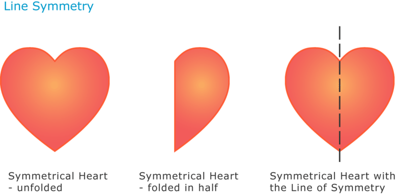

Now let’s try another figure. Can we fold it perfectly in half?

**_Rotational symmetry_** **is a different kind of symmetry. It means that when we rotate a figure, the figure appears to stay the same. The outlines do not change even as the figure turns.** Look at the figure below.

The figure below, on the other hand, does not have rotational symmetry. Can you see why?

**8N. Lesson Exercises**

**Does each of the following figures have line symmetry, rotational symmetry, both, or neither?**

1.  **Cross**
2.  **Arrow**
3.  **Quadrilateral**

Real Life Example Completed
---------------------------

**_The Moving Wall_**

In one of the rooms of the museum, this tile completely covered two of the walls. The students walked inside and began moving automatically because of the pattern on the wall.

“This tile makes me dizzy,” Greg stated, sitting on a nearby bench.

“Yes, it seems to move,” Lane commented.

“I think it’s cool. Look at all of the symmetry and the transformations are everywhere,” Emma said, smiling.

“Are you sure? You are beginning to sound like Mrs. Gilman,” Lane said jokingly.

“I am sure, and thank you for the compliment,” Emma said, nudging her best friend.

**In this tile pattern, make a note of a reflection. Make a note of a translation. Make a note of a figure that rotates or has rotational symmetry. Make a note of the line of symmetry.**

**When finished, compare your answers with a partner.**

**_While you won’t find the exact answer here, there are many ways to explore transformations and symmetry by using this pattern. Work with a partner or with your whole class to figure out the math in this tile pattern._**

Vocabulary
----------

Here are the vocabulary words found in this lesson.

__Transformation__

when a figure moved on a plane. The figure doesn’t change, but its position does.

__Translation__

a slide. The figure moved up, down, right, left, or diagonally.

__Reflection__

a flip. The figure flips over a line of symmetry, much like a reflection in a mirror.

__Rotation__

a turn. The figure turns either clockwise or counterclockwise.

__Line of Symmetry__

the line that a figure reflects over. Also the line that divided a figure in half showing line symmetry.

__Rotational Symmetry__

the way a figure looks does not change no matter how you rotate it.

__Symmetry__

a figure that can be divided into two congruent halves is said to have symmetry.

Time to Practice
----------------

Directions: Identify the transformations shown below as translations, reflections, or rotations.

16. A reflection has rotational symmetry.

17. A square has line symmetry and rotational symmetry.

18. If a figure is a transformation, then it always rotates clockwise.

19. A slide is also called a translation.

20. A flip has a line of symmetry because it is a reflection.

21. A rotation or turn always moves clockwise and never counterclockwise.

</article>

### 8.8 Transformations in the Coordinate Plane

<article>

Introduction
------------

**_The King’s Chamber_**

Jessica thought that the pattern was the most beautiful one that she had ever seen.

“I love this,” she said to Mrs. Gilman. “I want to draw it, but I’m not sure how.”

“Well, you could break it up into a coordinate grid, since the pattern repeats itself, and use what we have learned about transformations to draw it in.”

“How could I get started?” Jessica asked.

“Well, start by drawing the coordinate grid, then use these coordinates for one of the diamonds. See if you can figure it out from there.”

In Jessica’s notebook, Mrs. Gilman wrote down the following coordinates.

$$
(4, 1)\!\\
(5, 2)\!\\
(5, 0)\!\\
(6, 1)
$$

Jessica began to draw it in. Then she got stuck.

**This is where you come in. This lesson will teach you all about drawing transformations. Follow along closely and you can help Jessica draw in the diamonds in each quadrant at the end of the lesson .**

**_What You Will Learn_**

In this lesson you will learn how to demonstrate the following activities and skills:

* Identify and describe transformations in the coordinate plane.
* Translate a figure in the coordinate plane using coordinate notation, and graph the resulting image.
* Reflect a figure in the coordinate plane using coordinate notation, and graph the resulting image.
* Rotate a figure in the coordinate plane using coordinate notation, and graph the resulting image.

**_Teaching Time_**

I. **Identify and Describe Transformations in the Coordinate Plane**

In the last lesson you learned how to identify and perform different **_transformations._** Remember that a **transformation is when we move a figure in some way, even though we don’t change the figure at all.** This lesson will teach you how to identify and perform transformations in the coordinate plane.

**The** **_coordinate plane_** **is a representation of two-dimensional space. It has a horizontal axis, called the $x-$****_axis_****, and a vertical axis, called the $y-$****_axis_****.** We can graph and move geometric figures on the coordinate plane.

**Do you remember the three types of transformations?**

The first is a **_translation_** or slide. A translation **moves a figure up, down, to the right, to the left or diagonal without altering the figure.**

The second is a **_reflection_** or flip. A reflection **makes a mirror image of the figure over a line of symmetry.** The line of symmetry can be vertical or horizontal.

The third is a **_rotation_** or turn. A rotation **moves a figure in a circle either clockwise or counterclockwise.**

**Now let’s look at performing each type of transformation in the coordinate plane.**

II. **Translate a Figure in the Coordinate Plane Using Coordinate Notation, and Graph the Resulting Image**

As we have said, when we perform **_translations_**, **we slide a figure left or right, up or down. This means that on the coordinate plane, the coordinates for the vertices of the figure will change.** Take a look at the example below.

We can choose the number of places that we want to move the triangle and the direction that we wish to move it in. If we slide this triangle 3 places down, all of its vertices will shift 3 places down the $y-$axis. That means that the ordered pairs for the new vertices will change. Specifically, the $y-$coordinate in each pair will decrease by 3.

Let’s see why this happens.

**We can translate figures in other ways, too. As you might guess, we move figures right or left on the coordinate grid by their $x-$coordinates. We can also move figures diagonally by changing both their $x-$ and $y-$coordinates.** One way to recognize translations, then, is to compare their points. The $x-$coordinates will all change the same way, and the $y-$coordinates will all change the same way.

**To graph a translation, we perform the same change for each point.** Let’s try graphing a translation.

Example

Slide the following figure 5 places to the right.

We can check to see if we performed the translation correctly by adding 5 to each $x-$coordinate (because we moved to the right) and then checking these against the ordered pairs of the figure you drew. This is called **_coordinate notation._** Notice that each point is represented by coordinates.

$$
\begin{align*}
& (-4, 3) \qquad (-6, -2) \qquad  (-1, -6) \qquad  (2, -1)\\
& +5 \qquad  \qquad +5 \qquad \qquad +5 \qquad \qquad +5\\
& (1, 3) \qquad \quad (-1, -2) \qquad (4, -6) \qquad \ \ (7, -1)
\end{align*}
$$

**These are the points we graphed, so we have performed the translation correctly.**

Let’s try another.

Example

Slide the following figure 4 places to the left and 2 places up.

. Make a mark and repeat this process for each point. Then connect the new points.")

 and add 2 to each $y-$coordinate. Let’s see what happens.")

 

$$
\begin{align*}
& \ \ (3, \ 2) \qquad \quad (4, -2) \quad \qquad (1, -4)\\
& -4 +2 \qquad -4 +2 \qquad \ \ -4 +2\\
& (-1, \ 4) \qquad \ \ \ (0, \ 0) \qquad \quad \ (-3, -2)
\end{align*}
$$

**These are the points we graphed, so we performed the translation correctly.**

**8O. Lesson Exercises**

**Use coordinate notation to write the coordinates of each translated triangle. The vertices of the original figure have been given to you.**

1.  **Triangle $ABC$ (0, 1)(1, 3)(4, 0) translate this figure up 4.**
2.  **Triangle $DEF$ (-3, 2)(1, 6)(2, 1) translate this figure right 8.**

III. **Reflect a Figure in the Coordinate Plane Using Coordinate Notation, and Graph the Resulting Image**

**We can also identify a reflection by the changes in its coordinates. Recall that in a** **_reflection,_** **the figure flips across a line to make a mirror image of itself.** Take a look at the reflection below.

. After we reflect it across the $y-$axis, the coordinates for the corresponding vertex are (-5, -5). How about the lower-right vertex? It starts out at (-1, 1), and after the flip it is at (-1, -1). As you can see, the $x-$coordinates stay the same while the $y-$coordinates change. In fact, the $y-$coordinates all become the opposite integers of the original $y-$coordinates. **This indicates that this is a vertical (up/down) reflection or we could say a reflection over the $x-$axis.**")

In a horizontal (left/right) reflection or a reflection over the $y-$axis, the $x-$coordinates would become integer opposites. Let’s see how.

, and the coordinates of the new point are (4, 6). The $x-$coordinate has switched from -4 to 4.")

We can recognize reflections by these changes to the $x-$ and $y-$coordinates. If we reflect across the $x-$axis, the $x-$coordinates will become opposite. If we reflect across the $y-$axis, the $y-$coordinates will become opposite.

We can also use this information to graph reflections. To graph a reflection, we need to decide whether the reflection will be across the $x-$axis or the $y-$axis, and then change either the $x-$ or $y-$coordinates. Let’s give it a try.

Example

Draw a reflection of the figure below across the $x-$axis.

.** Specifically, we need to change them to their integer opposites. An integer is the same number with the opposite sign. This gives us the new points.")

$$
\begin{align*}
& (3, 6) \qquad \quad (5, 6) \qquad \quad (3, 1) \qquad \ \  (5, 1)\\
& (3, -6) \qquad (5, -6) \qquad (3, -1) \qquad (5, -1)
\end{align*}
$$

Now we graph the new points. Remember to move right or left according to the $x-$coordinate and up or down according to the $y-$coordinate.

**8P. Lesson Exercises**

**Write each set of coordinates to show a reflection in the $y-$axis.**

1.  **(-3, 1) (0, 3) (1, 2)**
2.  **(-3, 6) (-2, 3) (2, 3) (3, 6)**

IV. **Rotate a Figure in the Coordinate Plane Using Coordinate Notation, and Graph the Resulting Image**

Now let’s look at the third kind of transformation: rotations. **A** **_rotation_** **is a transformation that turns the figure in either a clockwise or counterclockwise direction.** The figure below has been rotated. What are its new coordinates?

, (1, 2), (3, 2), and (3, -3). As you can see, both the $x-$ and $y-$coordinates changed. **Unlike a translation or reflection, a rotation can change both of the coordinates in an ordered pair.** Now look closely. **One of the points remained exactly the same! We say that we rotated the figure about this point.** Imagine you put your finger on this corner of the rectangle and spun it. That’s what happened in the rotation. **The rectangle has been rotated $90^{\circ}$ clockwise.**")

**How do we graph a rotation?**

**When we graph a rotation, we first need to know how much the figure will be rotated. Rotating the above rectangle $90^{\circ}$ stands it up on end. Rotating it $180^{\circ}$ would make it flat again. We also need to know which point we will rotate it around. This is the point that stays the same.**

Next, we need to count how many units long and wide the figure is. The figure above stretches from 1 on the $x-$axis to -4 on the $x-$axis. This is a total of 5 units along the $x-$axis. When we rotate a figure $90^{\circ}$, the distance on the $x-$axis becomes the distance on the $y-$axis. Look at the rectangle. The long sides are horizontal at first, but after we rotate it, they become the vertical sides. This means that the $x-$distance of 5 will become a $y-$distance of 5.

Now, remember the point (1, -3) stays the same, so it is one corner of the rotated figure. **We add 5 to the $y-$coordinate to find the next vertex of the rectangle. $-3 + 5 = 2$. This puts a vertex at (1, 2).**

To find the other points of the rotated rectangle, we need to think about its width. Find the width, or short side, of the original rectangle by counting the units between vertices along the $y-$axis. The rectangle covers 2 units on the $y-$axis. As you might guess, this becomes the $x-$distance in the rotated figure. In other words, we add 2 to the $x-$coordinate of the point that stays the same. $1 + 2 = 3$, **so another vertex of the rectangle will be (3, -3). To find the fourth and final vertex, add 2 to the $x-$coordinate of the other ordered pair we know, (1, 2). This puts the last vertex at (3, 2).**

**Let’s go back to the problem in the introduction and use what we have learned to figure it out!**

Real – Life Example Completed
-----------------------------

**_The King’s Chamber_**

In one room of the museum was a King’s bedroom. The furniture in the room was large and wooden and old with great golden cloths. On the walls was a beautiful red, blue and gold pattern.

Jessica thought that the pattern was the most beautiful one that she had ever seen.

“I love this,” she said to Mrs. Gilman. “I want to draw it, but I’m not sure how.”

“Well, you could break it up into a coordinate grid, since the pattern repeats itself, and use what we have learned about transformations to draw it in.”

“How could I get started?” Jessica asked.

“Well, start by drawing the coordinate grid, then use these coordinates for one of the diamonds. See if you can figure it out from there.”

In Jessica’s notebook, Mrs. Gilman wrote down the following coordinates.

$$
(4, 1)\!\\
(5, 0)\!\\
(5, 2)\!\\
(6, 1)
$$

Jessica began to draw it in. Then she got stuck.

**Now we can draw this diamond in on a coordinate grid. It belongs in Quadrant one. Now we want to draw a diamond into each of the other three quadrants. We can draw this, but we can also use mathematics to figure out the coordinates for each of the other diamonds first.**

**The diamond in the second quadrant is reflected over the $y-$axis. Therefore, the $x-$coordinate is going to change and become negative in each of the four vertices of the diamond. Here are the coordinates.**

$$
(-4,1)\!\\
(-5,0)\!\\
(-5, 2)\!\\
(-6, 1)
$$

**Next, we can reflect the original diamond in the first quadrant over the $x-$axis into the fourth quadrant. Here the $y-$coordinates will be negative.**

$$
(4, -1)\!\\
(5, 0)\!\\
(5, -2)\!\\
(6, -1)
$$

**Finally we can reflect this diamond over the $y-$axis into the third quadrant. Notice that here the $x$ and $y -$coordinates will both be negative.**

$$
(-4, -1)\!\\
 (-5, 0)\!\\
 (-5, -2)\!\\
 (-6, -1)
$$

**Did you notice any patterns? Take a minute and create this pattern of diamonds in a coordinate grid. Then you will have an even deeper understanding of how a pattern like this one is created.**

**If you wanted to add in the gold $X$ that crosses through the original pattern could you do it? Explain your thinking with a friend and then add in the $X$ to the coordinate grid with the diamonds.**

Vocabulary
----------

Here are the vocabulary words found in this lesson.

__Transformation__

a figure that is moved in the coordinate grid is called a transformation.

__Coordinate Plane__

a representation of a two-dimensional plane using an $x -$ axis and a $y -$ axis.

__$x-$axis__

the horizontal line in a coordinate plane.

__$y-$axis__

the vertical line in a coordinate plane.

__Translation__

a slide. A figure is moved up, down, left or right.

__Reflection__

a flip. A figure can be flipped over the $x-$axis or the $y-$axis.

__Rotation__

a turn. A figure can be turned clockwise or counterclockwise.

__Coordinate Notation__

notation that shows where the figure is located in the coordinate plane. The vertices of the figure are represented using ordered pairs.

Time to Practice
----------------

Directions: Identify the transformations shown below as a translation, reflection, or rotation.

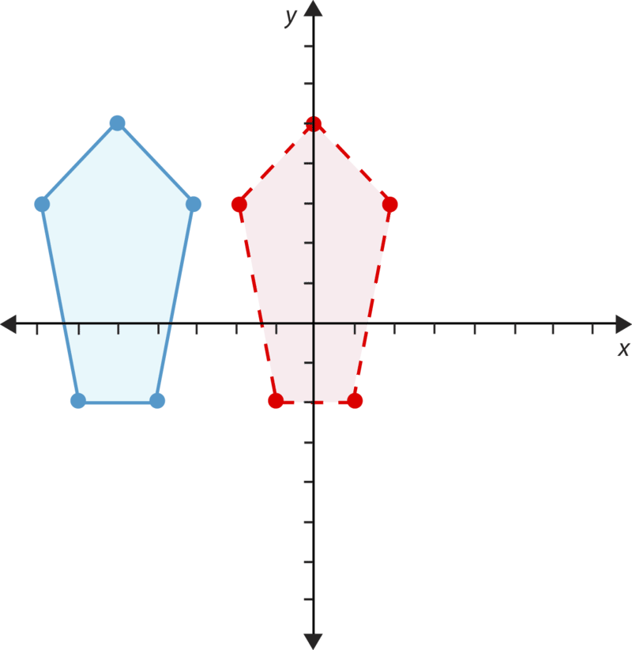

</article>

## 9.0 Distance and Area

<article>

</article>

### 9.1 Square Roots

<article>

Introduction
------------

**_Delay of Game_**

On the day of the first game, Miguel notices some big dark clouds as he rides his bike to the ball park. Sure enough, as soon as the game is about to start, the rain begins. Like magic, a bunch of different people drag a huge tarp over the entire baseball infield. Miguel has never seen a tarp so big in his whole life.

He wonders how big the tarp actually is if it covers the entire infield. Miguel, being the fan that he is, knows that the distance from one base to another, say $1^{st}$ to $2^{nd}$, is 90 feet. If the infield is in the shape of a square, then how many square feet does the infield cover? How can he be sure that his answer is correct?

Miguel begins to figure this out in his head.

**Can you figure this out? Squaring numbers and finding their square roots is just one way to solve this problem. This lesson will teach you all about square roots and squaring. Pay close attention and at the end of the lesson you will be able to figure out the size of the tarp.**

**_What You Will Learn_**

In this lesson you will learn the following skills:

* Evaluate square roots.
* Recognize perfect squares.
* Evaluate radical expressions.
* Solve equations using square roots.

**_Teaching Time_**

I. **Evaluate Square Roots**

Think about a square for a minute. We can look at a **_square_** in a couple of different ways. First, we can look at just the outline of the square.

**Do you remember what congruent means?**

It means exactly the same. So if a square has congruent sides, then they are the same length.

Now let’s say the side of a square is 3 units long. That means that each side of the square is 3 units long. Look at this picture of a square.

**How many units make up the entire square?**

**If we count, we can see that this square is made up of 9 units. It is the same answer as $3^2$, because $3^2$ is equal to 9. These integers, which are equal to a different integer squared, are called "perfect squares".**

Do you see a connection?

**Think back to exponents, when we square a number, we multiply the number by itself. All squares have congruent side lengths, so the side length of a square multiplied by itself will tell you the number of units in the square.**

**We square the side length to find the number of units in the square.**

**This lesson is all about** **_square roots._** **A square root is the number that we multiply by itself, or square, to get a certain result. In fact, if you square a number, and then take the square root of the result, you will be back to the original number again.**

Let’s think about the square that we just looked at. The dimensions of the square are $3 \times 3$. We square the three to find the units in the square shape. **The square root of the $3 \times 3$ square is 3.**

**We can practice finding the square root of a number. How do we do this?**

**Finding the square root is the inverse operation of squaring a number.** Inverse operations are simply the opposite of each other. Subtraction and addition are inverse operations, because one “undoes” the other. Similarly, squaring and finding the square root are inverse operations. **To find the square root, we look for the number that, times itself, will produce a given number.**

**We also use a symbol to show that we are looking for the square root of a number. Here is the symbol for square root.**

$\sqrt{9}$

**If this were the problem, we would be looking for the square root of 9.**

**You could think of this visually as a square that has nine units in it. What would be the length of the side? It would be three.**

**You could also think of it using mental math to solve it. What number times itself is equal to nine? The answer is three.**

**When we find the square root of a number, we evaluate that square root.** Let’s look at an example.

Example

$\sqrt{25}$

**This problem is asking us for the square root of 25.** What number times itself is equal to 25? If you don’t know right away, you can think about this with smaller numbers.

$$
\begin{align*}
&3 \times 3 = 9\\
&4 \times 4 = 16\\
&5 \times 5 = 25
\end{align*}
$$

**That’s it! The square root of 25 is 5.**

Example

$\sqrt{49}$

**What is the square root of 49?** What number times itself is 49? Let’s start where we left off with five.

$$
\begin{align*}
&5 \times 5 = 25\\
&6 \times 6 = 36\\
&7 \times 7 = 49
\end{align*}
$$

**That’s it! The square root of 49 is 7.**

**We can also evaluate numbers where the square root is not a whole number.**

Let’s look at an example

Example

$\sqrt{7}$

To find the square root of seven, we can think about which two squares it is closest to.

$$
\begin{align*}
&2 \times 2 = 4\\
&3 \times 3 = 9
\end{align*}
$$

Seven is between four and nine, so we can say that the square root of seven is between 2 and 3.

**Our answer would be that the $\sqrt{7}$ is between 2 and 3.**

**We can get a more exact number, but we aren’t going to worry about that for right now.**

Example

$\sqrt{10}$

The square root of ten is between which two numbers?

$$
\begin{align*}
&3 \times 3 = 9\\
&4 \times 4 = 16
\end{align*}
$$

**Our answer is that the $\sqrt{10}$ is between 3 and 4.**

**Working with square roots that are whole numbers is a lot easier! Let’s look at what we call a perfect square.**

II. **Recognize Perfect Squares**

We have seen that a square root is the number that, times itself, produces a given number. **_Perfect squares_** **are numbers whose square roots are whole numbers.** The numbers below are perfect squares. Take a good look at them. Can you guess why?

4, 9, 16, 25, 36

Look at them as images.

Let’s examine each one. What is the square root of 4? In other words, what number, when multiplied by itself, equals 4? $2 \times 2$ equals 4, so 2 is the square root of 4. Because 2 is a whole number, we say that 4 is a perfect square.

What is the square root of 9? We have already finished that one, it is 3.

What is the square root of 16? $4 \times 4 = 16$.

What is the square root of 25? $5 \times 5 = 25$.

What is the square root of 36? $6 \times 6 = 36$.

**When we look at the square root of each of these perfect squares, we end up with a whole number. Perfect squares are the easiest square roots to find because they are whole numbers.**

**Most numbers are not perfect squares.** For example, the square root of 5 is roughly 2.236067978! But let’s not worry about that right now.

**9A. Lesson Exercises**

**Evaluate each perfect square by finding its square root.**

1.  **64**
2.  **1**
3.  **100**

III. **Evaluate Radical Expressions**

Sometimes, we can have an expression with a **_radical_** in it.

**What is a radical?**

**A** **_radical_** **is the name of the sign that tells us that we are looking for a square root.** We can call this “a radical.” Here is a radical symbol.

$\sqrt{y}$

Here we would be looking for the square root of $y$.

**What is a radical expression?**

Remember that an expression is a number sentence that contains numbers, operations and now radicals. Just as we can have expressions without radicals, we can have expressions with them too.

Here is an example of a radical expression.

Example

$2 \cdot \sqrt{4} + 7$

Here we have two times the square root of four plus seven.

**P parentheses**

**E exponents (square roots too)**

**MD multiplication/division in order from left to right**

**AS addition/subtraction in order from left to right**

According to the order of operations, we evaluate the square root of 4 first.

$\sqrt{4} = 2$

Next, we substitute that value into the expression.

$2 \cdot 2 + 7$

Next, we complete multiplication/division in order from left to right.

$2 \times 2 = 4$

Substitute that given value.

$4 + 7 = 11$

**The answer is 11.**

Let’s look at another one.

Example

$\sqrt{4} \cdot \sqrt{16} - 3$

Here we have two radicals in the expression. We can work the same way, by using the order of operations.

Evaluate the radicals first.

$$
\sqrt{4} = 2\!\\ 
\sqrt{16} = 4
$$

Substitute these values into the expression.

$2 \cdot 4 - 3$

Next, we complete multiplication/division in order from left to right.

$2 \times 4 = 8$

Finally, we complete the addition/subtraction in order from left to right.

$8 - 3 = 5$

**The answer is 5.**

**9B. Lesson Exercises**

**Evaluate each radical expression.**

1.  $6 + \sqrt{9} - \sqrt{49} + 5$
2.  $\sqrt{64} \div \sqrt{4} + 13$
3.  $6(7) + \sqrt{121} - 3$

IV. **Solve Equations Using Square Roots**

If we know that the square of a number is equal to a product, then we can write this equation.

$y = x^2$

This equation expresses that if we multiply the value of $x$ by itself, we will end up with the value of $y$.

**We can say that $x$ is the square root of $y$.**

**We can use this information to solve equations involving square roots.**

Example

$x^2=81$

**To solve this equation, we want to figure out the value of $x$. To do this, we can take the square root of both sides of the equation.**

**Why would we do this?**

Think about it. The $x$ is being squared. We want to get the variable alone. To do this, we need to perform the inverse operation. The opposite of squaring a number is finding the square root of the number. Therefore, if we take the square root of both sides of the equation, then we will get $x$ alone.

$\sqrt{x^2} = \sqrt{81}$

Next, we can cancel the square and the square root. They are inverses of each other and they cancel each other out.

$\bcancel{\sqrt{x^2}} = x$

Now we find the square root of 81. 81 is a perfect square, and the square root of 81 is 9.

$x=9$

**This is our answer.**

**Sometimes, you will have a problem that is a little more complicated. Take a look.**

Example

$x^2+3=12$

We want to find the value of $x$. First, notice that we have a two step equation. One of the operations involves an exponent and the other is addition.

When solving an equation by cancelling, you are "undoing" all of the present operations. Along with "undoing" all of the operations, you also "undo" the ORDER of operations. Because of this, let’s start by subtracting three from both sides.

$$
\begin{align*}
x^2+3-3&=12-3\\
x^2&=9
\end{align*}
$$

Now we want to get $x$ alone. To do this, we take the square root of both sides of the equation.

$$
\begin{align*}
\bcancel{\sqrt{x^2}} &= \sqrt{9}\\ 
x&=3
\end{align*}
$$

**This is our answer.**

**Sometimes, the equation with have a square root in it and we have to work with that.**

Example

$\sqrt{x-1} = 8$

Wow! Here we have a variable and a number in a radical. Let’s get rid of the radical first.

To get cancel out the square root of a number, we use the inverse operation. We square both sides of the equation.

$\left ( \sqrt{x-1} \right )^2 = 8^2$

The square and the square root cancel each other out.

$$
\begin{align*}
(\bcancel{\sqrt{x-1})^2} &= 8^2. 
x-1 &= 64
\end{align*}
$$

Now we can solve for $x$ quite easily. Begin by adding 1 to both sides of the equation.

$$
\begin{align*}
x-1+1&=64+1\\
x&=65
\end{align*}
$$

**This is our answer.**

**Now let’s return to the introductory problem and use what we have learned to help us to solve this problem.**

Real–Life Example Completed
---------------------------

**_Delay of Game_**

Miguel loves baseball. He is such a fan that he is volunteering all summer for the University. The University team, The “Wildcats”, is an excellent team and Miguel is very excited to be helping out. He doesn’t even mind not being paid because he will get to see all of the games for free while he has the opportunity to learn more about baseball.

On the day of the first game, Miguel notices some big dark clouds as he rides his bike to the ball park. Sure enough as soon as the game is about to start, the rain begins. Like magic, a bunch of different people drag a huge tarp over the entire baseball infield. Miguel has never seen a tarp so big in his whole life.

He wonders how big the tarp actually is if it covers the entire infield. Miguel, being the fan that he is knows that the distance from one base to another, say $1^{st}$ to $2^{nd}$, is 90 feet. If the infield is in the shape of a square, then how many square feet does the infield cover? How can he be sure that his answer is correct?

Miguel begins to figure this out in his head.

**We can use what we know about squares to help us with this problem. We know that a square has four equal sides. This makes sense with baseball too. You want the distance from $1^{st}$ to $2^{nd}$ base to be the same as from $3^{rd}$ to Home. Therefore, if you know the distance from one base to another is 90 feet, then you know each distance from base to base.**

**However, Miguel wants to figure out the size of the tarp. He can do this by squaring the distance from $1^{st}$ to $2^{nd}$ base. This will give him the area of the square.**

$90^2 = 90 \times 90 = 8100 \ square feet$

**This is the size of the tarp.**

**How can Miguel check the accuracy of his answer? He can do this by finding the square root of the area of the tarp. Remember that finding a square root is the inverse operation for squaring a number.**

$\sqrt{8100}$

**To complete this, worry about the 81 and not the 8100. 81 is a perfect square. $9 \times 9 = 81$ so $90 \times 90 = 8100$**

$\sqrt{8100} = 90 \ ft$

**Miguel’s answer checks out.**

Vocabulary
----------

Here are the vocabulary words that are found in this lesson.

__Square__

a four sided figure with congruent sides.

__Congruent__

exactly the same

__Square Number__

a number of units which makes a perfect square.

__Square root__

a number that when multiplied by itself equals a given starting number.

__Perfect Square__

a number with square roots that are whole numbers.

__Radical__

the symbol that lets us know that we are looking for a square root.

__Radical Expression__

an expression with numbers, operations and radicals in it.

Technology Integration
----------------------

!?[0](https://www.youtube.com/watch?v=Ymcf14wC9Ck)

[James Sousa, Introduction to Square Roots](http://www.youtube.com/watch?v=Ymcf14wC9Ck)

Time to Practice
----------------

Directions: Evaluate each square root.

1. $\sqrt{16}$

2. $\sqrt{25}$

3. $\sqrt{1}$

4. $\sqrt{49}$

5. $\sqrt{144}$

6. $\sqrt{81}$

7. $\sqrt{169}$

8. $\sqrt{121}$

9. $\sqrt{100}$

10. $\sqrt{256}$

Directions: Name the two values each square root is in between.

11. $\sqrt{12}$

12. $\sqrt{14}$

13. $\sqrt{30}$

14. $\sqrt{40}$

15. $\sqrt{50}$

16. $\sqrt{62}$

17. $\sqrt{70}$

18. $\sqrt{101}$

19. $\sqrt{5}$

20. $\sqrt{15}$

Directions: Evaluate each radical expression.

21. $2 + \sqrt{9} + 15-2$

22. $3 \cdot 4 + \sqrt{169}$

23. $\sqrt{16} \cdot \sqrt{25} + \sqrt{36}$

24. $\sqrt{81} \cdot 12 + 12$

25. $\sqrt{36} + \sqrt{47} - \sqrt{16}$

Directions: Solve each equation.

26. $x^2=9$

27. $x^2=49$

28. $x^2=256$

29. $\sqrt{x+1} = 10$

30. $x^2+5=41$

</article>

### 9.2 Approximating Square Roots

<article>

Introduction
------------

**_Helping at Little League_**

The Wildcats do a lot of community service. One thing that they do is help out Little League teams. There is one new ball field being created and the Wildcats are going to help design the infield so that it has the correct dimensions. Miguel has been invited to go along.

When they arrive at the field, Miguel and one of the players, Harris, take a measurement to determine the distance from home plate to first base. It measures 58 feet.

“That isn’t correct,” Harris tells Miguel. “The area of the infield for little league should be 3600 square feet. This measurement is inaccurate. We’ll have to help them fix it.”

Miguel is puzzled. What is inaccurate about the 58 feet? Does it need to be a longer distance or a shorter one?

**To figure this problem out, Miguel will need to use his knowledge of squares and square roots. This lesson will expand upon what you learned in the last lesson. Then you can help Miguel figure this problem out at the end of the lesson.**

**_What You Will Learn_**

By the end of this lesson you will be able to complete the following tasks:

* Approximate square roots to the nearest given decimal place.
* Recognize irrational numbers.
* Recognize the set of real numbers as the union of all rational numbers and all irrational numbers.
* Solve real-world problems involving square roots.

**_Teaching Time_**

I. **Approximate Square Roots to the Nearest Given Decimal Place**

In the last lesson we began learning about **_square roots._** Remember that **the square root of a number is the number that you multiply by itself to get a product,** in essence it is a number that you square. **Squaring and square roots are inverse operations.** You can square a number to get a product, then take the square root of the product to get back to the original number.

Example

$$
6^2 = 36\!\\
\sqrt{36} = 6
$$

**Here you can see the inverse relationship between squaring a number and finding the square root of a product.**

**A number like 36 is a** **_perfect square_****, meaning that the square root is a whole number.** Here are some other perfect squares.

16, 25, 36, 49, 64, 81, 100, 121, 144, 169

**Notice that if you find the square root of any of these numbers, you will end up with a whole number as the answer.**

**What if a square root is not a whole number?**

This can also happen. When it does, we can approximate the square root of the number. There are a couple of different ways to do this. Let’s take a look.

**First, we can approximate the square root using perfect squares.**

To do this, we look for the perfect squares that generate a number close to the square root that we are looking for. Let’s look at an example.

Example

$\sqrt{30}$

If we are looking for the square root of 30, we first need to find two perfect squares near 30. One should be less than 30 and one should be more than 30.

$$
\begin{align*}
5 \times 5 &= 25\\
6 \times 6 &= 36
\end{align*}
$$

25 is the perfect square less than 30.

36 is the perfect square greater than 30.

**Because 30 is between 25 and 36, we can say that the approximate square root of 30 is between 5 and 6. It is probably close to 5.5.**

**This is how we can approximate a square root using perfect squares.**

**The second way of approximating a square root is to use a calculator.** Most calculators have a radical sign on them.

$\sqrt{\Box}$

To find the square root of a number, we enter the radical sign, then the value and press enter.

This will give us a decimal approximation of the square root. Many times you will need to round these answers. Let’s look at an example.

We can use 30 again.

Example

$\sqrt{30}$

Press the radical button.

Now enter the value, 30.

Next, press enter.

**Here is our answer on the calculator. 5.477225575.**

To find a final answer, we can round to the nearest tenth. To do this, we round to the 4; it is in the tenths place. The number after the 4 is 7, so we round up to five.

**Our answer is 5.5.**

**WOW! Notice that this value is the same as the answer that we found when estimating using perfect squares.**

**The third way of approximating a square root is to use something called “tabular interpolation.”** **_Tabular interpolation_** **is using a table.** To use this table, we find the approximate value of the square root according to research that has been completed by a mathematician.

Look at this example.

Example

$\sqrt{17}$

To find the square root of 17, let’s use a table. Keep in mind that these values have been rounded to the nearest thousandth.

**This is our answer.**

**You can find tables that include numbers all the way up to 100. By finding these tables, you can use them to locate the square root of numbers 1 to 100.**

**9C. Lesson Exercises**

**Choose a method to find an approximate square root of each number. Round your answer to the nearest tenth.**

1.  $\sqrt{11}$
2.  $\sqrt{33}$
3.  $\sqrt{41}$

II. **Recognize Irrational Numbers**

When you were finding square roots using a calculator, you probably noticed that each time you found the square root of a number that was not a perfect square. There were many decimal places following the decimal point.

**This means that the square root of that number was not a whole number. It was a whole number and some fraction of another.**

The key thing to notice about each of the numbers that we worked with in the last section is that they had many decimal places. When we find the square root of a number that is not a perfect square it brings another type of number into our work.

Let’s look at an example.

Example

$\sqrt{16} = 4$

Sixteen is a perfect square. So the square root is a whole number.

Example

$\sqrt{50}$

We use a calculator and here is our answer: 7.071067812...

**This square root is a decimal that does not end. Numbers like this one are called** **_irrational numbers_****.** Anytime that you have a decimal that does not repeat and does not end; it is a member of the group of numbers called irrational numbers.

**_Often the little dots at the end of the decimal will let you know that you are working with an irrational number._**

III. **Recognize the Set of Real Numbers as the Union of all Rational Numbers and all Irrational Numbers**

Not all numbers are **_irrational numbers_**, some are **_rational numbers_**. You have learned about rational numbers in another section of this book. Let’s review what defines a rational number for just a minute.

**_Rational Numbers_** **are numbers that can be written in the form of $\frac{a}{b}$. They can be whole numbers, fractions, negative numbers, decimals and repeating decimals.**

Here are some examples of rational numbers.

$.56 \qquad \frac{1}{2} \qquad .6\bar{6} \qquad 33\frac{1}{3} \qquad 9 \qquad -23$

**_Irrational numbers_** **complete the group of numbers that are not rational numbers.** This means that any decimal that does not end is irrational. The square root of any number that is not a perfect square is irrational.

**There is one famous irrational number. Do you know what it is?**

**The most famous irrational number is a number called pi or $\pi$. We use the number 3.14 to represent pi, but it is really an irrational number without an end point. It just goes on and on and on. Pi is a special ratio that you will learn about when we work with circles very soon.**

**Rational and Irrational Numbers make up the set of** **_Real Numbers._** **Numbers are considered real numbers whether they are rational or irrational.** So, you can look at a number, know that it is a real number and then classify it further as rational or irrational.

**9D. Lesson Exercises**

**Identify each of the following numbers are rational or irrational.**

1.  **4.567....**
2.  $\sqrt{25}$
3.  $\sqrt{13}$

IV. **Solve Real-World Problems Involving Square Roots**

We can use square roots to solve problems too. Anytime we are working with squares or with patterns of squares, square roots can be very useful.

Look at this diagram.

Kelly wants to use this tile to finish the floor in her room. The room is a square room and the area of the floor is 324 square feet. She wants to put 8” tiles along the edge of the floor. What is the length of one side of the room? How many tiles can she fit along one side?

**We have to look at what information we have been given.**

We know that the area of the room is a square and that it is 324 square feet.

We know that she is using 8” tiles along the border of the room and that she wants to figure out how many she will need.

**First, we need to figure out the length of one side of the room.**

This room is a square, so we can find the square root of the area of the room and that will tell us the side length.

$\sqrt{324} = 18 \ feet$

Each side of the room is 18 feet.

The tiles are measured in inches. The length of the room is in feet, so we have to first convert feet back to inches. There are 12 inches in 1 foot, so we multiply $18 \times 12$.

$18 \times  12 = 216''$

Now each tile is 8” so we divide 216 by 8

$216 \div 8 = 27 \ tiles$

She will need 27 tiles for each side of the room.

**Anytime that you have a problem with square in it; you can use square roots to help you to solve the problem. Now let’s go back to the problem in the introduction and use what we have learned to solve it.**

Real–Life Example Completed
---------------------------

**_Helping at Little League_**

Miguel is enjoying his time with the Wildcats. The players have all been very friendly to him and Miguel loves helping out. He gets to hand out towels and water and sometimes collects and organizes equipment.

The Wildcats do a lot of community service. One thing that they do is help out Little League teams. There is one new ball field being created and the Wildcats are going to help design the infield so that it has the correct dimensions. Miguel has been invited to go along.

When they arrive at the field, Miguel and one of the players Harris take a measurement to determine the distance from home plate to first base. It measures 58 feet.

“That isn’t correct,” Harris tells Miguel. “The area of the infield for little league should be 3600 square feet. This measurement is inaccurate. We’ll have to help them fix it.”

Miguel is puzzled. What is inaccurate about the 58 feet? Does it need to be a longer distance or a shorter one?

**Harris told Miguel that the area of the infield needs to be 3600 square feet for Little League. To figure out what is inaccurate about the current measure of 58 feet, Miguel will need to find the square root of 3600 square feet.**

**Finding the square root will give you the measurement of the distance between the bases. This is the distance that is squared to find the overall area of the infield.**

$\sqrt{3600}$

**To find this square root, don’t worry about 3600, drop the zeros and find the square root of 36.**

$6 \times 6 = 36$

**Now add back one zero.**

$\sqrt{3600} = 60 \ feet$

**The distance between each of the bases should be 60 feet. With a current distance of 58 feet, the distance is short two feet between each base.**

**Miguel is ready to help Harris correct the problem thanks to squares and square roots!**

Vocabulary
----------

Here are the vocabulary words found in this lesson.

__Square Root__

A number which equals a given product when multiplied by itself.

__Perfect Square__

a number whose square root is a whole number.

__Tabular Interpolation__

using a table to find approximate square roots.

__Irrational Numbers__

the set of numbers whose decimal digits do not end, they continue indefinitely. A square root that is not from a perfect square is irrational.

__Rational Numbers__

the set of numbers that can be written in $a/b$ form.

__Real Numbers__

the set of numbers that includes all numbers whether they are rational or irrational.

Technology Integration
----------------------

!?[0](https://www.youtube.com/watch?v=EFVrAk61xjE)

[Khan Academy Approximating Square Roots](http://www.youtube.com/watch?v=EFVrAk61xjE)

!?[0](https://www.youtube.com/watch?v=eHOrbHt6AD4)

[James Sousa, Example of Estimating Square Roots with a Calculator](http://www.youtube.com/watch?v=eHOrbHt6AD4)

!?[0](https://www.youtube.com/watch?v=-uWeo48eyBs)

[James Sousa, Another Example of Estimating Square Roots with a Calculator](http://www.youtube.com/watch?v=-uWeo48eyBs)

Other Videos:

1.  http://www.onlinemathlearning.com/rational-irrational-numbers.html – This webpage contains two great videos. One is on rational numbers and determining rational numbers and one is on irrational numbers.

Time to Practice
----------------

Directions: Find each an approximate answer for each square root. You may round your decimal answer to the nearest tenth.

1. ${\overline{ ) {8 }}}$

2. ${\overline{ ) {11 }}}$

3. ${\overline{ ) {24 }}}$

4. ${\overline{ ) {31 }}}$

5. ${\overline{ ) {37 }}}$

6. ${\overline{ ) {43 }}}$

7. ${\overline{ ) {59 }}}$

8. ${\overline{ ) {67 }}}$

9. ${\overline{ ) {73 }}}$

10. ${\overline{ ) {80 }}}$

11. ${\overline{ ) {95 }}}$

12. ${\overline{ ) {97 }}}$

Directions: Identify each of the following numbers as rational or irrational.

13. .345....

14. 2

15. -9

16. -122

17. 3.456....

18. $\sqrt{25}$

19. $\sqrt{16}$

20. $\sqrt{12}$

21. $\sqrt{38}$

22. -4.56

23. $\pi$

24. $- \frac{4}{5}$

25. 9.8712....

Directions: Estimate each square root using perfect squares. Which answer is true for each square root?

26. $\sqrt{8}$

a) $2  <  x  <  3$

b) $7  <  x  <  9$

c) $49  <  x  <  81$

27. $\sqrt{93}$

a) $8  <  x  <  9$

b) $9  <  x  <  10$

c) $90  <  x  <  100$

28. $\sqrt{140}$

a) $13  <  x  <  14$

b) $12  <  x  <  13$

c) $11  <  x  <  12$

</article>

### 9.3 The Pythagorean Theorem

<article>

Introduction
------------

**_The Big Play_**

“Then what happened?” Carmen, Miguel’s sister asked, her mouth wide open in anticipation.

“We got the guy out and ended up winning the game!” Miguel grinned from ear to ear.

The whole family continued eating for a few minutes.

“That must have been quite a moment son,” Miguel’s Dad added, drinking his coffee.

“And a long way to throw the ball,” Carmen commented.

Miguel started to think about this last statement. It was a long way to throw the ball. Baseball players did it all the time, but that throw was so accurate. It went right to the catcher! Miguel began wondering about that distance. How far had the second baseman thrown the ball?

**While Miguel thinks about this, you can learn how to figure it out. Triangles, squares and the Pythagorean Theorem are all part of this solution. Pay attention because you will see this problem again at the end of the lesson.**

**_What You Will Learn_**

By the end of this lesson you will learn the following skills.

* Recognize the Pythagorean Theorem.
* Use the Pythagorean Theorem to find the length of the hypotenuse, approximating as necessary.
* Use the Pythagorean Theorem to find the length of a leg, approximating as necessary.
* Solve real-world problems involving the application of the Pythagorean Theorem.

**_Teaching Time_**

I. **Recognize the Pythagorean Theorem**

In the last two lessons, we have been working with square roots. Notice that the key word in the word square root is “square”. This lesson introduces you to a theorem called **_“The Pythagorean Theorem.”_** This is a very useful theorem about right triangles, but first let’s see how the Pythagorean Theorem connects to our work with squares.

Think about the work that we have just finished with square roots. We know that we can take the area of a square and find the square root of it and that will give us the length of one of the sides.

Well, we can use this information to figure out the length of the diagonal. The length of the diagonal has a relationship with the length of the sides of a right triangle.

**Before we get into all of that, let’s look at the parts of right triangle.**

**Side $c$ is called the** **_hypotenuse_** **of a right triangle and it is the longest side of the triangle.**

**Now let’s look at how the Pythagorean Theorem connects all of these pieces together.**

**What is the Pythagorean Theorem?**

**_The Pythagorean Theorem_** is a theorem or rule for working with a mathematical principle. **It states that if we take the square of one of the legs of a right triangle and add it to the square of one of the other legs of a right triangle that we will end up with the square of the length of the hypotenuse.**

$a^2 + b^2=c^2$

**If you think a little broader, you can see that if we square the sides lengths of square, that we will have the total units or area of that square. In the same instance, if we square the sides of a right triangle and add those products together, then we end up with the length of the hypotenuse squared.**

**When we have right triangle, we are going to be using the Pythagorean Theorem to help us to figure out the side lengths of the triangle.**

II. **Use the Pythagorean Theorem to Find the Length of the Hypotenuse, Approximating as Necessary**

**The Pythagorean Theorem makes the most sense when it is used in practice.** Without examples, it can be tricky to get a grasp on how cool this theorem really is. We can use the Pythagorean Theorem in problem solving.

Let’s look at an example to help make this clearer.

Example

**We want to figure out the length of the hypotenuse.** We can do this by using the formula for the Pythagorean Theorem.

$a^2+b^2=c^2$

Let’s substitute the values that we know into the formula.

$3^2+4^2=c^2$

Now we can find the products of the sides and add them together.

$$
\begin{align*}
9 + 16 &= c^2\\
25 &= c^2
\end{align*}
$$

$$
\begin{align*}
\sqrt{25} &= \bcancel{\sqrt{c^2}}\\ 
5&=c
\end{align*}
$$

**The length of side $c$ is 5.**

**This triangle is called a 3, 4, 5 triangle and is one of the building blocks of the Pythagorean Theorem.**

**We can check our work by substituting these values back into the formula to see if both sides of the equation balance.**

$$
\begin{align*}
3^2+4^2&=5^2 \\
9 + 16 &= 25\\
25 &= 25
\end{align*}
$$

**Our work checks out.**

**Anytime you know the lengths of the legs of a right triangle, you can use the Pythagorean Theorem to find the length of the hypotenuse.**

Example

Find the length of the hypotenuse in this triangle.

$$
\begin{align*}
6^2+8^2&=c^2\\
36 + 64 &= c^2\\
100 &= c^2\\
\sqrt{100}&=\bcancel{\sqrt{c^2}}\\
10&=c
\end{align*}
$$

**The value of the hypotenuse is 10.**

**Do you notice anything interesting about the square roots of the last two hypotenuses?**

If you notice, they were perfect squares. Sometimes, we will have a perfect square as the hypotenuse, but other times we won’t. When this happens, you will need to find a decimal approximation for the square root.

Let’s see how this works.

Example

What is the length of the hypotenuse of this triangle?

$$
\begin{align*}
7^2+10^2&=c^2 \\
49 + 100 &= c^2\\
149 &= c^2\\
\sqrt{149}&=\bcancel{\sqrt{c^2}}
\end{align*}
$$

**Up until this point, everything has been perfect, but now we need to find the square root of 149. It is not a perfect square. You can use your calculator to find the square root of this number.**

$\sqrt{149} = 12.20655...$

**We can round it to 12.2 as our approximate answer for $c$.**

**_Approximate answers are a bit tricky!! Be sure to apply the rules for rounding numbers: round up if the next number is 5 or greater, keep the current value if the next number is 4 or less._**

**9E. Lesson Exercises**

**Find the length of the hypotenuse given each triangle.**

1.  **A right triangle with legs of 9 and 12.**
2.  **A right triangle with legs of 12 and 16.**
3.  **A right triangle with legs of 3 and 6.**

III. **Use the Pythagorean Theorem to Find the Length of a Leg, Approximating as Necessary**

You just learned how to find the length of the hypotenuse using the Pythagorean Theorem. What about if you have been given the length of one of the legs and the hypotenuse? **Can we use the Pythagorean Theorem to find the length of the missing leg?**

**Sure we can. Let’s look at how this can be done.**

Example

**First, fill the given values into the formula.**

$3^2+b^2=5^2$

**Here we know the values of $a$ and $c$ so we can fill those in, but $b$ is a mystery so it remains an unknown variable.**

$9 + b^2=25$

**Now we want to solve this equation by getting the variable alone. To do this, we subtract 9 from both sides of the equation.**

$$
\begin{align*}
9 - 9 + b^2 &= 25-9\\
b^2&=16
\end{align*}
$$

**Next we take the square root of both sides.**

$$
\begin{align*}
\bcancel{\sqrt{b^2}} & = \sqrt{16}\\
b &=4
\end{align*}
$$

**Our answer is 4.**

**Sometimes you won’t be working with perfect squares. When this happens, you will need to approximate the length of a leg just as we approximated the length of the hypotenuse in the last section.**

Example

$$
\begin{align*}
4^2+b^2&=12^2\\
16 + b^2&=144
\end{align*}
$$

**Next, we subtract 16 from both sides of the equation.**

$$
\begin{align*}
16 - 16 + b^2&=144 - 16\\
b^2&=128
\end{align*}
$$

**Now we take the square root of both sides of the equation.**

$$
\begin{align*}
\bcancel{\sqrt{b^2}} &= \sqrt{128}\\
b &=  11.3
\end{align*}
$$

**This is our answer.**

**9F. Lesson Exercises**

**Use the Pythagorean Theorem to find each missing side length. You may round to the nearest tenth as necessary.**

1.  **A right triangle with $a, \ b = 6$ and $c = 13$**
2.  **A right triangle with $a = 8, \ b,$ and $c = 12$**
3.  **A right triangle with $a = 6, \ b,$ and $c = 10$**

IV. **Solve Real-World Problems Involving the Application of the Pythagorean Theorem**

Now that we are familiar with the different ways we can use the Pythagorean Theorem, let’s practice using it in some real-world situations. When you are given a word problem, it may help to draw a picture and fill in the information you have been given. This will help you keep track of what you know and what you need to find. Most importantly, it will help you see which side of a triangle is the hypotenuse and which sides are the legs so that you can put the numbers you know into the appropriate places in the formula. Let’s give it a try.

Example

Claire wants to hang a banner from the sill of a second-story window in her house. She needs to find a ladder that, when rested against the outside wall of her house, will be long enough to reach the second-story window. If the window is 16 feet above the ground and Claire places the foot of the ladder 12 feet from the wall, how long will the ladder need to be?

First things first: let's draw a picture so that we understand this situation better. Claire will rest a ladder against the wall of her house to reach the second-story window. This forms a triangle, so we might draw something like this.

**We need to solve for the length of the ladder side. Is this a leg or the hypotenuse? It is the hypotenuse, so we will use the Pythagorean Theorem to solve for $c$.** Let’s fill in the information and solve.

$$
\begin{align*}
a^2  +  b^2  &=  c^2\\
12^2  +  16^2 & =  c^2\\
144  +  256  &=  c^2\\		
400 & =  c^2\\
\sqrt{400} &= \sqrt{c^2}\\  
20  &=  c
\end{align*}
$$

The square root of 400 is 20 because $20 \times 20$ equals 400.

**Claire needs a ladder 20 feet long in order to reach the window.**

**Now let’s apply what we have learned in solving the problem from the introduction.**

Real–Life Example Completed
---------------------------

**_The Big Play_**

**Here is the original problem once again. Reread it and underline any important information.**

“Then what happened?” Carmen, Miguel’s sister asked, her mouth wide open in anticipation.

“We got the guy out and ended up winning the game!” Miguel grinned from ear to ear.

The whole family continued eating for a few minutes.

“That must have been quite a moment son,” Miguel’s Dad added, drinking his coffee.

“And a long way to throw the ball,” Carmen commented.

Miguel started to think about this last statement. It was a long way to throw the ball. Baseball players did it all the time, but that throw was so accurate. It went right to the catcher! Miguel began wondering about that distance. How far had the second baseman thrown the ball?

**To solve this problem, we need to think about the distance from second base to home plate. Look at this diagram.**

**We know that the distance for each leg is 90 feet. We can use this information and the Pythagorean Theorem to figure out the distance from $2^{nd}$ base to home plate. This is the hypotenuse of the triangle.**

$$
\begin{align*}
a^2+b^2&=c^2 \\
90^2 + 90^2 &= c^2 \\
8100 + 8100 &= c^2 \\
16,200 &= c^2 \\
\sqrt{16200} &= \bcancel{\sqrt{c^2}}\\
127.279 \ feet &= c
\end{align*}
$$

**We can say that the distance is approximately 127.28 or a little more that $127 \frac{1}{4}$ feet. That is how far the $2^{nd}$ baseman threw the ball.**

Vocabulary
----------

Here are the vocabulary words found in this lesson.

__Pythagorean Theorem__

the theorem that states that the square of leg $a$ of a right triangle plus the square of leg $b$ of a right triangle is equal to the square of the hypotenuse side $c$ of the same right triangle.

__Legs of the Right Triangle__

legs $a$ and $b$ are the two shorter sides of a right triangle.

__Hypotenuse__

side $c$, the longest side of a right triangle. It forms the diagonal in a square too.

Technology Integration
----------------------

[Khan Academy Pythagorean Theorem](http://www.youtube.com/watch?v=AEIzy1kNRqo)

!?[0](https://www.youtube.com/watch?v=JVrkLIcA2qw)

[Khan Academy Pythagorean Theorem 1](http://www.youtube.com/watch?v=JVrkLIcA2qw)

!?[0](https://www.youtube.com/watch?v=O64YFlX1_aI)

[Khan Academy Pythagorean Theorem 2](http://www.youtube.com/watch?v=O64YFlX1_aI)

!?[0](https://www.youtube.com/watch?v=T0IOrRETWhI)

[Khan Academy Pythagorean Theorem 3](http://www.youtube.com/watch?v=T0IOrRETWhI)

[James Sousa, The Pythagorean Theorem](http://www.youtube.com/watch?v=Nwp0p-loCZg)

Other Videos:

1.  http://www.mathplayground.com/mv_pythagorean_theorem.html – This is a Brightstorm video on the Pythagorean Theorem and on how to apply the Pythagorean Theorem.

**_Resources_**

You may also want to check out this fictional book “What’s Your Angle Pythagoras” by Julie Ellis and Phyllis Hornung – this is a fun way to understand the Pythagorean Theorem.

Time to Practice
----------------

Directions: Use the Pythagorean Theorem to find the length of side $c$, the hypotenuse. You may round to the nearest tenth when necessary.

1. $a = 6, \ b = 8, \ c = ?$

2. $a = 9, \ b = 12, \ c = ?$

3. $a = 12, \ b = 16, \ c = ?$

4. $a = 15, \ b = 20, \ c = ?$

5. $a = 18, \ b = 24, \ c = ?$

6. $a = 24, \ b = 32, \ c = ?$

7. $a = 5, \ b = 7, \ c = ?$

8. $a = 9, \ b = 11, \ c = ?$

9. $a = 10, \ b = 12, \ c = ?$

10. $a = 12, \ b = 8, \ c = ?$

Directions: Use the Pythagorean Theorem to find the length of each missing leg. You may round to the nearest tenth when necessary.

11. $a = 6, \ b = ?, \ c = 12$

12. $a = 9, \ b = ?, \ c = 15$

13. $a = 4, \ b = ?, \ c = 5$

14. $a = 9, \ b = ?, \ c = 18$

15. $a = 15, \ b = ?, \ c = 25$

16. $a = ?, \ b = 10, \ c = 12$

17. $a = ?, \ b = 11, \ c = 14$

18. $a = ?, \ b = 13, \ c = 15$

Directions: Use problem solving to draw a picture and solve each problem.

19. Joanna laid a plank of wood down to make a ramp so that she could roll a wheelbarrow over a low wall in her garden. The wall is 1.5 meters tall, and the plank of wood touches the ground 2 meters from the wall. How long is the wooden plank?

20. Chris rode his bike 4 miles west and then 3 miles south. What is the shortest distance he can ride back to the point where he started?

21. Naomi is cutting triangular patches to make a quilt. Each has a diagonal side of 14.5 inches and a short side of 5.5 inches. What is the length of the third side of each triangular patch?

22. The distance around the entire baseball diamond at Seth’s school is 80 feet. How far is it from first base across to third base?

</article>

### 9.4 Area of Parallelograms

<article>

Introduction
------------

**_Go Wildcats!_**

Miguel isn’t sure which spot is the best for the “Go Wildcats” banner. Wherever he chooses to hang the banner it needs to fit with a little space on each side so that people don’t bump it as they go past.

The banner is rolled up in a tube. Miguel looks at the label to see that the square footage of the banner is 42 square feet. The height of the banner is 3.5 feet. The length of the banner is missing. It seems to have been covered up with a shipping label.

Miguel is a bit frustrated. He isn’t sure that he has enough information to figure out the length of the banner. He knows that he needs to figure out the length of the banner in order to choose the correct spot to hang it. Miguel takes out a piece of paper to try to figure things out.

**Does Miguel have enough information? Can he figure out the length of the banner using the given information? How long is the banner? Which spot is the best?**

**All of these questions can be answered by using parallelograms and this lesson will teach you all that you need to know to figure this one out.**

**_What You Will Learn_**

In this lesson you will learn how to do the following:

* Recognize the formula for finding the area of a parallelogram.
* Find areas of parallelograms given base and height.
* Find unknown dimensions of parallelograms given area and one other dimension.
* Estimate actual areas of parallelograms in scale drawings.
* Solve real-world problems involving area of parallelograms.

**_Teaching Time_**

I. **Recognize the Formula for Finding the Area of a Parallelogram**

Remember back to our work on quadrilaterals? Well, here is one of the quadrilaterals that we learned about earlier, the **_parallelogram_**. **A parallelogram is a four sided figure with opposite sides parallel.** It doesn’t matter what the angles are in a parallelogram as long as the opposite sides are parallel.

If we wanted to **find the measure of the space inside the parallelogram**, we would be finding the **_area_** of the parallelogram. This lesson is all about finding the area of parallelograms.

Let’s start off by looking at how we find the area of a common parallelogram, the **_rectangle_**. **A rectangle is a parallelogram with four right angles. The opposite sides are parallel too.**

**To find the area of a rectangle, we multiply the length by the width.**

$A=lw$

Look at this example.

Example

$$
\begin{align*}
A&=lw\\
A&=(6 \ in)(2 \ in)\\
A&=12 \ square \ inches \ or \ in^2
\end{align*}
$$

**_Notice that the measurement is in square inches because inches $x$ inches is inches squared._**

")

\[Figure 5\]

**_Write down the formula for finding the area of a rectangle in your notebook. Also be sure to include the statement in the box above._**

Not all parallelograms have right angles. That is why some are called squares or rectangles and some are called parallelograms. The only necessary quality of a parallelogram is that the opposite sides need to be parallel.

**How can we find the area of a parallelogram?**

Because a parallelogram does not have right angles, multiplying the length and the width is not possible. Notice that the side of a parallelogram is at an angle. Because of this, we need to use a different measure to find the area of a parallelogram. We need to use the base and the height.

**When we multiply these two measurements, we can find the area of the parallelogram. Here is the formula.**

$A=bh$

II. **Find Areas of Parallelograms Given Base and Height**

Now that we know the formula for finding the area of a parallelogram, we can use it in problem solving. Look at this example.

Example

Find the area of the parallelogram below.

$$
\begin{align*}
A  &=  bh\\
A  &=  7 (3)\\
A  &=  21 \ in.^2
\end{align*}
$$

**Sometimes, you won’t have a picture to work with. When this happens, you can still find the area as long as you know the base and the height.**

Example

Base = 5 inches, Height = 3.5 inches

$$
\begin{align*}
A&=bh\\
A&=(5)(3.5)\\
A&=17.5 \ in^2
\end{align*}
$$

**9G. Lesson Exercises**

**Find the area for each parallelogram.**

1.  **Base = 9 ft., Height = 4 ft.**
2.  **Base = 7 meters, Height = 3.5 meters**
3.  **Base = 10 yards, Height = 7 yards**

III. **Find an Unknown Dimension of a Parallelogram Given the Area and One Other Dimension**

Sometimes, you will be given the area of the parallelogram and one other dimension such as the base or the height. Then you will have to use the formula and your problem solving skills to figure out the missing dimensions.

Example

A parallelogram has an area of $105 \ m^2$. The height of the parallelogram is 7 m. What is its base?

**In this problem, we know the area and the height of the parallelogram. We put these numbers into the formula and solve for the base, $b$.**

$$
\begin{align*}
A &= bh\\
105 &= b(7)\\
105 \div 7 & = b\\
15 \ m & = b
\end{align*}
$$

**By solving for $b$, we have found that the base of the parallelogram is 15 meters. Let’s check our calculation to be sure. We can check by putting the base and height into the formula and solving for area**

$$
\begin{align*}
A  &=  bh\\
A  &=  15 (7)\\
A  &=  105 \ m^2
\end{align*}
$$

**We know the area is $105 \ m^2$, so our calculation is correct.**

Let’s look at another one.

Example

The area of a parallelogram is 184 square yards and its base is 23 yards. Find its height.

**This time we know the area of the parallelogram and its base. We can put these into the formula and solve for the height, $h$.**

$$
\begin{align*}
A  &=  bh\\
184  &=  23h\\
184  \div  23  &=  h\\
8  \ yd  &=  h
\end{align*}
$$

**We have found that the parallelogram has a height of 8 yards. Again, let’s use the formula to check our work.**

$$
\begin{align*}
A  &=  bh\\
A  &=  23 (8)\\
A  &=  184 \ yd^2
\end{align*}
$$

**Our calculation is correct! Whenever we are given two pieces of information about a parallelogram, we can use the formula for area to find the third measurement.**

**9H. Lesson Exercises**

**Find the missing dimension in each parallelogram.**

1.  **Base = 8 inches, Area = 32 sq. inches. What is the height?**
2.  **Base = 9.5 inches, Area = 57 sq. inches. What is the height?**
3.  **Height is 2.5 ft, Area = 20 sq. feet. What is the base?**

IV. **Estimate Actual Areas of Parallelograms in Scale Drawings**

Sometimes, you will see a scale drawing. **A** **_scale drawing_** **is a drawing that uses a small measurement to represent a real-world measurement.** We can work with a scale drawing and estimate actual areas of a parallelogram given the scale. Let’s look at an example.

Example

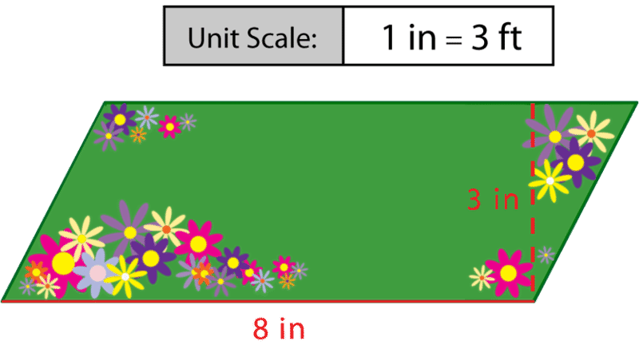

**To work on solving this problem, we need to look at what information is given to us in the drawing.**

We know that the scale says that 1” is equal to 3 feet.

The base of the garden in the drawing is 8” and the height is 3”.

**We want to estimate the area.**

Let’s start by estimating the base. $8 \times 3$. We know that $8 \times 3$ is 24. This gives us a total of 24 feet for the base of the garden.

Let’s estimate the height. $3 \times 3$. We know that $3 \times 3 = 9$. The height of the garden is about 9 feet.

**Next, we estimate the area of the garden.**

24 rounds down to 20 and 9 rounds up to 10

$20 \times 10 = 200 \ square \ feet$

**How close it our estimate?**

Let’s do the actual multiplying to figure this out.

$24 \times 9 = 216 \ square \ feet$

**We have an estimate that is reasonable.**

V. **Solve Real-World Problems Involving the Area of a Parallelogram**

We have seen that we can apply the formula for finding the area of parallelograms to different kinds of situations. Sometimes we need to solve for the area, but other times we may need to find the height or the base. We can also use this formula when we are given real measurements. Let’s try a few problems involving parallelograms in the real world.

Mrs. Vasquez is buying new carpet to redecorate her parallelogram-shaped store. To determine how much carpet she needs, she measured the length of the room and found it was 36 meters. Then she measured across the room with a line perpendicular to the first and found it was 16 meters across. How many square meters of carpet does Mrs. Vasquez need to buy?

**Let’s begin by figuring out what the problem is asking us to find. We need to find how much carpet Mrs. Vasquez needs to cover the floor of her store, so we have to find the area of the store. That means we will use the area formula to solve for A. In order to use the formula, we need to know the base and height of the store.**

**We know that one side of the store will be 36 meters. Let’s call this the base. We also know that Mrs. Vasquez made a perpendicular line in order to measure the height, or the distance across the room. The height given in the problem is 16 meters. Let’s put this information into the formula and solve for area.**

$$
\begin{align*}
A & =  bh\\
A  & =  36(16) \\
A  & =  576 \ m^2
\end{align*}
$$

**Mrs. Vasquez will need to buy 576 square meters of carpet.**

Example

Christie is making a banner for the school talent show in the shape of a parallelogram. She used 59.5 square yards of paper. If the base of the banner is 17 yards, what is its height?

**First, let’s make sure we understand the question in the problem. We need to find the height of the parallelogram. This time we are given the area and the base. As we’ve seen, we simply put these numbers into the formula and solve for the height, $h$.**

$$
\begin{align*}
A  &=  bh\\
59.5  &=  17h\\
59.5  \div  17  &=  h\\
3.5 \ yd  &=  h
\end{align*}
$$

**The height of the banner is 3.5 yards.**

**As long as we have any two pieces of the area formula, we can solve for the third.**

**Now let’s look at applying what we have learned about parallelograms and area to solve the problem from the introduction.**

Real–Life Example Completed
---------------------------

**_Go Wildcats!_**

One afternoon, Miguel’s assignment is to hang a banner in the stadium. The banner says “Go Wildcats” and is the shape of a parallelogram with a yellow background and dark blue border. He has two different places that he can put it. One spot is only 11 feet wide and one spot is 13 feet wide.

Miguel isn’t sure which spot is the best for the “Go Wildcats” banner. Wherever he chooses to hang the banner it needs to fit with a little space on each side so that people don’t bump it as they go past.

The banner is rolled up in a tube. Miguel looks at the label to see that the square footage of the banner is 42 square feet. The height of the banner is 3.5 feet. The length of the banner is missing. It seems to have been covered up with a shipping label.

Miguel is a bit frustrated. He isn’t sure that he has enough information to figure out the length of the banner. He knows that he needs to figure out the length of the banner in order to choose the correct spot to hang it. Miguel takes out a piece of paper to try to figure things out.

**To start working on this problem, we can use the formula for finding the area of a parallelogram.**

$A = bh$

**Next, we can fill in the area and the height. The base is the length of the parallelogram and that is unknown.**

$42=b(3.5)$

**Now to solve for $b$, we divide both sides by 3.5.**

$$
\begin{align*}
42 \div 3.5 &= 12\\
b&=12 \ feet
\end{align*}
$$

**The length of the banner is 12 feet. Given this length, Miguel should put it in the spot that is 13 feet wide.**

Vocabulary
----------

Here are the vocabulary words that are found in this lesson.

__Parallelogram__

a quadrilateral with opposite sides parallel.

__Perimeter__

the distance around a figure.

__Area__

the amount of space contained inside a two-dimensional figure.

__Scale Drawing__

a drawing of a life size image where the drawing is made smaller than the actual image using a scale.

Technology Integration
----------------------

!?[0](https://www.youtube.com/watch?v=tFhBAeZVTMw)

[James Sousa, Khan Academy, Area of a Parallelogram](http://www.youtube.com/watch?v=tFhBAeZVTMw)

Other Videos:

1.  http://www.mathplayground.com/howto_sameareadiffperimeter.html – This is a basic video to help students understand the difference between area and perimeter.

Time to Practice
----------------

Directions: Find the area of each parallelogram given the base and the height.

1. Base = 9 inches, height = 5 inches

2. Base = 4 inches, height = 3 inches

3. Base = 12 feet, height = 6 feet

4. Base = 11 meters, height = 8 meters

5. Base = 13 yards, height = 10 yards

6. Base = 4 feet, height = 2.5 feet

7. Base = 5.5 inches, height = 3.5 inches

8. Base = 9 feet, height = 6.5 feet

9. Base = 22 miles, height = 18 miles

10. Base = 19 meters, height = 15 meters

Directions: Given the area and one dimension, find the missing dimension.

11. Base = 9 feet, area = 45 sq. ft.

12. Base = 8 in, area = 20 sq. in.

13. Base = 11 feet, area = 99 sq. feet

14. Base = 12 inches, area = 120 sq. inches

15. Base = 4.5 feet, area = 11.25 sq. ft.

16. Height = 3 inches, area = 36 sq. inches

17. Height = 4 feet, area = 72 sq. feet

18. Height = 5 meters, area = 80 sq. meters

Directions: Solve each problem.

19. A parallelogram has an area of 390 square centimeters. If its height is 15 cm, what is its base?

20. What is the height of a parallelogram whose base is 28 inches and area is 1,176 square inches?

21. Donna wants to cover her parallelogram-shaped crafts box in fabric. The base of the lid is 32.7 cm and the height is 12.2 cm. What is the area of the lid?

22. John is planting grass in a patch of lawn that is shaped like a parallelogram. The height of the parallelogram is 34 feet. The other border is 65 feet. How many square feet of grass will John plant?

23. Kara and Sharice are in a quilting competition. Both are stitching parallelogram-shaped quilts. So far Kara’s has an area of 2,278 square inches and a height of 44 inches. Sharice’s quilt has an area of 2,276 square inches and a height of 47 inches. Whose quilt is longer? By how many inches is it longer?

24. Denise bought a picture frame in the shape of a parallelogram. The area of the picture frame is 36,795 square centimeters. If its height is 165 centimeters, what is its base?

</article>

### 9.5 Areas of Triangles

<article>

Introduction
------------

**_Figuring out Home_**

He watches them slide in and run across it.

“Home plate is such an interesting shape,” he thinks to himself one day.

He decides to do a little research on the design of home plate. Here is what he finds out.

Home plate is a pentagon which can be divided up. The base of home plate is 17 inches wide. The sides of home plate are each 8.5 inches. The distance from the tip of home plate to the base is also 17 inches.

Miguel thinks that this is very interesting information. He wonders if he can figure out the area of the figure. It is made up of a rectangle and a triangle.

**As Miguel works on this, you work on it too. You know how to find the area of a rectangle already, but what about a triangle?**

**This lesson will teach you how to find the area of a triangle. When finished, you can work on figuring out home.**

**_What You Will Learn_**

By the end of this lesson you will be able to demonstrate the following skills:

* Recognize the formula for area of a triangle.
* Find areas of triangles given base and height.
* Find unknown dimensions of triangles given area and an unknown dimension.
* Find areas of combined figures involving triangles.

**_Teaching Time_**

I. **Recognize the Formula for Area of a Triangle**

In the last lesson we looked at how to find the area of a parallelogram. Here is that formula once again.

$A=bh$

This lesson focuses on the area of a triangle. Remember that a **_triangle_** **is a three sided figure made up of line segments with three sides and three angles.** **_Area_** **is the amount of space inside a two-dimensional figure.** We can find the area of a triangle just like we found the area of a parallelogram. **The really interesting thing is that the area of a triangle is related to the area of a parallelogram.** Take a look at this figure.

**We know that the formula for finding the area of a parallelogram requires us to multiply the base times the height. Well, if a triangle is one-half of a parallelogram, can you figure out the formula for finding the area of a triangle?**

Here it is.

$A= \frac{1}{2} bh$

II. **Find Areas of Triangles Given a Base and a Height**

Now that you can identify formula for finding the area of a triangle, let’s look at using it in problem solving.

Example

Find the area of the triangle below.

$$
\begin{align*}
A  & =  \frac{1}{2} bh\\
A  & = \frac{1}{2} 11(16)\\
A  & = \frac{1}{2} (176) \\
A  & =  88 \ cm^2
\end{align*}
$$

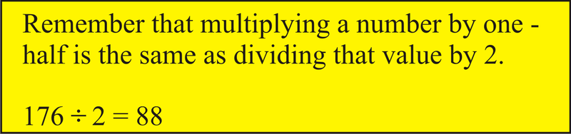

Example

What is the area of the triangle below?

$$
\begin{align*}
A  & = \frac{1}{2} bh \\
A  & = \frac{1}{2} 5(17) \\
A  & = \frac{1}{2} (85) \\
A  & = 42.5 \ cm^2
\end{align*}
$$

The area of this triangle is 42.5 sq. cm. Now it’s time for you to try a few on your own.

**9I. Lesson Exercises**

**Find the area of each triangle.**

1.  **Base = 12 in, height = 6 inches**
2.  **Base = 9 inches, height = 4 inches**
3.  **Base = 11 inches, height = 7 inches**

III. **Find Unknown Dimensions of Triangles Given Area and Another Dimension**

Sometimes a problem will give us the area and ask us to find one of the dimensions of the triangle—either its base or its height. We simply put the information we know in for the appropriate variable in the formula and solve for the unknown measurement. Let’s try an example.

Example

A triangle has an area of $44 \ m^2$. The base of the triangle is 8 m. What is its height?

**In this problem, we know the area and the base of the triangle. We put these numbers into the formula and solve for the height, $h$.**

$$
\begin{align*}
A  & =  \frac{1}{2} bh \\
44  & =  \frac{1}{2} 8h \\
44  \div \frac{1}{2} & = 8h \\
44(2) & =  8h \\
88 & =  8h \\
11 \ m  & =  h
\end{align*}
$$

**_Remember, when you divide by a fraction, you need to multiply by its reciprocal. To divide by one-half then, we multiply by 2. Keep this in mind when you use the area formula._**

By solving for $h$, we have found that the height of the triangle is 11 meters. Let’s check our calculation to be sure. We can check by putting the base and height into the formula and solving for area.

$$
\begin{align*}
A  & = \frac{1}{2} bh \\
A  & = \frac{1}{2} 8(11) \\
A  & = \frac{1}{2}  (88) \\
A  & = 44 \ m^2
\end{align*}
$$

**We know from the problem that the area is $44 \ m^2$, so our calculation is correct.**

Now try a few of these on your own.

**9J. Lesson Exercises**

**Given the area and one other dimension, find the missing dimension.**

1.  **Base = 4 inches, Area = 6 sq. inches, what is the height?**
2.  **Base = 5 feet, Area = 7.5 sq. feet, what is the height?**
3.  **Base = 7 meters, Area = 17.5 sq. meters, what is the height?**

IV. **Find Areas of Combined Figures Involving Triangles**

Now that you know how to find the area of a triangle, you can use that information to figure out the area of figures that are made up of more than one shape. Remember that we could divide a parallelogram into two triangles? If we know the area of the triangles, we can add their areas together to find the area of the parallelogram. We can do this for all kinds of figures. If we can divide the figure into triangles, we can find the area of each triangle and add the areas together.

Also, we have seen that we can apply the formula for finding the area of triangles to different kinds of situations. Sometimes we need to solve for the area, but other times we may need to find the height or the base. We can use information given about a larger figure whenever that information corresponds to the height, base, or area of one of the triangles contained within it. Let’s try an example to get a better idea of how this works.

Example

Find the area of the figure below.

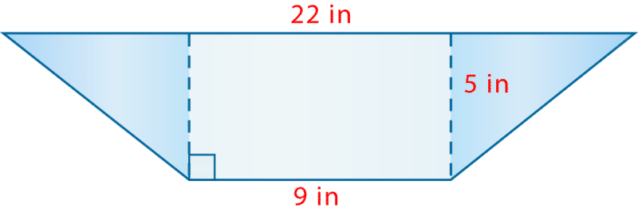

Let’s give it a try.

First, let’s calculate the area of the rectangle in the center. We know the formula for the area of rectangles is $A = lw$. Do we know the length and width of the rectangle? The width is represented by the dashed line. It is 5 inches. The length of the rectangle is the same as the bottom edge of the figure: 9 inches. Let’s put these numbers into the formula and solve for area.

$$
\begin{align*}
A  & =  lw\\
A  & =  9(5)\\
A  & =  45 \ in.^2
\end{align*}
$$

**Now let’s find the area of one of the triangles. We know that the height is 5 inches. What is the base? Look carefully at the figure. We know that its top edge is 22 inches. We also know that the length of the rectangle in the middle is 9 inches. We need to subtract that so we don’t include it as part of the bases of the triangles.**

That means there are $22 - 9 = 13$ inches left of the bottom edge. If we divide this equally, we find that each triangle has a base of 6.5 inches.

Now we have the height and base of each triangle (they have the same height and base), so we can calculate the area.

$$
\begin{align*}
A  & =  \frac{1}{2} bh\\
A  & = \frac{1}{2} 6.5(5)\\
A  & = \frac{1}{2} (32.5)\\
A  & = 16.25 \ in.^2
\end{align*}
$$

**Great! Now we have the area of each shape within the figure. All we have to do is add these together to find the area of the whole figure.**

$$
\begin{align*}
& \text{triangle} \ 1 \qquad \qquad \quad \text{rectangle} \ \qquad \qquad \ \text{triangle}\ 2 \qquad  \quad \qquad \text{whole figure}\\
& 16.25 \ in.^2 \qquad + \qquad 45 \ in.^2 \qquad + \qquad  16.25 \ in.^2 \qquad = \qquad 77.5 \ in.^2
\end{align*}
$$

**The area of the whole figure is 77.5 square inches.**

Example

What is the area of the figure below?

We know that all of the sides of a square are congruent, so we can fill in the measurements for the other two sides, which must also be 2 inches. This gives us the base of each triangle. Do we know the height? Each is 5 inches. We have all the information we need to solve for the areas of the triangles and the square. Let’s calculate the area of each smaller shape.

$$
\begin{align*}
& \text{Square} && \text{Triangle} \ 1 && \text{Triangle} \ 2\\
& A  =  s^2 && A  = \frac{1}{2} bh && A  = \frac{1}{2} bh\\
& A  =  2^2 && A  =  \frac{1}{2} 2(5) && A  =  \frac{1}{2} 2(5)\\
& A  =  4 \ in.^2 && A  = \frac{1}{2} (10) && A  =  \frac{1}{2} (10)\\
& && A  =  5 \ in.^2 && A  =  5 \ in.^2
\end{align*}
$$

**Great! We have found the area of each smaller shape. Let’s add them together to find the area of the whole figure.**

$$
\begin{align*}
& \text{square} \qquad \qquad \quad \text{triangle} \ 1 \qquad \qquad \ \text{triangle} \ 2 \qquad  \quad \qquad \text{whole figure}\\
& 4 \ in.^2 \qquad + \qquad \quad 5 \ in.^2 \qquad \ + \qquad  \quad 5 \ in.^2 \qquad \ = \qquad \quad 14 \ in.^2
\end{align*}
$$

**The area of the whole figure is 14 square inches.**

**Now let’s use what we have learned to help Miguel with his dilemma.**

Real–Life Example Completed
---------------------------

**_Figuring Out Home_**

**Here is the original problem once again. Reread it and underline any important information.**

He watches them slide in and run across it.

“Home plate is such an interesting shape,” he thinks to himself one day.

He decides to do a little research on the design of home plate. Here is what he finds out.

Home plate is a pentagon which can be divided up. The base of home plate is 17 inches wide. The sides of home plate are each 8.5 inches. The distance from the tip of home plate to the base is 17 inches.

Miguel thinks that this is very interesting information. He wonders if he can figure out the area of the figure. It is made up of a rectangle and a triangle.

**Here is a drawing of home plate with its dimensions.**

The length of the rectangle is 17 inches, the width is 8.5

$$
\begin{align*}
A& = 17(8.5)\\
A&=144.5
\end{align*}
$$

**The area of the rectangle is 144.5 square inches.**

**Now let’s look at the triangle. We know that the base of the triangle is 17”. The height of the whole plate is 17 inches, but that includes the rectangle width too. We need to subtract that from the total.**

**17 – 8.5 = 8.5 inches**

**Let’s use our formula to find the area of the triangle.**

$$
\begin{align*}
A & = \frac{1}{2} bh \\
A & = \frac{1}{2}(17)(8.5) \\
A & = \frac{1}{2}(144.5) \\
A & = 72.25
\end{align*}
$$

**Now we add up the two areas.**

$144.5 + 72.25 = 216.75 \ square \ inches$

**This is the approximate measure of home plate.**

**_You can read more about home plate at_** http://wiki.answers.com/Q/What_are_the_dimensions_of_home_plate

Vocabulary
----------

Here are the vocabulary words that are found in this lesson.

__Triangle__

a figure with three sides and three angles.

__Area__

the space enclosed inside a two-dimensional figure.

__Base__

the bottom part of the triangle

__Height__

the length of the triangle from the base to the vertex

Technology Integration
----------------------

!?[0](https://www.youtube.com/watch?v=YOYQys52sPs)

[Khan Academy, Triangle Area Proofs](http://www.youtube.com/watch?v=YOYQys52sPs)

Time to Practice
----------------

Directions: Find the area of each triangle given the base and height.

1. Base = 9 in, height = 4 in

2. Base = 6 in, height = 3 in

3. Base = 7 in, height = 4 in

4. Base = 9 m, height = 7 m

5. Base = 12 ft, height = 10 feet

6. Base = 14 feet, height = 5 feet

7. Base = 14 feet, height = 13 feet

8. Base = 11 meters, height = 8 meters

9. Base = 13 feet, height = 8.5 feet

10. Base = 11.5 meters, height = 9 meters

Directions: Find the missing base or height given the area and one other dimension.

11. Area = 13.5 sq. meters, Base = 9 meters

12. Area = 21 sq. meters, Base = 7 meters

13. Area = 12 sq. meters, Base = 8 meters

14. Area = 33 sq. ft, Base = 11 feet

15. Area = 37.5 sq. ft. Base = 15 feet

16. Area = 60 sq. ft., height = 10 ft.

17. Area = 20.25 sq. in, height = 4.5 in

18. Area = 72 sq. in, height = 8 in

19. Area = 22.5 sq. feet, height = 5 feet

20. Area = 19.25 sq. in, height = 5.5 in

Directions: Solve each problem.

21. Julius drew a triangle that had a base of 15 inches and a height of 11 inches. What is the area of the triangle Julius drew?

22. A triangle has an area of 108 square centimeters. If its height is 9 cm, what is its base?

23. What is the height of a triangle whose base is 36 inches and area is 234 square inches?

24. Tina is painting a triangular sign. The height of the sign is 32 feet. The base is 27 feet. How many square feet will Tracy paint?

</article>

### 9.6 Area of Trapezoids

<article>

Introduction
------------

**_The Bridge_**

One day when Miguel arrived at the bridge there were some workers repairing part of it.

“What are you doing?” he asked.

“We’re restoring this side of the bridge. You know, this is a famous kind of bridge design called a “Whipple Truss Bridge” it is in the shape of a trapezoid,” the first man said.

“Wow, I didn’t know that. How long is it?”

“It is 300 feet long, 40 feet high and the top length is 270 feet.”

“That is pretty cool. Well I have to go. See you later,” Miguel said, riding off.

He kept thinking about that bridge the rest of the day. Later that week, Miguel went to the library and took out a book on the Whipple Truss Bridge and other types of bridges. He has decided to do some investigating.

**If the workmen were fixing one side of the bridge, what is the area that they are fixing? To figure this out, you will need to know how to find the area of a trapezoid. This lesson will teach you everything that you need to know about finding the area of a trapezoid.**

**_What You Will Learn_**

By the end of this lesson, you will be able to complete the following:

* Recognize the formula for area of a trapezoid.
* Find the area of a trapezoid given the bases and the height.
* Find unknown dimensions of a trapezoid given the area and one other dimension.
* Find areas of combined figures involving trapezoids.

**_Teaching Time_**

I. **Recognize the Formula for Area of a Trapezoid**

A trapezoid is a quadrilateral with special properties. **A** **_trapezoid_** **is a four sided figure with one pair of opposite sides parallel. These parallel sides are called the** **_bases_** **of the figure.**

Look at this picture of a trapezoid.

**A trapezoid can be divided into two triangles.**

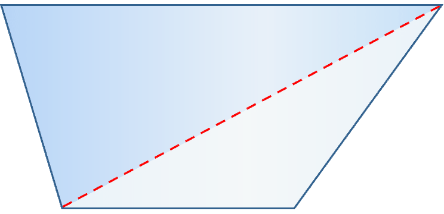

**Remember that** **_area_** **is the amount of space inside a two-dimensional figure.**

We can also see the two triangles here. Because the bases are different, there are two different triangles pictured here.

**How does this all go together?**

As with triangles, one of the dimensions we use to find the area of a trapezoid is its height. The other dimension we use is the base. However, a trapezoid has two bases. We can think of them as the bases of the two triangles within the trapezoid. Therefore we can use the area formula for triangles to help us find a formula for the area of trapezoids. Think about one triangle at a time. Here is the formula.

$A  =  \frac{1}{2}bh$

If we use this formula to represent each triangle within the trapezoid, we can write formula to represent the entire trapezoid.

$A  =  \frac{1}{2} b_1 h   + \frac{1}{2} b_2 h$

In the formula, $b_1$ stands for the base of one triangle and $b_2$ represents the base of the second triangle. We use $h$ to represent the height of each triangle, or the height of the trapezoid.

**We can combine these and write a simpler formula.**

$A  = \frac{1}{2} (b_1 +  b_2)h$

We can also think of $b_1$ and $b_2$ as the parallel sides of the trapezoid. Remember, though, that $h$ is NOT simply one of the slanted sides. The height of a trapezoid is always perpendicular to the bases. As long as we are given the measures of the bases and the height of a trapezoid, we can use this formula to solve for the area, no matter what shape or size the trapezoid is. Now let’s see how this works.

II. **Find the Area of Trapezoids Given Bases and Height**

Now that you understand the formula and where it comes from, we can look at applying it to finding the area of a trapezoid.

Example

Find the area of the trapezoid below.

$$
\begin{align*}
A & =  \frac{1}{2}(b_1 + b_2)h\\
A  & =  \frac{1}{2} (11  +  5) (6) \\
A  & = \frac{1}{2} (16) (6)\\
A  & = 8 (6)\\
A  & = 48 \ cm^2
\end{align*}
$$

Example

What is the area of the trapezoid below?

$$
\begin{align*}
A  & =  \frac{1}{2}(b_1 + b_2)h\\
A  & = \frac{1}{2} (9 + 14) (17)\\
A  & = \frac{1}{2} (23) (17)\\
A  & = 11.5 (17)\\
A  & = 195.5 \ in.^2
\end{align*}
$$

**The area of this trapezoid is 195.5 square inches.**

**9K. Lesson Exercises**

**Find the area of each trapezoid.**

1.  \[Figure 8\]
2.  \[Figure 9\]
3.  \[Figure 10\]

III. **Find Unknown Dimensions of a Trapezoid Given Area and another Dimension**

**Sometimes a problem will give us the area and ask us to find one of the dimensions of the trapezoid—one of its bases or its height. We simply put the information we know in for the appropriate variable in the formula and solve for the unknown measurement.** Let’s try an example.

Example

A trapezoid has an area of $22.5 \ m^2$. The bases of the trapezoid are 6 m and 9 m. What is its height of the trapezoid?

**In this problem, we know the area and the bases of the trapezoid. We put these numbers into the formula and solve for the height, $h$.**

$$
\begin{align*}
A  & =  \frac{1}{2}(b_1 + b_2)h\\
22.5  & =  \frac{1}{2} (6  +  9) h\\
22.5  & =  \frac{1}{2} (15) h\\
22.5  & =  7.5h\\
22.5  \div  7.5 & =  h\\
3 \ m  & =  h
\end{align*}
$$

**By solving for $h$, we have found that the height of the trapezoid is 3 meters.**

**Let’s check our calculation to be sure. We can check by putting the bases and height into the formula and solve for the area that we started with in the original problem.**

$$
\begin{align*}
A  & = \frac{1}{2} (b_1 + b_2)h\\
A  & =  \frac{1}{2} (6  +  9) (3)\\
A  & =  \frac{1}{2} (15) (3)\\
A  & =  7.5 (3)\\
A  & =  22.5 \ m^2
\end{align*}
$$

**We know from the problem that the area is $22.5 \ m^2$, so our calculation is correct.**

Example

The area of a trapezoid is 98 square yards. Its height is 7 yards and one of its bases is 16 yards. Find the measure of its other base.

**This time we know the area of the trapezoid, its height, and one of its bases. We can put these into the formula and solve for the second base, $b_2$.**

$$
\begin{align*}
A  & = \frac{1}{2} (b_1 +  b_2)h\\
98  & =  \frac{1}{2} (16  +  b_2) (7)\\
98 \div 7  & = \frac{1}{2} (16  +  b_2) \qquad \text{Divide both sides by} \ 7.\\
14  & = \frac{1}{2} (16  +  b_2)\\
14  & = \frac{1}{2} (16)  +  \frac{1}{2} (b_2) \ \ \text{Use the Distributive Property to multiply by} \ \frac{1}{2}\\
14  & =  8  +  \frac{1}{2} (b_2)\\
14  -  8  & =  \frac{1}{2} (b_2) \qquad \qquad \ \text{Subtract} \ 8 \ \text{from both sides.}\\
6  & = \frac{1}{2} (b_2)\\
6 \times 2  & =  b_2\\
12 \ yd  & =  b_2
\end{align*}
$$

**Whew! Let’s walk through what we did!**

**Remember that we need to isolate $b_2$. To do so, we perform inverse operations on each side of the equation. First we divided both sides by 7. Then we subtracted 8 from both sides. By isolating $b_2$ we found that the second base of the trapezoid is 12 yards.**

**Again, let’s use the formula to check our work.**

$$
\begin{align*}
A  & =  \frac{1}{2} (b_1 +  b_2)h\\
A  & =  \frac{1}{2} (12  +  16) (7)\\
A  & =  \frac{1}{2} (28) (7)\\
A  & =  14 (7)\\
A  & =  98 \ yd^2
\end{align*}
$$

**Our calculation is correct!**

**Whenever we are given information about a trapezoid, we can use the formula for area to find the unknown measurement.**

IV. **Find Areas of Combined Figures Involving Trapezoids**

**We mentioned that we can use trapezoids to find the area of larger figures. Remember that we could divide a trapezoid into two triangles? If we know the area of the triangles, we can add their areas together to find the area of the trapezoid.**

We can do this for all kinds of figures. If we can divide the figure into trapezoids, for example, we can find the area of each trapezoid and add the areas together.

Also, we have seen that we can apply the formula for finding the area of trapezoids to different kinds of situations. Sometimes we need to solve for the area, but other times we may need to find the height or the base. We can use information given about a larger figure whenever that information corresponds to the height, bases, or area of one of the trapezoids contained within it. Let’s try an example to get a better idea of how this works.

Example

Find the area of the figure below.

. If we can find the area of each of these, we can add them together to find the area of the whole figure. Let’s give it a try.")

The height of each trapezoid is 5 inches and the longer base is 20 inches. What is the length of the shorter base? Look carefully. It is 13 inches. We can use these measurements to solve for the area of each trapezoid.

$$
\begin{align*}
A  & =  \frac{1}{2} (b_1 + b_2)h\\
A  & = \frac{1}{2} (13  +  20) (5)\\
A  & = \frac{1}{2} (33) (5)\\
A  & =  16.5 (5)\\
A  & =  82.5 \ in.^2
\end{align*}
$$

Great! Now we know that each trapezoid has an area of 82.5 square inches. This is exactly half the area of the hexagon. We need to add the area of the two trapezoids together to find the area of the hexagon. Or, because the trapezoids have the same area, we can multiply by 2.

$82.5 \ in.^2   +   82.5 \ in.^2     =   165 \ in.^2$

**This is our answer.**

**Anytime you are working with figures that are combined, we can break them down into simpler parts, find each area and then find the sum of the areas!!**

**Now let’s go back to the problem in the introduction!**

Real–Life Example Completed
---------------------------

**_The Bridge_**

Every day when Miguel rides his bike to the ball field at the University, he rides over a bridge. Since he sees it everyday, he usually doesn’t even think about it. He just rides his bike and ends up at the University.

One day when Miguel arrived at the bridge there were some workers repairing part of it.

“What are you doing?” he asked.

“We’re restoring this side of the bridge. You know, this is a famous kind of bridge design called a “Whipple Truss Bridge” it is in the shape of a trapezoid,” the first man said.

“Wow, I didn’t know that. How long is it?”

“It is 300 feet long, 40 feet high and the top length is 270 feet.”

“That is pretty cool. Well I have to go. See you later,” Miguel said, riding off.

He kept thinking about that bridge the rest of the day. Later that week, Miguel went to the library and took out a book on the Whipple Truss Bridge and other types of bridges. He has decided to do some investigating.

**To find the area of the trapezoid of the bridge, we need the dimensions for one side. The bases are 300 feet and 270 feet. The height is 40 feet.**

**Now we can substitute these values into our formula and solve.**

$$
\begin{align*}
A & = \frac{1}{2} (base+base)h\\
A&=\frac{1}{2}(300+270)(40)\\
A&=\frac{1}{2}(570)(40)\\
A&=\frac{1}{2}(22,800) \\
A&=11,400
\end{align*}
$$

**The area of one side of the bridge is 11,400 square feet.**

Vocabulary
----------

Here are the vocabulary words that are found in this lesson.

__Trapezoid__

a figure with four sides and one pair of opposite sides parallel.

__Area__

the space inside a two-dimensional figure.

__Bases__

of a trapezoid are the two parallel sides

__Height__

the measurement inside the trapezoid from base to base

Technology Integration
----------------------

!?[0](https://www.youtube.com/watch?v=qAs50nzzrP4)

[Khan Academy, Area of Trapezoids](http://www.youtube.com/watch?v=qAs50nzzrP4)

Other Videos:

1.  http://www.mathplayground.com/howto_area_trapezoid.html – This is a great video that teaches you how to find the area of a trapezoid.

Time to Practice
----------------

Directions: Given the bases and the height, find the area of each trapezoid.

1. Base = 12 in, Base = 8 in, Height = 6 in

2. Base = 10 ft, Base = 6 ft, Height = 4 ft.

3. Base = 14 m, Base = 12 m, Height = 10 m

4. Base = 16 m, Base = 14 m, Height = 12 m

5. Base = 8 in, Base = 10 in, Height = 6 in.

6. Base = 7 ft., Base = 11 ft, Height = 5 ft.

7. Base = 9 ft., Base = 7 ft, Height = 6 ft.

8. Base = 4 in, Base = 6 in, Height = 3 in

9. Base = 6 in, Base = 5 in, Height = 2.5 in

10. Base = 7 in, Base = 9 in, Height = 3.5 in

Directions: Find the missing dimension in each example.

11. Base = 10 in, Base = 8 in, Area = 36 sq. in, What is the height?

12. Base = 12 m, Base = 10 m, Area = 88 sq. m. What is the height?

13. Base = 14 ft, Base = 12 ft, Area = 117 sq. ft. What is the height?

14. Base = 5 m, Base = 3 m, Area = 8 sq. m What is the height?

15. Base = 8 ft, Base = 6 ft, Area = 17.5 sq. ft. What is the height?

16. Base = 11 m, Base = 9 m, Area = 60 sq. m. What is the height?

Directions: Solve each problem.

17. Julius drew a trapezoid that had bases of 15 and 11 inches and a height of 4 inches. What is the area of the trapezoid Julius drew?

18. What is the height of a trapezoid whose bases are 14 inches and 19 inches and area is 99 square inches?

19. A trapezoid has an area of 247.5 square centimeters. If one base is 20 cm and its height is 9 cm, what is the measure of its other base?

</article>

### 9.7 Circumference of a Circle

<article>

Introduction
------------

**_Pitchers on Deck_**

Miguel has three different on deck pads that he is working with. The coach has asked him to measure each one and find the circumference and the area of each.

Miguel knows that the circumference is the distance around the edge of the circle. He decides to start with figuring out the circumference of each circle.

He measures the distance across each one.

The first one measures 4 ft. across.

The second measures 5 ft. across.

The third one measures 6 ft across.

Miguel begins working on his calculations.

**While Miguel does this, it is time for you to learn about circumference. By the end of this lesson you will know how to find the circumference of each of the circles just like Miguel does.**

**_What You Will Learn_**

By the end of this lesson, you will understand how to use the following skills:

* Recognize the formula for the circumference of a circle.
* Find the circumference of a circle given the radius or diameter.
* Find the diameter or radius given the circumference.
* Solve real world problems involving the circumference of circles.

**_Teaching Time_**

I. **Recognize the Formula for the Circumference of a Circle**

In the introduction, the word “circumference” was used. Circumference is a word associated with circles. **A** **_circle_** **is a figure whose edge is made of points that are all the same distance from the center.** This lesson is all about the circumference of circles. Let’s begin by taking a look at what we mean when we use that word. **The** **_circumference_** **of a circle is the distance around the outside edge of a circle.**

With other figures, we could find the perimeter of the circle. **The** **_perimeter_** **is the distance around a polygon.** Circles are not polygons because they are not made up of line segments. When we were finding the perimeter of a polygon, we found the sum of the outer edges.

**Circles are quite different. We can’t add up the measurement of the edges, because there aren’t any. To understand circumference, we have to begin by looking at the parts of a circle.**

**What are the parts of a circle?**

**Now we know the basics of circles: the radius, the diameter, and the circumference. Let’s see how we can use these elements in a formula to find the circumference of a circle.**

**Let’s think about the relationship between the diameter and the circumference.**

Think about circles that are drawn on a playground. There are many different sizes and shapes of them. If we were to draw one circle with chalk, that circle would have a diameter and a circumference. If we were to draw a circle around the outside of this other circle, it would have a longer diameter and therefore it would have a larger circumference.

**There is a relationship between the size of the diameter and the size of the circumference.**

**What is this relationship?**

**It is a proportional relationship that is expressed as a ratio.** A ratio simply means that two numbers are related to each other. **Circles are special in geometry because this ratio of the circumference and the diameter always stays the same.**

Take a look at these two examples.

$$
\begin{align*}
\frac{\text{circumference}}{\text{diameter}} \quad = \quad \frac{6.28}{2} \quad  = \quad 3.14  && \frac{\text{circumference}}{\text{diameter}} \quad = \quad \frac{12.56}{4} \quad = \quad 3.14
\end{align*}
$$

Even though we have two different circles, the result is the same! **Therefore the circumference and the diameter always exist in equal proportion, or a ratio, with each other. This relationship is always the same. Whenever we divide the circumference by the diameter, we will always get 3.14. We call this number** **_pi_****, and we represent it with the symbol $\pi$.** _Pi_ is actually a decimal that is infinitely long—it has no end. We usually round it to 3.14 to make calculations easier.

**Using the equations above, we can write a general formula that shows the relationship between** **_pi_****, circumference, and diameter.**

$\frac{C}{d}= \pi$

**If we rearrange this formula, we can also use it to find the circumference of a circle when we are given the diameter.**

$C  =  \pi d$

**We can use this formula to find the circumference of any circle. Remember, the number for $\pi$ is always the same: 3.14. We simply multiply it by the diameter to get the circumference.**

II. **Find the Circumference of a Circle Given the Radius or Diameter**

Now that you understand the parts of a circle and how the formula for finding the circumference is developed, it is time to put this formula into practice. Let’s look at using it to figure out the circumference of a circle.

Example

Find the circumference of the circle below.

$$
\begin{align*}
C  & = \pi d\\
C  & =  \pi (8)\\
C  & =  25.12 \ in.
\end{align*}
$$

**The circumference of a circle that has a diameter of 8 inches is 25.12 inches. In other words, if we could unroll the circle into a flat line, it would be 25.12 inches long.**

Let’s try another.

Example

What is the area of the circle below?

$$
\begin{align*}
C  & =  \pi d\\
C  & =  \pi (12.7)\\
C  & =  39.88 \ m
\end{align*}
$$

**We can say that a circle with a diameter of 12.7 meters has a circumference of approximately 39.88 meters.**

**What if we had been given the radius and not the diameter?**

Well, the radius is one-half as long as the diameter. So we can multiply the radius by 2 and end up with the same measure as the diameter. Here is how we can alter the formula when given a radius.

$C=2\pi r$

Now let’s try it out with an example.

Example

Find the circumference of the following circle.

$$
\begin{align*}
C&=2 \pi (3) \\
C&=2(3.14)(3) \\
C&=3.14(6) \\
C&=18.84 \ inches
\end{align*}
$$

**This is our answer.**

Now it’s time for you to try a few on your own.

**9L. Lesson Exercises**

**Find the circumference of each circle given the radius or diameter.**

1.  $d = 5 \ in$
2.  $r = 3.5 \ in$
3.  $d = 10 \ ft$.

III. **Find the Diameter or Radius Given the Circumference**

**Sometimes a problem will give us the circumference of a circle and ask us to find either its diameter or its radius. We can still use the formula for circumference. All we have to do is put the information we have into the appropriate place in the formula and solve for the unknown quantity.**

Let’s try an example.

Example

A circle has a circumference of 20.72 m. What is its diameter?

**In this problem, we are given the circumference and we need to find the diameter. We put these numbers into the formula and solve for $d$.**

$$
\begin{align*}
C  & = \pi d\\
20.72  & = \pi d\\
20.72  \div  \pi &=  d\\
6.6  & = d
\end{align*}
$$

**By solving for $d$, we have found that the diameter of the circle is 6.6 meters.**

Let’s check our calculation to be sure. We can check by putting the diameter into the formula and solving for the circumference:

$$
\begin{align*}
C  & = \pi d\\
C  & =  \pi (6.6)\\
C  & =  20.72 \ m
\end{align*}
$$

**We know the circumference is 20.72 meters, so our calculation is correct.**

Example

The circumference of a circle is 147.58 yards. Find its radius.

**Again, we have been given the circumference. Read carefully! This time we need to find the radius, not the diameter. We can use the formula for radii and solve for $r$.**

$$
\begin{align*}
C  & =  2 \pi r\\
147.58  & =  2 \pi r\\
147.58  & =  6.28r\\
147.58  \div  6.28  & =  r\\
23.5 \ yd  & =  r
\end{align*}
$$

**We have found that the circle has a radius of 23.5 yards.**

This time let’s try checking our work by using the other formula to find the diameter. Remember the diameter is twice the length of the radius.

$$
\begin{align*}
C & = \pi d\\
147.58  & =  \pi d\\
147.58  \div \pi  & =  d\\
47 \ yd & =  d
\end{align*}
$$

**We have found that the diameter of the circle is 47 yards. The radius must be half this length, or $47 \div 2 = 23.5$ yards.**

**Our calculation is correct!**

Whenever we are given the circumference, we can use the formula to solve for the diameter or the radius. The number for _pi_ always stays the same, so we only need one piece of information about a circle to find the other measurement.

**9M. Lesson Exercises**

**Find the missing dimension.**

1.  **The circumference is 28.26 inches. What is the diameter?**
2.  **The circumference is 21.98 feet. What is the radius?**
3.  **The circumference is 34.54 meters. What is the diameter?**

IV. **Solve Real World Problems Involving the Circumference of Circles**

We have seen that we can apply the formula for finding the circumference of circles to different kinds of situations. Sometimes we need to solve for circumference, but other times we may need to find the diameter or the radius. We can also use this formula when we are given real measurements. Let’s try a few problems involving circles in the real world.

Samuel baked a pie in a 9-inch pie pan. What is the circumference of the pie?

Let’s begin by figuring out what the problem is asking us to find. We need to find the circumference of the pie, so we will use the formula to solve for $C$. In order to use the formula, we need to know either the diameter or the radius of the pie. The problem tells us that the diameter of the pie is 9 inches. Let’s put this information into the formula and solve for the circumference.

$$
\begin{align*}
C  & = \pi  d\\
C  & =  \pi (9)\\
C  & =  28.26 \ in.
\end{align*}
$$

**The circumference of the pie is 28.26 inches.**

Good job! Let’s move on.

Example

Maria wants to paste some ribbon around a circular mirror to make a border. The mirror is 40 inches across. If the ribbon is sold by the inch and costs $0.15 per inch, how much will Maria need to spend to buy enough ribbon?

**What is this problem asking us to find? We need to find how much money Maria will spend on the ribbon.**

**In order to determine this, we first need to know how much ribbon is necessary to go around the mirror. Therefore we need to find the circumference of the mirror. We know that it is 40 inches across. Is this the radius or the diameter? It is the diameter, so we can put this information into the formula and solve for the circumference.**

$$
\begin{align*}
C  & = \pi d\\
C  & =  \pi (40)\\
C  & =  125.6 \ in.
\end{align*}
$$

**The circumference of the mirror is 125.6 inches, so Maria will need 125.6 inches of ribbon to put around it.**

**We’re not done yet, however. Remember, we need to find how much money she will spend to buy the ribbon.**

Because the ribbon is sold by the inch, Maria will need to buy 126 inches. We know that it is sold at $0.15 an inch, so we simply multiply the number of inches by the cost per inch.

$126 \ inches  \times  \$ 0.15 \ per \ inch  =  \$ 18.90$

**Maria will need to spend $18.90 in order to buy enough ribbon to go around her mirror.**

**Now let’s go back to Miguel and the baseball dilemma.**

Real–Life Example Completed
---------------------------

**_Pitchers on Deck_**

**Here is the original problem once again. Reread it and underline any important information.**

Miguel has three different on deck pads that he is working with. The coach has asked him to measure each one and find the circumference and the area of each.

Miguel knows that the circumference is the distance around the edge of the circle. He decides to start with figuring out the circumference of each circle.

He measures the distance across each one.

The first one measures 4 ft. across.

The second measures 5 ft. across.

The third one measures 6 ft across.

Miguel begins working on his calculations.

**Let’s start with the first on deck pad. It measures 4 feet across. That is our diameter. We multiply that times 3.14 to find the circumference.**

$$
\begin{align*}
C&=\pi d\\
C&=3.14(4)\\
C&=12.56 \ ft
\end{align*}
$$

**Next, we work on the on deck pad with a diameter of five feet.**

$$
\begin{align*}
C&=\pi d\\
C&=3.14(5)\\
C&=15.7 \ ft
\end{align*}
$$

**Finally we work on the on deck pad with a diameter of 6 feet.**

$$
\begin{align*}
C&=\pi d\\
C&=3.14(6)\\
C&=18.84 \ ft
\end{align*}
$$

**Miguel jots down these dimensions. Now he is ready to figure out the area of each on deck pad.**

Vocabulary
----------

Here are the vocabulary words found in this lesson.

__Circumference__

the distance around the outside edge of a circle.

__Perimeter__

the distance around the edge of a polygon.

__Circle__

a series of connected points equidistant from a center point.

__Radius__

the distance halfway across a circle.

__Diameter__

the distance across the center of circle.

__Pi__

the ratio of circumference to diameter, 3.14

__Ratio__

a comparison between two quantities

Technology Integration
----------------------

!?[0](https://www.youtube.com/watch?v=WgW_KwtBvro)

[Khan Academy Circumference of a Circle](http://www.youtube.com/watch?v=WgW_KwtBvro)

!?[0](https://www.youtube.com/watch?v=sHtsnC2Mgnk)

[James Sousa, Determine the Circumference of a Circle](http://www.youtube.com/watch?v=sHtsnC2Mgnk)

Other Videos:

1.  http://www.mathplayground.com/mv_circumference.html – This is a Brightstorm video about how to calculate the circumference of a circle.

Time to Practice
----------------

Directions: Find the circumference of each circle given the radius or the diameter.

1. radius = 2 in

2. diameter = 4 ft

3. radius = 4.5 in

4. diameter = 8 meters

5. radius = 12 inches

6. diameter = 12 mm

7. radius = 14 mm

8. diameter = 13 feet

9. radius = 10 inches

10. diameter = 7.5 feet

Directions: Given the circumference, find the diameter.

11. Circumference = 15.7 ft.

12. Circumference = 20.41 in

13. Circumference = 21.98 m

14. Circumference = 4.71 cm

15. Circumference = 47.1 ft

Directions: Given the circumference, find the radius.

16. Circumference = 43.96 in

17. Circumference = 15.7 m

18. Circumference = 14.13 in

19. Circumference = 20.41 cm

20. Circumference = 12.56 ft.

Directions: Solve each problem.

21. What is the circumference of a circle whose diameter is 32.5 meters?

22. A circle has a radius of 67 centimeters. What is its circumference?

23. What is the circumference of a circle whose radius is 7.23 feet?

24. What is the diameter of a circle whose circumference is 172.7 inches?

25. A circle has a circumference of 628 centimeters. What is the radius of the circle?

26. The circumference of a circular table is 40.82 feet. What is the radius?

27. Workers at the zoo are building five circular pens for the elephants. Each pen has a diameter of 226 meters. How much fence will the workers need in order to surround all five pens?

28. Mrs. Golding has a circular mirror with a frame around it. The frame is 4 inches wide. If the diameter of the mirror and the frame together is 48 inches, what is the circumference of just the mirror?

29. Terrence swam around the edge of a circular pool and found that it took him 176 strokes to swim one complete time around the pool. About how many strokes will it take him to swim across the pool?

</article>

### 9.8 Area of Circles

<article>

Introduction
------------

**_The On Deck Pads_**

Miguel’s latest task is to measure some different “on deck” pads for the pitchers to practice with. An on deck pad is a circular pad that is made up of a sponge and some fake grass. Pitchers practice their warm-ups while standing on them. They work on stretching and get ready to “pitch” the ball prior to their turn on the mound.

Miguel has three different on deck pads that he is working with. The coach has asked him to measure each one and find the circumference and the area of each.

Miguel knows that the circumference is the distance around the edge of the circle. He decides to start with figuring out the circumference of each circle.

He measures the distance across each one.

The first one measures 4 ft. across.

The second measures 5 ft. across.

The third one measures 6 ft across.

Miguel has completed the first part of this assignment. He knows the circumference of each pad. Now he has to figure out the area of each. Miguel isn’t sure how to do this. He can’t remember how to find the area of a circle. Miguel needs some help.

**This lesson will help you learn how to find the area of a circle. When finished, we’ll come back to this problem and you can help Miguel figure out the area of each on deck pad.**

**_What You Will Learn_**

By the end of this lesson, you will be able to demonstrate the following skills:

* Recognize the formula for the area of a circle.
* Find the area of circles given radius or diameter.
* Find radius or diameter given area.
* Find areas of combined figures involving parts of circles.

**_Teaching Time_**

I. **Recognize the Formula for the Area of a Circle**

In the last lesson you learned how to calculate the circumference of a circle. Let’s take a few minutes to review the terms associated with circles.

**A** **_circle_** **is a set of connected points equidistant from a center point. The** **_diameter_** **is the distance across the center of the circle and the** **_radius_** **is the distance from the center of the circle to the edge.**

**We also know that the number** **_pi, $\pi$,_** **is the ratio of the diameter to the circumference. We use 3.14 to represent pi in operations.**

What does all of this have to do with area?

Well, to find the **_area_** of a two-dimensional figure, we need to figure out **the measurement of the space contained inside.** This is the measurement of area. This is also the measurement inside a circle. You learned how to find the radius of a circle, given circumference or diameter. now let’s look at using the radius to find the area of the circle.

**How do we find the area of a circle?**

The area of a circle is found by taking the measurement of the radius, squaring it and multiplying it by pi.

Here is the formula.

$A= \pi r^2$

II. **Find the Area of Circles Given the Radius or Diameter**

We already know that the symbol $\pi$ represents the number 3.14, so all we need to know to find the area of a circle is its radius. We simply put this number into the formula in place of $r$ and solve for the area, $A$.

Let’s try it out.

Example

What is the area of the circle below?

$$
\begin{align*}
A  & = \pi r^2\\
A  & = \pi (12)^2\\
A  & =  144 \ \pi\\
A  & =  452.16 \ cm^2
\end{align*}
$$

**_Remember that squaring a number is the same as multiplying it by itself._**

**The area of a circle with a radius of 12 centimeters is 452.16 square centimeters.**

Some students have formed a circle to play dodge ball. The radius of the circle is 21 feet. What is the area of their dodge ball circle?

$$
\begin{align*}
A  & = \pi r^2\\
A  & = \pi (21)^2\\
A  & =  441 \ \pi\\
A  & =  1,384.74 \ ft^2
\end{align*}
$$

**Notice that a circle with a larger radius of 21 feet has a much larger area than the circle with a 12 centimeter radius: 1,384.74 square feet.**

**Sometimes, you will be given a problem with the diameter and not the radius. When this happens, you can divide the measurement of the diameter by two and then use the formula.**

Example

Find the area of a circle with a diameter of 10 in.

**First, we divide the measurement in half to find the radius.**

$10 \div 2 = 5 \ in$

**Now we use the formula.**

$$
\begin{align*}
A & = \pi r^2 \\
A& = 3.14(5^2) \\
A&=3.14 (25) \\
A&=78.5 \ square \ inches
\end{align*}
$$

**This is our answer.**

**9N. Lesson Exercises**

**Find the area of each circle.**

1.  **Radius = 9 inches**
2.  **Radius = 11 inches**
3.  **Diameter = 8 ft.**

III. **Find the Radius or Diameter Given the Area**

We have seen that when we are given the radius or the diameter of a circle, we can find its area. We can also use the formula to find the radius or diameter if we know the area. Let’s see how this works.

Example

The area of a circle is 113.04 square inches. What is its radius?

**This time we know the area and we need to find the radius. We can put the number for area into the formula and use it to solve for the radius, $r$.**

$$
\begin{align*}
A  & = \pi r^2\\
113.04  & = \pi r^2\\
113.04  \div \pi & =  r^2\\
36  & = r^2\\
\sqrt{36} & = r \\
6 \ in.  & =  r
\end{align*}
$$

**Let’s look at what we did to solve this.** To solve this problem we needed to isolate the variable $r$. First, we divided both sides by $\pi$, or 3.14. Then, to remove the exponent, we took the square root of both sides. A square root is a number that, when multiplied by itself, gives the number shown. We know that 6 is the square root of 36 because $6 \times 6 = 36$.

**The radius of a circle with an area of 113.04 square inches is 6 inches.**

Example

What is the diameter of a circle whose area is $379.94 \ cm^2$?

**What is this problem asking us to find? We need to find the diameter (not the radius!). What information is given in the problem? We know the area. Therefore we can use the formula to solve for the radius, $r$. Once we know the radius, we can find the diameter.** Let’s give it a try.

$$
\begin{align*}
A  & = \pi r^2\\
379.94  & = \pi r^2\\
379.94  \div \pi & = r^2\\
121  & =  r^2\\
\sqrt{121} & = r\\
11 \ cm  & =  r
\end{align*}
$$

**The radius of a circle with an area of 379.94 square centimeters is 11 centimeters.**

**Remember, this problem asked us to find the diameter, so we’re not done yet. How can we find the diameter?**

**The diameter is always twice the length of the radius, so the diameter of this circle is $11 \times 2 = 22$ centimeters.**

As we have seen, we can use the area formula with lots of kinds of information about a circle. If we know the diameter or radius, we can solve for the area, $A$. If we are given the area, we can solve for the radius, $r$. If we know the radius, we can also find the diameter.

**9O. Lesson Exercises**

**Find the radius of each circle.**

1.  **Area = 153.86 sq. in.**
2.  **Area = 354.34 sq. ft.**
3.  **452.16 sq. m**

IV. **Find Areas of Combined Figures Involving Parts of Circles**

Sometimes we may be asked to find the area of a combined figure. Combined figures often include portions of circles, such as a quarter or semicircle (which is a half circle). We can find the area of combined figures by breaking them down into smaller shapes and finding the area of each piece.

We can calculate the area of a portion of a circle. As long as we know the radius of the circle, we can find its area. Then we can divide that area into smaller pieces or subtract a portion to find the area of part of the circle. Let’s try this out.

Example

What is the area of the figure below?

We sure can! The radius of the circle must be $17 \div 2 = 8.5$ inches. Now let’s use the formula to solve for area.

$$
\begin{align*}
A  & = \pi r^2\\
A  & = \pi (8.5)^2\\
A  & =  72.25 \ \pi\\
A  & =  226.87 \ in.^2
\end{align*}
$$

**We know that a whole circle with a radius of 8.5 inches (and a diameter of 17 inches) is 226.87 square inches. Therefore the semicircle figure has an area of $226.87 \div 2 = 113.44$ square inches.** As long as we can find the area of a whole circle, we can divide or subtract to find the area of a portion of a circle.

Now let’s look at a combined figure.

Example

Find the area of the figure below.

Let’s start with the rectangle.

$$
\begin{align*}
A&=lw\\
A&=6(8)\\
A&=48
\end{align*}
$$

**The area is 48 square inches for the rectangle.**

Now let’s look at the semi-circle. If the diameter is the width which is 6 inches, then the radius is 3 inches. We can find the area of a circle now.

$$
\begin{align*}
A&= \pi r^2 \\
A& =3.14(3^2) \\
A& =3.14(9) \\
A& =28.26 \ sq.inches
\end{align*}
$$

Now this is the area of a whole circle. We only need the area of a semi-circle. Let’s divide this value in half.

The area of the semi-circle is 14.13 square inches.

**Now we add the two areas together.**

**48 +14.13 = 62.13 square inches**

**The area of the entire figure is 62.13 square inches.**

**Now let’s go and use what we have learned to help Miguel figure out the area of each on-deck pad.**

Real–Life Example Completed
---------------------------

**_The On-Deck Pads_**

Do you remember Miguel? He had just finished working on figuring out the circumference of three different on deck pads for the pitchers to use while they warm up. Let’s look at his dilemma again before we look at the area of the pads.

Miguel’s latest task is to measure some different “on deck” pads for the pitchers to practice with. An on deck pad is a circular pad that is made up of a sponge and some fake grass. Pitchers practice their warm-ups while standing on them. They work on stretching and get ready to “pitch” the ball prior to their turn on the mound.

Miguel has three different on deck pads that he is working with. The coach has asked him to measure each one and find the circumference and the area of each.

Miguel knows that the circumference is the distance around the edge of the circle. He decides to start with figuring out the circumference of each circle.

He measures the distance across each one.

The first one measures 4 ft. across.

The second measures 5 ft. across.

The third one measures 6 ft across.

Miguel has completed the first part of this assignment. He knows the circumference of each pad. Now he has to figure out the area of each. Miguel isn’t sure how to do this. He can’t remember how to find the area of a circle. Miguel needs some help.

**Now it’s time to help Miguel figure out each area.**

**The first one has a diameter of 4 feet, so it has a radius of 2 ft. Here is the area of the first pad.**

$$
\begin{align*}
A&= \pi r^2 \\
A&=3.14(2^2) \\
A&=12.56 \ sq.feet
\end{align*}
$$

**The second pad has a diameter of 5 feet, so it has a radius of 2.5 feet.**

$$
\begin{align*}
A& = \pi r^2 \\
A& =3.14(2.5^2) \\
A&=19.63 \ sq.feet
\end{align*}
$$

**The third pad has a diameter of 6 feet, so it has a radius of 3 feet.**

$$
\begin{align*}
A & = \pi r^2 \\
A& = 3.14(3^2) \\
A& = 28.26 \ sq.feet
\end{align*}
$$

**Miguel is very pleased with his work. He is sure that his coach will be pleased with his efforts as well!**

Vocabulary
----------

Here are the vocabulary words that are found in this lesson.

__Circle__

a set of connected points that are equidistant from a center point.

__Diameter__

the distance across the center of a circle.

__Radius__

the distance from the center of the circle to the outer edge.

__Area__

the space inside a two-dimensional figure

Technology Integration
----------------------

!?[0](https://www.youtube.com/watch?v=lDKjX5ouoic)

[Khan Academy Area of a Circle](http://www.youtube.com/watch?v=lDKjX5ouoic)

!?[0](https://www.youtube.com/watch?v=SIKkWLqt2mQ)

[James Sousa, Determine the Area of a Circle](http://www.youtube.com/watch?v=SIKkWLqt2mQ)

Other Videos:

1.  http://www.mathplayground.com/mv_area_circles.html – This is a Brightstorm video on finding the area of a circle.

Time to Practice
----------------

Directions: Find the area of each circle given the radius or diameter.

1. $r = 3 \ in$

2. $r = 5 \ in$

3. $r = 4 \ ft$

4. $r = 7 \ m$

5. $r = 6 \ cm$

6. $r = 3.5 \ in$

7. $d = 16 \ in$

8. $d = 14 \ cm$

9. $d = 20 \ in$

10. $d = 15 \ m$

11. $d = 22 \ cm$

12. $d = 24 \ mm$

Directions: Find each radius given the area of the circle.

13. 12.56 sq. in.

14. 78.5 sq. m

15. 200.96 sq. cm

16. 254.34 sq. in

17. 7.07 sq. ft.

18. 28.26 sq. m

Directions: Find each diameter given the area of the circle.

19. 12.56 sq. in.

20. 78.5 sq. m

21. 200.96 sq. cm

22. 254.34 sq. in

23. 7.07 sq. ft.

24. 28.26 sq. m

Directions: Solve each problem.

25. Rob is painting large polka dots on a sheet for the backdrop of the school musical. He painted 16 polka dots, each with a radius of 3 feet. What is the total area that the polka dots cover?

26. The librarian is having the library at her school carpeted. The library is a circular room with a diameter of 420 feet. How many square feet of carpet will she need to order?

</article>

## 10.0 Surface Area and Volume

<article>

</article>

### 10.1 Classifying Solid Figures

<article>

Introduction
------------

**_Wrap it Up_**

Candice and Trevor both show up on their first day for training. Mrs. Scott, the manager of the wrapping station, shows them both where they will be working.

“First, we need to show you some great techniques for wrapping presents,” Mrs. Scott explains. “There are some ways that are more effective and useful than others.”

Candice and Trevor both take a seat in front of a bunch of different items.

There is a round bottle of perfume, a shoe box, a soccer ball, and a magician’s hat with a round bottom and a point at the top.

“What kinds of shapes to do you see here?” Mrs. Scott asks the two students.

**Before seeing Candice and Trevor’s answers, think about this question yourself. Based on the descriptions, how would you classify these objects? Make a few notes in your notebook.**

**In this lesson, you will learn how to classify three-dimensional solids. By the end of this lesson, you will know how Candice and Trevor can classify each item.**

**_What You Will Learn_**

In this lesson, you will learn to the following skills.

* Classify solid figures as prisms, cylinders, pyramids, cones, or spheres.
* Identify faces, edges, and vertices of solid figures.
* Describe and classify faces of solid figures as specific polygons.
* Identify patterns and describe relationships among the number of edges, vertices and faces of solid figures.

**_Teaching Time_**

I. **Classify Solid Figures as Prisms, Cylinders, Pyramids, Cones or Spheres**

In our earlier lessons, all of the figures that we have been working with have been **_plane figures_** which are **two-dimensional figures**. This means that they have only length and width. Even a circle which has a circumference and a diameter is still a plane figure. It does not have depth.

This lesson will focus on **_solid figures_**, which are **three-dimensional figures**.

**How is a solid figure different from a plane figure?**

**A** **_solid figure_** **has length, width and height,** whereas a plane figure only has length and width.

Let’s look at some plane figures.

**How can we identify different solid figures?**

We can identify them according to the features that are unique to each type of solid.

**A** **_sphere_** **is a solid figure that has no faces, edges, or vertices. This is because it is completely round; it has no flat sides or corners.**

**10A. Lesson Exercises**

**Identify each solid figure. Be as specific as you can.**

1.  \[Figure 9\]
2.  \[Figure 10\]
3.  \[Figure 11\]

II. **Identify Faces, Edges and Vertices of Solid Figures**

Now that you know how to identify some solids, we need to look at how to classify them more specifically.

**To do this, let’s look at the features of solid figures. The number of** **_faces_****,** **_edges_****, and** **_vertices_** **a solid figure has tells us what kind of solid figure it is. We can use this information for classification.**

**A** **_face_** **is a flat side of a solid figure. Faces are in the form of plane shapes, such as triangles, rectangles, and squares.** Take a look at the faces highlighted below.

It has a face on the bottom and on the top. It has four faces around the sides. **Therefore it has six faces in all.**

**What shape are the faces?**

**They are rectangles. We call this figure a rectangular prism.**

**Now let’s look at another solid.**

Now that you understand faces, let’s look at edges. We can also identify a solid figure by counting the edges.

**An** **_edge_** **is the place where two faces meet. Edges are straight; they cannot be curved.** How many edges does this figure have?

Some figures do not have any edges because they do not have flat sides. Think about cones, spheres and cylinders. They don’t have any edges.

**The place where two or more edges meet is called a** **_vertex_****. A vertex is like a corner.** We can also count the number of vertices in order to identify solid figures.

**This chart can give you an idea of some of the faces, edges of vertices of common solid figures.**

| **Figure Name** | **Number of Faces** | **Number of Edges** | **Number of Vertices** |
| --- | --- | --- | --- |
| sphere | 0   | 0   | 0   |
| cone | 1   | 0   | 0   |
| cylinder | 2   | 0   | 0   |
| pyramid | 5   | 8   | 5   |
| prism | at least 5 | at least 9 | at least 6 |

**Sometimes, you will just have to count the faces, edges and vertices to figure out the number that are in each solid figure.**

III. **Describe and Classify Faces of Solid Figures as Specific Polygons**

When we looked at the rectangular prism, one of the first things that you can see is that the figure names the type of prism. This is especially true or prisms. **When we look at a solid figure such as a prism or a pyramid, we have to use our thinking about polygons to figure out which type of prism or pyramid the figure is.**

**In earlier math classes, you might have just called the solid a prism or a pyramid, but now you need to be more specific.**

Let’s look at an example.

Example

**This is a pentagonal prism.**

Let’s look at another one.

Example

 faces all connect at one vertex. The base names this pyramid. A six sided polygon is a hexagon.")

**This is a hexagonal pyramid.**

You can identify any prism or pyramid by examining the polygon that makes up the base. It isn’t necessary to worry about this with cones or cylinders. Remember that a cone has a circle for a base and so does a cylinder. The name of the solid is not changed because of the base.

IV. **Identify Patterns and Describe Relationships among the Number of Edges, Vertices and Faces of Solid Figures**

When you think about the number of faces, vertices and edges in solid figures, you may start to see some patterns emerge.

**We can see one pattern in spheres, cones, and cylinders.** Can you guess what it is? To understand the pattern, we need to think about the number of faces, edges, and vertices each figure has. All of these figures are curved in some way, so they have no edges or vertices. What about their faces? A sphere has no faces, a cone has one circular face, and a cylinder has two circular faces. Therefore the number of faces increases by one from one figure to the next. This is a pattern.

**What about prisms? Is there a pattern there?**

There is definitely a pattern with regard to prisms. **As the number of sides in the base and top parallel faces increases, the number of side faces increases the same amount.**

A triangular prism therefore has 3 lateral (side) plus the base and top, or 5 in all. A hexagonal prism has 6 lateral faces plus the base and top, or 8 faces in all.

Example

A prism has a base with $n$ number of sides. How many faces does the prism have?

**A prism with $n$ number of sides?**

This means that we can put in any number for $n$. If we put in 3 and make this a triangular prism, how many faces will the prism have? As we said, it will have 3 side faces, a top, and a base, or 5 faces.

What if we put 6 in for n and make it a hexagonal prism? The figure will have 6 side faces plus the base and top, or 8 faces in all. If we put 9 in for n, the figure would be a nonagonal prism, and have 9 side faces, a top and a base, or 11 faces in all. Do you see the pattern?

**In a prism, we always have a number of side faces determined by the number of sides in the polygon that is the base. Then we add two, because there is always a base and top. In other words, to find the total number of faces we add 2 to the number of the base’s sides. We can write a formula to help us to understand this.**

**If the base has $n$ number of sides, then the prism will have $n + 2$ number of faces.**

Let’s apply this with a few examples.

Example

A base has seven sides. How many faces does it have?

If the base has 7 sides, then we can use the formula to find the number of faces.

$$
\begin{align*}
n+2 & = number \ of \ faces\\
7+2 & = 9
\end{align*}
$$

**This figure has nine faces, it is a septagonal prism.**

Example

A figure has 10 faces, what is the base of the figure?

To work on this one, we have to work backwards. If the number of faces is $n + 2$, then the number of sides in the base would be $x - 2$.

10 is the number of faces-that is our $x$.

$10 - 2 = 8$

**The base is an 8 sided figure. An eight sided figure is an octagon.**

**10B. Lesson Exercises**

**Name the number of faces in each.**

1.  **A base of a pentagonal prism**
2.  **A base of a nonagonal prism**
3.  **A base of a hexagonal prism**

**Now let’s use what we have learned to solve the problem from the introduction.**

Real–Life Example Completed
---------------------------

**_Wrap it Up_**

**Here is the original problem once again. Reread it and underline the three-dimensional solids that you need to identify.**

Candice and Trevor both show up on their first day for training. Mrs. Scott, the manager of the wrapping station, shows them both where they will be working.

“First, we need to show you some great techniques for wrapping presents,” Mrs. Scott explains. “There are some ways that are more effective and useful than others.”

Candice and Trevor both take a seat in front of a bunch of different items.

There is a round bottle of perfume, a shoe box, a soccer ball, and a magician’s hat with a round bottom and a point at the top.

“What kinds of shapes to do you see here?” Mrs. Scott asked the two.

**As Trevor and Candice tell Mrs. Scott what types of figures are present on the table, let’s do our own inventory.**

**The round bottle of perfume is a cylinder.**

**The shoe box is a rectangular prism.**

**The soccer ball is a sphere.**

**The magician’s hat is in the shape of a cone.**

**How did you do? Go back and check the answers that you wrote at the beginning of the lesson. If you got them all correct, good work. If not, then make a note of which ones you mixed up to help yourself next time.**

Vocabulary
----------

Here are the vocabulary words that are found in this lesson.

__Plane figure__

a two-dimensional figure

__Solid figure__

a three-dimensional figure

__Face__

the flat polygon of a solid figure. A figure can have more than one face.

__Prism__

a three-dimensional figure with two parallel congruent polygons as bases

__Pyramid__

a three-dimensional figure with one polygon for a base and all other faces meeting at one vertex.

__Edges__

the lines where two faces meet

__Sphere__

a three-dimensional figure where all points are equidistant from one center point.

__Cone__

a three-dimensional figure with a circular base and an evenly rounded surface that ends with a point

__Cylinder__

a three-dimensional figure with two circular bases

__Vertex__

Where two or more edges meet

Technology Integration
----------------------

!?[0](https://www.youtube.com/watch?v=Cn3QiGlklRI)

[Khan Academy Identifying Geometric Solids](http://www.youtube.com/watch?v=Cn3QiGlklRI)

1.  http://www.teachertube.com/members/viewVideo.php?video_id=185816&title=Prism__Cylinder__Sphere&vpkey= – This is a great video on simply identifying different solids based on their individual features.

Time to Practice
----------------

Directions: Identify each figure. Be as specific as possible.

1. ")

\[Figure 22\]

3. ")

\[Figure 24\]

5. ")

\[Figure 26\]

7. ")

\[Figure 28\]

9. ")

\[Figure 30\]

Directions: Count the number of faces, edges, and vertices in each figure.

11. ")

\[Figure 32\]

13. ")

\[Figure 34\]

15. 

16. A figure has one circular face, no edges, and no vertices. What kind of figure is it?

17. A figure has one pair of parallel sides that are circular. What kind of figure is it?

18. Decagons are polygons that have ten sides. How many faces does a decagonal prism have?

19. A hexagon has six sides. How many faces does a hexagonal prism have?

20. A heptagon has seven sides. How many faces does a heptagonal prism have?

</article>

### 10.2 Representing Solid Figures

<article>

Introduction
------------

**_The Box Project_**

“This is where we keep boxes for wrapping,” Mrs. Scott told them.

“That is a lot of boxes,” Trevor said looking at all of the piles of boxes.

“Yes, and they all have gotten mixed up. We need you to sort them. Put all of the square boxes in one pile and all of the rectangular boxes in another pile. Then we will be able to get to the box that we need when the time comes,” Mrs. Scott instructed.

“We can do that,” Candice said.

Trevor did not look as certain.

“Alright. I’ll come back and check on you in a little while,” Mrs. Scott said, walking away.

“What do you mean, we can do that?” Trevor asked Candice after Mrs. Scott had left.

“It’s easy. The square ones look like the nets of cubes-you know from math class. The other boxes look like rectangular prisms.”

Trevor is puzzled. He can’t remember what a net for a cube looks like.

**Do you know? What is the difference between a net for a cube and a net for a rectangular prism?**

**This lesson is all about nets and two-dimensional representations of three-dimensional figures. By the end of the lesson, you will know how to identify the net of a cube and the net of a rectangular prism.**

**_What You Will Learn_**

In this lesson, you will learn the following skills.

* Draw two-dimensional representations of solid figures.
* Draw top, side and front views of solid figures.
* Identify and classify solid figures given top, side and front views.
* Use top, side and front views involving unit cubes to draw solid figures.

**_Teaching Time_**

I. **Draw Two-Dimensional Representations of Solid Figures**

Think about the solid figures that you learned about in the last lesson. **_Solid figures_** **are three-dimensional figures that have height, width and length.** Here are some of the solid figures that you learned about in the last lesson.

**What if we wanted to see the whole figure?**

**If we want to see the entire figure, then we need to draw a representation of the figure that is two-dimensional.**

You can think of this as unfolding or taking apart the solid so that you can see all of its parts.

Look back at the three figures that we just reviewed. The first one is a rectangular prism. If we wanted to draw this as a two-dimensional figure, then we would have to think about all of the parts of the rectangular prism.

There are four sides to the base of a rectangle, so we know that there are six faces. But how do the faces look? Let’s look at this drawing of a rectangular prism.

Let’s look at the second figure. It is a square pyramid. To draw a square pyramid, think about its parts and how it might look if we unfolded it.

The base is a square and there are four triangles on the sides. We can unfold it from the vertex down. Here is what it looks like.

What about the last figure? It is a cylinder. We know that the two bases of a cylinder are circles. What about the middle? Think about that middle space as a rectangle that is wound up around the edges of the circle ends. If you think about it this way, you can see what it would look like taken apart.

**10C. Lesson Exercises**

**Draw a net of a pentagonal prism.**

II. **Draw Top, Side and Front Views of Solid Figures**

**_Nets,_** **as we know, allow us to see the top, bottom, and sides of a solid figure all at once. We can also get a sense of a solid just by drawing its side, front, and top views. These are like pieces of a net, without having to draw the whole net.**

As with nets, we’ll need to use our imagination to draw the side, top, and front view. Imagine you can hold the figure and can look down on it from above, or look at it from the side. This may be hard to imagine at first. If so, find some real solid objects, such as a soup can and cereal box.

.")

**What about if we looked at it from the side or front?**

Then you would see a rectangle of sorts. It would be long and represent the length of the can.

Here is a top view.

Cones can be tricky because of what you would see. If you look at the side, you would see a triangle. If you look from the bottom up, you would see a circle.

What about from the top down?

**You can draw a view of any three-dimensional figure as long as you take the time to visualize it in your mind first. If you have trouble with this, try to use a real object to help you with the visualization and the drawing.**

III. **Identify and Classify Solid Figures Given Top, Side and Front Views**

As we have seen, we can classify a solid figure by drawing a net of it. The net lets us see what shape the base is, how many sides the figure has, and whether or not it has any parallel faces. In the last section, we practiced drawing different views of three-dimensional figures. Now we can use those views as we work to identify different solids. **This is how we can identify and/or classify solid figures by using their side and top views.**

**For example, we know from drawing pyramids that their sides are triangles.** If we look at a pyramid from the side, then, all we can see is one triangular face. Pyramids always have triangular sides, so we would know just from this one side view that the figure must be a pyramid. What about this figure?

**Depending on the view, we can either be general or specific in our identification of the solid. You can see that the square is a more general view to work with.**

Let’s look at an example.

Example

What solid figure is represented below?

What shape are the side faces of this solid figure? They are rectangles. What shape is the top face of the figure? It is a circle. Now let’s think about what we solid figures we know. Many solid figures can have rectangular sides (any prism), but not very many have a circular top face. Cylinders, as we know, have a circular top face and a circular base. This could be a cylinder.

But what about the side? The side of a cylinder is actually curved. Remember, when we “unroll” it to make a net, the side looks like a rectangle. Imagine you could hold up a can of soup. It would look like a rectangle from the side!

**These two views must be showing a cylinder.**

When given different views, you will need to think about each part of the different solids. Keep in mind that knowing that there are prisms, cylinders, cones and pyramids can help you in this task.

IV. **Use Top, Side and Front Views Involving Unit Cubes to Draw Solid Figures**

We can use cubes called “unit cubes” to help us draw different views of a solid figure. This is a way to “build” a solid figure. This is where we are going to begin to see some of the dimensions of different solid figures come into practice.

Example

Draw the top view of rectangular prism. The dimensions are $2 \times 3$ units.

To draw this figure, we are going to use cubes. We know that the top view is $2 \times 3$ units. We take the cubes and build the view of the rectangular prism that represents the top row of the cubes that would form the complete figure.

**What if we were to know all of the dimensions of a rectangular prism? Could we build it then?**

Yes, we could. To know all of the dimensions, we would have the length, the width and the height. Then we would use cubes to “build the different views” of the figure.

Let’s look at an example.

Example

Build a front, top and side view of a rectangular prism that is $2 \ \text{units wide} \times 3 \ \text{units long} \times 4 \ \text{units high}$.

**The top view would show the width and the length. It would look just like the view that we just built.**

Real–Life Example Completed
---------------------------

**_The Box Project_**

On their second day at the mall, Candice and Trevor were taken to the back store room where there were tons of boxes. Only these boxes weren’t put together, they were all flat.

“This is where we keep boxes for wrapping,” Mrs. Scott told them.

“That is a lot of boxes,” Trevor said, looking at all of the piles of boxes.

“Yes and they all have gotten mixed up. We need you to sort them. Put all of the square boxes in one pile and all of the rectangular boxes in another pile. Then we will be able to get to the box that we need when the time comes,” Mrs. Scott instructed.

“We can do that,” Candice said.

Trevor did not look as certain.

“Alright. I’ll come back and check on you in a little while,” Mrs. Scott said, walking away.

“What do you mean, we can do that?” Trevor asked Candice after Mrs. Scott had left.

“It’s easy. The square ones look like the nets of cubes-you know from math class. The other boxes look like rectangular prisms.”

Trevor is puzzled. He can’t remember what a net for a cube looks like.

**Candice looks at Trevor. She picks up one of the boxes.**

**“Okay, see this one, it is a square box or you could think of it as the net of a cube. Look at the center of the box. All four sides are the same length. When we fold up the sides around this bottom, you can see that all of the sides match. They are the same length and so they will form a cube.”**

**Trevor smiles.**

**“Okay, now I get it. The rectangular box has a rectangle at the center. The sides will fold up around it.”**

**“Yes,” Candice adds. “We can see that there is a length and a width for the rectangular bottom and top. Also, notice that the sides match these lengths. Therefore, when we fold up the sides, we will have a box that is a rectangular prism.”**

**With this explanation complete, the students go to work sorting all of the boxes.**

Vocabulary
----------

Here are the vocabulary words that are found in this lesson.

__Solid Figure__

a three-dimensional figure with height, width and length.

__Net__

a visual way to represent a three-dimensional figure in two dimensions.

Technology Integration
----------------------

1.  http://www.onlinemathlearning.com/3d-shapes-nets.html – This is a good basic video on how to draw the nets of different solid figures.

Time to Practice
----------------

Directions: Identify each solid by its net.

1. ")

\[Figure 23\]

3. ")

\[Figure 25\]

5. ")

\[Figure 27\]

7. ")

\[Figure 29\]

9. ")

\[Figure 31\]

Directions: Practice for students. Draw an example of a new net for each of the figures in numbers 1 – 10.

11 – 20

Directions: Draw the top view, side view and front view of a rectangular prism with the following dimensions.

21. $4 \ \text{units wide} \times 6 \ \text{units long} \times 8 \ \text{units high}$

</article>

### 10.3 Surface Area of Prisms

<article>

Introduction
------------

**_The Doll House_**

“This is a doll house for my niece,” the woman said. “Can you please wrap it?”

“Certainly,” Candice said looking at the box.

The box was $40" \ L \times 23" \ W \times 32" \ H$. Candice looked at the different rolls of wrapping paper. She was sure that she was going to need the largest roll of wrapping paper that she could find, and even then she was sure that it was going to take two pieces of paper. The wrapping station has a huge roll of paper on a big roller. This one was brand new.

“How big is this roll?” Candice asked Mrs. Scott.

“It is $24" \ W \times 900$ feet long," Mrs. Scott said.

“That should be big enough,” Candice thought.

**Candice isn’t sure that the roll of paper will be enough for the doll house. This is a problem that can be solved using surface area. If Candice can figure out the surface area of the box, then she will know how much of the wrapping paper she will need to wrap the doll house.**

**This lesson will teach you all about surface area. Pay attention and at the end of the lesson you will know how to figure out the wrapping paper dilemma.**

**_What You Will Learn_**

By the end of this lesson, you will have an understanding of the following skills.

* Recognize the surface area of prisms as the sum of the areas of the faces using nets.
* Find surface areas of rectangular prisms using formulas.
* Find surface areas of triangular prisms using formulas.
* Solve real-world problems involving surface area of prisms.

**_Teaching Time_**

I. **Recognize Surface Area of Prisms as the Sum of the Areas of the Faces using Nets**

In this lesson, we will look at prisms with more detail. Remember that a **_prism_** **is a three-dimensional object with two congruent parallel bases. The shape of the base names the prism and there are rectangles for the sides of the prism.**

When we worked with two-dimensional figures, we measured the area of those figures. **The** **_area_** **is the space that is contained in a two-dimensional figure.** Now we are going to look at the area of three-dimensional figures. Only this isn’t called simply area anymore, it is called surface area.

**What is surface area?**

**The** **_surface area_** **is the covering of a three-dimensional figure.** Imagine you could wrap a three dimensional figure in wrapping paper, like a present. The amount of wrapping paper needed to cover the figure represents its surface area.

**To find the surface area, we must be able to calculate the area of each face and then add these areas together.**

One way to do this is to use a net. **Remember that a** **_net_** **is a two-dimensional representation of a three-dimensional solid.** A net is a stretched out, or unfolded version of a solid.

If we find the area of each section of the net and then add up those measurements, then we will know the measurement of the “cover” of the figure.

**We can do this with prisms of all different kinds. Let’s look at a net for a rectangular prism.**

$A=lw$

**Next we can find the area of each part of the prism. Remember that there are six faces that we need to measure!**

$$
\begin{align*}
&\text{Bottom face} && \text{top face} && \text{long side} && \text{long side} && \text{short side} && \text{short side}\\
& A = lw && A = lw && A = lh && A = lh && A = wh && A = wh\\
& 12 \times 7 \quad + && 12 \times 7 \quad + && 12 \times 3 \quad + && 12 \times 3 \quad + && 7 \times 3 \quad + && 7 \times 3\\
& 84 \qquad \ \ + && 84 \qquad \ \ + && 36 \qquad \ \ + && 36 \qquad \ \ + && 21 \qquad \ + && 21 \qquad = && \ 282 \ in.^2
\end{align*}
$$

**The answer is 282 sq. inches.**

Example

What is the surface area of the figure below?

Now that we have the measurements of all the faces, let’s calculate the area of each. Remember to use the correct area formula.

$$
\begin{align*}
& \text{Bottom face} && \text{Top face} && \text{side} && \text{side} && \text{side} \\
& A = \frac{1}{2}bh && A = \frac{1}{2}bh && A = lw && A = lw && A = lw \\
& \frac{1}{2} (8)(6) \ \ + && \frac{1}{2} (8)(6) \ \ + && 17 \times 10 \ \ + && 17 \times 10 \ \ + && 17 \times 8\\
& 24 \qquad \quad + && 24 \qquad \quad + && 170 \qquad \ + && 170 \qquad \ + && 136 \qquad \ = && \ 524 \ cm^2
\end{align*}
$$

**We used the formula $A = \frac{1}{2} bh$ to find the area of the top and bottom faces. We used the formula $A = lw$ to find the area of the three side faces.**

**When we add these together, we get a surface area of 524 square centimeters for this triangular prism.**

II. **Find Surface Area of Rectangular Prisms Using Formulas**

Nets let us see each face so that we can calculate the area. However, **we can also use a formula to represent the faces as we find their area.** Let’s look again at our calculations for the rectangular prism we dealt with.

$$
\begin{align*}
& \text{Bottom face} && \text{Top face} && \text{long side} && \text{long side} && \text{short side} && \text{short side}\\
& A = lw && A = lw && A = lh && A = lh && A = wh && A = wh\\
& 12 \times 7 \quad + && 12 \times 7 \quad + && 12 \times 3 \quad + && 12 \times 3 \quad + && 7 \times 3 \quad + && 7 \times 3\\
& 84 \qquad \ \ + && 84 \qquad \ \ + && 36 \qquad \ \ + && 36 \qquad \ \ + && 21 \qquad \ + && 21 \qquad = && \ 282 \ in.^2
\end{align*}
$$

**Notice that our calculations repeat in pairs. This is because every face in a rectangular prism is opposite a face that is congruent.** In other words, the top and bottom faces have the same measurements, the two long side faces have the same measurements, and the two short side faces have the same measurements. Therefore we can create a formula for surface area that gives us a short cut. We simply double each calculation to represent a pair of faces.

**The formula looks like this.**

$SA = 2lw + 2lh + 2hw$

In this rectangular prism, $l = 12$ inches, $w = 7$ inches, and $h = 3$ inches. We simply put these numbers into the formula and solve for surface area. Let’s try it.

$$
\begin{align*}
SA & = 2lw + 2lh + 2hw\\
SA & = 2(12 \times 7) + 2 (12 \times 3) + 2(3 \times 7)\\
SA & = 2(84) + 2(36) + 2(21)\\
SA & = 168 + 72 + 42\\
SA & = 282 \ in.^2
\end{align*}
$$

As we have already seen, the surface area of this prism is 282 square inches. This formula just saves us a little time by allowing us to calculate the area of pairs of faces at a time. Let’s try another example.

Example

What is the surface area of the figure below?

$$
\begin{align*}
SA & = 2lw + 2lh + 2hw\\
SA & = 2(21 \times 14) + 2 (21 \times 5) + 2(5 \times 14)\\
SA & = 2(294) + 2(105) + 2(70)\\
SA & = 588 + 210 + 140\\
SA & = 938 \ cm^2
\end{align*}
$$

**This rectangular prism has a surface area of 938 square centimeters.** If you’re not sure which measurements go with which side of the prism, try drawing a net.

Let’s practice using this formula.

**10D. Lesson Exercises**

**Use the formula to find the surface area of each rectangular prism.**

1.  **Length of 8 in, width of 4 inches, height of 6 inches**
2.  **Length of 5 ft, width of 4 ft, height of 2 ft**

Now let’s see how we can use a formula to find the surface area of a triangular prism.

III. **Find Surface Areas of Triangular Prisms using Formulas**

**Triangular prisms have a different formula for finding surface area because they have two triangular faces opposite each other.** Remember, the formula for the area of triangles is not the same as the area formula for rectangles, so we’ll have to proceed differently here to find a formula for surface area.

$. The numbers cancel each other out, and we’re left with $bh$. That part was easy!")

**Next, we need to calculate the area of each side face.** The length of each rectangle is the same as the height of the prism, so we’ll call this $H$. The width of each rectangle is actually the same as each side of the triangular base. Instead of multiplying the length and width for each rectangle, we can combine this information. We can multiply the perimeter of the triangular base, since it is the sum of each “width” of a rectangular side, by the height of the prism, $H$.

**If we put these pieces together—the area of the bases and the area of the side faces—we get this formula.**

$$
SA = bh + (s1 + s2 + s3)H
$$

**To use this formula, we fill in the base and height of the prism’s triangular base, the lengths of the base’s sides, and the height of the prism.** Don’t confuse the height of the triangular base with the height of the prism! Let’s try out the formula.

Example

_What is the surface area of the figure below?_

$$
\begin{align*}
SA & = bh + (s1 + s2 + s3)H\\
SA & = 4(3) + (5 + 5 + 4) (15)\\
SA & = 12 + 14 (15)\\
SA & = 12 + 210\\
SA & = 222 \ cm^2
\end{align*}
$$

**This triangular prism has a surface area of 222 square centimeters.**

The biggest thing that we need to watch out for with this formula is that we put the correct measurement in the correct spot.

IV. **Solve Real-World Problems Involving Surface Area of Prisms**

We have learned two ways to find surface area: drawing a net or using a formula.

We can use either of these methods to solve word problems involving surface area. Nets may be especially useful if the problem does not provide an image of the prism. If you choose to use a formula, be sure you know whether the problem deals with a rectangular or a triangular prism. Let’s practice using what we have learned.

Crystal is wrapping the box below in wrapping paper for her brother’s birthday. How much wrapping paper will she need?

$$
\begin{align*}
SA & = 2lw + 2lh + 2hw\\
SA & = 2(12 \times 9) + 2 (12 \times 6) + 2(6 \times 9)\\
SA & = 2(108) + 2(72) + 2(54)\\
SA & = 216 + 144 + 108\\
SA & = 468 \ in.^2
\end{align*}
$$

**Crystal will need 468 square inches of wrapping paper in order to cover the present.**

**Now let’s go back to the problem from the introduction and use what we have learned to figure out the surface area.**

Real–Life Example Completed
---------------------------

**_The Doll House_**

On her first day wrapping boxes, Candice had a customer come up to the counter with a huge box in her arms.

“This is a doll house for my niece,” the woman said. “Can you please wrap it?”

“Certainly,” Candice said looking at the box.

The box was $40" L \times 23" W \times 32" H$. Candice looked at the different rolls of wrapping paper. She was sure that she was going to need the largest roll of wrapping paper that she could find, and even then she was sure that it was going to take two pieces of paper. The wrapping station has a huge roll of paper on a big roller. This one was brand new.

“How big is this roll?” Candice asked Mrs. Scott.

“It is $24" W \times 900$ feet long," Mrs. Scott said.

“That should be big enough,” Candice thought.

**To figure out if the wrapping paper on the roll will be enough to wrap the doll house, Candice has to figure out the surface area of the box. She knows the dimensions, so she can use these dimensions to help solve the problem.**

**The box is $40"L \times 23"W \times 32" H$.**

**Since a box is a rectangular prism, and we know the length and width, we can use this formula for the surface area of the box.**

$SA=2(lw+lh+wh)$

**Next, we can substitute the given measurements into the formula.**

$$
\begin{align*}
SA & =2 \cdot [40(23)+ 40(32)+23(32)] \\
SA & =2(920+1280+736) \\
SA & =2(2936) \\
SA & =5872 \ sq.inches
\end{align*}
$$

**Let’s change that into square feet by dividing by 144.**

$5872 \div 144 = 40.7778 \ sq. feet$

**We can round up to 41 square feet just to be sure.**

**Now the measurement of the wrapping paper was in inches and feet.**

**$24" \times 900 \ ft$, so let’s change it to feet**

$2 \ ft \times 900 \ ft = 1800 \ sq. feet$

**The wrapping paper will be enough to cover the box of the doll house.**

Vocabulary
----------

Here are the vocabulary words that are found in this lesson.

__Prism__

a three-dimensional solid with two congruent parallel bases.

__Area__

the space enclosed inside a two-dimensional figure.

__Surface Area__

the covering of a three dimensional solid.

__Net__

a two-dimensional representation of a three-dimensional solid.

__Rectangular Prism__

a prism with rectangles as bases and faces.

__Triangular Prism__

a prism with triangles as bases and rectangles as faces.

Technology Integration
----------------------

1.  http://www.mathplayground.com/mv_surface_area_prisms.html – This is a Brightstorm video on how to find the surface area of a prism.

Time to Practice
----------------

Directions: Use the formula for surface area to find the surface area of each rectangular prism.

1. A rectangular prism with a length of 10 in, width of 8 in and height of 5 inches.

2. A rectangular prism with a length of 8 in, width of 8 in and height of 7 inches.

3. A rectangular prism with a length of 12 m, width of 4 m and height of 6 meters.

4. A rectangular prism with a length of 10 in, a width of 6 in and a height of 7 inches.

5. A rectangular prism with a length of 12 m, a width of 8 m and a height of 5 meters.

6. A rectangular prism with a length of 9 ft, a width of 7 feet and a height of 6 feet.

7. A rectangular prism with a length of 10 m, a width of 8 m and a height of 2 m.

8. A rectangular prism with a length of 6 ft, a width of 5 feet and a height of 3 feet.

9. A rectangular prism with a length of 3 feet, a width of 6 feet and a height of 2 feet.

10. A rectangular prism with a length of 4 feet, a width of 4 feet and a height of 4 feet.

</article>

### 10.4 Surface Area of Cylinders

<article>

Introduction
------------

**_The Tinker Toys_**

“I’m sorry ma'am,” Trevor said, smiling.

Twice, Trevor did not cut his wrapping paper long enough. The third time, he decides to figure out the surface area of the cylinder first and then cut the wrapping paper.

“I should have done that to begin with,” Trevor thinks to himself as he looks at the ruler on the table. Measuring the paper would have been easy had he known the dimensions.

The height of the canister is 18" and the diameter of the cylinder is 6 inches.

Trevor isn’t sure that he has enough information to find the surface area of the cylinder. He stops to think about this for a moment.

**Does Trevor have what he needs? How can he find the surface area of the cylinder?**

**This lesson will teach you how to find the surface area of a cylinder. Make some notes and pay attention, you will see this problem again at the end of the lesson.**

**_What You Will Learn_**

By the end of this lesson you will be able to use the following skills:

* Recognize the surface area of cylinders as the sum of areas of faces using nets.
* Find surface areas of cylinders using formulas.
* Find heights of cylinders given surface areas and another dimension.
* Solve real-world problems involving surface areas of cylinders.

**_Teaching Time_**

I. **Recognize the Surface Area of Cylinders as the Sum of Areas of Faces using Nets**

In this lesson we will learn to find the surface area of cylinders. **A** **_cylinder_** **is a solid figure that exists in three-dimensional space. A cylinder has two faces that are circles.** We do not call the side of a cylinder a face because it is curved. However, we still have to include its area in the total surface area of the cylinder.

**The** **_surface area_** **of a cylinder is the total of the area of each circular face and the side of the cylinder.** Imagine a can of soup. The top, bottom, and label around the can would make up the surface area of the can. To find the surface area, we must be able to calculate the area of each face and the side and then add these areas together.

**We will look at two different ways to calculate the surface area of cylinders. One way is to use a net.**

As we’ve said, surface area is the total area of the faces and the side of a cylinder. That means we need to find the area of each face of the cylinder, and then the area of the side. One way to do this is to use a net. **A** **_net_** **is a two-dimensional diagram of a three-dimensional solid.** Imagine you could unroll the soup can so that it is completely flat. You would have something that looks like this.

**Can you see how to fold the net back up to make the cylinder?**

With the net, we can see each face of the cylinder more clearly. **To find the surface area, we need to calculate the area for each circle in the net.**

We use the formula $A = \pi r^2$ to find the area of a circle. If we know the radius or diameter of each circle, we can calculate its area. Look closely again at the cylinder above. The two circular faces are congruent, so they must have the same radius and diameter. Let’s calculate the area of each face.

\begin{align*}
&\text{bottom face} && \text{top face}\\
A &= \pi r^2 && A = \pi r^2\\
A &= \pi (4)^2 && A = \pi (4)^2\\
A &= 16 \pi && A = 16 \pi\\
A &= 50.24 \ cm^2 && A = 50.24 \ cm^2
\end{align*}
$$

**The area of each circular face is 50.24 square centimeters.**

**Now we need to find the area of the side.** The net shows us that, when we “unroll” the cylinder, the side is actually a rectangle. Recall that the formula we use to find the area of a rectangle is $A = lw$. For cylinders, **the width of the rectangle is the same as the height of the cylinder**. In this case, the height of the cylinder is 8 centimeters.

**What about the length? The length is actually the same as the perimeter of the circle, which we call its circumference.** When we “roll” up the side, it fits exactly once around the circle. To find the area of the cylinder’s side, then, we multiply the circumference of the circle by the height of the cylinder. **We find the circumference of a circle with the formula $C = 2 \pi r$, and then we multiply it by the height.** Let’s try it.

$$
\begin{align*}
C & = 2 \pi r\\
C & = 2 \pi 4\\
C & = 8 \pi= 25.12\\
C & = 25.12 \times 8 = 200.96 \ cm^2
\end{align*}
$$

**Now we know the area of both circular faces and the side. Let’s add them together to find the surface area of the cylinder.**

$$
\begin{align*}
& \text{bottom face} \qquad \text{top face} \qquad \quad \text{side} \qquad \qquad \quad \text{surface area}\\
& 50.24 \ cm^2 \quad + \ \ 50.24 \ cm^2 \ + \ 200.96 \ cm^2 \ = \ 301.44 \ cm^2
\end{align*}
$$

**The total surface area of the cylinder is 301.44 square centimeters.**

Example

What is the surface area of the figure below?

Here is the net.

$$
\begin{align*}
& \text{bottom face} && \text{top face} && \text{side}\\
A &= \pi r^2 && A = \pi r^2 && C = 2 \pi r\\
A &= \pi (7)^2 && A = \pi (7)^2 && C = 2 \pi (7)\\
A &= 49 \pi && A = 49 \pi && C = 14 \pi\\
A &= 153.86 \ in.^2 && A = 153.86 \ in.^2 && C = 43.96 \ in.^2 \times 14 = 615.44 \ in.^2
\end{align*}
$$

**Now we add these areas together to find the surface area of the cylinder.**

$153.86 \quad + \quad 153.86 \quad + \quad  615.44 \quad = \quad  923.16 \ in.^2$

**Let’s look at what we actually did to find the surface area.**

We used the formula $A = \pi r^2$ to find the area of the top and bottom faces. We used the formula $C = 2 \pi r$ to find the circumference of the circular base and multiplied this by the height to find the area of the side. When we add these together, we get a surface area of 923.16 square inches for this cylinder. Nice work!

**We can always draw a net to help us organize information in order to find the surface area of a cylinder. A net helps us see and understand each face of the cylinder. We can also use a formula to find the area of cylinders.**

II. **Find Surface Areas of Cylinders using Formulas**

**Nets let us see each face so that we can calculate its area. However, we can also use formulas to represent the faces and the side as we find their area.**

You may have noticed in the previous section that the two circular faces always had the same area. This is because they have the same radius. We can therefore calculate the area of the pair of circular faces at once. **We simply double the area formula, which gives us $2 \pi r^2$.**

We can also combine the measurements for the side into a simpler equation. We need to find the circumference by using the formula $2 \pi r$, and then we multiply this by the height of the cylinder. Therefore **we can just write $2 \pi rh$.** When we combine the formula for the faces and for the side we get this formula.

$SA = 2 \pi r^2 + 2 \pi rh$

This formula may look long and intimidating, but all we need to do is put in the values for the radius of the circular faces and the height of the cylinder and solve.

Now let’s apply this formula to the example from the previous section.

$$
\begin{align*}
SA & = 2 \pi r^2 + 2 \pi rh\\
SA & = 2 \pi (7)^2 + 2 \pi (7)(14)\\
SA & = 2 \pi (49) + 2 \pi (98)\\
SA & = 98 \pi + 196 \pi\\
SA & = 294 \pi\\
SA & = 923.16 \ in.^2
\end{align*}
$$

**As we have already seen, the surface area of this cylinder is 923.16 square inches.**

This formula just saves us a little time. Let’s try another problem:

Example

What is the surface area of the figure below?

$$
\begin{align*}
SA & = 2 \pi r^2 + 2 \pi rh\\
SA & = 2 \pi (3.5)^2 + 2 \pi (3.5) (28)\\
SA & = 2 \pi (12.25) + 2 \pi (98)\\
SA & = 24.5 \pi + 196 \pi\\
SA & = 220.5 \pi\\
SA & = 692.37 \ cm^2
\end{align*}
$$

**This cylinder has a surface area of 692.37 square centimeters.**

Try a few of these on your own.

**10F. Lesson Exercises**

**Find the surface area of each cylinder.**

1.  **A cylinder with a radius of 5 ft and a height of 10 ft**
2.  **A cylinder with a radius of 7 in and a height of 12 in**
3.  **A cylinder with a diameter of 4 m and a height of 5 m**

III. **Find Heights of Cylinders Given Surface Areas and Another Dimension**

**Sometimes we may be given the surface area of a cylinder and need to find its height. We simply fill the information we know into the surface area formula. This time, instead of solving for $SA$, we solve for $h$, the height of the cylinder.** Let’s look at an example to see how this works.

Example

The surface area of a cylinder with a radius of 3 inches is $78 \pi$ square inches. What is the height of the cylinder?

**We know that the radius of the cylinder is 3 inches. We also know that the surface area of the cylinder is $78 \pi$ square inches. Sometimes a problem will include pi in the amount because it is more precise. We’ll see that this also makes our calculations easier. All we have to do is put $78 \pi$ into the formula in place of $SA$. Then we can use the formula to solve for the height, $h$.**

$$
\begin{align*}
SA & = 2 \pi r^2 + 2 \pi rh\\
78 \pi & = 2 \pi (3^2) + 2 \pi (3) h\\
78 \pi & = 2 \pi (9) + 6 \pi h\\
78 \pi & = 18 \pi + 6 \pi h\\
78 \pi - 18 \pi & = 6 \pi h \qquad \qquad \qquad \text{Subtract} \ 18 \pi \ \text{from both sides.}\\
60 \pi & = 6 \pi h\\
60 \pi \div 6 \pi & = h \qquad \qquad \quad \qquad \text{Divide both sides by} \ 6 \pi.\\
10 \ in. & = h
\end{align*}
$$

**We used the formula to find that a cylinder with a radius of 3 inches and a surface area of $78 \pi$ has a height of 10 inches.**

We can check our work by putting the height into the formula and solving for surface area.

$$
\begin{align*}
SA & = 2 \pi (3^2) + 2 \pi (3) (10)\\
SA & = 2 \pi (9) + 2 \pi (30)\\
SA & = 18 \pi + 60 \pi\\
SA & = 78 \pi
\end{align*}
$$

This is the surface area given in the problem, so our answer is correct. Let’s look at another example.

Mrs. Javitz bought a container of oatmeal in the shape of the cylinder. If the container has a radius of 5 cm and a surface area of $170 \pi$, what is its height?

**Once again, we have been given the surface area as a function of pi. That's no problem, we simply put the whole number, $170 \pi$, in for $SA$ in the formula. We also know that the container has a radius of 5 centimeters, so we can use the formula to solve for $h$, the height of the container.**

$$
\begin{align*}
SA & = 2 \pi r^2 + 2 \pi rh\\
170 \pi & = 2 \pi (5^2) + 2 \pi (5) h\\
170 \pi & = 2 \pi (25) + 10 \pi h\\
170 \pi & = 50 \pi + 10 \pi h\\
170 \pi - 50 \pi & = 10 \pi h \quad \qquad \qquad \text{Subtract} \ 50 \pi \ \text{from both sides.}\\
120 \pi & = 10 \pi h\\
120 \pi \div 10 \pi & = h \qquad \qquad \qquad \ \ \text{Divide both sides by} \ 10 \pi.\\
12 \ cm & = h
\end{align*}
$$

**The oatmeal container must have a height of 12 centimeters.**

Now try a few of these on your own.

**10F. Lesson Exercises**

**Find the height in each problem.**

1.  $SA = 48 \pi, \ r = 3 \ in$
2.  $SA = 40 \pi, \ r = 2 \ in$
3.  $SA = 80 \pi, \ r = 4 \ m$

IV. **Solve Real-World Problems Involving Surface Area of Cylinders**

**We have learned two ways to find surface area: drawing a net or using a formula.** We can use either of these methods to solve word problems involving surface area. Nets may be especially useful if the problem does not provide an image of the cylinder. Let’s practice using what we have learned.

Example

Mrs. Johnson is wrapping a cylindrical package in brown paper so that she can mail it to her son. The package is 22 centimeters tall and 11 centimeters across. How much paper will she need to cover the package?

$$
\begin{align*}
SA & = 2 \pi r^2 + 2 \pi rh\\
SA & = 2 \pi (5.5^2) + 2 \pi (5.5) (22)\\
SA & = 2 \pi (30.25) + 2 \pi (121)\\
SA & = 60.5 \pi + 242 \pi\\
SA & = 302.5 \pi\\
SA & = 949.85 \ cm^2
\end{align*}
$$

**Mrs. Johnson will need 949.85 square centimeters of brown paper in order to wrap the entire package.** Let’s try another.

Travis is making lanterns by covering glasses in colored paper. Each glass has a radius of 2 inches and a height of 6.5 inches. If he covers the sides and bottom of 6 glasses, how many square inches of paper will he need?

**Read the problem carefully! What is it asking us to find? We need to find the surface area of only the bottom face and side of the cylinder, not the top, because Travis is not wrapping the entire cylinder in paper. Notice also that we need to find how much paper he will need for six glasses. This problem is a bit more complicated, so it may help to draw a net. In your drawing, shade the parts covered in paper: bottom of the glass and the side. (The diagram below has all of the sides shaded. Which part of the net should you remove the shading from to make sure it is correct?)**

$$
\begin{align*}
& \text{bottom} && \text{side}\\
A & = \pi r^2 && A = 2 \pi rh\\
A &= \pi (2)^2 && A = 2 \pi (2) (6.5)\\
A &= 4 \pi && A = 2 \pi (13)\\
A &= 12.56 \ in.^2 && A = 26 \pi\\
&&& A = 81.64 \ in.^2 &&
\end{align*}
$$

Now we add the area of each component to find the total surface area that Travis will cover with paper (the side and bottom of the glass).

$12.56 \ in.^2 \quad + \quad 81.64 \ in.^2 \quad = \quad 94.2 \ in.^2$

**Travis will need 94.2 square inches of canvas to cover one glass.** But we’re not done yet! **Remember that the problem asked us to find how much paper he will need to cover** **_six_** **glasses. We need to multiply the surface area of one glass by 6.**

$94.2 \ in.^2 \times 6 \ = \ 565.2 \ in.^2$

**Travis will need 565.2 square inches of paper to cover the sides and bottom of all six glasses.**

**Remember to read word problems carefully and be sure you understand what they are asking them to find. Now let’s go back to the problem in the introduction and solve it.**

Real–Life Example Completed
---------------------------

**_The Tinker Toys_**

**Then find the surface area of the cylinder.**

Trevor is working on wrapping a container of tinker toys. It is a bit complicated because it is a cylinder. Trevor is on his third attempt, and the woman who bought the tinker toys is getting a bit impatient.

“I’m sorry ma'am,” Trevor said, smiling.

Twice, Trevor did not cut his wrapping paper long enough. The third time, he decides to figure out the surface area of the cylinder first and then cut the wrapping paper.

“I should have done that to begin with,” Trevor thinks to himself as he looks at the ruler on the table. Measuring the paper would have been easy had he known the dimensions.

The height of the canister is 18" and the diameter of the cylinder is 6 inches.

Trevor isn’t sure that he has enough information to find the surface area of the cylinder. He stops to think about this for a moment.

**We can use the formula for finding the surface area of a cylinder to help us to find the surface area of this cylinder.**

$SA=2\pi rh+2 \pi r^2$

**Now we can take the dimensions and then substitute them into the formula. The first thing to notice is that the diameter of the canister has been given and we need the radius of the cylinder. The radius is one-half of the diameter.**

$6 \div 2 = 3 \ inches$

**Now we can substitute them into the formula.**

$$
\begin{align*}
SA & = 2(3.14)(3)(18)+2(3.14)(3^2)\\
SA & = 339.12+56.52 \\
SA & = 395.64 \ sq.inches
\end{align*}
$$

**We can divide this measurement by 144 and we will know how many square feet of wrapping paper will be needed.**

$395.64 \div 144 = 2.7475 \ \text{or} \ 2.75 \ sq. feet$

Vocabulary
----------

Here are the vocabulary words found in this lesson.

__Cylinder__

a three-dimensional figure with two circular bases.

__Surface Area__

the measurement of the outside of a three-dimensional figure.

__Net__

a two-dimensional representation of a three-dimensional figure.

Technology Integration
----------------------

!?[0](https://www.youtube.com/watch?v=gL3HxBQyeg0)

[Khan Academy Cylinder Volume and Surface Area](http://www.youtube.com/watch?v=gL3HxBQyeg0)

1.  http://www.mathplayground.com/mv_surface_area_cylinders.html – This is a video on how to find the surface area of a cylinder.

Time to Practice
----------------

Directions: Find the surface area of each cylinder given its height and radius.

1. $r = 1 \ m, \ h = 3 \ m$

2. $r = 2 \ cm, \ h = 4 \ cm$

3. $r = 6 \ in, \ h = 10 \ in$

4. $r = 4 \ in, \ h = 6 \ in$

5. $r = 5 \ in, \ h = 10 \ in$

6. $r = 8 \ ft, \ h = 6 \ ft$

7. $r = 10 \ m, \ h = 15 \ m$

8. $r = 9 \ cm, \ h = 12 \ cm$

9. $r = 6 \ m, \ h = 8 \ m$

10. $r = 2 \ cm, \ h = cm$

Directions: Find the surface area of each cylinder given its height and diameter.

11. $d = 8 \ m, \ h = 11 \ m$

12. $d = 10 \ in, \ h = 14 \ in$

13. $d = 8 \ cm, \ h = 10 \ cm$

14. $d = 12 \ m, \ h = 15 \ m$

Directions: Figure out the radius of each cylinder given the height and the surface area.

15. $h = 5 \ in, \ SA = 87.92 \ sq. in.$

16. $h = 5 \ in, \ SA = 150.72 \ sq. in$

17. $h = 7 \ m, \ SA = 489.84 \ sq. m$

18. $h = 7 \ cm, \ SA = 276.32 \ sq. cm.$

19. $h = 10 \ in, \ SA = 471 \ sq. in.$

20. $h = 12 \ m, \ SA = 1186.92 \ sq. m.$

21. $h = 8 \ m, \ SA = 301.44 \ sq. m.$

22. $h = 9 \ m, \ SA = 703.36 \ sq. m.$

23. $h = 11 \ in, \ SA = 502.4 \ sq. in.$

24. $h = 10 \ in, \ SA = 602.88 \ sq. in$

</article>

### 10.5 Surface Area of Pyramids and Cones

<article>

Introduction
------------

**_Painting a Pyramid_**

Then one Saturday morning, an interesting dilemma came their way. A girl came up to the booth with a box in one hand.

“I wonder if you can help me,” she said. “I bought my brother a model pyramid and it needs paint, but the paint isn’t included. I need to know how much paint I’ll need.”

“Well, to figure that out, you need the dimensions of the pyramid to calculate the amount of surface area that the paint will need to cover. Let me see the box and I’ll see if I can help you,” Candice said taking the box from the girl.

The box said that once the pyramid is built, it will have a base of 7.7 cm, a height of 6.2 cm and a slant height of 7.3 cm.

“Okay, I know what to do,” Candice said smiling, as she took out a piece of a paper and a calculator.

**Do you know what to do? How can you use these measurements to find the surface area of the pyramid?**

**In this lesson you will learn how to find the surface area of a pyramid. Learn as you go through this lesson and at the end you can check out how Candice finds the surface area of the pyramid model.**

**_What You Will Learn_**

In this lesson, you will learn how to demonstrate the following skills.

* Recognize surface area of pyramids or cones as the sum of the areas of faces using nets.
* Find surface areas of pyramids using formulas.
* Find surface areas of cones using formulas.
* Solve real-world problems involving surface areas of pyramids or cones.

**_Teaching Time_**

I. **Recognize Surface Area of Pyramids or Cones as the Sum of the Areas of Faces Using Nets**

In this lesson we will learn to find the surface area of pyramids and cones. **Pyramids and cones are solid shapes that exist in three-dimensional space. A** **_pyramid_** **has sides that are triangular faces and a base. The base can be any shape.** Let’s look at some pyramids.

One way to find the surface area of a three-dimensional figure is using a net. **A** **_net_** **is a two-dimensional diagram of a three-dimensional figure.** Imagine you could unfold a pyramid so that it is completely flat. It might look something like this net.

The side faces of a pyramid are always triangles, so we use the area formula for triangles to calculate their area: $A = \frac{1}{2} bh$.

The area of the base depends on what shape it is. Remember, pyramids can have bases in the shape of a triangle, square, rectangle, or any other polygon. We use whichever area formula is appropriate for the shape. Here are some common formulas to find area.

$$
\text{rectangle}: \quad \qquad A = lw\!\\
\text{square}: \qquad \qquad A = s^2\!\\
\text{triangle}: \quad \qquad \ A = \frac{1}{2} bh
$$

Take a look at the pyramid below. Which formula should we use to find the area of the base?

$$
\begin{align*}
A & = 6^2 \\
A&=36 \ sq.cm
\end{align*}
$$

Next, we need to find the area of one of the triangles. There are four triangles, but we can work by finding the area of one of the triangles. We use the formula $A= \frac{1}{2} bh$. The base width is 6 cm and the slant height, the height of the side is 4 cm.

$$
\begin{align*}
A & = \frac{1}{2} (6)(4) \\
A & = \frac{1}{2}(24) \\
A & = 12 \ sq.cm
\end{align*}
$$

There are four triangles, so we can take this number and multiply it by four and then add it to the area of the square.

$$
\begin{align*}
SA & =4(12)+ 36 \\
SA & =48+36 \\
SA & =84 \ sq.cm
\end{align*}
$$

**Cones have different nets. Imagine you could unroll a cone.**

**To find the surface area of a cone, we need to calculate the area of the circular base and the side and add them together.**

The formula for finding the area of a circle is $A = \pi r^2$, where $r$ is the radius of the circle. We use this formula to find the area of the circular base.

The side of the cone is actually a piece of a circle, called a sector. The size of the sector is determined by the ratio of the cone’s radius to its slant height, or $\frac{r}{s}$.

**To find the area of the sector, we take the area of the portion of the circle.**

$A = \pi r^2 \cdot \frac{s}{r}$

**This simplifies to $\pi rs$.**

**To find the area of the cone’s side, then, we multiply the radius, the slant height, and pi.**

**This may seem a little tricky, but as you work through a few examples you will see that this becomes easier as you go along.**

Example

What is the surface area of the figure below?

$$
\begin{align*}
& \text{bottom face} && \text{side}\\
& A = \pi r^2 && A = \pi rs\\
& \pi (5)^2 && \pi (5) (11)\\
& 25 \pi && \pi (55)\\
& 78.5 && 55 \pi\\
& && 172.7
\end{align*}
$$

**We know the area of each side of the cone when we approximate pi as 3.14. Now we can add these together to find the surface area of the entire cone.**

$$
\begin{align*}
& \text{bottom face} \qquad \quad \text{side} \qquad \quad \ \text{surface area}\\
& 78.5 \qquad \quad \ \ + \quad \ 172.7 \ \ = \ \ \ 251.2 \ in.^2
\end{align*}
$$

**Now we can look at what we did to solve this problem.** We used the formula $A = \pi r^2$ to find the area of the circular base. Then we found the area of the side by multiplying $\pi rs$. When we add these together, **we get a surface area of 251.2 square inches for this cone.**

When you learned how to find the surface areas of other three-dimensional figures, we discussed using a formula to simplify our work. Cones and pyramids aren’t any different. Let’s look at simplifying our work with formulas.

II. **Find Surface Areas of Pyramids using Formulas**

**Nets let us see each face of a pyramid so that we can calculate its area. However, we can also use a formula to represent the faces as we find their area.** The formula is like a short cut, because we can put the measurements in for the appropriate variable in the formula and solve for $SA$, surface area.

Here is the formula for finding the surface area of a pyramid.

$SA = \frac{1}{2} \ \text{perimeter} \times \text{slant height} + B$

**The first part of the formula, $\frac{1}{2} \ \text{perimeter} \times \text{slant height}$, is a quick way of finding the area of all of the triangular sides of the pyramid at once.** Remember, the area formula for a triangle is $A = \frac{1}{2} bh$. In the formula, $b$ stands for base. The perimeter of the pyramid’s bottom face represents all of the bases of the triangular faces at once, because it’s their sum. The height of each triangle is always the same, so we can just call this the slant height of the pyramid.

**Therefore “$\frac{1}{2} \ \text{perimeter} \times \text{slant height}$” is really the same as $\frac{1}{2} bh$.**

**The $B$ in the formula represents the base’s area. Remember, pyramids can have bases of different shapes, so the area formula we use to find $B$ varies.** We find the base’s area first and then put it into the formula in place of $B$. Let’s give it a try.

Example

What is the surface area of the pyramid below?

$$
\begin{align*}
B & = s^2\\
B & = (8)^2\\
B & = 64 \ in.^2
\end{align*}
$$

**Now we have all the information that we need. We can put it into the formula and solve for $SA$, surface area.**

$$
\begin{align*}
SA & = \frac{1}{2} \ \text{perimeter} \times \text{slant height} + B\\
SA & = \left [ \frac{1}{2} (32) \times 3 \right ] + 64\\
SA & = (16 \times 3) + 64\\
SA & = 48 + 64\\
SA & = 112 \ in.^2
\end{align*}
$$

**The surface area of the pyramid is 112 square inches.**

Example

Find the surface area of the figure below.

$$
\begin{align*}
B & = \frac{1}{2} bh\\
B & = \frac{1}{2} (16) (13.86)\\
B & = 8 (13.86)\\
B & = 110.88 \ cm^2
\end{align*}
$$

**Now we’re ready to put all of the information into the formula. Let’s see what happens.**

$$
\begin{align*}
SA & = \frac{1}{2} \ \text{perimeter} \times \text{slant height} + B \\
SA & = \left [ \frac{1}{2} (48) \times 6 \right ] + 110.88\\
SA & = (24 \times 6) + 110.88\\
SA & = 144 + 110.88\\
SA & = 254.88 \ cm^2
\end{align*}
$$

**The surface area of this triangular pyramid is 254.88 square centimeters.**

Try a few of these on your own.

**10G. Lesson Exercises**

**Find the surface area of each pyramid.**

1.  **A square pyramid with side of 6 cm, slant height of 5 cm**
2.  **A rectangular pyramid with a length of 6 in, a width of 4 in and a slant height of 3 in**

III. **Find Surface Areas of Cones Using Formulas**

**Cones have a different formula because they have a circular base. But the general idea is the same. The formula is a short cut to help us combine the area of the circular base and the area of the cone’s side.** Here’s what the formula looks like.

$SA = \pi r^2 + \pi rs$

**The first part of the formula, $\pi r^2$, is simply the area formula for circles. This represents the base area. The second part, as we have seen, represents the area of the cone’s side. We simply put the pieces together and solve for the area of both parts at once.** Let’s try it out.

Example

What is the surface area of the cone?

$$
\begin{align*}
SA & = \pi r^2 + \pi rs\\
SA & = \pi (3^2) + \pi (3)(9)\\
SA & = 9 \pi + 27 \pi\\
SA & = 36 \pi\\
SA & = 113.04 \ in.^2
\end{align*}
$$

**This cone has a surface area of 113.04 square inches.**

Example

A cone has a radius of 2.5 meters and a slant height of 7.5 meters. What is its surface area?

This time we have not been given a picture of the cone, so we’ll need to read the problem carefully. **It tells us the radius and the slant height of the cone, though, so we can put these numbers in for $r$ and $s$ and solve.**

$$
\begin{align*}
SA & = \pi r^2 + \pi rs\\
SA & = \pi (2.5^2) + \pi (2.5)(7.5)\\
SA & = 6.25 \pi + 18.75 \pi\\
SA & = 25 \pi\\
SA & = 78.5 \ in.^2
\end{align*}
$$

**This cone has a surface area of 78.5 square inches.**

Now try a few of these on your own.

**10H. Lesson Exercises**

**Find the surface area of each cone.**

1.  **Radius = 4 in, slant height = 6 in**
2.  **Radius = 3.5 in, slant height = 5 in**
3.  **Radius = 5 m, slant height = 7 m**

IV. **Solve Real-World Problems Involving Surface Areas of Pyramids or Cones**

We have learned two ways to find the surface area of pyramids and cones: drawing a net or using a formula. We can use either of these methods to solve word problems involving surface area. Nets may be especially useful if the problem does not provide an image of the figure. If you choose to use a formula, be sure you know whether the problem deals with a cone or a pyramid, and what the shape of the pyramid’s base is. Let’s practice using what we have learned.

Jessica is decorating conical party hats for her party by wrapping them in colored tissue paper. Each hat has a radius of 4 centimeters and a slant height of 8 centimeters. If she wants to wrap 6 party hats, how much paper will she need?

**This problem involves a cone.** It does not include a picture, so it may help to draw a net. In your drawing, label the radius and the slant height of the cone. We can also use the formula. We simply put the radius and slant height in for the appropriate variables in the formula and solve for $SA$.

$$
\begin{align*}
SA & = \pi r^2 + \pi rs\\
SA & = \pi (4)^2 + \pi (4) (8)\\
SA & = 16 \pi + 32 \pi\\
SA & = 48 \pi\\
SA & = 150.72 \ cm^2
\end{align*}
$$

**Jessica will need 150.72 square centimeters of tissue paper to cover one hat.**

**But we’re not done yet! Remember, she wants to cover 6 party hats. We need to multiply the surface area of one hat by 6 to find the total amount of paper she needs: $150.72 \times 6 = 904.32$.**

**Jessica will need 904.32 square centimeters of paper to cover all 6 hats.**

**Now let’s take what we have learned in this lesson and apply it to our work solving the problem from the introduction.**

Real–Life Example Completed
---------------------------

**_Painting a Pyramid_**

After about a week of working at the wrapping station, both Candice and Trevor were beginning to feel at ease. Neither one of them thought that there was a package that was too difficult to wrap. They had wrapped lots of regular shaped boxes and also some odd shaped things too.

Then one Saturday morning, an interesting dilemma came their way. A girl came up to the booth with a box in one hand.

“I wonder if you can help me,” she said. “I bought my brother a model pyramid and it needs paint, but the paint isn’t included. I need to know how much paint I’ll need.”

“Well, to figure that out, you need the dimensions of the pyramid to calculate the amount of surface area that the paint will need to cover. Let me see the box and I’ll see if I can help you,” Candice said taking the box from the girl.

The box said that once the pyramid was built, it would have a base of 7.7 cm, a height of 6.2 cm and a slant height of 7.3 cm.

“Okay, I know what to do,” Candice said smiling as she took out a piece of a paper and a calculator.

**First, Candice needs to find the surface area of each of the four lateral faces. She can use this formula.**

$$
\begin{align*}
A & = \frac{1}{2} bh\\
A & = 4 \left [ \frac{1}{2} (7.7)(7.3) \right ]\\
A & = 112.42 \ sq. cm
\end{align*}
$$

**Now she can find the area of the base.**

$$
\begin{align*}
A & = s^2\\
A & = 7.7(7.7)\\
A & = 59.29 \ sq. cm
\end{align*}
$$

**The surface area of the pyramid is 171.71 sq. cm.**

**“You need to find paint that stretches across 172 sq. cm. That will give him just enough. Try the hobby shop. They will help you,” Candice said writing the figure on a piece of paper as she handed it to the girl.**

**The girl smiled and thanked her. Candice felt good about her ability to use math to figure out the problem.**

Vocabulary
----------

Here are the vocabulary words that are found in this lesson.

__Pyramid__

a three-dimensional object with a polygon for a base and triangles for sides that join at a single vertex.

__Cone__

a three-dimensional object with a circle as a base and a side that wraps around the base connecting at one vertex at the top.

__Surface area__

the measurement of the outer covering or surface of a three-dimensional figure.

Technology Integration
----------------------

1.  http://www.mathplayground.com/mv_surface_area_cones.html – This is a Brightstorm video on finding the surface area of a cone.
2.  http://www.mathplayground.com/mv_surface_area_pyramids.html – This is a Brightstorm video on finding the surface area of pyramids.

Time to Practice
----------------

Directions: Find the surface area of each 4-sided pyramid. Remember that $b$ means base and $sh$ means slant height.

1. $b = 4 \ in, \ sh = 5 \ in$

2. $b = 4 \ in, \ sh = 6 \ in$

3. $b = 6 \ in, \ sh = 8 \ in$

4. $b = 5 \ in, \ sh = 7 \ in$

5. $b = 7 \ m, \ sh = 9 \ m$

6. $b = 8 \ m, \ sh = 10 \ m$

7. $b = 9 \ cm, \ sh = 11 \ cm$

8. $b = 11 \ m, \ sh = 13 \ m$

9. $b = 6 \ in, \ sh = 9 \ in$

10. $b = 10 \ cm, \ sh = 12 \ cm$

Directions: Find the surface area of each cone. Remember that $sh$ means slant height and $r$ means radius.

11. $r = 4 \ in, \ sh = 5 \ in$

12. $r = 5 \ m, \ sh = 7 \ m$

13. $r = 3 \ cm, \ sh = 6 \ cm$

14. $r = 5 \ mm, \ sh = 8 \ mm$

15. $r = 8 \ in, \ sh = 10 \ in$

16. $r = 11 \ cm, \ sh = 14 \ cm$

17. $r = 12 \ in, \ sh = 16 \ in$

18. $r = 3.5 \ cm, \ sh = 6 \ cm$

19. $r = 4.5 \ mm, \ sh = 7 \ mm$

20. $r = 5.5 \ cm, \ sh = 9 \ cm$

</article>

### 10.6 Volume of Prisms

<article>

Introduction
------------

**_Packing Peanuts_**

One of the tasks that Candice and Trevor have is to fill boxes with packing peanuts when wrapping something that is fragile. The boxes can hold a good amount of packing peanuts. Each day, one of the students goes to the storeroom to get a big bag of packing peanuts. Then they work on filling 5 – 10 boxes half-way full of packing peanuts so that they are ready to go when the time comes.

“I wonder how much one box holds,” Candice asked Trevor one morning.

“I think that would depend on the box. I think that a tall skinny box would hold more than a wide flat box,” Trevor said, challenging her.

“I don’t. Think about it. Tall may seem like it would hold more, but you can spread out the peanuts in the wide flat box. I think the wide flat one will hold more.”

“Let’s test it out,” Candice said. “We can fill them and then go back and count all of the peanuts.”

“There is an easier way than that. We can use the dimensions and figure out the volume of each box.”

Candice is a bit puzzled by that. She thinks that counting all of the peanuts would be a quicker way to work. The two begin a short argument and decide to try out both methods. Candice begins filling boxes and Trevor begins to work it through mathematically.

Here are the dimensions of the two boxes:

The tall box has a length of 5 inches, a width of 4 inches and a height of 18 inches.

The wide flat box has a length of 12 inches, a width of 6 inches, and a height of 5 inches.

**Do you have a prediction which one has the greater volume? This lesson is all about figuring out the volume of prisms. Pay close attention and you will understand by the end of the lesson.**

**_What You Will Learn_**

By the end of this lesson, you will be able to demonstrate the following skills.

* Recognize volume of prisms as the sum of volumes of layers of unit cubes.
* Find volumes of rectangular prisms using formulas.
* Find volumes of triangular prisms using formulas.
* Solve real-world problems involving volumes of prisms.

**_Teaching Time_**

I. **Recognize Volume of Prisms as the Sum of Volumes of Layers of Unit Cubes**

You have heard the world “volume” before in everyday life. We can talk about the volume of water in a pool or in a glass or in a pitcher. This lesson will focus on how we can find the volume of a prism.

**A** **_prism_** **is a three-dimensional figure with two congruent parallel bases and rectangular faces for sides. The prism is named by the polygon which makes up its base.**

**_Volume_** **is the measure of how much three-dimensional space it takes up or holds.**

**_We measure volume in cubic units, because we are multiplying three dimensions: length, width, and height._**

We will look at several ways to calculate volume. One way is to use unit cubes.

Volume, as we have said, is the amount of space a three-dimensional solid takes up. **One way to find the volume of a prism is to consider how many unit cubes it can contain. A unit cube is simply a cube measuring one inch, one centimeter, one foot, or whatever units of measurement we are using, on all sides.** Here are some unit cubes.

**The volume of this prism is 24 $\text{units}^3$ or cubic units.**

Let’s look at another example.

Example

Find the volume of the following figure using unit cubes.

**Did you notice a pattern here?**

If you look carefully, you will see that the volume of the rectangular prism is a function of multiplying the length $\times$ the width $\times$ the height.

**Here is our formula!!**

II. **Find Volumes of Rectangular Prisms Using Formulas**

We just discovered the formula for finding the volume of a rectangular prism. Now let’s refine that formula a little further. Here is the formula.

$V=Bh$

**The volume is equal to the $B$, base area of the prism, multiplied by the height of the prism.**

Let’s look at an example.

Example

_Find the volume of the prism below._

**First we find the area of the base. This is the rectangular side on the bottom. Remember, to find the area of a rectangle we multiply the length by the width.**

$$
\begin{align*}
B & = lw\\
B & = 16 \times 9\\
B & = 144 \ cm^2
\end{align*}
$$

**The base area is 144 square centimeters. Now we simply multiply this by the height, which represents the number of layers in the prism.**

$$
\begin{align*}
V & = Bh\\
V & = 144 \times 4\\
V & = 576 \ cm^3
\end{align*}
$$

**The volume of this rectangular prism is 576 cubic centimeters.**

**We can calculate the volume of the same rectangular prism with unit cubes too.**

$$
\begin{align*}
V & = lwh\\
V & = (16)(9)(4)\\
V & = 576 \ cm^3
\end{align*}
$$

**Wow! We got the same answer!**

**10I. Lesson Exercises**

**Find the volume of each rectangular prism given the following dimensions.**

1.  **Length of 10 in, width of 8 in, height of 6 inches**
2.  **Length of 8 m, width of 7 m, height of 3 meters**
3.  **Length of 15 ft, width of 12 ft, height of 11 feet**

III. **Find Volumes of Triangular Prisms Using Formulas**

You have just finished working with rectangular prisms, now we are going to look at volume with triangular prisms.

**What is the difference between a rectangular prism and a triangular prism?**

A rectangular prism has two parallel faces that are rectangles, then the other faces are rectangles as well. With a triangular prism, the two parallel faces are triangles and then the other faces are still rectangles. Here is a picture of a triangular prism.

Let’s look at an example to see how this works.

Example

What is the volume of this triangular prism?

So there are two things that we need to accomplish, we need to find the area of one of the triangular bases and then we can take that measurement and multiply it with the height of the entire prism.

$$
\begin{align*}
V & = Bh\\
B & = \frac{1}{2} bh\\
B & = \frac{1}{2}(16)(6)\\
B & = 48\\
V & = (48)H\\
V & = (48)(10)\\
V & = 480 \ in^3
\end{align*}
$$

**The volume of this triangular prism is $480 \ inches^3$.**

**10J. Lesson Exercises**

**Find the volume of the following triangular prisms.**

1.  $b = 12 \ in, \ h = 10 \ in, \ H = 15 \ in$
2.  $b = 7 \ cm, \ h = 5 \ cm, \ H = 9 \ cm$
3.  $b = 4 \ mm, \ h = 3 \ mm, \ H = 5 \ mm$

We can use the methods we have learned to solve real-world problems involving area. First, be sure you understand what the question is asking. Second, consider whether the item in the problem is a rectangular or a triangular prism so that you know which formula to use. Let’s practice with a few problems.

")

\[Figure 12\]

Example

_Carla is cleaning out her fish tank, so she filled the bathtub to the rim with water for her fish to swim in while she empties their tank. If the bathtub is 5.5 feet long, 3.3 feet wide, and 2.2 feet deep, how much water can it hold?_

**First of all, what is the problem asking us to find? We need to find the volume of the bathtub. Is a bath tub a rectangular or a triangular prism? It is a rectangular prism, so we’ll need to use the area formula for rectangles to find $B$.**

$$
\begin{align*}
B & = lw\\
B & = 5.5 \times 3.3\\
B & = 18.15 \ ft^2
\end{align*}
$$

Now we put this value into the volume formula and solve:

$$
\begin{align*}
V & = Bh\\
V & = 18.15 \times 2.2\\
V & = 39.93 \ ft^3
\end{align*}
$$

**Carla’s bathtub can hold 39.93 cubic feet of water.**

Example

_Every year Jeanie gets a bottle of her favorite perfume for her birthday. The perfume comes in a bottle shaped like a triangular prism. She is worried that she might run out of perfume before her next birthday because the bottle is only half full. How much perfume does she have left?_

$$
\begin{align*}
B & = \frac{1}{2} bh\\
B & = \frac{1}{2} (6) (4)\\
B & = 3 (4)\\
B & = 12 \ cm^2
\end{align*}
$$

The base area is 12 square centimeters. Now we can put this into the volume formula and solve.

$$
\begin{align*}
V & = Bh\\
V & = 12 \times 9\\
V & = 108 \ cm^3
\end{align*}
$$

Now we know that the volume of the perfume bottle is 108 cubic centimeters. This is the amount a full bottle can contain. Remember, Jeanie’s bottle is only half full. Therefore we need to divide the volume in half:

$108 \ cm^3 \div 2 = 54 \ cm^3$

**There are 54 cubic centimeters of perfume left in Jeanie’s perfume bottle.**

Real–Life Example Completed
---------------------------

**_Packing Peanuts_**

**Here is the original problem once again. Reread it and then use math with Trevor to find the volume of both boxes.**

One of the tasks that Candice and Trevor have is to fill boxes with packing peanuts when wrapping something that is fragile. The boxes can hold a good amount of packing peanuts. Each day, one of the students goes to the storeroom to get a big bag of packing peanuts. Then they work on filling 5 – 10 boxes half-way full of packing peanuts so that they are ready to go when the time comes.

“I wonder how much one box holds,” Candice asked Trevor one morning.

“I think that would depend on the box. I think that a tall skinny box would hold more than a wide flat box,” Trevor said, challenging her.

“I don’t. Think about it. Tall may seem like it would hold more, but you can spread out the peanuts in the wide flat box. I think the wide flat one will hold more.”

“Let’s test it out,” Candice said. “We can fill them and then go back and count all of the peanuts.”

“There is an easier way than that. We can use the dimensions and figure out the volume of each box.”

Candice is a bit puzzled by that. She thinks that counting all of the peanuts would be a quicker way to work. The two begin a short argument and decide to try out both methods. Candice begins filling boxes and Trevor begins to work it through mathematically.

Here are the dimensions of the two boxes:

The tall box has a length of 5 inches, a width of 4 inches and a height of 18 inches.

The wide flat box has a length of 12 inches, a width of 6 inches, and a height of 5 inches.

**First, we can figure out the volume of both of the boxes. We can do this simply by multiplying the length $\times$ the width $\times$ the height of both of the boxes.**

**Let’s do the tall one first.**

$$
\begin{align*}
V&=lwh\\
V&=5(4)(18) \\
V&=360 \ cubic \ inches
\end{align*}
$$

**Now we can find the volume of the wide, flat box.**

$$
\begin{align*}
V& =lwh \\
V & =(6)(5)(12) \\
V & =360 \ cubic \ inches
\end{align*}
$$

**“WOW!” Trevor exclaimed as Candice was still counting.**

**“What?” Candice asked looking up from one pile of peanuts.**

**“They have the same volume!!”**

**Trevor took his piece of paper to show Candice his work. Then he smiled and the two began picking up the packing peanuts. Use arithmetic was definitely faster in this case!**

Vocabulary
----------

Here are the vocabulary words found in this lesson.

__Prism__

a three-dimensional solid with two flat parallel polygon bases and rectangular faces. The bases can be any polygon in shape.

__Volume__

the measure of the space inside a solid figure. Volume often is measured in terms of capacity connected with liquid measure.

__Cubic Units__

volume is measured in cubic units because three parts of a solid are being measured, length, width and height.

Technology Integration
----------------------

1.  http://www.mathplayground.com/mv_volume_prisms.html – This is a Brightstorm video on how to find the volume of prisms.

Time to Practice
----------------

Directions: Find the volume of each rectangular prism. Remember to label your answer in cubic units.

1. Length = 5 in, width = 3 in, height = 4 in

2. Length = 7 m, width = 6 m, height = 5 m

3. Length = 8 cm, width = 4 cm, height = 9 cm

4. Length = 8 cm, width = 4 cm, height = 12 cm

5. Length = 10 ft, width = 5 ft, height = 6 ft

6. Length = 9 m, width = 8 m, height = 11 m

7. Length = 5.5 in, width = 3 in, height = 5 in

8. Length = 6.6 cm, width = 5 cm, height = 7 cm

9. Length = 7 ft, width = 4 ft, height = 6 ft

10. Length = 15 m, width = 8 m, height = 10 m

Directions: Find the volume of each triangular prism. Remember that $h$ means the height of the triangular base and $H$ means the height of the whole prism.

11. $b = 6 \ in, \ h = 4 \ in, \ H = 5 \ in$

12. $b = 7 \ in, \ h = 5 \ in, \ H = 9 \ in$

13. $b = 10 \ m, \ h = 8 \ m, \ H = 9 \ m$

14. $b = 12 \ m, \ h = 10 \ m, \ H = 13 \ m$

15. $b = 8 \ cm, \ h = 6 \ cm, \ H = 9 \ cm$

16. $b = 9 \ cm, \ h = 7 \ cm, \ H = 8 \ cm$

17. $b = 5.5 \ mm, \ h = 4 \ mm, \ H = 4 \ mm$

18. $b = 11 \ cm, \ h = 9 \ cm, \ H = 8 \ cm$

19. $b = 20 \ ft, \ h = 17 \ ft, \ H = 19 \ ft.$

20. $b = 22 \ ft, \ h = 19 \ ft, \ H = 17 \ ft.$

Directions: Solve each real-world problem involving volume of prisms.

21. What is the volume of the box of cereal that measures $11 \ cm \times 5 \ cm \times 32 \ cm$?

22. Kelly is using a rectangular container to fill up a bucket of water. The container is 3 inches long, 2 inches wide, and 7 inches tall. If the bucket holds 504 cubic inches of water, how many times will Kelly have to fill the rectangular container in order to fill the bucket?

</article>

### 10.7 Volume of Cylinders

<article>

Introduction
------------

**_Sports Bottle Dilemma_**

“What makes one better than the other?” Candice asked.

“Well, I want the bottle with the greatest volume,” Trevor said.

“Can’t you figure that out by the number of ounces on the package?” Candice asked.

“Well, I could, but I want to know the cubic inches,” Trevor said. “The one with more cubic inches would be the better choice. I want to use math to figure it out.”

“Alright, well you need the height and the radius of each bottle to do it that way. It definitely seems like more work to me, but I can get using math to test it all out.”

“Here are the dimensions that I have,” Trevor said taking out a piece of paper. He handed it to Candice.

On the paper Trevor has written the following dimensions.

Bottle #1 – Height = 7.5" Diameter = 5"

Bottle #2 – Height = 9" Diameter = 3"

“First, you need the radius, so divide each diameter in half,” Candice said looking at the paper.

**While Trevor works on this, you will need to take some time to learn to use formulas to find the volume of cylinders. Then at the end of the lesson you will be able to help Candice and Trevor with the sports bottle dilemma.**

**_What You Will Learn_**

By the end of this lesson, you will be able to apply the following skills:

* Recognize volume of cylinders as the sum of volumes of layers of unit cubes.
* Find volumes of cylinders using formulas
* Find heights of cylinders given volumes and another dimension
* Solve real-world problems involving volumes of cylinders.

**_Teaching Time_**

I. **Recognize Volume of Cylinders as the Sum of Volumes of Layers of Unit Cubes**

In this lesson we will learn to find the volume of cylinders. A cylinder is a solid shape that exists in three-dimensional space. A cylinder has two faces that are circles. We do not call the side of a cylinder a face because it is curved. We still have to include its area in the total surface area of the cylinder, however. We see cylinders in everyday life all the time. Here is the basic shape of a cylinder, think about how many other places you can see them in the world around you.

**There are different ways to examine and think about volume. One way is to use unit cubes. Look at this diagram of a cylinder to understand this concept.**

II. **Find Volumes of Cylinders using Formulas**

Let’s think about what information we are going to need to gather to figure out the volume of a cylinder. We know that the two bases are circular, so we are going to need to know the area of the circle to figure out how much space can be contained on top of it. A cylinder is tall or has height, so we are going to need to know the height of the cylinder. Then we will know how high the space is inside the cylinder.

**First, let’s think about the area of the circular bases. To find the area of a circle, we can use the following formula.**

$A= \pi r^2$

**But we also have the height $(h)$ of the cylinder to figure into this calculation. If we put all of these parts together, we have the following formula.**

$V= \pi r^2 h$

Now let’s look at applying this formula as we work with a few examples.

Example

Find the volume of a cylinder with a radius of 5 cm and a height of 7 cm.

**We can start by substituting the values of the cylinder into our formula.**

$$
\begin{align*}
V & = \pi r^2 h \\
V & = (3.14)(5^2 )(7) \\
V & =(3.14)(25)(7) \\
V & = 549.5 \ cm^3
\end{align*}
$$

**This is our answer. Notice that we measured the volume of the cylinder in cubic units because we are multiplying three different measurements.**

Let’s look at another one.

Example

Find the volume of a cylinder with a diameter of 12 inches and a height of 8 inches.

**First, notice that we have been given the diameter and not the radius. We can divide twelve inches in half and that will give us the radius of the circular base of the cylinder.**

**Radius = 6 inches.**

**Now we can substitute the values into the formula and solve for the volume.**

$$
\begin{align*}
V & = \pi r^2 h \\
V & = (3.14)(36)(8) \\
V & = 904.32 \ in^3
\end{align*}
$$

**This is our answer.**

**10K. Lesson Exercises**

**Find the volume of each cylinder.**

1.  **radius = 3 in, height = 7 in**
2.  **radius = 2.5 mm, height = 4 mm**
3.  **diameter = 14 in, height = 9 in**

III. **Find Heights of Cylinders Given Volumes and another Dimension**

Sometimes, you will know the volume of a cylinder and you won’t know the height of it. Think about a water tower that is cylindrical in shape. We might know how much volume the tank will hold, but not the height of it. When this happens, we can use our formula to find the missing height of the cylinder.

Example

A cylinder with a radius of 2 inches has a volume of 125.6 cubic inches. What is the height of the cylinder?

**What is the problem asking us to find? We need to solve for the height of the cylinder. The problem tells us the volume and the radius. We put these into the formula and then solve for $h$, the height.**

$$
\begin{align*}
V & = \pi r^2h\\
125.6 & = \pi (2)^2 h\\
125.6 & = 4 \pi h\\
125.6 & = 12.56 \ h\\
125.6 \div 12.56 & = h\\
10 \ in. & = h
\end{align*}
$$

**The height of the cylinder is 10 inches.**

**We used the volume formula to solve for $h$ and found that the height of the cylinder is 10 inches. We can check our work by putting this number in for the height. We should get a volume of 125.6 cubic inches.**

$$
\begin{align*}
V & = \pi r^2h\\
V & = \pi (2)^2 (10)\\
V & = \pi (4) (10)\\
V & = 40 \pi\\
V & = 125.6 \ in.^3
\end{align*}
$$

Our calculation was correct! Let’s look at another example.

Example

What is the height of a cylinder that has a radius of 6 cm and a volume of $904.32 \ cm^3$?

**Again, we have been given the volume and the radius. We put this information into the formula and solve for $h$, the height.**

$$
\begin{align*}
V & = \pi r^2h\\
904.32 & = \pi (6)^2 h\\
904.32 & = 36 \pi h\\
904.32 & = 113.04 \ h\\
904.32 \div 113.04 & = h\\
8 \ cm & = h
\end{align*}
$$

**The height of this cylinder is 8 centimeters.**

**10L. Lesson Exercises**

**Find the height of each cylinder given the radius and volume.**

1.  $r = 6 \ in, \ \text{Volume} = 904.32 \ in^3$
2.  $r = 3 \ m, \ \text{Volume} = 254.34 \ m^3$
3.  $r = 5 \ ft, \ \text{Volume} = 785 \ ft^3$

IV. **Solve Real-World Problems Involving Volumes of Cylinders**

We can also use what we have learned to find the volume of cylinders that we use in real-life. Be sure you understand what the problem is asking. Then look to see what information is given in the problem. Third, put this information in for the appropriate variable in the formula and solve. Let’s give it a try.

A water tank has a radius of 50 feet and a height of 400 feet. How many cubic feet of water will the tank hold when it is full?

First, let’s determine what the problem is asking us to find. We need to find the volume of the tank, which is the amount of water it can hold. What information have we been given? We know the radius and the height of the tank, so we can put this information into the formula and solve for $V$, volume.

$$
\begin{align*}
V & = \pi r^2h\\
V & = \pi (50)^2 (400)\\
V & = \pi (2,500) (400)\\
V & = 1,000,000 \pi\\
V & = 3,140,000 \ ft^3
\end{align*}
$$

**The water tank will hold more than 3** **_million_** **cubic feet of water!**

Javier wants to construct a cylindrical container to hold enough water for his pet fish. He read that the fish needs to live in 2,110.08 cubic inches of water. If he constructs a tank with a diameter of 16 inches, how tall must he make it so that it holds the right amount of water?

Again, the first thing we need to do is decide what the problem is asking us to find. We need to know how tall Javier must make the tank. In other words, we need to find the height of the cylinder.

What information have we been given? We know that the tank must hold 2,110.08 cubic inches of water. This is the volume. What about the radius? We know that the diameter of the tank will be 16 inches, so the radius will be $16 \div 2 = 8$ inches. We put the radius and volume into the volume formula and solve for $h$, the height.

$$
\begin{align*}
V & = \pi r^2h\\
2,110.08 & = \pi (8)^2 h\\
2,110.08 & = 64 \pi h\\
2,110.08 & = 200.96h\\
2,110.08 \div 200.96 & = h\\
10.5 \ in. & = h
\end{align*}
$$

**In order for his tank to hold 2,110.08 cubic inches of water, Javier must make his tank 10.5 inches tall.**

Great job! We can solve all kinds of problems using the volume formula. Just be sure you know what the problem is asking you to find and what information has been given.

Real–Life Example Completed
---------------------------

**_Sports Bottle Dilemma_**

“I need a new sports bottle and I have two picked out, but I am trying to figure out which one is better,” Trevor told Candice one morning between wrapping jobs.

“What makes one better than the other?” Candice asked.

“Well, I want the bottle with the greatest volume,” Trevor said.

“Can’t you figure that out by the number of ounces on the package?”Candice asked.

“Well, I could, but I want to know the cubic inches,” Trevor said. “The one with more cubic inches would be the better choice. I want to use math to figure it out.”

“Alright, well you need the height and the radius of each bottle to do it that way. It definitely seems like more work to me, but I can get using math to test it all out.”

“Here are the dimensions that I have,” Trevor said taking out a piece of paper. He handed it to Candice.

On the paper Trevor has written the following dimensions.

Bottle #1 – Height = 7.5" Diameter = 5"

Bottle #2 – Height = 9" Diameter = 3"

“First, you need the radius, so divide each diameter in half,” Candice said looking at the paper.

**After dividing each diameter, here are the new dimensions.**

**Bottle #1 = H = 7.5" Radius = 2.5"**

**Bottle #2 = H = 9" Radius = 1.5"**

**Next, we use the formula to find the volume of bottle #1.**

$$
\begin{align*}
V & = \pi r^2 h \\
V & = 3.14(2.5^2)(7.5) \\
V & = 147.18 \ cubic \ inches
\end{align*}
$$

**Next, we find the volume of bottle #2.**

$$
\begin{align*}
V & = \pi r^2 h \\
V & = 3.14(1.5^2)(9) \\
V & = 63.58 \ cubic \ inches
\end{align*}
$$

**Wow! Notice the difference in volumes! Even though the second bottle was taller, the diameter was smaller and this greatly impacted the volume of the bottle. The first bottle holds more than twice as much as the second bottle!!**

Vocabulary
----------

Here are the vocabulary words that are found in this lesson.

__Volume__

the amount of space contained inside a three-dimensional solid. Volume is sometimes used to measure fluid capacity.

__Cubic Units__

how we measure volume. It is measured in cubic units because we multiply the length, the width and the height of a solid.

__Cylinder__

a solid with two circular bases and a curved side.

Technology Integration
----------------------

!?[0](https://www.youtube.com/watch?v=gL3HxBQyeg0)

[Khan Academy Cylinder Volume and Surface Area](http://www.youtube.com/watch?v=gL3HxBQyeg0)

1.  http://www.mathplayground.com/mv_volume_cylinders.html – This is a Brighstorm video on how to find the volume of a cylinder.

Time to Practice
----------------

Directions: Given the radius and height of each cylinder, find its volume.

1. $r = 5 \ in, \ h = 8 \ in$

2. $r = 4 \ in, \ h = 7 \ in$

3. $r = 3 \ ft, \ h = 5 \ ft$

4. $r = 3 \ ft, \ h = 8 \ ft$

5. $r = 4 \ cm, \ h = 9 \ cm$

6. $r = 6 \ m, \ h = 12 \ m$

7. $r = 7 \ in, \ h = 14 \ in$

8. $r = 5 \ m, \ h = 10 \ m$

9. $r = 2 \ m, \ h = 11 \ m$

10. $r = 3 \ cm, \ h = 12 \ cm$

Directions: Given the volume and the radius, find the height of each cylinder.

11. $r = 6 \ in, \ V = 904.32 \ in^3$

12. $r = 5 \ in, \ V = 706.5 \ in^3$

13. $r = 7 \ ft, \ V = 2307.9 \ ft^3$

14. $r = 8 \ ft, \ V = 4019.2 \ ft^3$

15. $r = 7 \ ft, \ V = 1538.6 \ ft^3$

16. $r = 12 \ m, \ V = 6330.24 \ m^3$

17. $r = 9 \ m, \ V = 4069.49 \ m^3$

18. $r = 10 \ m, \ V = 5652 \ m^3$

19. $r = 12 \ in, \ V = 11304 \ in^3$

Directions: Solve each word problem.

20. A cylinder with a radius of 7 meters has a volume of 769.3 cubic meters. What is its height?

21. The cylindrical pool in Wayne’s backyard holds 15,700 cubic feet of water. If the diameter of the pool is 50 feet, how deep is the pool?

22. What is the volume of Keisha’s thermos if it has a radius of 2.5 in at the opening and 10 in for a height?

23. Mr. Riley bought 2 cans of paint to paint his garage. Each can had a radius of 5.5 inches and a height of 8 inches. How many cubic inches of paint did he buy in all?

24. For a science project, Jason put a can out to collect rainwater. The can was 11 inches tall and had a diameter of 8 inches. If the can caught 125.6 cubic inches each day, how many days did it take to fill the can?

</article>

### 10.8 Volume of Pyramids and Cones

<article>

Introduction
------------

**_Questions about Ice Cream Cones_**

“I think that a plain cone with a pointed bottom holds more ice cream,” Trevor said reaching for more tape.

“I don’t. A sugar cone with a pointed bottom definitely holds more.”

“We could solve this easily if we had the dimensions.”

“Well, on your break, walk down to the ice cream parlor and figure this out,” Candice instructed.

So Trevor did exactly that. He walked down to the ice cream corner and came back with some dimensions on a piece of paper.

“Here we go, now you figure out the volume of the sugar cone and I’ll do the plain one.”

Here are the dimensions that they have to work with:

Plain Cone $= H = 3.25" \ D = 2.5"$

Sugar Cone $= H = 4.5" \ D = 2"$

The two got right down to work.

**Now it’s your turn. You will learn all about the volume of cones and pyramids in this lesson. By the end of it, you will know which cone holds the most ice cream.**

**_What You Will Learn_**

In this lesson, you will learn how to do the following:

* Recognize the relationship between the volume of a pyramid and the volume of a prism with the same base and height.
* Find volumes of pyramids using formulas.
* Recognize the relationship between the volume of a cone and the volume of a cylinder with the same base and height.
* Find volumes of cones using formulas.
* Solve real-world problems involving volumes of cones and pyramids.

**_Teaching Time_**

I. **Recognize the Relationship between the Volume of a Pyramid and the Volume of a Prism with the Same Base and Height**

In this lesson we will learn to find the volume of **_pyramids_** and **_cones_**. Recall that pyramids and cones are solid shapes that exist in three-dimensional space. A pyramid has sides that are triangular faces and a polygon base. The base can be any shape. Let’s look at some pyramids.

**Let’s start by looking at how we can find the volume of a pyramid.**

We can start by comparing a pyramid with a figure that is similar to it. We know that a prism has a length, a width and a height. The parallel bases of a prism can be any polygon, this one has a square base, so we call it a cube.

$V=\frac{1}{3} Bh$

II. **Find Volumes of Pyramids using Formulas**

Now that we have the formula and some understanding about the volume of a pyramid, let’s put what we have learned to work. We can use the information that we have gathered so far to find the volume of different pyramids.

One thing to keep in mind is that pyramids can be tricky because they can have many different bases. Look at the formula again.

$V=\frac{1}{3} Bh$

That capital $B$ means that we need to find the area of the base. If the base is a square, we will need to use one formula. If the base is a triangle, we would need to use a different formula and so on. Making sure that we have the correct formula is essential in our work with pyramids.

Let’s look at an example.

Example

What is the volume of the pyramid below?

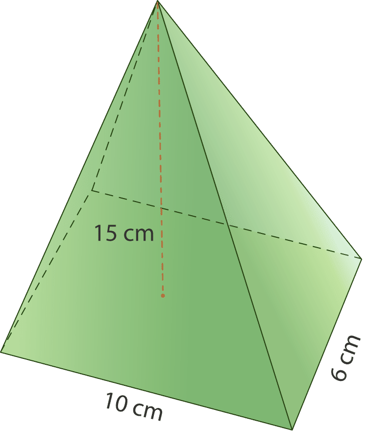

$$
\begin{align*}
B & = lw\\
B & = 10 (6)\\
B & = 60 \ cm^2
\end{align*}
$$

**The area of this pyramid’s base is 60 square centimeters. Now we multiply this by the height and $\frac{1}{3}$, according to the formula.**

$$
\begin{align*}
V & = \frac{1}{3} Bh\\
V & = \frac{1}{3} (60) (15)\\
V & = 20 (15)\\
V & = 300 \ cm^3
\end{align*}
$$

**The volume of the pyramid is 300 cubic centimeters.**

**Remember, we measure volume in three dimensions, so we write the answer in cubic units.**

Example

Find the volume of the figure below.

$$
\begin{align*}
B & = \frac{1}{2} bh\\
B & = \frac{1}{2} (8) (3)\\
B & = 4 (3)\\
B & = 12 \ in.^2
\end{align*}
$$

**The base area for this triangular pyramid is 12 square inches. Let’s put this into the formula and solve for $V$, volume.**

$$
\begin{align*}
V & = \frac{1}{3} Bh\\
V & = \frac{1}{3} (12) (17)\\
V & = 4 (17)\\
V & = 68 \ in.^3
\end{align*}
$$

**The volume of this pyramid is 68 cubic inches.**

**10 M. Lesson Exercises**

**Find the volume of the following pyramids. You may round to the nearest hundredth when necessary.**

1.  **A square pyramid with a base of 8 cm and a height of 5 cm.**
2.  **A rectangular pyramid with a length of 10 cm, a width of 8 cm and a height of 9 cm.**
3.  **A square pyramid with a base of 5.5 in and a height of 4 in.**

III. **Recognize the Relationship between the Volume of a Cone and the Volume of a Cylinder with the same Base and Height**

To figure out the volume of a cone, let’s first look at how we can compare it with another solid figure. The closest solid figure to a cone is a cylinder. Think about it. Both of them have circular bases. While a cylinder has two circular bases, a cone only has one, but they are certainly figures that we can compare.

Here is a cylinder and the formula for finding the volume of a cylinder.

Now let’s think about a cone. How can we find the volume of a cone using the information that we have learned about cylinders? We know that they are related, but is there a way to see how the volume of the cylinder can be compared to the volume of a cone? What about if we put the cone inside the cylinder?

Take a look.

**To find the volume of the cone, we are going to use a formula similar to that of a pyramid, except that we are going to take into consideration that the base of a cone is a circle. Therefore, we will need to find the area of the circle to find the volume of the cone.**

$V=\frac{1}{3} \pi r^2 h$

**Here we need to find the area of the circle that is the base of the cone. The formula for this is $\pi r^2$. Then we can take that measurement and multiply it by the height of the cone. Next, because the cone only fills a portion of the cylinder, we take one-third of the product.**

IV. **Find Volumes of Cones using Formulas**

Now that you have some understanding about the volume of a cone and about where the formula comes from, let’s practice using it to figure out the volume of a cone. Let’s look at an example.

Example

Find the volume of the following cone.

$$
\begin{align*}
V & = \frac{1}{3} \pi r^2 h \\
V & = \frac{1}{3} (3.14)(5^2 )(7) \\
V & = \frac{1}{3} (3.14)(175) \\
V & = \frac{1}{3}(549.5) \\
V & = 183.16 \ in^3
\end{align*}
$$

**This is our answer. Notice that we rounded it to the nearest hundredth.** Here is another one.

**Example**

What is the volume of the cone below?

$$
\begin{align*}
V & = \frac{1}{3} (3.14)(3^2)12 \\
V & = \frac{1}{3} (3.14)(108) \\
V & = \frac{1}{3}(339.12) \\
V & = 113.04
\end{align*}
$$

**The volume of the cone is $113.04 \ cm^3$.**

**10N. Lesson Exercises**

**Find the volume of each cone using the given values and the formula.**

1.  **A cone with a radius of 2 inches and a height of 4 inches.**
2.  **A cone with a radius of 5 ft and a height of 8 ft.**
3.  **A cone with a radius of 4 m and a height of 9 m.**

V. **Solve Real-World Problems Involving Volumes of Pyramids and Cones**

We can also use the formula to solve real-world problems involving volume of pyramids or cones. Be sure you understand what the problem is asking. Then look to see what information is given in the problem. Third, put this information in for the appropriate variable in the formula and solve. Remember always to look first to see what shape the base of the figure is. If a picture is not given, draw one to help you. Let’s give it a try.

Example

Felice bought the candle below for her friend’s birthday. The package says that the candle burns one hour for every 20 cubic centimeters of wax. How many hours will it take the entire candle to burn?

$$
\begin{align*}
B & = s^2\\
B & = (12)^2\\
B & = 144 \ cm^2
\end{align*}
$$

**The base area of the pyramid is 144 square centimeters. We can put this information into the formula and solve for $V$, volume.**

$$
\begin{align*}
V & = \frac{1}{3} Bh\\
V & = \frac{1}{3} (144) (24)\\
V & = 48 (24)	\\
V & = 1,152 \ cm^3
\end{align*}
$$

**Now we know that the candle contains 1,152 cubic centimeters of wax. But we’re not done yet! Remember, we need to find how many hours the candle will burn. Look back at the problem. It tells us that the candle burns one hour for every 20 cubic centimeters of wax. To find how many hours the candle will burn, we need to divide the total volume of wax by 20.**

$1,152 \div 20 = 57.6$

**The candle will burn for 57.6 hours.**

Example

Don put flowers in a conical vase for his mother. If the vase has a radius of 4 inches and a height of 15 inches, how much water can it hold?

**First of all, what kind of solid figure are we dealing with? The vase is in the shape of a cone. What do we need to find? We need to find the volume of the conical vase in order to know how much water it holds. What information have we been given? We know that the radius of the vase’s base is 4 inches and the height of the vase is 15 inches. Next, we can take the given information and substitute it into the formula for finding the volume of a cone.**

$$
\begin{align*}
V & = \frac{1}{3} \pi r^2 h \\
V & = \frac{1}{3} (3.14)(16)(15) \\
V & = 251.2
\end{align*}
$$

**The volume of the vase is $251.2 \ inches^3$.**

Real–Life Example Completed
---------------------------

**_Questions about Ice Cream Cones_**

Candice and Trevor have been working together for two weeks and are getting to be like siblings. Every day there seems to be an argument of some kind that erupts between the two of them. Today, it was about ice cream cones.

“I think that a plain cone with a pointed bottom holds more ice cream,” Trevor said, reaching for more tape.

“I don’t. A sugar cone with a pointed bottom definitely holds more.”

“We can solve this easily if we had the dimensions.”

“Well, on your break, walk down to the ice cream parlor and figure this out,” Candice instructed.

So Trevor did exactly that. He walked down to the ice cream corner and came back with some dimensions on a piece of paper.

“Here we go, now you figure out the volume of the sugar cone and I’ll do the plain one.”

Here are the dimensions that they have to work with:

Plain Cone $= H = 3.25" \ D = 2.5"$

Sugar Cone $= H = 4.5" \ D = 2"$

The two got right down to work.

**Trevor started with the plain cone. Here is the formula that he used.**

$$
\begin{align*}
V & = \frac{1}{3} \pi r^2 h \\
V & = \frac{1}{3} (3.14)(1.25^2)(3.25) \\
V & = 5.315 \ \text{or} \ 5.3 \ cubic \ inches
\end{align*}
$$

**Candice worked on the sugar cone.**

$$
\begin{align*}
V & = \frac{1}{3} \pi r^2 h \\
V & = \frac{1}{3} (3.14)(1^2)(4.5) \\
V & = 4.71 \ \text{or} \ 4.7 \ cubic \ inches
\end{align*}
$$

**While both cones are very close in size, the plain cone is a little greater in size, so that one would hold more ice cream.**

Vocabulary
----------

Here are the vocabulary words found in this lesson.

__Pyramid__

a solid figure with a polygon as a base where the sides meet in one single vertex at the top.

__Cone__

a solid figure with a circular base where the sides are rounded yet meet at one vertex at the top.

__Volume__

the amount of space contained inside a solid figure.

Technology Integration
----------------------

!?[0](https://www.youtube.com/watch?v=7Y0ZMnCcVGs)

[James Sousa, Determine the Volume of a Cone](http://www.youtube.com/watch?v=7Y0ZMnCcVGs)

Other Videos:

1.  http://www.mathplayground.com/mv_volume_cones.html – This is a Brightstorm video on how to find the volume of a cone.
2.  http://www.mathplayground.com/mv_volume_pyramids.html – This is a Brightstorm video on how to find the volume of a pyramid.

Time to Practice
----------------

Directions: Find the volume of each of the following pyramids.

1. A square pyramid with a base of 6 ft and a height of 9 ft.

2. A square pyramid with a base of 8 m and a height of 10 m.

3. A square pyramid with a base of 11 in and a height of 13 in.

4. A square pyramid with a base of 9 ft and a height of 14 ft.

5. A square pyramid with a base of 4.5 in and a height of 5 inches.

6. A rectangular pyramid with a base length of 4 in, a base width of 3 in and a height of 5 in.

7. A rectangular pyramid with a base length of 5 ft, a base width of 4 ft and a height of 6 ft.

8. A rectangular pyramid with a base length of 7 m, a base width of 4 m and a height of 9 m.

9. A triangular pyramid with a base length of 5 in and a base height of 4 inches with a pyramid height of 6 inches.

10. A triangular pyramid with a base length of 8 ft and a base height of 7 ft with a pyramid height of 9 ft.

Directions: Find the volume of each cone.

11. A cone with a radius of 3 inches and a height of 7 inches.

12. A cone with a radius of 5 ft and a height of 9 ft.

13. A cone with a radius of 6 meters and a height of 10 meters.

14. A cone with a radius of 10 inches and a height of 12 inches.

15. A cone with a radius of 12 mm and a height of 14 mm.

16. A cone with a radius of 5 ft and a height of 12 feet.

17. A cone with a radius of 4.5 inches and a height of 7 inches.

18. A cone with a radius of 3.5 inches and a height of 5.5 inches.

19. A cone with a radius of 7 cm and a height of 13 cm.

20. A cone with a radius of 8 cm and a height of 11 cm.

Directions: Solve each word problem.

21. A cone has a radius of 6 meters and a height of 14 meters. What is its volume?

22. A square pyramid has a base with sides of 5 yards each and a height of 21 yards. What is its volume?

23. The containers of icing for Tina’s cake decorator are cones. Each container has a radius of 2.4 inches and a height of 7 inches. If Tina buys containers of red, yellow, and blue icing, how much icing will she buy?

24. Claire has a perfume bottle shaped like a triangular pyramid. Its base area is 48 square centimeters, and its height is 28 centimeters. How much does the bottle hold when it is exactly half full?

</article>

## 11.0 Data and Statistics

<article>

</article>

### 11.1 Mean, Median and Mode

<article>

Introduction
------------

**_The Iditarod_**

http://www.iditarod.com/

The students sat through the video in awe. When it was over, the room was so quiet that you could have heard a pin drop. Marcus was the first one to raise his hand.

“How far is it?” he asked.

“That is a great question,” Mr. Hawkins said. “The race is 1,150 miles from Anchorage Alaska to Nome Alaska. Men and women have finished it and won it too. This year, there were 10 men who finished on top. One finished in 8 days and the rest in 9 days.”

“How fast did they go?” Karen asked from the back of the room. “I mean, you can’t go very fast on a dog sled, right?”

“Well, for you and me it might not seem fast, but for those dogs I am sure that it is. This leads us to a great math problem. Here are the speeds of the top 10 finishers. What is the average speed here?”

Mr. Hawkins wrote these speeds on the board.

4.81 mph, 4.79 mph, 4.76 mph, 4.67 mph, 4.66 mph, 4.64 mph, 4.62 mph, 4.6 mph, 4.58 mph, 4.55 mph.

“Take out a piece of paper and figure this out.”

Marcus took out a piece of paper, but he couldn’t remember how to figure out the average score.

**If you remember how to do it, figure it out now. Then go through this lesson to begin learning all about data and statistics. When you are finished this lesson, you can check your work with Marcus’ work and see if you have the correct average speed. Look for this problem again at the end of the lesson.**

**_What You Will Learn_**

In this lesson, you will learn how to complete the following skill tests:

* Find the mean of a set of data.
* Find the median of a set of data.
* Find the mode of a set of data.
* Identify the range of a set of data.
* Select among mean, median, mode and range to describe a set of data and justify the choice for a particular situation.

**_Teaching Time_**

I. **Find the Mean of a Set of Data**

**_Data_** is one of those words that we hear all the time, especially in math class. We hear about collecting data, organizing data, analyzing data, etc. But....

**What is data?**

**_Data_** **is numerical information collected in a set.** When we look at data in math and science, we look at information that has been gathered over time or that has been gathered to evaluate a topic. Learning to look at data is part of the work of people in math and science. Analyzing data can help scientists predict future events too.

**We can analyze numerical data several different ways. We can look for the mean, the median, the mode and the range of a set of data.**

**Let’s start with the** **_mean_****.**

**The** **_mean_** **is sometimes referred to as the average of a set of data. The mean is the sum of the data values divided by the number of data values. You often hear about averages with grades or speeds. What is your average grade in math class? That number determines your final grade or the grade that you received on a test or quiz. We use averages all the time. Let’s look at the steps to figuring out the mean or average through the following example.**

Example

Find the mean for the set of data: 47, 56, 51, 45, and 41.

**_Step 1:_** Add the data values to determine the sum.

$47 + 56 + 51 + 45 + 41 = 240$

**_Step 2:_** Divide the sum by the number of data values in the set. In this case, there are five numbers in the data set, therefore divide the sum by five.

$240 \div 5 = 48$

**The mean is 48.**

**You can see that when we follow the steps, we can find the mean or average of a set of numbers quite easily.** Let’s look at another example.

The chart below depicts the daily temperature in San Diego for the first seven days in August. Calculate the mean temperature for the first seven days in August.

| **Date:** | **Temperature:** |
| --- | --- |
| Sunday 8/1 | $88^\circ F$ |
| Monday 8/2 | $83^\circ F$ |
| Tuesday 8/3 | $87^\circ F$ |
| Wednesday 8/4 | $89^\circ F$ |
| Thursday 8/5 | $82^\circ F$ |
| Friday 8/6 | $79^\circ F$ |
| Saturday 8/7 | $87^\circ F$ |

**_Step 1:_** Add to determine the sum of the data values.

$88 + 83 + 87 + 89 + 82 + 79 + 87 = 595$

**_Step 2:_** Divide the sum, 595, by 7 since there are seven numbers in the given data set.

$595 \div 7 = 85$

**The mean temperature for the first week in August was $85^\circ F$.**

**This was a real life example of how averages help us figure out weather. If you think about the weather forecast, you will often hear "average" being mentioned. The meteorologist will talk about average snowfall or average temperature or average rainfall.**

**Sometimes, an average will not be a whole number. When this happens, you may need to round to the nearest whole number.**

**11A. Lesson Exercises**

**Now it’s your turn to practice. Find the mean for each data set below.**

1.  **11, 13, 14, 15, 16, 22, 24, 25, 30, 32**
2.  **34, 36, 38, 41, 43, 44, 50, 53, 50, 50, 62, 66**
3.  **8, 16, 24, 32, 40**

II. **Find the Median of a Set of Data**

Now that you have learned about the mean of a set of data, let’s move on to the **_median._** If you think about the word “median” you can think about the median in a road or street. The median of a street is in the middle of the street. **Just like the median of a road, the** **_median_** **of a set of data is the middle value of the set of numbers.**

**The median is the middle number when the values are arranged in order from the least to the greatest.**

Example

Find the median for the set of data: 47, 56, 51, 45, and 41.

**_Step 1:_** Arrange the data values in order from least to greatest.

41, 45, 47, 51, 56

**_Step 2:_** Determine the number in the middle of the data set. 47 is the median because it is the data value in the middle of the data set.

**The median of the data set is 47.**

Example

The chart below depicts the daily temperature in San Diego for the first seven days in August. Determine the median temperature.

| **Date:** | **Temperature:** |
| --- | --- |
| Sunday 8/1 | $88^\circ F$ |
| Monday 8/2 | $83^\circ F$ |
| Tuesday 8/3 | $87^\circ F$ |
| Wednesday 8/4 | $89^\circ F$ |
| Thursday 8/5 | $82^\circ F$ |
| Friday 8/6 | $79^\circ F$ |
| Saturday 8/7 | $87^\circ F$ |

**_Step 1:_** Arrange the temperatures in order from least to greatest.

79, 82, 83, 87, 87, 88, 89

**_Step 2:_** Determine the data value in the middle of the data set. In this case, 87 is the median temperature.

**The answer is $87^\circ F$.**

Example

Katie’s first four test scores are 75%, 81%, 80%, and 84%. Determine the median of Katie’s test scores.

**_Step 1:_** Arrange the test scores in order from least to greatest.

75, 80, 81, 84

**_Step 2:_** In this case, there are two data values in the middle of the data set. To find the median, find the average of the two data values. Recall that to find the mean, determine the sum of the numbers and then divide by two.

$$
\begin{align*}
80 + 81 &= 161\\
161 \div 2  &= 80.5
\end{align*}
$$

**The median of Katie’s test scores is 80.5%.**

**Sometimes, you will have median scores that are not whole numbers. When this happens, you will likely need to include the decimal in your answer. This means that the median score is between two whole numbers.**

**11B. Lesson Exercises**

**Find the median score for each data set.**

1.  **12, 14, 15, 16, 18, 20**
2.  **14. 18, 19, 34, 32, 30, 41, 50**
3.  **5, 10, 23, 20, 7, 9, 11, 18, 35, 16, 22**

III. **Find the Mode of a Set of Data**

You have learned how to find the mean and the median, now we can find the mode of a set of data too. **The** **_mode_** **is the value that occurs the most times in a set of data.** Mode sounds like most and that can be an easy way to remember it. Let’s look at how to find the mode.

Example

The chart below depicts the daily temperature in San Diego for the first seven days in August. Determine the mode for this set of data.

| **Date:** | **Temperature:** |
| --- | --- |
| Sunday 8/1 | $88^\circ F$ |
| Monday 8/2 | $83^\circ F$ |
| Tuesday 8/3 | $87^\circ F$ |
| Wednesday 8/4 | $89^\circ F$ |
| Thursday 8/5 | $82^\circ F$ |
| Friday 8/6 | $79^\circ F$ |
| Saturday 8/7 | $87^\circ F$ |

**To find the mode, look for the number that occurs most often. In this case, 87 is the mode because it appears twice in the set of data.**

**The mode is $87^\circ F$.**

Example

Katie’s first four test scores are 75%, 81%, 80%, and 84%. Determine the mode of Katie’s test scores.

**In this case, there is not one number that occurs more than another. Therefore, there is no mode.**

**Mode = none**

Example

Miguel measured the height of eight students in his class in inches. Determine the mode of his classmate’s heights.

$51 \quad 45 \quad 47 \quad 51 \quad 50 \quad 56 \quad 52 \quad 50$

**In this case, there are two data values that appear most often, 51 and 50.**

**The modes of Miguel’s data are 51 and 50.**

**11C. Lesson Exercises**

**Name the mode of each data set.**

1.  **2, 3, 3, 5, 6, 7, 8, 9, 3**
2.  **12, 15, 67, 45, 44, 88, 90**
3.  **13, 13, 45, 45, 67, 89, 13, 67, 67, 67, 13**

IV. **Identify the Range of a Set of Data**

**The** **_range_** **of a set of data is the difference between the greatest and least values.**

**To find the range of a set of data, subtract the smallest data value from the largest data value.**

Example

Determine the range for the set of data: 47, 56, 51, 45, and 41.

**Subtract the smallest data value, in this case 541 from the largest data value of 56.**

$56 - 41 = 15$

**The difference between the largest and smallest number is 15, therefore the range for this set of data is 15.**

Example

The chart below depicts the daily temperature in San Diego for the first seven days in August. Identify the range in temperatures.

| **Date:** | **Temperature:** |
| --- | --- |
| Sunday 8/1 | $88^\circ F$ |
| Monday 8/2 | $83^\circ F$ |
| Tuesday 8/3 | $87^\circ F$ |
| Wednesday 8/4 | $89^\circ F$ |
| Thursday 8/5 | $82^\circ F$ |
| Friday 8/6 | $79^\circ F$ |
| Saturday 8/7 | $87^\circ F$ |

Subtract the smallest value 79 from the largest value 89.

$89 - 79 = 10$

**The range in temperatures is $10^\circ F$.**

**11D. Lesson Exercises**

**Find the range of each data set.**

1.  **12, 14, 15, 16, 18, 20**
2.  **14, 18, 19, 34, 32, 30, 41, 50**
3.  **5, 10, 23, 20, 7, 9, 11, 18, 35, 16, 22**

V. **Select among Mean, Median, Mode and Range to Describe a Set of Data**

Different situations require different analysis. Sometimes it makes more sense to describe data using one term versus of another term.

For example, if you are looking for the difference between speeds or times, using the range would make the most sense. The average wouldn’t help you to understand the difference.

When analyzing the daily temperatures for the month of August, the best way to examine the data would be to calculate the mean because there shouldn’t be much variance in the daily temperature.

When surveying a group of middle school students about their favorite soda, the mode is the most appropriate measure since no numerical data is involved.

If you are looking for the middle value in, say, sales for a store, then the median would be the best way to analyze the data.

Let’s look at some examples.

Example

Should mean, median, mode, or range be determined to best analyze the following set of data?

|     |     |
| --- | --- |Number of minutes it took five students to complete a math test.
| **Student:** | **Number of minutes:** |
| --- | --- |
| 1   | 29  |
| 2   | 32  |
| 3   | 40  |
| 4   | 33  |
| 5   | 38  |

Since there is not a number that occurs most often, the mode is not the best way to analyze the data.

Calculating the range of this data just allows one to see the difference between the students who finished the exam first and last.

**In this case, determining the mean is the best way to analyze this data. The mean gives the average amount of time it took for the five students to complete the exam. In this case, the mean is 34.4 minutes. It can also be helpful to look at the median of this data, 33. In this case, the mean and median are close in value.**

**Remember to think about what the data describes and what your objective is in analyzing the data and this will help you to choose the best method for analyzing the data.**

Real Life Example Completed
---------------------------

**_The Iditarod_**

The students in Mr. Hawkins class are studying about the Iditarod. Some of the students had never heard of the Iditarod before, so Mr. Hawkins started off his class by showing them this video about the race.

http://www.iditarod.com/

The students sat through the video in awe. When it was over, the room was so quiet that you could have heard a pin drop. Marcus was the first one to raise his hand.

“How far is it?” he asked.

“That is a great question,” Mr. Hawkins said. “The race is 1,150 miles from Anchorage Alaska to Nome Alaska. Men and women have finished it and won it too. This year, there were 10 men who finished on top. One finished in 8 days and the rest in 9 days.”

“How fast did they go?” Karen asked from the back of the room. “I mean, you can’t go very fast on a dog sled, right?”

“Well, for you and me it might not seem fast, but for those dogs I am sure that it is. This leads us to a great math problem. Here are the speeds of the top 10 finishers. What is the average speed here?”

Mr. Hawkins wrote these speeds on the board.

4.81 mph, 4.79 mph, 4.76 mph, 4.67 mph, 4.66 mph, 4.64 mph, 4.62 mph, 4.6 mph, 4.58 mph, 4.55 mph.

“Take out a piece of paper and figure this out.”

Marcus took out a piece of paper, but he couldn’t remember how to figure out the average score.

**By now you understand that the average is the same thing as the mean. The students have been asked to find the mean speed of the dog sleds on the 2010 Iditarod. They have been given the speeds of the top ten finishers. This is the data that we will use to figure out the mean.**

**First, add up all of the speeds.**

$4.81 + 4.79 + 4.76 + 4.67 + 4.66 + 4.64 + 4.62 + 4.6 + 4.58 + 4.55 = 46.68$

**Next, we divide this sum by 10 because there were ten dog sleds, so there were 10 different speeds.**

**$46.68 \div 10 = 4.668$ rounds to 4.67**

**The average speed is 4.67 mph.**

**Now that you understand mean, median, mode and range, you can figure out the median, mode and range of the data as well. Take a few minutes to do that.**

**There isn’t a mode for this data.**

**The range is the difference between the fastest speed and the slowest.**

$4.81 - 4.55 = .26 \ mph$

**You can see that there wasn’t a huge difference between the fastest time and the slowest time. But that .26 was enough to make the difference between first and tenth place!**

Vocabulary
----------

Here are the vocabulary words that are found in this lesson.

__Data__

pieces of numerical information collected in a set.

__Mean__

the average value of a set of data.

__Median__

the middle value or score of a set of data.

__Mode__

the value that appears the most in a set of data.

__Range__

the difference between the highest value and the lowest value of a set of data.

Technology Integration
----------------------

!?[0](https://www.youtube.com/watch?v=k3aKKasOmIw)

[Khan Academy, Mean, Median and Mode](http://www.youtube.com/watch?v=k3aKKasOmIw)

!?[0](https://www.youtube.com/watch?v=5sQAod4-az8)

[James Sousa, Mean, Median and Mode](http://www.youtube.com/watch?v=5sQAod4-az8)

!?[0](https://www.youtube.com/watch?v=0io9U8Jcjeo)

[James Sousa, Example of Finding the Mean of a Data Set](http://www.youtube.com/watch?v=0io9U8Jcjeo)

!?[0](https://www.youtube.com/watch?v=CbKqFc-EPDs)

[James Sousa, Example of Finding the Median of a Data Set](http://www.youtube.com/watch?v=CbKqFc-EPDs)

!?[0](https://www.youtube.com/watch?v=YhgXmO_FpHY)

[James Sousa, Example of Finding the Mode of a Data Set](http://www.youtube.com/watch?v=YhgXmO_FpHY)

Other Videos:

1.  http://www.mathplayground.com/howto_mode.html – This is a video that shows you how to find the mean, median and mode of a set of data.

Time to Practice
----------------

Directions: Analyze each data set.

$32 \quad 29 \quad 40 \quad 35 \quad 42 \quad 25 \quad 40$

1. Mean –

2. Median –

3. Mode –

4. Range –

The weekly paychecks for ten part-time employees are: $140, $132, $200, $150, $175, $200, $180, $95, $145, and $155.

5. Mean –

6. Median –

7. Mode –

8. Range –

The data set below depicts the number of points LeBron James scored in the last five NBA games.

$25 \quad 27 \quad 25 \quad 29 \quad 22$

9. Mean –

10. Median –

11. Mode –

12. Range –

Here is the number of days that it took the mushers of the Iditarod to finish the race in 2010.

8 days, 9 days, 9 days, 9 days, 9 days, 9 days, 9 days, 9 days, 9 days, 9 days

13. Mean –

14. Median –

15. Mode –

16. Range –

A red lantern is the award given to the last musher to finish the Iditarod. The longest finish took place in 32 days. If the fastest time in 2010 was 8 days, what is the range between the last and the first?

17. Range –

The scores that Marc earned on his math quizzes were 78%, 85%, 88%, 88% and 90%

18. What is the mean of the data?

19. What is the mode of the data?

20. What is the median of the data?

21. What is the range of the data?

22. The table below depicts the amount of calories in various fast food choices. Which measure of the data will prove most reliable?

$$
\begin{align*}
& \text{Burger} && 375\\
& \text{Fries} && 210\\
& \text{Chicken Sandwich} && 300\\
& \text{Shake} && 215\\
& \text{Soda} && 159
\end{align*}
$$

23. Describe a situation where a mean would be the best way to analyze data.

24. Describe a situation where the range would be the best way to analyze data.

</article>

### 11.2 Bar Graphs and Line Graphs

<article>

Introduction
------------

**_All about the Mushers_**

Tommy and Keith decided to investigate where the mushers come from. They did some research on the computer and discovered that in 2010 there were a total of 71 mushers who entered the race. They came from several different states and countries. Tommy and Keith organized their data like this.

46 Mushers from Alaska

13 Mushers from other US states

12 Mushers from other countries

Now they need to put their data into either a bar graph or a line graph.

Yana and Jena have decided to look at how the number of teams has changed over time. They looked at the number of teams that entered the Iditarod in 2006, 2007, 2008, 2009 and 2010. Here is how they organized their data.

2006 – 83 teams

2007 – 82 teams

2008 – 95 teams

2009 – 67 teams

2010 – 71 teams

Now they need to put their data into either a bar graph or a line graph.

**Both teams are stuck. They aren’t sure which graph would best show their data. Do you know? If you have a prediction, make a note of it in your notebook. Which graph should the boys use? Which graph should the girls use?**

**Now pay attention to this lesson and at the end of it, you will be able to determine if you made the correct choice.**

**You will also be able to see both of the graphs the students made.**

**_What You Will Learn_**

In this lesson you will learn to demonstrate the following skills:

* Make a bar graph to display given data.
* Make multiple bar graphs to display and compare given data.
* Make a line graph to display given data over time.
* Make multiple line graphs to display and compare given data.

**_Teaching Time_**

I. **Make a Bar Graph to Display Given Data**

In the last lesson, you learned to analyze data by determining the mean, median, mode, and range for a set of data values. In this lesson, you will use data to create both bar and line graphs.

**Tables and graphs are ways to organize and present information so that it can be easily interpreted by the viewer.** Graphs are created to show the relationship between two variables. For example, a graph may be constructed to depict the relationship between an object’s mass and volume or the price of gasoline in relationship to location.

**A** **_bar graph_** **is a graph that uses columns to show the comparison of quantities or amounts.** For example, the bar graph below depicts the average price of one gallon of gasoline in five states. Looking at the bar graph, you can conclude that Hawaii has the highest average cost per gallon of gasoline and Missouri has the lowest cost.

Example

Thirty students in grade seven were asked to state their favorite after school activity. The results of this survey are shown on the table. Create a bar graph to display the information from the data table.

| **Favorite Activity:** | **Number of Students:** |
| --- | --- |
| Watching T.V. | 9   |
| Playing sports/exercising | 6   |
| Reading | 7   |
| Hanging out with friends | 5   |
| Babysitting | 3   |

**To create a bar graph**

1. Draw the horizontal $(x)$ and vertical $(y)$ axis.

3. Label the horizontal axis “Favorite Activity.”

4. Label the vertical axis “Number of Students.”

5. Look at the range in data and decide how the units on the vertical axis $(y)$ should be labeled. In this case, since the range in data is not that great, label the vertical axis 0 – 10 by ones.

6. For each activity on the horizontal $(x)$ axis, draw a vertical column to the appropriate value. For example, you will draw a vertical column to the number “9” for the activity “Watching T.V.”

The data table below depicts the recommended minimum number of hours of sleep people need by age. Create a bar graph using the information from the data table.

| **Age Group:** | **Recommended Hours of Sleep:** |
| --- | --- |
| Infants (0–1 years old) | 15 hours |
| Children (2–5 years old) | 13 hours |
| Children (6–11 years old) | 11 hours |
| Teens | 9 hours |
| Adults | 8 hours |

**To create a bar graph:**

1.  Draw the horizontal $(x)$ and vertical $(y)$ axis.
2.  Since the graph is about sleep, give the graph the title “Sweet Dreams.”
3.  Label the horizontal axis “Age.”
4.  Label the vertical axis “Hours of Sleep.”
5.  Look at the range in data and decide how the units on the vertical axis $(y)$ should be labeled. In this case, label the vertical axis 0 - 16 by twos.
6.  For each age group on the horizontal $(x)$ axis, draw a vertical column to the appropriate value. For example, for “Infants,” draw a vertical column to fifteen hours.

**Looking at the bar graph “Sweet Dreams,” what can you infer about age and the recommended number of hours of sleep?**

Looking at the graph, you can see that one needs less sleep as they grow older. It is recommended that infants sleep a minimum of fifteen hours a day. However, it is recommended that adults sleep a minimum of eight hours a day. This difference of seven hours is also known as the range.

II. **Make Multiple Bar Graphs to Display and Compare Given Data**

**A** **_multiple bar graph_** **is similar to a bar graph, but depicts two or three pieces of information for each item on the horizontal $(x)$ axis, rather than one.** For example, a double bar graph may be used to compare the survey answers of males vs. females. A triple bar graph may be used to compare data recorded over a three day period.

Thirty-five girls and thirty-seven boys were asked to state their favorite sport. The results of the survey are displayed on the graph below. You can make several inferences studying the graph “Favorite Sports.” You can see that soccer was the favorite sport among girls and track was the least favorite. More boys preferred basketball than any other choice. Equal numbers of boys and girls stated that their favorite sport was baseball.

Here is a bar graph to show the data.

")

\[Figure 8\]

Example

Frank’s Farm Stand kept track of the number of pounds of vegetables sold over a three-day period. The results are listed on the table below. Create a multiple bar graph to display and compare the amounts of vegetables sold over the three day period.

| **Type of Vegetable:** | **Pounds Sold: Day One** | **Pounds Sold: Day Two** | **Pounds Sold: Day Three** |
| --- | --- | --- | --- |
| Squash | 32 lbs. | 36 lbs. | 36 lbs. |
| Zucchini | 40 lbs. | 33 lbs. | 37 lbs. |
| Corn | 56 lbs. | 65 lbs. | 67 lbs. |
| Carrots | 28 lbs. | 25 lbs. | 23 lbs. |
| Romaine Lettuce | 27 lbs. | 31 lbs. | 34 lbs. |
| Tomatoes | 44 lbs. | 54 lbs. | 58 lbs. |

**To create a multiple bar graph:**

1.  Draw the horizontal $(x)$ and vertical $(y)$ axis.
2.  Give the graph the title “Frank’s Farm Stand.”
3.  Label the horizontal axis “Vegetables.”
4.  Label the vertical axis “Pounds Sold.”
5.  Look at the range in data and decide how the units on the vertical axis $(y)$ should be labeled. In this case, label the vertical axis 0 - 80 by tens.
6.  For each vegetable on the horizontal $(x)$ axis, draw a vertical column to the appropriate value three times, one column representing day one, a second column for day two, and a third column for day three.
7.  Choose three colors, one to represent the values for day one, one for the values for day two, and finally one to represent the values for day three.

**Looking at the bar graph “Frank’s Farm Stand,” what can you infer about the difference in sales over the three day period?**

It is apparent that sales of squash, corn, romaine lettuce, and tomatoes increased over the three day period. Zucchini sales dropped on day two, but increased on day three. However, carrot sales declined on day two and again on day three. Note that the same amount of carrots and romaine lettuce were sold on day one.

Taylor created a table to compare the amount of gravitational pull on each planet compared to that on Earth. Create a multiple bar graph to display the information from Taylor’s chart.

| **Planet Name:** | **Planet’s Gravitational Pull:** | **Earth’s Gravitational Pull:** |
| --- | --- | --- |
| Mercury | $0.38 m/s^2$ | $1.0 m/s^2$ |
| Venus | $0.91 m/s^2$ | $1.0 m/s^2$ |
| Mars | $0.38 m/s^2$ | $1.0 m/s^2$ |
| Jupiter | $2.54 m/s^2$ | $1.0 m/s^2$ |
| Saturn | $0.93 m/s^2$ | $1.0 m/s^2$ |
| Uranus | $0.8 m/s^2$ | $1.0 m/s^2$ |
| Neptune | $1.2 m/s^2$ | $1.0 m/s^2$ |

**To create a multiple bar graph:**

1.  Draw the horizontal $(x)$ and vertical $(y)$ axis.
2.  Give the graph the title “Planet’s Gravitational Pull.”
3.  Label the horizontal axis “Planets.”
4.  Label the vertical axis “Gravitational Pull.”
5.  Look at the range in data and decide how the units on the vertical axis $(y)$ should be labeled. In this case, label the vertical axis 0-3 by 0.5.
6.  For each planet on the horizontal $(x)$ axis, draw a vertical column to the appropriate value. For example, the vertical column should reach 0.38 for Mercury to show its gravitational pull.
7.  Next to each vertical column for each planet, draw a vertical column that reaches 1.0 to represent the gravitational pull on Earth.
8.  Choose two colors, one to represent the values for each planet and another to represent the value for Earth.

This graph compares the gravitational pull on Earth with the other seven major planets. You can see that with the exception of Jupiter and Neptune, all planets have a gravitational pull less than that of Earth. You can see that Mercury and Mars both have a gravitational pull of $0.38 m/s^2$. It is apparent that Venus and Saturn are the planets with a gravitational pull that is closest to that of Earth.

III. **Make a Line Graph to Display Given Data over Time**

Another way to look at data is through a line graph.

**A** **_line graph_** **is a series of connected points that displays data or information that changes over time.**

The line graph below illustrates the change in temperature over the first seven days in February in Boston, Massachusetts. Looking at the changes of the line, you can see that the temperature rose the first three days, February $1^{st}$, $2^{nd}$, and $3^{rd}$. On February $4^{th}$, the temperature began to decline. The temperature held constant on February $5^{th}$ and $6^{th}$. The temperature began to rise again on February $7^{th}$.

Example

The population for the city of Los Angeles has been recorded on the data table below. Create a line graph to depict the population change from the year 1950 to the year 2000.

| **Year:** | **Approximate Population:** |
| --- | --- |
| 1950 | 2,000,000 |
| 1960 | 2,500,000 |
| 1970 | 2,800,000 |
| 1980 | 3,000,000 |
| 1990 | 3,500,000 |
| 2000 | 3,700,000 |

**To create a line graph:**

1.  Draw the horizontal $(x)$ and vertical $(y)$ axis.
2.  Give the graph the title “Population of Los Angeles 1950-2000.”
3.  Label the horizontal axis “Year.”
4.  Label the vertical axis “Population.”
5.  Look at the range in data and decide how the units on the vertical axis $(y)$ should be labeled. In this case, label the vertical axis 0 – 4,000,000 by five hundred thousands.
6.  Plot the population for each year on the horizontal axis. For example, put a point at 2,000,000 to show the population for the year 1950. Above the year 1960, put a point at 2,500,000 and so on. Connect the points as you go.

**Looking at the line graph, what can you infer about the change in population from 1950 to 2000?**

It is evident that the population has risen since the year 1950. You can see that the greatest change in population occurred from the years 1950 to 1960 and again from 1980 to 1990. You can see that the smallest change in population occurred between the years of 1990 and 2000. From 1990 to 2000, the population only grew by 200,000 people. **Judging by the trend of the graph, you could predict that the population of Los Angeles will continue to increase over time.**

Example

The Electronic Energies Alliance recorded the average cost of one gallon of gasoline in the United States for the years 2000-2007. Present the information on the data table on a line graph.

| **Year:** | **Average Cost of One Gallon of Gasoline** |
| --- | --- |
| 2000 | $1.57 |
| 2001 | $1.10 |
| 2002 | $1.46 |
| 2003 | $1.59 |
| 2004 | $2.03 |
| 2005 | $2.25 |
| 2006 | $3.30 |
| 2007 | $3.00 |

**To create a line graph:**

1. Draw the horizontal $(x)$ and vertical $(y)$ axis.

2. Give the graph the title “Change in Cost of Gasoline 2000-2007.”

3. Label the horizontal axis “Year.”

4. Label the vertical axis “Cost of Gasoline.”

5. Look at the range in data and decide how the units on the vertical axis $(y)$ should be labeled. In this case, label the vertical axis 0 – 3.5 by 0.5.

6. Plot the price of gasoline for each year on the horizontal axis. For example, put a point slightly above 1.5 to show that the cost of one gallon of gas in the year 2000 was $1.59. Place a point slightly above 1 to show that they cost of one gallon of gas in the year 2001 was $1.10. Use a straight edge to connect the points as you go.

The price of a gallon of gasoline has increased approximately $1.50 over eight years. You'll notice that the price of a gallon of gasoline dropped in the years 2001 and 2007, but increased in all other years.

IV. **Make Multiple Line Graphs to Display and Compare Given Data**

Recall that a line graph displays changes in data over time. **A** **_multiple line graph_** **displays changes in two or three sets of data over time.**

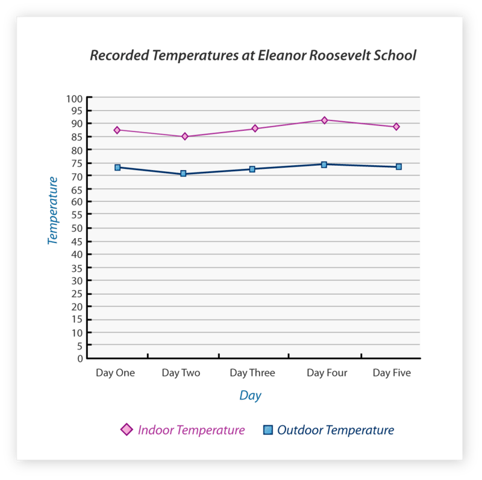

Example

Full-time and part-time enrollment at California State University for the past five years is recorded on the data table below. Create a multiple line graph to represent the information on the data table.

| **Year:** | **Number of Students Attending Full-Time:** | **Number of Students Attending Part-Time:** |
| --- | --- | --- |
| 2003 | 10,000 | 2,000 |
| 2004 | 9,500 | 2,100 |
| 2005 | 11,100 | 2,050 |
| 2006 | 12,000 | 2,700 |
| 2007 | 13,300 | 2,550 |

**To create a multiple line graph:**

1.  Draw the horizontal $(x)$ and vertical $(y)$ axis.
2.  Give the graph the title “Enrollment at California State University.”
3.  Label the horizontal axis “Year.”
4.  Label the vertical axis “Number of Students.”
5.  Look at the range in data and decide how the units on the vertical axis $(y)$ should be labeled. In this case, label the vertical axis 0 – 14,000 by thousands.
6.  Use one color pen to plot the data for full-time students first. For example, for the year 2003, place a point at 10,000. For the year 2004, place a point between 9,000 and 10,000 to show that the enrollment was 9,500. As you continue to plot the enrollment for each year, use a straight edge to connect the points.
7.  Use another color pen to plot the data for part-time students. For the year 2003, place at point at 2,000. For the year 2004, place a point slightly above 2,000 to show that the enrollment for that year was 2,100. As you continue to plot the enrollment for each year, use a straight edge to connect the points.

You can see that the number of full-time students enrolled increased by 3,300 students from 2003 to 2007. While full-time enrollment declined between 2003 an 2004, it increased every other year. The number of part-time students enrolled increased by 550 students from 2003 to 2007. It is apparent that the increase in full-time enrollment was greater than the increase in part-time enrollment.

Real Life Example Completed
---------------------------

**_All about the Mushers_**

The students in Mr. Hawkins’ class have continued to learn about the Iditarod. After learning some of the basics about the distances covered, the students began to research information about the teams, where they come from and how many teams have entered the race in the past few years. Mr. Hawkins has asked them to create either a bar graph or a line graph of the data that they discover.

Tommy and Keith decided to investigate where the mushers come from. They did some research on the computer and discovered that in 2010, there were a total of 71 mushers who entered the race. They came from several different states and countries. Tommy and Keith organized their data like this.

46 Mushers from Alaska

13 Mushers from other US states

12 Mushers from other countries

Now they need to put their data into either a bar graph or a line graph.

Yana and Jena have decided to look at how the number of teams has changed over time. They looked at the number of teams that entered the Iditarod in 2006, 2007, 2008, 2009 and 2010. Here is how they organized their data.

2006 – 83 teams

2007 – 82 teams

2008 – 95 teams

2009 – 67 teams

2010 – 71 teams

Now they need to put their data into either a bar graph or a line graph.

**Let’s start with the boys. They are looking at the number of mushers from different places. Nothing is changing in their data over time-therefore it makes the most sense for them to use a bar graph. They are also looking at the frequency of mushers from each location. Here is a bar graph that best shows their data.**

----------

__Bar Graph__

a graph designed to compare data and show the frequency of the data.

__Multiple Bar Graph__

a graph that shows how different strands of data compare over time. It shows the frequency of this data and compares it at the same time.

__Line Graph__

shows how data changes over time.

__Multiple Line Graphs__

show how different strands of data change over time.

Technology Integration
----------------------

!?[0](https://www.youtube.com/watch?v=kiQ6MUQZHSs)

[Khan Academy, Reading Bar Graphs](http://www.youtube.com/watch?v=kiQ6MUQZHSs)

!?[0](https://www.youtube.com/watch?v=36v2EXZRzUE)

[Khan Academy, Reading Line Graphs](http://www.youtube.com/watch?v=36v2EXZRzUE)

Time to Practice
----------------

Directions: The multiple bar graph below depicts the number of Major League Baseball teams in each state, as well as the number of World Series Championships won by each state. Use the graph to answer the questions.

2. How many World Championships are represented on the graph? \_\_\_\_\_

3. How many of states on the graph have won a Major League Championship? \_\_\_\_\_

4. Which states have equal numbers of Major League Baseball teams? \_\_\_\_\_

5. Which state has won the greatest number of World Championships? \_\_\_\_\_

Directions: Twenty students in $6^{th}$, $7^{th}$, and $8^{th}$ grade were asked to state how many of each of the following electronic devices their homes contained.

6. Create a multiple bar graph to display the information from the table.

| **Name of Device:** | $6^{th}$ **Grade Answers:** | $7^{th}$ **Grade Answers:** | $8^{th}$ **Grade Answers:** |
| --- | --- | --- | --- |
| Television | 35  | 28  | 31  |
| DVD Player | 30  | 28  | 20  |
| Computer | 19  | 20  | 17  |
| Game System | 15  | 14  | 20  |
| Video Camera | 14  | 17  | 12  |

7. What is the most common electronic device in the sixth grade?

8. What is the most common electronic device in the seventh grade?

9. What is the most common electronic device in the eighth grade?

10. What is the least common electronic device in the sixth grade?

11. What is the least common electronic device in the seventh grade?

12. What is the least common electronic device in the eighth grade?

Directions: The table below shows the number of tickets sold at the Phoenix Zoo and the Seattle Zoo since 1998.

13. Create a multiple line graph using the data from the table.

| **Year:** | **Number of Tickets Sold at Phoenix Zoo:** | **Number of Tickets Sold at Seattle Zoo:** |
| --- | --- | --- |
| 1998 | 547,000 | 601,000 |
| 1999 | 562,000 | 602,500 |
| 2000 | 569,000 | 603,700 |
| 2001 | 566,000 | 605,000 |
| 2002 | 569,000 | 604,000 |
| 2003 | 572,000 | 605,100 |
| 2004 | 576,000 | 606,000 |
| 2005 | 575,500 | 605,800 |
| 2006 | 579,000 | 607,000 |
| 2007 | 580,000 | 608,000 |

14. Which zoo sold more tickets in 2003?

15. Which zoo sold more tickets in 2005?

16. Which was the best year for sales at the Phoenix zoo?

17. Which was the best year for sales at the Seattle zoo?

18. Based on this information, can we say which zoo is more popular? Why?

19. Based on this data, will sales increase or decrease in 2008 at the Phoenix zoo?

20. Based on this data, will sales increase or decrease in 2008 at the Seattle zoo?

Directions: The data table below depicts the increase in cost of a movie ticket each year since 2000.

| **Year:** | **Price of a Ticket:** |
| --- | --- |
| 2000 | $5.50 |
| 2001 | $5.75 |
| 2002 | $6.00 |
| 2003 | $6.25 |
| 2004 | $6.50 |
| 2005 | $7.25 |
| 2006 | $8.00 |
| 2007 | $9.25 |

21. Decide which type of graph, bar or line, should be used to represent the information in the data table.

22. Use the information on the data table to create the graph you’ve chosen.

Directions: The data table below depicts the number of newspapers in circulation (in millions) over a period of three days.

23. Decide which type of graph, bar or line, should be used to represent the information in the data table.

24. Use the information on the data table to create the graph you’ve chosen.

| **Name of Newspaper** | **Friday** | **Saturday** | **Sunday** |
| --- | --- | --- | --- |
| Los Angeles Times | 55  | 58  | 60  |
| New York Times | 62  | 63  | 67  |
| Chicago Sun | 47  | 49  | 49  |
| Orange County Register | 39  | 41  | 42  |
| San Francisco Chronicle | 51  | 53  | 55  |

</article>

### 11.3 Stem-and-Leaf Plots

<article>

Introduction
------------

**_The Check points_**

While racing, the teams face all kinds of wild weather. There can be blizzards, ice and unbelievable winds not to mention that the surrounding terrain can be woods or frozen tundra.

“Wow, can you imagine being out there and not seeing anyone?” Sam said to his friend Juan.

“I think they do see people at the checkpoints, isn’t that right Mr. Hawkins?” Juan asked as Mr. Hawkins walked around the room.

“Yes Juan. The mushers all have to check in at the checkpoints. It helps the race officials to keep track of everyone as well as check on the dogs, refuel, and take any other safety precautions.”

“How many are there?”

“Well, there are 24, and you can figure out the distances and organize them in a data display. That is the next task that you are all going to work on,” Mr. Hawkins said, taking out a giant ruler. “Then I want you to figure out the median distance of the checkpoints.”

Juan took out a piece of paper and wrote down the distance between each check point. Here are his notes.

20, 29, 52, 34, 45, 30, 48, 75, 54, 18, 25, 59, 112, 52, 52, 42, 90, 42, 48, 48, 28, 18, 55, 22

Juan wanted to create a stem-and-leaf plot to show the data. He knew that once he arranged the data in a stem-and-leaf plot, it could help him to find the median distance between two checkpoints.

**Do you have an idea how Juan can do this? Have you ever created a stem-and-leaf plot? Take the time to learn about them during this lesson. At the end of the lesson, you will see how Juan created his data display.**

**_What You Will Learn_**

By the end of this lesson, you will be able to demonstrate the following skills.

* Make a stem-and-leaf plot to represent given data.
* Use a stem-and-leaf plot to find the mean, median, mode and range of a set of data.
* Compare and interpret multiple stem-and-leaf plots of real-world data.

**_Teaching Time_**

I. **Make a Stem-and-Leaf Plot to Represent Given Data**

In this lesson, you will learn another way to display data. This way of organizing and displaying data helps us to see values according to their size, so we can order them accordingly. Think about the base ten number system of 10,100,1000 etc. We can organize numbers by ones, tens, hundreds and thousands. In fact, you think about numbers in this way when working with decimals. Now we are going to look at the stem of a number so that we can organize it as part of a visual display of data.

**A** **_stem-and-leaf plot_** **organizes data in order. In a stem-and-leaf plot each data value is split into a stem and a leaf.**

**The leaf is the last digit to the right. The stem is the remaining digits to the left. For the number 243, the stem is 24 and the leaf is 3.**

Example

Construct a stem-and-leaf plot for the data below.

Science test scores for third period (out of 100%):

97, 92, 77, 82, 96, 75, 68, 80, 79, 96

**_Step 1:_** Arrange the data in order from least to greatest.

68, 75, 77, 79, 80, 82, 85, 92, 96, 96

**_Step 2:_** Separate each number into a stem and a leaf.

| **Stem** | **Leaf** |
| --- | --- |
| 6   | 8   |
| 7   | 5 7 9 |
| 8   | 0 2 |
| 9   | 2 6 6 7 |

**_Step 3:_** Create a key and give the stem-and-leaf plot a title.

**Answer**

**Science Test Scores: $3^{rd}$ Period**

| **Stem** | **Leaf** |
| --- | --- |
| **6** | **8** |
| **7** | **5 7 9** |
| **8** | **0 2** |
| **9** | **2 6 6 7** |
| **Key:** $6 \big \| 8 = 68$ |     |

**If we were to analyze this data, you could see that most of the values cluster around the stem of 9. There are more numbers in this category.**

Three friends began a babysitting service over the summer. The amount of money they made for each appointment is listed on the data table below. Use the information on the data table to create a stem-and-leaf plot.

| **Date:** | **Amount Made:** |
| --- | --- |
| June 26, 2006 | $17.00 |
| June 27, 2006 | $12.00 |
| July 5, 2005 | $22.00 |
| July 9, 2005 | $23.00 |
| July 15, 2006 | $18.00 |
| July 22, 2006 | $31.00 |
| August 1, 2006 | $40.00 |
| August 5, 2006 | $35.00 |
| August 13, 2006 | $19.00 |
| August 20, 2006 | $8.00 |

**_Step 1:_** Arrange the data values in order from least to greatest.

Since the data values are to the nearest whole number, arrange the data without the decimal points.

8, 12, 17, 18, 19, 22, 23, 31, 35, 40

**_Step 2:_** Separate each value into a stem and a leaf.

| **Stem** | **Leaf** |
| --- | --- |
| 0   | 8   |
| 1   | 2 7 8 9 |
| 2   | 2 3 |
| 3   | 1 5 |
| 4   | 0   |

**_Step 3:_** Create a key and give the stem-and-leaf plot a title.

**Answer**

|     |     |
| --- | --- |Babysitting Fund
| **Stem** | **Leaf** |
| --- | --- |
| **0** | **8** |
| **1** | **2 7 8 9** |
| **2** | **2 3** |
| **3** | **1 5** |
| **4** | **0** |
| **Key:** $0 \big \| 8 = 8$ |     |

**11E. Lesson Exercises**

1.  **What is the stem of the number 256?**
2.  **What is the leaf of the number 256?**
3.  **What is the stem of the number 1,289?**
4.  **What is the leaf of the number 1,289?**

II. **Use a Stem-and-Leaf Plot to Find the Mean, Median, Mode and Range of a Set of Data**

Now that you know how to create a stem-and-leaf plot, let’s look at how we can use it to analyze data and draw conclusions. First, let’s review some of the vocabulary words that we used in the first lesson of this chapter.

The **_mean_** is sometimes also called the average of a set of data. To find the mean, add the data values and then divide the sum by the number of data values.

The **_median_** is the data value in the middle when the data is ordered from least to greatest. Since the data is ordered from least to greatest on a stem-and-leaf plot, find the data value in the middle of the stem-and-leaf plot.

The **_mode_** is the data value that occurs most often. On a stem-and-leaf plot, the mode is the most repeated leaf.

The **_range_** is the difference between the highest and the lowest data value.

**Data from a stem-and-leaf plot can be used to determine the mean, median, mode, and range for a set of data. Let’s look at how we can do this.**

The stem-and-leaf plot below depicts the weight (in pounds) of the ten trout caught in a fishing competition. Determine the mean, median, mode, and range of the data on the stem-and-leaf plot.

|     |     |
| --- | --- |Weight of Trout Caught
| **Stem** | **Leaf** |
| --- | --- |
| 2   | 9   |
| 3   | 1   |
| 4   | 0 5 |
| 5   | 2   |
| 6   | 2   |
| 7   | 6   |
| 8   | 3   |
| 9   | 2 2 |
| **Key:** $2 \big \| 9 = 2.9$ |     |

**_Step 1:_** Using the key, combine the stem with each of its leaves. The values are in order from least to greatest on the stem-and-leaf plot. Therefore, keep them in order as you list the data values.

2.9, 3.1, 4.0, 4.5, 5.2, 6.2, 7.6, 8.3, 9.2, 9.2

**_Step 2:_** Recall that to determine the mean you add the data values and then divide the sum by the number of data values.

$$
\begin{align*}
2.9 + 3.1 + 4.0 + 4.5 + 5.2 + 6.2 + 7.6 + 8.3 + 9.2 + 9.2 &= 60.2\\
60.2 \div 10 &= 6.2\\
\text{Mean} &= 6.2 \ pounds
\end{align*}
$$

**_Step 3:_** The data is already arranged in order from least to greatest. Therefore, to determine the median, identify the number in the middle of the data set. In this case, two data values share the middle position. To find the median, find the mean of these two data values.

$$
\begin{align*}
& 2.9, \ 3.1, \ 4.0, \ 4.5, \ 5.2, \ 6.2, \ 7.6, \ 8.3, \ 9.2, \ 9.2\\
& \qquad \qquad \quad 5.2 + 6.2 = 11.4\\
& \qquad \qquad \quad 11.4 \div 2 = 5.7\\
& \qquad \qquad \quad \text{Median} = 5.7 \ pounds
\end{align*}
$$

**_Step 4:_** Recall that the mode is the data value that occurs most. Looking at the stem-and-leaf plot, you can see that the data value 9.2 appears twice. Therefore, the mode is 9.2.

Mode = 9.2 pounds

**_Step 5:_** Recall that the range is the difference of the greatest and least values. On the stem-and-leaf plot, the greatest value is the last value; the smallest value is the first value.

$$
\begin{align*}
9.2 - 2.9 &= 6.3\\
\text{Range} &= 6.3
\end{align*}
$$

**Answer**

**Mean = 6.2 pounds**

**Median = 5.7 pounds**

**Mode = 9.2 pounds**

**Range = 6.3 pounds**

**Try this out on your own. Here is a set of data to use.**

**11F. Lesson Exercises**

**Determine the mean, median, mode, and range for the data on the stem-and-leaf plot.**

|     |     |
| --- | --- |Annual DVD Sales (in millions)
| **Stem** | **Leaf** |
| --- | --- |
| **1** | **4 6 7 8 8** |
| **2** | **0 2 4 9** |
| **3** | **1 3** |
| **Key:** $2 \big \| 0 = 20$ |     |

III. **Compare and Interpret Multiple Stem-and-Leaf Plots of Real-World Data**

**Multiple stem-and-leaf plots are used to compare two sets of data. Multiple stem-and-leaf plots are displayed back to back to make comparisons easier.**

**Let’s look at how this applies with an example.**

Example

The multiple stem-and-leaf plot below depicts the amount of time (in minutes) it took for students in two classes to complete a math exam of twenty-five questions. Use the information on the stem-and-leaf plot to answer the questions below.

|     |     |     |
| --- | --- | --- |Math Exam
| **Class Period 1** |     | **Class Period 2** |
| --- | --- | --- |
| Leaf | Stem | Leaf |
| 8 5 5 4 | 2   | 3 7 8 9 |
| 9 7 4 1 | 3   | 0 2 3 6 8 |
| 5 0 | 4   | 3 4 9 |
| 2 1 1 | 5   | 4 7 |
| 2 1 | 6   | 0   |
| Key: $1 \big \| 6 = 61$ |     | Key: $6 \big \| 0 = 60$ |

**How many students took the test in each class?**

Because there are fifteen data values for Class Period 1 and Class Period 2, it can be inferred that there are fifteen students in each class.

**How many stems are on this stem-and-leaf plot?**

On this stem-and-leaf plot, there are five stems.

**Determine the median for each class period.**

Looking at the data for Class Period 1, you can see that the median is 39. The median or data value in the middle of the set of data for Class Period 2 is 36.

**Identify the modes for each class period.**

Two modes occur in Class Period 1. The data values that appear most often are 25 and 51. There is no mode in Class Period 2.

**What is the range in data for each class period?**

The largest data value in Class Period 1 is 62 minutes. The smallest data value in Class Period 1 is 24 minutes. The difference between the two (or the "range") is 38. The largest data value in Class Period 2 is 60 minutes. The smallest data value in Class Period 2 is 23 minutes. Therefore, the range for Class Period 2 is 37 minutes.

**Compare the mean for Class Period 1 with Class Period 2.**

Recall that to determine the mean, first rewrite the data using the key from the stem-and-leaf plot. Add the data values and then divide the sum by the number of data values.

Class Period 1:

$$
\begin{align*}
24 + 25 + 25 + 28 + 31 + 34 + 37 + 39 + 40 + 45 + 51 + 51+ 52 + 61 + 62 &= 605\\
605 \div 15 &= 40.3\\
\text{Mean} &= 40.3
\end{align*}
$$

Class Period 2:

$$
\begin{align*}
23 + 27 + 28 + 29 + 30 + 32 + 33 + 36 + 38 + 43 + 44 + 49 + 54 + 57 + 60 &= 583\\
583 \div 15 &= 38.86\\
\text{Mean} &= 38.86
\end{align*}
$$

**Using a stem-and-leaf plot shows us what the data looks like. We could have analyzed the data in the same way if it had been written out, but looking at the data organized in a visual way can help us to keep track of the information and make conclusions based on the values presented.**

Real Life Example Completed
---------------------------

**_The Check points_**

During the third day of class on the Iditarod, the students began to examine the routes on the map. The race begins in Anchorage, Alaska and travels 1150 miles of rough terrain to the city of Nome, Alaska where it finishes.

While racing, the teams face all kinds of wild weather. There can be blizzards, ice and unbelievable winds not to mention that the surrounding terrain can be woods or frozen tundra.

“Wow, can you imagine being out there and not seeing anyone?” Sam said to his friend Juan.

“I think they do see people at the checkpoints, isn’t that right Mr. Hawkins?” Juan asked as Mr. Hawkins walked around the room.

“Yes Juan. The mushers all have to check in at the checkpoints. It helps the race officials to keep track of everyone as well as check on the dogs, refuel, and take any other safety precautions.”

“How many are there?”

“Well, there are 24, and you can figure out the distances and organize them in a data display. That is the next task that you are all going to work on,” Mr. Hawkins said, taking out a giant ruler. “Then I want you to figure out the median distance of the checkpoints.”

Juan took out a piece of paper and wrote down the distance between each check point. Here are his notes.

20, 29, 52, 34, 45, 30, 48, 75, 54, 18, 25, 59, 112, 52, 52, 42, 90, 42, 48, 48, 28, 18, 55, 22

Juan wanted to create a stem-and-leaf plot to show the data. He knew that once he arranged the data in a stem-and-leaf plot, it could help him to find the median distance between two checkpoints.

**Now Juan is ready to create his stem-and-leaf plot. He begins by organizing his data in order from least to greatest.**

**18, 18, 20, 22, 25, 28, 29, 30, 34, 42, 42, 45, 48, 48, 48, 52, 52, 52, 54, 55, 59, 75, 90, 112**

**Next, he can organize the data in stems and leaves.**

| **Stem** | **Leaves** |
| --- | --- |
| **1** | **8 8** |
| **2** | **0 2 5 8 9** |
| **3** | **0 4** |
| **4** | **2 2 5 8 8 8** |
| **5** | **2 2 2 4 5 9** |
| **6** |     |
| **7** | **5** |
| **8** |     |
| **9** | **5** |
| **10** |     |
| **11** | **2** |

**Juan can see that the median distance centers in the 40 – 50’s mile zone. He makes these notes.**

**42, 42, 45, 48, 48, 48, 52, 52, 52, 54, 55, 59**

**The median distance is between 48 and 52 miles. Since there isn’t a check point with a distance of 50 miles, it is accurate to say that the median is both 48 and 52 miles.**

Vocabulary
----------

Here are the vocabulary words that are found in this lesson.

__Stem-and-Leaf Plot__

a visual way to organize data which divides numbers up into their stems and their leaves. You are able to easily count the number of values in each grouping.

__Leaf__

the last digit to the right in the number

__Stem__

the rest of the digits to the left of the leaf

__Mean__

the average of a set of numbers

__Median__

the middle value in a set of numbers

__Mode__

the value that occurs the most times in a set of numbers

__Range__

the difference between the highest value in a set of numbers and the lowest value in a set of numbers.

Technology Integration
----------------------

[Khan Academy, Stem and Leaf Plots](http://www.youtube.com/watch?v=OaJXJduRiIE)

Other Videos:

1.  http://www.mathplayground.com/howto_stemleaf.html – This is a great video on how to read stem-and-leaf plots.

Time to Practice
----------------

Directions: Create stem-and-leaf plots and answer the questions on each.

1. Make a stem-and-leaf plot to display the data: 22, 25, 27, 29, 31, 34, 34, 39, 40, and 44.

2. Make a stem-and-leaf plot to display the data: 88, 96, 72, 65, 89, 91, 90, 100, 101, and 86.

The data table below depicts the number of miles ten students commute to school each day.

$8 \quad 7 \quad 11 \quad 6 \quad 9 \quad 15 \quad 6 \quad 20	\quad 12 \quad 4$

3. Create a stem-and-leaf plot to display the data.

4. Use the stem-and-leaf plot to determine the mean.

5. Use the stem-and-leaf plot to determine the median.

6. Use the stem-and-leaf plot to determine the mode.

7. Use the stem-and-leaf plot to determine the range of the data.

The data table below depicts the final score each basketball game for an entire season.

$27 \quad 36 \quad 31 \quad 29 \quad 25 \quad 39 \quad 21 \quad 26 \quad 34 \quad 40 \quad	38 \quad 29$

8. Use the data to create a stem-and-leaf plot.

9. Use the data to determine the mean.

10. Use the data to determine the median.

11. Use the data to determine the mode.

12. Use the data to determine the range.

The stem-and-leaf plot depicts the class sizes for two grade levels at Huntington Middle School. Use the information on the stem-and-leaf plot to answer the questions below.

$7^{th}$ and $8^{th}$ Grade Class Size

| $7^{th}$ **Grade:** |     | $8^{th}$ **Grade:** |
| --- | --- | --- |
| Leaf | Stem | Leaf |
| 9 8 | 1   | 6 7 7 |
| 1 2 4 | 2   | 3 4 |
| 0   | 3   | 2   |
| Key: $4 \big \| 2  = 24$ |     | Key: $1 \big \| 6 = 16$ |

13. Identify the stems for this set of data.

14. Which grade level has a greater mean class size?

15. Determine the range in class size for $7^{th}$ grade and $8^{th}$ grade.

16. Which grade level has a smaller median class size?

The data on the stem-and-leaf plots below compare the average daily temperature in Austin, Texas and Seattle, Washington for ten days in January.

|     |     |     |
| --- | --- | --- |Temperature in Two Cities (in Fahrenheit)
| **Temperature in Austin, Texas** |     | **Temperature in Seattle, Washington** |
| --- | --- | --- |
| Leaf | Stem | Leaf |
| 9   | 4   | 0 0 2 4 5 7 |
| 9 6 6 3 1 | 5   | 1 2 4 6 |
| 7 4 2 1 | 6   |     |
| Key: $1 \big \| 5 = 51$ |     | Key: $4 \big \| 0 = 40$ |

17. What are the stems for the data?

18. What is the coolest temperature in Austin Texas?

19. What is the coolest temperature in Seattle Washington?

20. Which city has the lowest mean temperature?

21. What is the range of the temperatures in Austin?

22. What is the range of the temperatures in Seattle?

23. What are the modes in both cities?

</article>

### 11.4 Box-and-Whisker Plots

<article>

Introduction
------------

**_It’s all about the Dogs_**

Kelly was pleased to see that there are veterinary services for the dogs along the trail route. Here the dogs can receive medical attention if they become injured along the way.

Most of the teams begin with between 12 and 16 dogs, but most don’t finish with that many. Some of the dogs can become tired or hurt, and sometimes a dog can die along the journey too.

Kelly did some research about the 2010 dog teams and discovered that the top ten teams had arrived back with somewhere between 7 and 13 dogs.

She wrote these statistics down in her notebook.

11, 11, 12, 10, 9, 10, 13, 7, 9, 7

Kelly wants to create a display of this information. She has decided to create a box-and-whisker plot to show the number of dogs who finished in 2010 in the top 10 teams.

**Do you have an idea how to do this? If you do, then draw a box-and-whisker plot now in your notebook using this data. If not, then pay attention to this lesson and you will learn all that you need to know about box-and-whisker plots.**

**_What You Will Learn_**

By the end of this lesson you will be able to complete the following:

* Draw a box-and-whisker plot to represent given data.
* Use a box-and-whisker plot to find the median, quartiles, and extremes of a set of data.
* Compare and interpret double box-and-whisker plots of real-world data.

**_Teaching Time_**

I. **Draw a Box-and-Whisker Plot to Represent Given Data**

In the past few sections you have learned all about different ways to analyze and display data. Now we are going to learn about a new one it is called a box-and-whisker plot.

**A** **_box-and-whisker plot_** **depicts the distribution of data items.**

Recall that the median is the middle number when the data is arranged in order from the least to greatest. The median separates the data into two equal parts. **On a box-and-whisker plot, the median represents half or fifty percent of all of the data points.**

**Data can then be separated into quartiles.** **_Quartiles_** divide data into four equal parts. The median is the **_middle quartile._** The **_lower quartile_** is the median of the lower half of the data. The lower quartile represents one fourth or twenty-five percent of the smaller data points. The **_upper quartile_** is the median of the upper part of the data. The upper quartile represents one fourth or twenty-five percent of the largest data points.

$$
\begin{align*}
& \underline{62, \quad 67, \quad 75, \quad 76, \quad 78}, \quad 81, \quad 81, \quad \underline{83, \quad 85, \quad 88, \quad 90, \quad 92}\\
& \text{Lower Quartile} \qquad \qquad \qquad \text{Median}  \qquad \text{Upper Quartile}\\
& \qquad \qquad 81 = \text{Median}\\
& \qquad 75 = \text{Median of Lower Quartile}\\
& \qquad 88 = \text{Median of Upper Quartile}\\
& 62 \ \text{is the smallest value.} \ 92 \ \text{is the largest value.}
\end{align*}
$$

**Let’s look at the steps that we need to follow to build a box-and-whisker plot. Here is an example**

Example

Create a box-and-whisker plot to display the data below.

45, 58, 34, 42, 52, 49, 50, 45, 51

**_Step 1:_** To determine the median of the set of data, arrange the data in order from least to greatest. Identify the data value in the middle of the data set. In this case, the median is 49.

34, 42, 45, 45, 49, 50, 51, 52, 58

**_Step 2:_** Identify the median for the lower quartile. In this case, two data values share the middle position in the lower quartile. Recall that when two data values share the middle position, find the mean. To find the mean, add the data values and then divide by two. The median of the lower quartile is 43.5.

$$
\begin{align*}
& \underline{34, \ 42, \ 45, \ 45,} \ 49, \ 50, \ 51, \ 52, \ 58\\
& \qquad \qquad 42 + 45 = 87\\
& \qquad \qquad \ 87 \div 2 = 43.5
\end{align*}
$$

**_Step 3:_** Identify the median of the upper quartile. Again, two data values share the middle position. Therefore, you must determine the mean of the two numbers. Since the numbers 51 and 52 are only one away from each other, the median is the number in the exact middle of the two. In this case, the median of the upper quartile is 51.5. This method works whenever the two numbers that share the middle position are one away from each other.

$$
\begin{align*}
& 34, \ 42,  \ 45, \ 45, \ 49, \ \underline{50,  \ 51,  \ 52,  \ 58}\\
& \qquad \qquad 51 + 52 = 103\\
& \qquad \qquad 103 \div 2 = 51.5
\end{align*}
$$

**_Step 4:_** Draw a number line. The first value on the number line should be near the smallest number in the data set. In this case, the smallest number is 34. Therefore, the number line will start at 30. The last value on the number line should be near the largest number in the set of data. The largest number in the data set is 58. Therefore, the number line will end at 60. Because the difference in the data values is not that great, the number line will be labeled by fives.

The median of the first, second, and third quartiles are marked as “+.”

**_Step 5:_** Draw a box around the first, second, and third quartiles. Draw whiskers from the box to the smallest and largest values.

**_Step 6:_** Give the box-and-whisker plot a title.

Example

The data values on the table below depict the number of televisions sold at a department store each month for nine months. Create a box-and-whisker plot to display the data.

| April | May | June | July | August | September | October | November | December |
| --- | --- | --- | --- | --- | --- | --- | --- | --- |
| 110 | 98  | 91  | 102 | 89  | 95  | 108 | 118 | 152 |

**_Step 1:_** To determine the median of the set of data, arrange the data in order from least to greatest. Identify the data value in the middle of the data set. For this set of data, 102 is the median.

89, 91, 95, 98, 102, 108, 110, 118, 152

**_Step 2:_** Identify the median for the lower quartile. Again, since two data values share the middle position, find their mean. The median for the lower quartile is 93.

$$
\begin{align*}
& \underline{89, \ 91, \ 95, \ 98}, \ 102, \ 108, \ 110, \ 118, \ 152\\
& \qquad \qquad \qquad \quad \ 91 + 95 = 186\\
& \qquad \qquad \qquad \quad \ 186 \div 2 = 93
\end{align*}
$$

**_Step 3:_** Identify the median of the upper quartile. Remember to find the mean of the two data values that share the middle position. The median of the upper quartile is 114.

$$
\begin{align*}
& 89, \ 91, \ 95, \ 98, \ 102, \ \underline{108, \ 110, \ 118, \ 152}\\
& \qquad \qquad \qquad \quad \ 110 + 118 = 228\\
& \qquad \qquad \qquad \quad \quad \ 228 \div 2 = 114
\end{align*}
$$

**_Step 4:_** Draw a number line. The first value on the number line should be near the smallest number in the data set. In this case, the smallest number is 89. Therefore, the number line will start at 80. The last value on the number line should be near the largest number in the set of data. The largest number in the data set is 152. Therefore, the number line will end at 160. In this case, label the number line by tens.

The median of the first, second, and third quartiles are marked with a “+.”

**_Step 5:_** Draw a box around the first, second, and third quartiles. Draw whiskers from the box to the smallest and largest values.

**_Step 6:_** Give the box-and-whisker plot a title.

II. **Use a Box-and-Whisker Plot to Find the Median, Quartiles and Extremes of a Set of Data**

Now that you understand how to create a box-and-whisker plot, we can also use created ones to examine data. Using box-and-whisker plots we can draw inferences and make conclusions.

Let’s look at an example.

Example

The weight of bears varies between species. Weight also varies within species as a result of habitat and diet. The box-and-whisker plot was created after recording the weight (in pounds) of several black bears across the country. Use the box-and-whisker plot to answer the questions below.

**What are the highest and lowest weights represented on the box-and-whisker plot?** The lowest value or weight is 127 pounds. The highest value or weight is 201 pounds.

**What is the median weight for a black bear?** The median weight is 163 pounds.

**What is the median weight for the lower quartile?** The median weight of the lower quartile is 129 pounds.

**What is the median weight for the upper quartile?** The median weight of the upper quartile is 196 pounds.

Example

The box-and-whisker plot below was created after recording amount of time it took for several runners to finish a 5K race. Use the box-and-whisker plot to answer the questions below.

**Identify the first and last finish times for the race.** The first finish time or the smallest value identified on the box-and-whisker plot is 12 minutes. The last finish time or largest value on the box-and-whisker plot is 26 minutes.

**Identify the median finish time for the race.** The median finish time is 17 minutes.

**What was the median finishing time in the lower quartile?** The median of the lower quartile is 14 minutes.

**What was the median finishing time in the upper quartile?** The median of the upper quartile is 21 minutes.

Example

The box-and-whisker plot below depicts the number of books students read during summer vacation. Write a paragraph to describe the data on the box-and-whisker plot.

The least amount of books read is one. The greatest amount of books read is ten. Five is the median number of books read. Because the number line is labeled by ones, each section in between each number represents one-half. Therefore, the median number of books read in the lower quartile is two and one-half. The median number of books read in the upper quartile is eight. You can see that the data is split evenly. Fifty percent of the students read more than five books. Fifty percent of the students read less than five books.

III. **Compare and Interpret Double Box-and-Whisker Plots of Real-World Data**

Two sets of data can be compared by making two box-and-whisker plots on one number line. This is called a **_double box-and-whisker plot._**

Example

The double box-and-whisker plot compares the number of CDs owned by boys and girls in the seventh grade. Analyze the data to answer the questions below.

")

\[Figure 9\]

**Compare the median number of CDs owned by boys and girls.** The median number of CDs owned by boys is four more than the girls. The median number of CDs owned by boys is 18. The median number of CDs owned by girls is 14.

**What is the least number of CDs owned by boys and girls?** The smallest amount of CDs owned by both boys and girls is 3.

**Identify the greatest number of CDs owned by both girls and boys.** The greatest amount of CDs owned by girls is 37. The greatest amount of CDs owned by boys is 31.

**What conclusions can be drawn about the number of CDs owned by girls?** You can see that a larger range of the data values falls in the upper quartile. Therefore, the half of the girls that own more than the median number of CDs has a wider spread in the number of CDs they own.

**What conclusions can be drawn about the number of CDs owned by boys?**

You can see that more than half of the data range falls in the lower quartile. Therefore, the half of the boys that own less than the median number of CDs has a grater spread in the number of CDs owned by each boy.

The double box-and-whisker plot below compares the number of tickets purchased for various Broadway plays with the number of people who actually attended. Use the data to answer the questions below.

**Describe the range in attendance for the plays.** The range between the greatest and least number of attendees is 205. The least number of attendees is 200. The greatest number of attendees is 405.

**Compare the data for number of tickets purchased with the data for actual attendance.** It is evident that not all tickets purchased were used to attend the shows. The median number of tickets purchased is 350. The median number of attendance is 325. The majority of the data values fall in the lower quartile for both sets of data, purchases and attendance.

**You can see how useful box-and-whisker plots are for analyzing and interpreting data.**

Real Life Example Completed
---------------------------

**_It’s all about the Dogs_**

Kelly loves dogs. She has been researching the sled dogs connected with the Iditarod. She has noticed that the dogs are very well loved by the mushers who care for them and that there seems to be a very unique connection between them.

Kelly was pleased to see that there are veterinary services for the dogs along the trail route. Here the dogs can receive medical attention if they become injured along the way.

Most of the teams begin with between 12 and 16 dogs, but most don’t finish with that many. Some of the dogs can become tired or hurt, and sometimes a dog can die along the journey too.

Kelly did some research about the 2010 dog teams and discovered that the top ten teams had arrived back with somewhere between 7 and 13 dogs.

She wrote these statistics down in her notebook.

11, 11, 12, 10, 9, 10, 13, 7, 9, 7

Kelly wants to create a display of this information. She has decided to create a box-and-whisker plot to show the number of dogs who finished in 2010 in the top 10 teams.

**Now let’s create a box-and-whisker plot to display the data.** First, we write the data in order from least to greatest.

7, 7, 9, 9, 10, 10, 11, 11, 12, 13

The median of all the data is 10.

The median of the lower quartile is 8.

The median of the upper quartile is 11.5

Here is the box-and-whisker plot.

----------

Here are the vocabulary words that are found in this lesson.

__Box-and-Whisker Plot__

A visual way of organizing data by using median scores to organize data.

__Median__

the middle value of a set of data.

__Quartile__

the two halves of the data around the median.

__Lower quartile__

the half of the data from the median to the lowest value in the set.

__Upper quartile__

the half of the data from the median to the upper value in the set.

__Double box-and-whisker plot__

when two different sets of data is displayed on the same number line.

Technology Integration
----------------------

!?[0](https://www.youtube.com/watch?v=-M0Fi0ijnJs)

[Khan Academy, Box and Whisker Plots](http://www.youtube.com/watch?v=-M0Fi0ijnJs)

!?[0](https://www.youtube.com/watch?v=b2C9I8HuCe4)

[Khan Academy, Reading Box and Whisker Plots](http://www.youtube.com/watch?v=b2C9I8HuCe4)

Time to Practice
----------------

Directions: Use each set of data to work with box-and-whisker plots.

12, 13, 15, 17, 21, 22, 24, 26, 28, 30, 31

1. What is the median of the set of data?

2. What is the median of the lower quartile?

3. What is the median of the upper quartile?

4. What is the lowest value whisker?

5. What is the highest value whisker?

6. Use the data to create a box-and-whisker plot.

26, 27, 29, 30, 32, 35, 41, 42, 44

7. What is the median of the set of data?

8. What is the median of the lower quartile?

9. What is the median of the upper quartile?

10. What is the lowest value whisker?

11. What is the highest value whisker?

12. Use the data to create a box-and-whisker plot.

100, 105, 107, 109.110, 120

13. What is the median of the data?

14. What is the median of the lower quartile?

15. What is the median of the upper quartile?

16. What is the lowest value whisker?

17. What is the highest value whisker?

18. Use the data to create a box-and-whisker plot.

19. Create a box-and-whisker plot for the given data: 87, 85, 89, 92, 94, 97, 102, 105, 105, 113, and 108.

20. The table below depicts the number of students in each grade at Keys School. Create a box-and-whisker plot to display the data from the table.

$$
\begin{align*}
& K \quad 1^{st} \quad 2^{nd} \quad 3^{rd} \ \quad 4^{th} \quad 5^{th} \quad 6^{th} \quad 7^{th} \quad 8^{th}\\
& 64 \quad 75 \quad 76 \quad \ 71 \quad \ 80 \quad 83 \ \quad 95 \quad \ 92 \quad 91
\end{align*}
$$

21. Use the data below to create a double box-and-whisker plot

Data Set 1: 25, 28, 22, 21, 23, 28, 29, 32, 31, 29

Data Set 2: 35, 38, 28, 31, 26, 30, 32, 25, 26, 34

</article>

### 11.5 Histograms

<article>

Introduction
------------

**_The Finish Line_**

“I want to know more details about it,” he tells Mr. Hawkins first thing on Monday morning.

“Well, you have to narrow down your findings. I would suggest you look at the final standings from 2010. Then you can create a frequency table and a histogram.”

“Alright, that’s a good idea,” Jasper says.

Jasper begins his research on the Iditarod website. He makes notes on the number of days that it took the mushers in the 2010 Iditarod to finish. Here is the frequency table that he created with his findings.

| **Days** | **Tally** | **Frequency** |
| --- | --- | --- |
| 8   | 1   | 1   |
| 9   | 11111 | 18  |
|     | 11111 |     |
|     | 11111 |     |
|     | 111 |     |
| 10  | 11111 | 16  |
|     | 11111 |     |
|     | 11111 |     |
|     | 1   |     |
| 11  | 11111 | 6   |
|     | 1   |     |
| 12  | 11111 | 9   |
|     | 1111 |     |
| 13  | 1111 | 4   |

Next, Jasper began making his histogram. But as soon as he started to draw it, something did not look right.

**Jasper could use some help. In this lesson, you will learn how to take a frequency table and make a histogram out of it. Pay close attention and at the end of this lesson you will be able to help Jasper create his visual display.**

**_What You Will Learn_**

By the end of this lesson, you will be able to:

* Make a frequency table to organize and display given data.
* Make a histogram given a frequency table.
* Make a frequency table and a histogram given unorganized data.
* Collect, organize, display and analyze real-world data using frequency tables and histograms.

**_Teaching Time_**

I. **Make a Frequency Table to Organize and Display given Data**

You have been learning all about the different ways to display data. In this lesson, you will learn about frequency tables and histograms. Let’s start by looking at frequency tables.

**What is a frequency table?**

A **_frequency table_** is another way of summarizing data. A **_frequency table_** **depicts the number of times a data value occurs.**

**A frequency table is created by making a table with three separate columns.** One column is designated for intervals. The range of each interval is determined by the range in data values. If the range in data values is not that great, the intervals will be small. If the range in data values is great, the intervals will be larger. It is important that the intervals are of equal size and do not overlap.

**Another column is created for tallied results.** This is where you tally the number of times you see a data value from each interval.

**In the last column,** add the tally marks to determine the frequency results.

Let’s look at how we can apply this information with an example.

Example

Twenty people were asked to state the number of hours they sleep each night. The results of the survey are listed below. Create a frequency table to display the data.

7, 8, 6, 9, 10, 12, 5, 7, 8, 9, 10, 11, 12, 7, 6, 7, 8, 10, 11, 9

**_Step 1:_** Make a table with three separate columns.

* Intervals
* Tallied results
* Frequency results

In this case, there is not a wide range in data values, therefore the intervals will be displayed by ones.

**_Step 2:_** Looking at the data, tally the number of times a data value occurs.

**_Step 3:_** Add the tally marks to record the frequency.

| **Number of Hours Slept** | **Tally** | **Frequency** |
| --- | --- | --- |
| 5   | I   | 1   |
| 6   | I I | 2   |
| 7   | I I I I | 4   |
| 8   | I I I | 3   |
| 9   | I I I | 3   |
| 10  | I I I | 3   |
| 11  | I I | 2   |
| 12  | I I | 2   |

**Now you can see how arranging the data in this way makes it much easier to follow.**

Example

The data below depicts the amount of time (in minutes) 20 middle school students spent on the computer each day. Arrange the data on a frequency table.

10, 32, 8, 55, 5, 0, 30, 20, 25, 45, 40, 60, 45, 15, 5, 56, 47, 12, 15, 20

**_Step 1:_** Make a table with three separate columns.

* Intervals
* Tallied results
* Frequency results

In this case, there is a moderate range in data values, therefore the intervals will be displayed by fives.

**_Step 2:_** Looking at the data, tally the number of times a data value occurs.

**_Step 3:_** Add the tally marks to record the frequency.

| **Number of Minutes on the Computer** | **Tally** | **Frequency** |
| --- | --- | --- |
| 0 – 5 | I I I | 3   |
| 6 – 10 | I I | 2   |
| 11 – 15 | I I I | 3   |
| 16 – 20 | I I | 2   |
| 21 – 25 | I   | 1   |
| 26 – 30 | I   | 1   |
| 31 – 35 | I   | 1   |
| 36 – 40 | I   | 1   |
| 41 – 45 | I I | 2   |
| 46 – 50 | I   | 1   |
| 51 – 55 | I   | 1   |
| 56 – 60 | I I | 2   |

**Once again, the tally marks in the frequency table can give you a clear picture of the data.**

**11G. Lesson Exercises**

**Look at the frequency table above and answer the following questions.**

1.  **How many students spent 51 – 55 minutes on the computer?**
2.  **How many students spent 0 – 5 minutes on the computer?**
3.  **How many students spent 41 – 45 minutes on the computer?**

II. **Make a Histogram given a Frequency Table**

Frequency tables are a great way to record and organize data. Once you have created a frequency table, you can make a histogram to present a visual display of the information in the frequency table.

**What is a histogram?**

**A** **_histogram_** **shows the frequency of data values on a graph. Like a frequency table, data is grouped in intervals of equal size that do not overlap. Like a bar graph, the height of each bar depicts the frequency of the data values. A histogram differs from a bar graph in that the vertical columns are drawn with no space in between them.**

Now let’s look at creating a histogram from a frequency table.

Example

Create a histogram using the results on the frequency table below.

|     |     |     |
| --- | --- | --- |Hours Slept Each Night
| **Number of Hours Slept** | **Tally** | **Frequency** |
| --- | --- | --- |
| 5   | I   | 1   |
| 6   | I I | 2   |
| 7   | I I I I | 4   |
| 8   | I I I | 3   |
| 9   | I I I | 3   |
| 10  | I I I | 3   |
| 11  | I I | 2   |
| 12  | I I | 2   |

To create a histogram:

1. Draw the horizontal $(x)$ and vertical $(y)$ axis.

3. Label the horizontal axis “Hours.” List the intervals across the horizontal axis.

4. Label the vertical axis “Frequency.” Since the range in frequencies is not that great, label the axis by halves.

5. For each interval on the horizontal access, draw a vertical column to the appropriate frequency value. On a histogram, there is no space in between vertical columns.

")

\[Figure 5\]

**_Take a few minutes to copy down the steps for creating a histogram in your notebook._**

Example

Create a histogram to display the data on the frequency table below.

| **Number of Minutes on the Computer** | **Tally** | **Frequency** |
| --- | --- | --- |
| 0 – 5 | I I I | 3   |
| 6 – 10 | I I | 2   |
| 11 – 15 | I I I | 3   |
| 16 – 20 | I I | 2   |
| 21 – 25 | I   | 1   |
| 26 – 30 | I   | 1   |
| 31 – 35 | I   | 1   |
| 36 – 40 | I   | 1   |
| 41 – 45 | I I | 2   |
| 46 – 50 | I   | 1   |
| 51 – 55 | I   | 1   |
| 56 – 60 | I I | 2   |

To create a histogram:

1. Draw the horizontal $(x)$ and vertical $(y)$ axis.

3. Label the horizontal axis “Minutes.” List the intervals across the horizontal axis.

4. Title the vertical axis “Frequency.” Label the axis by halves (0.5).

5. For each interval on the horizontal access, draw a vertical column to the appropriate frequency value. Recall that on a histogram, there are no spaces in between vertical columns.

Sometimes, you will be given a set of data that you will need to organize. This data will be unorganized. To work with it, you will have to organize it by creating a frequency table. Then you can use that frequency table to create a histogram.

Let’s look at an example.

Example

Fifteen people were asked to state the number of hours they exercise in a seven day period. The results of the survey are listed below. Make a frequency table and histogram to display the data.

8, 2, 4, 7.5, 10, 11, 5, 6, 8, 12, 11, 9, 6.5, 10.5, 13

**First arrange the data on a frequency table.** Recall that a table with three columns needs to be drawn: one for intervals, one for tallied results, and another for frequency results. The range in values for this set of data is eleven. Therefore, data will be tallied in intervals of three.

| **Hours of Exercise** | **Tally** | **Frequency** |
| --- | --- | --- |
| 0 – 2 | I   | 1   |
| 3 – 5 | I I | 2   |
| 6 – 8 | I I I I I | 5   |
| 9 – 11 | I I I I I | 5   |
| 12 – 14 | I I | 2   |

**Next, the data needs to be displayed on a histogram.** Recall that a horizontal $(x)$ and vertical $(y)$ axis needs to be drawn. List the intervals across the horizontal axis. Name this axis “Hours of Exercise.” Label the vertical axis by ones. Title the vertical axis “Frequency.” For each set of intervals, draw vertical columns the appropriate frequency. Color in the vertical columns and ensure that no space is between them. Title the graph “Hours of Exercise.”

Looking at the histogram above, you can that equal numbers of people reported that they exercise between six and eight and nine and eleven hours each week. Two people stated that they exercise between three and five hours per week. Two people reported that they exercise between twelve and fourteen hours per week. Zero to two is the interval with the least frequency.

**11H. Lesson Exercises**

**Look at this frequency table and use it to complete the following.**

| **Number of Sodas** | **Tally** | **Frequency** |
| --- | --- | --- |
| 0 – 3 | I I I I I I I I | 8   |
| 4 – 7 | I I I I I I I | 7   |
| 8 – 11 | I I I | 3   |
| 12 – 15 | I I | 2   |

1.  **Which category is the most popular?**
2.  **Which category is the least popular?**
3.  **Create a histogram that shows the data.**

IV. **Collect, Organize, Display and Analyze Real-World Data using Frequency Tables and Histograms**

In the past few sections, we have been working with frequency tables and histograms. Much of the work that we have been doing has been with real-world data. Statistics makes the most sense when it involves real-world information.

Here is a different type of example using a ball.

The data on the table below depicts the height (in meters) a ball bounces after being dropped from different heights. Create a frequency table and histogram to display the data.

$6 \quad 9 \quad 4 \quad 12 \quad 11 \quad 5 \quad 7 \quad 9 \quad 13 \quad 5 \quad 6 \quad 10 \quad 14 \quad 7 \quad 8$

**First arrange the data on a frequency table.** Recall that a table with three columns needs to be drawn: one for intervals, one for tallied results, and another for frequency results. The range in values for this set of data is ten. Therefore, data will be tallied in intervals of two.

| **Bounce Height** | **Tally** | **Frequency** |
| --- | --- | --- |
| 3 – 4 | I   | 1   |
| 5 – 6 | I I I I | 4   |
| 7 – 8 | I I I | 3   |
| 9 – 10 | I I I | 3   |
| 11 – 12 | I I | 2   |
| 13 – 14 | I I | 2   |

**Next, the data needs to be displayed on a histogram.** Recall that a horizontal $(x)$ and vertical $(y)$ axis needs to be drawn. List the intervals across the horizontal axis. Name this axis “Bounce Height.” Label the vertical axis by ones. Title the vertical axis “Frequency.” For each set of intervals, draw vertical columns the appropriate frequency. Color in the vertical columns and ensure that no space is between them. Title the graph “Bounce Heights.”

You can see that the most frequent bounce heights were between five and six meters. The least frequent bounce heights were between three and four meters. Three balls bounced between seven and eight meters and nine and ten meters. Two balls bounced between eleven and twelve meters and thirteen and fourteen meters.

Real Life Example Completed
---------------------------

**_The Finish Line_**

Jasper is curious about how many days it takes a musher to finish the Iditarod. Looking online, he has discovered that the average is from 10 – 15 days, but that isn’t specific enough for him.

“I want to know more details about it,” he tells Mr. Hawkins first thing on Monday morning.

“Well, you have to narrow down your findings. I would suggest you look at the final standings from 2010. Then you can create a frequency table and a histogram.”

“Alright, that’s a good idea,” Jasper says.

Jasper begins his research on the Iditarod website. He makes notes on the number of days that it took the mushers in the 2010 Iditarod to finish. Here is the frequency table that he created with his findings.

| **Days** | **Tally** | **Frequency** |
| --- | --- | --- |
| 8   | 1   | 1   |
| 9   | 11111 | 18  |
|     | 11111 |     |
|     | 11111 |     |
|     | 111 |     |
| 10  | 11111 | 16  |
|     | 11111 |     |
|     | 11111 |     |
|     | 1   |     |
| 11  | 11111 | 6   |
|     | 1   |     |
| 12  | 11111 | 9   |
|     | 1111 |     |
| 13  | 1111 | 4   |

Next, Jasper began making his histogram. But as soon as he started to draw it, something did not look right.

**Then Jasper realized that he needed to put the number of mushers on the $y$ axis and the number of days on the $x$ axis. He included each day instead of a range of days since there were only six possible options for days to finish.**

**Here is Jasper’s final histogram.**

----------

Here are the vocabulary words found in this lesson.

__Frequency Table__

a table that keeps track of the number of times a data value occurs

__Histogram__

a type of bar graph that shows frequency and distribution of data. The bars in a histogram are not spaced apart, but they are found right next to each other.

Technology Integration
----------------------

[Khan Academy, Histograms](http://www.youtube.com/watch?v=4eLJGG2Ad30)

Time to Practice
----------------

Directions: Use each set of data to answer the following questions.

Here is a list of the number of days that 7th grade students at Marrimack Middle School bought lunch.

0 Days = 15 students

1 Day = 13 students

2 Days = 30 students

3 Days = 21 students

4 Days = 35 students

5 Days = 60 students

1. How many students are in the $7^{th}$ grade?

2. What is the most popular number of days?

3. What is the least popular number of days?

4. Create a frequency table to show the data.

5. Were any students left out of the count?

6. How do you know?

7. Create a frequency table to display the data below.

2, 5, 3, 1, 6, 5, 7, 8, 3, 1

8. Were there any numbers not represented?

9. What is the most popular number or numbers?

10. Create a histogram to display the data from the frequency table below.

|     |     |     |
| --- | --- | --- |Monthly Internet Purchases
| Data Values | Tally | Frequency |
| --- | --- | --- |
| 0 – 3 | I I I | 3   |
| 4 – 7 | I I I I | 4   |
| 8 – 11 | I   | 1   |
| 12 – 15 | I I | 2   |

11. The data collected depicts the number of letters in the last names of twenty people. Create a frequency table to display the data.

$12 \quad 3 \quad 5 \quad 9 \quad 11 \quad 2 \quad 7 \quad 5 \quad 6 \quad 8 \quad	14 \quad 4 \quad 8 \quad 7 \quad 5 \quad 10 \quad 5 \quad 9 \quad 7 \quad 15$

12. Create a histogram to display the data.

13. The data collected depicts the number of hours twelve families traveled this summer to their vacation destination. Create a frequency table to display the data.

$7 \quad 3 \quad 10 \quad 5 \quad 12 \quad 9 \quad 8 \quad 4 \quad 3 \quad 11 \quad 3 \quad 9$

14. Create a histogram to display the data.

15. Write a few sentences to explain any conclusions that you can draw from the data.

16. Generate a question that you will use to survey twenty people.

17. Make a table to collect the answers.

18. Display the data on a frequency table.

19. Create a histogram to display the data.

20. Write a brief summary to describe the data.

</article>

### 11.6 Misleading Statistics

<article>

Introduction
------------

**_Prize Money_**

Hayley is investigating the prize money that mushers have earned in the Iditarod. In completing her research, she finds that the prize money for first place hasn’t changed very much in the past few years and hovers around $69,000. The overall prize money has changed significantly though.

She notices that there was a big year for race money in 2008 with mushers earning a total of $935,000. She shows this to her friend Tiffany.

“That is a lot of money,” Tiffany comments.

“Yes, but they all don’t get the same amount. The first place winner receives about the same amount, but then the other mushers get less based on where they finish. There is less money being given out though this year than last.”

Hayley creates this line graph of the data that she has discovered.

“Here is the graph that I created,” Hayley says to Tiffany.

“This won’t work. It isn’t accurate.”

“What do you mean?”

**Hayley is puzzled by Tiffany’s comment. Do you see what is misleading in Hayley’s graph? Creating graphs that accurately display data can be a tricky thing. Hayley thought that her graph was accurate, but Tiffany disagrees.**

**This lesson is all about misleading graphs and data. By the end of it, you will know why Tiffany made the comment about Hayley’s graph.**

**_What You Will Learn_**

By the end of this lesson you will be able to:

* Identify and analyze misleading data displays.
* Identify and explain misleading comparisons of data.
* Revise data displays to eliminate misleading representations or conclusions.

**_Teaching Time_**

I. **Identify and Analyze Misleading Data Displays**

Graphs provide a visual picture of data. Graphs can be used to present, persuade, or even mislead the viewer. The same set of data can be presented on a graph in different ways. Sometimes, the way that a graph is drawn can present only one side of the statistics.

**Why would this happen?**

Sometimes, companies try to sell more of a specific product by creating misleading graphs. These graphs can be divided to make it look like a product is more popular than another product.

Companies can also do this with purchases by showing that a percentage of people like their product better than another one. However, if you look at how the graph is divided and created, it will give you an idea whether or not the statistics represented give a good overall picture of the data.

**There are several ways that data can be misrepresented. By the end of this lesson, you will know how to identify misleading data.**

**The first way is to show a break in the vertical axis.**

A break in the scale on the vertical axis will show more detail or emphasize an increase or decrease in data values. A break in the scale means that the vertical axis does not run straight up from zero to the highest value, it 'breaks' somewhere to keep a portion of the data from being obvious to the chart. This trick can make it difficult to determine where the data actually begins and where it ends.

Using a different scale or spacing along the horizontal or vertical axis will also change the appearance of the data. You may choose to space the values closely together to depict a greater change in the data. Or, you may choose to spread the values out to depict less of a change in the data. If you can’t detect a change in the data, then it is misleading.

Let’s see how this looks in three different examples.

Example

A survey was taken to determine people’s favorite fruit. Both graphs depict the results of the survey. Which graph provides a more reliable view of the data?

Example

Both graphs below depict the average monthly water temperature in Hawaii. Which graph provides the most reliable view of the data?

Example

Both graphs below depict the population of five animals on the endangered species list. Explain why Graph 1 is misleading and Graph 2 is more reliable.

II. **Identify and Explain Misleading Comparisons of Data**

Now that you have an idea of a couple of ways that data can be misrepresented, let’s look at identifying why data is misleading by investigating a few examples.

**Remember, you are looking for a couple of things.**

1.  **Does the data show an accurate change from one piece of information to the next?**
2.  **Does the data start at zero or is there a break in the vertical axis?**
3.  **Is the scale that is being used one that makes sense? Are the sections even or spread too far out?**

**Sometimes, you can find something else on a graph too. You can find data that isn’t connected. When you look for the above three things on a graph, also be sure that the things that are being compared are similar.**

Example

Explain why the data compared on the bar graph is misleading.

**Let’s look at another example where the sample size makes the data misleading.**

Example

The graph below compares the percentage of students that passed the California High School Exit Exam in four different counties in California. Explain why comparing the passing rates of these four counties is misleading.

**11I. Lesson Exercises**

**Think about misleading data to answer each of the following questions.**

1.  **Why would data about ocean swimmers in Michigan be misleading?**
2.  **Why would data about temperatures below** $32^\circ$ **comparing Georgia and Tennessee with North Dakota be misleading?**
3.  **Why would a graph whose vertical axis starts at 50 be misleading?**

III. **Revise Data Displays to Eliminate Misleading Representations or Conclusions**

Suppose that your task was to revise any and all misleading data displays? How would you go about it? This section will teach you how to revise data displays so that you can eliminate misleading data.

**There are four ways to be sure that your data display is not misleading.**

* One way to ensure that data is represented accurately is to begin the vertical axis scale at zero.
* You should also ensure that there is ample and equal space between the values on the horizontal and vertical axis.
* Choose a scale for the vertical axis that is not too large or too small.
* Be sure that the things that you are comparing are similar.

Example

The graph below depicts a sharp increase in panda population since 1976. Use the data to create another graph that depicts less of an increase in population and is more reliable.

* Allow for more space in between the years on the horizontal axis.
* Increase the scale to five hundred on the vertical axis.
* Plot the data points (1976, 1,100), (1986, 900), (1996, 1,000), and (2006, 1,600) on the graph.

Example

The vertical axis break on the graph “Enrollment at Park High School,” makes it appear as if enrollment has doubled since 1995. Redraw the graph to represent the data in a more accurate manner.

Real Life Example Completed
---------------------------

**_Prize Money_**

**Here is the original problem once again. Reread it and then think about why Hayley’s graph is misleading. Read the comments that Tiffany makes at the end of the problem.**

Hayley is investigating the prize money that mushers have earned in the Iditarod. In completing her research, she finds that the prize money for first place hasn’t changed very much in the past few years and hovers around $69,000. The overall prize money has changed significantly though.

She notices that there was a big year for race money in 2008 with mushers earning a total of $935,000. She shows this to her friend Tiffany.

“That is a lot of money,” Tiffany comments.

“Yes, but they all don’t get the same amount. The first place winner receives about the same amount, but then the other mushers get less based on where they finish. There is less money being given out though this year than last.”

Hayley creates this line graph of the data that she has discovered.

“Here is the graph that I created,” Hayley says to Tiffany.

“This won’t work. It isn’t accurate.”

“What do you mean?”

**Tiffany looks at the graph over Hayley’s shoulder.**

**“There are two things wrong with this graph. The first one is that your spacing isn’t even. That means that the money amounts aren’t clearly represented. It makes it look like the jumps are more drastic than they are.”**

**“The second thing is that the graph doesn’t start at 0. Because it doesn’t start at zero, you can’t get a good idea of how the money has changed over time.”**

**Hayley looked at her graph again. With Tiffany’s help, she now has an idea how to fix her graph.**

**Now it is your turn. Look at Hayley’s graph and use Tiffany’s comments to revise the graph. Be sure the graph is accurate and not misleading.**

Technology Integration
----------------------

!?[0](https://www.youtube.com/watch?v=gs-OPF3KEGU)

[Khan Academy, Misleading Line Graphs](http://www.youtube.com/watch?v=gs-OPF3KEGU)

Time to Practice
----------------

Directions: Answer each question regarding misleading data.

2. What is one thing that makes it a misleading graph?

3. What is one thing that you could do to fix this graph?

The data table below depicts the amount of time students at different grade levels spend on homework and studying. Ensure that the second graph shows that time spent on homework in twelfth grade is triple that of sixth grade. Be certain to read directions carefully, as you will be asked to create two graphs with the data, one correct and one deliberately incorrect.

| **Grade** | **Time** |
| --- | --- |
| $6^{th}$ | 1.75 |
| $7^{th}$ | 2   |
| $8^{th}$ | 2.25 |
| $9^{th}$ | 2.5 |
| $10^{th}$ | 2.75 |
| $11^{th}$ | 3   |
| $12^{th}$ | 3.5 |

4. Use the data below to create two bar graphs. One that shows the data accurately, that time spent on homework in twelfth grade is double that of sixth grade. The second graph should be created to be deliberately misleading. Draw it so that it shows that time spent on homework in the twelfth grade appears triple that of sixth grade.

5. Ensure that the second graph shows that time spent on homework in twelfth grade is triple that of sixth grade. The second graph should be created to be deliberately misleading. Draw it so that it shows that time spent on homework in the twelfth grade appears triple that of sixth grade.

6. If the students doubled the time that they spend on homework in the $7^{th}$ grade, how many hours would they be spending?

7. If the students in the $11^{th}$ grade spent half as much time on homework, how many more hours of free time would they gain?

8. True or false. All students spend at least one hour on homework.

The data table below depicts the sales tax rate for several U.S. states.

| **State** | **Sales Tax Rate (%)** |
| --- | --- |
| Alaska | 0   |
| Alabama | 4.0 |
| Arizona | 5.6 |
| California | 6.25 |
| New Jersey | 7.0 |

9. Use the information on the data table to create two graphs. One graph should depict the data accurately. On this graph, the sales tax rate for New Jersey is almost double the sales tax rate in Alabama.

10. The second graph should present the data in a misleading manner to suggest that the sales tax rate in New Jersey is more than triple the tax rate in Alabama.

11. Which state has the highest state tax?

12. If Alaska doesn’t have a state tax, does it make sense to put it on the list?

The data below depicts the daily temperature in Juneau, Alaska for ten days.

$64 \quad 60 \quad 57 \quad 55 \quad 49 \quad 57 \quad 58 \quad 60 \quad 59 \quad 56$

13. Draw a line graph that depicts a sharp decrease in temperature.

14. Draw another line graph that depicts the decrease accurately.

15. What is the highest temperature on the list?

16. What is the lowest temperature on the list?

17. – 20. Look through a newspaper and choose three different graphs. Then write a few sentences about each one explaining how the data represented is or is not misleading and why.

</article>

### 11.7 Appropriate Data Displays

<article>

Introduction
------------

**_A Famous Woman_**

“There is a lot of talk about the men, but there must have been some famous women,” she said in class one day.

“Actually, that is a good point Kelly,” Mr. Hawkins said. “There is one famous woman in particular. Would you be willing to do some research and present some information on her?”

“I would,” Kelly said smiling.

“I’ll help,” Tabitha said from across the room.

“Alright, good, and the rest of you can continue on your projects.”

Kelly and Tabitha got right to work. After looking up some information on the computer and in a few books on the Iditarod, they discovered that this famous woman was Susan Butcher. She was an amazing woman who won the Iditarod in four out of five years.

“Look, she even broke her own record,” Tabitha said.

“Yes, but she died in 2006 from leukemia. That is pretty sad.”

“It is,” Kelly said with a pause. “But she was very committed to her dogs and her racing. She even started a training facility. Her winning times seem slow compared with today, but they were very impressive then.”

“We can include that in our report. Let’s write down her finish times and make a graph to show them,” Tabitha suggested.

“That’s a great idea,” Kelly said smiling.

On a piece of paper the girls wrote down the following statistics.

1986 – 11 days 15 hours

1987 – 11 days 2 hours

1988 – 11 days 11 hours

1990 – 11 days 1 hour

“How are we going to display this? Which graph makes the most sense?” Kelly asked looking at Tabitha.

**The girls are a bit stumped as to which visual display to create. To answer this question, you will have to think back over all of the types of data displays that you have learned about in this chapter.**

**Pay attention and by the end of the lesson you will know how to choose one that will work.**

**_What You Will Learn_**

By the end of this lesson you will be able to complete the following:

* Associate given conclusions about a set of data with given bar graphs, line graphs, stem-and-leaf plots, box-and-whisker plots and histograms
* Select among bar graphs, line graphs, stem-and-leaf plots, box-and-whisker plots and histograms for appropriate displays of given data.
* Collect, organize and analyze real-world data using selected displays.

**_Teaching Time_**

I. **Associate Given Conclusions about a Set of Data with Different Displays of Data**

When we look at different graphs, we can make conclusions based on the data that we see. Sometimes, you will be given a graph and a set of conclusions and you will need to analyze the data to choose the correct conclusion. This can be a bit tricky.

**Keep the following points in mind:**

1.  **What information does the data represent?**
2.  **Is the graph misleading or is the information accurate?**
3.  **What is being recorded or compared?**

Let’s look at selecting the correct conclusion based on different data displays.

Example

Use the information on the graph to answer the questions below.

a. 5 billion

b. 3 billion

c. 3.5 billion

d. 4 billion

**The answer is “c.”** In the year 2000, the population was approximately 6.1 billion. In the year 1950, the population was approximately 2.5 billion. The difference between 6.1 and 2.5 billion is 3.6 billion.

**The smallest increase in population was between the years:**

a. 1750 – 1800

b. 1800 – 1850

c. 1850 – 1900

d. 1900 – 1050

**The answer is “c.”** During 1850 and 1900 the population only increased from 1.5 billion to 1.6 billion.

Example

The box-and-whisker plot depicts the number of minutes ten people exercise daily. Use the information on the box-and-whisker plot to answer the questions below.

a. 10 minutes

b. 30 minutes

c. 70 minutes

d. 74 minutes

**The answer is “b.”** 30 is the median of the set of data. 10 is the median of the lower quartile and 70 is the median of the upper quartile.

**What conclusion can be made about the number of minutes exercised each day?**

a. The majority of people exercise between ten and thirty minutes each day.

b. About $\frac{2}{3}$ of the group exercise between ten and thirty minutes each day.

c. The majority of the group exercise between thirty and seventy minutes each day.

d. The greatest amount of time spent exercising by a single individual is seventy-five minutes.

e. None of the above.

**The answer is “d.”** You can see that the farthest point out at the right hand side of the plot is 75 minutes.

Example

The bar graph below depicts the average price of a gallon of gasoline for five states over a three week period. Use the information from the graph to answer the questions below.

a. Missouri

b. Washington

c. Florida

d. California

**The answer is “d.”** There was a $0.70 decrease in price per gallon over the three week period in California.

**In which state did the price per gallon decrease by $0.45 during the first two weeks?**

a. Missouri

b. Hawaii

c. Washington

d. Florida

**The answer is “a.”** The price decreased from $3.00 to $2.55 in Missouri.

**What conclusion can be drawn about the price of gasoline in all five states?**

a. Hawaii will continue to have highest cost of gasoline.

b. The prices of a gallon of gasoline will start to level off in week four.

c. The price of a gallon of gasoline will continue to decline.

d. Both “a” and “c” are correct.

**The answer is “d.”** Looking at the trends on the graph, Hawaii has had the highest price of gasoline all three weeks. Therefore, it is likely that Hawaii will have the highest price of gasoline in week four. The price of a gallon of gasoline has decreased all three weeks in every state. Therefore it is likely that the price will continue to decrease in week four.

Example

The histogram was created to depict the hourly wages of one hundred employees at a department store. Use the information depicted on the graph to answer the questions below.

a. 17

b. 27

c. 20

d. 7

**The answer is “b.”** Thirty employees earn between $6.50 and $8.50, the lowest wages. Three employees earn between $16.51 and $18.50, the highest wages. The difference between thirty and three is twenty-seven.

**What conclusion can be drawn, on average, about the hourly wages at the department store?**

a. As the hourly wage increases, the number of employees increases.

b. The majority of the employees make between $16.51 and $18.00 per hour.

c. As the hourly wage increases, the number of employees decreases.

**The answer is “c.”** The majority of the employees are earning lower hourly wages. Only a few employees are earning the top wages.

Example

The stem-and-leaf plot was created to compare the scores of two golf teams composed of ten players each. Use the information on the stem-and-leaf plot to answer the questions below.

|     |     |     |
| --- | --- | --- |Golf Team Scores
| **Leaf: team one** | **Stem** | **Leaf: team two** |
| --- | --- | --- |
| 9 8 7 | 6   | 4 8 |
| 7   | 7   | 3 7 |
| 9 5 2 | 8   | 4 4 8 |
| 7 5 | 9   | 6 9 |
| 2   | 10  | 0   |
| Key: $7 \big \| 6  = 67$ |     | Key: $10 \big \| 0 = 100$ |

Which team has a greater range in scores?

a. team one

b. team two

**The answer is team two.** The range in scores for team two is thirty-six. The range in scores for team one is thirty-five.

Which statement about the data on the stem-and-leaf plot is true?

a. The median score for team one is greater than the median score for team two.

b. The median score for team two is greater than the median score for team one.

c. The mode for both team one and team two is eighty-four.

**The answer is “b.”** The median score for team one is 83.5. The median score for team two is 84.

II. **Select the Appropriate Display of Given Data from Different Data Displays**

Think back through all of the different data displays that you have learned about. Different data displays are used for different reasons. Let’s take a look at some of those reasons.

* **Bar graphs** best depict unconnected values, where as a **line graph** depicts a continuous trend among the data.
* **A stem-and-leaf plot** organizes the data by showing the data values in order. A stem-and-leaf plot is useful in determining the mean, median, mode, and range for a set of data.
* The distribution of data items is depicted on a **box-and-whisker plot** in which the data is divided into four quartiles.
* A **histogram** shows the frequency of data on a graph.

**In the following examples, you will learn to choose the most appropriate graph to display a given set of data.**

Example

The data table below depicts the amount of money Mary had in her savings account each month over the course of one year. Choose the most appropriate display for the data.

| Month | Deposit |
| --- | --- |
| January | $40.00 |
| February | $75.00 |
| March | $145.00 |
| April | $175.00 |
| May | $178.00 |
| June | $237.00 |
| July | $240.00 |
| August | $250.00 |
| September | $260.00 |
| October | $270.00 |
| November | $275.00 |
| December | $280.00 |

**Since the data table depicts data values over time, a line graph would most appropriately display the data.**

The data listed below depicts the ages of students who participated in the National Spelling Bee. Choose the most appropriate display for the data.

14, 12, 13, 14, 11, 13, 12, 11, 12, 13, 14, 10, 10, 14, 13

**Since the data values are similar in range, create a histogram to depict the frequency of the ages of students who participated in the spelling bee. Recall that to create a histogram, first arrange the data on a frequency table.**

| **Ages** | **Tally** | **Frequency** |
| --- | --- | --- |
| 10 – 11 | I I I I | 4   |
| 12 – 13 | I I I I I I I | 7   |
| 14 – 15 | I I I I | 4   |

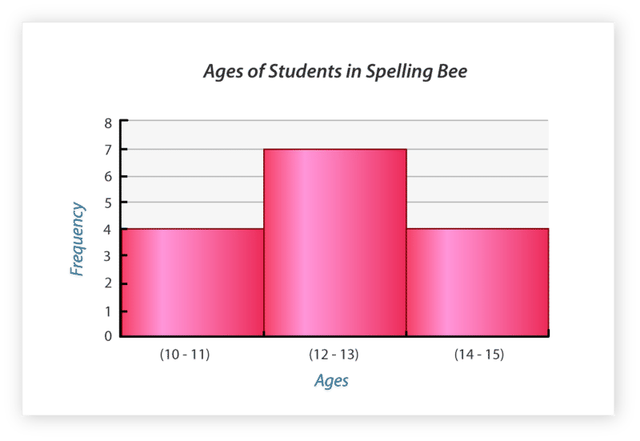

The data values listed below depict two periods of students’ scores on a history exam (out of 100). The teacher grading the exams would like to create a display that will compare the two sets of data and would allow him to eventually determine the overall mean, median, mode, and range of the test scores. What is the most appropriate display for this set of data?

$$
\begin{align*}
& \text{Per.1} \qquad 87 \quad 92 \quad 81 \quad 79 \quad 95 \quad 83 \quad 75 \quad 92 \quad 88 \quad 77 \quad 65 \quad 69 \quad 80 \quad 91 \quad 99\\
& \text{Per.2}	\qquad 91 \quad	97 \quad 98 \quad 85 \quad 81 \quad 79 \quad 70 \quad 62 \quad 82 \quad 73 \quad 69 \quad 99 \quad 78 \quad 74 \quad 85
\end{align*}
$$

**A stem-and-leaf plot will allow for the best comparison of the two sets of data. A stem-and-leaf plot will also arrange the data values for determining the mean, median, mode, and range. Recall that the first step in creating a stem-and-leaf plot is to arrange the data in order.**

$$
\begin{align*}
& \text{Period 1:} \qquad 65, \quad 69, \quad 75, \quad 77, \quad 79, \quad 80, \quad 81, \quad 83, \quad 87, \quad 88, \quad 91, \quad 92, \quad 92, \quad 95, \quad 99\\
& \text{Period 2:} \qquad 62, \quad 69, \quad 70, \quad 73, \quad 74, \quad 78, \quad 79, \quad 81, \quad 82, \quad 85, \quad 85, \quad 91, \quad 97, \quad 98, \quad 99
\end{align*}
$$

|     |     |     |
| --- | --- | --- |History Exam Scores
| **Leaf (Per. 1)** | **Stem** | **Leaf (Per. 2)** |
| --- | --- | --- |
| 9 5 | 6   | 2 9 |
| 9 7 5 | 7   | 0 3 4 8 9 |
| 8 7 3 1 0 | 8   | 1 2 5 5 |
| 9 5 2 2 1 | 9   | 1 7 8 9 |
| Key: $1 \big \| 9  = 91$ |     | Key: $9 \big \| 1 = 91$ |

III. **Collect, Organize and Analyze Real-World Data Using Selected Displays**

**You can use all you have learned about displays to collect, organize, and analyze real-world data.** In the following examples, you will be asked to create multiple displays to depict the same set of data.

The table below depicts the mean temperature (measured in Kelvin) of each planet in our solar system. Use what you have learned in the past lessons to display the data from the table on a bar and line graph, a stem-and-leaf plot, a box-and-whisker plot, and a histogram.

| **Planet** | **Mean Temperature (Kelvin)** |
| --- | --- |
| Mercury | 452 |
| Venus | 726 |
| Earth | 305 |
| Mars | 285 |
| Jupiter | 120 |
| Saturn | 59  |
| Uranus | 48  |
| Neptune | 37  |

")

\[Figure 10\]

Looking at the decreasing bars and lines on the graphs, you can conclude that a planet’s location affects its temperature. Planets closest to the sun have a higher temperature. Planets furthest from the sun have the lowest temperatures. It is evident that Venus has the highest surface temperature. Neptune has the coolest surface temperature.

**Stem-and-Leaf Plot**

37, 48, 59, 120, 285, 305, 452, 726

|     |     |
| --- | --- |Planet Temperatures (Kelvin)
| **Stem** | **Leaf** |
| --- | --- |
| 3   | 7   |
| 4   | 8   |
| 5   | 5   |
| 12  | 0   |
| 28  | 5   |
| 30  | 5   |
| 45  | 2   |
| 72  | 6   |

**Looking at the stem-and-leaf plot, it can be determined that none of the data share a stem. Therefore, there is no mode for this set of data.**

**You can see that the coolest temperature is 37 K and the warmest temperature is 726 K. The difference between the two extremes (the range) is 689 K.**

**The data values in the middle are 120 and 285. Therefore, the median planet temperature is 202.5 K.**

$$
\begin{align*}
120 + 285 &= 405\\
405 \div 8 &= 202.5
\end{align*}
$$

**The mean planet temperature is 254 K.**

$$
\begin{align*}
37 + 48 + 59 + 120 + 285 + 305 + 452 + 726 &= 2,032\\
2,032 \div 8 &= 254
\end{align*}
$$

We can create a histogram of the data too. Look at the frequency table and the histogram created below.

|     |     |     |
| --- | --- | --- |Histogram
| **Temperature** | **Tally** | **Frequency** |
| --- | --- | --- |
| 0 – 200 K | I I I I | 4   |
| 201 – 400 K | I I I | 3   |
| 401 – 600 K |     | 0   |
| 601 – 800 K | I   | 1   |

Looking at the histogram, it is apparent that most temperatures fall between zero and two hundred Kelvin. Three planets have surface temperatures that fall between two hundred one Kelvin and four hundred Kelvin. None of the planets have a surface temperature between four hundred one and six hundred Kelvin. One planet has a temperature between six hundred one and eight hundred Kelvin.

**By looking at the same data in different ways, we become very familiar with the data. One visual way may make more sense to you than another. No matter which ones you create, you can use visual displays of data to answer questions and draw conclusions.**

Real Life Example Completed
---------------------------

**_A Famous Woman_**

**Here is the original problem once again. Reread the problem and underline any important information.**

“There is a lot of talk about the men, but there must have been some famous women,” she said in class one day.

“Actually, that is a good point, Kelly,” Mr. Hawkins said. “There is one famous woman in particular. Would you be willing to do some research and present some information on her?”

“I would,” Kelly said smiling.

“I’ll help,” Tabitha said from across the room.

“Alright, good, and the rest of you can continue on your projects.”

Kelly and Tabitha got right to work. After looking up some information on the computer and in a few books on the Iditarod, they discovered that this famous woman was Susan Butcher. She was an amazing woman who won the Iditarod in four out of five years.

“Look, she even broke her own record,” Tabitha said.

“Yes, but she died in 2006 from leukemia. That is pretty sad.”

“It is,” Kelly said with a pause. “But she was very committed to her dogs and her racing. She even started a training facility. Her winning times seem slow compared with today, but they were very impressive then.”

“We can include that in our report. Let’s write down her finish times and make a graph to show them,” Tabitha suggested.

“That’s a great idea,” Kelly said smiling.

On a piece of paper the girls wrote down the following statistics.

1986 – 11 days 15 hours

1987 – 11 days 2 hours

1988 – 11 days 11 hours

1990 – 11 days 1 hour

“How are we going to display this? Which graph makes the most sense?” Kelly asked looking at Tabitha.

**“Let’s create a line graph. That way we can show how her times changed over the course of the four races that she won.” Tabitha suggested.**

**“Great. The $x$ axis can be the years that she won.”**

**“Yes, and the $y$ axis can be the times. We can create 15 lines-each one has 11 days as a starter and then we add the number of hours from 1 – 15 with the days.”**

**Here is the graph that the girls created.**

You can learn more about Susan Butcher at:

http://en.wikipedia.org/wiki/Susan_Butcher

http://www.susanbutcher.com/

http://www.achievement.org/autodoc/page/but0bio-1

http://www.galenfrysinger.com/iditarod_alaska.htm

Time to Practice
----------------

Directions: The graph below depicts the quarterly sales for two competing computer companies. Use the information on the graph to answer the question below.

2. True or false. One company has had a more significant increase in sales than the other.

3. If number two is true, which company has had a more significant increase in sales?

4. What were the average sales for Computer Company 1 in quarter 3?

5. What were the average sales for Computer Company 2 in quarter 4?

6. Which company did not show much of a change in profits from quarter 3 to quarter 4?

7. What were those average earnings for the last two quarters?

**The data table below depicts the final score for ten football games played this past season.**

$48 \quad 56 \quad 42 \quad 59 \quad 62 \quad 45 \quad 36 \quad 58 \quad 49 \quad 50$

8. What is the most appropriate display for the data?

9. Create a display of that data.

**The data below depicts the number of hours that 10 students in seventh grade spent working on a science project.**

$$
\begin{align*}
& \# 1 \quad \# 2 \quad \# 3 \quad \# 4 \quad \# 5 \quad \# 6 \quad \# 7 \quad \# 8 \quad \# 9 \quad \# 10\\
& 12 \quad \ 14 \quad \ 11 \quad \ 15 \quad \ 16 \quad \ 13 \ \quad 10 \quad \ \ 9 \quad \ \ 16 \quad \ \ 8
\end{align*}
$$

10. Create a bar graph of the data.

11. Create a line graph of the data.

**The data table below depicts the amount of weekly allowance received by fifteen teenagers.**

$25 \quad 15 \quad 20 \quad 30 \quad 10 \quad	5 \quad	8 \quad 12 \quad 18 \quad 23 \quad	27 \quad 15 \quad 18 \quad 25 \quad 10$

12. Create a frequency table of the data.

13. Create a histogram of the data.

14. Create a box-and-whisker plot of the data.

**The data table below depicts the magnitude of the last ten earthquakes that occurred in Sacramento, California.**

$3.8 \quad 4.2 \quad 4.3 \quad 5.1 \quad 3.6 \quad 4.6 \quad 3.6 \quad 3.5 \quad 4.1 \quad 4.5$

15. Create a stem-and-leaf plot of the data.

16. Create a histogram of the data.

</article>

### 11.8 Surveys

<article>

Introduction
------------

**_A Question of Racing_**

First, Thomas has to decide upon a question. He wants to know how many $7^{th}$ graders would be willing to race in the Iditarod when they are 18 years old. He knows that a good survey question will use who, what, when, where or how. He decides to use this question.

“Would you be willing to race in the Iditarod in Alaska when you are 18 years old?”

After learning about the youngest person to ever race in the Iditarod, Thomas decided to make his question very specific for age. The youngest person to ever race in the Iditarod was Dallas Seavey in 2005. He was just 18 years old. He has raced it several times since.

Now that Thomas has his question, he needs to figure out which sample he is going to use. He wants to survey $7^{th}$ graders like himself. Thomas only wants to survey $7^{th}$ graders so that his sample will be accurate.

Thomas knows of two great places to survey students. He has narrowed it down to either the $7^{th}$ grade adventure program or the $7^{th}$ grade lunch in the cafeteria. His concern about the adventure program is that not all of the students are enrolled in it. In the cafeteria, every student in the $7^{th}$ grade attends lunch at the same time.

Thomas is puzzled. He begins to think carefully about which group is the best survey.

**What do you think? Do you have an idea why one sample group might be better versus another? This lesson is all about surveys. You will learn all about them and why one sample creates a more accurate report. By the end of this lesson, you will know how to help Thomas with his dilemma.**

**_What You Will Learn_**

In this lesson you will learn to complete the following:

* Collect and organize real-world survey data.
* Choose the most effective data displays for a specified purpose.
* Identify potentially biased samples and survey questions.
* Analyze and interpret statistical survey data.

**_Teaching Time_**

**I. and II.** **Collect, Organize and Display Real-World Survey Data**

**_Surveys_** **are used to collect information about a** **_population_** **or group of individuals.** When a company would like to know if a group of people will purchase a new product, they create a survey. When a teacher would like to know if her students will participate in an after school science club, she creates a survey.

**The first step in surveying a group of people is to write an unbiased question.** Good survey questions are short and concise and usually begin with “Who, What, When, Where, Why, or How.”

**The next step is to choose a random sample of participants. In a** **_random sample,_** **each member of a group has an equal chance at being asked to participate in the survey.**

**After the results of the survey are in, statisticians analyze the data and use it to make estimates about groups of people.**

**Then you can create a visual display of the data.**

You have had lots of opportunities to graph data taken from surveys. In this lesson, you will learn to devise a survey question, to choose a random sample of participants, to choose an appropriate display for the survey results, and to analyze the data to make predictions about a group of individuals.

Now let’s look at an example.

Example

Twenty-five households were asked to participate in a survey in which they were asked to approximate the number of hours they watch T.V. each day. The results of the survey are listed on the table below. Determine the most appropriate display for the given data.

$4 \quad 7 \quad 2 \quad 1 \quad 0 \quad 5 \quad 3 \quad 4	\quad 5 \quad 2 \quad 1 \quad 0 \quad 3 \quad 4 \quad 5 \quad 6 \quad 3	\quad 2 \quad 1 \quad 2 \quad 3 \quad 6 \quad 4 \quad 5 \quad 4$

**A frequency table and histogram will depict the most and least frequent number of hours of television watched.**

| **Interval (Hours of Television)** | **Tally** | **Frequency** |
| --- | --- | --- |
| 0 – 1 | I I I I I | 5   |
| 2 – 3 | I I I I I I I I | 8   |
| 4 – 5 | I I I I I I I I I | 9   |
| 6 – 7 | I I I | 3   |

Looking at the histogram, you can see that the majority of families that participated in the survey watch between four and five hours of television each night. Five families watch between zero and one hours of television each night. Eight families watch between two and three hours of television nightly. Three of the twenty-five families watch between six and seven hours of television each night.

One hundred people were asked to participate in a survey about cereal. Participants were asked to choose their favorite from a list of ten cereals. The results of the survey are listed below.

| **Cereal** | **Amount** |
| --- | --- |
| Fruit Flakes | 12  |
| Chocolate Puffs | 18  |
| Oat-O’s | 9   |
| Raisin Delight | 3   |
| Honey Crunch | 17  |
| Bran Loops | 3   |
| Oat Squares | 9   |
| Fiber Max | 2   |
| Fruities | 10  |
| Cinnamon Squares | 17  |

**Display the results on a bar graph to compare the results for each type of cereal.**

**A** **_population_** **is a group about which you want information.** Because it is impossible to survey an entire population, a **_sample_** **or part of the population** is chosen to participate in the survey. The results from the sample group are used to make estimates about the population. Larger samples lead to more reliable estimates about the population. In a **_random sample_****, each member of the population has an equal chance of being chosen to participate in the survey.** Using random samples reduces the likelihood of bias.

**It is important to create and conduct a survey without bias.**

**The first way to prevent bias is to ensure that participants are chosen randomly.** For example, if surveying high school students about their favorite sport, it would be biased to take your only sample at the Friday night football game. Your survey results will be more valid and reliable if for example, you survey every fifth student that walks through the hallway.

**A well written survey question is another way to prevent bias.** Survey questions should be written clearly and concisely and should begin with “Who, What, When, Why, Where, or How.”

Example

You would like to conduct a survey to determine what activities middle school students like to do on the weekends. To ensure an unbiased sample, you should:

a. Go to the mall and survey every tenth person that walks by.

b. Survey middle school students at a local movie theatre.

c. Survey every fifth person leaving each of your classes.

**“C” is the best answer.** You should avoid taking the survey at the mall and the movies because it is likely that those participants will all say the mall or the movies as their favorite activity.

Example

You would like to know which types of dog food are most popular. You decide to wait outside three local pet food stores and interview every other person that comes out. Will your plan yield an unbiased sample?

**Yes, it is best to survey participants coming out of a pet food store because you know they are there to purchase pet products. Conducting the survey at three stores will yield a larger sample which will lead to more reliable results. You may also want to consider interviewing veterinarians or people at dog parks.**

Example

You survey every other person leaving a neighborhood pool. 89% of the participants support a proposal to purchase new chairs and umbrellas. Should you report that there is overwhelming support for your proposal?

**While there is overwhelming support for your proposal, the sample in which you took the survey is biased. It is likely that the people who use the pool frequently will support the idea of new chairs and umbrellas. It would be wise to randomly sample other people from the neighborhood.**

IV. **Analyze and Interpret Statistical Survey Data**

**Data is analyzed after it is collected and organized on a graph. Survey results are used to make predictions about a population.**

Example

Recall that twenty-five families were asked to state the number of hours they watch television each day. Use the results from the survey to answer the questions below.

| **Interval (Hours of Television)** | **Tally** | **Frequency** |
| --- | --- | --- |
| 0 – 1 | I I I I I | 5   |
| 2 – 3 | I I I I I I I I | 8   |
| 4 – 5 | I I I I I I I I I | 9   |
| 6 – 7 | I I I | 3   |

Nine participants out of twenty-five stated that they watch between four and five hours of television per day. To determine the percentage, express nine out of twenty-five as a fraction. This can be converted to an equivalent fraction with a denominator of one hundred. To do so, multiply the numerator and denominator by four.

$$
\begin{align*}
& \underline{9} \times 4  =  \underline{36}  =  36 \% \\
& \frac{36}{100}
\end{align*}
$$

**36% of the participants stated that they watch between four and five hours of television each day.**

Example

Recall that one hundred people were asked to choose their favorite cereal. Use the results from the survey to answer the questions below.

Nine participants stated they liked Oat-O’s. Nine participants stated that they liked Oat Squares. Therefore, eighteen out of the one hundred participants chose cereal with oats as their favorite. Eighteen out of one hundred is eighteen percent.

**The answer is 18%.**

**Whether you use survey data to answer questions or to draw your own conclusions, using a survey can help you to understand how people feel about a particular topic or activity.**

Real Life Example Completed
---------------------------

**_A Question of Racing_**

After all of this research about the Iditarod, Thomas is inspired. He wants to conduct a survey of his classmates about the Iditarod.

First, Thomas has to decide upon a question. He wants to know how many $7^{th}$ graders would be willing to race in the Iditarod when they are 18 years old. He knows that a good survey question will use who, what, when, where or how. He decides to use this question.

“Would you be willing to race in the Iditarod in Alaska when you are 18 years old?”

After learning about the youngest person to ever race in the Iditarod, Thomas decided to make his question very specific for age. The youngest person to ever race in the Iditarod was Dallas Seavey in 2005. He was just 18 years old. He has raced it several times since.

Now that Thomas has his question, he needs to figure out which sample he is going to use. He wants to survey $7^{th}$ graders like himself. Thomas only wants to survey $7^{th}$ graders so that his sample will be accurate.

Thomas knows of two great places to survey students. He has narrowed it down to either the $7^{th}$ grade adventure program or the $7^{th}$ grade lunch in the cafeteria. His concern about the adventure program is that not all of the students are enrolled in it. With the cafeteria, every student in the $7^{th}$ grade attends lunch at the same time.

Thomas is puzzled. He begins to think carefully about which group is the best survey.

**When Thomas began to think about the two groups, he started to develop some ideas why one might be a better survey group than the other. He started with the adventure group.**

**Adventure Group**

**\-loves outdoor adventure**

**\-probably has heard of the Iditarod**

**\-enthusiastic about outdoor challenges**

**\-not everyone is registered-not an accurate sample of all of the $7^{th}$ grade**

**Then Thomas began to think about his question. Because he wants to know how many** $7^{th}$ **graders would be willing to race in the Iditarod when they are 18 years old, he needs to sample the largest group of** $7^{th}$ **graders that he can.**

**Because every** $7^{th}$ **grader eats lunch at the same time in the cafeteria, asking every other person in line for lunch the question will give Thomas a lot of information for his survey.**

**Then he call tally his results and report his findings.**

Vocabulary
----------

Here are the vocabulary words that are found in this lesson.

__Survey__

information gathered about people’s opinion on a particular topic or activity.

__Population__

a group of people

__Random Sample__

a sample where everyone in a group has an equal chance of answering the survey question.

__Sample__

the part of a population that participates in a survey.

Technology Integration
----------------------

[Khan Academy, Surveys and Samples](http://www.youtube.com/watch?v=nabw6v93Xns)

Time to Practice
----------------

Directions: Use the information provided to answer the following questions.

One hundred people were asked to participate in a survey about travel. Participants were asked to state whether they had visited each of the cities listed below.

| **City** | **Number of People Who Visited:** |
| --- | --- |
| Waikiki | 85  |
| New York City | 80  |
| San Francisco | 87  |
| Chicago | 54  |
| Dallas | 35  |
| Orlando | 38  |
| Atlanta | 50  |
| Seattle | 44  |
| Denver | 32  |

1. Create a bar graph of the data.

2. What percent of the people visited Waikiki?

3. What percent of the people visited Denver?

4. What percent of the people did not visit Dallas?

5. What percent of the people did not visit Chicago?

6. Which city had more people visited than any other city?

7. Which city had less people visited than any other city?

Thirty students were selected at random at Montgomery High School. Each participant was asked to state the number of textbooks they were carrying at that moment. The results of the survey are depicted below. Choose the best display to depict the data. Then use the graph you created to answer the questions below.

$$
\begin{align*}
& 0 \qquad 2 \qquad 4 \qquad 3 \qquad 1\\
& 2 \qquad 5 \qquad 0 \qquad 4 \qquad 3\\
& 2 \qquad 5 \qquad 4 \qquad 3 \qquad 2\\
& 1 \qquad 0 \qquad 0 \qquad 2 \qquad 3\\
& 5 \qquad 6 \qquad 1 \qquad 2 \qquad 4\\
& 5 \qquad 6 \qquad 3 \qquad 2 \qquad 3
\end{align*}
$$

8. Which graph is the best display of the data?

9. Create that graph here.

10. What percent of the students had the most common amount of books in their backpack?

11. What percent of the students had between four and seven books in their backpack?

12. How many students had 1 book in their backpacks?

13. How many students had 0 books in their backpacks?

14. What percent had 1 book?

15. What percent had 0 books?

Create a survey question. Decide who will be the sample population. Write a few sentences to describe who will take part in the survey and how you will administer the survey. Administer the survey, record the results on a table. Choose the most appropriate display for the data. Use these questions for guidance.

16. What is your sample population?

17. How many people are in the sample?

18. Does your question use who, what, when, where or how?

19. Is your sample biased, why or why not?

20. Are your results what you expected?

</article>

## 12.0 Probability

<article>

</article>

### 12.1 Theoretical Probability

<article>

Introduction
------------

**_The Talent Show_**

“I wonder if we are going to have the talent show this year,” Carmen asked at lunch one day.

“I am sure that we are,” Tyler said, biting into his ham sandwich. “After all, there were only two years that the talent show did not happen and that was because of the circumstances.”

“Well, are there any circumstances this year?”

“I don’t think so. The probability is high that it is going to happen.”

“What is the probability of the talent show happening?” Carmen asked, taking a sip of milk.

**Before Tyler answers, let’s think about this. What is the probability of the event happening?**

**To answer this question, you need to know about probability. This lesson will teach you how to figure out probability by thinking about favorable outcomes and total outcomes. By the end of the lesson, you will know how to answer this question.**

**_What You Will Learn_**

In this lesson, you will learn how to complete the following:

* Recognize the theoretical probability of an event as the ratio of favorable outcomes to possible outcomes.
* Calculate simple theoretical probabilities.
* Write theoretical probabilities as fractions, decimals or percents.
* Make predictions based on theoretical probabilities.

**_Teaching Time_**

I. **Recognize the Theoretical Probability of an Event as the Ratio of Favorable Outcomes to Possible Outcomes**

This chapter is all about probability. Probability is something that you hear about all the time. Anytime you talk about the chances that something will or won’t happen, you are talking about probability. The trick about probability is that it isn’t just about "educated guessing". It is also about math. There are mathematical ways of figuring out the likelihood that an event is going to or not going to occur. But let’s start with an understanding of probability.

**What is probability?**

**_Probability_** **is the likelihood that an event will occur.** It is a mathematical way of calculating how likely an **event** is likely to occur. **An** **_event_** **is a result of an experiment or activity** that might include such things as:

* flipping a coin
* spinning a spinner
* rolling a number cube
* choosing an item from a jar or bag

**How do we calculate probability?**

We calculate probability by looking at the ratio of **_favorable outcomes_** to **_total outcomes_** in a given situation. In ratio form, the probability of an event is:

$P (\text{event}) = \text{favorable outcomes} : \text{total outcomes}$

An **_outcome_** is a possible result of some event occurring. For example, when you flip a coin, “heads” is one outcome; tails is a second outcome. **_Total outcomes_** are computed simply by counting all possible outcomes.

**Chapter Note:** Keep in mind as you go through this chapter that all outcomes used are presumed to be “fair.” That is – when you flip a coin, the outcomes of heads or tails are equally likely. When you spin a spinner, sections are all of equal size and equally likely to be landed on. When you toss a number cube, faces of the cube are the same size and again equally likely to be landed on. And so on.

$$
\begin{align*}
\text{total outcomes} & = \text{heads, tails}\\ 
& = 2 \ \text{total outcomes}
\end{align*}
$$

**For tossing a number cube:**

$$
\begin{align*}
\text{total outcomes} & = \cdot \ 1 \ \cdot \cdot \ 2 \ \cdot \cdot \cdot \ 3 \ \cdot \cdot \cdot \cdot \ 4 \ \cdot \cdot \cdot \cdot \cdot \ 5 \ \cdot \cdot \cdot \cdot \cdot \cdot \ 6\\
& = 6 \ \text{total outcomes}
\end{align*}
$$

**For selecting a day of the week:**

$$
\begin{align*}
\text{total outcomes} & = \text{Monday, Tuesday, Wednesday, Thursday, Friday, Saturday, Sunday}\\
& = 7 \ \text{total outcomes}
\end{align*}
$$

**_Favorable outcomes_** **are the specific outcomes you are looking for.**

**For flipping a coin and having it come up heads:**

$$
\begin{align*}
\text{favorable outcomes} & = \text{heads}\\
& = 1 \ \text{favorable outcome}
\end{align*}
$$

**For tossing a number cube and having it come with up an even number:**

$$
\begin{align*}
\text{favorable outcomes} & = \cdot \ 1 \ \cdot \cdot \ 2 \ \cdot \cdot \cdot \ 3 \ \cdot \cdot \cdot \cdot \ 4 \ \cdot \cdot \cdot \cdot \cdot \ 5 \ \cdot \cdot \cdot \cdot \cdot \cdot \ 6\\
& = 3 \ \text{favorable outcomes}
\end{align*}
$$

**For randomly choosing a date and have it land on a weekday:**

$$
\begin{align*}
\text{favorable outcomes} & = \text{Monday, Tuesday, Wednesday, Thursday, Friday}\\
& = 5 \ \text{favorable outcomes}
\end{align*}
$$

**To write a ratio, we compare the favorable outcome to the total outcomes. Comparing favorable outcomes to possible total outcomes is what we call** **_theoretical probability._**

II. **Calculate Simple Theoretical Probabilities**

**Now that you know how to think about theoretical probability, we can look at calculating some simple probabilities. Remember, that we are going to be writing ratios that compare favorable outcomes with total outcomes.**

The probability of any event is written as $P (\text{event})$. So:

$P(A)$ is the probability that _event_ $A$ will occur.

$P (\text{heads})$ is the probability that _heads_ will turn up on a flipped coin.

$P (5)$ is the probability that a number cube will turn up as _5_

Look at this example.

Example

What is the probability of flipping heads on a coin?

**To work through this probability, we are going to be writing a ratio that compares the number of favorable outcomes with the total number of outcomes.**

**Favorable outcome = 1, since there is one heads on a coin**

**Total outcomes = 2, since there is the possibility of heads or tails**

**The answer is 1:2.**

**For tossing a number cube and having it land an even number:**

**To find any probability, follow the steps below.**

Problem: What is the probability of the arrow landing on a yellow section?

There are 2 yellow spaces, so

favorable outcomes = 2

**Step 2: Count the number of total outcomes.**

There are 5 spaces in all, so

total outcomes = 5

**Step 3: Write the ratio of favorable outcomes to total outcomes**

$$
\begin{align*}
P (\text{yellow}) &= \text{favorable outcomes} : \text{total outcomes}\\
&= 2:5
\end{align*}
$$

**Now let’s apply these steps to an example.**

Example

What is the probability of the arrow landing on a silver or pink section?

**Step 1: Count the number of favorable outcomes.**

There are 2 silver spaces and 1 pink space, so

favorable outcomes = 3

**Step 2: Count the number of total outcomes.**

There are 5 spaces in all, so

total outcomes = 5

**Step 3: Write the ratio of favorable outcomes to total outcomes**

$P (\text{silver or pink}) = \text{favorable outcomes} : \text{total outcomes} = 3:5$

**Our answer is 3:5.**

**12A. Lesson Exercises**

**Write each theoretical probability. Be sure to simplify the ratio when necessary.**

1.  **What is the probability of rolling a 1 or a 3 on a number cube?**
2.  **If there are four blue marbles and one red marble in a bag, what is the probability of pulling out a red one?**
3.  **What is the probability of pulling out a blue one?**

III. **Write Theoretical Probabilities as Fractions, Decimals or Percents**

Now that you know about probability and how to calculate a theoretical probability, we can look at the different forms that probabilities can take.

**Remember back to our work with ratios in an earlier chapter? You learned that ratios can be written as fractions, decimals and percents.**

Example

1:2 can be written as $\frac{1}{2}$ or as a decimal of .50 or as a percent of 50%

**Because probability is written as a ratio, we can also write probabilities as fractions, decimals and/or percents.**

Let’s look at doing this with an example.

Example

A bag contains 5 black ping pong balls, 8 white ping pong balls, and 7 yellow ping pong balls. What is the probability of drawing a black ping pong ball from the bag?

**First, let’s look at writing a ratio.**

$$
\begin{align*}
P (\text{black}) &= \frac{\text{favorable outcomes}}{\text{total outcomes}}\\
\text{favorable outcomes} &= 5\\
\text{total outcomes} &= 20\\
P (\text{black}) &= 5:20\\
&= 1:4
\end{align*}
$$

**Now that we have a ratio, we can easily take this ratio and write it as a fraction. Notice that the first value in the ratio becomes the numerator and the second number becomes the denominator.**

**1:4 becomes $\frac{1}{4}$**

**Next, we can take this and convert it to a decimal. There are two ways to do this.**

**The first way is to divide the numerator by the denominator.**

$\overset{ \ \ .25}{4 \overline{ ) {1.00 \;}}}$

**The decimal is .25.**

**The second way is to write a proportion. We can convert one-fourth to a proportion out of 100.**

$$
\begin{align*}
\frac{1}{4} &= \frac{\Box}{100}\\ 
\frac{1}{4} &= \frac{25}{100}
\end{align*}
$$

**Now we can write it as a decimal.**

**.25**

**The proportion shows us how to convert the decimal to a percent easily.**

**.25 or $\frac{25}{100}=25\%$**

**Now we have written the probability all four possible ways.**

Let’s look at another example.

Example

Thinking about the bag with the ping pong balls, what is the probability of choosing a yellow ping pong ball?

$$
\begin{align*}
P (\text{yellow}) &= \frac{\text{favorable outcomes}}{\text{total outcomes}}\\
\text{favorable outcomes} &= 7\\
\text{total outcomes} &= 20\\
P (\text{yellow}) &=  7:20
\end{align*}
$$

**Now let’s write this as a fraction.**

$7:20 = \frac{7}{20}$

**As a decimal:**

$\frac{7}{20}=\frac{35}{100}=.35$

**And as a percent:**

$.35 = 35\%$

**_Remember you can also convert a decimal to a percent by moving the decimal point two places to the right and then adding a percent sign._**

**12B. Lesson Exercises**

**Write each ratio as a fraction, decimal and percent.**

1.  **1:5**
2.  **2:4**
3.  **4:5**

IV. **Make Predictions Based on Theoretical Probabilities**

**A** **_prediction_** **is a reasonable guess about what will happen in the future.** Good predictions should be based on facts. For example, you might predict that it’s going to rain today. Your prediction is reasonable if it is based on facts and evidence. For example, you might base your prediction on:

* a reliable weather report you heard
* dark clouds in the sky
* a satellite photo of your area
* a phone call from a nearby friend who lives where it’s raining

**The most accurate kinds of predictions are based on probability.**

$P (\text{red}) = \frac{favorable \ outcomes}{total \ outcomes}=\frac{3}{5}$

**Since a 3 out of 5 probability is greater than 50 percent, it is reasonable to predict that the spinner is likely to land on red.**

Here are some other reasonable predictions you might make.

| **Reasonable Prediction** | **Reason** |
| --- | --- |
| The spinner is more likely to land on red than blue. | There are 3 red sections and only 1 blue section. |
| The spinner is equally likely to land on blue or yellow. | There spinner has an equal number of blue and yellow sections – one each. |
| On the average, a ratio of about 4 of 5 spins are likely turn up blue or red. | Four out of 5 sections are blue or red. |
| Most of the time the spinner will not land on blue or yellow. | Blue and yellow combined make up fewer than half of the sections. |

**Not all predictions are reasonable.**

For example, take a look at these unreasonable predictions.

| **Unreasonable Prediction** | **Reason** |
| --- | --- |
| The spinner is more likely to land on blue before it lands on red. | There are fewer blue sections (1) than red sections (3). |
| The spinner will never land on blue before it lands on red. | The spinner _can_ land on blue before it lands on red; it just isn’t likely to occur. |
| Three out of every 5 spins will always be red. | On the average, 3 of 5 spins will be red, but on any given series of spins anything can happen. |

**When making predictions it’s best to keep in mind that probability predicts only what is** **_likely_** **to happen.** All events are subject to chance. On any given event, anything can happen. If you flip a coin 4 times, you are most _likely_ to land on heads twice and tails twice.

However, that doesn’t mean that on any given set of 4 flips you might land on heads _zero_ times, or you might land on heads 4 times. Neither event is likely, but both are possible and each will happen from time to time.

**So now you might ask – what good is probability for making predictions if you can’t rely on it to be true** **_every_** **time?** In fact, the value of probability is very limited in the short term. But over the long term, predictions based on probability are usually highly accurate.

**In general, the greater the number of outcomes you have, the closer a prediction based on probability is likely to be.**

Let’s look at an example.

Example

To make predictions using data, use the table and follow the steps below.

| **Pizza shop** | **Favorite** |
| --- | --- |
| Pizza Town | 10% |
| Hot ‘$n$’ Tasty | 25% |
| Joe Shmoe’s | 35% |
| The Noble Pie | 20% |

Problem: Out of 90 orders, predict how many customers will call Pizza Town for pizza.

**You can see that the percent of people who called Pizza Town was 10%. We know that there were 90 orders. To find the number of orders from Pizza Town, we need to find 10% of the 90 orders.**

Solution: Find 10 percent of the total.

$$
\begin{align*}
10. \ \text{of} \ 90 &= 0.1 \cdot 90\\
&= 9
\end{align*}
$$

**So you would predict that 9 out of 90 customers would order from Pizza Town.**

**12C. Lesson Exercises**

**Use the data to answer the following questions.**

**Data for Joe Shmoe’s Pizza is shown in the table.**

| **Pizza type** | **Favorite** | **Pizza type** | **Favorite** |
| --- | --- | --- | --- |
| **cheese** | **35%** | **sausage** | **15%** |
| **pepperoni** | **25%** | **mushroom** | **5%** |
| **green peppers** | **10%** | **spinach** | **3%** |
| **onion** | **5%** | **hot peppers** | **2%** |

1.  **Out of 40 orders, predict how many customers will order pepperoni pizza.**
2.  **Out of 100 orders, predict how many customers will order spinach pizza.**
3.  **Out of 60 orders, predict how many customers will order either sausage or pepperoni pizza.**
4.  **Out of 80 orders, predict which will be greater, the number of sausage pizzas or green pepper pizzas.**

Real–Life Example Completed
---------------------------

**_The Talent Show_**

**Here is the original problem once again. Reread it and then answer the following questions about probability.**

“I wonder if we are going to have the talent show this year,” Carmen asked at lunch one day.

“I am sure that we are,” Tyler said, biting into his ham sandwich. “After all, there were only two years that the talent show did not happen and that was because of the circumstances.”

“Well, are there any circumstances this year?”

“I don’t think so. The probability is high that is going to happen.”

“What is the probability of the talent show happening?” Carmen asked, taking a sip of milk.

**To think about the probability of the talent show happening, we can take the data from the past ten years and create a ratio.**

$\text{Probability} = \frac{favorable \ outcomes}{total \ outcomes}$

**In the past ten years, there have been 8 talent shows. There have been ten possible years to calculate with. These are the total outcomes. Here is our ratio.**

**8:10**

**We can write this as a fraction, a decimal and a percent too.**

$\frac{8}{10}=.8=80\%$

**There is an 80% chance that the talent show will happen. These are very good odds-it is very likely to occur.**

Vocabulary
----------

Here are the vocabulary words that are found in this lesson.

__Probability__

the likelihood that an event will happen.

__Event__

result of an experiment or an activity

__Favorable Outcome__

the outcome that you are looking for

__Total Outcomes__

the total number of possible outcomes

__Ratio__

a comparison of two quantities

__Theoretical Probability__

the ratio that compares the number of favorable outcomes to the number of total outcomes.

__Prediction__

a reasonable guess about a future event.

Technology Integration
----------------------

!?[0](https://www.youtube.com/watch?v=uzkc-qNVoOk)

[Khan Academy, Basic Probability](http://www.youtube.com/watch?v=uzkc-qNVoOk)

!?[0](https://www.youtube.com/watch?v=YWt_u5l_jHs)

[James Sousa, Introduction to Probability](http://www.youtube.com/watch?v=YWt_u5l_jHs)

!?[0](https://www.youtube.com/watch?v=IZAMLgS5x6w)

[James Sousa, Determining Probability](http://www.youtube.com/watch?v=IZAMLgS5x6w)

Time to Practice
----------------

Directions: Answer each question or solve each problem as it connects to probability.

1. For rolling a 4 on the number cube:

(a) List each favorable outcome.

(b) Count the number of favorable outcomes.

(c) Write the total number of outcomes.

2. For rolling a number greater than 2 on the number cube:

(a) List each favorable outcome.

(b) Count the number of favorable outcomes.

(c) Write the total number of outcomes.

3. For rolling a 5 or 6 on a number cube:

(a) List each favorable outcome.

(b) Count the number of favorable outcomes.

(c) Write the total number of outcomes.

4. A box contains 12 slips of paper numbered 1 to 12. For randomly choosing a slip with an even number on it:

(a) List each favorable outcome.

(b) Count the number of favorable outcomes.

(c) Write the total number of outcomes.

5. A box contains 12 slips of paper numbered 1 to 12. For randomly choosing a slip with a number greater than 3:

(a) List each favorable outcome.

(b) Count the number of favorable outcomes.

(c) Write the total number of outcomes.

(a) Count the number of favorable outcomes.

(b) Write the total number of outcomes.

7. For randomly choosing a marble and having it turn out to be large:

(a) Count the number of favorable outcomes.

(b) Write the total number of outcomes.

8. For randomly choosing a marble and having it turn out to be blue:

(a) Count the number of favorable outcomes.

(b) Write the total number of outcomes.

9. For randomly choosing a marble and having it turn out to be small:

(a) Count the number of favorable outcomes.

(b) Write the total number of outcomes.

10. For randomly choosing a marble and having it turn out to be orange and large:

(a) Count the number of favorable outcomes.

(b) Write the total number of outcomes.

(a) List each favorable outcome.

(b) Count the number of favorable outcomes.

(c) Count the total outcomes.

(d) Write the probability. Simplify, if necessary.

12. What is the probability of the spinner landing on 3 or 4?

(a) List each favorable outcome.

(b) Count the number of favorable outcomes.

(c) Count the total outcomes.

(d) Write the probability. Simplify, if necessary.

13. What is the probability of the spinner landing on blue?

(a) List each favorable outcome.

(b) Count the number of favorable outcomes.

(c) Count the total outcomes.

(d) Write the probability. Simplify, if necessary.

14. What is the probability of the spinner landing on a silver number greater than 4?

(a) List each favorable outcome.

(b) Count the number of favorable outcomes.

(c) Count the total outcomes.

(d) Write the probability. Simplify, if necessary.

Directions: Answer each question and write the probability as a fraction, a decimal and a percent.

(a) List each favorable outcome.

(b) Count the number of favorable outcomes.

(c) Write the probability.

16. What is the probability of pulling a red sock out of the dryer?

(a) List each favorable outcome.

(b) Count the number of favorable outcomes.

(c) Write the probability.

17. What is the probability of pulling a blue or white sock out of the dryer?

(a) List each favorable outcome.

(b) Count the number of favorable outcomes.

(c) Write the probability.

18. What is the probability of pulling a blue or red sock out of the dryer?

(a) List each favorable outcome.

(b) Count the number of favorable outcomes.

(c) Write the probability.

</article>

### 12.2 Experimental Probability

<article>

Introduction
------------

**_The Juggler_**

Tyler has decided to enter his juggling into the Talent show. After practicing for a long time, he has decided to work on juggling four balls instead of three.

“I know this will help me to be a winner,” he tells his Mom.

“It is very impressive, Ty,” She says. “Are you able to do it without dropping any?”

“Well, I’m not sure. Maybe I should do an experiment and see how I am doing.”

Tyler asks his older sister Liz to help him calculate his juggling experiment. Tyler figures that he can attempt to juggle for three minutes without dropping any balls. He figures twenty attempts will give him a good idea of how he will do in the show.

Liz helps Tyler keep track.

She notes that after 20 attempts, Tyler dropped a ball three times. The other 17 times he was able to juggle for three minutes without dropping anything.

Liz writes this down.

20 attempts

17 successes

3 drops

“How did I do? What is the probability that I will drop a ball?” Tyler asks Liz.

**While Tyler and Liz figure out the experimental probability of his dropping a ball, you can take some time to learn about experimental probability.**

**_What You Will Learn_**

By the end of this lesson, you will understand how to demonstrate the following skills.

* Recognize the experimental probability of events as the ratio of successful outcomes to trials attempted.
* Calculate simple experimental probability.
* Write experimental probability as fractions, decimals and percents.
* Make predictions based on experimental probability given experimental survey or historical data.

**_Teaching Time_**

I. **Recognize the Experimental Probability of Events as the Ratio of Successful Outcomes to Trials Attempted**

**Probability is based on simple facts. For example, since there are two sides of a coin, heads and tails, and each side has an equal chance of turning up, it makes sense to say:** **_the probability of heads turning up is 50 percent, or 1 out of 2._**

**However, making sense and being** **_true_** **are often two different things.** It may make sense to say the probability of heads is 50 percent, **but does a real coin in the real world actually turn up heads 50 percent of the time?**

To answer that question, you need to learn about **_experimental probability._**

**_Experimental probability_** **is probability based on doing actual experiments** – flipping coins, spinning spinners, picking ping pong balls out of a jar, and so on. To compute the experimental probability of the spinner landing on the red section you would need to conduct an experiment. **Suppose you were to spin the spinner 60 times.**

Total outcomes: 60 spins

$$
\underline{\text{Experimental probability}}: \ P (\text{red}) = \frac{\text{favorable outcomes}}{\text{total outcomes}}=\frac{\text{number of red}}{\text{total number of spins}}
$$

**Now we can use this data to conduct an experiment. Look at this example.**

Example

What is the experimental probability of having the arrow of the spinner land in the red section?

| **trial** | **1** | **2** | **3** | **4** | **5** | **6** | **Total** |
| --- | --- | --- | --- | --- | --- | --- | --- |
| **red** favorable outcomes | 2   | 3   | 1   | 5   | 2   | 4   | **17** |
| **total spins** total outcomes | 10  | 10  | 10  | 10  | 10  | 10  | **60** |
| **experimental probability:** ratio of favorable outcomes to total outcomes | $x$ | $x$ | $x$ | $x$ | $x$ | $x$ | **17:60** |

Solve the problem by spinning the spinner 60 times in 6 trials of 10 spins each as shown in the table above. Then follow the steps below.

**Step 1:** Total up the number of favorable outcomes – the number of times the spinner landed on red. This is shown in the final column of the table as 17.

**Step 2:** Add up the number of total outcomes – the total number of spins. This is shown in the final column of the table as 60.

**Step 3:** Compute the experimental probability – the ratio of favorable outcomes to total outcomes in percent form. The experimental probability, in ratio form, is 17 to 60.

**The answer is 17:60.**

Example

A number cube was rolled in a probability experiment 40 times. The results are shown in the table. Compute the experimental probability of rolling a 5.

| **dots on number cube** | $\cdot$ | $\cdot \cdot$ | $\cdot \cdot \cdot$ | $\cdot \cdot$  $\cdot \cdot$ | $\cdot \cdot \cdot$  $\cdot \cdot$ | $\cdot \cdot \cdot$  $\cdot \cdot \cdot$ | **Total** |
| --- | --- | --- | --- | --- | --- | --- | --- |
|     | 1   | 2   | 3   | 4   | 5   | 6   |     |
| **number of times cube landed** | $\cancel{\|}$ | $\| \| \| \|$ | $\cancel{\| \| \| \|}$ | $\cancel{\| \| \| \|}$ | $\cancel{\| \| \| \|}$ | $\cancel{\| \| \| \|}$ | $x$ |
|     | $\|$ |     | $\|$ | $\|$ | $\|$ | $\|$ |     |
| **total from tally** | 6   | 4   | 9   | 8   | 6   | 7   | **40** |
| **favorable outcomes** | $x$ | $x$ | $x$ | $x$ | 6   | $x$ | **6** |
| **experimental probability:** ratio of favorable outcomes to total outcomes | $x$ | $x$ | $x$ | $x$ | $x$ | $x$ | 6:40 = 3:20 |

**Step 1:** Add up the tallies to get the number of total number of outcomes. This is shown as 40 in the third row of the table.

**Step 2:** Find the number of favorable outcomes – the number of times the number cube landed on 5.

**Step 3:** Compute the experimental probability by finding the ratio of favorable outcomes to total outcomes. The experimental probability of rolling a 5 is 6 to 40. In simplifed form, this is a 3:20 ratio.

II. **Calculate Simple Experimental Probabilities**

**Most probability experiments are conducted as a process of testing a hypothesis. A** **_hypothesis_** **is a statement that you want to test to see if it’s true.**

Here are some examples of hypotheses.

* A flipped coin comes up heads 50 percent of the time. True or false?
* A number cube will land on _three_ $\frac{1}{6}$ th of the time. True or false?
* It rains more on the weekend than it does on weekdays. True or false?
* You perform better on math tests when you get a good night’s sleep. True or false?

* **A flipped coin will land on heads $\frac{1}{2}$, or 50 percent of the time. True or false?**

To compute the experimental probability of the hypothesis you would need to conduct an experiment. Suppose you were to flip the coin 50 times. To find out how often it lands on heads, follow the steps below.

**Step 1:** **_State your hypothesis._**

The coin will land on heads $\frac{1}{2}$, or 50 percent of the time.

**Step 1:** **_Compute the theoretical probability_**

Find the probability of flipping a coin and having it turn up heads. To do this, you need to identify:

* favorable outcomes – the number of times the coin is likely to land on heads
* total outcomes – the total number of flips

**Step 2:** **_Make a prediction._**

Use theoretical probability to make a prediction. Since there are 2 different outcomes, and 1 of those outcomes is heads, it makes sense to predict that heads will come up 1 out of 2, or 50 percent of the time. (If you need practice in changing ratios to decimals and percents, see 12.1.3.)

$$
P (\text{heads}) = \frac{\text{favorable outcomes}}{\text{total outcomes}} =  \frac{1}{2}  \Longrightarrow \text{prediction:heads} = 50\%
$$

**Step 3:** **Conduct an experiment and collect data.** You can use a tally table like the one shown below. Fill in your predicted values first. Then tally as you conduct the experiment.

| **trial** | **1** | **2** | **3** | **4** | **5** | **Prediction** | **Total** |
| --- | --- | --- | --- | --- | --- | --- | --- |
| **tally** | $\| \| \| \|$ | $\cancel{\| \| \| \| \|}$ | $\| \| \|$ |     |     | $x$ | $x$ |
| **heads** |     |     |     |     |     | 25  |     |
| **total flips** |     |     |     |     |     | 50  |     |

Here is what your completed table might look like.

| **trial** | **1** | **2** | **3** | **4** | **5** | **Prediction** | **Total** |
| --- | --- | --- | --- | --- | --- | --- | --- |
| **tally** | $\| \| \| \|$ | $\cancel{\| \| \| \| \|}$ | $\| \| \|$ | $\cancel{\| \| \| \| \|}$ | $\cancel{\| \| \| \| \|}$ | $x$ | $x$ |
|     |     |     |     | $\|$ |     |     |     |
| **heads** | 4   | 5   | 3   | 6   | 5   | 25  | 23  |
| **total** | 10  | 10  | 10  | 10  | 10  | 50  | 50  |
| **flips** |     |     |     |     |     |     |     |

**Step 4:** **_Analyze your data and see how well it agrees with your prediction._**

You can see that 23 out of 50 flips came up heads. Does your data agree with your prediction? Not perfectly, but 23 is close to 25, so your results are fairly close to your prediction.

To see how close you are, compare the experimental probability with your prediction in percent form.

$\text{Prediction}: 50 \% \qquad \quad \text{Experimental probability}: \frac{23}{50} = 46 \%$

**You can see that your experimental probability of 46% agrees fairly well with your predicted probability of 50 percent. In general, the more total outcomes you include in your experiment, the more likely your experimental probability is to agree with your predicted probability.**

III. **Write Experimental Probability as Fractions, Decimals or Percents**

Just like we could write theoretical probabilities as fractions, decimals or percents, we can also do this with experimental probabilities. If you think about it, it makes perfect sense.

**12D. Lesson Exercises**

**Write each experimental probability as a percent.**

1.  $\frac{23}{50}$
2.  **45 out of 50 flips of a coin, the coin turned up with tails.**
3.  **.76**

IV. **Make Predictions Based on Experimental Probability Given Experimental, Survey or Historical Data**

Sometimes you can make predictions based on data that has been collected. When we make a prediction, we have to look at the type of data collected. Sometimes, there will be experimental data because someone will have written a hypothesis and tested the hypothesis. Sometimes, there will be data collected as the result of a survey. Other times, there will be historical data.

You can use data for making predictions about what will happen in the future. The early results from the election for mayor of Bridgewater are shown below. Because this is early data, not all of Bridgewater’s 1500 registered voters have cast their votes.

| **Precinct** | **1** | **2** | **Total** |
| --- | --- | --- | --- |
| **Diaz** | 160 | 116 |     |
| **Green** | 93  | 231 |     |

Example

If all of Bridgewater’s 1500 voters vote, whom do you predict will win the election and by how many votes?

**We can figure out this prediction by following these steps.**

**Step 1:** Total up the votes for each candidate.

$$
\begin{align*}
\text{Diaz} &= 160 + 116\\
&= 276\\
\text{Green} &= 93 + 231\\
&= 324\\
\text{Total} &= 276 + 324\\
&= 600 \ \text{votes were cast}
\end{align*}
$$

**Step 2:** Find the fraction of the total votes so far that each candidate got. Change the fraction to a percent.

$$
\begin{align*}
\text{Diaz} &= 276 \ \text{out of} \ 600\\
&= \frac{276}{600}\\
&= 0.46 = 46\%\\
\text{Green} &= 324 \ \text{out of} \ 600\\
&= \frac{324}{600}\\
&= 0.54 = 54\%
\end{align*}
$$

**Step 3:** Use the percentage to find out the number of votes each candidate will get out of the 1500 voters. Round the answer to the nearest whole vote, if necessary

$$
\begin{align*}
\text{Diaz} &= 46. \ \text{of} \ 1500\\
&= 0.46 \cdot 1500\\
&= 690\\
\text{Green} &= 54. \ \text{of} \ 1500\\
&= 0.54 \cdot 1500\\
&= 810
\end{align*}
$$

**Now you know that according to the early votes, that Green will have more votes if things continue along this trend.**

**Step 4:** Subtract to find the margin of victory.

$$
\begin{align*}
\text{Green} - \text{Diaz} &= \text{victory margin}\\
810 - 690 &= 120 \ \text{votes}
\end{align*}
$$

**Our prediction based on these early votes is that Green will win the election by 120 votes.**

**_Notice that we can’t be absolutely sure, but that this is a prediction based on the current voting facts!_**

Real–Life Example Completed
---------------------------

**_The Juggler_**

Tyler loves juggling. He has been juggling for a long time and loves working on his juggling. He can juggle three balls very easily and can also juggle rings and pins. He very rarely drops anything or makes a mistake.

Tyler has decided to enter his juggling into the Talent show. After practicing for a long time, he has decided to work on juggling four balls instead of three.

“I know this will help me to be a winner,” he tells his Mom.

“It is very impressive, Ty,” She says. “Are you able to do it without dropping any?”

“Well, I’m not sure. Maybe I should do an experiment and see how I am doing.”

Tyler asks his older sister Liz to help him calculate his juggling experiment. Tyler figures that he can attempt to juggle for three minutes without dropping any balls. He figures twenty attempts will give him a good idea of how he will do in the show.

Liz helps Tyler keep track.

She notes that after 20 attempts, Tyler dropped a ball three times. The other 17 times he was able to juggle for three minutes without dropping anything.

Liz writes this down.

20 attempts

17 successes

3 drops

“How did I do? What is the probability that I will drop a ball?” Tyler asks.

**Tyler and Liz begin to calculate the experimental probability of the event happening. The event is Tyler not dropping a ball.**

**Out of 20 attempts, there were 17 attempts where Tyler did not drop a ball.**

**We can write this ratio to represent the data.**

$$
\begin{align*}
\text{Probability} &= \frac{successful \ outcomes}{trials \ attempted}\\
17:20 &= \frac{17}{20}
\end{align*}
$$

**To get a better idea of the likelihood of this event, we can rewrite the ratio as a percent out of 100.**

$\frac{17}{20}=\frac{85}{100}=85\%$

**Tyler has an 85% chance of juggling for three minutes without dropping a ball.**

Vocabulary
----------

Here are the vocabulary words that are found in this lesson.

__Experimental Probability__

probability found by conducting an experiment.

__Hypothesis__

an educated or reasonable guess based on an idea that one would like to figure out

__Prediction__

a statement one makes about the likelihood of a future event

Technology Integration
----------------------

!?[0](https://www.youtube.com/watch?v=mLE-SlOZToc)

[Khan Academy, Probability 1 Module Examples](http://www.youtube.com/watch?v=mLE-SlOZToc)

Time to Practice
----------------

Directions: Use what you have learned about experimental probability to complete each problem.

| **trial** | **1** | **2** | **3** | **4** | **5** | **6** | **Total** |
| --- | --- | --- | --- | --- | --- | --- | --- |
| **number of times arrow landed on yellow** | 4   | 2   | 3   | 1   | 2   | 5   |     |
| **total number of spins** | 10  | 10  | 10  | 10  | 10  | 10  |     |
| **experimental probability** | $x$ | $x$ | $x$ | $x$ | $x$ | $x$ |     |

1. How many favorable outcomes were there in the experiment?

2. How many total outcomes were there in the experiment?

3. What is the experimental probability of the arrow landing on yellow?

Use the table below to compute the experimental probability of the arrow in the spinner above landing on blue or green.

| **trial** | **1** | **2** | **3** | **4** | **5** | **Total** |
| --- | --- | --- | --- | --- | --- | --- |
| **number of times arrow landed on blue or green** | 4   | 5   | 6   | 5   | 4   |     |
| **total spins** | 10  | 10  | 10  | 10  | 10  |     |
| **experimental probability** | $x$ | $x$ | $x$ | $x$ | $x$ |     |

4. How many favorable outcomes were there in the experiment?

5. How many total outcomes were there in the experiment?

6. What is the experimental probability of the arrow landing on yellow?

Use the table below to compute the experimental probability of the arrow landing on any color but blue.

| **trial** | **1** | **2** | **3** | **4** | **5** | **Total** |
| --- | --- | --- | --- | --- | --- | --- |
| **number of times arrow landed on any color but blue** | 15  | 17  | 14  | 16  | 16  |     |
| **total spins** | 20  | 20  | 20  | 20  | 20  |     |
| **experimental probability** |     |     |     |     |     |     |

7. How many favorable outcomes were there in the experiment?

8. How many total outcomes were there in the experiment?

9. What is the experimental probability of the arrow not landing on blue?

A number cube was rolled in a probability experiment 40 times. The results are shown in the table below. Compute the experimental probability of rolling a 2.

| **dots on number cube** | $\cdot$ | $\cdot \cdot$ | $\cdot \cdot \cdot$ | $\cdot \cdot$  $\cdot \cdot$ | $\cdot \cdot \cdot$  $\cdot \cdot$ | $\cdot \cdot \cdot$  $\cdot \cdot \cdot$ | **Total** |
| --- | --- | --- | --- | --- | --- | --- | --- |
|     | 1   | 2   | 3   | 4   | 5   | 6   |     |
| **number of times cube landed** | $\cancel{\| \| \| \|}$ | $\cancel{\| \| \| \|}$ | $\cancel{\| \| \| \|}$ | $\cancel{\| \| \| \|}$ | $\cancel{\| \| \| \|}$ | $\| \| \| \|$ | $x$ |
|     | $\|$ | $\|$ | $\|$ | $\|$ | $\|$ |     |     |
| **total from tally** | 9   | 8   | 6   | 7   | 6   | 4   |     |
| **favorable outcomes** | $x$ |     | $x$ | $x$ | $x$ | $x$ |     |
| **experimental probability** | $x$ | $x$ | $x$ | $x$ | $x$ | $x$ |     |

10. How many favorable outcomes were there in the experiment?

11. How many total outcomes were there in the experiment?

12. What is the experimental probability of the rolling a 2?

A number cube was rolled in a probability experiment 50 times. The results are shown in the table. Compute the experimental probability of rolling a 3 or a 4.

| **dots on number cube** | $\cdot$ | $\cdot \cdot$ | $\cdot \cdot \cdot$ | $\cdot \cdot$  $\cdot \cdot$ | $\cdot \cdot \cdot$  $\cdot \cdot$ | $\cdot \cdot \cdot$  $\cdot \cdot \cdot$ | **Total** |
| --- | --- | --- | --- | --- | --- | --- | --- |
|     | 1   | 2   | 3   | 4   | 5   | 6   |     |
| **number of times cube landed** | $\cancel{\| \| \| \|}$ | $\cancel{\| \| \| \|}$ | $\cancel{\| \| \| \|}$ | $\cancel{\| \| \| \|}$ | $\cancel{\| \| \| \|}$ | $\cancel{\| \| \| \|}$ | $x$ |
|     | $\cancel{\|}$ | $\|$ | $\|$ | $\|$ | $\cancel{\|}$ | $\|$ |     |
|     |     |     |     |     | $\|$ |     |     |
| **total from tally** | 10  | 6   | 9   | 7   | 11  | 7   |     |
| **favorable outcomes** | $x$ | $x$ | 9   | 7   | $x$ | $x$ |     |
| **experimental probability** | $x$ | $x$ | $x$ | $x$ | $x$ | $x$ |     |

13. How many favorable outcomes were there in the experiment?

14. How many total outcomes were there in the experiment?

15. What is the experimental probability of rolling a 2?

Directions: Now look at predictions and hypotheses with experimental probability.

16. Tally results and compute predictions and experimental probability for the coin flip experiment shown in the table below. How close was the actual data to the predicted value?

**Hypothesis:** A coin lands on heads 50% of the time.

| **trial** | 1   | 2   | 3   | 4   | 5   | **Prediction** | **Total** |
| --- | --- | --- | --- | --- | --- | --- | --- |
| **tally** | $\cancel{\| \| \| \| \|}$ | $\cancel{\| \| \| \| \|}$ | $\| \| \| \|$ | $\cancel{\| \| \| \| \|}$ | $\cancel{\| \| \| \| \|}$ | $x$ | $x$ |
|     | $\|$ |     |     | $\|$ |     |     |     |
| **heads** | 6   | 5   | 4   | 7   | 5   | 25  | 27  |
| **total flips** | 10  | 10  | 10  | 10  | 10  | 50  | 50  |
| **percent** | $x$ | $x$ | $x$ | $x$ | $x$ | **50%** | **54%** |

17. Tally results and compute predictions and experimental probability for the coin flip experiment shown in the table below. Double click to check your answers. How close was the actual data to the predicted value? **Hypothesis:** A coin lands on tails 50% of the time.

| **trial** | 1   | 2   | 3   | 4   | 5   | **Prediction** | **Total** |
| --- | --- | --- | --- | --- | --- | --- | --- |
| **tally** | $\| \| \| \|$ | $\| \| \| \|$ | $\| \| \|$ | $\cancel{\| \| \| \| \|}$ | $\| \| \|$ | $x$ | $x$ |
|     |     |     |     | $\|$ |     |     |     |
| **tails** | 4   | 4   | 3   | 8   | 3   |     |     |
| **total flips** | 10  | 10  | 10  | 10  | 10  |     |     |
| **percent** | $x$ | $x$ | $x$ | $x$ | $x$ |     |     |

18. The table below shows the results of spinning the spinner 60 times. Compute the predicted values and actual values for the arrow landing on the red section. How close was the actual data to the predicted value?

**Hypothesis:** The spinner lands on red 25% of the time.

| **trial** | **1** | **2** | **3** | **4** | **5** | **6** | **Prediction** | **Actual** |
| --- | --- | --- | --- | --- | --- | --- | --- | --- |
| **tally** | $\| \|$ | $\cancel{\| \| \| \|}$ | $\| \| \|$ | $\| \|$ | $\|$ | $\| \| \| \|$ | \-- |     |
| **red** | 2   | 5   | 3   | 2   | 1   | 4   | 15  | 17  |
| **total spins** | 10  | 10  | 10  | 10  | 10  | 10  | 60  | 60  |
| **percent** |     |     |     |     |     |     | **25%** | **28.3%** |

19. Use the table to conduct your own coin flip experiment to find the experimental probability of tails coming up in 60 coin flips. Tally and total your results for 60 coin flips in groups of ten.

**Hypothesis:** A coin lands on tails 50% of the time.

| **trial** | **1** | **2** | **3** | **4** | **5** | **6** | **Prediction** | **Total** |
| --- | --- | --- | --- | --- | --- | --- | --- | --- |
| **tally** |     |     |     |     |     |     |     |     |
| **tails** |     |     |     |     |     |     | 30  |     |
| **total flips** |     |     |     |     |     |     | 60  | 60  |
| **percent** |     |     |     |     |     |     | 50% |     |

20. How many total coin flips did you make?

21. How many flips turned up tails?

22. What percent of your flips turned up tails?

23. How well does your data agree with your prediction?

24. Try another group of 40 flips. Add your results of 40 flips to your previous 60 flips to make 100 total flips. How many flips turned up tails?

$^*$25. Did your results of 100 flips come closer to your predicted result than your first 60 flips? Explain.

26. Alex Rodriguez compiled this batting record shown over the first 5 months of the 6-month season. Based on A-Rod’s monthly homerun total, predict the number of total homeruns Rodriguez will have at the end of the month of September. \[source for A-Rod: ESPN.com\]

|     | **April** | **May** | **June** | **July** | **Aug** | **Sept** |
| --- | --- | --- | --- | --- | --- | --- |
| **Home runs** | 14  | 5   | 9   | 7   | 9   |     |

27. If A-Rod’s team plays 1 game each day during the month of September, and his home runs are evenly distributed throughout the month, predict the date on which Rodriguez will hit homerun number 50.

28. At the end of August, A-Rod had 489 at-bats. Predict the total number of at-bats A-Rod will have on the day he hits homerun number 50.

29. Suppose at the end of April you were asked to predict the number of homeruns A-Rod would over an entire 6-month season. What would your prediction be?

30. Suppose Rodriguez finishes the year with a total of 520 career homeruns at the end of 2007. If he continues at his monthly pace from this year, during which year and what month do you predict that A-Rod will hit homerun number 800? (Assume each baseball season has 6 months, April to September.)

</article>

### 12.3 Complementary Events

<article>

Introduction
------------

**_Juggling and Balancing_**

Tyler also knows how to balance a pole on his chin. He can do this for 4 minutes without dropping it. Tyler does a similar experiment as he did with the juggling balls and discovers that he has a 75% probability of being able to balance the pole for four minutes. He is a bit concerned about his odds.

“I am not sure if I should do anything,” he tells Liz after figuring out the probability.

“What do you mean?”

“I mean that if my balancing is that off, maybe I shouldn’t do the juggling either.”

“Why not? Juggling and balancing are disjoint events,” Liz said smiling.

**Disjoint events? Tyler isn’t sure what she means. He stops to think about this for minute.**

**Do you know what Liz means? This lesson is all about different events and their relationships to each other. When we look at events, knowing how they are related can help us in our work. Take some time to learn about disjoint events and then we’ll revisit this problem at the end of the lesson.**

**_What You Will Learn_**

By the end of this lesson, you will be able to demonstrate the following skills.

* Recognize disjoint events as having no outcomes in common.
* Recognize overlapping events as having one or more outcomes in common.
* Recognize complementary events as two disjoint events, one or the other of which must occur.
* Find probabilities and make predictions involving overlapping, disjoint and complementary events.

**_Teaching Time_**

I. **Recognize Disjoint Events as Having No Outcomes in Common**

Your Aunt Betsy is having a baby! As a mathematician, you realize that this is an opportunity to explore **_disjoint events_**. **_Disjoint events_** **are two events that have no outcomes in common.** Here are two events that have no outcomes in common.

* Event B: Having a baby boy.
* Event G: Having a baby girl.

**Disjoint events are either-or events.**

For example, consider flipping a coin. The two events–flipping heads or flipping tails–have no outcomes in common. You either flip heads or you flip tails.

**The probability of one of the two disjoint events occurring is just the sum of the probabilities of the events. Since the probability of flipping heads is $\frac{1}{2}$ and the probability of flipping tails is $\frac{1}{2}$:**

$$
\begin{align*}
P (\text{heads or tails}) &= P (\text{heads}) + P (\text{tails})\\
&= \frac{1}{2} + \frac{1}{2}\\
&= 1
\end{align*}
$$

**In other words, all possibilities are covered. The probability of either heads or tails is 1–it will be either heads or tails 100 percent of the time.**

Let’s look at an example so that we can better understand disjoint events.

Example

For a single spin, are events $R (\text{red})$ and $B (\text{blue})$ disjoint events?

$ and $P (\text{blue})$ or disjoint events, make a list of the outcomes of $P (\text{red})$ and $P (\text{blue})$:")

$R$ outcomes: red

$B$ outcomes: blue

**Step 2:** Now compare the list. If there are no outcomes in common, the two events are disjoint.

$R$ and $B$ are disjoint events because they have nothing in common.

**12E. Lesson Exercises**

**Consider each pair of events. Tell whether these are disjoint events meaning that they have no connection to each other.**

1.  **At a baseball game, striking out and scoring a home run during the same turn at bat.**
2.  **Eating an ice cream cone and the sun shining**
3.  **Wearing sneakers and being barefoot at the same time.**

II. **Recognize Overlapping Events as Having One or More Outcomes in Common**

Now that you have an idea what a disjoint event is, you can begin to think about all sorts of outcomes. You may think that all events are disjoint, but this is not the case. There are some events that impact each other or that are overlapping. They have one or more outcomes in common. Think about this question.

**Are** **_all_** **events disjoint events? Not at all, consider the next problem.**

Example

For a single spin, are events $R (\text{red})$ and $T (\text{top})$ disjoint events?

$R$ outcomes: red-top, red bottom

$T$ outcomes: red-top, blue-top

**Step 2:** Compare the list. The two events DO have an outcome in common–red-top. So:

$R$ and $T$ are NOT disjoint events.

**When events have outcomes in common, they are said to be** **_overlapping events._** So:

$R$ and $T$ are **overlapping events.**

**How are they overlapping?**

**Notice that the events have more than one thing in common. They have color in common, but they also have the words “top” or “bottom” in common too. Therefore, the events are overlapping events.**

Let’s look at another example.

Example

For a single toss of a number cube, are events Smaller than 6 and Greater than 4 disjoint events or overlapping events?

**Step 1:** Make a list of the outcomes.

Smaller outcomes 1, 2, 3, 4, 5

Greater outcomes: 5, 6

**Step 2:** The two events have 1 outcome in common = 5.

**$S6$ and $G4$ are overlapping events.**

**12F. Lesson Exercises**

**Solve this problem.**

1. **For a single spin, are $G (\text{green})$ and $T (\text{top})$ disjoint events or overlapping events?**

")

\[Figure 6\]

**_Discuss your answer with a peer and then continue with the next section._**

III. **Recognize Complementary Events as Two Disjoint Events, One or the Other of Which Must Occur**

As you saw in the first section, **_disjoint events_** **are either-or events.** When you flip a coin you either flip heads or you flip tails.

Similarly, for this spinner the events $R (\text{red})$ and $B (\text{blue})$ are disjoint events. The probability of one of the two disjoint events occurring is just the sum of the probabilities of the events.

\begin{align*}
P (\text{red or blue}) &= P (\text{red}) + P (\text{blue})\\
&= \frac{1}{2} + \frac{1}{2} = 1
\end{align*}
$$

**In other words, one of the two events** **_must_** **occur. The probability of either red or blue is 1. The arrow will land on either red or blue 100 percent of the time.**

**When one of two events** **_must_** **occur the two events are said to be** **_complementary._** The sum of the probabilities of two complementary events adds up to 1 or 100 percent of the outcomes of the events.

Here are some examples of complementary events:

* Flipping a coin heads or flipping a coin tails.
* Turning on a light switch on or turning a light switch off.
* Locking a door or unlocking a door.

**Though some complementary events are “50-50” events, such as flipping a coin, not all complementary events are “50-50.”**

$$
\begin{align*}
P (\text{blue or yellow}) &= P (\text{blue}) + P (\text{yellow})\\
&= \frac{3}{4} + \frac{1}{4}\\
&= 1
\end{align*}
$$

**For the spinner above, the events $B (\text{blue})$ and $Y (\text{yellow})$ are complementary because their probabilities add up to 1. But the two complements are not equal in size.**

**Note that some disjoint events are NOT complementary events.** Here, $R (\text{red})$ and $B (\text{blue})$ are disjoint events. However, their probabilities do NOT add up to 1 or 100 percent:

\begin{align*}
P (\text{red or blue}) &= P (\text{red}) + P (\text{blue})\\
&= \frac{1}{4} + \frac{1}{4}\\
&= \frac{1}{2}
\end{align*}
$$

**Since the sum of any two complements is 1, if you know the probability of one complement, you can find the probability of the other.**

For example, for events $A$ and $B$, suppose the probability of $B$ is 0.4. That means:

$$
\begin{align*}
P (A) + P (B) &= 1\\
P (A) + 0.4 &= 1
\end{align*}
$$

You should be able to guess that the probability of $P(A)$ is 0.6, because:

$$
\begin{align*}
P (A) + P (B) &= 1\\
0.6 + 0.4 &= 1
\end{align*}
$$

An easier way to find a complement is to use the following rules.

**Complement Rule:** For any two complements, $A$ and $B$, the value of $P (A) = 1 - P (B)$. In practical terms:

**_Subtract the complement you know from 1 to find an unknown complement._**

Example

Problem: $A$ and $B$ are complements. $P (B) = 0.3$. Find $P (A)$.

**Solution: Subtract the complement you know, 0.3, from 1 to find $P (B)$**

$$
\begin{align*}
P (B) &= 1 - P (A)\\
&= 1 - 0.3\\
&= 0.7
\end{align*}
$$

IV. **Find Probabilites and Make Predictions Involving Overlapping, Disjoint and Complementary Events**

**Let’s think about the key ideas/concepts of this lesson.**

**_Disjoint events_** are events that have no outcomes in common. The events $R (\text{red})$ and $B (\text{blue})$ for the spinner shown above are disjoint events.

**_Overlapping events_** are events that have one or more outcomes in common. The events $R (\text{red})$ and $L (\text{left})$ for the spinner shown above are overlapping events because they have the outcome red-left in common.

**_Complementary events_** are a pair of disjoint events whose probability sum adds up to 1. The events $R (\text{red})$ and $B (\text{blue})$ for the spinner shown above are complementary events because the sum of their probabilities is 1:

$$
\begin{align*}
P (\text{red or blue}) &= P (\text{red}) + P (\text{blue})\\
&= \frac{1}{2} + \frac{1}{2}\\
&= 1
\end{align*}
$$

Example

What is the probability that the arrow will land on red, green, or yellow?

**Solution: The events are disjoint so the probability of one of them occurring is the sum of their individual probabilities.**

$$
\begin{align*}
P (\text{red or blue or green}) &= P (\text{red}) + P (\text{blue}) + P (\text{green})\\
&= \frac{1}{4} + \frac{1}{4} + \frac{1}{4}\\
&= \frac{3}{4}
\end{align*}
$$

**We can find the probability of an event when we add the probabilities together.**

Example

A number cube is tossed. What is the probability that the number that lands up will be both odd and greater than 3?

**Step 1:** List the odd outcomes, outcomes greater than 3, and total outcomes. Mark the overlapping outcomes (if they exist).

odd outcomes: 1, 3, 5

\> 3 outcomes: 4, 5, 6

total outcomes: 1, 2, 3, 4, 5, 6

**Step 2:** Find the ratio of favorable outcomes to total outcomes.

$P (\text{odd and} \ >3) = \frac{favorable \ outcomes}{total \ outcomes}=\frac{1}{6}$

**Notice that we can find the ratio by combining the overlapping outcomes.**

Example

The probability of the Mets winning tonight’s game is 0.6. Predict how likely it is for the Mets to lose tonight’s game.

Solution: Winning the game and losing the game are complementary events. So you can use the rule:

$$
\begin{align*}
P (\text{lose}) &= 1 - P (\text{win})\\
&= 1 - 0.6\\
&= 0.4
\end{align*}
$$

**We can write this answer as 40%. There is a 40% chance that the Mets will win tonight.**

Real–Life Example Completed
---------------------------

**_Juggling and Balancing_**

**Here is the original problem once again. Reread it and then look at Liz’s explanation of disjoint events.**

Tyler also knows how to balance a pole on his chin. He can do this for 4 minutes without dropping it. Tyler does a similar experiment as he did with the juggling balls and discovers that he has a 75% probability of being able to balance the pole for four minutes. He is a bit concerned about his odds.

“I am not sure if I should do anything,” he tells Liz after figuring out the probability.

“What do you mean?”

“I mean that if my balancing is that off, maybe I shouldn’t do the juggling either.”

“Why not? Juggling and balancing are independent events,” Liz said smiling.

**“What do you mean?” Tyler asks.**

**“Independent events are events where the outcome of one event does not affect the results of the other event. How you did juggling does not impact how you do balancing. You can still accomplish one or both of them. How you do in each of the events is separate. Does that make sense?”**

**“Yes. I think I will try both even though my probability of successfully balancing is less than successfully juggling,” Tyler decides.**

Vocabulary
----------

Here are the vocabulary words that are found in this lesson.

__Disjoint Events__

events that are not connected. One outcome does not affect the other.

__Overlapping Events__

events that have outcomes in common.

__Complementary Events__

One of two events must occur then the two are complementary events. We can subtract one event from 1 to get the other event.

Time to Practice
----------------

Directions: Use what you have learned to solve each problem.

1. For a single toss of a number cube, are events $F (\text{four})$ and $E (\text{even})$ disjoint events or overlapping events?

2. For a single toss of a number cube, are $T (\text{three})$ and $E (\text{even})$ disjoint events or overlapping events?

3. For a single toss of a number cube, are $O (\text{odd})$ and $E (\text{even})$ disjoint events or overlapping events?

4. For a single toss of a number cube, are $T (\text{two})$ and $L5$ (less than 5) disjoint events or overlapping events?

5. For a single toss of a number cube, are $S (\text{six})$ and $O (\text{one})$ disjoint events or overlapping events?

6. For a single toss of a number cube, are $F (\text{five})$ and $L5$ (less than 5) disjoint events or overlapping events?

$ and $Y (\text{yellow})$ disjoint events or overlapping events?")

8. For a single spin, are $R (\text{red})$ and $L (\text{left})$ disjoint events or overlapping events?

9. For a single spin, are $P (\text{yellow})$ and $P (\text{right})$ disjoint events or overlapping events?

10. For a single spin, are $R (\text{right})$ and $L (\text{left})$ disjoint events or overlapping events?

11. For a single spin, are $L (\text{left})$ and $G (\text{green})$ disjoint events or overlapping events?

12. For a baby, are $B (\text{boy})$ and $R (\text{right-handed})$ disjoint events or overlapping events?

13. For a baby, are $L (\text{left-handed})$ and $R (\text{right-handed})$ disjoint events or overlapping events?

14. For a baby, are $G (\text{girl})$ and $B (\text{brown hair})$ disjoint events or overlapping events?

15. For a baby, are $G (\text{girl})$ and $H (\text{heavier than 8 pounds})$ disjoint events or overlapping events?

Directions: Find the complement.

16. $A$ and $B$ are complements. $P (B) = 0.15$. Find $P (A)$.

17. $C$ and $D$ are complements. $P (C) = 0.8$. Find $P (D)$.

18. $G$ and $H$ are complements. $P (H) = 49\%$. Find $P (G)$.

19. $T$ and $S$ are complements. $P (T) = \frac{3}{8}$. Find $P (S)$.

20. $L$ and $K$ are complements. $P (K) = 0.07$. Find $P (L)$.

21. $A$ and $B$ are complements. $P (B) = 0.125$. Find $P (A)$.

22. $N$ and $M$ are complements. $P (N) = 96.1\%$. Find $P (M)$.

23. $Q$ and $Z$ are complements. $P (Q) = \frac{1}{5}$. Find $P (Z)$.

Directions: Write _complementary_ or not _complementary_.

24. Percentage of votes that 2 candidates get in a 2-candidate election

25. Percentage of votes that 2 candidates get in a 3-candidate election

26. Winning a game or losing a game

27. Choosing an odd or even number

28. Choosing a number between 1 and 5

29. Passing or failing a test

30. Choosing a color of paint

Directions: Solve each problem.

31. A six-sided number cube is tossed. What is the probability that the number that lands up will be both even and less than 6?

32. Twenty percent of the customers at Willie’s Pizza Park order pepperoni pizza. Thirty-five percent order cheese pizza. Predict how likely it is that the next customer will order a cheese or pepperoni pizza.

33. The weather report states that there is a 25 percent chance of rain tomorrow. Predict how likely it is that it will not rain tomorrow.

34. A dryer contains 2 thick black socks, 2 thin black socks, and 2 thick white socks. What is the probability that if you pull a sock out of the dryer randomly, it will be black and thick?

</article>

### 12.4 Finding Outcomes

<article>

Introduction
------------

**_The Talent Show Outfit_**

Her performance outfit is another matter. Alicia has selected a few different skirts and a few different shirts and shoes to wear. Here are her options for shirts

Striped shirt

Solid shirt

Here are her options for skirts.

Blue skirt

Red skirt

Brown skirt

Here are her options for shoes

Dance shoes

Black dress shoes

How many different outfits can Alicia create given these options?

**This is best done using a tree diagram. Alicia needs to organize her clothing options using a tree diagram. This lesson will show you all about tree diagrams. When finished, you will know how many possible outfits Alicia can create.**

**_What You Will Learn_**

In this lesson you will learn how to correctly apply the following skills.

* Use tree diagrams to list all possible outcomes of a series of events involving two or more choices or results.
* Recognize all possible outcomes of an experiment as the sample space.
* Find probability of specified outcomes using tree diagrams.

**_Teaching Time_**

I. **Use Tree Diagrams to List all Possible Outcomes of a Series of Events Involving Two or More Choices or Results**

A good way to find the total number of outcomes for events is to make a **_tree diagram._** **A** **_tree diagram_** **is a branching diagram that shows all possible outcomes for an event.**

To make a tree diagram, split the different events into either-or choices. You can list the choices in any order. Here is a tree diagram for game 1 and game 2.

$$
\text{win-win} \quad \quad \text{win-lose}\!\\
\text{lose-win} \quad \quad \text{lose-lose}
$$

What happens when you increase the number of games to three? Just add another section to your tree diagram.

**In all, there are 8 total outcomes.**

**A tree diagram is a great way to visually see all of the possible options. It can also help you to organize your ideas so that you don’t miss any possibilities.**

Example

To remodel her kitchen, Gretchen has the following choices: Floor: tile or wood; Counter: Granite or formica; Sink: white, steel, stone. How many different choices can Gretchen make?

**First, let’s create a tree diagram that shows all of the possible options.**

**Step 1:** List the choices.

Choice 1 Floor: tile, wood Choice 2 Counter: granite, formica Choice 3 Sink: white, steel, stone

**Step 2:** Start the tree diagram by listing any of the choices for Choice 1. Then have Choice 1 branch off to Choice 2. Make sure Choice 2 repeats for each branch of Choice 1. Can you identify the missing labels in the tree below?

")

\[Figure 6\]

**You can see that there are 12 possible outcomes for the kitchen design.**

II. **Recognize all Possible Outcomes of an Experiment as the Sample Space**

When you conduct an experiment, there may be few or many possible outcomes. For example, if you are doing an experiment with a coin, there are two possible outcomes because there are two sides of the coin. You can either have heads or tails. If you have an experiment with a number cube, there are six possible outcomes, because there are six sides of the number cube and the sides are numbered one to six. We can think of all of these possible outcomes as the **_sample space_**.

**A** **_sample space_** **is the set of all possible outcomes for a probability experiment or activity.** For example, on the spinner there are 5 different colors on which the arrow can land. The sample space, $S$, for one spin of the spinner is then:

$S = \text{red, yellow, pink, green, blue}$

Changing the spinner changes the sample space. This second spinner still has 5 equal-sized sections. But its sample space now has only 3 outcomes:

$S = \text{red, yellow, blue}$

Example

A small jar contains 1 white, 1 black, and 1 red marble. If one marble is randomly chosen, how many possible outcomes are there in the sample space?

**Since only a single marble is being chosen, the total number of possible outcomes, the sample space, matches the marble colors.**

$S = \text{white, black, red}$

**Sometimes, the sample space can change if an experiment is performed more than once. If a marble is selected from a jar and then replaced and if the experiment is conducted again, then the sample space can change. The number of outcomes is altered. When this happens, we can use tree diagrams to help us figure out the number of outcomes in the sample space.**

Example

A jar contains 1 white and 1 black marble. If one marble is randomly chosen, returned to the jar, then a second marble is chosen, how many possible outcomes are there?

This is an example where a tree diagram is very useful. Consider the marbles one at a time. After the first marble is chosen, it is returned to the jar so now there are again two choices for the second marble. Use a tree diagram to list the outcomes.

$S = \text{white-white, white-black, black-white, black-black}$

**12G. Lesson Exercises**

**What is the sample space in each example?**

1.  **A spinner with red, blue, yellow and green.**
2.  **A number cube numbered 1 – 6.**
3.  **A bag with a blue and a red marble. One marble is drawn and then replaced.**

III. **Find Probabilities of Specified Outcomes Using Tree Diagrams**

In the last section, you started to see how tree diagrams could be very helpful when looking for a sample space. Tree diagrams can also be helpful when finding probability.

Finding the probability of an event is a matter of finding the ratio of **_favorable outcomes_** to total outcomes. For example, the **_sample space_** for a single coin flip has **two outcomes:** heads and tails. So the probability of getting heads on any single coin flip is:

$P (\text{heads}) = \frac{favorable \ outcomes}{total \ outcomes} =\frac{1}{2}$

**You can see that the sample space is represented by a number in the total outcomes. For example, if you had a spinner with four colors, the colors by name would be the sample space and the number four would be the total possible outcomes.**

**What about if we flipped a coin more than one time?**

**To find the probability of a single outcome for more than one coin flip, use a tree diagram to find all possible outcomes in the sample space.**

**Then count the number of favorable outcomes within that sample space to find the probability.**

For example, to find the probability of tossing a single coin twice and getting heads both times, make a tree diagram to find all possible outcomes.

**Then pick out the favorable outcome–in this case, the outcome “heads-heads” is shown in red. You could have selected any of the favorable outcomes for the probability to be accurate.**

Now write the ratio of favorable outcomes to total outcomes in the sample space.

$P (\text{heads-heads}) = \frac{favorable \ outcomes}{total \ outcomes}=\frac{1}{4}$

**You can see that since 1 of 4 outcomes is a favorable outcome, the probability of the coin landing on heads 2 times in a row is $\frac{1}{4}$.**

Let’s look at another example.

Example

What is the probability of flipping a coin two times and getting two matching results–that is, either two heads or two tails?

**First, let’s create a tree diagram to see our options.**

**You can see that 2 of 4 total outcomes match.**

$P (2 \ \text{heads or 2 tails}) = \frac{favorable \ outcomes}{total \ outcomes}=\frac{2}{4}=\frac{1}{2}$

**You can see that the probability of flipping two heads or two tails is 1:2.**

Real–Life Example Completed
---------------------------

**_The Talent Show Outfit_**

**Here is the original problem once again. Reread it and then look at the tree diagram created.**

Her performance outfit is another matter. Alicia has selected a few different skirts and a few different shirts and shoes to wear. Here are her options for shirts

Striped shirt

Solid shirt

Here are her options for skirts.

Blue skirt

Red skirt

Brown skirt

Here are her options for shoes

Dance shoes

Black dress shoes

How many different outfits can Alicia create given these options?

**This is best done using a tree diagram. Alicia needs to organize her clothing options using a tree diagram. To do this, we can take each option and create a diagram to show all of the options.**

Vocabulary
----------

Here are the vocabulary words that are found in this lesson.

__Tree Diagram__

a visual way of showing all of the possible outcomes of an experiment. Called a tree diagram because each option is drawn as a branch of a tree

__Sample Space__

The possible outcomes of an experiment

__Favorable Outcome__

the outcome that you are looking for in an experiment

__Total Outcome__

the number of options in the sample space

Time to Practice
----------------

Directions: Use Tree Diagrams for each of the following problems.

1. The Triplex Theater has 3 different movies tonight: Bucket of Fun, Bozo the Great, and Pickle Man. Each movie has an early and late show. How many different movie choices are there?

2. Raccoon Stadium offers the following seating plans for football games:

* lower deck, middle loge, or upper bleachers
* center, side, end-zone

How many different kinds of seats can you buy?

3. Cell-Gel cell phone company offers the following choices:

* Free internet plan or Pay internet plan
* 1200, 2000, or 3000 minutes
* Premium or standard phone

How many different kinds of plans can you get?

4. Jen’s soccer team is playing 4 games next week. How many different outcomes are there for the four games?

5. The e-Box laptop computer offers the following options.

* Screen: small, medium, or large
* Memory: standard 1 GB, extra 2 GB
* Colors: pearl, blue, black

List the number of different activity choices a camper can make. Use a tree diagram to list them all. Double click to check your answers.

Directions: Answer the following questions about sample spaces.

6. What is the sample space for a single toss of a number cube?

7. What is the sample space for a single flip of a coin?

8. A coin is flipped two times. List all possible outcomes for the two flips.

9. A coin is flipped three times in a row. List all possible outcomes for the three flips.

10. A bag contains 3 ping pong balls: 1 red, 1 blue, and 1 green. What is the sample space for drawing a single ball from the bag?

11. A bag contains 3 ping pong balls: 1 red, 1 blue, and 1 green. What is the sample space for drawing a single ball, returning the ball to the bag, then drawing a second ball?

12. What is the sample space for a single spin of the spinner with red, blue, yellow and green sections?

13. What is the sample space for 2 spins of the first spinner?

14. A box contains 3 socks: 1 black, 1 white, and 1 brown. What is the sample space for drawing a single sock, NOT returning the sock to the box, then drawing a second sock?

15. A box contains 3 socks: 1 black, 1 white, and 1 brown. What is the sample space for drawing all 3 socks from the box, one at a time, without returning any of the socks to the box?

16. A box contains 3 black socks. What is the sample space for drawing all 3 socks from the box, one at a time, without returning any of the socks to the box?

17. A box contains 2 black socks and 1 white sock. What is the sample space for drawing all 3 socks from the box, one at a time, without returning any of the socks to the box?

Directions: Answer each question. Use tree diagrams when necessary.

19. If the spinner is spun two times in a row, what is the probability that the arrow will land on red both times?

20. If the spinner is spun two times in a row, what is the probability that the spinner will land on the same color twice?

21. If the spinner is spun two times in a row, what is the probability that the arrow will land on red at least one time?

22. If the spinner is spun two times in a row, what is the probability that the spinner will land on a different color both times?

23. If the spinner is spun two times in a row, what is the probability that the arrow will land on blue or green at least one time?

25. If one card is chosen from the 2-card stack above, then returned to the stack and a second card is chosen, what is the probability that both cards will be Kings?

26. If one card is chosen from the 2-card stack above, then returned to the stack and a second card is chosen, what is the probability that both cards will match?

27. If one card is chosen from the 2-card stack above, then returned to the stack and a second card is chosen, what is the probability that both cards NOT match?

</article>

### 12.5 The Counting Principle

<article>

Introduction
------------

**_Alicia’s Outfit_**

From the tree diagram, we could count all of the possible outcomes. There are 12 possible outfits for Alicia to choose from.

What about if we didn’t want to draw a tree diagram? Is there another way that we could have thought about figuring out the number of outfits possible?

**This lesson is all about The Counting Principle. The Counting Principle makes figuring outcomes possible by using a mathematical method, not a tree diagram. Use this lesson to learn about The Counting Principle and we will apply it to Alicia’s outfits at the end of the lesson.**

**_What You Will Learn_**

In this lesson, you will learn how to do the following things:

* Recognize the number of possible outcomes of a series of events as the product of the number of possible outcomes for each event.
* Use the Counting Principle to find all possible outcomes of a series of events involving two or more choices or results.
* Find probabilities of specified outcomes using the Counting Principle.

**_Teaching Time_**

I. **Recognize the Number of Possible Outcomes of a Series of Events as the Product of the Number of Possible Outcomes for Each Event**

In the last lesson, you learned about tree diagrams. Tree diagrams provide you with a visual way of seeing all of the possible outcomes for a set of particular events.

**What if there was a simpler way?**

Sometimes, you don’t want to have to draw a tree diagram to figure out all of the possible outcomes for a series of events. When this happens, you can use another principle to figure out the possible outcomes.

Let’s look at an example.

Molly’s All Star Farm Breakfast features 3 choices of eggs–scrambled, fried, or omelet–plus a choice of bacon or sausage. You can use a tree diagram to find that there are 6 different choices, or outcomes, for the breakfast.

We could look at the number of possible breakfast options in terms of outcomes.

**For the first choice there are 3 different outcomes. For the second choice there are 2 different outcomes.**

$3 \ \text{outcomes} \cdot 2 \ \text{outcomes} = 6 \ \text{outcomes}$

**Counting Principle:** The number of choices or outcomes for two independent events, $A$ and $B$, taken together, is the product of the total number of outcomes for each event.

Total outcomes for $A$ and $B = (\text{number of outcomes for} \ A) \cdot (\text{number of outcomes for} \ B)$

II. **Use the Counting Principle to Find all Possible Outcomes of a Series of Events Involving Two or More Choices or Results**

Now that you know what the Counting Principle is, you can practice using it. The Counting Principle will work for 2, 3 even 4 or more different events. Just follow the procedure of using multiplication to find the number of possible outcomes.

Let’s apply the Counting Principle to an example.

For buying gum you have the following choices:

* 3 flavor choices–spearmint, peppermint, cinnamon
* 2 sugarless choices–sugarless or non-sugarless
* 2 bubble choices–bubble gum or regular

**To find the number of gum choices you have you could make a tree diagram, or you could simply use the Counting Principle:**

$3 \ \text{choices} \cdot 2 \ \text{choices} \cdot 2 \ \text{choices} = 12 \ \text{choices}$

To check the answer, you can write out all of the possible options for gum:

$$
\begin{align*}
& \text{spear-sugarless-bubble} && \text{pepper-sugarless-bubble} && \text{cinnamon-sugarless-bubble}\\
& \text{spear-sugarless-regular} && \text{pepper-sugarless-regular} && \text{cinnamon-sugarless-}\\
& \text{spear-non-bubble} && \text{pepper-non-bubble} && \text{regular}\\
& \text{spear-non-regular} && \text{pepper-non-regular} && \text{cinnamon-non-bubble}\\
& && && \text{cinnamon-non-regular}
\end{align*}
$$

**You can see that the Counting Principle worked out fine for the solution.**

You’re buying a sweater and have the following choices.

* 5 different color choices–black, yellow, blue, red, green
* 3 different material choices–wool, cotton, fleece
* 4 different style choices–v-neck, crew, button-down, turtle

**To find the number of sweater choices you have, you could make a tree diagram, or you could simply use the Counting Principle:**

$5 \ \text{choices} \cdot 3 \ \text{choices} \cdot 4 \ \text{choices} = 60 \ \text{choices}$

**12H. Lesson Exercises**

**Use the Counting Principle to count outcomes.**

1.  **Omar is buying a skateboard. He has 5 different skateboard decks to choose from and 4 different wheel choices. How many different skateboard choices does Omar have?**
2.  **Ice Stone ice cream shop has 3 different sundae sizes: baby, large, and grand. You can choose from 6 different ice cream flavors and add 4 different toppings. How many sundae choices are there?**
3.  **Gina tosses a number cube 2 times. How many different outcomes are there?**

III. **Find Probabilities of Specified Outcomes Using the Counting Principle**

$P (\text{event}) = \frac{favorable \ outcomes}{total \ outcomes}$

Here, you can use the Counting Principle to find the number of total outcomes for the two spins with the two spinners. There are four outcomes on one spinner and three outcomes on the other spinner.

$$
\begin{align*}
\text{Total outcomes} &= 4 \ \text{outcomes} \cdot 3 \ \text{outcomes}\\
&= 12 \ \text{outcomes}
\end{align*}
$$

Now list those 12 outcomes and mark the outcomes that are the same color for both spins.

$$
\begin{align*}
& \text{red-red} && \text{blue-red} && \text{yellow-red} && \text{green-red}\\
& \text{red-blue} && \text{blue-blue} && \text{yellow-blue} && \text{green-blue}\\
& \text{red-green} && \text{blue-green} && \text{yellow-green} && \text{green-green}
\end{align*}
$$

Since there are 3 outcomes that have the same color for both spins:

$P (\text{same}) = \frac{3}{12}=\frac{1}{4}$

**The probability of both spinners landing on the same color is $\frac{1}{4}$.**

You can also apply the Counting Principle to a variety of different probability problems.

Example

Anna flips a coin 3 times in a row. What is the probability that she will get heads all 3 times?

**_Step 1:_** Rather than draw a tree diagram, to find the number of total outcomes you can simply multiply the number of outcomes for each flip

$$
\begin{align*}
\text{Total outcomes} &= 2 \ \text{outcomes} \cdot 2 \ \text{outcomes} \cdot 2 \ \text{outcomes}\\
&= 8 \ \text{outcomes}
\end{align*}
$$

**_Step 2:_** Now list all 8 outcomes and find the number of ways Anna can get heads all 3 times. Clearly, there is only one arrangement in which all 3 flips result in heads.

$$
\begin{align*}
& \text{heads-heads-heads} && \text{tails-heads-heads}\\
& \text{heads-heads-tails} && \text{tails-heads-tails}\\
& \text{heads-tails-heads} && \text{tails-tails-heads}\\
& \text{heads-tails-tails} && \text{tails-tails-tails}
\end{align*}
$$

**_Step 3:_** Find the ratio of favorable outcomes to total outcomes:

$P (\text{red-red-red}) = \frac{1}{8}$

**12I. Lesson Exercises**

**Use the Counting Principle to find each probability.**

1.  **Abra flips a coin 2 times. What is the probability that both flips will match?**
2.  **Abra flips a coin 2 times. What is the probability that both flips will NOT match?**
3.  **Abra flips a coin 3 times. What is the probability that all 3 flips will match?**

Real–Life Example Completed
---------------------------

**_Alicia’s Outfit_**

Remember Alicia’s outfit? Well, when Alicia was working on figuring out the number of possible outfits that she could create, we used a tree diagram. A tree diagram is very useful because it provides us with a visual display of the data.

From the tree diagram, we could count all of the possible outcomes. There are 12 possible outfits for Alicia to choose from.

What about if we didn’t want to draw a tree diagram? Is there another way that we could have thought about figuring out the number of outfits possible?

**Think back to the lesson about The Counting Principle.**

**Total Outcomes = (Number of outcomes)(Number of outcomes)**

**With Alicia’s problem, there are three possible numbers of outcomes. We have the shirts that she selected as options, there are two of them. We have the skirts that she selected as options, there are three of those. We have the shoes that she selected as options, there are two of those.**

$3 \times 2 \times 2 = 12 \ \text{possible outfits}$

**You can see that we ended up with the same answer as we did with the tree diagram. The Counting Principle definitely works.**

Vocabulary
----------

Here are the vocabulary words that are found in this lesson.

__Probability__

the ratio of favorable outcomes to total possible outcomes.

__The Counting Principle__

the product of the outcomes of a series of events gives the total number of outcomes.

Technology Integration
----------------------

[Khan Academy, Probability Part 2](http://www.youtube.com/watch?v=6E_NVnboMB8)

!?[0](https://www.youtube.com/watch?v=qJ7AYDmHVRE)

[James Sousa, The Counting Principle](http://www.youtube.com/watch?v=qJ7AYDmHVRE)

Other Videos:

1.  http://www.5min.com/Video/Application-of-the-Fundamental-Counting-Principle-of-Probability-275652517 – This video shows how to use the Counting Principle on a variety of different problems from a worksheet.

Time to Practice
----------------

Directions: Use the Counting Principle to solve each problem.

1. The Cubs have 3 games left to play this year. How many different outcomes can there be for the three games?

2. Svetlana tosses a coin 4 times in a row. How many outcomes are there for the 4 tosses?

3. For a new tennis racquet, Danny can choose from 8 different brands, 3 different head sizes, and 4 different grip sizes. How many different racquet choices does Danny have?

4. Gina tosses a number cube 3 times. How many different outcomes are possible?

5. Gina tosses a number cube. Buster flips a coin. How many different outcomes are possible for the two events?

6. Buster flips a coin. Daoud chooses a card from a deck of 52 cards. How many different outcomes are possible for the two events?

7. Rex spins a spinner that has red, blue, and yellow sections two times. How many different outcomes are possible?

8. Daoud chooses a card from a deck of 52 cards, replaces the card in the deck, then chooses a second card. How many different outcomes are possible?

9. Patsy’s Pizza features 3 different pizza types, 14 different toppings, and 2 different sizes. How many different pizzas can you order?

10. Spud has a 2-letter password for his computer using letters only. If there are 26 different letters in the alphabet, how many different passwords are possible?

11. Doreen has a 3-digit password for her computer using digits only. If there are 10 different digits (including zero), how many different passwords are possible?

12. Sebastian has a 3-letter password for his computer using vowels (A, E, O, I, U) only. How many different passwords are possible?

Directions: Find probabilities using the Counting Principle.

13. Abra flips a coin 3 times. What is the probability that all 3 flips will NOT match?

14. Abra flips a coin 3 times. What is the probability that heads will come up exactly 2 times?

16. Billy spins the spinner twice. What is the probability that blue will come up at least one time?

17. Billy spins the spinner twice. What is the probability that blue will come up exactly one time?

18. Billy spins the spinner twice. What is the probability that both spins will match?

19. Cindy tosses a number cube two times. What is the probability that both tosses will match?

20. Cindy tosses a number cube two times. What is the probability that both tosses will NOT match?

21. Cindy tosses a number cube two times. What is the probability that the sum of the two tosses will be 7?

22. Cindy tosses a number cube two times. What is the probability that the sum of the two tosses will be greater than 7?

</article>

### 12.6 Permutations

<article>

Introduction
------------

**_The Order of Entertainment_**

The order that the students perform in makes a difference, and the sixth graders will all perform together. Then the seventh graders will perform and finally the eighth graders will perform.

Greg and Joanna begin with the sixth graders. Since there are six sixth graders who are performing and order does make a difference, how many different arrangements of the order are possible?

“I don’t have a clue how to figure this out,” Joanna says to Greg.

“I think I do, let me get a piece of paper.”

**While Greg gets a piece of paper, it is time for you to think about this problem. Solving it has to do with something called a “permutation.” This lesson is all about permutations and how to figure them out.**

**Pay attention and at the end of the lesson you will know how to help Greg and Joanna figure out the order of sixth graders.**

**_What You Will Learn_**

By the end of this lesson, you will know how to accomplish the following skills tests:

* Recognize permutations as arrangements in which order is important.
* Count all permutations of $n$ objects or events.
* Count permutations of $n$ objects taken $r$ at a time.
* Evaluate permutations using permutation notation.

**_Teaching Time_**

I. **Recognize Permutations as Arrangements in which Order is Important**

You learned in that last lesson about combinations. You can make all kinds of combinations. Let’s say that you are making a pizza with pepperoni, mushrooms and peppers. It doesn’t matter which order you put the toppings on the pizza. You will still have the same pizza.

Sometimes, order does make a difference. **When you arrange different objects or events and order is important, we call each arrangement a** **_permutation._** This lesson is all about permutations.

**Think about spelling.**

Consider the word CAT. Clearly, order is important when you spell a word. You can write all of the correct letters, but if you don’t put them in the correct order, you don’t spell CAT. For example, here are some orders of C, A, and T that _don’t_ spell CAT;

$$
\text{Incorrect orders:} \quad \quad  ACT, ATC, CTA, TAC, TCA\!\\
\text{Correct orders:} \quad \quad \ CAT
$$

This is an example where a permutation makes a difference. We can also use permutations to solve problems. To use permutations to solve problems, you need to be able to identify the problems in which order, or the arrangement of items, matters.

Let’s look at an example.

Example

Tomás wants to know how many 3-digit numbers he can write using the digits 7, 8, and 9 without repeating any of the digits. Does order matter for this problem?

**_Step 1:_** Write out a single order.

789

**_Step 2:_** Now **rearrange** the order. Did you change the outcome? If so, then order matters.

798 This is different from the original number

**Each arrangement of digits is a different permutation.**

The softball coach needs to determine how many different batting lineups she can make out of her first three batters, Able, Baker, and Chan. Does order matter for this problem?

**_Step 1:_** Write out a single lineup.

Able, Baker, Chan

**_Step 2:_** Now rearrange the lineup. Did you change the outcome? If so, then order matters.

Able, Chan, Baker–this order is different from the original

**Each arrangement of batters is a different permutation.**

**12J. Lesson Exercises**

**Write whether or not order is important for each scenario and why.**

1.  **How many 3-letter words can Brenda write using the letters $E, T, A$ without repeating any letters?**
2.  **Five different cars entered the race, each painted one of the following colors: red, orange, blue, white, purple? In how many different ways can the cars finish the race?**
3.  **At the breakfast buffet you can take any three of the following: eggs, pancakes, potatoes, cereal, waffles. How many different 3-item breakfasts can you get?**

II. **Count all Permutations of $n$ Objects or Events**

Once you decide that the order does matter, you know that you are working with a permutation. It is helpful to know how to calculate permutations.

Let’s look at an example to see how to do this.

Example

The softball coach needs to determine how many different batting lineups she can make out of her first three batters, Able, Baker, and Chan. How many different batting orders are there?

**One way to look at this problem is as the product of 3 different choices. For choice 1 you can select any of the three batters, Able, Baker, or Chan.**

$\text{Choice} \ 1 \times \text{Choice} \ 2 \times \text{Choice} \ 3 = \text{Possible Number of Choices}$

3 is the number of choices in Choice 1 because you have 3 batters to choose from.

2 is the number of choices in Choice 2 because you selected one batter for Choice 1 leaving 2 choices.

1 is the number of choices in Choice 3 because that is all that is left.

**Here is the answer:**

$3 \times 2 \times 1 = 6$

**There are six possible choices.**

Using the Counting Principle you can multiply the three choices together to get the total number of choices, or permutations, as 6. Here are the 6 different batting lineups.

$$
\text{Able-Baker-Chan} \quad \quad \text{Baker-Able-Chan} \quad \quad \text{Chan-Able-Baker}\!\\
\text{Able-Chan-Baker} \quad \quad \text{Baker-Chan-Able} \quad \quad \text{Chan-Baker-Able}
$$

Notice that order is important here. Each of the 6 choices, or permutations, is a unique and different batting order. For example, Able-Baker-Chan is not the same lineup as Able-Chan-Baker.

What happens when you increase the number of players in your lineups by adding Davis? How many different lineups are there now? Starting over, you can now see that there are 4 choices for the first batter, followed by 3 choices, 2 choices, and 1 choice.

$4 \times 3 \times 2 \times 1 = 24 \ \text{possible choices}$

Let’s look at another example.

Example

How many different arrangements of the letters $A, B, C, D$, and $E$ can you make without repeating any of the letters?

**This is very much like the Able, Baker, Chan, Davis problem only it adds a fifth item.** Notice how this extra item increases the total by a huge amount. In fact, there are exactly 5 times as many permutations of 5 items than there were of 4 items above.

$$
\begin{align*}
& \quad \boxed{5} \qquad \cdot \qquad \boxed{4} \qquad \cdot \qquad \boxed{3} \qquad \cdot \qquad \boxed{2} \qquad \cdot \qquad \boxed{1} \qquad = \qquad \boxed{120}\\
& \text{choice} \ 1 \qquad \ \ \text{choice} \ 2 \qquad \ \text{choice} \ 3 \qquad \ \text{choice} \ 4 \qquad \ \text{choice} \ 5 \qquad \ \text{total choices}
\end{align*}
$$

You can see how the product of all of the choices was figured out in this problem.

III. **Count Permutations of $n$ Objects Taken $r$ at a Time**

In the last section, you learned how to count permutations of a certain amount of choices where all of the choices were used each time. For example, when you completed the batter line up of three batters in order, you could count the permutations like this.

$3 \times 2 \times 1 = 6 \ \text{possible permutations}$

**What happens if you were to have four players, but you only wanted to put three in the line up?**

This changes the way that we count permutations.

**To accomplish this task, you start counting at 4 and then find the product of the next two values as well.**

$4 \times 3 \times 2 = 24 \ \text{permutations}$

**_Notice that we don’t include the 1 because there are four batters taken three at a time. Since we are only using 3 of the 4 options, we only multiply the first 3 of the 4 counts._**

Let’s look at another example.

Example

What will happen if Elvis joins the team? Now, with 5 players to choose from, how many different 3-player batting orders are there?

**You still have 3 different choices to make, but this time you have 5 different players for your first choice, 4 players for your second choice, and 3 players for your third choice.**

$5 \times 4 \times 3 = 60 \ \text{options}$

**You can use this method to find any permutation count, no matter how many options there are.**

Example

Taken 4 at a time, how many different arrangements of the letters $A, B, C, D, E$, and $F$ are there?

**First, notice that there are six possible letter choices to work with. You want to take them four at a time.**

$6 \times 5 \times 4 \times 3 = 360 \ \text{possible options}$

**_Notice that you don’t have to see all 360 options to know that your answer is accurate! If you followed the method of counting permutations, then your answer is correct._**

IV. **Evaluate Permutations Using Permutation Notation**

In the last section, you figured out permutations by arranging numbers. Sometimes you used boxes to organize the numbers and sometimes you just wrote out the multiplication problem. **We can use** **_permutation notation_** **to help us know when we are working with a permutation.**

**What is permutation notation?**

Permutation notation involves something called a **_factorial_****. A** **_factorial_** **is a way of writing a number to show that we are going to be looking for the product of a series of numbers.**

**The symbol for a factorial is an exclamation sign.**

**Here are some examples of factorials.**

$$
\begin{align*}
8! &= 8-\text{factorial}\\
11! &= 11-\text{factorial}\\
29! &= 29-\text{factorial}\\
2! &= 2-\text{factorial, and so on}
\end{align*}
$$

**To compute factorials, simply rewrite the number before the exclamation point and all of the whole numbers that come before it.**

$$
\begin{align*}
4! &= 4 \cdot 3 \cdot 2 \cdot 1\\
7! &= 7 \cdot 6 \cdot 5 \cdot 4 \cdot 3 \cdot 2 \cdot 1\\
2! &= 2 \cdot 1\\
11! & = 11 \cdot 10 \cdot 9 \cdot 8 \cdot 7 \cdot 6 \cdot 5 \cdot 4 \cdot 3 \cdot 2 \cdot 1
\end{align*}
$$

**How do you calculate the values of factorial numbers? To find out, simply multiply.**

$$
\begin{align*}
4! &= 4 \cdot 3 \cdot 2 \cdot 1 = 24\\
5! &= 5 \cdot 4 \cdot 3 \cdot 2 \cdot 1 = 120\\
7! &= 7 \cdot 6 \cdot 5 \cdot 4 \cdot 3 \cdot 2 \cdot 1 = 5040
\end{align*}
$$

**Now that you’ve learned how to work with factorials, you are ready see how to use them to calculate permutations.** Suppose you have 5 letters – $A, B, C, D$, and $E$. You want to know how many permutations there are if you take 3 letters at a time and find all arrangements of them. In **_permutation notation_** you write this as:

${_5}P_3 \Longleftarrow$ 5 items taken 3 at a time

In general, permutations are written as:

${_n}P_r \Longleftarrow  n$ items taken $r$ at a time

To compute ${_n}P_r$ you write:

${_n}P_r=\frac{n!}{(n-r)!}=\frac{\Longleftarrow  \ \text{total items!}}{\Longleftarrow  \ (\text{total items-items taken at a time})!}$

To compute ${_5}P_3$ just fill in the numbers:

$$
\begin{align*}
{_5}P_3 &= \frac{5!}{(5-3)!}=\frac{\Longleftarrow  \ \text{total items!}}{\Longleftarrow  \ (\text{total items-items taken at a time})!}\\
{_5}P_3 &= \frac{5(4)(3)(2)(1)}{2(1)} = \frac{120}{2} = 60
\end{align*}
$$

**There are 60 possible permutations with this example.**

**You can use this formula anytime that you are looking to figure out permutations!**

Real–Life Example Completed
---------------------------

**_The Order of Entertainment_**

Greg and Joanna are in charge of creating an order for the Talent Show. There are 6 sixth graders, 10 seventh graders and 6 eighth graders who have entered the contest.

The order that the students perform in makes a difference, and the sixth graders will all perform together. Then the seventh graders will perform and finally the eighth graders will perform.

Greg and Joanna begin with the sixth graders. Since there are six sixth graders who are performing and order does make a difference, how many different arrangements of the order are possible?

“I don’t have a clue how to figure this out,” Joanna says to Greg.

“I think I do, let me get a piece of paper.”

**Greg takes out a piece of paper and writes this on it.**

**6 sixth graders**

$6 \times 5 \times 4 \times 3 \times 2 \times 1 = the \ number \ of \ possible \ arrangements$

**“You see, it makes a difference, so we can use a factorial,” Greg explains. “Now we will know how many possible arrangements of sixth graders there are.”**

$6 \times 5 \times 4 \times 3 \times 2 \times 1 = 720$

**There are 720 possible combinations. Greg and Joanna probably need to narrow this down a little further because that is a lot of possible arrangements. They decide to make singers one category. That will help them with possible combinations.**

Vocabulary
----------

Here are the vocabulary words that are found in this lesson.

__Permutation__

a combination where the order matters.

__Permutation Notation__

using the factorial symbol to show a permutation

__Factorial__

a short-cut for permutations. An exclamation point next to a number is the symbol for factorial. It means "Count down from this number to 1, then multiply each of those counting numbers together into a total."

Technology Integration
----------------------

[Khan Academy, Permutations](http://www.youtube.com/watch?v=XqQTXW7XfYA)

!?[0](https://www.youtube.com/watch?v=JyRKTesp6fQ)

[James Sousa, Permutations](http://www.youtube.com/watch?v=JyRKTesp6fQ)

Time to Practice
----------------

Directions: Decide whether or not order matters for each of the following scenarios. Briefly explain your reasoning.

1. Doug is going to use the following 5 letters to create his new 3-letter computer password: B, F, G, L, and T. How many different passwords can he create if he doesn’t repeat any letters?

2. Violin players in the orchestra include Jerry, Kerry, Barry, Mary, Sherry, Harry, Terri, and Perry. How many different 3-person trios can you make?

3. The 3 different numbers for Arun’s lock are 14, 35, and 20. How many different combinations must Arun try before he’ll be sure he can open his lock?

4. Mr. Chen has decided that he’s going to give Nikki, Mickey, and Hickey awards for the essay contest. What he doesn’t know is who will get 1st prize, 2nd prize, and 3rd prize. How many different ways can Mr. Chen give out the prizes?

5. Five candidates are running for 2 student senate seats: Bo, Jo, Mo, Zo, and Ro. How many different pairs of senators can there be?

6. Five skaters are competing in the County Championship Finals: Miller, Diller, Hiller, Giller, and Stiller. How many different ways can they finish first, second, third, fourth, and fifth?

Directions: Find the number of permutations for each problem.

7. How many 3-letter sequences can Brenda write using the letters A, B, and C without repeating any of the letters?

8. How many 4-digit numbers can Brenda write using the digits 1, 3, 5, 7 without repeating any of the digits?

9. Doug, Eileen, Francesca, and Garth all entered the swimming race. In how many different orders can the four racers finish?

10. Miguel is serving soup, salad, pasta, and fish for dinner. In how many different orders can he serve the four dishes?

11. Mike has 4 different playing cards: Ace, King, Jack, and Ten. How many different 4-card arrangements can he make?

12. Marlena strung 5 charms on a bracelet–a star, a fish, a diamond, a moon, and a baby shoe. Into how many different orders can she arrange the 5 charms?

13. Michelle forgot her 6-letter computer password. She knows she used the letters H, I, J, K, L, and M in the password and that she didn’t repeat any of the letters. How many different passwords must she try before she is sure to hit the correct one?

14. Seven skaters are competing in the County Championship Finals. In how many different orders can they finish first, second, third, fourth, fifth, sixth, and seventh?

Directions: Count all of the permutations.

15. Three marbles–red, blue, yellow,–are in a jar. In how many different orders can you pull two of the marbles out of the jar (without replacing either of the marbles in the jar)?

16. A green marble is added to the jar above, giving red, blue, yellow and green marbles. In how many different orders can you pull three of the marbles out of the jar (without replacing any of the marbles in the jar)?

17. In a jar with 4 marbles–red, blue, yellow, and green–how many different orders will you have if you pull just 2 marbles from the jar (without replacing either of the marbles in the jar)?

18. In a jar with 5 marbles–red, blue, yellow, green, and white–how many different orders are possible if you pull 3 marbles from the jar?

19. How many 4-digit arrangements can you make of the digits 1, 2, 3, 4, 5 if you don’t repeat any digit?

20. A TV channel has 6 different 1-hour shows to fill 3 hours of time for Thursday night. How many different program lineups can the channel present?

21. Seven ski racers compete in the finals of the slalom event. In how many different orders can the top 3 skiers finish?

22. Seven ski racers compete in the finals of the downhill event. In how many different orders can the top 4 skiers finish?

Directions: Solve each factorial.

23. 5!

24. 3!

25. 6!

26. 4!

Directions: Use permutation notation and the formula to find each permutation.

27. ${_4}P_2$

28. ${_4}P_3$

29. ${_5}P_4$

30. ${_6}P_3$

</article>

### 12.7 Combinations

<article>

Introduction
------------

**_Decorating the Stage_**

They have four different colors of streamers to use to decorate.

Red

Blue

Green

Yellow

“I think four is too many colors. How about if we choose three of the four colors to decorate with?” Keith asks the group.

“I like that idea,” Sara chimes in. “How many ways can we decorate the stage if we do that?”

The group begins to figure this out on a piece of paper.

**Combinations are arrangements where order does not make a difference. The decorating committee is selecting three colors from the possible four options. Therefore, the order of the colors doesn’t matter.**

**Combinations are the way to solve this problem. Look at the information in this lesson to learn how to figure out the possible combinations.**

**_What You Will Learn_**

In this lesson you will learn how to:

* Recognize combinations as arrangements in which order is not important.
* Count all combinations of $n$ objects or events
* Count combinations of $n$ objects taken $r$ at a time
* Evaluate combinations using combination notation.

**_Teaching Time_**

I. **Recognize Combinations as Arrangements in Which Order is Not Important**

In the last section, you saw that _order_ is important for some groups of items but not important for others. For example, consider a list of three words: HOPS, SHOP, and POSH.

* For the spelling of each individual word, order is important. The words HOPS, SHOP, and POSH all use the same letters, but spell out very different words.
* For the list itself, order is not important. Whether the words are presented in one order–such as HOPS, SHOP, POSH, or another order, such as SHOP, POSH, HOPS, or a third order, such as POSH, HOPS, SHOP–makes no difference. As long as the list includes all 3 words, the order of the 3 words doesn’t matter.

**A** **_combination_** **is a collection of items in which order, or how the items are arranged, is not important.** The collection of one order of the items is not functionally different than any other order.

Combinations and permutations are related. To solve problems in which order matters, you use **_permutations._** To solve problems in which order does NOT matter, use **_combinations._**

Let’s look at an example.

Example

The winning 3-digit lottery numbers are drawn from a drum as 641, 224, and 806. Does order matter in the way the three winning numbers are drawn?

**_Step 1:_** Write out a single order.

641, 224, 806

**_Step 2:_** Now **rearrange** the order. Did you change the outcome? If so, then order matters.

$224, 806, 641\Longleftarrow$ different order, same 3 winning numbers

**Order does NOT matter for this problem. Use combinations.**

Example

A bag has 4 marbles: red, blue, yellow, and green. In how many different ways can you reach into the bag and draw out 1 marble, then return the marble to the bag and draw out a second marble?

**_Step 1:_** Write out a single order.

red, blue

**_Step 2:_** Now **rearrange** the order. Did you change the outcome? If so, then order matters.

blue, red $\Longleftarrow$ different order, meaning is DIFFERENT

**Order DOES matter for this problem. Use permutations.**

**12K. Lesson Exercises**

**Write whether you would use combinations or permutations for each example.**

1.  **Cesar the dog-walker has 5 dogs but only 3 leashes. How many different ways can Cesar take a walk with groups of 3 dogs at once?**
2.  **Five different horses entered the Kentucky Derby. In how many different ways can the horses finish the race?**
3.  **How many different 5-player teams can you choose from a total of 8 basketball players?**

II. **Count All Combinations of $n$ Objects or Events**

**Once you figure out if you are going to be using permutations or combinations, it is necessary to count the combinations.**

There are several different ways to count combinations. When counting, try to keep the following in mind:

* Go one by one through the items. Don’t stop your list until you’ve covered every possible link of one item to all other items.
* Keep in mind that order doesn’t matter. For combinations, there no difference between $AB$ and $BA$. So if both $AB$ and $BA$ are on your list, cross one of the choices off your list.
* Check your list for repeats. If you accidentally listed a combination more than once, cross the extra listings off your list.

Example

James needs to choose a 2-color combination for his intramural team t-shirts. How many different 2-color combinations can James make out of red, blue, and yellow?

One way to find the number of combinations is to make a tree diagram. Here, if red is chosen as one color, that leaves only blue and yellow for the second color.

So in this tree diagram we will cross out all outcomes that are repeats. For example, the first red-blue is no different from blue-red, so we’ll cross out blue-red.

**_In all, there are 3 combinations that are not repeats._**

**This method of making a tree diagram and crossing out repeats is reliable, but it is not the only way to find combinations.**

Let’s look at another example.

Example

James has added a fourth color, green, to choose from in selecting a 2-color combination for his intramural team. How many different 2-color combinations can James make out of red, blue, yellow, and green?

**_Step 1:_** Write the choices. Match the first choice, red, with the second, blue. Add the combination, red-blue, to your list. Match the other choices in turn. Add the combinations to your list.

II. **Count All Combinations of $n$ Objects Taken $r$ at a Time**

Sometimes, you won’t want to use all of the possible options in the combination. Think about it as if you have 16 flavors of ice cream, but you only want to use three flavors at a time. This is an example where there are 16 flavors to work with, but you can only use three at a time. With an example like this one, you are looking for combinations of object where only a certain number of them are used in any one combination.

**This happens a lot with teams.** Let’s look at an example.

Example

How many different 2-player soccer teams can Jean, Dean, Francine, Lurleen, and Doreen form?

**_Step 1:_** Start with Jean. Add all combinations that begin with Jean to your list.

$$
\begin{align*}
&\underline{\text{Combination}} \qquad \qquad \qquad \qquad \qquad \qquad \quad \ \underline{\text{List}}\\
&\text{Jean, Dean, Francine, Lurleen, Doreen} \qquad \text{Jean-Dean}\\
&\text{Jean, Dean, Francine, Lurleen, Doreen} \qquad \text{Jean-Francine}\\
&\text{Jean, Dean, Francine, Lurleen, Doreen} \qquad \text{Jean-Lurleen}\\
&\text{Jean, Dean, Francine, Lurleen, Doreen} \qquad \text{Jean-Doreen}
\end{align*}
$$

**_Step 2:_** You’ve covered all combinations that begin with Jean. Now go through all combinations that begin with Dean, Francine, and Lurleen.

$$
\begin{align*}
&\underline{\text{Combination}} \qquad \qquad \qquad \qquad \qquad \qquad \quad \ \underline{\text{List}}\\
& \text{Jean, Dean, Francine, Lurleen, Doreen} \qquad \text{Jean-Dean}\\
& \text{Jean, Dean, Francine, Lurleen, Doreen} \qquad \text{Jean-Francine}\\
& \text{Jean, Dean, Francine, Lurleen, Doreen} \qquad \text{Jean-Lurleen}\\
& \text{Jean, Dean, Francine, Lurleen, Doreen} \qquad \text{Jean-Doreen}\\
& \text{Jean, Dean, Francine, Lurleen, Doreen} \qquad \text{Dean-Francine}\\
& \text{Jean, Dean, Francine, Lurleen, Doreen} \qquad \text{Dean-Lurleen}\\
& \text{Jean, Dean, Francine, Lurleen, Doreen} \qquad \text{Dean-Doreen}\\
& \text{Jean, Dean, Francine, Lurleen, Doreen} \qquad \text{Francine-Lurleen}\\
& \text{Jean, Dean, Francine, Lurleen, Doreen} \qquad \text{Francine-Doreen}\\
& \text{Jean, Dean, Francine, Lurleen, Doreen} \qquad \text{Lurleen-Doreen}
\end{align*}
$$

**Your list is now complete. There are 10 combinations.**

Example

How many different **3-player** soccer teams can Jean, Dean, Francine, Lurleen, and Doreen form?

Use the process above to go through all of the combinations.

$$
\begin{align*}
&\underline{\text{Combination}} \qquad \qquad \qquad \qquad \qquad \qquad \quad \ \underline{\text{List}}\\
& \text{Jean, Dean, Francine, Lurleen, Doreen} \qquad \text{Jean-Dean-Francine}\\
& \text{Jean, Dean, Francine, Lurleen, Doreen} \qquad \text{Jean-Dean-Lurleen}\\
& \text{Jean, Dean, Francine, Lurleen, Doreen} \qquad \text{Jean-Dean-Doreen}\\
& \text{Jean, Dean, Francine, Lurleen, Doreen} \qquad \text{Jean-Francine-Lurleen}\\
& \text{Jean, Dean, Francine, Lurleen, Doreen} \qquad \text{Jean-Francine-Doreen}\\
& \text{Jean, Dean, Francine, Lurleen, Doreen} \qquad \text{Jean-Lurleen-Doreen}\\
& \text{Jean, Dean, Francine, Lurleen, Doreen} \qquad \text{Dean, Francine-Lurleen}\\
& \text{Jean, Dean, Francine, Lurleen, Doreen} \qquad \text{Dean-Francine-Doreen}\\
& \text{Jean, Dean, Francine, Lurleen, Doreen} \qquad \text{Dean-Lurleen-Doreen}\\
& \text{Jean, Dean, Francine, Lurleen, Doreen} \qquad \text{Francine-Lurleen-Doreen}
\end{align*}
$$

**Your list is now complete. There are 10 combinations.**

**Try a few of these on your own.**

**12L. Lesson Exercises**

1.  **On Monday Cesar the dog-walker has 3 dogs–Looie, Huey, and Dewey-but only 2 leashes. How many different ways can Cesar take a walk with 2 dogs? List the ways.**
2.  **On Tuesday Cesar has 4 dogs-Looie, Huey, Dewey, and Stewie–but only 2 leashes. How many different ways can Cesar take a walk with 2 dogs? List the ways.**
3.  **On Wednesday Cesar has 4 dogs-Looie, Huey, Dewey, and Stewie–but now has 3 leashes. How many different ways can Cesar take a walk with 3 dogs? List the ways.**

IV. **Evaluate Combinations Using Combination Notation**

We can use a formula to help us to calculate combinations. This is very similar to the work that you did in the last section with factorials and permutations.

Example

Suppose you have 5 marbles in a bag–red, blue, yellow, green, and white. You want to know how many combinations there are if you take 3 marbles out of the bag all at the same time. In combination notation you write this as:

${_5}C_3 \Longleftarrow   5 \ \text{items taken 3 at a time}$

In general, combinations are written as:

${_n}C_r \Longleftarrow  n \ \text{items taken} \ r \ \text{at a time}$

To compute ${_n}C_r$ use the formula:

${_n}C_r = \frac{n!}{r!(n - r)!}$

**This may seem a bit confusing, but it isn’t. Notice that the factorial symbol is used with the number of object** $(n)$ **and the number taken at any one time** $(r)$. **This helps us to understand which value goes where in the formula.**

**Now let’s look at applying the formula to the example.**

For ${_5}C_3$:

${_5}C_3 = \frac{5!}{3!(5 - 3)!} = \frac{5!}{3! 2!}$

Simplify.

${_5}C_3 = \frac{5 (4)(3)(2)(1)}{(3 \cdot 2 \cdot 1)(2 \cdot 1)} = \frac{120}{12} = 10$

**There are 10 possible combinations.**

Example

Find ${_6}C_2$

**_Step 1:_** Understand what ${_6}C_2$ means.

${_6}C_2 \Longleftarrow  6 \ \text{items taken 2 at a time}$

**_Step 2:_** Set up the problem.

${_6}C_2 = \frac{6!}{2!(6 -2)!}$

**_Step 3:_** Fill in the numbers and simplify.

${_6}C_2 = \frac{6(5)(4)(3)(2)(1)}{(2 \cdot 1)(4 \cdot 3 \cdot 2 \cdot 1)} = \frac{720}{48} = 15$

**There are 15 possible combinations.**

**12M. Lesson Exercises**

**Find the number of combinations in each example.**

1.  ${_5}C_2$
2.  ${_4}C_3$
3.  ${_6}C_4$

Real–Life Example Completed
---------------------------

**_Decorating the Stage_**

**Here is the original problem once again. Reread it and then figure out the decorations.**

They have four different colors of streamers to use to decorate.

Red

Blue

Green

Yellow

“I think four is too many colors. How about if we choose three of the four colors to decorate with?” Keith asks the group.

“I like that idea,” Sara chimes in. “How many ways can we decorate the stage if we do that?”

The group begins to figure this out on a piece of paper.

**Combinations are arrangements where order does not make a difference. The decorating committee is selecting three colors from the possible four options. Therefore, the order of the colors doesn’t matter.**

**We can use combination notation to figure out this problem.**

${_4}C_3 = \frac{4!}{3!(4 - 3)!} = \frac{4(3)(2)(1)}{(3 \cdot 2 \cdot 1)(1)}= \frac{24}{6} = 4$

**There are four possible ways to decorate the stage.**

**Now that the students have this information, they can look at their color choices and vote on which combination they like best.**

Vocabulary
----------

Here are the vocabulary words used in this lesson.

__Combination__

an arrangement of objects or events where order does not matter.

__Permutations__

an arrangement of objects or events where the order does matter.

Technology Integration
----------------------

[Khan Academy, Combinations](http://www.youtube.com/watch?v=bCxMhncR7PU)

!?[0](https://www.youtube.com/watch?v=SGn1913lOYM)

[James Sousa, Combinations](http://www.youtube.com/watch?v=SGn1913lOYM)

Time to Practice
----------------

Directions: Write whether you are more likely to use permutations or combinations for each of the following examples.

1. A bag has 4 marbles: red, blue, yellow, and green. In how many different ways can you reach into the bag and draw out 2 marbles at once and drop them in a cup?

2. A bag contains 5 slips of paper with letters $A, B, C, D$, and $E$ written on them. Pull out one slip, mark down the letter and replace it in the bag. Do this 3 times so you have written 3 letters. How many different ways can you write the 3 letters?

3. Eight candidates are running for the 4-person Student Council. How many different Student Councils are possible?

4. Mario’s gym locker uses the numbers 14, 6, and 32. How many different arrangements of the three numbers must Mario try to be sure he opens his locker?

5. Five horn players are running for 2 seats in a jazz band. How many different ways can the two horn players be chosen?

Directions: Use what you have learned about combinations to answer each question.

6. The Ace, King, Queen, and Jack of Spades are face down on a table. Draw three cards all at once. How many different 3-card hands can you draw?

7. How many different 4-player teams can you choose from a total of 5 volleyball players:

Andy, Randi, Sandy, Mandy, and Chuck?

8. How many different 3-player teams can you choose from a total of 5 volleyball players:

Andy, Randi, Sandy, Mandy, and Chuck?

9. A bag contains 6 slips of paper with letters $A, B, C, D, E$, and $F$ written on them. Pull out 4 slips. How many different 4-slip combinations can you get?

Directions: Evaluate each factorial.

10. 5!

11. 4!

12. 3!

13. 8!

14. 9!

15. 6!

Directions: Evaluate each combination using combination notation.

16. ${_7} C_2$

17. ${_7} C_6$

18. ${_8} C_4$

19. ${_9} C_6$

20. ${_8} C_3$

21. ${_{10}}C_7$

22. ${_{12}} C_9$

23. ${_{11}} C_9$

24. ${_{16}} C_{14}$

</article>

### 12.8 Independent and Dependent Events

<article>

Introduction
------------

**_The Finalists_**

2 Sixth Graders

2 Seventh Graders

1 Eighth Grader

Given these standings, what is the probability that a seventh grader and an eighth grader will be selected for an award?

**This is best solved by thinking about dependent and independent events. Pay close attention to this lesson and you will know how to figure out the probability by the end of it.**

**_What You Will Learn_**

In this lesson, you will learn how to use the following skills.

* Recognize independent events as compound events in which the occurrence of one event does not affect the likelihood of another event.
* Recognize dependent events as compound events in which the occurrence of one event does effect the likelihood of the other.
* Find the probability of two independent events both occurring.
* Find the probability of two dependent events both occurring.

**_Teaching Time_**

I. **Recognize Independent Events as Compound Events in which the Occurrence of One Event Does Not Affect the Likelihood of Another Event**

Suppose you have two events:

Event $A$: Spin red on spinner $A$

Event $B$: Spin purple on spinner $B$

")

\[Figure 3\]

The probability of these events is easy enough to compute. In general:

$P (\text{event}) = \frac{\text{favorable outcomes}}{\text{total outcomes}}$

So:

$$
\begin{align*}
P(\text{red}) & = \frac{1}{4}\\
P (\text{purple}) & = \frac{1}{3}
\end{align*}
$$

Now a question arises. **_Does event_** $A$ **_affect the probability of event_** $B$ **_in any way?_** That is, does the arrow landing on red in the first spinner affect the way the arrow lands in the second spinner? If not, then the two events are said to be **_independent events_**.

**If the outcome of one event has no effect on the outcome of a second event, then the two events are** **_independent events._**

Events $A$ and $B$ above are independent events. No matter how many times you spin spinner $A$, the outcome of spinning spinner $A$ does not affect the outcome of spinning spinner $B$.

Example

Jeremy flips a coin two times. Event $A$ is the first coin flip. Event $B$ is the second coin flip. Are the two coin flips independent events?

**Ask yourself,** **_Can the outcome of the first event in any way change the outcome of the second event?_** **If not, then the two events are independent.**

Suppose Jeremy’s first flip comes up heads. Does that in any way affect the outcome of the second flip? Is it now more likely to come up heads or tails?

**In fact, the first flip does not affect the second flip.** The probability of heads in the second flip is $\frac{1}{2}$, no matter what the first flip was. Similarly, the probability of tails in the second flip is also $\frac{1}{2}$, no matter what the first flip was. So **the two events are independent.**

II. **Recognize Dependent Events as Compound Events in which the Occurrence of One Event Does Effect the Likelihood of the Other**

Now that you know about **_independent events_**, you can learn about **_dependent events_**. If one event does depend on another event, then the events depend on each other. Let’s look at an example to understand this further.

Example

Mariko pulls a red sock from the laundry bag. Does this change the probability that the next sock Mariko pulls out of the bag will be red?

$P(\text{red}) = \frac{\text{favorable outcomes}}{\text{total outcomes}} = \frac{3}{6} = \frac{1}{2}$

**For the second sock, there are now only 5 socks left in the bag and only 2 of them are red. So the probability of pulling out a red sock now for the second sock is:**

$P(\text{red}) = \frac{\text{favorable outcomes}}{\text{total outcomes}} = \frac{2}{5}$

**Clearly, the first event affected the outcome of the second event in this situation. So the two events are NOT independent. In other words, they are** **_dependent events._**

**If the outcome of one event has an effect on the outcome of a second event, then the two events are** **_dependent events._**

**12N. Lesson Exercises**

**Try a few of these on your own. Determine whether the events described are dependent or independent events.**

1.  **A box contains a penny, a nickel, a dime, and a quarter. What is the probability of pulling a quarter out of the box, putting it in your pocket, then pulling a penny out of the box?**
2.  **In a laundry bag with 3 red socks and 3 blue socks, Mariko pulls out a blue sock, sees it’s the wrong sock and returns it to the bag. Now Mariko pulls out a second sock. What is the probability that it will be red?**

III. **Find the Probability of Two Independent Events Both Occurring**

You now know the difference between independent and dependent events. Think about independent events. If one event does not impact the result of a second event, then the two events are independent. For example, there are two different spinners $A$ and $B$. The result of spinning spinner $A$ does not affect the result of spinning spinner $B$.

**Now we ask a new question. What is the probability of two completely independent events** **_both_** **occurring? For example, what is the probability of spinner $A$ landing on red and spinner $B$ landing on blue?**

Notice that this probability equals the product of the two independent probabilities.

$$
\begin{align*}
P(\text{red-blue}) & = P(\text{red}) \cdot P(\text{blue})\\
& = \frac{1}{4} \cdot \frac{1}{3}\\
& = \frac{1}{12}
\end{align*}
$$

**Where did these fractions come from?**

**They came from the probability of the sample space of each spinner. The first spinner has four possible options, so the probability is** $\frac{1}{4}$. **The second spinner has three possible options, so the probability is** $\frac{1}{3}$. **The Probability Rule takes care of the rest.**

In fact, this method works for any independent events as summarized in this rule.

**Probability Rule:** The probability that two **_independent_** events, $A$ and $B$, will both occur is:

$P(A \ \text{and} \ B) = P (A) \cdot P (B)$

Example

What is the probability that if you spin the spinner two times, it will land on yellow on the first spin and red on the second spin?

$$
\begin{align*}
P(\text{yellow and red}) & = P(\text{yellow}) \cdot P(\text{red})\\
P (\text{yellow}) & = \frac{3}{5}\\
P (\text{red}) & = \frac{2}{5}
\end{align*}
$$

So:

$$
\begin{align*}
P(\text{yellow and red}) & = \frac{3}{5} \cdot \frac{2}{5}\\
& = \frac{6}{25}
\end{align*}
$$

**The probability of both of these events occurring is** $\frac{6}{25}$.

Example

The probability of rain tomorrow is 40 percent. The probability that Jeff’s car will break down tomorrow is 3 percent. What is the probability that Jeff’s car will break down in the rain tomorrow?

**To find the solution, use the rule.**

$$
\begin{align*}
P(\text{rain and break}) & = P (\text{rain}) \cdot P (\text{break})\\
P (\text{rain}) & = 40. = \frac{40}{100} = \frac{2}{5}\\
P (\text{break}) & = 3. = \frac{3}{100}
\end{align*}
$$

So:

$$
\begin{align*}
P (\text{rain and break}) & = \frac{2}{5} \cdot \frac{3}{100}\\
& = \frac{3}{250}
\end{align*}
$$

**You can see that the probability is very small.**

**Note that the probability rule can work for any number of probabilities.**

II. **Find the Probability of Two Dependent Events Occurring**

You just learned how to find the probability of two independent events. Well, we can use a similar method to find the probability of two dependent events.

If we go back to our laundry bag full of socks and ask: What is the probability of picking two socks from the bag and have them both turn out to be red?

$P (\text{red 1st sock}) = \frac{3}{6} = \frac{1}{2}$

**What about the second sock?**

Having removed the first sock from the bag, we have changed the number of red socks and the total number of socks in the bag. So now instead of there being 3 red socks out of 6 total socks, there are only 2 red socks left out of 5 total socks:

$P (\text{red 2nd sock}) = \frac{2}{5}$

**This gives a probability of both events occurring as:**

$$
\begin{align*}
P (\text{red 1st sock and red 2nd sock}) & = P (\text{red 1st sock}) \cdot P (\text{red 2nd sock})\\
& = \frac{1}{2} \cdot \frac{2}{5}\\
& = \frac{2}{10}\\
& = \frac{1}{5}
\end{align*}
$$

The same general method works for calculating any two (or more) dependent events.

A stack of 8 cards has 5 Jacks and 3 Queens. What is the probability of picking 2 Jacks from the stack at random?

**Use the Probability Rule to find the probability of the two dependent events.**

The probability of the 1st Jack is:

$P (\text{1st Jack}) = \frac{5}{8}$

Once the 1st Jack is taken, the probability of 2nd Jack is only 4 of 7 because there are only 4 Jacks left out of 7 total cards:

$P (\text{2nd Jack}) = \frac{4}{7}$

So:

$$
\begin{align*}
P (\text{1st Jack and 2nd Jack}) & = P (\text{1st Jack}) \cdot P (\text{2nd Jack})\\
& = \frac{5}{8} \cdot \frac{4}{7}\\
& = \frac{5}{14}
\end{align*}
$$

**The answer is** $\frac{5}{14}$.

**We can use the Probability Rule to find the probability of both independent and dependent events!**

Real–Life Example Completed
---------------------------

**_The Finalists_**

The Talent Show has been a huge success and the judges have had a very difficult task. There are three prizes that will be given. After a lot of deliberation, the judges have narrowed it down to the following five finalists.

2 Sixth Graders

2 Seventh Graders

1 Eighth Grader

Given these standings, what is the probability that a seventh grader and an eighth grader will be selected for an award?

**Before we even begin to figure out the probability, we first need to decide if these are independent events or dependent events.**

**Think about it this way, if we select a seventh grader for an award, then the number of possible finalists for the next award changes from 5 to 4. One event depends on the other event. Therefore, these are dependent events.**

**To figure out the probability of dependent events, we can multiply. We want to figure out the probability of a seventh and an eighth grader being selected for an award.**

$P(7^{th} \text{and} \ 8^{th}) = \frac{2}{5} \cdot \frac{1}{4}$

**We have 2 out of 5 for seventh graders. Then once a seventh grader is selected, we go to four finalists. One is an eighth grader, so we have a 1 out of 4 chance of having an eighth grader for an award.**

**Next, we multiply.**

$P(7^{th} \text{and} \ 8^{th}) = \frac{2}{5} \cdot \frac{1}{4} = \frac{2}{20}$

**What is this as a percent?**

$\frac{2}{20} = \frac{10}{100} = 10\%$

**There is only a 15% chance of both a seventh grader and an eighth grader as award winners!**

Vocabulary
----------

Here are the vocabulary words found in this lesson.

__Independent Events__

events where one event does not impact the result of another.

__Dependent Events__

events where one event does impact the result of another.

__Probability Rule__

$P(A) \cdot P(B) = \text{Probability of} \ A \ \text{and} \ B$

Technology Integration
----------------------

!?[0](https://www.youtube.com/watch?v=Za7G_eWKiF4)

[Khan Academy, Independent Events 1](http://www.youtube.com/watch?v=Za7G_eWKiF4)

!?[0](https://www.youtube.com/watch?v=VWAfEbgf1Po)

[Khan Academy, Independent Events 2](http://www.youtube.com/watch?v=VWAfEbgf1Po)

!?[0](https://www.youtube.com/watch?v=2MYA8Ba2PvM)

[Khan Academy, Independent Events 3](http://www.youtube.com/watch?v=2MYA8Ba2PvM)

Time to Practice
----------------

Directions: Write whether each pair of events is dependent or independent.

1. A: Mike rolls a number cube. B: Leah spins a red-blue-green spinner.

2. A: In a game of Go Fish, the probability of one player drawing a Queen from the deck. B: On the next player’s turn, the probability of drawing a Queen.

3. A: The probability that a randomly ordered pizza will be large. B: The probability that the same randomly ordered pizza will be deep-dish.

4. A: The probability that a randomly ordered 2-topping pizza will have pepperoni. B: The probability that the same randomly ordered 2-topping pizza will have mushrooms.

5. A: The probability of flipping a coin tails 5 times in a row. B: The probability of the sixth flip turning out to be heads.

6. A: In a 4-team league, the probability of the Rockets finishing in first place. B: In a 4-team league, the probability of the Sharks finishing in first place.

7. A: On a roll of a number cube, the probability of rolling 6. B: On a second roll of a number cube, the probability of rolling 6.

8. A: In a spelling bee, the probability of the first contestant being given the word _khaki_ from a list of 10 words. B: In a spelling bee, the probability of the second contestant getting the word _khaki_ from the same list of words.

9. A: The probability that it will snow on Tuesday. B: The probability that Tuesday will fall on an odd day of the month.

10. A: The probability that it will be below 32 degrees on Tuesday. B: The probability that it will snow on Tuesday.

11. A: The probability that it will snow on Tuesday. B: The probability that school will be cancelled on Tuesday.

12. A: The probability that the first Wednesday in June will fall on an even day of the month. B: The probability that the first Thursday in June will fall on an even day of the month.

13. A: The probability that the first Wednesday in June will fall on an even day of the month. B: The probability that the first Thursday in June will be sunny.

14. A: The probability that a coin will land on heads. B: The probability that a number cube will land on 5.

15. A: The probability that the first spin of a red-blue-green spinner will land on green. B: The probability that the second spin of a red-blue-green spinner will land on green.

Directions: Solve each problem.

17. Mia spins the spinner two times. What is the probability that the arrow will land on 2 on the first spin and 3 on the second spin?

18. Mia spins the spinner two times. What is the probability that the arrow will land on an even number on the first spin and and an odd number on the second spin?

19. Mia spins the spinner two times. What is the probability that the arrow will land on an odd number on the first spin and a number less than 4 on the second spin?

20. A laundry bag has 8 black socks and 2 white socks. If you pull out a sock, then put it back in the bag and pull out a second sock, what is the probability that both socks will be black? Write your answer as a decimal.

21. A laundry bag has 8 black socks and 2 white socks. If you pull out a sock, then put it back in the bag and pull out a second sock, what is the probability that both socks will be white? Write your answer as a decimal.

22. A laundry bag has 8 black socks and 2 white socks. If you pull out a sock, then put it back in the bag and pull out a second sock, what is the probability that the first sock will be black and the second sock will be white? Write your answer as a decimal.

23. Dirk has two 52-card decks. Each deck has 4 Aces, 4 Kings, 4 Queens, and so on. What is the probability that Dirk will pick an Ace out of each deck?

24. Dirk has two 52-card decks. Each deck has 4 Aces, 4 Kings, 4 Queens, and so on. What is the probability that Dirk will pick a face card (Jack, Queen, King) out of each deck?

25. Dirk has two 52-card decks. Each deck has 4 Aces, 4 Kings, 4 Queens, and so on. What is the probability that Dirk will pick a card lower than a Jack out of each deck?

26. Karina flips a coin 3 times. What is the probability that she will flip heads 3 times in a row?

27. Karina flips a coin 4 times. What is the probability that she will flip heads 4 times in a row?

28. Karina flips a coin 4 times. What is the probability that she will NOT flip heads 4 times in a row?

Directions: Solve each problem.

29. A clothes dryer contains 5 black socks and 1 white sock. What is the probability of taking two socks, one after another, out of the dryer and having them both be black?

30. A clothes dryer contains 4 black socks and 2 white socks. What is the probability of taking two socks out of the dryer and having them both be black?

31. A clothes dryer contains 3 black socks and 3 white socks. What is the probability of taking two socks out of the dryer and having them both be black?

32. A clothes dryer contains 3 black socks and 3 white socks. What is the probability of taking two socks out of the dryer and having the first one be black and the second one be white?

33. Bob bought two theater box tickets. The computer randomly assigns the tickets in one of 5 seats: end seat A, middle seat B, middle seat C, middle seat D, or end seat E. What is the probability that the first ticket is A and the second ticket is seat B?

</article>

